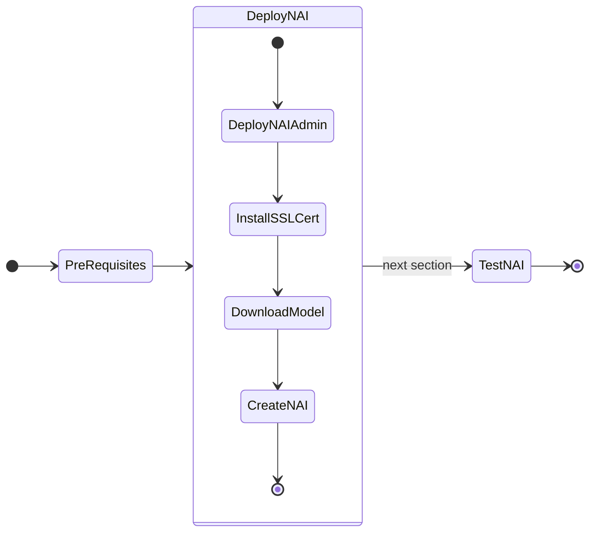

# Deploying Nutanix Enterprise AI (NAI) NVD Reference Application

!!! info "Version 2.3.0"

    This version of the NAI deployment is based on the Nutanix Enterprise AI (NAI) ``v2.3.0`` release.



## Prepare for NAI Deployment

Changes in NAI ``v2.4.0``

  - Istio Ingress gateway is replaced with Envoy Gateway
  - Knative is removed from NAI 
  - Kserve has been upgraded to 0.15.0

## Enable NKP Applications

Enable these NKP Applications from NKP GUI.

!!! note

    In this lab, we will be using the **Management Cluster Workspace** to deploy our Nutanix Enterprise AI (NAI)

    However, in a customer environment, it is recommended to use a separate workload NKP cluster.

!!! info

    The helm charts for these applications are stores in NKP's Chart Museum
    The container images are stored in internal Harbor registry. These images got uploaded to Harbor at the time of install NKE in this [section](../airgap_nai/infra_nkp_airgap.md#push-container-images-to-localprivate-registry-to-be-used-by-nkp).

1. In the NKP GUI, Go to **Clusters**
2. Click on **Management Cluster Workspace**
3. Go to **Applications** 
4. Search and enable the following applications: follow this order to install dependencies for NAI application
   
    - Kube-prometheus-stack: version ``70.4.2`` or later (pre-installed on NKP cluster)  
  
5. Login to VSC on the jumphost VM, append the following environment variables to the ``$HOME\airgap-nai\.env`` file and save it
   
    === "Template .env"

        ```bash
        export ENVIRONMENT=nkp
        export NAI_USER=_your_desired_nai_username
        export NAI_TEMP_PASS=_your_desired_nai_password # At least 8 characters
        ```

    === "Sample .env"

        ```{ .text .no-copy }
        export ENVIRONMENT=nkp
        export NAI_USER=admin
        export NAI_TEMP_PASS=_XXXXXXXXX # At least 8 characters
        ```

6. IN VSC,go to **Terminal** :octicons-terminal-24: and run the following commands to source the environment variables

    ```bash
    source $HOME/airgap-nai/.env
    ```

7. Enable Envoy Gateway ``v1.5.0`` using the following command
   
    === "Command"
    
        ```bash
        helm install envoy-gateway \
          oci://${REGISTRY_HOST}/gateway-helm \
          --version v1.5.0 \
          --set image.repository=$REGISTRY_HOST/envoyproxy/gateway \
          --set image.tag=v1.5.0 \
          -n envoy-gateway-system \
          --create-namespace
        ```

    === "Output"

        ```{ .text .no-copy }
        Pulled: harbor.10.x.x.111.nip.io/nkp/gateway-helm:v1.5.0
        Digest: sha256:2435a9cfcf22043b5ea2cdfe1e5783ec81f1dc527bff3c46c80c3ecc3ed66915
        NAME: envoy-gateway
        LAST DEPLOYED: Fri Aug 29 06:08:29 2025
        NAMESPACE: envoy-gateway-system
        STATUS: deployed
        REVISION: 1
        TEST SUITE: None
        ```

8. Check if Envoy Gateway resources are ready
   
    === "Command"
    
        ```bash
        kubectl wait --timeout=5m -n envoy-gateway-system deployment/envoy-gateway --for=condition=Available
        ```

    === "Output"

        ```{ .text .no-copy }
        deployment.apps/envoy-gateway condition met
        ```

9.  Run the Kserve CRD installation
     
     ```bash
     helm install kserve-crd \
       oci://${REGISTRY_HOST}/kserve-crd \
       --version v0.15.0 \
       -n kserve \
       --create-namespace 
     ```

10. Run the Kserve installation

    === "Command"
    
        ```bash
        helm install kserve \
          oci://${REGISTRY_HOST}/kserve \
          --version v0.15.0 \
          -n kserve \
          --set controller.image.repository=${REGISTRY_HOST}/kserve-controller \
          --set controller.image.tag=v0.15.0 \
          --set kserve.controller.deploymentMode=RawDeployment \
          --set kserve.controller.gateway.disableIngressCreation=true
        ```
    
    === "Output"
    
        ```{ .text .no-copy }
        Pulled: harbor.apj-cxrules.win/nkp/kserve:v0.15.0
        Digest: sha256:dae9d3e35c96d318bf3f5eb15e303ed6c268129f988f0b0b4ad698dc414d3f40
        NAME: kserve
        LAST DEPLOYED: Tue Sep  2 01:56:48 2025
        NAMESPACE: kserve
        STATUS: deployed
        REVISION: 1
        TEST SUITE: None
        ```

    ??? tip "Check helm deployment status"

        Check the status of the ``nai`` helm deployments using the following command:
        
        ```bash
        helm list -n envoy-gateway-system
        helm list -n kserve
        ```
        
## Deploy NAI

1. Source the environment variables (if not done so already)

    ```bash
    source $HOME/airgap-nai/.env
    ```

3. In `VSCode` Explorer pane, browse to ``$HOME/airgap-nai`` folder
   
4. Run the following command to create a helm values file:

    === "Command"

        ```bash
        cat << EOF > ${ENVIRONMENT}-values.yaml
        naiIepOperator:
          iepOperatorImage:
            image: ${REGISTRY_HOST}/nai-iep-operator
            tag: ${NAI_API_VERSION}
          modelProcessorImage:
            image: ${REGISTRY_HOST}/nai-model-processor
            tag: ${NAI_API_VERSION}
        naiInferenceUi:
          naiUiImage:
            image: ${REGISTRY_HOST}/nai-inference-ui
            tag: ${NAI_API_VERSION}
        naiApi:
          naiApiImage:
            image: ${REGISTRY_HOST}/nai-api
            tag: ${NAI_API_VERSION}
          supportedKserveRuntimeImage: ${REGISTRY_HOST}/nai-kserve-huggingfaceserver
          supportedKserveCPURuntimeImageTag: ${KSERVE_VERSION}
          supportedKserveGPURuntimeImageTag: ${KSERVE_VERSION}-gpu
          supportedKserveCustomModelServerRuntimeImage: ${REGISTRY_HOST}/nai-kserve-custom-model-server
          supportedKserveCustomModelServerRuntimeImageTag: ${NAI_API_VERSION}
          # Details of super admin (first user in the nai system)
          superAdmin:
            username: ${NAI_USER}
            password: ${NAI_TEMP_PASS} # At least 8 characters
            # email: admin@nutanix.com
            # firstName: admin
        #${REGISTRY_HOST}/nai-kserve-huggingfaceserver:kserve-version
          supportedTGIImage: ${REGISTRY_HOST}/nai-tgi
          supportedTGIImageTag: ${NAI_TGI_RUNTIME_VERSION}
        naiDatabase:
          naiDbImage:
            image: ${REGISTRY_HOST}/nai-postgres:${NAI_POSTGRESQL_VERSION}
        naiMonitoring:
          prometheus:
            image: 
              registry: ${REGISTRY_HOST}
              repository: prometheus/prometheus
              tag: ${NAI_PROMETHEUS_VERSION}
        EOF
        ```

    === "Sample NAI ``v2.4.0`` nkp-values.yaml"    
       
        ```yaml hl_lines="21"
        naiIepOperator:
          iepOperatorImage:
            image: harbor.10.x.x.111.nip.io/nkp/nai-iep-operator
            tag: v2.4.0
          modelProcessorImage:
            image: harbor.10.x.x.111.nip.io/nkp/nai-model-processor
            tag: v2.4.0
        naiInferenceUi:
          naiUiImage:
            image: harbor.10.x.x.111.nip.io/nkp/nai-inference-ui
            tag: v2.4.0
        naiApi:
          naiApiImage:
            image: harbor.10.x.x.111.nip.io/nkp/nai-api
            tag: v2.4.0
          supportedKserveRuntimeImage: harbor.10.x.x.111.nip.io/nkp/nai-kserve-huggingfaceserver
          supportedKserveCPURuntimeImageTag: "v0.15.2"
          supportedKserveGPURuntimeImageTag: "v0.15.2-gpu"
          supportedKserveCustomModelServerRuntimeImage: harbor.10.x.x.111.nip.io/nkp/nai-kserve-custom-model-server
          supportedKserveCustomModelServerRuntimeImageTag: "v2.4.0"
        # harbor.10.x.x.111.nip.io/nkp/nai-kserve-huggingfaceserver:kserve-version
          supportedTGIImage: harbor.10.x.x.111.nip.io/nkp/nai-tgi
          supportedTGIImageTag: "3.3.4-b2485c9"
          # Details of super admin (first user in the nai system)
          superAdmin:
            username: admin         
            password: _XXXXXXXXXX # At least 8 characters
            # email: admin@nutanix.com
            # firstName: admin
        naiDatabase:
          naiDbImage:
            image: harbor.10.x.x.111.nip.io/nkp/nai-postgres:16.1-alpine
        naiMonitoring:
          prometheus:
            image: 
              registry: harbor.10.x.x.111.nip.io/nkp
              repository: prometheus/prometheus
              tag: v2.54.0
        ```
        
5. In ``VSCode``, Under ``$HOME/airgap-nai`` folder, click on **New File** :material-file-plus-outline: and create a file with the following name:

    ```bash
    nai-deploy.sh
    ```

    with the following content:

    ```bash
    #!/usr/bin/env bash

    set -ex
    set -o pipefail

    helm upgrade --install nai-core --repo oci://${REGISTRY_HOST}/nai-core \
    --version=${NAI_CORE_VERSION} -n nai-system --create-namespace \
    --insecure-skip-tls-verify \
    -f ${ENVIRONMENT}-values.yaml --wait
    ```
   
6.  Run the following command to deploy NAI
   
    === "Command"

        ```bash
        $HOME/airgap-nai/nai-deploy.sh
        ```

    === "Command output"
      
        ```{ .text .no-copy }
        $HOME/airgap-nai/nai-deploy.sh 

        Release "nai-core" does not exist. Installing it now.
        Pulled: harbor.10.x.x.111.nip.i/nkp/nai-core:2.4.0
        Digest: sha256:283b8373ca76088d89fbf91482ef8530f6608f30085f84863e17edae77efe673
        NAME: nai-core
        LAST DEPLOYED: Tue Sep  2 01:31:15 2025
        NAMESPACE: nai-system
        STATUS: deployed
        REVISION: 1
        TEST SUITE: None
        ```

7.  Verify that the NAI Core Pods are running and healthy
    
    === "Command"

        ```bash
        kubens nai-system
        kubectl get po,deploy
        ```
    === "Command output"

        ```{ .text .no-copy }
        $ kubens nai-system
        ✔ Active namespace is "nai-system"

        $ kubectl get po,deploy

        NAME                                           READY   STATUS      RESTARTS   AGE
        pod/nai-api-db-migrate-tt6rn-cp5fc             0/1     Completed   1          7m
        pod/nai-api-fbc4f956d-h5vk2                    1/1     Running     0          7m
        pod/nai-db-0                                   1/1     Running     0          7m
        pod/nai-iep-model-controller-f84596945-ck5tk   1/1     Running     0          7m
        pod/nai-ui-d5b546bfc-82x6l                     1/1     Running     0          7m
        pod/prometheus-nai-0                           2/2     Running     0          7m

        NAME                                       READY   UP-TO-DATE   AVAILABLE   AGE
        deployment.apps/nai-api                    1/1     1            1           7m
        deployment.apps/nai-iep-model-controller   1/1     1            1           7m
        deployment.apps/nai-ui                     1/1     1            1           7m
        ```
        
??? "Uninstall NAI ``v2.3.0`` Dependencies"

    If you are upgrading NAI from ``v2.3.0`` to ``v2.4.0``, uninstall the following:

    If Helm was used:

    ```bash title="Uninstall Istio"
    helm uninstall istio-ingressgateway -n istio-system --wait --ignore-not-found
    helm uninstall istiod -n istio-system --wait --ignore-not-found
    helm uninstall istio-base -n istio-system --wait --ignore-not-found
    ```
    ```bash title="Uninstall Knative"
    kubectl delete --ignore-not-found=true KnativeServing knative-serving -n knative-serving
    helm uninstall knative-operator -n knative-serving --wait --ignore-not-found
    kubectl wait --for=delete pod --all -n knative-serving --timeout=300s
    ```

    If NKP Application were used for installation:

    Go to NKP Cluster Dashboard > Application > Search and Uninstall the following:

    1. Istio
    2. Knative 

## Install SSL Certificate and Gateway Elements

In this section we will install SSL Certificate to access the NAI UI. This is required as the endpoint will only work with a ssl endpoint with a valid certificate.

NAI UI is accessible using the Ingress Gateway.

The following steps show how cert-manager can be used to generate a self signed certificate using the default selfsigned-issuer present in the cluster. 

!!! info "If you are using Public Certificate Authority (CA) for NAI SSL Certificate"
    
    If an organization generates certificates using a different mechanism then obtain the certificate **+ key** and create a kubernetes secret manually using the following command:

    ```bash
    kubectl -n istio-system create secret tls nai-cert --cert=path/to/nai.crt --key=path/to/nai.key
    ```

    Skip the steps in this section to create a self-signed certificate resource.

1. Get the NAI UI ingress gateway host using the following command:
   
    ```bash
    NAI_UI_ENDPOINT=$(kubectl get svc -n envoy-gateway-system -l "gateway.envoyproxy.io/owning-gateway-name=nai-ingress-gateway,gateway.envoyproxy.io/owning-gateway-namespace=nai-system" -o jsonpath='{.items[0].status.loadBalancer.ingress[0].ip}' | grep -v '^$' || kubectl get svc -n envoy-gateway-system -l "gateway.envoyproxy.io/owning-gateway-name=nai-ingress-gateway,gateway.envoyproxy.io/owning-gateway-namespace=nai-system" -o jsonpath='{.items[0].status.loadBalancer.ingress[0].hostname}')
    ```

2. Get the value of ``NAI_UI_ENDPOINT`` environment variable
   
    === "Command"

        ```bash
        echo $NAI_UI_ENDPOINT
        ```

    === "Command output"

        ``` { .text .no-copy }
        10.x.x.216
        ```

3. We will use the command output e.g: ``10.x.x.216`` as the IP address for NAI as reserved in this [section](../infra/infra_nkp.md#reserve-control-plane-and-metallb-endpoint-ips)

4. Construct the FQDN of NAI UI using [nip.io](https://nip.io/) and we will use this FQDN as the certificate's Common Name (CN).
   
    === "Template URL"

        ```bash
        nai.${NAI_UI_ENDPOINT}.nip.io
        ```

    === "Sample URL"

        ``` { .text .no-copy }
        nai.10.x.x.216.nip.io
        ```

5. Create the ingress resource certificate using the following command:
   
    ```bash hl_lines="12 14 16"
    cat << EOF | k apply -f -
    apiVersion: cert-manager.io/v1
    kind: Certificate
    metadata:
      name: nai-cert
      namespace: nai-system
    spec:
      issuerRef:
        name: selfsigned-issuer
        kind: ClusterIssuer
      secretName: nai-cert
      commonName: nai.${NAI_UI_ENDPOINT}.nip.io
      dnsNames:
      - nai.${NAI_UI_ENDPOINT}.nip.io
      ipAddresses:
      - ${NAI_UI_ENDPOINT}
    EOF
    ```

6. Patch the Envoy gateway with the ``nai-cert`` certificate details
   
    ```bash
    kubectl patch gateway nai-ingress-gateway -n nai-system --type='json' -p='[{"op": "replace", "path": "/spec/listeners/1/tls/certificateRefs/0/name", "value": "nai-cert"}]'
    ```

7. Create EnvoyProxy
   
    ```bash
    k apply -f -<<EOF
    apiVersion: gateway.envoyproxy.io/v1alpha1
    kind: EnvoyProxy
    metadata:
      name: envoy-service-config
      namespace: nai-system
    spec:
      provider:
        type: Kubernetes
        kubernetes:
          envoyService:
            type: LoadBalancer
    EOF
    ```

8. Patch the ``nai-ingress-gateway`` resource with the new ``EnvoyProxy`` details

    ```bash
    kubectl patch gateway nai-ingress-gateway -n nai-system --type=merge \
    -p '{
        "spec": {
            "infrastructure": {
                "parametersRef": {
                    "group": "gateway.envoyproxy.io",
                    "kind": "EnvoyProxy",
                    "name": "envoy-service-config"
                }
            }
        }
    }'
    ```

## Accessing the UI

6. In a browser, open the following URL to connect to the NAI UI
   
    ```url
    https://nai.10.x.x.216.nip.io
    ```

7. Use the ``${NAI_USER}`` and ``${NAI_TEMP_PASS}`` values set in ``${ENVIRONMENT}-values.yaml`` files during ``helm`` installation of NAI ``v.2.4.0``
   
8. Change the password for the `admin` user
9.  Login using `admin` user and password.
   
    

## Download Model

We will download and user llama3 8B model which we sized for in the previous section.

1. In the NAI GUI, go to **Models**
2. Click on Import Model from Hugging Face
3. Choose the ``meta-llama/Meta-Llama-3.1-8B-Instruct`` model
4. Input your Hugging Face token that was created in the previous [section](../iep/iep_pre_reqs.md#create-a-hugging-face-token-with-read-permissions) and click **Import**

5. Provide the Model Instance Name as ``Meta-Llama-3.1-8B-Instruct`` and click **Import**
5. Go to VSC Terminal to monitor the download
    
    === "Command"

        ```bash title="Get jobs in nai-admin namespace"
        kubens nai-admin
        
        kubectl get jobs
        ```
        ```bash title="Validate creation of pods and PVC"
        kubectl get po,pvc
        ```
        ```bash title="Verify download of model using pod logs"
        kubectl logs -f _pod_associated_with_job
        ```

    === "Command output"

        ```text title="Get jobs in nai-admin namespace"
        kubens nai-admin

        ✔ Active namespace is "nai-admin"
     
        kubectl get jobs

        NAME                                       COMPLETIONS   DURATION   AGE
        nai-c0d6ca61-1629-43d2-b57a-9f-model-job   0/1           4m56s      4m56
        ```
        ```text title="Validate creation of pods and PVC"
        kubectl get po,pvc

        NAME                                             READY   STATUS    RESTARTS   AGE
        nai-c0d6ca61-1629-43d2-b57a-9f-model-job-9nmff   1/1     Running   0          4m49s

        NAME                                       STATUS   VOLUME                                     CAPACITY   ACCESS MODES   STORAGECLASS      VOLUMEATTRIBUTESCLASS   AGE
        nai-c0d6ca61-1629-43d2-b57a-9f-pvc-claim   Bound    pvc-a63d27a4-2541-4293-b680-514b8b890fe0   28Gi       RWX            nai-nfs-storage   <unset>                 2d
        ```
        ```text title="Verify download of model using pod logs"
        kubectl logs -f nai-c0d6ca61-1629-43d2-b57a-9f-model-job-9nmff 

        /venv/lib/python3.9/site-packages/huggingface_hub/file_download.py:983: UserWarning: Not enough free disk space to download the file. The expected file size is: 0.05 MB. The target location /data/model-files only has 0.00 MB free disk space.
        warnings.warn(
        tokenizer_config.json: 100%|██████████| 51.0k/51.0k [00:00<00:00, 3.26MB/s]
        tokenizer.json: 100%|██████████| 9.09M/9.09M [00:00<00:00, 35.0MB/s]<00:30, 150MB/s]
        model-00004-of-00004.safetensors: 100%|██████████| 1.17G/1.17G [00:12<00:00, 94.1MB/s]
        model-00001-of-00004.safetensors: 100%|██████████| 4.98G/4.98G [04:23<00:00, 18.9MB/s]
        model-00003-of-00004.safetensors: 100%|██████████| 4.92G/4.92G [04:33<00:00, 18.0MB/s]
        model-00002-of-00004.safetensors: 100%|██████████| 5.00G/5.00G [04:47<00:00, 17.4MB/s]
        Fetching 16 files: 100%|██████████| 16/16 [05:42<00:00, 21.43s/it]:33<00:52, 9.33MB/s]
        ## Successfully downloaded model_files|██████████| 5.00G/5.00G [04:47<00:00, 110MB/s] 

        Deleting directory : /data/hf_cache
        ```

6. Optional - verify the events in the namespace for the pvc creation 
    
    === "Command"

        ```bash
        k get events | awk '{print $1, $3}'
        ```

    === "Command output"

        ```{ .text, .no-copy}
        $ k get events | awk '{print $1, $3}'
    
        3m43s Scheduled
        3m43s SuccessfulAttachVolume
        3m36s Pulling
        3m29s Pulled
        3m29s Created
        3m29s Started
        3m43s SuccessfulCreate
        90s   Completed
        3m53s Provisioning
        3m53s ExternalProvisioning
        3m45s ProvisioningSucceeded
        3m53s PvcCreateSuccessful
        3m48s PvcNotBound
        3m43s ModelProcessorJobActive
        90s   ModelProcessorJobComplete
        ```

The model is downloaded to the Nutanix Files ``pvc`` volume.

After a successful model import, you will see it in **Active** status in the NAI UI under **Models** menu


## Create and Test Inference Endpoint

In this section we will create an inference endpoint using the downloaded model.

1. Navigate to **Inference Endpoints** menu and click on **Create Endpoint** button
2. Fill the following details:
   
    - **Endpoint Name**: ``llama-8b``
    - **Model Instance Name**: ``Meta-LLaMA-8B-Instruct``
    - **Use GPUs for running the models** : ``Checked``
    - **No of GPUs (per instance)**:
    - **GPU Card**: ``NVIDIA-L40S`` (or other available GPU)
    - **No of Instances**: ``1``
    - **API Keys**: Create a new API key or use an existing one

3. Click on **Create**
4. Monitor the ``nai-admin`` namespace to check if the services are coming up
   
    === "Command"

        ```bash
        kubens nai-admin
        kubectl get po,deploy
        ```

    === "Command output"
        
        ```{ .text .no-copy }
        kubens nai-admin
        get po,deploy
        NAME                                                     READY   STATUS        RESTARTS   AGE
        pod/llama8b-predictor-00001-deployment-9ffd786db-6wkzt   2/2     Running       0          71m

        NAME                                                 READY   UP-TO-DATE   AVAILABLE   AGE
        deployment.apps/llama8b-predictor-00001-deployment   1/1     1            0           3d17h
        ```

5. Check the events in the ``nai-admin`` namespace for resource usage to make sure all 
   
    === "Command"
       
        ```bash
        kubectl get events -n nai-admin --sort-by='.lastTimestamp' | awk '{print $1, $3, $5}'
        ```

    === "Command output"
       
        ```bash
        $ kubectl get events -n nai-admin --sort-by='.lastTimestamp' | awk '{print $1, $3, $5}'

        110s FinalizerUpdate Updated
        110s FinalizerUpdate Updated
        110s RevisionReady Revision
        110s ConfigurationReady Configuration
        110s LatestReadyUpdate LatestReadyRevisionName
        110s Created Created
        110s Created Created
        110s Created Created
        110s InferenceServiceReady InferenceService
        110s Created Created
        ```

6. Once the services are running, check the status of the inference service
   
    === "Command"

        ```bash
        kubectl get isvc
        ```

    === "Command output"
        
        ```{ .text .no-copy }
        kubectl get isvc

        NAME      URL                                          READY   PREV   LATEST   PREVROLLEDOUTREVISION   LATESTREADYREVISION       AGE
        llama8b   http://llama8b.nai-admin.svc.cluster.local   True           100                              llama8b-predictor-00001   3d17h
        ```
   
## Troubleshooting Endpoint ISVC 

!!! danger "TGI Imange and Self-signed Certificates"
    
    Only follow this procedure if this ``isvc`` is not starting up.

!!! warning "KNative Serving Image Tag Checking"

    From testing, we have identified that KServe module is making sure that there are no container image tag discrepencies, by pulling image using SHA digest. This is done to avoid pulling images that are updated without updating the tag.

    We have avoided this behavior by patching the ``config-deployment`` config map in the ``knative-serving`` namespace to skip image tag checking. Check this [Prepare for NAI Deployment](#prepare-for-nai-deployment) sectionfor more details.

    ```bash
    kubectl patch configmap  config-deployment -n knative-serving --type merge -p '{"data":{"registries-skipping-tag-resolving":"${REGISTRY_HOST}"}'
    ```

    If this procedure was not followed, then the ``isvc`` will not start up.

1. If the ``isvc`` is not coming up, then explore the events in ``nai-admin`` namespace.

    === "Command"
    
        ```bash
        kubens nai-admin
        kubectl get isvc
        kubectl get events  --sort-by='.lastTimestamp'
        ```
    
    === "Command output"
        
        ```text hl_lines="4 9"
        $ kubectl get isvc

        NAME      URL                                          READY   PREV   LATEST   PREVROLLEDOUTREVISION   LATESTREADYREVISION       AGE
        llama8b   http://llama8b.nai-admin.svc.cluster.local   False

        $ kubectl get events --sort-by='.lastTimestamp'
    
        Warning   InternalError         revision/llama8b-predictor-00001   Unable to fetch image "harbor.10.x.x.111.nip.io/nkp/nutanix/nai-tgi:2.3.1-825f39d": failed to resolve image to digest: 
        Get "https://harbor.10.x.x.111.nip.io/v2/": tls: failed to verify certificate: x509: certificate signed by unknown authority
        ```

    The temporary workaround is to use the TGI images SHA signature from the container registry.

    This site will be updated with resolutions for the above issues in the future.

2. Note the above TGI image SHA digest from the container registry.
   
    === "Command"

        ```bash
        docker pull ${REGISTRY_HOST}/nutanix/nai-tgi:${NAI_TGI_RUNTIME_VERSION}
        ```

    === "Command output"
        
        ```text hl_lines="4"
        docker pull harbor.10.x.x.111.nip.io/nkp/nutanix/nai-tgi:2.3.1-825f39d

        2.3.1-825f39d: Pulling from nkp/nutanix/nai-tgi
        Digest: sha256:2df9fab2cf86ab54c2e42959f23e6cfc5f2822a014d7105369aa6ddd0de33006
        Status: Image is up to date for harbor.10.x.x.111.nip.io/nkp/nutanix/nai-tgi:2.3.1-825f39d
        harbor.10.x.x.111.nip.io/nkp/nutanix/nai-tgi:2.3.1-825f39d
        ```

3. The SHA digest will look like the following:

    ```text title="TGI image SHA digest will be different for different environments"
    sha256:2df9fab2cf86ab54c2e42959f23e6cfc5f2822a014d7105369aa6ddd0de33006
    ```

4. Create a copy of the ``isvc`` manifest
   
    ```bash
    kubectl get isvc llama8b -n nai-admin -o yaml > llama8b.yaml
    ```

5. Edit the ``isvc``
   
     ```bash
     kubectl edit isvc llama8b -n nai-admin
     ```

6. Search and replace the ``image`` tag with the SHA digest from the TGI image.

    ```yaml hl_lines="6"
    <snip>

    env:
    - name: STORAGE_URI
      value: pvc://nai-c34d8d58-d6f8-4cb4-94e4-28-pvc-claim/model-files
      image: harbor.10.x.x.111.nip.io/nkp/nutanix/nai-tgi:2.3.1-825f39d

    <snip>
    ```
7. After replacing the image's SHA digest, the image value should look as follows: 
    
    ```yaml hl_lines="6"
    <snip>

    env:
    - name: STORAGE_URI
      value: pvc://nai-c34d8d58-d6f8-4cb4-94e4-28-pvc-claim/model-files
      image: harbor.10.x.x.111.nip.io/nkp/nutanix/nai-tgi@sha256:2df9fab2cf86ab54c2e42959f23e6cfc5f2822a014d7105369aa6ddd0de33006
    
    <snip>
    ```

8.  Save the ``isvc`` configuration by writing the changes to the file and exiting the vi editor using ``:wq!`` key combination.

9.  Verify that the ``isvc`` is running
    
    === "Command"

        ```bash
        kubens nai-admin
        kubectl get isvc
        ```

    === "Command output"
        
        ```bash hl_lines="4"
        $ kubectl get isvc

        NAME      URL                                          READY   PREV   LATEST   PREVROLLEDOUTREVISION   LATESTREADYREVISION       AGE
        llama8b   http://llama8b.nai-admin.svc.cluster.local   True           100                              llama8b-predictor-00001   3d17h
        ```

This should resolve the issue the issue with the TGI image.

!!! note "Report Other Issues"

    If you are facing any other issues, please report them here in the [NAI LLM GitHub Repo Issues](https://github.com/nutanix-japan/nai-llm/issues) page.