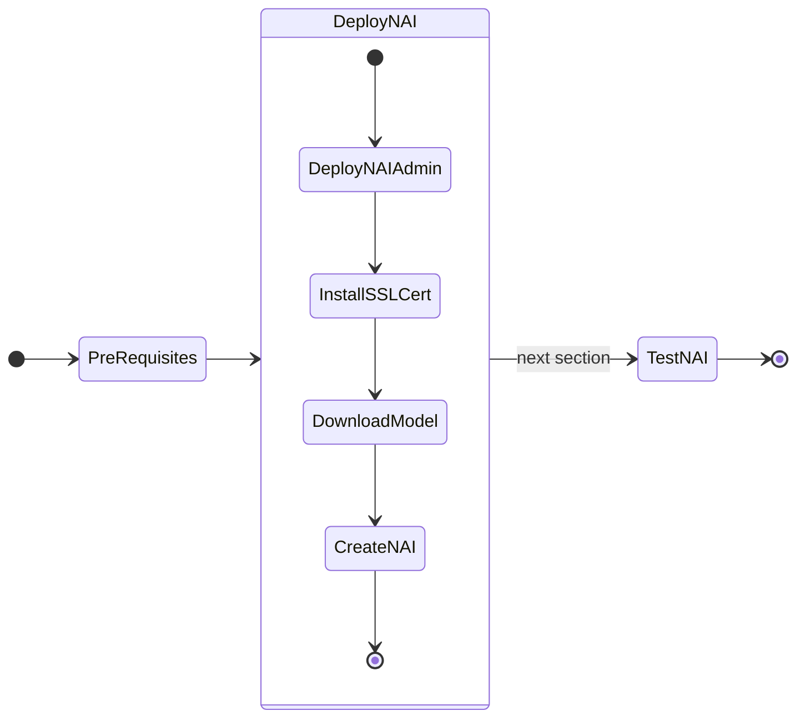
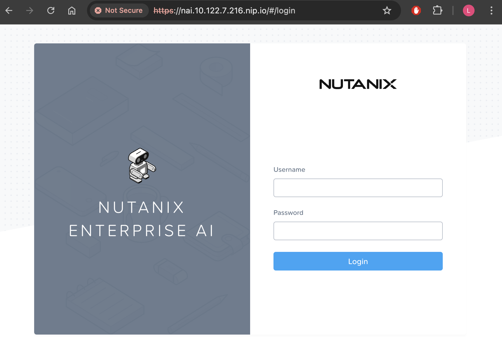

# Deploying GPT-in-a-Box v2 NVD Reference Application



## Prepare for NAI Deployment

1. Login to VSC on the jumphost VM, append the following environment variables to the ``$HOME\airgap-nai\.env`` file and save it
   
    === "Template .env"

        ```text
        export KOMMANDER_CLUSTER_HOSTNAME=_ip_or_hostname_of_kommander_dashboard_url
        export INTERNAL_REPO=https://${KOMMANDER_CLUSTER_HOSTNAME}/dkp/kommander/helm-mirror
        export ENVIRONMENT=nkp
        export REGISTRY_URL=_your_registry_url
        ```

    === "Sample .env"

        ```text
        export KOMMANDER_CLUSTER_HOSTNAME="10.x.x.214"
        export INTERNAL_REPO=https://${KOMMANDER_CLUSTER_HOSTNAME}/dkp/kommander/helm-mirror
        export ENVIRONMENT=nkp
        export REGISTRY_URL="https://harbor.10.x.x.111.nip.io/nkp"
        ```

2. IN VSC,go to **Terminal** :octicons-terminal-24: and run the following commands to source the environment variables

    ```bash
    source $HOME/airgap-nai/.env
    ```

3. In ``VSCode``, under the newly created ``airgap-nai`` folder, click on **New File** :material-file-plus-outline: and create file with the following name:

    ```bash
    nai-prepare.sh
    ```

    with the following content:

    ```bash
    #!/usr/bin/env bash

    set -ex
    set -o pipefail

    ## Deploy Istio 1.20.8
    helm --insecure-skip-tls-verify=true upgrade --install istio-base base --repo ${INTERNAL_REPO} --version=${ISTIO_VERSION} -n istio-system --create-namespace --wait

    helm --insecure-skip-tls-verify=true upgrade --install istiod istiod --repo ${INTERNAL_REPO} --version=${ISTIO_VERSION} -n istio-system \
    --set gateways.securityContext.runAsUser=0 \
    --set gateways.securityContext.runAsGroup=0 --wait

    helm --insecure-skip-tls-verify=true upgrade --install istio-ingressgateway gateway --repo ${INTERNAL_REPO} --version=${ISTIO_VERSION} -n istio-system \
    --set securityContext.runAsUser=0 --set securityContext.runAsGroup=0 \
    --set containerSecurityContext.runAsUser=0 --set containerSecurityContext.runAsGroup=0 --wait

    ## Deploy Knative 
    helm --insecure-skip-tls-verify=true upgrade --install knative-serving-crds nai-knative-serving-crds --repo ${INTERNAL_REPO} --version=${KNATIVE_VERSION} -n knative-serving --create-namespace --wait

    helm --insecure-skip-tls-verify=true upgrade --install knative-serving nai-knative-serving --repo ${INTERNAL_REPO} -n knative-serving --version=${KNATIVE_VERSION} --wait

    
    helm --insecure-skip-tls-verify=true upgrade --install knative-istio-controller nai-knative-istio-controller --repo ${INTERNAL_REPO} -n knative-serving --version=${KNATIVE_VERSION} --wait
    
    # Patch configurations stored in configmaps

    kubectl patch configmap config-features -n knative-serving -p '{"data":{"kubernetes.podspec-nodeselector":"enabled"}}'

    kubectl patch configmap config-autoscaler -n knative-serving -p '{"data":{"enable-scale-to-zero":"false"}}'

    kubectl patch configmap  config-domain -n knative-serving --type merge -p '{"data":{"example.com":""}}'

    ## Deploy Kserve
    helm --insecure-skip-tls-verify=true upgrade --install kserve-crd kserve-crd --repo ${INTERNAL_REPO} --version=${KSERVE_VERSION} -n kserve --create-namespace

    helm --insecure-skip-tls-verify=true upgrade --install kserve kserve --repo ${INTERNAL_REPO} --version=${KSERVE_VERSION} -n kserve \
    --set kserve.modelmesh.enabled=false \
    --set kserve.controller.image="docker.io/nutanix/nai-kserve-controller" \
    --set kserve.controller.tag=${KSERVE_VERSION} --wait
    ```

4. Run the script from the Terminal

    === "Command"

        ```bash
        chmod +x $HOME/nai/nai-prepare.sh
        $HOME/nai/nai-prepare.sh
        ```
        
    === "Command output"

        ```{ .text .no-copy }
        Release "istiod" has been upgraded. Happy Helming!
        NAME: istiod
        LAST DEPLOYED: Tue Oct 15 02:01:58 2024
        NAMESPACE: istio-system
        STATUS: deployed
        REVISION: 2
        TEST SUITE: None
        NOTES:
        "istiod" successfully installed!

        NAME: istio-ingressgateway
        LAST DEPLOYED: Tue Oct 15 02:02:01 2024
        NAMESPACE: istio-system
        STATUS: deployed

        NAME: knative-serving-crds
        LAST DEPLOYED: Tue Oct 15 02:02:03 2024
        NAMESPACE: knative-serving
        STATUS: deployed

        NAME: knative-serving
        LAST DEPLOYED: Tue Oct 15 02:02:05 2024
        NAMESPACE: knative-serving
        STATUS: deployed

        NAME: kserve-crd
        LAST DEPLOYED: Tue Oct 15 02:02:16 2024
        NAMESPACE: kserve
        STATUS: deployed

        NAME: kserve
        LAST DEPLOYED: Tue Oct 15 02:02:19 2024
        NAMESPACE: kserve
        STATUS: deployed
        ```

    ??? tip "Check helm deployment status"

        Check the status of the ``nai`` helm deployments using the following command:
        
        ```bash
        helm list -n istio-system
        helm list -n kserve
        helm list -n knative-serving
        ```


5. Validate if the resources are running in the following namespaces.

    - `istio-system`, 
    - `knative-serving`, and 
    - `kserve`
   
    === "Command"

        ```bash
        kubectl get po -n istio-system
        k get po -n kserve
        k get po -n knative-serving
        ```
        
    === "Command output"

        ```{ .text .no-copy }
        $ k get po -n istio-system
        NAME                                    READY   STATUS    RESTARTS   AGE
        istio-ingressgateway-6675867d85-qzrpq   1/1     Running   0          26d
        istiod-6d96569c9b-2dww4                 1/1     Running   0          26d

        $ k get po -n kserve
        NAME                                         READY   STATUS    RESTARTS   AGE
        kserve-controller-manager-6654f69d5c-45n64   2/2     Running   0          26d

        $ k get po -n knative-serving
        NAME                                   READY   STATUS    RESTARTS   AGE
        activator-58db57894b-g2nx8             1/1     Running   0          26d
        autoscaler-76f95fff78-c8q9m            1/1     Running   0          26d
        controller-7dd875844b-4clqb            1/1     Running   0          26d
        net-istio-controller-57486f879-85vml   1/1     Running   0          26d
        net-istio-webhook-7ccdbcb557-54dn5     1/1     Running   0          26d
        webhook-d8674645d-mscsc                1/1     Running   0          26d
        ```
        
## Deploy NAI

1. Source the environment variables (if not done so already)

    ```bash
    source $HOME/airgap-nai/.env
    ```

3. In `VSCode` Explorer pane, browse to ``$HOME/airgap-nai`` folder
   
4. Click on **New File** :material-file-plus-outline: and create file with the following name:

    ```bash
    iep-values-nkp.yaml
    ```

    with the following content:

    ```yaml
    ## Image pull secret. This is required for the huggingface image check by the Inference pod as that does not go via the kubelet and does a direct check.
    imagePullSecret:
      ## Name of the image pull secret
      name: nai-iep-secret
    ## Image registry credentials
      credentials:
        registry: ${REGISTRY_URL}
        username: ${REGISTRY_USERNAME}
        password: ${REGISTRY_PASSWORD}
        email: ${REGISTRY_USERNAME}@foobar.com
    naiApi:
      naiApiImage:
        tag: ${NAI_API_VERSION}  
      supportedRuntimeImage: ${REGISTRY_URL}/nutanix/nai-kserve-huggingfaceserver:v0.13.1
    ## nai-monitoring stack values for nai-monitoring stack deployment in NKE environment
    naiMonitoring:
      ## Component scraping node exporter
      ##
      nodeExporter:
        serviceMonitor:
          enabled: true
          endpoint:
            port: http-metrics
            scheme: http
            targetPort: 9100
        namespaceSelector:
          matchNames:
          - kommander
        serviceSelector:
          matchLabels:
            app.kubernetes.io/name: prometheus-node-exporter
            app.kubernetes.io/component: metrics
            app.kubernetes.io/version: 1.8.1
    ## Component scraping dcgm exporter
    ##
      dcgmExporter:
        podLevelMetrics: true
        serviceMonitor:
          enabled: true
          endpoint:
            targetPort: 9400
          namespaceSelector:
            matchNames:
            - kommander
          serviceSelector:
            matchLabels:
               app: nvidia-dcgm-exporter
    ```

5. In ``VSCode``, Under ``$HOME/airgap-nai`` folder, click on **New File** :material-file-plus-outline: and create a file with the following name:

    ```bash
    nai-deploy.sh
    ```

    with the following content:

    ```bash
    #!/usr/bin/env bash

    set -ex
    set -o pipefail

    helm upgrade --install nai-core nai-core --repo ${INTERNAL_REPO} \
    --version=${NAI_CORE_VERSION} -n nai-system --create-namespace \
    --insecure-skip-tls-verify \
    -f ${ENVIRONMENT}-values.yaml --wait
    ```
   
6.  Run the following command to deploy NAI
   
    === "Command"

        ```bash
        $HOME/airgap-nai/nai-deploy.sh
        ```

    === "Command output"
      
        ```{ .text .no-copy }
        $HOME/nai/nai-deploy.sh 

        + set -o pipefail
        + helm repo add ntnx-charts https://nutanix.github.io/helm-releases
        "ntnx-charts" already exists with the same configuration, skipping
        + helm repo update ntnx-charts
        Hang tight while we grab the latest from your chart repositories...
        ...Successfully got an update from the "ntnx-charts" chart repository
        Update Complete. ⎈Happy Helming!⎈
        helm upgrade --install nai-core ntnx-charts/nai-core --version=$NAI_CORE_VERSION -n nai-system --create-namespace --wait \
        --set imagePullSecret.credentials.username=$DOCKER_USERNAME \
        --set imagePullSecret.credentials.password=$DOCKER_PASSWORD \
        --set naiApi.naiApiImage.tag=v1.0.0-rc2 \
        --insecure-skip-tls-verify \
        -f iep-values-nkp.yaml
        Release "nai-core" has been upgraded. Happy Helming!
        NAME: nai-core
        LAST DEPLOYED: Mon Sep 16 22:07:24 2024
        NAMESPACE: nai-system
        STATUS: deployed
        REVISION: 7
        TEST SUITE: None
        ```

7.  Verify that the NAI Core Pods are running and healthy
    
    === "Command"

        ```bash
        kubens nai-system
        kubectl get po,deploy
        ```
    === "Command output"

        ```{ .text .no-copy }
        $ kubens nai-system
        ✔ Active namespace is "nai-system"

        $ kubectl get po,deploy

        NAME                                            READY   STATUS      RESTARTS   AGE
        pod/nai-api-55c665dd67-746b9                    1/1     Running     0          5d1h
        pod/nai-api-db-migrate-fdz96-xtmxk              0/1     Completed   0          40h
        pod/nai-db-789945b4df-lb4sd                     1/1     Running     0          43h
        pod/nai-iep-model-controller-84ff5b5b87-6jst9   1/1     Running     0          5d8h
        pod/nai-ui-7fc65fc6ff-clcjl                     1/1     Running     0          5d8h
        pod/prometheus-nai-0                            2/2     Running     0          43h

        NAME                                       READY   UP-TO-DATE   AVAILABLE   AGE
        deployment.apps/nai-api                    1/1     1            1           5d8h
        deployment.apps/nai-db                     1/1     1            1           5d8h
        deployment.apps/nai-iep-model-controller   1/1     1            1           5d8h
        deployment.apps/nai-ui                     1/1     1            1           5d8h
        ```

## Install SSL Certificate

In this section we will install SSL Certificate to access the NAI UI. 

1. We will use ``10.x.x.216`` as the IP address for NAI as reserved in this [section](../infra/infra_nkp.md#reserve-control-plane-and-metallb-endpoint-ips). 

2. Construct the FQDN of NAI UI using [nip.io](https://nip.io/) and we will use this FQDN as the certificate's Common Name (CN).
   
    ```url title="Example URL"
    nai.10.x.x.216.nip.io
    ```

3. In VSC Explorer, go to ``$HOME/nai`` folder, click on **New File** :material-file-plus-outline:  and create a file with the following name
   
    ```bash
    nkp-cert.yaml
    ``` 
   
    Add the following content to the file and replace the IP address with the IP address of ingress gateway:

    Replace the values in the highlighted lines with the IP address of ingress gateway that was reserved in this [section](../infra/infra_nkp.md#reserve-control-plane-and-metallb-endpoint-ips).
   
    ```yaml hl_lines="11 13 15"
    apiVersion: cert-manager.io/v1
    kind: Certificate
    metadata:
      name: nkp-cert
      namespace: istio-system
    spec:
      issuerRef:
        name: selfsigned-issuer
        kind: ClusterIssuer
      secretName: nkp-cert
      commonName: nai.10.x.x.216.nip.io
      dnsNames:
        - nai.10.x.x.216.nip.io
      ipAddresses:
        - 10.x.x.216
    ```

4. Create the certificate using the following command
    
    ```bash
    kubectl apply -f $HOME/nai/nkp-cert.yaml
    ```

5. Patch the ingress gateway's IP address to the certificate file.
    
    === "Command"
   
        ```bash
        kubectl patch gateway -n knative-serving knative-ingress-gateway --type merge --patch-file=/dev/stdin <<EOF
        spec:
          servers:
          - hosts:
            - '*'
            port:
              name: https
              number: 443
              protocol: HTTPS
            tls:
              mode: SIMPLE
              credentialName: nkp-cert
        EOF
        ```

    === "Command output"
     
        ```{ .text .no-copy }
        gateway.networking.istio.io/knative-ingress-gateway patched 
        ```

## Accessing the UI

6. In a browser, open the following URL to connect to the NAI UI
   
    ```url
    https://nai.10.x.x.216.nip.io
    ```

7. Change the password for the `admin` user
8. Login using `admin` user and password.
   
    

## Download Model

We will download and user llama3 8B model which we sized for in the previous section.

1. In the NAI GUI, go to **Models**
2. Click on Import Model from Hugging Face
3. Choose the ``meta-llama/Meta-Llama-3.1-8B-Instruct`` model
4. Input your Hugging Face token that was created in the previous [section](../iep/iep_pre_reqs.md#create-a-hugging-face-token-with-read-permissions) and click **Import**

5. Provide the Model Instance Name as ``Meta-Llama-3.1-8B-Instruct`` and click **Import**
5. Go to VSC Terminal to monitor the download
    
    === "Command"

        ```bash title="Get jobs in nai-admin namespace"
        kubens nai-admin
        
        kubectl get jobs
        ```
        ```bash title="Validate creation of pods and PVC"
        kubectl get po,pvc
        ```
        ```bash title="Verify download of model using pod logs"
        kubectl logs -f _pod_associated_with_job
        ```

    === "Command output"

        ```text title="Get jobs in nai-admin namespace"
        kubens nai-admin

        ✔ Active namespace is "nai-admin"
     
        kubectl get jobs

        NAME                                       COMPLETIONS   DURATION   AGE
        nai-c0d6ca61-1629-43d2-b57a-9f-model-job   0/1           4m56s      4m56
        ```
        ```text title="Validate creation of pods and PVC"
        kubectl get po,pvc

        NAME                                             READY   STATUS    RESTARTS   AGE
        nai-c0d6ca61-1629-43d2-b57a-9f-model-job-9nmff   1/1     Running   0          4m49s

        NAME                                       STATUS   VOLUME                                     CAPACITY   ACCESS MODES   STORAGECLASS      VOLUMEATTRIBUTESCLASS   AGE
        nai-c0d6ca61-1629-43d2-b57a-9f-pvc-claim   Bound    pvc-a63d27a4-2541-4293-b680-514b8b890fe0   28Gi       RWX            nai-nfs-storage   <unset>                 2d
        ```
        ```text title="Verify download of model using pod logs"
        kubectl logs -f nai-c0d6ca61-1629-43d2-b57a-9f-model-job-9nmff 

        /venv/lib/python3.9/site-packages/huggingface_hub/file_download.py:983: UserWarning: Not enough free disk space to download the file. The expected file size is: 0.05 MB. The target location /data/model-files only has 0.00 MB free disk space.
        warnings.warn(
        tokenizer_config.json: 100%|██████████| 51.0k/51.0k [00:00<00:00, 3.26MB/s]
        tokenizer.json: 100%|██████████| 9.09M/9.09M [00:00<00:00, 35.0MB/s]<00:30, 150MB/s]
        model-00004-of-00004.safetensors: 100%|██████████| 1.17G/1.17G [00:12<00:00, 94.1MB/s]
        model-00001-of-00004.safetensors: 100%|██████████| 4.98G/4.98G [04:23<00:00, 18.9MB/s]
        model-00003-of-00004.safetensors: 100%|██████████| 4.92G/4.92G [04:33<00:00, 18.0MB/s]
        model-00002-of-00004.safetensors: 100%|██████████| 5.00G/5.00G [04:47<00:00, 17.4MB/s]
        Fetching 16 files: 100%|██████████| 16/16 [05:42<00:00, 21.43s/it]:33<00:52, 9.33MB/s]
        ## Successfully downloaded model_files|██████████| 5.00G/5.00G [04:47<00:00, 110MB/s] 

        Deleting directory : /data/hf_cache
        ```

6. Optional - verify the events in the namespace for the pvc creation 
    
    === "Command"

        ```bash
        k get events | awk '{print $1, $3}'
        ```

    === "Command output"

        ```{ .text, .no-copy}
        $ k get events | awk '{print $1, $3}'
    
        3m43s Scheduled
        3m43s SuccessfulAttachVolume
        3m36s Pulling
        3m29s Pulled
        3m29s Created
        3m29s Started
        3m43s SuccessfulCreate
        90s   Completed
        3m53s Provisioning
        3m53s ExternalProvisioning
        3m45s ProvisioningSucceeded
        3m53s PvcCreateSuccessful
        3m48s PvcNotBound
        3m43s ModelProcessorJobActive
        90s   ModelProcessorJobComplete
        ```

The model is downloaded to the Nutanix Files ``pvc`` volume.

After a successful model import, you will see it in **Active** status in the NAI UI under **Models** menu


## Create and Test Inference Endpoint

In this section we will create an inference endpoint using the downloaded model.

1. Navigate to **Inference Endpoints** menu and click on **Create Endpoint** button
2. Fill the following details:
   
    - **Endpoint Name**: ``llama-8b``
    - **Model Instance Name**: ``Meta-LLaMA-8B-Instruct``
    - **Use GPUs for running the models** : ``Checked``
    - **No of GPUs (per instance)**:
    - **GPU Card**: ``NVIDIA-L40S`` (or other available GPU)
    - **No of Instances**: ``1``
    - **API Keys**: Create a new API key or use an existing one

3. Click on **Create**
4. Monitor the ``nai-admin`` namespace to check if the services are coming up
   
    === "Command"

        ```bash
        kubens nai-admin
        kubectl get po,deploy
        ```

    === "Command output"
        
        ```{ .text .no-copy }
        kubens nai-admin
        get po,deploy
        NAME                                                     READY   STATUS        RESTARTS   AGE
        pod/llama8b-predictor-00001-deployment-9ffd786db-6wkzt   2/2     Running       0          71m

        NAME                                                 READY   UP-TO-DATE   AVAILABLE   AGE
        deployment.apps/llama8b-predictor-00001-deployment   1/1     1            0           3d17h
        ```

5. Check the events in the ``nai-admin`` namespace for resource usage to make sure all 
   
    === "Command"
       
        ```bash
        kubectl get events -n nai-admin --sort-by='.lastTimestamp' | awk '{print $1, $3, $5}'
        ```

    === "Command output"
       
        ```bash
        $ kubectl get events -n nai-admin --sort-by='.lastTimestamp' | awk '{print $1, $3, $5}'

        110s FinalizerUpdate Updated
        110s FinalizerUpdate Updated
        110s RevisionReady Revision
        110s ConfigurationReady Configuration
        110s LatestReadyUpdate LatestReadyRevisionName
        110s Created Created
        110s Created Created
        110s Created Created
        110s InferenceServiceReady InferenceService
        110s Created Created
        ```

6. Once the services are running, check the status of the inference service
   
    === "Command"

        ```bash
        kubectl get isvc
        ```

    === "Command output"
        
        ```{ .text .no-copy }
        kubectl get isvc

        NAME      URL                                          READY   PREV   LATEST   PREVROLLEDOUTREVISION   LATESTREADYREVISION       AGE
        llama8b   http://llama8b.nai-admin.svc.cluster.local   True           100                              llama8b-predictor-00001   3d17h
        ```