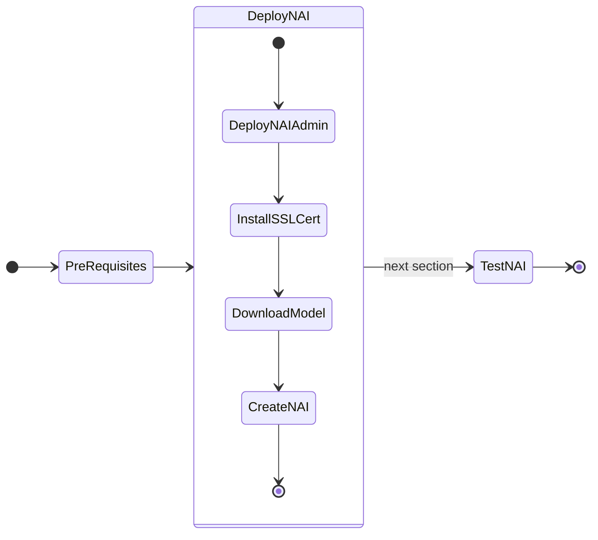

# Deploying Nutanix Enterprise AI (NAI) NVD Reference Application

!!! info "Version 2.6.0"

    This version of the NAI deployment is based on the Nutanix Enterprise AI (NAI) ``v2.6.0`` release.


```mermaid
stateDiagram-v2
    direction LR
    
    state DeployNAI {
        [*] --> DeployNAIAdmin
        DeployNAIAdmin -->  InstallSSLCert
        InstallSSLCert --> DownloadModel
        DownloadModel --> CreateNAI
        CreateNAI --> [*]
    }

    [*] --> PreRequisites
    PreRequisites --> DeployNAI 
    DeployNAI --> TestNAI : next section
    TestNAI --> [*]
```

## Prepare for NAI Deployment

Changes in NAI ``v2.6.0``

  - Kserve is of at least of ``v0.15.0``
  - Cert-manager is at least of ``v1.17.2``
  - OpenTelemetry operator is at least of ``v0.102.0``

### Enable Pre-requisite Applications  

!!! example "Early Access(EA)/Technical Preview(TP) Software with NAI v2.6.0"
    
    In this lab, we will deploy EA and TP version of the following software to test the following:

    -  Nutanix Enterprise AI 
  
        * Unified Endpoints - multiple endpoints for HA and token-based rate limiting
        * Providers - Add remote endpoints from providers to utilize their models in Nutanix Enterprise AI workloads.

We will enable the following pre-requisite applications through command line:

   - Envoy Gateway ``v1.6.3`` in AI Gateway mode
   - Kserve: ``v0.15.0`` in raw deployment mode
   
!!! note
    The following application are pre-installed on NKP cluster with Pro license

    - Cert Manager ``v1.17.2`` or higher
    
    Check if Cert Manager is installed (pre-installed on NKP cluster)

    If not, install using the following command:
   
    === ":octicons-command-palette-16: Command"
    
        ```bash
        kubectl get deploy -n cert-manager
        ```

    === ":octicons-command-palette-16: Output"

        ```{ .text .no-copy }
        $ kubectl get deploy -n cert-manager

        NAME                      READY   UP-TO-DATE   AVAILABLE   AGE
        cert-manager              1/1     1            1           145m
        cert-manager-cainjector   1/1     1            1           145m
        cert-manager-webhook      1/1     1            1           145m
        ```

    If not installed, use the following command to install it

    ```bash
    kubectl apply -f https://github.com/cert-manager/cert-manager/releases/download/v1.17.2/cert-manager.yaml
    ```

## Enable NKP Applications

Enable these NKP Applications from NKP GUI.

!!! note

    In this lab, we will be using the **Management Cluster Workspace** to deploy our Nutanix Enterprise AI (NAI)

    However, in a customer environment, it is recommended to use a separate workload NKP cluster.

!!! info

    The helm charts and the container images for these applications are stored in internal Harbor registry. These images got uploaded to Harbor at the time of install NKE in this [section](../airgap_nai/infra_nkp_airgap.md#push-container-images-to-localprivate-registry-to-be-used-by-nkp).

1. In the NKP GUI, Go to **Clusters**
2. Click on **Management Cluster Workspace**
3. Go to **Applications** 
4. Search and enable the following applications: follow this order to install dependencies for NAI application
   
    - Kube-prometheus-stack: version ``71.0.0`` or later (pre-installed on NKP cluster)
    - Cert-manager - v1.17.2
    
    !!! note

        The following application are pre-installed on NKP cluster with Pro license
    
        - Cert Manager ``v1.17.2`` or higher
        
        Check if Cert Manager is installed (pre-installed on NKP cluster if license is installed)
       
        === ":octicons-command-palette-16: Command"
        
            ```bash
            kubectl get deploy -n cert-manager
            ```
    
        === ":octicons-command-palette-16: Output"
    
            ```{ .text .no-copy }
            $ kubectl get deploy -n cert-manager
    
            NAME                      READY   UP-TO-DATE   AVAILABLE   AGE
            cert-manager              1/1     1            1           145m
            cert-manager-cainjector   1/1     1            1           145m
            cert-manager-webhook      1/1     1            1           145m
            ```
    
        If not installed, use the following command to install it
    
        === ":octicons-command-palette-16: Command"
        
            ```bash
            kubectl apply -f https://github.com/cert-manager/cert-manager/releases/download/v1.17.2/cert-manager.yaml
            ```
  
5. Login to VSC on the jumphost VM, append the following environment variables to the ``$HOME\airgap-nai\.env`` file and save it
   
    === ":octicons-file-code-16: Template ``$HOME\airgap-nai\.env``"

        ```bash
        export NAI_USER=_your_desired_nai_ui_username
        export NAI_TEMP_PASS=_your_desired_nai_ui_password # At least 8 characters
        export REGISTRY=_your_private_registry
        export REGISTRY_USERNAME=admin
        export REGISTRY_PASSWORD=_your_password
        export REGISTRY_EMAIL=admin
        export IMAGE_PULL_SECRET=_your_desired_pull_secret_name
        ```

    === ":octicons-file-code-16: Sample ``$HOME\airgap-nai\.env``"

        ```{ .text .no-copy }
        export NAI_USER=admin
        export NAI_TEMP_PASS=_XXXXXXXXX # At least 8 characters
        export REGISTRY=harbor.10.x.x.x.nip.io/
        export REGISTRY_USERNAME=admin
        export REGISTRY_PASSWORD=XXXXXXXXXXX
        export REGISTRY_EMAIL=admin
        export IMAGE_PULL_SECRET=private-regcred
        ```
  
6. IN VSC,go to **Terminal** :octicons-terminal-24: and run the following commands to source the environment variables

    ```bash
    source $HOME/airgap-nai/.env
    ```

7. Enable Envoy Gateway CRDs ``v1.6.3`` in **AI gateway mode**
   
    === "Command"
    
        ```bash
        helm install eg oci://${REGISTRY_HOST}/gateway-helm \
          --version v1.5.0 \
          -n envoy-gateway-system \
          --create-namespace \
          --wait \
          --set global.images.envoyGateway.image=${REGISTRY_HOST}/nutanix/nai-gateway:v1.5.0 \
          --set global.images.ratelimit.image=${REGISTRY_HOST}/nutanix/nai-ratelimit:3e085e5b
        ```

    === "Command Output"

        ```{ .text .no-copy }
        Pulled: harbor.10.x.x.134.nip.io/nkp/gateway-helm:v1.5.0
        Digest: sha256:4e49511296e23e3d1400c92cfb38a5c26030501ec7353883e4ccad9fd7cc4c2c
        NAME: eg
        LAST DEPLOYED: Thu Feb 26 00:58:39 2026
        NAMESPACE: envoy-gateway-system
        STATUS: deployed
        REVISION: 1
        TEST SUITE: None
        NOTES:
        **************************************************************************
        *** PLEASE BE PATIENT: Envoy Gateway may take a few minutes to install ***
        **************************************************************************
        
        Envoy Gateway is an open source project for managing Envoy Proxy as a standalone or Kubernetes-based application gateway.
        
        Thank you for installing Envoy Gateway! 🎉
        
        Your release is named: eg. 🎉
        
        Your release is in namespace: envoy-gateway-system. 🎉
        
        To learn more about the release, try:
        
          $ helm status eg -n envoy-gateway-system
          $ helm get all eg -n envoy-gateway-system
        
        To have a quickstart of Envoy Gateway, please refer to https://gateway.envoyproxy.io/latest/tasks/quickstart.
        
        To get more details, please visit https://gateway.envoyproxy.io and https://github.com/envoyproxy/gateway.
        ```

8.  Check if Envoy Gateway resources are ready
   
    === "Command"
    
        ```bash
        kubectl wait --timeout=5m -n envoy-gateway-system deployment/envoy-gateway --for=condition=Available
        ```

    === "Output"

        ```{ .text .no-copy }
        deployment.apps/envoy-gateway condition met
        ```

9.  Create an Envoy Proxy resource for the Envoy Gateway to pull image from local private registry:
     
     ```bash
     cat <<EOF | kubectl apply -f -
     apiVersion: gateway.envoyproxy.io/v1alpha1
     kind: EnvoyProxy
     metadata:
       name: nai-envoyproxy
       namespace: envoy-gateway-system
     spec:
       provider:
         type: Kubernetes
         kubernetes:
           envoyDeployment:
             pod:
               imagePullSecrets:
                 - name: registry-image-pull-secret
             container:
               image: "${REGISTRY_HOST}/nutanix/nai-envoy:distroless-v1.35.0"
     EOF
     ```

10. Run the Kserve CRD installation
     
     ```bash
     helm install kserve-crd \
       oci://${REGISTRY_HOST}/kserve-crd \
       --version v0.15.0 \
       -n kserve \
       --create-namespace 
     ```

11. Run the Kserve installation

    === "Command"
    
        ```bash
        helm install kserve \
          oci://${REGISTRY_HOST}/kserve \
          --version v0.15.0 \
          -n kserve \
          --set controller.image.repository=${REGISTRY_HOST}/kserve-controller \
          --set controller.image.tag=v0.15.0 \
          --set kserve.controller.deploymentMode=RawDeployment \
          --set kserve.controller.gateway.disableIngressCreation=true
        ```
    
    === "Output"
    
        ```{ .text .no-copy }
        Pulled: harbor.10.x.x.134.nip.io/nkp/kserve:v0.15.0
        Digest: sha256:cafd90ab1d91a54a28c1ff2761d976bdda0bb173675ef392a16ac250b044d15f
        I0226 01:59:34.229355  555781 warnings.go:110] "Warning: spec.privateKey.rotationPolicy: In cert-manager >= v1.18.0, the default value changed from `Never` to `Always`."
        NAME: kserve
        LAST DEPLOYED: Thu Feb 26 01:59:33 2026
        NAMESPACE: kserve
        STATUS: deployed
        REVISION: 1
        TEST SUITE: None
        ```

12. Run the OpenTelemetry operator installation

    === "Command"
    
        ```bash
        helm upgrade --install opentelemetry-operator oci://${REGISTRY_HOST}/opentelemetry-operator \
          --version 0.93.0 \
          -n opentelemetry --create-namespace --wait \
          --set manager.image.repository=${REGISTRY_HOST}/nutanix/nai-opentelemetry-operator \
          --set manager.collectorImage.repository=${REGISTRY_HOST}/nutanix/nai-opentelemetry-collector-k8s \
          --set kubeRBACProxy.image.repository=${REGISTRY_HOST}/nutanix/nai-kube-rbac-proxy 
        ```
    
    === "Output"
    
        ```{ .text .no-copy }
        LAST DEPLOYED: Thu Feb 26 02:07:06 2026
        NAMESPACE: opentelemetry
        STATUS: deployed
        REVISION: 1
        NOTES:
        [WARNING] No resource limits or requests were set. Consider setter resource requests and limits via the `resources` field.
        
        
        opentelemetry-operator has been installed. Check its status by running:
          kubectl --namespace opentelemetry get pods -l "app.kubernetes.io/instance=opentelemetry-operator"
        
        Visit https://github.com/open-telemetry/opentelemetry-operator for instructions on how to create & configure OpenTelemetryCollector and Instrumentation custom resources by using the Operator.
        ```

    ??? tip "Check helm deployment status"

        Check the status of the ``nai`` helm deployments using the following command:
        
        ```bash
        helm list -n envoy-gateway-system
        helm list -n kserve
        helm list -n opentelemetry
        ```
        
## Deploy NAI

1. Source the environment variables (if not done so already)

    ```bash
    source $HOME/airgap-nai/.env
    ```

3. In `VSCode` Explorer pane, browse to ``$HOME/airgap-nai`` folder
   
4. Run the following command to create a helm values file:

    === ":octicons-command-palette-16: Template - ``nai-operators-override-values.yaml``"

        ```bash
        cat << EOF > nai-operators-override-values.yaml
        imagePullSecret:
          credentials:
            registry: ${REGISTRY_HOST}
        naiRedis:
          naiRedisImage:
            name: ${REGISTRY_HOST}/nutanix/nai-redis
        naiJobs:
          naiJobsImage:
            image: ${REGISTRY_HOST}/nutanix/nai-jobs
        nai-clickhouse-operator:
          operator:
            image:
              registry: ${REGISTRY_HOST}/nutanix
              repository: nai-clickhouse-operator
          metrics:
            image:
              registry: ${REGISTRY_HOST}/nutanix
              repository: nai-clickhouse-metrics-exporter
        ai-gateway-helm:
          extProc:
            image: 
              repository: ${REGISTRY_HOST}/nutanix/nai-ai-gateway-extproc
              tag: c4f26a8
          controller:
            image:
              repository: $REGISTRY_HOST}/nutanix/nai-ai-gateway-controller
              tag: c4f26a8
        EOF
        ```

    === ":octicons-file-code-16: Sample - ``nai-operators-override-values.yaml``"    
       
        ```yaml hl_lines="21"
        imagePullSecret:
          credentials:
            registry: harbor.10.x.x.134.nip.io/nkp
        naiRedis:
          naiRedisImage:
            name: harbor.10.x.x.134.nip.io/nkp/nutanix/nai-redis
        naiJobs:
          naiJobsImage:
            image: harbor.10.x.x.134.nip.io/nkp/nutanix/nai-jobs
        nai-clickhouse-operator:
          operator:
            image:
              registry: harbor.10.x.x.134.nip.io/nkp/nutanix
              repository: nai-clickhouse-operator
          metrics:
            image:
              registry: harbor.10.x.x.134.nip.io/nkp/nutanix
              repository: nai-clickhouse-metrics-exporter
        ai-gateway-helm:
          extProc:
            image: 
              repository: harbor.10.x.x.134.nip.io/nkp/nutanix/nai-ai-gateway-extproc
              tag: c4f26a8
          controller:
            image:
              repository: harbor.10.x.x.134.nip.io/nkp}/nutanix/nai-ai-gateway-controller
              tag: c4f26a8

        ```

5. Install nai-operators helm chart in the nai-system namespace 
   
    === ":octicons-command-palette-16: Command"

        ```bash
        helm upgrade --install nai-operators oci://${REGISTRY_HOST}/nai-operators --version=2.6.0  \
        -n nai-system --create-namespace --wait \
        --set imagePullSecret.credentials.username=${REGISTRY_USERNAME} \
        --set imagePullSecret.credentials.email=${REGISTRY_USERNAME} \
        --set imagePullSecret.credentials.password=${REGISTRY_PASSWORD} \
        --insecure-skip-tls-verify -f nai-operators-override-values.yaml
        ```

    === ":octicons-command-palette-16: Sample Command"
      
        ```{ .text .no-copy }
        helm upgrade --install nai-operators oci://harbor.10.x.x.134.nip.io/nkp/nai-operators --version=2.6.0 \
        -n nai-system --create-namespace --wait \
        --set imagePullSecret.credentials.username=admin \
        --set imagePullSecret.credentials.email=admin  \
        --set imagePullSecret.credentials.password=_XXXXXXX  
        --insecure-skip-tls-verify -f nai-operators-override-values.yaml
        ```

    === ":octicons-command-palette-16: Command output"
      
        ```{ .text .no-copy }
        NAME: nai-operators
        LAST DEPLOYED: Thu Feb 26 02:42:57 2026
        NAMESPACE: nai-system
        STATUS: deployed
        REVISION: 1
        TEST SUITE: None
        ```

4. Run the following command to create a helm values file:

    === ":octicons-command-palette-16: Template - ``nai-core-override-values.yaml``"

        ```bash
        cat << EOF > nai-core-override-values.yaml
        imagePullSecret:
          credentials:
            registry: ${REGISTRY_HOST}
        naiIepOperator:
          iepOperatorImage:
            image: ${REGISTRY_HOST}/nutanix/nai-iep-operator
          modelProcessorImage:
            image: ${REGISTRY_HOST}/nutanix/nai-model-processor
        naiInferenceUi:
          naiUiImage:
            image: ${REGISTRY_HOST}/nutanix/nai-inference-ui
        naiJobs:
          naiJobsImage:
            image: ${REGISTRY_HOST}/nutanix/nai-jobs
        naiApi:
          naiApiImage:
            image: ${REGISTRY_HOST}/nutanix/nai-api
          logger:
            logLevel: debug
          supportedTGIImage: ${REGISTRY_HOST}/nutanix/nai-tgi
          supportedKserveRuntimeImage: ${REGISTRY_HOST}/nutanix/nai-kserve-huggingfaceserver
          supportedVLLMImage: ${REGISTRY_HOST}/nutanix/nai-vllm
          supportedKserveCustomModelServerRuntimeImage: ${REGISTRY_HOST}/nutanix/nai-kserve-custom-model-server
          # Details of super admin (first user in the nai system)
          superAdmin:
            username: ${NAI_USER}
            password: ${NAI_TEMP_PASS} # At least 8 characters
            # email: admin@nutanix.com
            # firstName: admin
                naiIam:
          iamProxy:
            image: ${REGISTRY_HOST}/nutanix/nai-iam-proxy
          iamProxyControlPlane:
            image: ${REGISTRY_HOST}/nutanix/nai-iam-proxy-control-plane
          iamUi:
            image: ${REGISTRY_HOST}/nutanix/nai-iam-ui
          iamUserAuthn:
            image: ${REGISTRY_HOST}/nutanix/nai-iam-user-authn
          iamThemis:
            image: ${REGISTRY_HOST}/nutanix/nai-iam-themis
          iamThemisBootstrap:
            image: ${REGISTRY_HOST}/nutanix/nai-iam-bootstrap
        naiLabs:
          labsImage:
            image: ${REGISTRY_HOST}/nutanix/nai-rag-app
        nai-clickhouse-keeper:
          clickhouseKeeper:
            image:
              registry: ${REGISTRY_HOST}/nutanix
              repository: nai-clickhouse-keeper
        oauth2-proxy:
          image:
            repository: "${REGISTRY_HOST}/nutanix/nai-oauth2-proxy"
        nai-clickhouse-server:
          clickhouse:
            image:
              registry: ${REGISTRY_HOST}/nutanix
              repository: nai-clickhouse-server
            initContainers:
              addUdf:
                image:
                  registry: ${REGISTRY_HOST}/nutanix
                  repository: nai-clickhouse-udf
              waitForKeeper:
                image:
                  registry: ${REGISTRY_HOST}/nutanix
                  repository: nai-jobs
        nai-clickhouse-schemas:
          image:
            registry: ${REGISTRY_HOST}/nutanix
            repository: nai-clickhouse-schemas
        naiMonitoring:
          opentelemetry:
            collectorImage: ${REGISTRY_HOST}/nutanix/nai-opentelemetry-collector-contrib:0.136.0
            targetAllocator:
              image:
                repository: ${REGISTRY_HOST}/nutanix/nai-target-allocator
        naiDatabase:
          naiDbImage:
            image: ${REGISTRY_HOST}/nutanix/nai-postgres:16.1-alpine
        EOF
        ```

    === ":octicons-file-code-16: Sample - ``nai-core-override-values.yaml``"    
       
        ```yaml
        imagePullSecret:
          credentials:
            registry: harbor.10.x.x.134.nip.io/nkp
        naiIepOperator:
          iepOperatorImage:
            image: harbor.10.x.x.134.nip.io/nkp/nutanix/nai-iep-operator
          modelProcessorImage:
            image: harbor.10.x.x.134.nip.io/nkp/nutanix/nai-model-processor
        naiInferenceUi:
          naiUiImage:
            image: harbor.10.x.x.134.nip.io/nkp/nutanix/nai-inference-ui
        naiJobs:
          naiJobsImage:
            image: harbor.10.x.x.134.nip.io/nkp/nutanix/nai-jobs
        naiApi:
          naiApiImage:
            image: harbor.10.x.x.134.nip.io/nkp/nutanix/nai-api
          logger:
            logLevel: debug
          supportedTGIImage: harbor.10.x.x.134.nip.io/nkp/nutanix/nai-tgi
          supportedKserveRuntimeImage: harbor.10.x.x.134.nip.io/nkp/nutanix/nai-kserve-huggingfaceserver
          supportedVLLMImage: harbor.10.x.x.134.nip.io/nkp/nutanix/nai-vllm
          supportedKserveCustomModelServerRuntimeImage: harbor.10.x.x.134.nip.io/nkp/nutanix/nai-kserve-custom-model-server
          # Details of super admin (first user in the nai system)
          superAdmin:
            username: admin
            password: _XXXXXXXXX # At least 8 characters
            # email: admin@nutanix.com
            # firstName: admin
        naiIam:
          iamProxy:
            image: harbor.10.x.x.134.nip.io/nkp/nutanix/nai-iam-proxy
          iamProxyControlPlane:
            image: harbor.10.x.x.134.nip.io/nkp/nutanix/nai-iam-proxy-control-plane
          iamUi:
            image: harbor.10.x.x.134.nip.io/nkp/nutanix/nai-iam-ui
          iamUserAuthn:
            image: harbor.10.x.x.134.nip.io/nkp/nutanix/nai-iam-user-authn
          iamThemis:
            image: harbor.10.x.x.134.nip.io/nkp/nutanix/nai-iam-themis
          iamThemisBootstrap:
            image: harbor.10.x.x.134.nip.io/nkp/nutanix/nai-iam-bootstrap
        naiLabs:
          labsImage:
            image: harbor.10.x.x.134.nip.io/nkp/nutanix/nai-rag-app
        nai-clickhouse-keeper:
          clickhouseKeeper:
            image:
              registry: harbor.10.x.x.134.nip.io/nkp/nutanix
              repository: nai-clickhouse-keeper
        oauth2-proxy:
          image:
            repository: "harbor.10.x.x.134.nip.io/nkp/nutanix/nai-oauth2-proxy"
        nai-clickhouse-server:
          clickhouse:
            image:
              registry: harbor.10.x.x.134.nip.io/nkp/nutanix
              repository: nai-clickhouse-server
            initContainers:
              addUdf:
                image:
                  registry: harbor.10.x.x.134.nip.io/nkp/nutanix
                  repository: nai-clickhouse-udf
              waitForKeeper:
                image:
                  registry: harbor.10.x.x.134.nip.io/nkp/nutanix
                  repository: nai-jobs
        nai-clickhouse-schemas:
          image:
            registry: harbor.10.x.x.134.nip.io/nkp/nutanix
            repository: nai-clickhouse-schemas
        naiMonitoring:
          opentelemetry:
            collectorImage: harbor.10.x.x.134.nip.io/nkp/nutanix/nai-opentelemetry-collector-contrib:0.136.0
            targetAllocator:
              image:
                repository: harbor.10.x.x.134.nip.io/nkp/nutanix/nai-target-allocator
        naiDatabase:
          naiDbImage:
            image: harbor.10.x.x.134.nip.io/nkp/nutanix/nai-postgres:16.1-alpine
        ```

5. Append the following environment variables to the ``$HOME\airgap-nai\.env`` file and save it
   
    === ":octicons-file-code-16: Template .env"

        ```bash
        export NAI_API_RWX_STORAGECLASS=_desired_rwx_files_storageclass_created_in_previous_section
        export NAI_DEFAULT_RWO_STORAGECLASS=_desired_rwo_volume_storageclass
        export NKP_WORKSPACE_NAMESPACE=_desired_nkp_workspace # (1)!
        ```

        1. Choose workspace of your choice from the NKP Management cluster:
           
            === ":octicons-command-palette-16: Command"
            
                 ```bash
                 kubectl get workspace -o custom-columns="DISPLAY NAME:.metadata.annotations.kommander\.mesosphere\.io/display-name,WORKSPACE NAMESPACE:.spec.namespaceName"
                 ```

            === ":octicons-command-palette-16: Command output"
            
                 ```bash hl_lines="3"
                 DISPLAY NAME                            WORKSPACE NAMESPACE
                 Default Workspace                       kommander-default-workspace
                 Management Cluster Workspace            kommander
                 nai-catalog-apps                        nai-catalog-apps
                 ```

    === ":octicons-file-code-16: Sample .env"

        ```{ .text .no-copy }
        export NAI_API_RWX_STORAGECLASS=nai-nfs-storage
        export NAI_DEFAULT_RWO_STORAGECLASS=nutanix-volume
        export NKP_WORKSPACE_NAMESPACE=kommander
        ```

6. Install nai-operators helm chart in the nai-system namespace 
   
    === ":octicons-command-palette-16: Command"

        ```bash
        helm upgrade --install nai-core oci://${REGISTRY_HOST}/nai-core --version=2.6.0 \
          -n nai-system --create-namespace --wait \
          --set imagePullSecret.credentials.username=${REGISTRY_USERNAME} \
          --set imagePullSecret.credentials.email=${REGISTRY_USERNAME} \
          --set imagePullSecret.credentials.password=${REGISTRY_PASSWORD} \
          --insecure-skip-tls-verify \
          --set naiApi.storageClassName=${NAI_API_RWX_STORAGECLASS} \
          --set defaultStorageClassName=${NAI_DEFAULT_RWO_STORAGECLASS} \
          --set naiMonitoring.nodeExporter.serviceMonitor.namespaceSelector.matchNames[0]=${NKP_WORKSPACE_NAMESPACE} \
          --set naiMonitoring.dcgmExporter.serviceMonitor.namespaceSelector.matchNames[0]=${NKP_WORKSPACE_NAMESPACE} \
          --set naiMonitoring.opentelemetry.common.resources.requests.cpu=0.1 \
          -f nai-core-override-values.yaml \
          --set nai-clickhouse-keeper.clickhouseKeeper.resources.limits.memory=1Gi \
          --set nai-clickhouse-keeper.clickhouseKeeper.resources.requests.memory=1Gi
        ```

    === ":octicons-command-palette-16: Sample Command"
      
        ```{ .text .no-copy }
        helm upgrade --install nai-core oci://harbor.apj-cxrules.win/nkp/nai-core --version=2.6.0 \
          -n nai-system --create-namespace --wait  \ 
          --set imagePullSecret.credentials.username=admin \
          --set imagePullSecret.credentials.email=admin \  
          --set imagePullSecret.credentials.password=_XXXXXXXXXX 
          --insecure-skip-tls-verify \
          --set naiApi.storageClassName=nai-nfs-storage \
          --set defaultStorageClassName=nutanix-volume \
          --set naiMonitoring.nodeExporter.serviceMonitor.namespaceSelector.matchNames[0]=kommander  
          --set naiMonitoring.dcgmExporter.serviceMonitor.namespaceSelector.matchNames[0]=kommander 
          --set naiMonitoring.opentelemetry.common.resources.requests.cpu=0.1 \
          -f nai-core-override-values.yaml \
          --set nai-clickhouse-keeper.clickhouseKeeper.resources.limits.memory=1Gi \
          --set nai-clickhouse-keeper.clickhouseKeeper.resources.requests.memory=1Gi 
        ```

    === ":octicons-command-palette-16: Command output"
      
        ```{ .text .no-copy }
        Release "nai-core" has been upgraded. Happy Helming!
        NAME: nai-core
        LAST DEPLOYED: Thu Feb 26 03:44:33 2026
        NAMESPACE: nai-system
        STATUS: deployed
        REVISION: 2
        TEST SUITE: None
        ```

7. Check if all NAI operator pods are running 
   
    === "Command"

        ```bash
        kubens nai-system
        kubectl get pods
        ```
    
    === "Command output"

        ```{ .text, .no-copy}
        Active namespace is "nai-system".
        NAME                                                     READY   STATUS      RESTARTS   AGE
        chi-nai-clickhouse-server-chcluster1-0-0-0               1/1     Running     0          2m41s
        chk-nai-clickhouse-keeper-chkeeper-0-0-0                 1/1     Running     0          2m24s
        iam-database-bootstrap-puuxv-2zcgr                       0/1     Completed   0          2m55s
        iam-proxy-7cd5489d49-k4hx9                               1/1     Running     0          2m55s
        iam-proxy-control-plane-6cc94cbf9c-dzvvt                 1/1     Running     0          2m55s
        iam-themis-857f4db466-j4zcb                              1/1     Running     0          2m55s
        iam-themis-bootstrap-labqc-pvlc9                         0/1     Completed   0          2m55s
        iam-ui-587c6b44bb-sbbvr                                  1/1     Running     0          2m55s
        iam-user-authn-64776599c-7jl79                           1/1     Running     0          2m55s
        nai-api-79d496bb9b-llknr                                 1/1     Running     0          2m55s
        nai-api-db-migrate-diuy5-sxwmk                           0/1     Completed   0          2m55s
        nai-clickhouse-schema-job-1772077473-ztd7b               0/1     Completed   0          2m55s
        nai-db-0                                                 1/1     Running     0          2m55s
        nai-iep-model-controller-664f759dcf-62cvb                1/1     Running     0          2m55s
        nai-labs-85c86d45f8-vs2mt                                1/1     Running     0          2m55s
        nai-oauth2-proxy-64cb4fcdf5-fksgw                        1/1     Running     0          2m55s
        nai-oidc-client-registration-rgmqv-c9zsx                 0/1     Completed   0          2m55s
        nai-operators-nai-clickhouse-operator-67bb54cf48-47xdf   2/2     Running     0          64m
        nai-otel-collector-collector-bfrkn                       1/1     Running     0          2m53s
        nai-otel-collector-collector-ctr9h                       1/1     Running     0          2m53s
        nai-otel-collector-collector-dn5kc                       1/1     Running     0          2m53s
        nai-otel-collector-collector-f5pxd                       1/1     Running     0          2m53s
        nai-otel-collector-collector-gf7t9                       1/1     Running     0          2m53s
        nai-otel-collector-collector-lk7fg                       1/1     Running     0          2m53s
        nai-otel-collector-collector-s7r4z                       1/1     Running     0          2m53s
        nai-otel-collector-targetallocator-6c76477c9c-m4zhq      1/1     Running     0          2m53s
        nai-ui-89c96b5ff-s5scb                                   1/1     Running     0          2m55s
        redis-standalone-8568f5c645-t2sqm                        2/2     Running     0          64m
        ```

        

## Install SSL Certificate and Gateway Elements

In this section we will install SSL Certificate to access the NAI UI. This is required as the endpoint will only work with a ssl endpoint with a valid certificate.

NAI UI is accessible using the Ingress Gateway.

The following steps show how cert-manager can be used to generate a self signed certificate using the default selfsigned-issuer present in the cluster. 

!!! info "If you are using Public Certificate Authority (CA) for NAI SSL Certificate"
    
    If an organization generates certificates using a different mechanism then obtain the certificate **+ key** and create a kubernetes secret manually using the following command:

    ```bash
    kubectl -n istio-system create secret tls nai-cert --cert=path/to/nai.crt --key=path/to/nai.key
    ```

    Skip the steps in this section to create a self-signed certificate resource.

1. Get the NAI UI ingress gateway host using the following command:
   
    ```bash
    NAI_UI_ENDPOINT=$(kubectl get svc -n envoy-gateway-system -l "gateway.envoyproxy.io/owning-gateway-name=nai-ingress-gateway,gateway.envoyproxy.io/owning-gateway-namespace=nai-system" -o jsonpath='{.items[0].status.loadBalancer.ingress[0].ip}' | grep -v '^$' || kubectl get svc -n envoy-gateway-system -l "gateway.envoyproxy.io/owning-gateway-name=nai-ingress-gateway,gateway.envoyproxy.io/owning-gateway-namespace=nai-system" -o jsonpath='{.items[0].status.loadBalancer.ingress[0].hostname}')
    ```

2. Get the value of ``NAI_UI_ENDPOINT`` environment variable
   
    === "Command"

        ```bash
        echo $NAI_UI_ENDPOINT
        ```

    === "Command output"

        ``` { .text .no-copy }
        10.x.x.216
        ```

3. We will use the command output e.g: ``10.x.x.216`` as the IP address for NAI as reserved in this [section](../infra/infra_nkp.md#reserve-control-plane-and-metallb-endpoint-ips)

4. Construct the FQDN of NAI UI using [nip.io](https://nip.io/) and we will use this FQDN as the certificate's Common Name (CN).
   
    === "Template URL"

        ```bash
        nai.${NAI_UI_ENDPOINT}.nip.io
        ```

    === "Sample URL"

        ``` { .text .no-copy }
        nai.10.x.x.216.nip.io
        ```

5. Create the ingress resource certificate using the following command:
   
    ```bash hl_lines="12 14 16"
    cat << EOF | k apply -f -
    apiVersion: cert-manager.io/v1
    kind: Certificate
    metadata:
      name: nai-cert
      namespace: nai-system
    spec:
      issuerRef:
        name: selfsigned-issuer
        kind: ClusterIssuer
      secretName: nai-cert
      commonName: nai.${NAI_UI_ENDPOINT}.nip.io
      dnsNames:
      - nai.${NAI_UI_ENDPOINT}.nip.io
      ipAddresses:
      - ${NAI_UI_ENDPOINT}
    EOF
    ```

6. Patch the Envoy gateway with the ``nai-cert`` certificate details
   
    ```bash
    kubectl patch gateway nai-ingress-gateway -n nai-system --type='json' -p='[{"op": "replace", "path": "/spec/listeners/1/tls/certificateRefs/0/name", "value": "nai-cert"}]'
    ```

7. Create EnvoyProxy
   
    ```bash
    k apply -f -<<EOF
    apiVersion: gateway.envoyproxy.io/v1alpha1
    kind: EnvoyProxy
    metadata:
      name: envoy-service-config
      namespace: nai-system
    spec:
      provider:
        type: Kubernetes
        kubernetes:
          envoyService:
            type: LoadBalancer
    EOF
    ```

8. Patch the ``nai-ingress-gateway`` resource with the new ``EnvoyProxy`` details

    ```bash
    kubectl patch gateway nai-ingress-gateway -n nai-system --type=merge \
    -p '{
        "spec": {
            "infrastructure": {
                "parametersRef": {
                    "group": "gateway.envoyproxy.io",
                    "kind": "EnvoyProxy",
                    "name": "envoy-service-config"
                }
            }
        }
    }'
    ```

## Accessing the UI

6. In a browser, open the following URL to connect to the NAI UI
   
    ```url
    https://nai.10.x.x.216.nip.io
    ```

7. Use the ``${NAI_USER}`` and ``${NAI_TEMP_PASS}`` values set in ``${ENVIRONMENT}-values.yaml`` files during ``helm`` installation of NAI ``v.2.4.0``
   
8. Change the password for the `admin` user
9.  Login using `admin` user and password.
   
    

## Download Model

We will download and user llama3 8B model which we sized for in the previous section.

1. In the NAI GUI, go to **Models**
2. Click on Import Model from Hugging Face
3. Choose the ``meta-llama/Meta-Llama-3.1-8B-Instruct`` model
4. Input your Hugging Face token that was created in the previous [section](../iep/iep_pre_reqs.md#create-a-hugging-face-token-with-read-permissions) and click **Import**

5. Provide the Model Instance Name as ``Meta-Llama-3.1-8B-Instruct`` and click **Import**
5. Go to VSC Terminal to monitor the download
    
    === "Command"

        ```bash title="Get jobs in nai-admin namespace"
        kubens nai-admin
        
        kubectl get jobs
        ```
        ```bash title="Validate creation of pods and PVC"
        kubectl get po,pvc
        ```
        ```bash title="Verify download of model using pod logs"
        kubectl logs -f _pod_associated_with_job
        ```

    === "Command output"

        ```text title="Get jobs in nai-admin namespace"
        kubens nai-admin

        ✔ Active namespace is "nai-admin"
     
        kubectl get jobs

        NAME                                       COMPLETIONS   DURATION   AGE
        nai-c0d6ca61-1629-43d2-b57a-9f-model-job   0/1           4m56s      4m56
        ```
        ```text title="Validate creation of pods and PVC"
        kubectl get po,pvc

        NAME                                             READY   STATUS    RESTARTS   AGE
        nai-c0d6ca61-1629-43d2-b57a-9f-model-job-9nmff   1/1     Running   0          4m49s

        NAME                                       STATUS   VOLUME                                     CAPACITY   ACCESS MODES   STORAGECLASS      VOLUMEATTRIBUTESCLASS   AGE
        nai-c0d6ca61-1629-43d2-b57a-9f-pvc-claim   Bound    pvc-a63d27a4-2541-4293-b680-514b8b890fe0   28Gi       RWX            nai-nfs-storage   <unset>                 2d
        ```
        ```text title="Verify download of model using pod logs"
        kubectl logs -f nai-c0d6ca61-1629-43d2-b57a-9f-model-job-9nmff 

        /venv/lib/python3.9/site-packages/huggingface_hub/file_download.py:983: UserWarning: Not enough free disk space to download the file. The expected file size is: 0.05 MB. The target location /data/model-files only has 0.00 MB free disk space.
        warnings.warn(
        tokenizer_config.json: 100%|██████████| 51.0k/51.0k [00:00<00:00, 3.26MB/s]
        tokenizer.json: 100%|██████████| 9.09M/9.09M [00:00<00:00, 35.0MB/s]<00:30, 150MB/s]
        model-00004-of-00004.safetensors: 100%|██████████| 1.17G/1.17G [00:12<00:00, 94.1MB/s]
        model-00001-of-00004.safetensors: 100%|██████████| 4.98G/4.98G [04:23<00:00, 18.9MB/s]
        model-00003-of-00004.safetensors: 100%|██████████| 4.92G/4.92G [04:33<00:00, 18.0MB/s]
        model-00002-of-00004.safetensors: 100%|██████████| 5.00G/5.00G [04:47<00:00, 17.4MB/s]
        Fetching 16 files: 100%|██████████| 16/16 [05:42<00:00, 21.43s/it]:33<00:52, 9.33MB/s]
        ## Successfully downloaded model_files|██████████| 5.00G/5.00G [04:47<00:00, 110MB/s] 

        Deleting directory : /data/hf_cache
        ```

6. Optional - verify the events in the namespace for the pvc creation 
    
    === "Command"

        ```bash
        k get events | awk '{print $1, $3}'
        ```

    === "Command output"

        ```{ .text, .no-copy}
        $ k get events | awk '{print $1, $3}'
    
        3m43s Scheduled
        3m43s SuccessfulAttachVolume
        3m36s Pulling
        3m29s Pulled
        3m29s Created
        3m29s Started
        3m43s SuccessfulCreate
        90s   Completed
        3m53s Provisioning
        3m53s ExternalProvisioning
        3m45s ProvisioningSucceeded
        3m53s PvcCreateSuccessful
        3m48s PvcNotBound
        3m43s ModelProcessorJobActive
        90s   ModelProcessorJobComplete
        ```

The model is downloaded to the Nutanix Files ``pvc`` volume.

After a successful model import, you will see it in **Active** status in the NAI UI under **Models** menu


## Create and Test Inference Endpoint

In this section we will create an inference endpoint using the downloaded model.

1. Navigate to **Inference Endpoints** menu and click on **Create Endpoint** button
2. Fill the following details:
   
    - **Endpoint Name**: ``llama-8b``
    - **Model Instance Name**: ``Meta-LLaMA-8B-Instruct``
    - **Use GPUs for running the models** : ``Checked``
    - **No of GPUs (per instance)**:
    - **GPU Card**: ``NVIDIA-L40S`` (or other available GPU)
    - **No of Instances**: ``1``
    - **API Keys**: Create a new API key or use an existing one

3. Click on **Create**
4. Monitor the ``nai-admin`` namespace to check if the services are coming up
   
    === "Command"

        ```bash
        kubens nai-admin
        kubectl get po,deploy
        ```

    === "Command output"
        
        ```{ .text .no-copy }
        kubens nai-admin
        get po,deploy
        NAME                                                     READY   STATUS        RESTARTS   AGE
        pod/llama8b-predictor-00001-deployment-9ffd786db-6wkzt   2/2     Running       0          71m

        NAME                                                 READY   UP-TO-DATE   AVAILABLE   AGE
        deployment.apps/llama8b-predictor-00001-deployment   1/1     1            0           3d17h
        ```

5. Check the events in the ``nai-admin`` namespace for resource usage to make sure all 
   
    === "Command"
       
        ```bash
        kubectl get events -n nai-admin --sort-by='.lastTimestamp' | awk '{print $1, $3, $5}'
        ```

    === "Command output"
       
        ```bash
        $ kubectl get events -n nai-admin --sort-by='.lastTimestamp' | awk '{print $1, $3, $5}'

        110s FinalizerUpdate Updated
        110s FinalizerUpdate Updated
        110s RevisionReady Revision
        110s ConfigurationReady Configuration
        110s LatestReadyUpdate LatestReadyRevisionName
        110s Created Created
        110s Created Created
        110s Created Created
        110s InferenceServiceReady InferenceService
        110s Created Created
        ```

6. Once the services are running, check the status of the inference service
   
    === "Command"

        ```bash
        kubectl get isvc
        ```

    === "Command output"
        
        ```{ .text .no-copy }
        kubectl get isvc

        NAME      URL                                          READY   PREV   LATEST   PREVROLLEDOUTREVISION   LATESTREADYREVISION       AGE
        llama8b   http://llama8b.nai-admin.svc.cluster.local   True           100                              llama8b-predictor-00001   3d17h
        ```
   
## Troubleshooting Endpoint ISVC 

!!! danger "TGI Imange and Self-signed Certificates"
    
    Only follow this procedure if this ``isvc`` is not starting up.

!!! warning "KNative Serving Image Tag Checking"

    From testing, we have identified that KServe module is making sure that there are no container image tag discrepencies, by pulling image using SHA digest. This is done to avoid pulling images that are updated without updating the tag.

    We have avoided this behavior by patching the ``config-deployment`` config map in the ``knative-serving`` namespace to skip image tag checking. Check this [Prepare for NAI Deployment](#prepare-for-nai-deployment) sectionfor more details.

    ```bash
    kubectl patch configmap  config-deployment -n knative-serving --type merge -p '{"data":{"registries-skipping-tag-resolving":"${REGISTRY_HOST}"}'
    ```

    If this procedure was not followed, then the ``isvc`` will not start up.

1. If the ``isvc`` is not coming up, then explore the events in ``nai-admin`` namespace.

    === "Command"
    
        ```bash
        kubens nai-admin
        kubectl get isvc
        kubectl get events  --sort-by='.lastTimestamp'
        ```
    
    === "Command output"
        
        ```text hl_lines="4 9"
        $ kubectl get isvc

        NAME      URL                                          READY   PREV   LATEST   PREVROLLEDOUTREVISION   LATESTREADYREVISION       AGE
        llama8b   http://llama8b.nai-admin.svc.cluster.local   False

        $ kubectl get events --sort-by='.lastTimestamp'
    
        Warning   InternalError         revision/llama8b-predictor-00001   Unable to fetch image "harbor.10.x.x.111.nip.io/nkp/nutanix/nai-tgi:2.3.1-825f39d": failed to resolve image to digest: 
        Get "https://harbor.10.x.x.111.nip.io/v2/": tls: failed to verify certificate: x509: certificate signed by unknown authority
        ```

    The temporary workaround is to use the TGI images SHA signature from the container registry.

    This site will be updated with resolutions for the above issues in the future.

2. Note the above TGI image SHA digest from the container registry.
   
    === "Command"

        ```bash
        docker pull ${REGISTRY_HOST}/nutanix/nai-tgi:${NAI_TGI_RUNTIME_VERSION}
        ```

    === "Command output"
        
        ```text hl_lines="4"
        docker pull harbor.10.x.x.111.nip.io/nkp/nutanix/nai-tgi:2.3.1-825f39d

        2.3.1-825f39d: Pulling from nkp/nutanix/nai-tgi
        Digest: sha256:2df9fab2cf86ab54c2e42959f23e6cfc5f2822a014d7105369aa6ddd0de33006
        Status: Image is up to date for harbor.10.x.x.111.nip.io/nkp/nutanix/nai-tgi:2.3.1-825f39d
        harbor.10.x.x.111.nip.io/nkp/nutanix/nai-tgi:2.3.1-825f39d
        ```

3. The SHA digest will look like the following:

    ```text title="TGI image SHA digest will be different for different environments"
    sha256:2df9fab2cf86ab54c2e42959f23e6cfc5f2822a014d7105369aa6ddd0de33006
    ```

4. Create a copy of the ``isvc`` manifest
   
    ```bash
    kubectl get isvc llama8b -n nai-admin -o yaml > llama8b.yaml
    ```

5. Edit the ``isvc``
   
     ```bash
     kubectl edit isvc llama8b -n nai-admin
     ```

6. Search and replace the ``image`` tag with the SHA digest from the TGI image.

    ```yaml hl_lines="6"
    <snip>

    env:
    - name: STORAGE_URI
      value: pvc://nai-c34d8d58-d6f8-4cb4-94e4-28-pvc-claim/model-files
      image: harbor.10.x.x.111.nip.io/nkp/nutanix/nai-tgi:2.3.1-825f39d

    <snip>
    ```
7. After replacing the image's SHA digest, the image value should look as follows: 
    
    ```yaml hl_lines="6"
    <snip>

    env:
    - name: STORAGE_URI
      value: pvc://nai-c34d8d58-d6f8-4cb4-94e4-28-pvc-claim/model-files
      image: harbor.10.x.x.111.nip.io/nkp/nutanix/nai-tgi@sha256:2df9fab2cf86ab54c2e42959f23e6cfc5f2822a014d7105369aa6ddd0de33006
    
    <snip>
    ```

8.  Save the ``isvc`` configuration by writing the changes to the file and exiting the vi editor using ``:wq!`` key combination.

9.  Verify that the ``isvc`` is running
    
    === "Command"

        ```bash
        kubens nai-admin
        kubectl get isvc
        ```

    === "Command output"
        
        ```bash hl_lines="4"
        $ kubectl get isvc

        NAME      URL                                          READY   PREV   LATEST   PREVROLLEDOUTREVISION   LATESTREADYREVISION       AGE
        llama8b   http://llama8b.nai-admin.svc.cluster.local   True           100                              llama8b-predictor-00001   3d17h
        ```

This should resolve the issue the issue with the TGI image.

!!! note "Report Other Issues"

    If you are facing any other issues, please report them here in the [NAI LLM GitHub Repo Issues](https://github.com/nutanix-japan/nai-llm/issues) page.