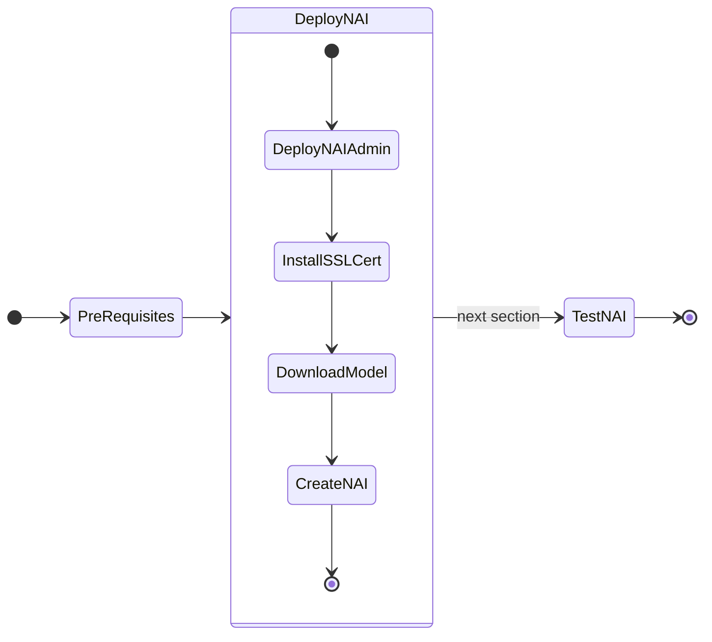

# Deploying Nutanix Enterprise AI (NAI) NVD Reference Application

!!! info "Version 2.7.0"

    This version of the NAI deployment is based on the Nutanix Enterprise AI (NAI) ``v2.7.0`` release.


```mermaid
stateDiagram-v2
    direction LR
    
    state DeployNAI {
        [*] --> DeployNAIAdmin
        DeployNAIAdmin -->  InstallSSLCert
        InstallSSLCert --> DownloadModel
        DownloadModel --> CreateNAI
        CreateNAI --> [*]
    }

    [*] --> PreRequisites
    PreRequisites --> DeployNAI 
    DeployNAI --> TestNAI : next section
    TestNAI --> [*]
```

## Prepare for NAI Deployment


!!! example "GA Software with NAI v2.7.0"
    
    In this lab, we will deploy GA version of the following software to test the following:

    -  Nutanix Enterprise AI 
  
        * **Unified Endpoints** - multiple endpoints for HA and token-based rate limiting
        * **Providers** - Add remote endpoints from providers to utilize their models in Nutanix Enterprise AI workloads.

!!! info

    Changes in NAI ``v2.7.0``

    - Kserve is of at least of ``v0.15.0``
    - Cert-manager is at least of ``v1.17.2``
    - OpenTelemetry operator is at least of ``v0.102.0``
    - Envoy Gateway is at least of ``v1.7.0``
    - Prometheus Monitoring is at least of ``78.4.0``
  
## Enable Pre-requisite Applications  

### Prometheus and Cert Manager

The following pre-requisite applications will be enabled on NKP GUI:

!!! note

    In this lab, we will be using the **Management Cluster Workspace** to deploy our Nutanix Enterprise AI (NAI)

    However, in a customer environment, it is recommended to use a separate workload NKP cluster.

!!! info

    The helm charts and the container images for these applications are stored in internal Harbor registry. These images got uploaded to Harbor at the time of install NKE in this [section](../airgap_nai/infra_nkp_airgap.md#push-container-images-to-localprivate-registry-to-be-used-by-nkp).


**Search** and **Enable** the following applications: follow this order to install dependencies for NAI application


1. In the NKP GUI, Go to **Clusters**
2. Click on **Management Cluster Workspace**
3. Go to **Applications** to search and enable the following:
   
     * **Prometheus Monitoring** : version ``78.4.0`` or higher with the following ``Values`` configuration 
     
        ```yaml
        alertmanager:
          enabled: false
        grafana:
          enabled: false
        prometheus:
          enabled: false
        kubeStateMetrics:
          enabled: false
        kubernetesServiceMonitors:
          enabled: false
        prometheus-node-exporter.kubeRBACProxy:
          kubeRBACProxy:
            enabled: true
        ```

     * **Cert-manager**- ``v1.17.2``
    
        The following application are pre-installed on NKP cluster with Pro license
    
        - Cert Manager ``v1.17.2`` or higher
        
        Check if Cert Manager is installed (pre-installed on NKP cluster if license is installed)
        
        === ":octicons-command-palette-16: Command"
        
            ```bash
            kubectl get deploy -n cert-manager
            ```
    
        === ":octicons-command-palette-16: Output"
    
            ```{ .text .no-copy }
            $ kubectl get deploy -n cert-manager
    
            NAME                      READY   UP-TO-DATE   AVAILABLE   AGE
            cert-manager              1/1     1            1           145m
            cert-manager-cainjector   1/1     1            1           145m
            cert-manager-webhook      1/1     1            1           145m
            ```
    
        If not installed, use  or **NKP Applications GUI** to install it
        
        The following command can also be used to install Cert-manager

        === ":octicons-command-palette-16: Command"
        
            ```bash
            kubectl apply -f https://github.com/cert-manager/cert-manager/releases/download/v1.17.2/cert-manager.yaml
            ```


The following pre-requisite applications will be enabled from the command line on the jumphost VM.

### Envoy Gateway 

5. Login to VSC on the jumphost VM, append the following environment variables to the ``$HOME\airgap-nai\.env`` file and save it
   
    === ":octicons-file-code-16: Template ``$HOME\airgap-nai\.env``"

        ```bash
        export NAI_USER=_your_desired_nai_ui_username
        export NAI_TEMP_PASS=_your_desired_nai_ui_password # At least 8 characters
        export REGISTRY=_your_private_registry
        export REGISTRY_USERNAME=admin
        export REGISTRY_PASSWORD=_your_private_registry_password
        export REGISTRY_EMAIL=admin
        export IMAGE_PULL_SECRET=_your_desired_pull_secret_name
        ```

    === ":octicons-file-code-16: Sample ``$HOME\airgap-nai\.env``"

        ```{ .text .no-copy }
        export NAI_USER=admin
        export NAI_TEMP_PASS=_XXXXXXXXX # At least 8 characters
        export REGISTRY=harbor.10.x.x.x.nip.io
        export REGISTRY_USERNAME=admin
        export REGISTRY_PASSWORD=XXXXXXXXXXX
        export REGISTRY_EMAIL=admin
        export IMAGE_PULL_SECRET=private-regcred
        ```
  
6. IN VSC,go to **Terminal** :octicons-terminal-24: and run the following commands to source the environment variables

    === ":octicons-command-palette-16: Command"

        ```bash
        source $HOME/airgap-nai/.env
        ```

7. Create Kubernetes namespaces and docker-registry secrets for **Envoy Gateway System**

    === ":octicons-command-palette-16: Command"
    
        ```bash
        kubectl create namespace envoy-gateway-system --dry-run=client -o yaml | kubectl apply -f -
        ```
        ```bash
        kubectl create secret docker-registry ${IMAGE_PULL_SECRET} \
          --docker-server=${REGISTRY} \
          --docker-username=${REGISTRY_USERNAME} \
          --docker-password=${REGISTRY_PASSWORD} \
          --docker-email=${REGISTRY_EMAIL} \
          -n envoy-gateway-system \
          --dry-run=client -o yaml | kubectl apply -f -
        ```
    
    === ":octicons-command-palette-16: Command output"
    
        ```bash
        namespace/envoy-gateway-system created
        ```
        ```bash
        secret/private-regcred created
        ```

10. Enable **Envoy Gateway CRDs** ``v1.7.0`` in **AI gateway mode**
   
    === ":octicons-command-palette-16: Command"
    
        ```bash
        helm template eg oci://${REGISTRY}/${PROJECT}/gateway-crds-helm \
          --version v1.7.0 \
          --set crds.gatewayAPI.enabled=true \
          --set crds.envoyGateway.enabled=true \
          | kubectl apply --server-side --force-conflicts -f -
        ```
    
    === ":octicons-command-palette-16: Sample command"
    
        ```bash
        helm template eg oci://harbor.10.x.x.x.nip.io/nutanix/gateway-crds-helm \
          --version v1.7.0 \
          --set crds.gatewayAPI.enabled=true \
          --set crds.envoyGateway.enabled=true \
          | kubectl apply --server-side --force-conflicts -f -
        ```

    === ":octicons-command-palette-16: Command Output"

        ```{ .text .no-copy }
        Pulled: harbor.x.x.x.x.nip.io/nutanix/gateway-crds-helm:v1.7.0
        Digest: sha256:625ee2409826d30e70ac26eb1a93e80650ba2c81464f65aaca6968cd33793b37
        customresourcedefinition.apiextensions.k8s.io/backendtlspolicies.gateway.networking.k8s.io serverside-applied
        customresourcedefinition.apiextensions.k8s.io/gatewayclasses.gateway.networking.k8s.io serverside-applied
        customresourcedefinition.apiextensions.k8s.io/gateways.gateway.networking.k8s.io serverside-applied
        customresourcedefinition.apiextensions.k8s.io/grpcroutes.gateway.networking.k8s.io serverside-applied
        customresourcedefinition.apiextensions.k8s.io/httproutes.gateway.networking.k8s.io serverside-applied
        customresourcedefinition.apiextensions.k8s.io/referencegrants.gateway.networking.k8s.io serverside-applied
        customresourcedefinition.apiextensions.k8s.io/tcproutes.gateway.networking.k8s.io serverside-applied
        customresourcedefinition.apiextensions.k8s.io/tlsroutes.gateway.networking.k8s.io serverside-applied
        customresourcedefinition.apiextensions.k8s.io/udproutes.gateway.networking.k8s.io serverside-applied
        customresourcedefinition.apiextensions.k8s.io/xbackendtrafficpolicies.gateway.networking.x-k8s.io serverside-applied
        customresourcedefinition.apiextensions.k8s.io/xlistenersets.gateway.networking.x-k8s.io serverside-applied
        customresourcedefinition.apiextensions.k8s.io/xmeshes.gateway.networking.x-k8s.io serverside-applied
        customresourcedefinition.apiextensions.k8s.io/backends.gateway.envoyproxy.io serverside-applied
        customresourcedefinition.apiextensions.k8s.io/backendtrafficpolicies.gateway.envoyproxy.io serverside-applied
        customresourcedefinition.apiextensions.k8s.io/clienttrafficpolicies.gateway.envoyproxy.io serverside-applied
        customresourcedefinition.apiextensions.k8s.io/envoyextensionpolicies.gateway.envoyproxy.io serverside-applied
        customresourcedefinition.apiextensions.k8s.io/envoypatchpolicies.gateway.envoyproxy.io serverside-applied
        customresourcedefinition.apiextensions.k8s.io/envoyproxies.gateway.envoyproxy.io serverside-applied
        customresourcedefinition.apiextensions.k8s.io/httproutefilters.gateway.envoyproxy.io serverside-applied
        customresourcedefinition.apiextensions.k8s.io/securitypolicies.gateway.envoyproxy.io serverside-applied
        ```

11. Prepare values file for configuring advanced features for envoy gateway in AI gateway mode.

    === ":octicons-command-palette-16: Command ``eg-config-for-gateway-mode.yaml``"
  
        ```bash
        cat << EOF > eg-config-for-gateway-mode.yaml
        # This file configures Envoy Gateway for AI Gateway mode with rate limiting

        config:
          envoyGateway:
            gateway:
              controllerName: "gateway.envoyproxy.io/gatewayclass-controller"
            logging:
              level:
                default: "info"
            provider:
              kubernetes:
                rateLimitDeployment:
                  container:
                    image: "${REGISTRY}/${PROJECT}/nai-ratelimit:99d85510"
                  patch:
                    type: "StrategicMerge"
                    value:
                      spec:
                        template:
                          spec:
                            containers:
                              - imagePullPolicy: "IfNotPresent"
                                name: "envoy-ratelimit"
                                image: "${REGISTRY}/${PROJECT}/nai-ratelimit:99d85510"
              type: "Kubernetes"
            extensionApis:
              enableEnvoyPatchPolicy: true
              enableBackend: true
            extensionManager:
              maxMessageSize: 11Mi
              backendResources:
                - group: inference.networking.k8s.io
                  kind: InferencePool
                  version: v1
              hooks:
                xdsTranslator:
                  translation:
                    listener:
                      includeAll: true
                    route:
                      includeAll: true
                    cluster:
                      includeAll: true
                    secret:
                      includeAll: true
                  post:
                    - "Translation"
                    - "Cluster"
                    - "Route"
              service:
                fqdn:
                  hostname: "ai-gateway-controller.nai-system.svc.cluster.local"
                  port: 1063
            rateLimit:
              backend:
                type: "Redis"
                redis:
                  url: "redis-sentinel.nai-system.svc.cluster.local:6379"
        EOF
        ```
        
12. Enable **Envoy Gateway** ``v1.7.0`` in **AI gateway mode**
    
    === ":octicons-command-palette-16: Command"
    
        ```bash
        helm upgrade --install eg oci://${REGISTRY}/${PROJECT}/gateway-helm \
          --version v1.7.0 \
          -n envoy-gateway-system \
          --create-namespace --wait \
          --set global.images.envoyGateway.image=${REGISTRY}/${PROJECT}/nai-gateway:v1.7.0 \
          --set global.images.ratelimit.image=${REGISTRY}/${PROJECT}/nai-ratelimit:99d85510 \
          --set "global.imagePullSecrets[0].name=${IMAGE_PULL_SECRET}" \
          -f ./eg-config-for-gateway-mode.yaml
        ```

    === ":octicons-command-palette-16: Sample command"
  
        ```bash
        helm upgrade --install eg oci://harbor.10.x.x.x.nip.io/nutanix/gateway-helm \
          --version v1.7.0 \
          -n envoy-gateway-system \
          --create-namespace --wait \
          --set global.images.envoyGateway.image=harbor.10.x.x.x.nip.io/nutanix/nai-gateway:v1.7.0 \
          --set global.images.ratelimit.image=harbor.10.x.x.x.nip.io/nutanix/nai-ratelimit:99d85510 \
          --set global.imagePullSecrets[0].name=private-regcred \
          -f ./eg-config-for-gateway-mode.yaml
        ```
  
    === ":octicons-command-palette-16: Command output"
    
        ```{ .text .no-copy }
        Release "eg" does not exist. Installing it now.
        Pulled: harbor.x.x.x.x.nip.io/nutanix/gateway-helm:v1.7.0
        Digest: sha256:80ce6293c5a8658897971cd10adef51880a3ee6e5e1bbc92415b943cd4b94cb5
        NAME: eg
        LAST DEPLOYED: Tue Jun  2 06:50:14 2026
        NAMESPACE: envoy-gateway-system
        STATUS: deployed
        REVISION: 1
        DESCRIPTION: Install complete
        TEST SUITE: None
        ```

13. Check if Envoy Gateway resources are ready
    
    !!! warning 
        
        The ``envoy-ratelimit-`` pod will temporarily be in ``CrashLoopBackOff`` state and eventually will transition to ``Running`` after redis-standalone pod is fully deployed in the upcoming [Deploy NAI](iep_deploy.md#deploy-nai) section.

        Ignore the ``CrashLoopBackOff`` state for now and move on to the next section. 
   
    === ":octicons-command-palette-16: Command"
    
        ```bash
        kubectl wait --timeout=5m -n envoy-gateway-system deployment/envoy-gateway --for=condition=Available
        kubectl get pods
        ```

    === ":octicons-command-palette-16: Output"

        ```{ .text .no-copy }
        $ kubectl wait --timeout=5m -n envoy-gateway-system deployment/envoy-gateway --for=condition=Available
        #
        deployment.apps/envoy-gateway condition met

        $ kubectl get pods
        #
        NAME                               READY   STATUS    RESTARTS      AGE
        envoy-gateway-c885698c5-f88wl      1/1     Running   0             102s
        envoy-ratelimit-7c47dd84cc-8qz7n   0/1     Error     4 (48s ago)   101s
        ```

### Kserve

8. Create kubernetes namespaces and docker-registry secrets for **KServe**
   
    === ":octicons-command-palette-16: Command"
     
         ```bash
         kubectl create namespace kserve --dry-run=client -o yaml | kubectl apply -f -
         ```
         ```bash
         kubectl create secret docker-registry ${IMAGE_PULL_SECRET} \
           --docker-server=${REGISTRY} \
           --docker-username=${REGISTRY_USERNAME} \
           --docker-password=${REGISTRY_PASSWORD} \
           --docker-email=${REGISTRY_EMAIL} \
           -n kserve \
           --dry-run=client -o yaml | kubectl apply -f -
         ```
    
    === ":octicons-command-palette-16: Command output"
    
        ```bash
        namespace/kserve created
        ```
        ```bash
        secret/private-regcred created
        ```

14. Run the **Kserve CRD** installation

    === ":octicons-command-palette-16: Command"
    
        ```bash
        helm upgrade --install kserve-crd \
          oci://${REGISTRY}/${PROJECT}/kserve-crd \
          --version v0.15.0 \
          -n kserve 
        ```
    
    === ":octicons-command-palette-16: Sample command"
    
        ```bash
        helm upgrade --install kserve-crd \
          oci://harbor.10.x.x.x.nip.io/nutanix/kserve-crd \
          --version v0.15.0 \
          -n kserve 
        ```
    
    === ":octicons-command-palette-16: Command output"
    
        ```{ .text .no-copy }
        Pulled: harbor.x.x.x.x.nip.io/nutanix/kserve-crd:v0.15.0
        Digest: sha256:b673a75fdf45602ae58bb528e7b445e4530617b18f8eebb5d6337c16d4596951
        Release "kserve-crd" has been upgraded. Happy Helming!
        NAME: kserve-crd
        LAST DEPLOYED: Tue Jun  2 07:03:11 2026
        NAMESPACE: kserve
        STATUS: deployed
        REVISION: 2
        DESCRIPTION: Upgrade complete
        TEST SUITE: None
        ```
  
15. Run the **Kserve** installation


    === ":octicons-command-palette-16: Command"
    
        ```bash
        helm upgrade --install kserve \
          oci://${REGISTRY}/${PROJECT}/kserve \
          --version v0.15.0 \
          -n kserve --wait \
          --set kserve.controller.deploymentMode=RawDeployment \
          --set kserve.controller.gateway.disableIngressCreation=true \
          --set kserve.controller.image=${REGISTRY}/${PROJECT}/nai-kserve-controller \
          --set kserve.controller.rbacProxyImage=${REGISTRY}/${PROJECT}/nai-kube-rbac-proxy:v0.18.0 \
          --set kserve.controller.imagePullSecrets[0].name=${IMAGE_PULL_SECRET}
        ```
    
    === ":octicons-command-palette-16: Command"
    
        ```bash
        helm upgrade --install kserve \
          oci://harbor.10.x.x.x.nip.io/kserve \
          --version v0.15.0 \
          -n kserve --wait \
          --set kserve.controller.deploymentMode=RawDeployment \
          --set kserve.controller.gateway.disableIngressCreation=true \
          --set kserve.controller.image=${REGISTRY}/${PROJECT}/nai-kserve-controller \
          --set kserve.controller.rbacProxyImage=${REGISTRY}/${PROJECT}/nai-kube-rbac-proxy:v0.18.0 \
          --set kserve.controller.imagePullSecrets[0].name=${IMAGE_PULL_SECRET}
        ```
    
    === ":octicons-command-palette-16: Command output"
    
        ```{ .text .no-copy }
        Pulled: harbor.x.x.x.x.nip.io/nutanix/kserve:v0.15.0
        Digest: sha256:e1bc365c75dd28f0c43581107b78614ffe21e6fbaf95a9351af440d3eec45130
        Release "kserve" has been upgraded. Happy Helming!
        NAME: kserve
        LAST DEPLOYED: Tue Jun  2 07:08:10 2026
        NAMESPACE: kserve
        STATUS: deployed
        REVISION: 2
        DESCRIPTION: Upgrade complete
        ```
   
    ??? warning "Kserve install failure?"

        Ocassionally the Kserve install might fail due to webhook race condition. If this happens, wait a few minutes and run the ``helm update --install kserve ...`` commmand from above once again.

        ```bash
        failed calling webhook "clusterservingruntime.kserve-webhook-server.validator": failed to call webhook: Post "https://kserve-webhook-server-service.kserve.svc:443/validate-serving-kserve-io-v1alpha1-clusterservingruntime?timeout=10s": dial tcp 10.106.128.236:443: connect: operation not permitted
        ```

16. Confirm if kserve pod is running
     
    === ":octicons-command-palette-16: Command"
    
        ```bash
        kubectl get pods -n kserve
        ```
    
    === ":octicons-command-palette-16: Command output"
    
        ```{ .text .no-copy }
        $ kubectl get pods 
        #
        NAME                                         READY   STATUS    RESTARTS   AGE
        kserve-controller-manager-7f85994d77-pz9mq   2/2     Running   0          62s
        ```
     

### OpenTelemetry

1. Create kubernetes namespaces and docker-registry secrets for **OpenTelemetry**
   
    === ":octicons-command-palette-16: Command"
    
        ```bash
        kubectl create namespace opentelemetry --dry-run=client -o yaml | kubectl apply -f -
        ```
        ```bash
        kubectl create secret docker-registry ${IMAGE_PULL_SECRET} \
          --docker-server=${REGISTRY} \
          --docker-username=${REGISTRY_USERNAME} \
          --docker-password=${REGISTRY_PASSWORD} \
          --docker-email=${REGISTRY_EMAIL} \
          -n opentelemetry \
          --dry-run=client -o yaml | kubectl apply -f -
        ```
    
    === ":octicons-command-palette-16: Command output"
    
        ```bash
        namespace/opentelemetry created
        ```
        ```bash
        secret/private-regcred created
        ```

2. Run the **OpenTelemetry** operator installation

    === ":octicons-command-palette-16: Command"
    
        ```bash
        helm upgrade --install opentelemetry-operator oci://${REGISTRY}/${PROJECT}/opentelemetry-operator \
          --version 0.102.0 \
          -n opentelemetry --create-namespace --wait \
          --set manager.image.repository=${REGISTRY}/${PROJECT}/nai-opentelemetry-operator \
          --set manager.collectorImage.repository=${REGISTRY}/${PROJECT}/nai-opentelemetry-collector-contrib \
          --set kubeRBACProxy.image.repository=${REGISTRY}/${PROJECT}/nai-kube-rbac-proxy \
          --set imagePullSecrets[0].name=${IMAGE_PULL_SECRET}
        ```
    
    === ":octicons-command-palette-16: Command sample"
    
        ```bash
        helm upgrade --install opentelemetry-operator oci://harbor.10.x.x.134.nip.io/nutanix/opentelemetry-operator \
          --version 0.102.0 \
          -n opentelemetry --create-namespace --wait \
          --set manager.image.repository=harbor.10.x.x.134.nip.io/nutanix/nai-opentelemetry-operator \
          --set manager.collectorImage.repository=harbor.10.x.x.134.nip.io/nutanix/nai-opentelemetry-collector-k8s \
          --set kubeRBACProxy.image.repository=harbor.10.x.x.134.nip.io/nutanix/nai-kube-rbac-proxy 
          --set imagePullSecrets[0].name=private-regcred
        ```
    
    === ":octicons-command-palette-16: Command output"
    
        ```{ .text .no-copy }
        Pulled: harbor.x.x.x.x.nip.io/nutanix/opentelemetry-operator:0.102.0
        Digest: sha256:bb3a48aeca0320a5c999b3849619e2d692eeec8ce59a6c43ca965c1fd1ffdb24
        I0602 07:18:04.217343 1235342 warnings.go:107] "Warning: spec.privateKey.rotationPolicy: In cert-manager >= v1.18.0, the default value changed from `Never` to `Always`."
        NAME: opentelemetry-operator
        LAST DEPLOYED: Tue Jun  2 07:18:02 2026
        NAMESPACE: opentelemetry
        STATUS: deployed
        REVISION: 1
        DESCRIPTION: Install complete
        ```


3. Confirm if Opentelemetry pod is running
     
    === ":octicons-command-palette-16: Command"
    
        ```bash
        kubectl get pods -n opentelemetry
        ```
    
    === ":octicons-command-palette-16: Command output"
    
        ```{ .text .no-copy }
        $ kubectl get pods 
        #
        NAME                                      READY   STATUS    RESTARTS   AGE
        opentelemetry-operator-85df5fbdc8-n9zm9   2/2     Running   0          27s
        ```
        
## Deploy NAI

1. Append the following environment variables to the ``$HOME\airgap-nai\.env`` file and save it
   
    === ":octicons-file-code-16: Template ``$HOME\airgap-nai\.env``"

        ```bash
        export NAI_API_RWX_STORAGECLASS=_desired_rwx_files_storageclass_created_in_previous_section
        export NAI_DEFAULT_RWO_STORAGECLASS=_desired_rwo_volume_storageclass
        export NKP_WORKSPACE_NAMESPACE=_desired_nkp_workspace # (1)!
        ```

        1. Get the values for the NKP workspace using the following commands:

            ```bash
            nkp get workspaces
            # Get the names of workspaces
            # NAME                    NAMESPACE                   
            # default-workspace       kommander-default-workspace
            # kommander-workspace     kommander 

            nkp get clusters -w kommander-workspace
            # Ensure the target cluster is in the correct workspace
            # WORKSPACE               NAME            KUBECONFIG                              STATUS 
            # kommander-workspace     host-cluster    kommander-self-attach-kubeconfig        Joined
            ```
    === ":octicons-file-code-16: Sample ``$HOME\airgap-nai\.env``"

        ```bash
        export NAI_API_RWX_STORAGECLASS=nai-nfs-storage
        export NAI_DEFAULT_RWO_STORAGECLASS=nutanix-volume
        export NKP_WORKSPACE_NAMESPACE=kommander-workspace #(1)!
        ```

        1. Use ``kommander-workspace`` if this is where your cluster is deployed

1. Source the environment variables (if not done so already)

    ```bash
    source $HOME/airgap-nai/.env
    ```

2. Create kubernetes namespaces and docker-registry secrets for **NAI**
   
    === ":octicons-command-palette-16: Command"
    
        ```bash
        kubectl create namespace nai-system --dry-run=client -o yaml | kubectl apply -f -
        ```
        ```bash
        kubectl create secret docker-registry ${IMAGE_PULL_SECRET} \
          --docker-server=${REGISTRY} \
          --docker-username=${REGISTRY_USERNAME} \
          --docker-password=${REGISTRY_PASSWORD} \
          --docker-email=${REGISTRY_EMAIL} \
          -n nai-system \
          --dry-run=client -o yaml | kubectl apply -f -
        ```
    
    === ":octicons-command-palette-16: Command output"
    
        ```bash
        namespace/nai-system created
        ```
        ```bash
        secret/private-regcred created
        ```

3. In `VSCode` Explorer pane, browse to ``$HOME/airgap-nai`` folder
   
4. Run the following command to create a helm values file:

    === ":octicons-command-palette-16: Command - ``darksite-nai-operators.yaml``"

        ```bash
        cat <<EOF > darksite-nai-operators.yaml
        global:
          imagePullSecrets:
            - name: ${IMAGE_PULL_SECRET}
        
        naiRedis:
          naiRedisImage:
            name: ${REGISTRY}/${PROJECT}/nai-redis
        
        naiJobs:
          naiJobsImage:
            image: ${REGISTRY}/${PROJECT}/nai-jobs
        
        nai-clickhouse-operator:
          operator:
            image:
              registry: ${REGISTRY}
              repository: ${PROJECT}/nai-clickhouse-operator
          metrics:
            image:
              registry: ${REGISTRY}
              repository: ${PROJECT}/nai-clickhouse-metrics-exporter
        
        ai-gateway-helm:
          extProc:
            image:
              repository: ${REGISTRY}/${PROJECT}/nai-ai-gateway-extproc
          controller:
            image:
              repository: ${REGISTRY}/${PROJECT}/nai-ai-gateway-controller
        EOF
        ```

    === ":octicons-file-code-16: Sample - ``darksite-nai-operators.yaml``"    
       
        ```yaml
        global:
          imagePullSecrets:
            - name: private-regcred
        
        naiRedis:
          naiRedisImage:
            name: harbor.10.x.x.134.nip.io/nutanix/nai-redis
        
        naiJobs:
          naiJobsImage:
            image: harbor.10.x.x.134.nip.io/nutanix/nai-jobs
        
        nai-clickhouse-operator:
          operator:
            image:
              registry: harbor.10.x.x.134.nip.io
              repository: nutanix/nai-clickhouse-operator
          metrics:
            image:
              registry: harbor.10.x.x.134.nip.io
              repository: nutanix/nai-clickhouse-metrics-exporter
        
        ai-gateway-helm:
          extProc:
            image:
              repository: harbor.10.x.x.134.nip.io/nutanix/nai-ai-gateway-extproc
          controller:
            image:
              repository: harbor.10.x.x.134.nip.io/nutanix/nai-ai-gateway-controller
        ```

5. Install nai-operators helm chart in the nai-system namespace 
   
    === ":octicons-command-palette-16: Command"

        ```bash
        helm upgrade --install nai-operators oci://${REGISTRY}/${PROJECT}/nai-operators \
          --version=2.7.0 \
          -n nai-system --create-namespace --take-ownership --wait \
          -f ./darksite-nai-operators.yaml
        ```

    === ":octicons-command-palette-16: Sample Command"
      
        ```{ .text .no-copy }
        helm upgrade --install nai-operators oci://harbor.10.x.x.134.nip.io/nutanix/nai-operators \
          --version=2.7.0 \
          -n nai-system --create-namespace --wait \
          -n nai-system --create-namespace --take-ownership --wait \
          -f ./darksite-nai-operators.yaml
        ```

    === ":octicons-command-palette-16: Command output"
      
        ```{ .text .no-copy }
        Release "nai-operators" does not exist. Installing it now.
        Pulled: harbor.x.x.x.x.nip.io/nutanix/nai-operators:2.7.0
        Digest: sha256:8a377a20f58f28500daab57730cf71bc4c7e2385615e061a9bd98e73ed47a978
        I0602 07:33:51.855835 1236713 warnings.go:107] "Warning: spec.template.spec.containers[1].ports[0]: duplicate port name \"metrics\" with spec.template.spec.containers[0].ports[0], services and probes that select ports by name will use spec.template.spec.containers[0].ports[0]"
        I0602 07:33:51.875877 1236713 warnings.go:107] "Warning: spec.privateKey.rotationPolicy: In cert-manager >= v1.18.0, the default value changed from `Never` to `Always`."
        NAME: nai-operators
        LAST DEPLOYED: Tue Jun  2 07:33:50 2026
        NAMESPACE: nai-system
        STATUS: deployed
        REVISION: 1
        DESCRIPTION: Install complete
        TEST SUITE: None
        ```

6. Verify all three nai-operator pods are running. Note that ``ai-gateway-controller-`` pod is also running as we are installing AI Gateway features
   
    === ":octicons-command-palette-16: Command"
    
        ```bash
        kubens nai-system
        kubectl get pod
        ```
    
    === ":octicons-command-palette-16: Command output"
    
        ```{ .text .no-copy }
        $ kubectl get po
        #
        NAME                                                    READY   STATUS    RESTARTS   AGE
        ai-gateway-controller-77d6cb4764-c6ct6                  1/1     Running   0          37s
        nai-operators-nai-clickhouse-operator-86d684894-5rqkc   2/2     Running   0          37s
        redis-standalone-67d4865578-tcgmv                       2/2     Running   0          37s
        ```

1. Run the following command to create a helm values file:

    === ":octicons-command-palette-16: Template - ``darksite-nai-core.yaml``"

        ```bash
        cat <<EOF > darksite-nai-core.yaml
        global:
          imagePullSecrets:
            - name: ${IMAGE_PULL_SECRET}
          storage:
            storageClassName: ${NAI_DEFAULT_RWO_STORAGECLASS}
            storageClassNameRWX: ${NAI_API_RWX_STORAGECLASS}
        
        gateway:
          envoyDeployment:
            container:
              image: ${REGISTRY}/${PROJECT}/nai-envoy:distroless-v1.37.0
        
        naiIepOperator:
          iepOperatorImage:
            image: ${REGISTRY}/${PROJECT}/nai-iep-operator
        
          modelProcessorImage:
            image: ${REGISTRY}/${PROJECT}/nai-python-processor
        
          dataSourceProcessorImage:
            image: ${REGISTRY}/${PROJECT}/nai-python-processor
        
          batchInferenceProcessor:
            containers:
              processor:
                image: ${REGISTRY}/${PROJECT}/nai-go-processor
              statusProvider:
                image: ${REGISTRY}/${PROJECT}/nai-go-processor
        
          finetuneProcessorImage:
            image: ${REGISTRY}/${PROJECT}/nai-finetuning
        
        naiInferenceUi:
          naiUiImage:
            image: ${REGISTRY}/${PROJECT}/nai-inference-ui
        
        naiJobs:
          naiJobsImage:
            image: ${REGISTRY}/${PROJECT}/nai-jobs
        
        naiApi:
          naiApiImage:
            image: ${REGISTRY}/${PROJECT}/nai-api
          supportedTGIImage: ${REGISTRY}/${PROJECT}/nai-tgi
          supportedKserveRuntimeImage: ${REGISTRY}/${PROJECT}/nai-kserve-huggingfaceserver
          eppImage: ${REGISTRY}/${PROJECT}/nai-epp-inference-scheduler
          supportedVLLMImage: ${REGISTRY}/${PROJECT}/nai-vllm
          supportedKserveCustomModelServerRuntimeImage: ${REGISTRY}/${PROJECT}/nai-kserve-custom-model-server
          superAdmin:
            username: ${NAI_USER}
            password: ${NAI_TEMP_PASS} # At least 8 characters
            # email: admin@nutanix.com
            # firstName: admin
        
        naiDatabase:
          naiDbImage:
            image: ${REGISTRY}/${PROJECT}/nai-postgres:16.13-alpine
        
        naiIam:
          iamProxy:
            image: ${REGISTRY}/${PROJECT}/nai-iam-proxy
        
          iamProxyControlPlane:
            image: ${REGISTRY}/${PROJECT}/nai-iam-proxy-control-plane
        
          iamUi:
            image: ${REGISTRY}/${PROJECT}/nai-iam-ui
        
          iamUserAuthn:
            image: ${REGISTRY}/${PROJECT}/nai-iam-user-authn
        
          iamThemis:
            image: ${REGISTRY}/${PROJECT}/nai-iam-themis
        
          iamThemisBootstrap:
            image: ${REGISTRY}/${PROJECT}/nai-iam-bootstrap
        
        naiLabs:
          labsImage:
            image: ${REGISTRY}/${PROJECT}/nai-rag-app
        
        nai-clickhouse-keeper:
          clickhouseKeeper:
            image:
              registry: ${REGISTRY}
              repository: ${PROJECT}/nai-clickhouse-keeper
        
        oauth2-proxy:
          image:
            repository: ${REGISTRY}/${PROJECT}/nai-oauth2-proxy
        
        nai-clickhouse-server:
          clickhouse:
            image:
              registry: ${REGISTRY}
              repository: ${PROJECT}/nai-clickhouse-server
            initContainers:
              addUdf:
                image:
                  registry: ${REGISTRY}
                  repository: ${PROJECT}/nai-clickhouse-udf
              waitForKeeper:
                image:
                  registry: ${REGISTRY}
                  repository: ${PROJECT}/nai-jobs
        
        nai-clickhouse-schemas:
          image:
            registry: ${REGISTRY}
            repository: ${PROJECT}/nai-clickhouse-schemas
        
        naiAgent:
          agentImage:
            image: ${REGISTRY}/${PROJECT}/nai-agent-app
        
        naiMonitoring:
          opentelemetry:
            collectorImage: ${REGISTRY}/${PROJECT}/nai-opentelemetry-collector-contrib:0.141.0
            targetAllocator:
              image:
                repository: ${REGISTRY}/${PROJECT}/nai-target-allocator
          nodeExporter:
            serviceMonitor:
              namespaceSelector:
                matchNames:
                  - prometheus
                  - kommander
                  - kommander-default-workspace
                  - ${NKP_WORKSPACE_NAMESPACE}
          dcgmExporter:
            serviceMonitor:
              namespaceSelector:
                matchNames:
                  - prometheus
                  - kommander
                  - kommander-default-workspace
                  - ${NKP_WORKSPACE_NAMESPACE}
        EOF
        ```

    === ":octicons-file-code-16: Sample - ``darksite-nai-core.yaml``"    
       
        ```yaml
        global:
          imagePullSecrets:
            - name: private-regcred
          storage:
            storageClassName: nutanix-volume
            storageClassNameRWX: nai-nfs-storage
        
        gateway:
          envoyDeployment:
            container:
              image: harbor.10.x.x.134.nip.io/nutanix/nai-envoy:distroless-v1.37.0
        
        naiIepOperator:
          iepOperatorImage:
            image: harbor.10.x.x.134.nip.io/nutanix/nai-iep-operator
        
          modelProcessorImage:
            image: harbor.10.x.x.134.nip.io/nutanix/nai-python-processor
        
          dataSourceProcessorImage:
            image: harbor.10.x.x.134.nip.io/nutanix/nai-python-processor
        
          batchInferenceProcessor:
            containers:
              processor:
                image: harbor.10.x.x.134.nip.io/nutanix/nai-go-processor
              statusProvider:
                image: harbor.10.x.x.134.nip.io/nutanix/nai-go-processor
        
          finetuneProcessorImage:
            image: harbor.10.x.x.134.nip.io/nutanix/nai-finetuning
        
        naiInferenceUi:
          naiUiImage:
            image: harbor.10.x.x.134.nip.io/nutanix/nai-inference-ui
        
        naiJobs:
          naiJobsImage:
            image: harbor.10.x.x.134.nip.io/nutanix/nai-jobs
        
        naiApi:
          naiApiImage:
            image: harbor.10.x.x.134.nip.io/nutanix/nai-api
          supportedTGIImage: harbor.10.x.x.134.nip.io/nutanix/nai-tgi
          supportedKserveRuntimeImage: harbor.10.x.x.134.nip.io/nutanix/nai-kserve-huggingfaceserver
          eppImage: harbor.10.x.x.134.nip.io/nutanix/nai-epp-inference-scheduler
          supportedVLLMImage: harbor.10.x.x.134.nip.io/nutanix/nai-vllm
          supportedKserveCustomModelServerRuntimeImage: harbor.10.x.x.134.nip.io/nutanix/nai-kserve-custom-model-server
          superAdmin:
            username: admin
            password: xxxxxxx # At least 8 characters
            # email: admin@nutanix.com
            # firstName: admin
        
        naiDatabase:
          naiDbImage:
            image: harbor.10.x.x.134.nip.io/nutanix/nai-postgres:16.13-alpine
        
        naiIam:
          iamProxy:
            image: harbor.10.x.x.134.nip.io/nutanix/nai-iam-proxy
        
          iamProxyControlPlane:
            image: harbor.10.x.x.134.nip.io/nutanix/nai-iam-proxy-control-plane
        
          iamUi:
            image: harbor.10.x.x.134.nip.io/nutanix/nai-iam-ui
        
          iamUserAuthn:
            image: harbor.10.x.x.134.nip.io/nutanix/nai-iam-user-authn
        
          iamThemis:
            image: harbor.10.x.x.134.nip.io/nutanix/nai-iam-themis
        
          iamThemisBootstrap:
            image: harbor.10.x.x.134.nip.io/nutanix/nai-iam-bootstrap
        
        naiLabs:
          labsImage:
            image: harbor.10.x.x.134.nip.io/nutanix/nai-rag-app
        
        nai-clickhouse-keeper:
          clickhouseKeeper:
            image:
              registry: harbor.10.x.x.134.nip.io
              repository: nutanix/nai-clickhouse-keeper
        
        oauth2-proxy:
          image:
            repository: harbor.10.x.x.134.nip.io/nutanix/nai-oauth2-proxy
        
        nai-clickhouse-server:
          clickhouse:
            image:
              registry: harbor.10.x.x.134.nip.io
              repository: nutanix/nai-clickhouse-server
            initContainers:
              addUdf:
                image:
                  registry: harbor.10.x.x.134.nip.io
                  repository: nutanix/nai-clickhouse-udf
              waitForKeeper:
                image:
                  registry: harbor.10.x.x.134.nip.io
                  repository: nutanix/nai-jobs
        
        nai-clickhouse-schemas:
          image:
            registry: harbor.10.x.x.134.nip.io
            repository: nutanix/nai-clickhouse-schemas
        
        naiAgent:
          agentImage:
            image: harbor.10.x.x.134.nip.io/nutanix/nai-agent-app
        
        naiMonitoring:
          opentelemetry:
            collectorImage: harbor.10.x.x.134.nip.io/nutanix/nai-opentelemetry-collector-contrib:0.141.0
            targetAllocator:
              image:
                repository: harbor.10.x.x.134.nip.io/nutanix/nai-target-allocator
          nodeExporter:
            serviceMonitor:
              namespaceSelector:
                matchNames:
                  - prometheus
                  - kommander
                  - kommander-default-workspace
                  - kommander
          dcgmExporter:
            serviceMonitor:
              namespaceSelector:
                matchNames:
                  - prometheus
                  - kommander
                  - kommander-default-workspace
                  - kommander
        ```

2. Install NAI Core helm chart in the nai-system namespace 
   
    === ":octicons-command-palette-16: Command"

        ```bash
        helm upgrade --install nai-core oci://${REGISTRY}/${PROJECT}/nai-core \
          --version 2.7.0 --force-conflicts \
          -n nai-system --create-namespace --wait \
          -f ./darksite-nai-core.yaml
        ```

    === ":octicons-command-palette-16: Sample Command"
      
        ```{ .text .no-copy }
        helm upgrade --install nai-core oci://harbor.10.x.x.134/nutanix/nai-core \
          --version 2.7.0 --force-conflicts \
          -n nai-system --create-namespace --wait \
          -f ./darksite-nai-core.yaml
        ```

    === ":octicons-command-palette-16: Command output"
      
        ```{ .text .no-copy }
        Release "nai-core" does not exist. Installing it now.
        Pulled: harbor.x.x.x.x.nip.io/nutanix/nai-core:2.7.0
        NAME: nai-core
        LAST DEPLOYED: Wed Jun  3 01:38:56 2026
        NAMESPACE: nai-system
        STATUS: deployed
        REVISION: 1
        DESCRIPTION: Install complete
        TEST SUITE: None
        ```

3.  Check if all NAI core pods are running 
   
    === ":octicons-command-palette-16: Command"

        ```bash
        kubens nai-system
        kubectl get pods
        ```
    
    === ":octicons-command-palette-16: Command output"

        ```{ .text, .no-copy}
        Active namespace is "nai-system".
        
        NAME                                                    READY   STATUS      RESTARTS        AGE
        ai-gateway-controller-77d6cb4764-h2jfs                  1/1     Running     0               17h
        chi-nai-clickhouse-server-chcluster1-0-0-0              1/1     Running     0               4m30s
        chk-nai-clickhouse-keeper-chkeeper-0-0-0                1/1     Running     0               4m14s
        iam-database-bootstrap-awoad-cwxqf                      0/1     Completed   0               4m45s
        iam-proxy-8fcc9599c-xggpz                               1/1     Running     0               4m45s
        iam-proxy-control-plane-54489f7bf7-h8xqz                1/1     Running     0               4m45s
        iam-themis-7f65594f9d-z8krt                             1/1     Running     0               4m44s
        iam-themis-bootstrap-1grir-k7kst                        0/1     Completed   0               4m45s
        iam-ui-5bf8747f4-hbnmb                                  1/1     Running     0               4m45s
        iam-user-authn-676df76bc5-j6b8v                         1/1     Running     0               4m45s
        nai-agent-6db7856f5f-6z947                              1/1     Running     0               4m45s
        nai-api-cffbdf967-kllbj                                 1/1     Running     2 (2m29s ago)   4m45s
        nai-api-db-migrate-nv7cs-8gz2r                          0/1     Completed   4               4m45s
        nai-clickhouse-schema-job-1780450736-p4kxd              0/1     Completed   0               4m45s
        nai-db-0                                                1/1     Running     0               4m45s
        nai-iep-model-controller-5468d4844f-jfcsl               1/1     Running     0               4m45s
        nai-oauth2-proxy-744f8d6c56-kbvnb                       1/1     Running     0               4m45s
        nai-operators-nai-clickhouse-operator-86d684894-7jsbw   2/2     Running     0               17h
        nai-otel-collector-collector-5ftxs                      1/1     Running     0               4m43s
        nai-otel-collector-collector-flf9z                      1/1     Running     0               4m43s
        nai-otel-collector-collector-fmcz6                      1/1     Running     0               4m43s
        nai-otel-collector-collector-fz47d                      1/1     Running     0               4m43s
        nai-otel-collector-collector-k7s2g                      1/1     Running     0               4m43s
        nai-otel-collector-collector-l6dj4                      1/1     Running     0               4m43s
        nai-otel-collector-collector-rxzmw                      1/1     Running     0               4m43s
        nai-otel-collector-targetallocator-d85875d76-cvlzl      1/1     Running     0               4m43s
        nai-securityscan-manager-6b7589cbbb-5w7v7               1/1     Running     3 (4m21s ago)   4m45s
        nai-ui-c99b9dcd5-b7lzv                                  1/1     Running     0               4m45s
        redis-standalone-67d4865578-47pm6                       2/2     Running     0               17h
        ```

## Install SSL Certificate and Gateway Elements

In this section we will install SSL Certificate to access the NAI UI. This is required as the endpoint will only work with a ssl endpoint with a valid certificate.

NAI UI is accessible using the Envoy Ingress Gateway.

The following steps show how cert-manager can be used to generate a self signed certificate using the default selfsigned-issuer present in the cluster. 

??? tip "Manual - using Public Certificate Authority (CA) for NAI SSL Certificate"
    
    If an organization generates certificates using a different mechanism then obtain the certificate **+ key** and create a kubernetes secret manually using the following command:

    ```bash
    kubectl -n nai-system create secret tls nai-cert --cert=path/to/nai.crt --key=path/to/nai.key
    ```

    Use patch commmand (Step 6) onwards in this section to use this certificate.

    Skip the steps in this self-signed certificate section to use the organisation generated certificates.

    
??? tip "Automate - using Cert Manager and Public Certificate Authority (CA) for NAI SSL Certificate"  

    Using **Cert Manager** to manage the Public Certificate Authority (CA) for NAI SSL Certificate is also a possiblity.

    At a high level (Cloudflare Example):

    1. Get a API key from DNS provider woth Edit Zone rights
    2. Create a Kubernetes ``Secret`` from the API key
    3. Create a ``ClusterIssuer`` with Cert Mangager/Let's Encrypt - Configure cert-manager to use DNS-01 challenge with Cloudflare for automatic certificate issuance.
    4. Create the certificate and store it as a ``Secret``
    5. Patch the NAI Envoy Ingress Gateway ``gateway`` listener with the secret (SSL certificate)

To create and use a self-signed certificate, follow these steps:

1. Get the NAI UI ingress gateway host using the following command:
   
    ```bash
    NAI_UI_ENDPOINT=$(kubectl get svc -n envoy-gateway-system -l "gateway.envoyproxy.io/owning-gateway-name=nai-ingress-gateway,gateway.envoyproxy.io/owning-gateway-namespace=nai-system" -o jsonpath='{.items[0].status.loadBalancer.ingress[0].ip}')
    ```

2. Get the value of ``NAI_UI_ENDPOINT`` environment variable
   
    === "Command"

        ```bash
        echo $NAI_UI_ENDPOINT
        ```

    === "Command output"

        ``` { .text .no-copy }
        10.x.x.216
        ```

3. We will use the command output e.g: ``10.x.x.216`` as the IP address for NAI as reserved in this [section](../infra/infra_nkp.md#reserve-control-plane-and-metallb-endpoint-ips)

4. Construct the FQDN of NAI UI using [nip.io](https://nip.io/) and we will use this FQDN as the certificate's Common Name (CN).
   
    === "Template URL"

        ```bash
        nai.${NAI_UI_ENDPOINT}.nip.io
        ```

    === "Sample URL"

        ``` { .text .no-copy }
        nai.10.x.x.216.nip.io
        ```

5. Create the ingress resource certificate using the following command:
   
    ```bash hl_lines="12 14 16"
    cat << EOF | k apply -f -
    apiVersion: cert-manager.io/v1
    kind: Certificate
    metadata:
      name: nai-cert
      namespace: nai-system
    spec:
      issuerRef:
        name: selfsigned-issuer
        kind: ClusterIssuer
      secretName: nai-cert
      commonName: nai.${NAI_UI_ENDPOINT}.nip.io
      dnsNames:
      - nai.${NAI_UI_ENDPOINT}.nip.io
      ipAddresses:
      - ${NAI_UI_ENDPOINT}
    EOF
    ```

6. Patch the Envoy gateway with the ``nai-cert`` certificate details
   
    ```bash
    kubectl patch gateway nai-ingress-gateway -n nai-system --type='json' -p='[{"op": "replace", "path": "/spec/listeners/1/tls/certificateRefs/0/name", "value": "nai-cert"}]'
    ```

7. Create EnvoyProxy
   
    ```bash
    k apply -f -<<EOF
    apiVersion: gateway.envoyproxy.io/v1alpha1
    kind: EnvoyProxy
    metadata:
      name: envoy-service-config
      namespace: nai-system
    spec:
      provider:
        type: Kubernetes
        kubernetes:
          envoyService:
            type: LoadBalancer
    EOF
    ```

8. Patch the ``nai-ingress-gateway`` resource with the new ``EnvoyProxy`` details

    ```bash
    kubectl patch gateway nai-ingress-gateway -n nai-system --type=merge \
    -p '{
        "spec": {
            "infrastructure": {
                "parametersRef": {
                    "group": "gateway.envoyproxy.io",
                    "kind": "EnvoyProxy",
                    "name": "envoy-service-config"
                }
            }
        }
    }'
    ```

## Accessing the UI

6. In a browser, open the following URL to connect to the NAI UI
   
    ```url
    https://nai.10.x.x.216.nip.io
    ```

7. Use the ``${NAI_USER}`` and ``${NAI_TEMP_PASS}`` values set in ``${ENVIRONMENT}-values.yaml`` files during ``helm`` installation of NAI ``v.2.4.0``
   
8. Change the password for the `admin` user
9.  Login using `admin` user and password.
   
    

## Download Model

We will download and user llama3 8B model which we sized for in the previous section.

1. In the NAI GUI, go to **Models**
2. Click on Import Model from Hugging Face
3. Choose the ``meta-llama/Meta-Llama-3.1-8B-Instruct`` model
4. Input your Hugging Face token that was created in the previous [section](../iep/iep_pre_reqs.md#create-a-hugging-face-token-with-read-permissions) and click **Import**

5. Provide the Model Instance Name as ``Meta-Llama-3.1-8B-Instruct`` and click **Import**
5. Go to VSC Terminal to monitor the download
    
    === ":octicons-command-palette-16: Command"

        ```bash title="Get jobs in nai-admin namespace"
        kubens nai-admin
        
        kubectl get jobs
        ```
        ```bash title="Validate creation of pods and PVC"
        kubectl get po,pvc
        ```
        ```bash title="Verify download of model using pod logs"
        kubectl logs -f _pod_associated_with_job
        ```

    === ":octicons-command-palette-16: Command output"

        ```text title="Get jobs in nai-admin namespace"
        kubens nai-admin

        ✔ Active namespace is "nai-admin"
     
        kubectl get jobs

        NAME                                       COMPLETIONS   DURATION   AGE
        nai-c0d6ca61-1629-43d2-b57a-9f-model-job   0/1           4m56s      4m56
        ```
        ```text title="Validate creation of pods and PVC"
        kubectl get po,pvc

        NAME                                             READY   STATUS    RESTARTS   AGE
        nai-c0d6ca61-1629-43d2-b57a-9f-model-job-9nmff   1/1     Running   0          4m49s

        NAME                                       STATUS   VOLUME                                     CAPACITY   ACCESS MODES   STORAGECLASS      VOLUMEATTRIBUTESCLASS   AGE
        nai-c0d6ca61-1629-43d2-b57a-9f-pvc-claim   Bound    pvc-a63d27a4-2541-4293-b680-514b8b890fe0   28Gi       RWX            nai-nfs-storage   <unset>                 2d
        ```
        ```text title="Verify download of model using pod logs"
        kubectl logs -f nai-c0d6ca61-1629-43d2-b57a-9f-model-job-9nmff 

        /venv/lib/python3.9/site-packages/huggingface_hub/file_download.py:983: UserWarning: Not enough free disk space to download the file. The expected file size is: 0.05 MB. The target location /data/model-files only has 0.00 MB free disk space.
        warnings.warn(
        tokenizer_config.json: 100%|██████████| 51.0k/51.0k [00:00<00:00, 3.26MB/s]
        tokenizer.json: 100%|██████████| 9.09M/9.09M [00:00<00:00, 35.0MB/s]<00:30, 150MB/s]
        model-00004-of-00004.safetensors: 100%|██████████| 1.17G/1.17G [00:12<00:00, 94.1MB/s]
        model-00001-of-00004.safetensors: 100%|██████████| 4.98G/4.98G [04:23<00:00, 18.9MB/s]
        model-00003-of-00004.safetensors: 100%|██████████| 4.92G/4.92G [04:33<00:00, 18.0MB/s]
        model-00002-of-00004.safetensors: 100%|██████████| 5.00G/5.00G [04:47<00:00, 17.4MB/s]
        Fetching 16 files: 100%|██████████| 16/16 [05:42<00:00, 21.43s/it]:33<00:52, 9.33MB/s]
        ## Successfully downloaded model_files|██████████| 5.00G/5.00G [04:47<00:00, 110MB/s] 

        Deleting directory : /data/hf_cache
        ```

6. Optional - verify the events in the namespace for the pvc creation 
    
    === ":octicons-command-palette-16: Command"

        ```bash
        k get events | awk '{print $1, $3}'
        ```

    === ":octicons-command-palette-16: Command output"

        ```{ .text, .no-copy}
        $ k get events | awk '{print $1, $3}'
    
        3m43s Scheduled
        3m43s SuccessfulAttachVolume
        3m36s Pulling
        3m29s Pulled
        3m29s Created
        3m29s Started
        3m43s SuccessfulCreate
        90s   Completed
        3m53s Provisioning
        3m53s ExternalProvisioning
        3m45s ProvisioningSucceeded
        3m53s PvcCreateSuccessful
        3m48s PvcNotBound
        3m43s ModelProcessorJobActive
        90s   ModelProcessorJobComplete
        ```

The model is downloaded to the Nutanix Files ``pvc`` volume.

After a successful model import, you will see it in **Active** status in the NAI UI under **Models** menu


## Create and Test Inference Endpoint

In this section we will create an inference endpoint using the downloaded model.

1. Navigate to **Inference Endpoints** menu and click on **Create Endpoint** button
2. Fill the following details:
   
    - **Endpoint Name**: ``llama-8b``
    - **Model Instance Name**: ``Meta-LLaMA-8B-Instruct``
    - **Use GPUs for running the models** : ``Checked``
    - **No of GPUs (per instance)**:
    - **GPU Card**: ``NVIDIA-L40S`` (or other available GPU)
    - **No of Instances**: ``1``
    - **API Keys**: Create a new API key or use an existing one

3. Click on **Create**
4. Monitor the ``nai-admin`` namespace to check if the services are coming up
   
    === ":octicons-command-palette-16: Command"

        ```bash
        kubens nai-admin
        kubectl get po,deploy
        ```

    === ":octicons-command-palette-16: Command output"
        
        ```{ .text .no-copy }
        kubens nai-admin
        get po,deploy
        NAME                                                     READY   STATUS        RESTARTS   AGE
        pod/llama8b-predictor-00001-deployment-9ffd786db-6wkzt   2/2     Running       0          71m

        NAME                                                 READY   UP-TO-DATE   AVAILABLE   AGE
        deployment.apps/llama8b-predictor-00001-deployment   1/1     1            0           3d17h
        ```

5. Check the events in the ``nai-admin`` namespace for resource usage to make sure all 
   
    === ":octicons-command-palette-16: Command"
       
        ```bash
        kubectl get events -n nai-admin --sort-by='.lastTimestamp' | awk '{print $1, $3, $5}'
        ```

    === ":octicons-command-palette-16: Command output"
       
        ```bash
        $ kubectl get events -n nai-admin --sort-by='.lastTimestamp' | awk '{print $1, $3, $5}'

        110s FinalizerUpdate Updated
        110s FinalizerUpdate Updated
        110s RevisionReady Revision
        110s ConfigurationReady Configuration
        110s LatestReadyUpdate LatestReadyRevisionName
        110s Created Created
        110s Created Created
        110s Created Created
        110s InferenceServiceReady InferenceService
        110s Created Created
        ```

6. Once the services are running, check the status of the inference service
   
    === ":octicons-command-palette-16: Command"

        ```bash
        kubectl get isvc
        ```

    === ":octicons-command-palette-16: Command output"
        
        ```{ .text .no-copy }
        kubectl get isvc

        NAME      URL                                          READY   PREV   LATEST   PREVROLLEDOUTREVISION   LATESTREADYREVISION       AGE
        llama8b   http://llama8b.nai-admin.svc.cluster.local   True           100                              llama8b-predictor-00001   3d17h
        ```
   
## Troubleshooting Endpoint ISVC 

!!! danger "TGI Imange and Self-signed Certificates"
    
    Only follow this procedure if this ``isvc`` is not starting up.

!!! warning "KNative Serving Image Tag Checking"

    From testing, we have identified that KServe module is making sure that there are no container image tag discrepencies, by pulling image using SHA digest. This is done to avoid pulling images that are updated without updating the tag.

    We have avoided this behavior by patching the ``config-deployment`` config map in the ``knative-serving`` namespace to skip image tag checking. Check this [Prepare for NAI Deployment](#prepare-for-nai-deployment) sectionfor more details.

    ```bash
    kubectl patch configmap  config-deployment -n knative-serving --type merge -p '{"data":{"registries-skipping-tag-resolving":"${REGISTRY}"}'
    ```

    If this procedure was not followed, then the ``isvc`` will not start up.

1. If the ``isvc`` is not coming up, then explore the events in ``nai-admin`` namespace.

    === "Command"
    
        ```bash
        kubens nai-admin
        kubectl get isvc
        kubectl get events  --sort-by='.lastTimestamp'
        ```
    
    === "Command output"
        
        ```text hl_lines="4 9"
        $ kubectl get isvc

        NAME      URL                                          READY   PREV   LATEST   PREVROLLEDOUTREVISION   LATESTREADYREVISION       AGE
        llama8b   http://llama8b.nai-admin.svc.cluster.local   False

        $ kubectl get events --sort-by='.lastTimestamp'
    
        Warning   InternalError         revision/llama8b-predictor-00001   Unable to fetch image "harbor.10.x.x.134.nip.io/nkp/nutanix/nai-tgi:2.3.1-825f39d": failed to resolve image to digest: 
        Get "https://harbor.10.x.x.134.nip.io/v2/": tls: failed to verify certificate: x509: certificate signed by unknown authority
        ```

    The temporary workaround is to use the TGI images SHA signature from the container registry.

    This site will be updated with resolutions for the above issues in the future.

2. Note the above TGI image SHA digest from the container registry.
   
    === "Command"

        ```bash
        docker pull ${REGISTRY}/nutanix/nai-tgi:${NAI_TGI_RUNTIME_VERSION}
        ```

    === "Command output"
        
        ```text hl_lines="4"
        docker pull harbor.10.x.x.134.nip.io/nkp/nutanix/nai-tgi:2.3.1-825f39d

        2.3.1-825f39d: Pulling from nkp/nutanix/nai-tgi
        Digest: sha256:2df9fab2cf86ab54c2e42959f23e6cfc5f2822a014d7105369aa6ddd0de33006
        Status: Image is up to date for harbor.10.x.x.134.nip.io/nkp/nutanix/nai-tgi:2.3.1-825f39d
        harbor.10.x.x.134.nip.io/nkp/nutanix/nai-tgi:2.3.1-825f39d
        ```

3. The SHA digest will look like the following:

    ```text title="TGI image SHA digest will be different for different environments"
    sha256:2df9fab2cf86ab54c2e42959f23e6cfc5f2822a014d7105369aa6ddd0de33006
    ```

4. Create a copy of the ``isvc`` manifest
   
    === ":octicons-command-palette-16: Command"

        ```bash
        kubectl get isvc llama8b -n nai-admin -o yaml > llama8b.yaml
        ```

5. Edit the ``isvc``
   
    === ":octicons-command-palette-16: Command"

        ```bash
        kubectl edit isvc llama8b -n nai-admin
        ```

6. Search and replace the ``image`` tag with the SHA digest from the TGI image.

    ```yaml hl_lines="6"
    <snip>

    env:
    - name: STORAGE_URI
      value: pvc://nai-c34d8d58-d6f8-4cb4-94e4-28-pvc-claim/model-files
      image: harbor.10.x.x.134.nip.io/nkp/nutanix/nai-tgi:2.3.1-825f39d

    <snip>
    ```
7. After replacing the image's SHA digest, the image value should look as follows: 
    
    ```yaml hl_lines="6"
    <snip>

    env:
    - name: STORAGE_URI
      value: pvc://nai-c34d8d58-d6f8-4cb4-94e4-28-pvc-claim/model-files
      image: harbor.10.x.x.134.nip.io/nkp/nutanix/nai-tgi@sha256:2df9fab2cf86ab54c2e42959f23e6cfc5f2822a014d7105369aa6ddd0de33006
    
    <snip>
    ```

8.  Save the ``isvc`` configuration by writing the changes to the file and exiting the vi editor using ``:wq!`` key combination.

9.  Verify that the ``isvc`` is running
    
    === "Command"

        ```bash
        kubens nai-admin
        kubectl get isvc
        ```

    === "Command output"
        
        ```bash hl_lines="4"
        $ kubectl get isvc

        NAME      URL                                          READY   PREV   LATEST   PREVROLLEDOUTREVISION   LATESTREADYREVISION       AGE
        llama8b   http://llama8b.nai-admin.svc.cluster.local   True           100                              llama8b-predictor-00001   3d17h
        ```

This should resolve the issue the issue with the TGI image.

!!! note "Report Other Issues"

    If you are facing any other issues, please report them here in the [NAI LLM GitHub Repo Issues](https://github.com/nutanix-japan/nai-llm/issues) page.