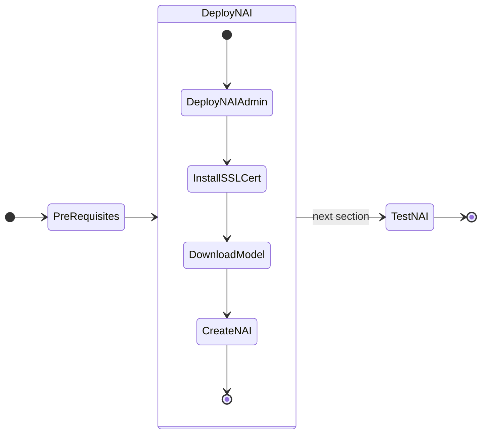
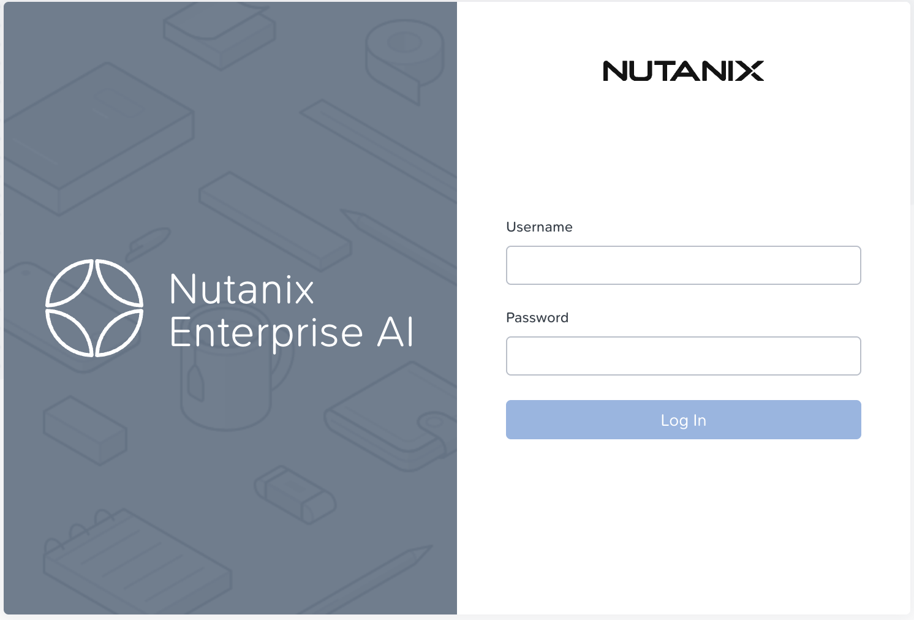
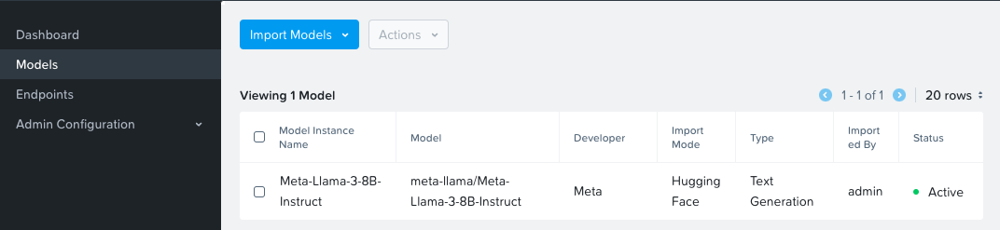

# Deploying Nutanix Enterprise AI (NAI) NVD Reference Application

!!! info "Version 2.8.0"

    This version of the NAI deployment is based on the Nutanix Enterprise AI (NAI) ``v2.8.0`` release.


```mermaid
stateDiagram-v2
    direction LR
    
    state DeployNAI {
        [*] --> DeployNAIAdmin
        DeployNAIAdmin -->  InstallSSLCert
        InstallSSLCert --> DownloadModel
        DownloadModel --> CreateNAI
        CreateNAI --> [*]
    }

    [*] --> PreRequisites
    PreRequisites --> DeployNAI 
    DeployNAI --> TestNAI : next section
    TestNAI --> [*]
```

## Deploying Nutanix Enterprise AI

!!! info "Version 2.8.0"

    This version of the NAI deployment is based on the Nutanix Enterprise AI (NAI) ``v2.8.0`` release.
   
### Prepare for NAI Deployment

!!! example "GA Software with NAI v2.8.0"
    
    In this lab, we will deploy GA version of the following software to test the following:

    -  Nutanix Enterprise AI 
  
        * **Unified Endpoints** - multiple endpoints for HA and token-based rate limiting
        * **Providers** - Add remote endpoints from providers to utilize their models in Nutanix Enterprise AI workloads.
        * **NAI Profiles** - Customise NAI deployment by choosing profiles to match concurrency requirements of the environment

!!! info

    Changes in NAI ``v2.8.0``

    - Kserve is of at least of ``v0.19.0``
    - Cert-manager is at least of ``v1.17.2``
    - OpenTelemetry operator is at least of ``v0.114.1``
    - Envoy Gateway is at least of ``v1.8.1``
    - Prometheus Monitoring is at least of ``82.13.6``
    - CloudNativePG Operator is ar least of ``0.28.0`` [usually pre-installed with NKP]
    - LeaderWorkerSet is at least of ``0.8.0``
  
### Enable Pre-requisite Applications  

!!! warning
    
    Make sure to license NKP cluster with at least NKP Pro License to make use of the NKP Applications catalog to provision NAI (and other applications)
    
#### Prometheus

The following pre-requisite applications will be enabled on NKP GUI:

!!! note

    In this lab, we will be using the **Management Cluster Workspace** to deploy our Nutanix Enterprise AI (NAI)

    However, in a customer environment, it is recommended to use a separate workload NKP cluster.

**Search** and **Enable** the following applications: follow this order to install dependencies for NAI application


1. In the NKP GUI, Go to **Clusters**
2. Click on **Management Cluster Workspace**
3. Go to **Applications** to search and enable the following:
   
     * **Prometheus Monitoring** : version ``78.4.0`` or higher with the following ``Values`` configuration 

4. Wait for ``Deployed`` state in the GUI

??? "Cert Manager" 

    Cert Manager is pre-installed on all NKP Clusters. If not installed, use the following method to install:
    
    1. In the NKP GUI, Go to **Clusters**
    2. Click on **Management Cluster Workspace**
    3. Go to **Applications** to search and enable the following:
    
         * **Cert-manager**- ``v1.17.2``
            
    4. Wait for ``Deployed`` state in the GUI

#### Envoy Gateway 

5. Login to VSC on the jumphost VM, append the following environment variables to the ``$HOME\airgap-nai\.env`` file and save it
   
    === ":octicons-file-code-16: Template ``$HOME\airgap-nai\.env``"

        ```bash
        export NAI_USER=_your_desired_nai_ui_username
        export NAI_TEMP_PASS=_your_desired_nai_ui_password # At least 8 characters
        export REGISTRY=_your_private_registry
        export REGISTRY_USERNAME=admin
        export REGISTRY_PASSWORD=_your_private_registry_password
        export REGISTRY_EMAIL=admin
        export IMAGE_PULL_SECRET=_your_desired_pull_secret_name
        ```

    === ":octicons-file-code-16: Sample ``$HOME\airgap-nai\.env``"

        ```{ .text .no-copy }
        export NAI_USER=admin
        export NAI_TEMP_PASS=_XXXXXXXXX # At least 8 characters
        export REGISTRY=harbor.10.x.x.134.nip.io
        export REGISTRY_USERNAME=admin
        export REGISTRY_PASSWORD=XXXXXXXXXXX
        export REGISTRY_EMAIL=admin
        export IMAGE_PULL_SECRET=nai-regcred
        ```
  
6. IN VSC,go to **Terminal** :octicons-terminal-24: and run the following commands to source the environment variables

    === ":octicons-command-palette-16: Command"

        ```bash
        source $HOME/airgap-nai/.env
        ```

7. Create Kubernetes namespaces and docker-registry secrets for **Envoy Gateway System**

    === ":octicons-command-palette-16: Command"
    
        ```bash
        kubectl create namespace envoy-gateway-system --dry-run=client -o yaml | kubectl apply -f -
        ```
        ```bash
        kubectl create secret docker-registry ${IMAGE_PULL_SECRET} \
          --docker-server=${REGISTRY} \
          --docker-username=${REGISTRY_USERNAME} \
          --docker-password=${REGISTRY_PASSWORD} \
          --docker-email=${REGISTRY_EMAIL} \
          -n envoy-gateway-system \
          --dry-run=client -o yaml | kubectl apply -f -
        ```
    
    === ":octicons-command-palette-16: Command output"
    
        ```bash
        namespace/envoy-gateway-system created
        ```
        ```bash
        secret/nai-regcred created
        ```

10. Enable **Envoy Gateway CRDs** ``v1.8.1`` in **AI gateway mode**
   
    === ":octicons-command-palette-16: Command"
    
        ```bash
        helm template eg oci://${REGISTRY}/${PROJECT}/gateway-crds-helm \
          --version v1.8.1 \
          --set crds.gatewayAPI.enabled=true \
          --set crds.envoyGateway.enabled=true \
          | kubectl apply --server-side --force-conflicts -f -
        ```
    
    === ":octicons-command-palette-16: Sample command"
    
        ```bash
        helm template eg oci://harbor.10.x.x.134.nip.io/nutanix/gateway-crds-helm \
          --version v1.8.1 \
          --set crds.gatewayAPI.enabled=true \
          --set crds.envoyGateway.enabled=true \
          | kubectl apply --server-side --force-conflicts -f -
        ```

    === ":octicons-command-palette-16: Command Output"

        ```{ .text .no-copy }
        Pulled: hub.10.x.x.134.nip.io/nutanix/gateway-crds-helm:v1.8.1
        Digest: sha256:cb046d213034c1c8eed5f3257206647971f31d0e6996b345e4325dc86033fa50
        customresourcedefinition.apiextensions.k8s.io/backendtlspolicies.gateway.networking.k8s.io serverside-applied
        customresourcedefinition.apiextensions.k8s.io/gatewayclasses.gateway.networking.k8s.io serverside-applied
        customresourcedefinition.apiextensions.k8s.io/gateways.gateway.networking.k8s.io serverside-applied
        customresourcedefinition.apiextensions.k8s.io/grpcroutes.gateway.networking.k8s.io serverside-applied
        customresourcedefinition.apiextensions.k8s.io/httproutes.gateway.networking.k8s.io serverside-applied
        customresourcedefinition.apiextensions.k8s.io/listenersets.gateway.networking.k8s.io serverside-applied
        customresourcedefinition.apiextensions.k8s.io/referencegrants.gateway.networking.k8s.io serverside-applied
        customresourcedefinition.apiextensions.k8s.io/tcproutes.gateway.networking.k8s.io serverside-applied
        customresourcedefinition.apiextensions.k8s.io/tlsroutes.gateway.networking.k8s.io serverside-applied
        customresourcedefinition.apiextensions.k8s.io/udproutes.gateway.networking.k8s.io serverside-applied
        customresourcedefinition.apiextensions.k8s.io/xbackendtrafficpolicies.gateway.networking.x-k8s.io serverside-applied
        customresourcedefinition.apiextensions.k8s.io/xmeshes.gateway.networking.x-k8s.io serverside-applied
        customresourcedefinition.apiextensions.k8s.io/backends.gateway.envoyproxy.io serverside-applied
        customresourcedefinition.apiextensions.k8s.io/backendtrafficpolicies.gateway.envoyproxy.io serverside-applied
        customresourcedefinition.apiextensions.k8s.io/clienttrafficpolicies.gateway.envoyproxy.io serverside-applied
        customresourcedefinition.apiextensions.k8s.io/envoyextensionpolicies.gateway.envoyproxy.io serverside-applied
        customresourcedefinition.apiextensions.k8s.io/envoypatchpolicies.gateway.envoyproxy.io serverside-applied
        customresourcedefinition.apiextensions.k8s.io/envoyproxies.gateway.envoyproxy.io serverside-applied
        customresourcedefinition.apiextensions.k8s.io/httproutefilters.gateway.envoyproxy.io serverside-applied
        customresourcedefinition.apiextensions.k8s.io/securitypolicies.gateway.envoyproxy.io serverside-applied
        validatingadmissionpolicy.admissionregistration.k8s.io/safe-upgrades.gateway.networking.k8s.io serverside-applied
        validatingadmissionpolicybinding.admissionregistration.k8s.io/safe-upgrades.gateway.networking.k8s.io serverside-applied
        ```

11. Prepare values file for configuring advanced features for envoy gateway in AI gateway mode.

    === ":octicons-command-palette-16: Command ``eg-config-for-gateway-mode.yaml``"
  
        ```bash
        cat << EOF > eg-config-for-gateway-mode.yaml
        # This file configures Envoy Gateway for AI Gateway mode with rate limiting

        config:
          envoyGateway:
            gateway:
              controllerName: "gateway.envoyproxy.io/gatewayclass-controller"
            logging:
              level:
                default: "info"
            provider:
              kubernetes:
                rateLimitDeployment:
                  patch:
                    type: "StrategicMerge"
                    value:
                      spec:
                        template:
                          spec:
                            containers:
                              - imagePullPolicy: "IfNotPresent"
                                name: "envoy-ratelimit"
                                env:
                                  - name: REDIS_TYPE
                                    value: "sentinel"
                                  - name: REDIS_PIPELINE_WINDOW
                                    value: "150us"
              type: "Kubernetes"
            extensionApis:
              enableEnvoyPatchPolicy: true
              enableBackend: true
            extensionManager:
              maxMessageSize: 11Mi
              backendResources:
                - group: inference.networking.k8s.io
                  kind: InferencePool
                  version: v1
              hooks:
                xdsTranslator:
                  translation:
                    listener:
                      includeAll: true
                    route:
                      includeAll: true
                    cluster:
                      includeAll: true
                    secret:
                      includeAll: true
                  post:
                    - "Translation"
                    - "Cluster"
                    - "Route"
              service:
                fqdn:
                  hostname: "ai-gateway-controller.nai-system.svc.cluster.local"
                  port: 1063
            rateLimit:
              backend:
                type: "Redis"
                redis:
                  url: "mymaster,nai-valkey-sentinel.nai-system.svc.cluster.local:26379"
        EOF
        ```
        
12. Enable **Envoy Gateway** ``v1.8.1`` in **AI gateway mode**
    
    === ":octicons-command-palette-16: Command"
    
        ```bash
        helm upgrade --install eg oci://${REGISTRY}/${PROJECT}/gateway-helm \
          --version v1.8.1 \
          -n envoy-gateway-system --create-namespace --wait \
          --set global.images.envoyGateway.image=${REGISTRY}/${PROJECT}/nai-gateway:v1.8.1 \
          --set global.images.ratelimit.image=${REGISTRY}/${PROJECT}/nai-ratelimit:1e50889b \
          --set "global.imagePullSecrets[0].name=${IMAGE_PULL_SECRET}" \
          -f ./eg-config-for-gateway-mode.yaml
        ```

    === ":octicons-command-palette-16: Sample command"
  
        ```bash
        helm upgrade --install eg oci://harbor.10.x.x.134.nip.io/nutanix/gateway-helm \
          --version v1.8.1 \
          -n envoy-gateway-system \
          --create-namespace --wait \
          --set global.images.envoyGateway.image=harbor.10.x.x.134.nip.io/nutanix/nai-gateway:v1.8.1 \
          --set global.images.ratelimit.image=harbor.10.x.x.134.nip.io/nutanix/nai-ratelimit:1e50889b \
          --set global.imagePullSecrets[0].name=nai-regcred \
          -f ./eg-config-for-gateway-mode.yaml
        ```
  
    === ":octicons-command-palette-16: Command output"
    
        ```{ .text .no-copy }
        Release "eg" does not exist. Installing it now.
        Pulled: harbor.10.x.x.134.nip.io/nutanix/gateway-helm:v1.8.1
        Digest: sha256:47cd05944faacf6eb4fac7f3790df971b35662ead848c1a76945e8279636478d
        Release "eg" has been upgraded. Happy Helming!
        NAME: eg
        LAST DEPLOYED: Wed Sep 16 06:25:31 2026
        NAMESPACE: envoy-gateway-system
        STATUS: deployed
        REVISION: 2
        DESCRIPTION: Upgrade complete
        TEST SUITE: None
        ```

1.  Check if Envoy Gateway resources are ready
    
    !!! warning 
        
        The ``envoy-ratelimit-`` pod will temporarily be in ``CrashLoopBackOff`` state and eventually will transition to ``Running`` after redis-standalone pod is fully deployed in the upcoming [Deploy NAI](iep_deploy.md#deploy-nai) section.

        Ignore the ``CrashLoopBackOff`` state for now and move on to the next section. 
   
    === ":octicons-command-palette-16: Command"
    
        ```bash
        kubectl wait --timeout=5m -n envoy-gateway-system deployment/envoy-gateway --for=condition=Available
        kubectl get pods
        ```

    === ":octicons-command-palette-16: Output"

        ```{ .text .no-copy }
        $ kubectl wait --timeout=5m -n envoy-gateway-system deployment/envoy-gateway --for=condition=Available
        #
        deployment.apps/envoy-gateway condition met

        $ kubectl get pods
        #
        NAME                               READY   STATUS    RESTARTS      AGE
        envoy-gateway-c885698c5-f88wl      1/1     Running   0             102s
        envoy-ratelimit-7c47dd84cc-8qz7n   0/1     Error     4 (48s ago)   101s
        ```

#### Kserve

1. Create kubernetes namespaces and docker-registry secrets for **KServe**
   
    === ":octicons-command-palette-16: Command"
     
         ```bash
         kubectl create namespace kserve --dry-run=client -o yaml | kubectl apply -f -
         ```
         ```bash
         kubectl create secret docker-registry ${IMAGE_PULL_SECRET} \
           --docker-server=${REGISTRY} \
           --docker-username=${REGISTRY_USERNAME} \
           --docker-password=${REGISTRY_PASSWORD} \
           --docker-email=${REGISTRY_EMAIL} \
           -n kserve \
           --dry-run=client -o yaml | kubectl apply -f -
         ```
    
    === ":octicons-command-palette-16: Command output"
    
        ```bash
        namespace/kserve created
        ```
        ```bash
        secret/nai-regcred created
        ```

2. Run the **Kserve CRD** installation

    === ":octicons-command-palette-16: Command"
    
        ```bash
        helm upgrade --install kserve-crd \
          oci://${REGISTRY}/${PROJECT}/kserve-crd \
          --version v0.19.0 \
          -n kserve 
        ```
    
    === ":octicons-command-palette-16: Sample command"
    
        ```bash
        helm upgrade --install kserve-crd \
          oci://harbor.10.x.x.134.nip.io/nutanix/kserve-crd \
          --version v0.19.0 \
          -n kserve 
        ```
    
    === ":octicons-command-palette-16: Command output"
    
        ```{ .text .no-copy }
        Release "kserve-crd" does not exist. Installing it now.
        Pulled: harbor.10.x.x.134.nip.io/nutanix/kserve-crd:v0.19.0
        Digest: sha256:8ea9a76c71d231c297a72b3ed38a773858665f2e7af82105ed14bd8c7295a323
        NAME: kserve-crd
        LAST DEPLOYED: Wed Sep 16 06:35:25 2026
        NAMESPACE: kserve
        STATUS: deployed
        REVISION: 1
        DESCRIPTION: Install complete
        TEST SUITE: None
        ```
  
3. Run the **Kserve** installation


    === ":octicons-command-palette-16: Command"
    
        ```bash
        helm upgrade --install kserve oci://${REGISTRY}/${PROJECT}/kserve-resources \
          --version v0.19.0 \
          -n kserve --wait \
          --set kserve.controller.deploymentMode=RawDeployment \
          --set kserve.controller.gateway.disableIngressCreation=true \
          --set kserve.controller.image=${REGISTRY}/${PROJECT}/nai-kserve-controller \
          --set kserve.controller.rbacProxyImage=${REGISTRY}/${PROJECT}/nai-kube-rbac-proxy:v0.18.0 \
          --set "kserve.controller.imagePullSecrets[0].name=${IMAGE_PULL_SECRET}"
        ```
    
    === ":octicons-command-palette-16: Sample command"
    
        ```bash
        helm upgrade --install kserve oci://harbor.10.x.x.134.nip.io/kserve-resources \
          --version v0.19.0 \
          -n kserve --wait \
          --set kserve.controller.deploymentMode=RawDeployment \
          --set kserve.controller.gateway.disableIngressCreation=true \
          --set kserve.controller.image=harbor.10.x.x.134.nip.io/nutanix/nai-kserve-controller \
          --set kserve.controller.rbacProxyImage=arbor.10.x.x.134.nip.io/nutanix/nai-kube-rbac-proxy:v0.18.0 \
          --set "kserve.controller.imagePullSecrets[0].name=nai-regcred"
        ```
    
    === ":octicons-command-palette-16: Command output"
    
        ```{ .text .no-copy }
        Release "kserve" does not exist. Installing it now.
        Pulled: hub.10.x.x.134.nip.io/nutanix/kserve-resources:v0.19.0
        Digest: sha256:9b0b067d2a9f494cd3046652cc5d084b177fe320d0fbd0593c826335e6dde1a5
        NAME: kserve
        LAST DEPLOYED: Wed Sep 16 06:45:29 2026
        NAMESPACE: kserve
        STATUS: deployed
        REVISION: 1
        DESCRIPTION: Install complete
        TEST SUITE: None
        ```
   
    ??? warning "Kserve install failure?"

        Ocassionally the Kserve install might fail due to webhook race condition. If this happens, wait a few minutes and run the ``helm update --install kserve ...`` commmand from above once again.

        ```bash
        failed calling webhook "clusterservingruntime.kserve-webhook-server.validator": failed to call webhook: Post "https://kserve-webhook-server-service.kserve.svc:443/validate-serving-kserve-io-v1alpha1-clusterservingruntime?timeout=10s": dial tcp 10.106.128.236:443: connect: operation not permitted
        ```

4. Confirm if kserve pod is running
     
    === ":octicons-command-palette-16: Command"
    
        ```bash
        kubectl get pods -n kserve
        ```
    
    === ":octicons-command-palette-16: Command output"
    
        ```{ .text .no-copy }
        $ kubectl get pods 
        #
        NAME                                         READY   STATUS    RESTARTS   AGE
        kserve-controller-manager-5758b77ccf-q2797   2/2     Running   0          106s
        ```

5. Deploy the KServe llmisvc crds
    
    === ":octicons-command-palette-16: Command"
    
        ```bash
        helm upgrade --install kserve-llmisvc-crd oci://${REGISTRY}/${PROJECT}/kserve-llmisvc-crd 
          --version v0.19.0 
          -n kserve --create-namespace --wait
        ```
    
    === ":octicons-command-palette-16: Sample command"
    
        ```bash
        helm upgrade --install kserve-llmisvc-crd oci://hub.10.x.x.134.nip.io/nutanix/kserve-llmisvc-crd 
          --version v0.19.0 
          -n kserve --create-namespace --wait
        ```
    
    === ":octicons-command-palette-16: Command output"
    
        ```{ .text .no-copy }
        Release "kserve-llmisvc-crd" does not exist. Installing it now.
        Pulled: hub.10.122.7.90.nip.io/nutanix/kserve-llmisvc-crd:v0.19.0
        Digest: sha256:21b0c1dcaf0e9c9afef345e3b16b162b88748ee73df0b0e17fcddf43df6950bc
        NAME: kserve-llmisvc-crd
        LAST DEPLOYED: Wed Sep 16 07:14:11 2026
        NAMESPACE: kserve
        STATUS: deployed
        REVISION: 1
        DESCRIPTION: Install complete
        TEST SUITE: None
        ```
    
6. Deploy the KServe llmisvc controller
    
    === ":octicons-command-palette-16: Command"
    
        ```bash
        helm upgrade --install kserve-llmisvc-resources oci://${REGISTRY}/${PROJECT}/kserve-llmisvc-resources --version v0.19.0 \
          -n kserve --create-namespace --wait 
          --set kserve.createSharedResources=false 
          --set kserve.llmisvc.createGIECRDs=false \
          --set kserve.llmisvc.controller.image=${REGISTRY}/${PROJECT}/nai-llmisvc-controller \
          --set "kserve.llmisvc.controller.imagePullSecrets[0]=${IMAGE_PULL_SECRET}"
        ```
    
    === ":octicons-command-palette-16: Sample command"
    
        ```bash
        helm upgrade --install kserve-llmisvc-resources oci://hub.10.122.7.90.nip.io/nutanix/kserve-llmisvc-resources --version v0.19.0   
          -n kserve --create-namespace --wait -
          --set kserve.createSharedResources=false 
          --set kserve.llmisvc.createGIECRDs=false   
          --set kserve.llmisvc.controller.image=hub.10.122.7.90.nip.io/nutanix/nai-llmisvc-controller  
          --set kserve.llmisvc.controller.imagePullSecrets[0]=nai-regcred
        ```
    
    === ":octicons-command-palette-16: Command output"
    
        ```{ .text .no-copy }
        Release "kserve-llmisvc-resources" does not exist. Installing it now.
        Pulled: hub.10.122.7.90.nip.io/nutanix/kserve-llmisvc-resources:v0.19.0
        Digest: sha256:30974dd651ad3877a9dd032e900987c3a0d0820ee56227eb6daf2e6780f405a5
        NAME: kserve-llmisvc-resources
        LAST DEPLOYED: Wed Sep 16 07:17:06 2026
        NAMESPACE: kserve
        STATUS: deployed
        REVISION: 1
        DESCRIPTION: Install complete
        TEST SUITE: None
        ```
    
7. Confirm if Kserve llmisvc pod is running
     
    === ":octicons-command-palette-16: Command"
    
        ```bash
        kubectl get pods -n kserve
        ```
    
    === ":octicons-command-palette-16: Command output"
    
        ```{ .text .no-copy }
        $ kubectl get pods 
        #
        NAME                                         READY   STATUS    RESTARTS   AGE
        kserve-controller-manager-5758b77ccf-q2797   2/2     Running   0          3m
        llmisvc-controller-manager-7d594c9744-gxknx  1/1     Running   0          107s
        ```

#### CloudNativePG

!!! note
    
    NKP will have CloudNativePG pre-installed as a part of regular install. Check in the Applications Catalog of the NKP cluster for its presence. 

    Check for CloudNativePG ``v0.28.0``, if present, skip this section. 

1. In the NKP GUI, Go to **Clusters**
2. Click on **Management Cluster Workspace**
3. Go to **Applications** to search and enable the following:
   
     * **CloudNativePG** : version ``0.28.0``

#### LeaderWorkerSet

LeaderWorkerSet (LWS) is an open-source, custom Kubernetes API designed to deploy and manage multi-node AI/ML workloads—such as large language model (LLM) distributed inference and training—as a single, cohesive unit. It automatically groups a collection of pods into a specific topology consisting of one leader pod and multiple worker pods, managing their entire lifecycle simultaneously so that if a single pod fails, the entire group restarts together to prevent data inconsistency. Furthermore, LWS simplifies network communication across these nodes by automatically injecting group environment variables and optimizing pod placement within the same network topology to guarantee high-throughput, low-latency data transfers between GPUs.

1. Create kubernetes namespaces and docker-registry secrets for **LeaderWorkerSet**
   
    === ":octicons-command-palette-16: Command"
     
         ```bash
         kubectl create namespace lws-system --dry-run=client -o yaml | kubectl apply -f -
         ```
         ```bash
         kubectl create secret docker-registry ${IMAGE_PULL_SECRET} \
           --docker-server=${REGISTRY} \
           --docker-username=${REGISTRY_USERNAME} \
           --docker-password=${REGISTRY_PASSWORD} \
           --docker-email=${REGISTRY_EMAIL} \
           -n lws-system \
           --dry-run=client -o yaml | kubectl apply -f -
         ```
    
    === ":octicons-command-palette-16: Command output"
    
        ```bash
        namespace/lws-system created
        ```
        ```bash
        secret/nai-regcred created
        ```

2. Run the **LeaderWorkerSet** installation

    === ":octicons-command-palette-16: Command"
    
        ```bash
        helm install lws oci://${REGISTRY}/${PROJECT}/lws/charts/lws \
          --version 0.8.0 -n lws-system --create-namespace --wait
        ```
    
    === ":octicons-command-palette-16: Sample command"
    
        ```bash
        helm install lws oci://harbor.10.x.x.134.nip.io/nutanix/lws/charts/lws \
         --version 0.8.0 -n lws-system --create-namespace --wait
        ```
    
    === ":octicons-command-palette-16: Command output"
    
        ```{ .text .no-copy }
        Pulled: hub.10.122.7.90.nip.io/nutanix/lws/charts/lws:0.8.0
        Digest: sha256:e7996d0b9ca8a1ab2d86458b0435a8d842389b81325dc650792389a2c1ad7f57
        NAME: lws
        LAST DEPLOYED: Wed Sep 16 09:18:46 2026
        NAMESPACE: lws-system
        STATUS: deployed
        REVISION: 1
        DESCRIPTION: Install complete
        TEST SUITE: None
        ```

3. Confirm if **LeaderWorkerSet** pod is running
     
    === ":octicons-command-palette-16: Command"
    
        ```bash
        kubectl get pods -n opentelemetry
        ```
    
    === ":octicons-command-palette-16: Command output"
    
        ```{ .text .no-copy }
        $ kubectl get pods 
        #
        NAME                                     READY   STATUS    RESTARTS   AGE
        lws-controller-manager-bc855786c-ccrpb   1/1     Running   0          1m
        ```

#### OpenTelemetry

1. Create kubernetes namespaces and docker-registry secrets for **OpenTelemetry**
   
    === ":octicons-command-palette-16: Command"
    
        ```bash
        kubectl create namespace opentelemetry --dry-run=client -o yaml | kubectl apply -f -
        ```
        ```bash
        kubectl create secret docker-registry ${IMAGE_PULL_SECRET} \
          --docker-server=${REGISTRY} \
          --docker-username=${REGISTRY_USERNAME} \
          --docker-password=${REGISTRY_PASSWORD} \
          --docker-email=${REGISTRY_EMAIL} \
          -n opentelemetry \
          --dry-run=client -o yaml | kubectl apply -f -
        ```
    
    === ":octicons-command-palette-16: Command output"
    
        ```bash
        namespace/opentelemetry created
        ```
        ```bash
        secret/nai-regcred created
        ```

2. Run the **OpenTelemetry** operator installation

    === ":octicons-command-palette-16: Command"
    
        ```bash
        helm upgrade --install opentelemetry-operator oci://${REGISTRY}/${PROJECT}/opentelemetry-operator \
          --version 0.114.1 \
          -n opentelemetry --create-namespace --wait \
          --set manager.image.repository=${REGISTRY}/${PROJECT}/nai-opentelemetry-operator \
          --set manager.collectorImage.repository=${REGISTRY}/${PROJECT}/nai-opentelemetry-collector-contrib \
          --set "imagePullSecrets[0].name=${IMAGE_PULL_SECRET}"
        ```
    
    === ":octicons-command-palette-16: Command sample"
    
        ```bash
        helm upgrade --install opentelemetry-operator oci://harbor.10.x.x.134.nip.io/nutanix/opentelemetry-operator \
          --version 0.114.1 \
          -n opentelemetry --create-namespace --wait \
          --set manager.image.repository=harbor.10.x.x.134.nip.io/nutanix/nai-opentelemetry-operator \
          --set manager.collectorImage.repository=harbor.10.x.x.134.nip.io/nutanix/nai-opentelemetry-collector-k8s \
          --set kubeRBACProxy.image.repository=harbor.10.x.x.134.nip.io/nutanix/nai-kube-rbac-proxy 
          --set imagePullSecrets[0].name=nai-regcred
        ```
    
    === ":octicons-command-palette-16: Command output"
    
        ```{ .text .no-copy }
        Release "opentelemetry-operator" does not exist. Installing it now.
        Pulled: hub.10.x.x.134.nip.io/nutanix/opentelemetry-operator:0.114.1
        Digest: sha256:49164673027025e8df2bd7d1696036ddc2f9d43dadc42f2d4e083375994d405d
        NAME: opentelemetry-operator
        LAST DEPLOYED: Wed Sep 16 06:52:32 2026
        NAMESPACE: opentelemetry
        STATUS: deployed
        REVISION: 1
        DESCRIPTION: Install complete
        ```


3. Confirm if **Opentelemetry** pod is running
     
    === ":octicons-command-palette-16: Command"
    
        ```bash
        kubectl get pods -n opentelemetry
        ```
    
    === ":octicons-command-palette-16: Command output"
    
        ```{ .text .no-copy }
        $ kubectl get pods 
        #
        NAME                                      READY   STATUS    RESTARTS   AGE
        opentelemetry-operator-6979c94795-8tdrl   1/1     Running   0          60s
        ```

## Deploy NAI

1. Append the following environment variables to the ``$HOME\airgap-nai\.env`` file and save it
   
    === ":octicons-file-code-16: Template ``$HOME\airgap-nai\.env``"

        ```bash
        export NAI_API_RWX_STORAGECLASS=_desired_rwx_files_storageclass_created_in_previous_section
        export NAI_DEFAULT_RWO_STORAGECLASS=_desired_rwo_volume_storageclass
        export NKP_WORKSPACE_NAMESPACE=_desired_nkp_workspace # (1)!
        ```

        1. Get the values for the NKP workspace using the following commands:

            ```bash
            nkp get workspaces
            # Get the names of workspaces
            # NAME                    NAMESPACE                   
            # default-workspace       kommander-default-workspace
            # kommander-workspace     kommander 

            nkp get clusters -w kommander-workspace
            # Ensure the target cluster is in the correct workspace
            # WORKSPACE               NAME            KUBECONFIG                              STATUS 
            # kommander-workspace     host-cluster    kommander-self-attach-kubeconfig        Joined
            ```
    === ":octicons-file-code-16: Sample ``$HOME\airgap-nai\.env``"

        ```bash
        export NAI_API_RWX_STORAGECLASS=nai-nfs-storage
        export NAI_DEFAULT_RWO_STORAGECLASS=nutanix-volume
        export NKP_WORKSPACE_NAMESPACE=kommander-workspace #(1)!
        ```

        1. Use ``kommander-workspace`` if this is where your cluster is deployed

1. Source the environment variables (if not done so already)

    ```bash
    source $HOME/airgap-nai/.env
    ```

2. Create kubernetes namespaces and docker-registry secrets for **NAI**
   
    === ":octicons-command-palette-16: Command"
    
        ```bash
        kubectl create namespace nai-system --dry-run=client -o yaml | kubectl apply -f -
        ```
        ```bash
        kubectl create secret docker-registry ${IMAGE_PULL_SECRET} \
          --docker-server=${REGISTRY} \
          --docker-username=${REGISTRY_USERNAME} \
          --docker-password=${REGISTRY_PASSWORD} \
          --docker-email=${REGISTRY_EMAIL} \
          -n nai-system \
          --dry-run=client -o yaml | kubectl apply -f -
        ```
    
    === ":octicons-command-palette-16: Command output"
    
        ```bash
        namespace/nai-system created
        ```
        ```bash
        secret/nai-regcred created
        ```

3. In `VSCode` Explorer pane, browse to ``$HOME/airgap-nai`` folder
   
4. Run the following command to create a helm values file:

    === ":octicons-command-palette-16: Command - ``darksite-nai-operators.yaml``"

        ```bash
        cat <<EOF > darksite-nai-operators.yaml
        global:
          imagePullSecrets:
            - name: ${IMAGE_PULL_SECRET}
          storage:
            storageClassName: ${NAI_DEFAULT_RWO_STORAGECLASS}
        
        naiValkey:
          image:
            name: ${REGISTRY}/${PROJECT}/nai-valkey
        
        naiJobs:
          naiJobsImage:
            image: ${REGISTRY}/${PROJECT}/nai-jobs
        
        nai-clickhouse-operator:
          operator:
            image:
              registry: ${REGISTRY}
              repository: ${PROJECT}/nai-clickhouse-operator
          metrics:
            image:
              registry: ${REGISTRY}
              repository: ${PROJECT}/nai-clickhouse-metrics-exporter
        
        ai-gateway-helm:
          extProc:
            image:
              repository: ${REGISTRY}/${PROJECT}/nai-ai-gateway-extproc
          controller:
            image:
              repository: ${REGISTRY}/${PROJECT}/nai-ai-gateway-controller
        
        naiDatabase:
          image: ${REGISTRY}/${PROJECT}/nai-postgresql:17.10-standard-trixie
        EOF
        ```

    === ":octicons-file-code-16: Sample - ``darksite-nai-operators.yaml``"    
       
        ```yaml
        global:
          imagePullSecrets:
            - name: nai-regcred
          storage:
            storageClassName: nutanix-volume
        
        naiValkey:
          image:
            name: hub.10.x.x.134.nip.io/nutanix/nai-valkey
        
        naiJobs:
          naiJobsImage:
            image: hub.10.x.x.134.nip.io/nutanix/nai-jobs
        
        nai-clickhouse-operator:
          operator:
            image:
              registry: hub.10.x.x.134.nip.io
              repository: nutanix/nai-clickhouse-operator
          metrics:
            image:
              registry: hub.10.x.x.134.nip.io
              repository: nutanix/nai-clickhouse-metrics-exporter
        
        ai-gateway-helm:
          extProc:
            image:
              repository: hub.10.x.x.134.nip.io/nutanix/nai-ai-gateway-extproc
          controller:
            image:
              repository: hub.10.x.x.134.nip.io/nutanix/nai-ai-gateway-controller
        
        naiDatabase:
          image: hub.10.x.x.134.nip.io/nutanix/nai-postgresql:17.10-standard-trixie
        ```

5. Install NAI operator in the ``nai-system`` namespace.
    
    ??? "Deploy NAI Profiles"

        NAI ``v2.8.0`` onwards has support for profiles for different capacity of NAI use cases

        | Name     	| Capacity                                                    	|
        |----------	|------------------------------------------------------------	|
        | Default 	| 300 concurrent requests and 100 API Keys       	            |
        | c1k_k200  | 1000 concurrent requests and 200 API Keys                     |
        | c5k_k1k   | 	5000 concurrent requests and 1000 API Keys 	                |
       
        **Extract the profiles from Helm charts:**
 
        === ":octicons-command-palette-16: Command"
        
            ```bash
            helm pull ntnx-charts/nai-operators --version 2.8.0 --untar=true
            helm pull ntnx-charts/nai-core --version 2.8.0 --untar=true
            ```
        
        **The extracted profile will be located in the following path:**
        
        === ":material-link: File Path"
        
            ```bash
            ./nai-operators/profiles/c1k_k200.yaml
            ./nai-operators/profiles/c5k_k1k.yaml
    
            ./nai-core/profiles/c1k_k200.yaml
            ./nai-core/profiles/c5k_k1k.yaml
            ```
        
        **Deploy NAI Operators for ``c1k_k200`` profile**
 
        === ":octicons-command-palette-16: Command"
        
            ```bash hl_lines="5"
            helm upgrade --install nai-operators ntnx-charts/nai-operators --version 2.8.0 \
              -n nai-system --create-namespace --wait --timeout 15m \
              --set "global.storage.storageClassName=${NAI_DEFAULT_RWO_STORAGECLASS}" \
              --set "global.imagePullSecrets[0].name=${REGISTRY_SECRET_NAME}" \
              -f ./nai-operators/profiles/c1k_k200.yaml
            ```
   
    === ":octicons-command-palette-16: Command"

        ```bash
        helm upgrade --install nai-operators oci://${REGISTRY}/${PROJECT}/nai-operators \
          --version=2.8.0 \
          -n nai-system --create-namespace --take-ownership --wait --timeout 15m \
          -f ./darksite-nai-operators.yaml
        ```

    === ":octicons-command-palette-16: Sample Command"
      
        ```{ .text .no-copy }
        helm upgrade --install nai-operators oci://harbor.10.x.x.134.nip.io/nutanix/nai-operators \
          --version=2.8.0 \
          -n nai-system --create-namespace --take-ownership --wait --timeout 15m \
          -f ./darksite-nai-operators.yaml
        ```

    === ":octicons-command-palette-16: Command output"
      
        ```{ .text .no-copy }
        Release "nai-operators" does not exist. Installing it now.
        Pulled: hub.10.x.x.134.nip.io/nutanix/nai-operators:2.8.0
        Digest: sha256:9ab3d20a379d8933094ceb8f9980454582f712d8b6a7c973e3549aa49f95cb59
        NAME: nai-operators
        LAST DEPLOYED: Wed Sep 16 07:03:11 2026
        NAMESPACE: nai-system
        STATUS: deployed
        REVISION: 1
        DESCRIPTION: Install complete
        TEST SUITE: None
        ```

6. Verify all three nai-operator pods are running. Note that ``ai-gateway-controller-`` pod is also running as we are installing AI Gateway features
   
    === ":octicons-command-palette-16: Command"
    
        ```bash
        kubens nai-system
        kubectl get pod
        ```
    
    === ":octicons-command-palette-16: Command output"
    
        ```{ .text .no-copy }
        $ kubectl get po
        #
        NAME                                                     READY   STATUS    RESTARTS   AGE
        ai-gateway-controller-647d6946bb-b5gps                   1/1     Running   0          28s
        nai-db-iep-1                                             1/1     Running   0          2m10s
        nai-operators-nai-clickhouse-operator-746b4bc55d-x5tmr   2/2     Running   0          2m50s
        nai-valkey-0                                             1/1     Running   0          2m50s
        nai-valkey-sentinel-0                                    1/1     Running   0          2m50s
        ```

7. Run the following command to create a helm values file:

    === ":octicons-command-palette-16: Template - ``darksite-nai-core.yaml``"

        ```bash
        cat <<EOF > darksite-nai-core.yaml
        global:
          imagePullSecrets:
            - name: ${IMAGE_PULL_SECRET}
          storage:
            storageClassName: ${NAI_DEFAULT_RWO_STORAGECLASS}
            storageClassNameRWX: ${NAI_API_RWX_STORAGECLASS}
        
        gateway:
          envoyDeployment:
            container:
              image: ${REGISTRY}/${PROJECT}/nai-envoy:distroless-v1.38.0
        
        naiIepOperator:
          iepOperatorImage:
            image: ${REGISTRY}/${PROJECT}/nai-iep-operator
        
          modelProcessorImage:
            image: ${REGISTRY}/${PROJECT}/nai-python-processor
        
          dataSourceProcessorImage:
            image: ${REGISTRY}/${PROJECT}/nai-python-processor
        
          batchInferenceProcessor:
            containers:
              processor:
                image: ${REGISTRY}/${PROJECT}/nai-go-processor
              statusProvider:
                image: ${REGISTRY}/${PROJECT}/nai-go-processor
        
          finetuneProcessor:
            containers:
              processor:
                image: ${REGISTRY}/${PROJECT}/nai-finetuning
              statusProvider:
                image: ${REGISTRY}/${PROJECT}/nai-go-processor
        
        naiInferenceUi:
          naiUiImage:
            image: ${REGISTRY}/${PROJECT}/nai-inference-ui
        
        naiJobs:
          naiJobsImage:
            image: ${REGISTRY}/${PROJECT}/nai-jobs
        
        naiApi:
          naiApiImage:
            image: ${REGISTRY}/${PROJECT}/nai-api
          supportedTGIImage: ${REGISTRY}/${PROJECT}/nai-tgi
          supportedKserveRuntimeImage: ${REGISTRY}/${PROJECT}/nai-kserve-huggingfaceserver
          eppImage: ${REGISTRY}/${PROJECT}/nai-epp-inference-scheduler
          supportedVLLMImage: ${REGISTRY}/${PROJECT}/nai-vllm
          supportedKserveCustomModelServerRuntimeImage: ${REGISTRY}/${PROJECT}/nai-kserve-custom-model-server
        
        naiDatabase:
          clientImage: ${REGISTRY}/${PROJECT}/nai-postgresql:17.10-standard-trixie
        
        naiIam:
          iamProxy:
            image: ${REGISTRY}/${PROJECT}/nai-iam-proxy
        
          iamProxyControlPlane:
            image: ${REGISTRY}/${PROJECT}/nai-iam-proxy-control-plane
        
          iamUi:
            image: ${REGISTRY}/${PROJECT}/nai-iam-ui
        
          iamUserAuthn:
            image: ${REGISTRY}/${PROJECT}/nai-iam-user-authn
        
          iamThemis:
            image: ${REGISTRY}/${PROJECT}/nai-iam-themis
        
          iamThemisBootstrap:
            image: ${REGISTRY}/${PROJECT}/nai-iam-bootstrap
        
        naiAgent:
          agentImage:
            image: ${REGISTRY}/${PROJECT}/nai-agent-app
        
        naiLabs:
          labsImage:
            image: ${REGISTRY}/${PROJECT}/nai-rag-app
        
        nai-clickhouse-keeper:
          clickhouseKeeper:
            image:
              registry: ${REGISTRY}
              repository: ${PROJECT}/nai-clickhouse-keeper
        
        oauth2-proxy:
          image:
            repository: ${REGISTRY}/${PROJECT}/nai-oauth2-proxy
        
        nai-clickhouse-server:
          clickhouse:
            image:
              registry: ${REGISTRY}
              repository: ${PROJECT}/nai-clickhouse-server
            initContainers:
              addUdf:
                image:
                  registry: ${REGISTRY}
                  repository: ${PROJECT}/nai-clickhouse-udf
              waitForKeeper:
                image:
                  registry: ${REGISTRY}
                  repository: ${PROJECT}/nai-jobs
        
        nai-clickhouse-schemas:
          image:
            registry: ${REGISTRY}
            repository: ${PROJECT}/nai-clickhouse-schemas
        
        naiMonitoring:
          opentelemetry:
            collectorImage: ${REGISTRY}/${PROJECT}/nai-opentelemetry-collector-contrib:0.152.0
            targetAllocator:
              image:
                repository: ${REGISTRY}/${PROJECT}/nai-target-allocator
          nodeExporter:
            serviceMonitor:
              namespaceSelector:
                matchNames:
                  - prometheus
                  - kommander
                  - kommander-default-workspace
                  - ${NKP_WORKSPACE_NAMESPACE}
          dcgmExporter:
            serviceMonitor:
              namespaceSelector:
                matchNames:
                  - prometheus
                  - kommander
                  - kommander-default-workspace
                  - ${NKP_WORKSPACE_NAMESPACE}
        EOF
        ```

    === ":octicons-file-code-16: Sample - ``darksite-nai-core.yaml``"    
       
        ```yaml
        global:
          imagePullSecrets:
            - name: nai-regcred
          storage:
            storageClassName: nutanix-volume
            storageClassNameRWX: nai-nfs-storage
        
        gateway:
          envoyDeployment:
            container:
              image: hub.10.x.x.134.nip.io/nutanix/nai-envoy:distroless-v1.38.0
        
        naiIepOperator:
          iepOperatorImage:
            image: hub.10.x.x.134.nip.io/nutanix/nai-iep-operator
        
          modelProcessorImage:
            image: hub.10.x.x.134.nip.io/nutanix/nai-python-processor
        
          dataSourceProcessorImage:
            image: hub.10.x.x.134.nip.io/nutanix/nai-python-processor
        
          batchInferenceProcessor:
            containers:
              processor:
                image: hub.10.x.x.134.nip.io/nutanix/nai-go-processor
              statusProvider:
                image: hub.10.x.x.134.nip.io/nutanix/nai-go-processor
        
          finetuneProcessor:
            containers:
              processor:
                image: hub.10.x.x.134.nip.io/nutanix/nai-finetuning
              statusProvider:
                image: hub.10.x.x.134.nip.io/nutanix/nai-go-processor
        
        naiInferenceUi:
          naiUiImage:
            image: hub.10.x.x.134.nip.io/nutanix/nai-inference-ui
        
        naiJobs:
          naiJobsImage:
            image: hub.10.x.x.134.nip.io/nutanix/nai-jobs
        
        naiApi:
          naiApiImage:
            image: hub.10.x.x.134.nip.io/nutanix/nai-api
          supportedTGIImage: hub.10.x.x.134.nip.io/nutanix/nai-tgi
          supportedKserveRuntimeImage: hub.10.x.x.134.nip.io/nutanix/nai-kserve-huggingfaceserver
          eppImage: hub.10.x.x.134.nip.io/nutanix/nai-epp-inference-scheduler
          supportedVLLMImage: hub.10.x.x.134.nip.io/nutanix/nai-vllm
          supportedKserveCustomModelServerRuntimeImage: hub.10.x.x.134.nip.io/nutanix/nai-kserve-custom-model-server
        
        naiDatabase:
          clientImage: hub.10.x.x.134.nip.io/nutanix/nai-postgresql:17.10-standard-trixie
        
        naiIam:
          iamProxy:
            image: hub.10.x.x.134.nip.io/nutanix/nai-iam-proxy
        
          iamProxyControlPlane:
            image: hub.10.x.x.134.nip.io/nutanix/nai-iam-proxy-control-plane
        
          iamUi:
            image: hub.10.x.x.134.nip.io/nutanix/nai-iam-ui
        
          iamUserAuthn:
            image: hub.10.x.x.134.nip.io/nutanix/nai-iam-user-authn
        
          iamThemis:
            image: hub.10.x.x.134.nip.io/nutanix/nai-iam-themis
        
          iamThemisBootstrap:
            image: hub.10.x.x.134.nip.io/nutanix/nai-iam-bootstrap
        
        naiAgent:
          agentImage:
            image: hub.10.x.x.134.nip.io/nutanix/nai-agent-app
        
        naiLabs:
          labsImage:
            image: hub.10.x.x.134.nip.io/nutanix/nai-rag-app
        
        nai-clickhouse-keeper:
          clickhouseKeeper:
            image:
              registry: hub.10.x.x.134.nip.io
              repository: nutanix/nai-clickhouse-keeper
        
        oauth2-proxy:
          image:
            repository: hub.10.x.x.134.nip.io/nutanix/nai-oauth2-proxy
        
        nai-clickhouse-server:
          clickhouse:
            image:
              registry: hub.10.x.x.134.nip.io
              repository: nutanix/nai-clickhouse-server
            initContainers:
              addUdf:
                image:
                  registry: hub.10.x.x.134.nip.io
                  repository: nutanix/nai-clickhouse-udf
              waitForKeeper:
                image:
                  registry: hub.10.x.x.134.nip.io
                  repository: nutanix/nai-jobs
        
        nai-clickhouse-schemas:
          image:
            registry: hub.10.x.x.134.nip.io
            repository: nutanix/nai-clickhouse-schemas
        
        naiMonitoring:
          opentelemetry:
            collectorImage: hub.10.x.x.134.nip.io/nutanix/nai-opentelemetry-collector-contrib:0.152.0
            targetAllocator:
              image:
                repository: hub.10.x.x.134.nip.io/nutanix/nai-target-allocator
          nodeExporter:
            serviceMonitor:
              namespaceSelector:
                matchNames:
                  - prometheus
                  - kommander
                  - kommander-default-workspace
                  - kommander-workspace
          dcgmExporter:
            serviceMonitor:
              namespaceSelector:
                matchNames:
                  - prometheus
                  - kommander
                  - kommander-default-workspace
                  - kommander-workspace
        ```

8. Install NAI Core helm chart in the nai-system namespace 
   
    ??? "Deploy NAI Profiles"
 
        NAI ``v2.8.0`` onwards has support for profiles for different capacity of NAI use cases

        | Name     	| Capacity                                                    	|
        |----------	|------------------------------------------------------------	|
        | Default 	| 300 concurrent requests and 100 API Keys       	            |
        | c1k_k200  | 1000 concurrent requests and 200 API Keys                     |
        | c5k_k1k   | 	5000 concurrent requests and 1000 API Keys 	                |
      
        **Extract the profiles from Helm charts:**

        === ":octicons-command-palette-16: Command"
        
            ```bash
            helm pull ntnx-charts/nai-operators --version 2.8.0 --untar=true
            helm pull ntnx-charts/nai-core --version 2.8.0 --untar=true
            ```
        
        **The extracted profile will be located in the following path:**
        
        === ":material-link: File Path"
        
            ```bash
            ./nai-operators/profiles/c1k_k200.yaml
            ./nai-operators/profiles/c5k_k1k.yaml
    
            ./nai-core/profiles/c1k_k200.yaml
            ./nai-core/profiles/c5k_k1k.yaml
            ```
        
        **Deploy NAI Core for ``c1k_k200`` profile**
        
        === ":octicons-command-palette-16: Command"
        
            ```bash hl_lines="6"
            helm upgrade --install nai-core ntnx-charts/nai-core --version=2.8.0 \
              -n nai-system --create-namespace --wait --timeout 15m \
              --set "global.imagePullSecrets[0].name=${REGISTRY_SECRET_NAME}" \
              --set "global.storage.storageClassNameRWX=${NAI_API_RWX_STORAGECLASS}" \
              --set "global.storage.storageClassName=${NAI_DEFAULT_RWO_STORAGECLASS}" \
              -f ./nai-core/profiles/c1k_k200.yaml
            ```
   
    === ":octicons-command-palette-16: Command"

        ```bash
        helm upgrade --install nai-core oci://${REGISTRY}/${PROJECT}/nai-core \
          --version 2.8.0 \
          -n nai-system --create-namespace --wait --timeout 15m \
          --set "gateway.certManager.selfSigned=true" \
          -f ./darksite-nai-core.yaml
        ```

    === ":octicons-command-palette-16: Sample Command"
      
        ```{ .text .no-copy }
        helm upgrade --install nai-core oci://harbor.10.x.x.134/nutanix/nai-core \
          --version 2.8.0 \
          -n nai-system --create-namespace --wait --timeout 15m \
          --set "gateway.certManager.selfSigned=true" \
          -f ./darksite-nai-core.yaml
        ```

    === ":octicons-command-palette-16: Command output"
      
        ```{ .text .no-copy }
        Release "nai-core" does not exist. Installing it now.
        Pulled: harbor.10.x.x.134.nip.io/nutanix/nai-core:2.8.0
        NAME: nai-core
        LAST DEPLOYED: Wed Sep 17 01:38:56 2026
        NAMESPACE: nai-system
        STATUS: deployed
        REVISION: 1
        DESCRIPTION: Install complete
        TEST SUITE: None
        ```

9.  Check if all NAI core pods are running 
   
    === ":octicons-command-palette-16: Command"

        ```bash
        kubens nai-system
        kubectl get pods
        ```
    
    === ":octicons-command-palette-16: Command output"

        ```{ .text, .no-copy}
        Active namespace is "nai-system".
        #
        $ kubectl get pods
        #
        NAME                                                     READY   STATUS      RESTARTS      AGE
        ai-gateway-controller-647d6946bb-zk5qm                   1/1     Running     0             16h
        chi-nai-clickhouse-server-chcluster1-0-0-0               1/1     Running     0             68m
        chk-nai-clickhouse-keeper-chkeeper-0-0-0                 1/1     Running     0             68m
        iam-database-bootstrap-ezodq-h6gts                       0/1     Completed   0             68m
        iam-proxy-7df46c57-lh4tv                                 1/1     Running     0             68m
        iam-proxy-control-plane-57b65bbb-zkgwc                   1/1     Running     0             68m
        iam-themis-768c54cc94-bx8pn                              1/1     Running     0             68m
        iam-themis-bootstrap-gcphr-q5jtg                         0/1     Completed   0             68m
        iam-ui-6f4799949b-m574s                                  1/1     Running     0             68m
        iam-user-authn-546798745-cgdvc                           1/1     Running     0             68m
        nai-agent-7d47dd574-xv5j9                                1/1     Running     0             68m
        nai-api-7688c87f4f-g8fj5                                 1/1     Running     1 (39m ago)   68m
        nai-api-db-migrate-fjyjk-4vtmt                           0/1     Completed   0             68m
        nai-clickhouse-schema-job-1789606277-zwl7w               0/1     Completed   0             68m
        nai-db-iep-1                                             1/1     Running     0             18h
        nai-iep-model-controller-7fffc76bf4-8xdjf                1/1     Running     0             68m
        nai-oauth2-proxy-6cd988fd49-wdzcn                        1/1     Running     0             68m
        nai-operators-nai-clickhouse-operator-746b4bc55d-s8gs4   2/2     Running     0             16h
        nai-otel-collector-collector-4qxr7                       1/1     Running     0             68m
        nai-otel-collector-collector-7tr98                       1/1     Running     0             41m
        nai-otel-collector-collector-b77xq                       1/1     Running     0             68m
        nai-otel-collector-collector-bhdgr                       1/1     Running     0             68m
        nai-otel-collector-collector-jbnrp                       1/1     Running     0             52m
        nai-otel-collector-collector-nrms7                       1/1     Running     0             68m
        nai-otel-collector-collector-s45jt                       1/1     Running     0             68m
        nai-otel-collector-collector-t8gm4                       1/1     Running     0             68m
        nai-otel-collector-collector-x25zc                       1/1     Running     0             68m
        nai-otel-collector-collector-xjl52                       1/1     Running     0             68m
        nai-otel-collector-targetallocator-778bb8969-mn6bp       1/1     Running     0             68m
        nai-securityscan-manager-57fb94f7d6-545fg                1/1     Running     0             68m
        nai-ui-75dbdbd6c6-qn5n6                                  1/1     Running     0             68m
        nai-valkey-0                                             1/1     Running     0             16h
        nai-valkey-sentinel-0                                    1/1     Running     0             18h
        ```

## Install SSL Certificate and Gateway Elements

In this section we will install SSL Certificate to access the NAI UI. This is required as the endpoint will only work with a ssl endpoint with a valid certificate.

NAI UI is accessible using the Envoy Ingress Gateway.

??? tip "Optional and manual - using Public Certificate Authority (CA)"
    
    If an organization generates certificates using a different mechanism then obtain the certificate **+ key** and create a kubernetes secret manually using the following command:
    
    1. Create the certificate from the files (generated using certbot or provided to you)
  
        ```bash
        kubectl -n nai-system create secret tls nai-cert \
        --cert=path/to/nai.crt \
        --key=path/to/nai.key
        ```
    
    2. Combine the certificates to get the certificate bundle
       
        ```bash
        cat server.crt intermediate.crt > tls-bundle.crt
        ```
    
    3. Create a kubernetes secret in the nai-system namespace to use during NAI install
  
        ```bash
          kubectl secret tls nai-cert \
          --cert=tls-bundle.crt \
          --key=server.key \
          -n nai-system
        ```
    
    6. Patch the Envoy gateway with the ``nai-cert`` certificate details
       
        ```bash
        kubectl patch gateway nai-ingress-gateway -n nai-system --type='json' -p='[{"op": "replace", "path": "/spec/listeners/1/tls/certificateRefs/0/name", "value": "nai-cert"}]'
        ```

??? tip "Optional to automate - using Public Certificate Authority (CA) and Cert Manager"  

    Using **Cert Manager** to manage the Public Certificate Authority (CA) for NAI SSL Certificate is also a possiblity.

    At a high level (Cloudflare Example):

    1. Get a API key from DNS provider woth Edit Zone rights
    2. Create a Kubernetes ``Secret`` from the API key
       
        === "Cloudflare Example" 
        
            ```yaml hl_lines="8"
            apiVersion: v1
            kind: Secret
            metadata:
              name: cloudflare-api-token-secret
              namespace: harbor
            type: Opaque
            stringData:
              api-token: _YOUR_CLOUDFLARE_API_TOKEN_HERE
            ```
        
        === "AWS Route 53 Example"
        
            ```yaml hl_lines="8 9"
            apiVersion: v1
            kind: Secret
            metadata:
              creationTimestamp: null
              name: route53-api-token-secret
              namespace: cert-manager
            data:
              access-key-id: "_YOUR_AWS_ACCESS_KEY_ID"
              secret-access-key: "_YOUR_AWS_SECRET_KEY_ID"
            ```

    3. Create a ``ClusterIssuer`` with Cert Mangager/Let's Encrypt - Configure cert-manager to use DNS-01 challenge with Cloudflare for automatic certificate issuance.
        
        === "Cloudflare Example"

            ```yaml hl_lines="8"
            apiVersion: cert-manager.io/v1
            kind: ClusterIssuer
            metadata:
              name: letsencrypt-cloudflare
              namespace: cert-manager
            spec:
              acme:
                email: _YOUR_DOMAIN_OWNER_EMAIL_ADDRESS
                server: https://acme-v02.api.letsencrypt.org/directory
                privateKeySecretRef:
                  name: letsencrypt-cloudflare-account-key
                solvers:
                - dns01:
                    cloudflare:
                      apiTokenSecretRef:
                        name: cloudflare-api-token-secret
                        key: api-token
            ```

        === "AWS Route 53 Example"
            
            ```yaml hl_lines="7"
            apiVersion: cert-manager.io/v1
            kind: ClusterIssuer
            metadata:
              name: letsencrypt-cloudflare
            spec:
              acme:
                email: _YOUR_DOMAIN_OWNER_EMAIL_ADDRESS
                server: https://acme-v02.api.letsencrypt.org/directory
                privateKeySecretRef:
                  name: nai-letsencrypt-cluster
                solvers:
                  - dns01:
                      route53:
                        region: us-east-1
                        accessKeyIDSecretRef:
                          name: route53-api-token-secret
                          key: access-key-id
                        secretAccessKeySecretRef:
                          name: route53-api-token-secret
                          key: secret-access-key
                        hostedZoneID: _HOSTED_ZONE_ID
            ```

    4. Create the ingress resource certificate using the following command:
    
        ```bash hl_lines="12 14 16"
        cat << EOF | k apply -f -
        apiVersion: cert-manager.io/v1
        kind: Certificate
        metadata:
          name: nai-cert
          namespace: nai-system
        spec:
          issuerRef:
            name: letsencrypt-cloudflare
            kind: ClusterIssuer
          secretName: nai-cert
          commonName: nai.domain.com
          dnsNames:
          - nai.domain.com
        EOF
        ```
    
    5. Patch the Envoy gateway with the ``nai-cert`` certificate details
       
        ```bash
        kubectl patch gateway nai-ingress-gateway -n nai-system --type='json' -p='[{"op": "replace", "path": "/spec/listeners/1/tls/certificateRefs/0/name", "value": "nai-cert"}]'
        ```

The following steps show how cert-manager can be used to generate a **self signed certificate** using the default **selfsigned-issuer** present in the cluster for the purposes of the lab.

1. Get the NAI UI ingress gateway host using the following command:

    ```bash
    NAI_UI_ENDPOINT=$(kubectl get svc -n envoy-gateway-system -l "gateway.envoyproxy.io/owning-gateway-name=nai-ingress-gateway,gateway.envoyproxy.io/owning-gateway-namespace=nai-system" -o jsonpath='{.items[0].status.loadBalancer.ingress[0].ip}')
    ```

2. Get the value of ``NAI_UI_ENDPOINT`` environment variable

    === "Command"
  
        ```bash
        echo $NAI_UI_ENDPOINT
        ```
               
    === "Command output"
      
        ```{ .text .no-copy }
        10.x.x.216
        ```

3. We will use the command output e.g: ``10.x.x.216`` as the IP address for NAI as reserved in this [section](../infra/infra_nkp.md#reserve-control-plane-and-metallb-endpoint-ips)

4. Construct the FQDN of NAI UI using [nip.io](https://nip.io/) and we will use this FQDN as the certificate's Common Name (CN).

    === "Template URL"
    
       ```bash
       nai.${NAI_UI_ENDPOINT}.nip.io
       ```
    
    === "Sample URL"
    
       ``` { .text .no-copy }
       nai.10.x.x.216.nip.io
       ```

5. Create the ingress resource certificate using the following command:

    ```bash hl_lines="12 14 16"
    cat << EOF | k apply -f -
    apiVersion: cert-manager.io/v1
    kind: Certificate
    metadata:
      name: nai-cert
      namespace: nai-system
    spec:
      issuerRef:
        name: selfsigned-issuer
        kind: ClusterIssuer
      secretName: nai-cert
      commonName: nai.${NAI_UI_ENDPOINT}.nip.io
      dnsNames:
      - nai.${NAI_UI_ENDPOINT}.nip.io
      ipAddresses:
      - ${NAI_UI_ENDPOINT}
    EOF
    ```

6. Patch the Envoy gateway with the ``nai-cert`` certificate details
   
    ```bash
    kubectl patch gateway nai-ingress-gateway -n nai-system --type='json' -p='[{"op": "replace", "path": "/spec/listeners/1/tls/certificateRefs/0/name", "value": "nai-cert"}]'
    ```

7. Create EnvoyProxy
   
    ```bash
    k apply -f -<<EOF
    apiVersion: gateway.envoyproxy.io/v1alpha1
    kind: EnvoyProxy
    metadata:
      name: envoy-service-config
      namespace: nai-system
    spec:
      provider:
        type: Kubernetes
        kubernetes:
          envoyService:
            type: LoadBalancer
    EOF
    ```

8. Patch the ``nai-ingress-gateway`` resource with the new ``EnvoyProxy`` details

    ```bash
    kubectl patch gateway nai-ingress-gateway -n nai-system --type=merge \
    -p '{
        "spec": {
            "infrastructure": {
                "parametersRef": {
                    "group": "gateway.envoyproxy.io",
                    "kind": "EnvoyProxy",
                    "name": "envoy-service-config"
                }
            }
        }
    }'
    ```

## Accessing the UI

6. In a browser, open the following URL to connect to the NAI UI
   
    ```url
    https://nai.10.x.x.216.nip.io
    ```

7. Use the ``${NAI_USER}`` and ``${NAI_TEMP_PASS}`` values set in ``${ENVIRONMENT}-values.yaml`` files during ``helm`` installation of NAI ``v.2.4.0``
   
8. Change the password for the `admin` user
9.  Login using `admin` user and password.
   
    

## Download Model

We will download and user llama3 8B model which we sized for in the previous section.

We will use the model already downloaded to ``/model_share`` from our jumphost in this [section](../airgap_nai/airgap_nai_pre_reqs.md#download-the-model).

1. In the NAI GUI, go to **Models**
2. Click on **Import Model** from Hugging Face
3. Select the **Manual Import** method
4. Choose the ``meta-llama/Meta-Llama-3.1-8B-Instruct`` model

5. Provide the Model Instance Name as ``Meta-Llama-3.1-8B-Instruct`` and click **Import**
6. Choose the following:
    - **Location** - File Share
    - **File Server Address** - ``labFS.ntnxlab.local`` (point to your File server FQDN)
    - **NFS Export Path**- ``/model_share``
    - **Directory Parth for the Model** - ``Meta-Llama-3.1-8B-Instruct`` (this is the folder created by the model download script)
  
7. Go to VSC Terminal to monitor the download
    
    === ":octicons-command-palette-16: Command"

        ```bash title="Get jobs in nai-admin namespace"
        kubens nai-admin
        
        kubectl get jobs
        ```
        ```bash title="Validate creation of pods and PVC"
        kubectl get po,pvc
        ```
        ```bash title="Verify download of model using pod logs"
        kubectl logs -f _pod_associated_with_job
        ```

    === ":octicons-command-palette-16: Command output"

        ```text title="Get jobs in nai-admin namespace"
        kubens nai-admin

        ✔ Active namespace is "nai-admin"
     
        kubectl get jobs

        NAME                                       COMPLETIONS   DURATION   AGE
        nai-c0d6ca61-1629-43d2-b57a-9f-model-job   0/1           4m56s      4m56
        ```
        ```text title="Validate creation of pods and PVC"
        kubectl get po,pvc

        NAME                                             READY   STATUS    RESTARTS   AGE
        nai-c0d6ca61-1629-43d2-b57a-9f-model-job-9nmff   1/1     Running   0          4m49s

        NAME                                       STATUS   VOLUME                                     CAPACITY   ACCESS MODES   STORAGECLASS      VOLUMEATTRIBUTESCLASS   AGE
        nai-c0d6ca61-1629-43d2-b57a-9f-pvc-claim   Bound    pvc-a63d27a4-2541-4293-b680-514b8b890fe0   28Gi       RWX            nai-nfs-storage   <unset>                 2d
        ```
        ```text title="Verify download of model using pod logs"
        kubectl logs -f nai-c0d6ca61-1629-43d2-b57a-9f-model-job-9nmff 

        [Entrypoint] Downloading Model from Hugging Face
        NAI Monitor: Downloaded directory size: 0.00MB
        The new directory is created! - /data/model-files
        NAI Monitor: Downloaded directory size: 1133.88MB
        NAI Monitor: Downloaded directory size: 2192.08MB
        NAI Monitor: Downloaded directory size: 3222.33MB
        NAI Monitor: Downloaded directory size: 4268.83MB
        NAI Monitor: Downloaded directory size: 5284.63MB
        NAI Monitor: Downloaded directory size: 6246.70MB
        NAI Monitor: Downloaded directory size: 7307.07MB
        NAI Monitor: Downloaded directory size: 8385.94MB
        NAI Monitor: Downloaded directory size: 9427.94MB
        NAI Monitor: Downloaded directory size: 10488.94MB
        NAI Monitor: Downloaded directory size: 11536.19MB
        NAI Monitor: Downloaded directory size: 12567.45MB
        NAI Monitor: Downloaded directory size: 13689.43MB
        NAI Monitor: Downloaded directory size: 14733.81MB
        NAI Monitor: Downloaded directory size: 15631.18MB
        ```

8. Optional - verify the events in the namespace for the pvc creation 
    
    === ":octicons-command-palette-16: Command"

        ```bash
        k get events | awk '{print $1, $3}'
        ```

    === ":octicons-command-palette-16: Command output"

        ```{ .text, .no-copy}
        $ k get events | awk '{print $1, $3}'
    
        3m43s Scheduled
        3m43s SuccessfulAttachVolume
        3m36s Pulling
        3m29s Pulled
        3m29s Created
        3m29s Started
        3m43s SuccessfulCreate
        90s   Completed
        3m53s Provisioning
        3m53s ExternalProvisioning
        3m45s ProvisioningSucceeded
        3m53s PvcCreateSuccessful
        3m48s PvcNotBound
        3m43s ModelProcessorJobActive
        90s   ModelProcessorJobComplete
        ```

The model is downloaded to the Nutanix Files ``pvc`` volume.

After a successful model import, you will see it in **Active** status in the NAI UI under **Models** menu



## Create and Test Inference Endpoint

In this section we will create an inference endpoint using the downloaded model.

1. Navigate to **Inference Endpoints** menu and click on **Create Endpoint** button
2. Fill the following details:
   
    - **Endpoint Name**: ``llama-8b``
    - **Model Instance Name**: ``Meta-LLaMA-8B-Instruct``
    - **Use GPUs for running the models** : ``Checked``
    - **No of GPUs (per instance)**:
    - **GPU Card**: ``NVIDIA-L40S`` (or other available GPU)
    - **No of Instances**: ``1``
    - **API Keys**: Create a new API key or use an existing one

3. Click on **Create**
4. Monitor the ``nai-admin`` namespace to check if the services are coming up
   
    === ":octicons-command-palette-16: Command"

        ```bash
        kubens nai-admin
        kubectl get po,deploy
        ```

    === ":octicons-command-palette-16: Command output"
        
        ```{ .text .no-copy }
        kubens nai-admin
        get po,deploy
        NAME                                                     READY   STATUS        RESTARTS   AGE
        pod/llama8b-predictor-00001-deployment-9ffd786db-6wkzt   2/2     Running       0          71m

        NAME                                                 READY   UP-TO-DATE   AVAILABLE   AGE
        deployment.apps/llama8b-predictor-00001-deployment   1/1     1            0           3d17h
        ```

5. Check the events in the ``nai-admin`` namespace for resource usage to make sure all 
   
    === ":octicons-command-palette-16: Command"
       
        ```bash
        kubectl get events -n nai-admin --sort-by='.lastTimestamp' | awk '{print $1, $3, $5}'
        ```

    === ":octicons-command-palette-16: Command output"
       
        ```bash
        $ kubectl get events -n nai-admin --sort-by='.lastTimestamp' | awk '{print $1, $3, $5}'

        110s FinalizerUpdate Updated
        110s FinalizerUpdate Updated
        110s RevisionReady Revision
        110s ConfigurationReady Configuration
        110s LatestReadyUpdate LatestReadyRevisionName
        110s Created Created
        110s Created Created
        110s Created Created
        110s InferenceServiceReady InferenceService
        110s Created Created
        ```

6. Once the services are running, check the status of the inference service
   
    === ":octicons-command-palette-16: Command"

        ```bash
        kubectl get isvc
        ```

    === ":octicons-command-palette-16: Command output"
        
        ```{ .text .no-copy }
        kubectl get isvc

        NAME      URL                                          READY   PREV   LATEST   PREVROLLEDOUTREVISION   LATESTREADYREVISION       AGE
        llama8b   http://llama8b.nai-admin.svc.cluster.local   True           100                              llama8b-predictor-00001   3d17h
        ```
   
## Troubleshooting Endpoint ISVC 

!!! danger "TGI Imange and Self-signed Certificates"
    
    Only follow this procedure if this ``isvc`` is not starting up.

!!! warning "KNative Serving Image Tag Checking"

    From testing, we have identified that KServe module is making sure that there are no container image tag discrepencies, by pulling image using SHA digest. This is done to avoid pulling images that are updated without updating the tag.

    We have avoided this behavior by patching the ``config-deployment`` config map in the ``knative-serving`` namespace to skip image tag checking. Check this [Prepare for NAI Deployment](#prepare-for-nai-deployment) sectionfor more details.

    ```bash
    kubectl patch configmap  config-deployment -n knative-serving --type merge -p '{"data":{"registries-skipping-tag-resolving":"${REGISTRY}"}'
    ```

    If this procedure was not followed, then the ``isvc`` will not start up.

1. If the ``isvc`` is not coming up, then explore the events in ``nai-admin`` namespace.

    === "Command"
    
        ```bash
        kubens nai-admin
        kubectl get isvc
        kubectl get events  --sort-by='.lastTimestamp'
        ```
    
    === "Command output"
        
        ```text hl_lines="4 9"
        $ kubectl get isvc

        NAME      URL                                          READY   PREV   LATEST   PREVROLLEDOUTREVISION   LATESTREADYREVISION       AGE
        llama8b   http://llama8b.nai-admin.svc.cluster.local   False

        $ kubectl get events --sort-by='.lastTimestamp'
    
        Warning   InternalError         revision/llama8b-predictor-00001   Unable to fetch image "harbor.10.x.x.134.nip.io/nkp/nutanix/nai-tgi:2.3.1-825f39d": failed to resolve image to digest: 
        Get "https://harbor.10.x.x.134.nip.io/v2/": tls: failed to verify certificate: x509: certificate signed by unknown authority
        ```

    The temporary workaround is to use the TGI images SHA signature from the container registry.

    This site will be updated with resolutions for the above issues in the future.

2. Note the above TGI image SHA digest from the container registry.
   
    === "Command"

        ```bash
        docker pull ${REGISTRY}/nutanix/nai-tgi:${NAI_TGI_RUNTIME_VERSION}
        ```

    === "Command output"
        
        ```text hl_lines="4"
        docker pull harbor.10.x.x.134.nip.io/nkp/nutanix/nai-tgi:2.3.1-825f39d

        2.3.1-825f39d: Pulling from nkp/nutanix/nai-tgi
        Digest: sha256:2df9fab2cf86ab54c2e42959f23e6cfc5f2822a014d7105369aa6ddd0de33006
        Status: Image is up to date for harbor.10.x.x.134.nip.io/nkp/nutanix/nai-tgi:2.3.1-825f39d
        harbor.10.x.x.134.nip.io/nkp/nutanix/nai-tgi:2.3.1-825f39d
        ```

3. The SHA digest will look like the following:

    ```text title="TGI image SHA digest will be different for different environments"
    sha256:2df9fab2cf86ab54c2e42959f23e6cfc5f2822a014d7105369aa6ddd0de33006
    ```

4. Create a copy of the ``isvc`` manifest
   
    === ":octicons-command-palette-16: Command"

        ```bash
        kubectl get isvc llama8b -n nai-admin -o yaml > llama8b.yaml
        ```

5. Edit the ``isvc``
   
    === ":octicons-command-palette-16: Command"

        ```bash
        kubectl edit isvc llama8b -n nai-admin
        ```

6. Search and replace the ``image`` tag with the SHA digest from the TGI image.

    ```yaml hl_lines="6"
    <snip>

    env:
    - name: STORAGE_URI
      value: pvc://nai-c34d8d58-d6f8-4cb4-94e4-28-pvc-claim/model-files
      image: harbor.10.x.x.134.nip.io/nkp/nutanix/nai-tgi:2.3.1-825f39d

    <snip>
    ```
7. After replacing the image's SHA digest, the image value should look as follows: 
    
    ```yaml hl_lines="6"
    <snip>

    env:
    - name: STORAGE_URI
      value: pvc://nai-c34d8d58-d6f8-4cb4-94e4-28-pvc-claim/model-files
      image: harbor.10.x.x.134.nip.io/nkp/nutanix/nai-tgi@sha256:2df9fab2cf86ab54c2e42959f23e6cfc5f2822a014d7105369aa6ddd0de33006
    
    <snip>
    ```

8.  Save the ``isvc`` configuration by writing the changes to the file and exiting the vi editor using ``:wq!`` key combination.

9.  Verify that the ``isvc`` is running
    
    === "Command"

        ```bash
        kubens nai-admin
        kubectl get isvc
        ```

    === "Command output"
        
        ```bash hl_lines="4"
        $ kubectl get isvc

        NAME      URL                                          READY   PREV   LATEST   PREVROLLEDOUTREVISION   LATESTREADYREVISION       AGE
        llama8b   http://llama8b.nai-admin.svc.cluster.local   True           100                              llama8b-predictor-00001   3d17h
        ```

This should resolve the issue the issue with the TGI image.

!!! note "Report Other Issues"

    If you are facing any other issues, please report them here in the [NAI LLM GitHub Repo Issues](https://github.com/nutanix-japan/nai-llm/issues) page.