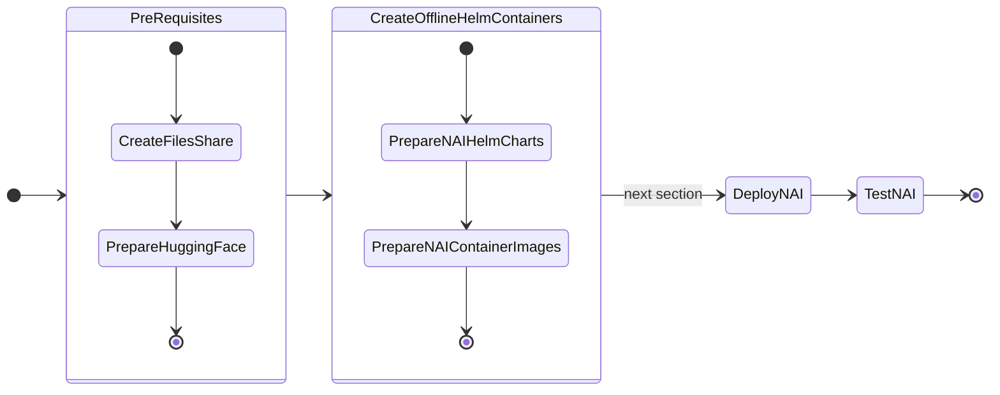
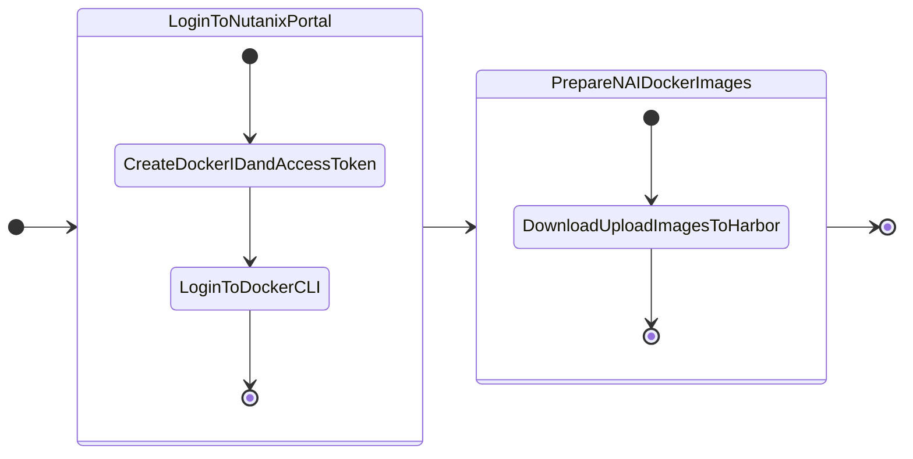

# Pre-requisites for Deploying NAI

In this part of the lab we will prepare pre-requisites for LLM application on GPU nodes.

The following is the flow of the applications lab:



Prepare the following pre-requisites needed to deploy NAI on target kubernetes cluster.

## Create Nutanix Files Storage Class

We will create Nutanix Files storage class which will be used to create a pvc that will store the ``LLama-3-8B`` model files.

1. In **Prism Central**, choose **Files** from the menu
3. Choose the file server (e.g. labFS)
4. Click on **Shares & Exports**
5. Click on **+New Share or Export**
6. Fill the details of the Share
   
    - **Name** - model_share
    - **Description** - for NAI model store
    - **Share path** - leave blank
    - **Max Size** - 10 GiB (adjust to the model file size)
    - **Primary Protocol Access** - NFS

7. Click **Next** and make sure **Enable compression** in checked
8. Click **Next** 
9. In NFS Protocol Access, choose the following: 
   
    - **Authentication** - System
    - **Default Access (for all clients)** - Read-Write 
    - **Squash** - Root Squash

    !!! note
        Consider changing access options for Production environment
  
10. Click **Next**
11. Confirm the share details and click on **Create**

### Create the Files Storage Class

12. Run the following command to check K8S status of the ``nkpdev`` cluster
    
    ```bash
    kubectl get nodes
    ```

12. In VSC Explorer, click on **New File** :material-file-plus-outline: and create a config file with the following name:

    ```bash
    nai-nfs-storage.yaml
    ```

    Add the following content and replace the `nfsServerName` with the name of the Nutanix Files server name .


    

    === "Template YAML"

        ```yaml hl_lines="6 7"
        apiVersion: storage.k8s.io/v1
        kind: StorageClass
        metadata:
          name: nai-nfs-storage
        parameters:
          nfsPath: <nfs-path>
          nfsServer: <nfs-server>
          storageType: NutanixFiles
        provisioner: csi.nutanix.com
        reclaimPolicy: Delete
        volumeBindingMode: Immediate
        ```

    === "Sample YAML"

        ```yaml hl_lines="6 7"
        apiVersion: storage.k8s.io/v1
        kind: StorageClass
        metadata:
          name: nai-nfs-storage
        parameters:
          nfsPath: /model_share
          nfsServer: labFS.ntnxlab.local
          storageType: NutanixFiles
        provisioner: csi.nutanix.com
        reclaimPolicy: Delete
        volumeBindingMode: Immediate
        ```

13. Create the storage class

    ```bash
    kubectl apply -f nai-nfs-storage.yaml
    ```

14. Check storage classes in the cluster for the Nutanix Files storage class

    === "Command"

        ```bash
        kubectl get storageclass
        ```
  
    === "Command output"

        ```bash hl_lines="5"
        kubectl get storageclass

        NAME                       PROVISIONER                     RECLAIMPOLICY   VOLUMEBINDINGMODE      ALLOWVOLUMEEXPANSION   AGE
        dkp-object-store           kommander.ceph.rook.io/bucket   Delete          Immediate              false                  28h
        nai-nfs-storage            csi.nutanix.com                 Delete          Immediate              true                   24h
        nutanix-volume (default)   csi.nutanix.com                 Delete          WaitForFirstConsumer   false                  28h
        ```

## Request Access to Model on Hugging Face

Follow these steps to request access to the `meta-llama/Meta-Llama-3.1-8B-Instruct` model:

!!! info "LLM Recommendation"

    From testing ``google/gemma-2-2b-it`` model is quicker to download and obtain download rights, than ``meta-llama/Meta-Llama-3.1-8B-Instruct`` model.

    Feel free to use the [google/gemma-2-2b-it](https://hf.co/google/gemma-2-2b-it) model if necessary. The procedure to request access to the model is the same.


1. **Sign in to your Hugging Face account**:  

      - Visit [Hugging Face](https://huggingface.co) and log in to your account.

2. **Navigate to the model page**:  

      - Go to the [Meta-Llama-3.1-8B-Instruct model page](https://huggingface.co/meta-llama/Meta-Llama-3.1-8B-Instruct).

3. **Request access**:

      - On the model page, you will see a section or button labeled **Request Access** (this is usually near the top of the page or near the "Files and versions" section).
      - Click **Request Access**.

4. **Complete the form**:

      - You may be prompted to fill out a form or provide additional details about your intended use of the model.
      - Complete the required fields and submit the request.

5. **Wait for approval**:

      - After submitting your request, you will receive a notification or email once your access is granted.
      - This process can take some time depending on the approval workflow.

Once access is granted, there will be an email notification.

!!! note

    Email from Hugging Face can take a few minutes or hours before it arrives.

## Create a Hugging Face Token with Read Permissions

Follow these steps to create a Hugging Face token with read permissions:

1. **Sign in to your Hugging Face account**:  

    - Visit [Hugging Face](https://huggingface.co) and log in to your account.

2. **Access your account settings**:
    - Click on your profile picture in the top-right corner.
    - From the dropdown, select **Settings**.

3. **Navigate to the "Access Tokens" section**:

    - In the sidebar, click on **Access Tokens**.
    - You will see a page where you can create and manage tokens.

4. **Create a new token**:

    - Click the **New token** button.
    - Enter a name for your token (i.e., `read-only-token`).

5. **Set token permissions**:

    - Under the permissions dropdown, select **Read**. For Example:
        

6. **Create and copy the token**:

    - After selecting the permissions, click **Create**.
    - Your token will be generated and displayed only once, so make sure to copy it and store it securely.
  
Use this token for accessing Hugging Face resources with read-only permissions.

## Download Offline NKP Air-gapped Bundle and Helm Charts

1. Open new `VSCode` window on your jumphost VM

2.  In `VSCode` Explorer pane, click on existing ``$HOME`` folder

2.  Click on **New Folder** :material-folder-plus-outline: name it: ``airgap-nai``

3.  On `VSCode` Explorer plane, click the ``$HOME/airgap-nai`` folder

4.  On `VSCode` menu, select ``Terminal`` > ``New Terminal``

5.  Browse to ``airgap-nai`` directory

    ```bash
    cd $HOME/airgap-nai
    ```

7. In ``VSC``, under the newly created ``airgap-nai`` folder, click on **New File** :material-file-plus-outline: and create file with the following name:
   
    ```bash
    .env
    ```

2. Add (append) the following environment variables and save it
   
    === "Template .env"

        ```text
        export KSERVE_VERSION=_your_kserve_version
        export NAI_CORE_VERSION=_your_nai_core_version
        export NAI_API_VERSION=_your_nai_api_version
        ```
    
    === ".env for NAI v2.3.0"
        
        ```text
        export KSERVE_VERSION=0.15.0
        export NAI_CORE_VERSION=2.3.0
        export NAI_API_VERSION=2.3.0
        ```

3. Source the ``.env`` file to import environment variables
   
    ```bash
    source $HOME/airgap-nai/.env
    ```

4. Login to [Nutanix Portal](https://portal.nutanix.com/page/downloads?product=nkp) using your credentials

5. Go to **Downloads** > **NAI Airgapped Bundle**

6.  Download and extract the NAI air-gap ``helm`` bundle from the link you copied earlier
    
    === "Command"

        ```text title="Paste the download URL within double quotes"
        curl -o nai-core-2.3.0.tgz "_paste_download_URL_here"
        ```

    === "Sample command"
        
        ```{ .text .no-copy }
        curl -o nai-core-2.3.0.tgz "https://download.nutanix.com/downloads/nai/2.3.0/nai-core-2.3.0.tgz?........"
        ```

7.  Fetch the ``kserve`` helm charts using the following commands
   
    === "Command"

        ```bash
        helm fetch oci://ghcr.io/kserve/charts/kserve-crd --version=${KSERVE_VERSION}

        helm fetch oci://ghcr.io/kserve/charts/kserve --version=${KSERVE_VERSION}
        ```
    
    === "Command output"
    
        ```{ .text .no-copy }
        Pulled: ghcr.io/kserve/charts/kserve-crd:v0.14.0
        Digest: sha256:6ae5af970d9a9400e8456ad1dbc86360d03f4b6bb00be4f16c48bc0542283d42

        Pulled: ghcr.io/kserve/charts/kserve:v0.14.0
        Digest: sha256:25129d39a4aa85f96159db6933729ea9f35e9d0f7f7cac7918c0a8013672eccb
        ```

8.  Upload the downloaded and prepared helm charts to ChartMuseum instance deployed automatically by Kommander. This will make this consistent with other NKP catalog items and will work seamlessly when this is converted to a catalog item.
    
    ```bash
    nkp push chart-bundle kserve-crd-v0.15.0.tgz
    nkp push chart-bundle kserve-v0.15.0.tgz
    nkp push chart-bundle nai-core-2.3.0.tgz
    ```

9.   Download the NAI air-gap binaries (NAI container images) from the link you copied earlier
    
    === "Command"

        ```text title="Paste the download URL within double quotes"
        curl -o nai-2.3.0.tar "_paste_download_URL_here"
        ```

    === "Sample command"
        
        ```bash title="This download is about 44 GBs"
        curl -o nai-2.3.0.tar "https://download.nutanix.com/downloads/nai/2.3.0/nai-2.3.0.tar?..."
        ```

## Prepare NAI Container Images

The Jumphost VM will be used as a medium to download the NAI container images and upload them to the internal Harbor container registry.



### Upload NAI Docker Images to Harbor

!!! info
    
    The download and upload of the container images will be done in one ``docker push`` command which will use the internal Harbor container registry details.

    ``nkp`` command will do this in a three-step process.

    1. Updload the container images from the downloaded ``nai-2.x.x.tar`` to the jumphost VM local docker images store
    2. Upload it to the internal Harbor container registry 

1. Since we will be using the same internal Harbor container registry to upload container images, make sure the following environment variables are set (these were already set during air-gap NKP preparation)
   
    ```bash
    export REGISTRY_URL=harbor.10.x.x.111.nip.io/nkp
    export REGISTRY_USERNAME=admin
    export REGISTRY_PASSWORD=xxxxxxx
    export REGISTRY_CACERT=$HOME/harbor/certs/ca.crt
    ```

2. **(Optional)** - To view the container images loaded in your local docker container registry, run the following command:

    === "Command"

         ```bash
         docker images --format '{{.Repository}}:{{.Tag}}' | grep nai
         ```
    === "Output"
    
         ```bash
         nutanix/nai-api:v2.3.0
         nutanix/nai-inference-ui:v2.3.0
         nutanix/nai-model-processor:v2.3.0
         nutanix/nai-iep-operator:v2.3.0
         nutanix/nai-tgi:3.2.0-b6a29e9
         nutanix/nai-tgi:3.2.3-10d65dc
         nutanix/nai-kserve-huggingfaceserver:e7295f58
         nutanix/nai-kserve-huggingfaceserver:e7295f58-gpu
         nutanix/nai-kserve-huggingfaceserver:e2e99fcd1-gpu
         nutanix/nai-kserve-controller:v0.14.0
         nutanix/nai-postgres:16.1-alpine
         ```

2. Push the images to the jumphost VM local docker images store
   
    ```bash
    docker image load -i nai-2.3.0.tar
    ```

3. Login to the internal Harbor registy if the harbor project needs authentication
   
    ```bash
    docker login harbor.10.x.x.111.nip.io
    ```

4. Tag and push all the NAI images to refer to the internal harbor registry

    ```bash
    for image in $(docker images --format '{{.Repository}}:{{.Tag}}' | grep 'nai' | grep -v $REGISTRY_URL); do
      docker tag $image $REGISTRY_URL/$(echo $image);
      docker push $REGISTRY_URL/$(echo $image);
    done
    ```

Now we are ready to deploy our NAI workloads.