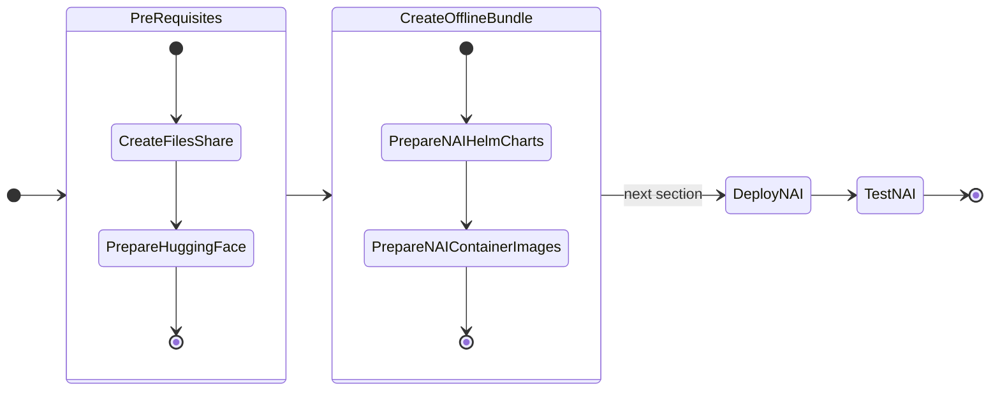
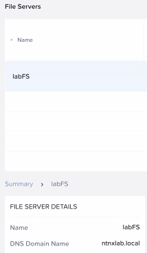
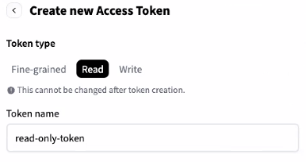
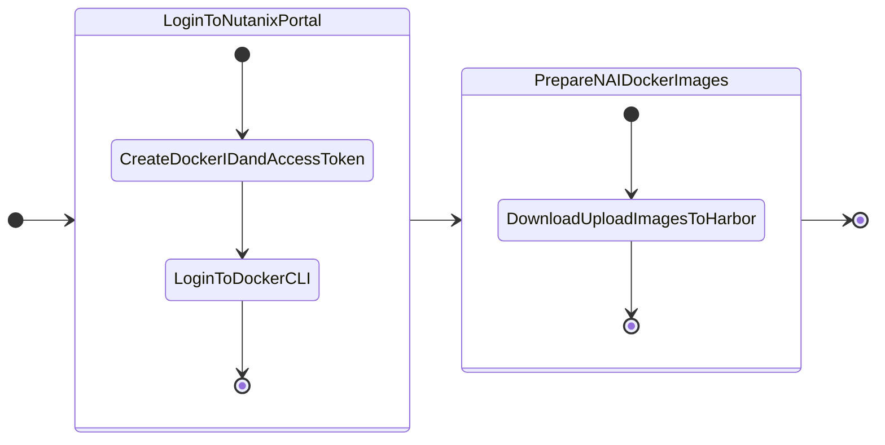

# Pre-requisites for Deploying NAI

In this part of the lab we will prepare pre-requisites for LLM application on GPU nodes.

The following is the flow of the applications lab:



Prepare the following pre-requisites needed to deploy NAI on target kubernetes cluster.

## Create Nutanix Files Storage Class

We will create Nutanix Files storage class which will be used to create a pvc that will store the ``LLama-3-8B`` model files.

1. Run the following command to check K8S status of the ``nkpdarksite`` cluster
    
    ```bash
    kubectx ${NKP_CLUSTER_NAME}-admin@${NKP_CLUSTER_NAME} 
    kubectl get nodes
    ```

2. Add (append) the following environment variable to  ``$HOME/airgap-nkp/.env`` file
   
    === "Template .env"
    
        ```text
        export FILES_CREDENTIALS_STRING='_prism_element_ip_addres:9440:admin:_your_password'
        ```

    === "Sample .env"

        ```text
        export FILES_CREDENTIALS_STRING='10.x.x.37:9440:admin:password'
        ```

3. Source the .env file to load the latest $FILES_CREDENTIALS_STRING environment variable

    ```bash
    source $HOME/airgap-nkp/.env
    ```

4. Create a secret for Nutanix Files CSI Driver

    ```bash
    kubectl create secret generic nutanix-csi-credentials-files \
    -n ntnx-system --from-literal=key=${FILES_CREDENTIALS_STRING} \
    --dry-run -o yaml | kubectl apply -f -
    ```

5. In VSC Explorer, click on **New File** :material-file-plus-outline: and create a config file with the following name:

    ```bash
    nai-nfs-storage.yaml
    ```

    Add the following content and replace the `nfsServerName` with the name of the Nutanix Files server name .


    

    === "Template YAML"

        ```yaml hl_lines="9"
        kind: StorageClass
        apiVersion: storage.k8s.io/v1
        metadata:
            name: nai-nfs-storage
        provisioner: csi.nutanix.com
        parameters:
          dynamicProv: ENABLED
          nfsServerName: _your_nutanix_files_server_name
          nfsServer: _your_nutanix_files_server_fqdn
          csi.storage.k8s.io/provisioner-secret-name: nutanix-csi-credentials-files
          csi.storage.k8s.io/provisioner-secret-namespace: ntnx-system
          csi.storage.k8s.io/node-publish-secret-name: nutanix-csi-credentials-files
          csi.storage.k8s.io/node-publish-secret-namespace: ntnx-system
          csi.storage.k8s.io/controller-expand-secret-name: nutanix-csi-credentials-files
          csi.storage.k8s.io/controller-expand-secret-namespace: ntnx-system
          storageType: NutanixFiles
        allowVolumeExpansion: true
        ```

    === "Sample YAML"

        ```yaml hl_lines="9"
        kind: StorageClass
        apiVersion: storage.k8s.io/v1
        metadata:
            name: nai-nfs-storage
        provisioner: csi.nutanix.com
        parameters:
          dynamicProv: ENABLED
          nfsServerName: labFS
          nfsServer: labFS.ntnxlab.local
          csi.storage.k8s.io/provisioner-secret-name: nutanix-csi-credentials-files
          csi.storage.k8s.io/provisioner-secret-namespace: ntnx-system
          csi.storage.k8s.io/node-publish-secret-name: nutanix-csi-credentials-files
          csi.storage.k8s.io/node-publish-secret-namespace: ntnx-system
          csi.storage.k8s.io/controller-expand-secret-name: nutanix-csi-credentials-files
          csi.storage.k8s.io/controller-expand-secret-namespace: ntnx-system
          storageType: NutanixFiles
        allowVolumeExpansion: true
        ```

6. Create the storage class

    ```bash
    kubectl apply -f nai-nfs-storage.yaml
    ```

7. Check storage classes in the cluster for the Nutanix Files storage class

    === "Command"

        ```bash
        kubectl get storageclass
        ```
  
    === "Command output"

        ```bash hl_lines="5"
        kubectl get storageclass

        NAME                       PROVISIONER                     RECLAIMPOLICY   VOLUMEBINDINGMODE      ALLOWVOLUMEEXPANSION   AGE
        dkp-object-store           kommander.ceph.rook.io/bucket   Delete          Immediate              false                  28h
        nai-nfs-storage            csi.nutanix.com                 Delete          Immediate              true                   24h
        nutanix-volume (default)   csi.nutanix.com                 Delete          WaitForFirstConsumer   false                  28h
        ```

## Request Access to Model on Hugging Face

Follow these steps to request access to the `meta-llama/Meta-Llama-3.1-8B-Instruct` model:

1. **Sign in to your Hugging Face account**:  

      - Visit [Hugging Face](https://huggingface.co) and log in to your account.

2. **Navigate to the model page**:  

      - Go to the [Meta-Llama-3.1-8B-Instruct model page](https://huggingface.co/meta-llama/Meta-Llama-3.1-8B-Instruct).

3. **Request access**:

      - On the model page, you will see a section or button labeled **Request Access** (this is usually near the top of the page or near the "Files and versions" section).
      - Click **Request Access**.

4. **Complete the form**:

      - You may be prompted to fill out a form or provide additional details about your intended use of the model.
      - Complete the required fields and submit the request.

5. **Wait for approval**:

      - After submitting your request, you will receive a notification or email once your access is granted.
      - This process can take some time depending on the approval workflow.

Once access is granted, there will be an email notification.

!!! note

    Email from Hugging Face can take a few minutes or hours before it arrives.

## Create a Hugging Face Token with Read Permissions

Follow these steps to create a Hugging Face token with read permissions:

1. **Sign in to your Hugging Face account**:  

    - Visit [Hugging Face](https://huggingface.co) and log in to your account.

2. **Access your account settings**:
    - Click on your profile picture in the top-right corner.
    - From the dropdown, select **Settings**.

3. **Navigate to the "Access Tokens" section**:

    - In the sidebar, click on **Access Tokens**.
    - You will see a page where you can create and manage tokens.

4. **Create a new token**:

    - Click the **New token** button.
    - Enter a name for your token (i.e., `read-only-token`).

5. **Set token permissions**:

    - Under the permissions dropdown, select **Read**. For Example:
        

6. **Create and copy the token**:

    - After selecting the permissions, click **Create**.
    - Your token will be generated and displayed only once, so make sure to copy it and store it securely.
  
Use this token for accessing Hugging Face resources with read-only permissions.

## Prepare Helm Charts and Generate Bundle

1. Login to the Jumphost VM
2. In VSC Explorer, click on **New Folder** :material-folder-plus-outline: and name it: `airgap-nai`
3. In ``VSC``, under the newly created ``airgap-nai`` folder, click on **New File** :material-file-plus-outline: and create file with the following name:
   
    ```bash
    .env
    ```

4. Add (append) the following environment variables and save it
   
    === "Template .env"

        ```text
        export ISTIO_VERSION=_your_istio_version
        export KNATIVE_VERSION=_your_knative_version
        export KSERVE_VERSION=_your_kserve_version
        export KUBE_PROMETHEUS_STACK_VERSION=_your_kube_prometheus_stack_version
        export NAI_CORE_VERSION=_your_nai_core_version
        export NAI_API_VERSION=_your_nai_api_version
        ```
    
    === "Sample .env"
        
        ```text
        export ISTIO_VERSION=1.20.8
        export KNATIVE_VERSION=1.13.1
        export KSERVE_VERSION=v0.13.1
        export KUBE_PROMETHEUS_STACK_VERSION=61.3.1
        export NAI_CORE_VERSION=v2.0.0
        export NAI_API_VERSION=v2.0.0
        ```
    
5. Create a new directory to store the custom helm charts

    ```bash
    mkdir custom-charts && cd custom-charts
    ```

6. Fetch the helm charts using the following commands
   
    === "Command"

        ```bash
        helm fetch base --repo https://istio-release.storage.googleapis.com/charts --version=${ISTIO_VERSION}

        helm fetch istiod --repo https://istio-release.storage.googleapis.com/charts --version=${ISTIO_VERSION}

        helm fetch gateway --repo https://istio-release.storage.googleapis.com/charts --version=${ISTIO_VERSION}

        helm fetch nai-knative-serving-crds --repo https://nutanix.github.io/helm-releases --version=${KNATIVE_VERSION}

        helm fetch nai-knative-serving --repo https://nutanix.github.io/helm-releases --version=${KNATIVE_VERSION}

        helm fetch nai-knative-istio-controller  --repo https://nutanix.github.io/helm-releases --version=${KNATIVE_VERSION}

        helm fetch oci://ghcr.io/kserve/charts/kserve-crd --version=${KSERVE_VERSION}

        helm fetch oci://ghcr.io/kserve/charts/kserve --version=${KSERVE_VERSION}

        helm fetch nai-core --repo https://nutanix.github.io/helm-releases --version=${NAI_CORE_VERSION}
        ```
    
    === "Command output"
    
        ```{ .text .no-copy }
        ```

2. Create a tar ball of the helm charts and compress it

    ```bash
    tar -czvf nai-iep-chartbundle.tar.gz *.tgz
    ```

3. Upload the helm charts to ChartMuseum instance deployed automatically by Kommander. This will make this consistent with other NKP catalog items and will work seamlessly when this is converted to a catalog item.
    
    ```bash
    nkp push chart-bundle nai-iep-chartbundle.tar.gz
    ```

## Prepare NAI Container Images

The Jumphost VM will be used as a medium to download the NAI container images and upload them to the internal Harbor container registry.



### Prepare NAI Docker Download Credentials

All NAI Docker images will be downloaded from the public Docker Hub registry. In order to download the images, you will need to logon to [Nutanix Portal - NAI](https://portal.nutanix.com/page/downloads?product=nai) and create a Docker ID and access token.


1. Login to [Nutanix Portal - NAI](https://portal.nutanix.com/page/downloads?product=nai) using your credentials
2. Click on **Generate Access Token** option
3. Copy the generated Docker ID and access token
4. Login to the Docker CLI on your jumphost VM
   
    === "Command"

        ```bash
        docker login --username ntnxsvcgpt -p _docker_id_and_access_token_
        ```

    === "Command output"

        ```{ .bash .no-copy }
        docker login --username ntnxsvcgpt -p dckr_pat_xxxxxxxxxxxxxxxxxxxxxxxx
        ```

!!! warning
    
    Currently there are issues with the Nutanix Portal to create a Docker ID and access token. This will be fixed soon.

    Click on the **Manage Access Token** option and use the credentials listed there until the Nutanix Portal is fixed.

### Upload NAI Docker Images to Harbor

!!! info
    
    The download and upload of the container images will be done in one ``nkp`` command which will use the internal Harbor container registry details.

    ``nkp`` command will do this in a three-step process.

    1. Download the container images to the jumphost VM
    2. Create a tar ball of the container images and 
    3. Upload it to the internal Harbor container registry

1. Create images yaml file for all the required container images
   
2. Change to ``$HOME/airgap-nai`` directory if you are not already there
   
    ```bash
    cd $HOME/airgap-nai
    ```

3. In VSC Explorer, click on **New File** :material-file-plus-outline: and create file with the following name:
   
    ```bash
    nai-prereq-images.yaml
    ```

    with the following content:

    ```yaml
    docker.io/istio/proxyv2:1.20.8
    docker.io/istio/pilot:1.20.8
    docker.io/library/busybox:1.28
    k8s.gcr.io/cuda-vector-add:v0.1
    gcr.io/knative-releases/knative.dev/serving/cmd/activator:v1.13.1
    gcr.io/knative-releases/knative.dev/serving/cmd/autoscaler:v1.13.1
    gcr.io/knative-releases/knative.dev/serving/cmd/controller:v1.13.1
    gcr.io/knative-releases/knative.dev/serving/cmd/webhook:v1.13.1
    gcr.io/knative-releases/knative.dev/serving/cmd/queue:v1.13.1
    gcr.io/knative-releases/knative.dev/net-istio/cmd/controller:v1.13.1
    gcr.io/knative-releases/knative.dev/net-istio/cmd/webhook:v1.13.1
    ghcr.io/mesosphere/dkp-container-images/nvcr.io/nvidia/cloud-native/gpu-operator-validator:v24.3.0-d2iq.0
    ghcr.io/mesosphere/dkp-container-images/nvcr.io/nvidia/k8s-device-plugin:v0.15.0-ubi8-d2iq.0
    harbor.infrastructure.cloudnative.nvdlab.net/nvidia/driver:535.161.08-ubuntu22.04
    nvcr.io/nvidia/cloud-native/dcgm:3.3.5-1-ubuntu22.04
    nvcr.io/nvidia/cloud-native/k8s-driver-manager:v0.6.8
    nvcr.io/nvidia/k8s-device-plugin:v0.15.0-ubi8
    nvcr.io/nvidia/k8s/container-toolkit:v1.15.0-ubuntu20.04
    nvcr.io/nvidia/k8s/dcgm-exporter:3.3.5-3.4.1-ubuntu22.04
    gcr.io/kubebuilder/kube-rbac-proxy:v0.13.1
    docker.io/kserve/kserve-controller:v0.13.1
    docker.io/kserve/modelmesh-controller:v0.12.0-rc0
    ```

4. In VSC Explorer, click on **New File** :material-file-plus-outline: and create file with the following name:

    ```bash
    nai-core-images.yaml
    ```

    with the following content:

    ```yaml
    docker.io/nutanix/nai-iep-operator:v2.0.0
    docker.io/nutanix/nai-model-processor:v2.0.0
    docker.io/nutanix/nai-inference-ui:v2.0.0
    docker.io/nutanix/nai-api:v2.0.0
    docker.io/nutanix/nai-postgres:16.1-alpine
    docker.io/nutanix/nai-kserve-controller:v0.13.1
    nutanix/nai-kserve-huggingfaceserver:v0.13.1
    nutanix/nai-tgi:2.3.1-825f39d
    quay.io/karbon/prometheus:v2.41.0
    quay.io/prometheus-operator/prometheus-config-reloader:v0.74.0
    ```

5. Create image bundle with the following command

    ```bash
    nkp create image-bundle --images-file nai-prereq-images.yaml --output-file nai-prereq-images.tar --overwrite

    nkp create image-bundle --images-file nai-core-images.yaml --output-file nai-core-images.tar --overwrite
    ```

6. Since we will be using the same internal Harbor container registry to upload container images, make sure the following environment variables are set (these were already set during air-gap NKP preparation)
   
    ```bash
    export REGISTRY_URL=https://harbor.10.x.x.111.nip.io/nkp
    export REGISTRY_USERNAME=admin
    export REGISTRY_PASSWORD=xxxxxxx
    export REGISTRY_CACERT=$HOME/harbor/certs/ca.crt
    ```

7. Push the images to the internal Harbor container registry
   
    === "Command"
    
        ```bash
        nkp push bundle --bundle nai-prereq-images.tar --to-registry ${REGISTRY_URL} \
        --to-registry-username ${REGISTRY_USERNAME} --to-registry-password ${REGISTRY_PASSWORD} \ 
        --to-registry-ca-cert-file ${REGISTRY_CACERT}  
        ```
        ```bash
        nkp push bundle --bundle nai-core-images.tar --to-registry ${REGISTRY_URL} \ 
        --to-registry-username ${REGISTRY_USERNAME} --to-registry-password ${REGISTRY_PASSWORD} \ 
        --to-registry-ca-cert-file ${REGISTRY_CACERT}
        ``` 
    
    === "Command output"

        ```{ .text .no-copy }    
        ✓ Creating temporary directory
        ✓ Unarchiving image bundle "nai-prereq-images.tar" 
        ✓ Parsing image bundle config
        ✓ Starting temporary Docker registry
        ✓ Pushing bundled images [================================>24/24] (time elapsed 153s) 
        ```
        ```{ .text .no-copy } 
        ✓ Creating temporary directory
        ✓ Unarchiving image bundle "nai-core-images.tar" 
        ✓ Parsing image bundle config
        ✓ Starting temporary Docker registry
        ✓ Pushing bundled images [================================>10/10] (time elapsed 25s)
        ```

Now we are ready to deploy our AI workloads.