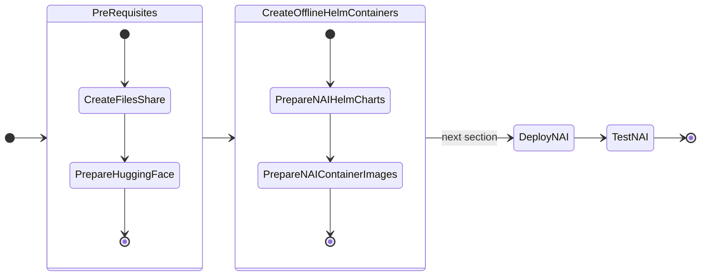
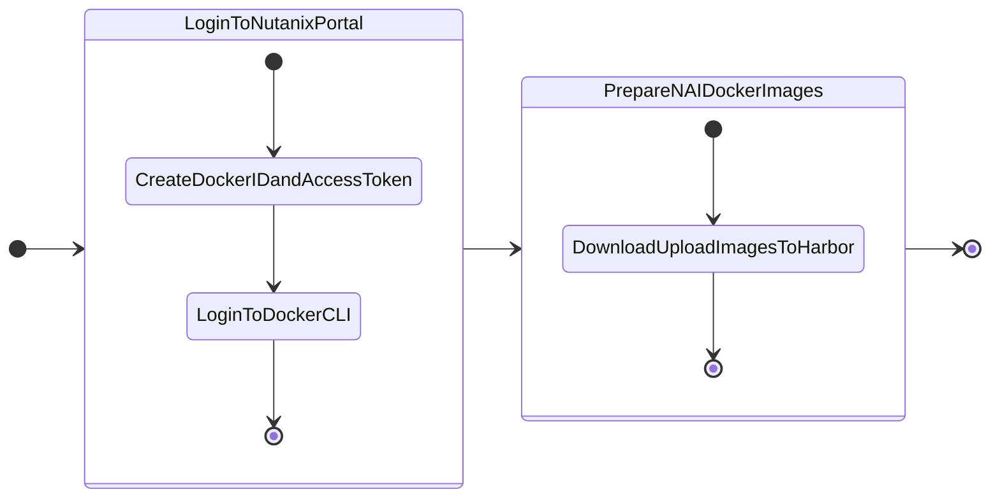

# Pre-requisites for Deploying NAI

In this part of the lab we will prepare pre-requisites for LLM application on GPU nodes.

The following is the flow of the applications lab:


```mermaid
stateDiagram-v2
    direction LR

    state PreRequisites {
        [*] --> CreateFilesShare  
        CreateFilesShare --> PrepareHuggingFace
        PrepareHuggingFace --> [*]
    }
    state CreateOfflineHelmContainers {
        [*] --> PrepareNAIHelmCharts
        PrepareNAIHelmCharts --> PrepareNAIContainerImages
        PrepareNAIContainerImages --> [*]
    }

    [*] --> PreRequisites
    PreRequisites --> CreateOfflineHelmContainers
    CreateOfflineHelmContainers --> DeployNAI : next section
    DeployNAI --> TestNAI
    TestNAI --> [*]
```

Prepare the following pre-requisites needed to deploy NAI on target kubernetes cluster.

## Create Nutanix Files Storage Class

We will create Nutanix Files storage class which will be used to create a pvc that will store the ``LLama-3-8B`` model files.

1. In **Prism Central**, choose **Files** from the menu
3. Choose the file server (e.g. labFS)
4. Click on **Shares & Exports**
5. Click on **+New Share or Export**
6. Fill the details of the Share
   
    - **Name** - model_share
    - **Description** - for NAI model store
    - **Share path** - leave blank
    - **Max Size** - 10 GiB (adjust to the model file size)
    - **Primary Protocol Access** - NFS

7. Click **Next** and make sure **Enable compression** in checked
8. Click **Next** 
9. In NFS Protocol Access, choose the following: 
   
    - **Authentication** - System
    - **Default Access (for all clients)** - Read-Write 
    - **Squash** - Root Squash

    !!! note
        Consider changing access options for Production environment
  
10. Click **Next**
11. Confirm the share details and click on **Create**

### Create the Files Storage Class

12. Run the following command to check K8S status of the ``nkpdev`` cluster
    
    ```bash
    kubectl get nodes
    ```

12. In VSC Explorer, click on **New File** :material-file-plus-outline: and create a config file with the following name:

    ```bash
    nai-nfs-storage.yaml
    ```

    Add the following content and replace the `nfsServerName` with the name of the Nutanix Files server name .


    

    === "Template YAML"

        ```yaml hl_lines="6 7"
        apiVersion: storage.k8s.io/v1
        kind: StorageClass
        metadata:
          name: nai-nfs-storage
        parameters:
          nfsPath: <nfs-path>
          nfsServer: <nfs-server>
          storageType: NutanixFiles
        provisioner: csi.nutanix.com
        reclaimPolicy: Delete
        volumeBindingMode: Immediate
        ```

    === "Sample YAML"

        ```yaml hl_lines="6 7"
        apiVersion: storage.k8s.io/v1
        kind: StorageClass
        metadata:
          name: nai-nfs-storage
        parameters:
          nfsPath: /model_share
          nfsServer: labFS.ntnxlab.local
          storageType: NutanixFiles
        provisioner: csi.nutanix.com
        reclaimPolicy: Delete
        volumeBindingMode: Immediate
        ```

13. Create the storage class

    ```bash
    kubectl apply -f nai-nfs-storage.yaml
    ```

14. Check storage classes in the cluster for the Nutanix Files storage class

    === "Command"

        ```bash
        kubectl get storageclass
        ```
  
    === "Command output"

        ```bash hl_lines="5"
        kubectl get storageclass

        NAME                       PROVISIONER                     RECLAIMPOLICY   VOLUMEBINDINGMODE      ALLOWVOLUMEEXPANSION   AGE
        dkp-object-store           kommander.ceph.rook.io/bucket   Delete          Immediate              false                  28h
        nai-nfs-storage            csi.nutanix.com                 Delete          Immediate              true                   24h
        nutanix-volume (default)   csi.nutanix.com                 Delete          WaitForFirstConsumer   false                  28h
        ```

## Request Access to Model on Hugging Face

Follow these steps to request access to the `meta-llama/Meta-Llama-3.1-8B-Instruct` model:

!!! info "LLM Recommendation"

    From testing ``google/gemma-2-2b-it`` model is quicker to download and obtain download rights, than ``meta-llama/Meta-Llama-3.1-8B-Instruct`` model.

    Feel free to use the [google/gemma-2-2b-it](https://hf.co/google/gemma-2-2b-it) model if necessary. The procedure to request access to the model is the same.


1. **Sign in to your Hugging Face account**:  

      - Visit [Hugging Face](https://huggingface.co) and log in to your account.

2. **Navigate to the model page**:  

      - Go to the [Meta-Llama-3.1-8B-Instruct model page](https://huggingface.co/meta-llama/Meta-Llama-3.1-8B-Instruct).

3. **Request access**:

      - On the model page, you will see a section or button labeled **Request Access** (this is usually near the top of the page or near the "Files and versions" section).
      - Click **Request Access**.

4. **Complete the form**:

      - You may be prompted to fill out a form or provide additional details about your intended use of the model.
      - Complete the required fields and submit the request.

5. **Wait for approval**:

      - After submitting your request, you will receive a notification or email once your access is granted.
      - This process can take some time depending on the approval workflow.

Once access is granted, there will be an email notification.

!!! note

    Email from Hugging Face can take a few minutes or hours before it arrives.

## Create a Hugging Face Token with Read Permissions

Follow these steps to create a Hugging Face token with read permissions:

1. **Sign in to your Hugging Face account**:  

    - Visit [Hugging Face](https://huggingface.co) and log in to your account.

2. **Access your account settings**:
    - Click on your profile picture in the top-right corner.
    - From the dropdown, select **Settings**.

3. **Navigate to the "Access Tokens" section**:

    - In the sidebar, click on **Access Tokens**.
    - You will see a page where you can create and manage tokens.

4. **Create a new token**:

    - Click the **New token** button.
    - Enter a name for your token (i.e., `read-only-token`).

5. **Set token permissions**:

    - Under the permissions dropdown, select **Read**. For Example:
        

6. **Create and copy the token**:

    - After selecting the permissions, click **Create**.
    - Your token will be generated and displayed only once, so make sure to copy it and store it securely.
  
Use this token for accessing Hugging Face resources with read-only permissions.

## Prepare Helm Charts

In this section we will prepare the helm charts necessary for NAI and pre-requisite applications install

 - NAI
 - Envoy Gateway
 - Kserve
 - OpenTelemetry Operator

The procedure will be done on the jumphost VM.

1. Login to [Nutanix Portal](https://portal.nutanix.com/page/downloads?product=nkp) using your credentials

2. Go to **Downloads** > **NAI Airgapped Bundle**

3. Copy the download link for NAI air-gap helm bundle
   
4. Open new `VSCode` window on your jumphost VM

5.  In `VSCode` Explorer pane, click on existing ``$HOME`` folder

6.  Click on **New Folder** :material-folder-plus-outline: name it: ``airgap-nai``

7.  On `VSCode` Explorer plane, click the ``$HOME/airgap-nai`` folder

8.  On `VSCode` menu, select ``Terminal`` > ``New Terminal``

9.  Browse to ``airgap-nai`` directory

    ```bash
    cd $HOME/airgap-nai
    ```

10. In ``VSC``, under the newly created ``airgap-nai`` folder, click on **New File** :material-file-plus-outline: and create file with the following name:
   
    ```bash
    .env
    ```

11. Add (append) the following environment variables and save it

    === ":octicons-file-code-16: Template ``$HOME/airgap-nai/.env``"

        ```bash
        export REGISTRY=harbor.10.x.x.134.nip.io
        export REGISTRY_USERNAME=admin
        export REGISTRY_CACERT=_path_to_ca_cert_of_registry  # (1)!
        ```

        1. File must contain CA server and Harbor server's public certificate in one file

    === ":octicons-file-code-16: Sample ``$HOME/airgap-nai/.env``"
        
        ```{ .bash .no-copy }
        export REGISTRY=harbor.10.x.x.134.nip.io
        export REGISTRY_USERNAME=admin
        export REGISTRY_PASSWORD=xxxxxxx
        export REGISTRY_CACERT=$HOME/harbor/certs/full_chain.pem  # (1)!
        ```

        2. File must contain CA server and Harbor server's public certificate in one file

12. Source the ``$HOME/airgap-nai/.env`` file to import environment variables
   
     ```bash
     source $HOME/airgap-nai/.env
     ```

13.  Download the NAI ``2.7.0`` helm chart bundle from Nutanix Portal
   
    === ":octicons-command-palette-16: Command"

        ```bash
        curl -o "nai-helm-charts-2.7.0.tar" "_paste_download_URL_here"
        ```
    
    === ":octicons-command-palette-16: Sample command"
    
        ```{ .text .no-copy }
        curl -o "nai-helm-charts-2.7.0.tar" "https://download.nutanix.com/downloads/nai/2.7.0/nai-helm-charts-2.7.0.tarr?Expires=xxxxx"
        ```

14. Extract the helm charts file
    
    === ":octicons-command-palette-16: Command"
    
        ```bash
        tar xvf nai-helm-charts-2.7.0.tar
        ```
    
    === ":octicons-command-palette-16: Command output"
    
        ```bash
        $ tar xvf nai-helm-charts-2.7.0.tar

        gateway-crds-helm-v1.7.0.tgz
        gateway-helm-v1.7.0.tgz
        kserve-crd-v0.15.0.tgz
        kserve-v0.15.0.tgz
        nai-core-2.7.0.tgz
        nai-operators-2.7.0.tgz
        opentelemetry-operator-0.102.0.tgz          
        ```
    
15. Login to Harbor registry on the command line (if not done so)
   
    === ":octicons-command-palette-16: Command"
    
        ```bash
        docker login harbor.10.x.x.134.nip.io \
        --username ${REGISTRY_USERNAME} \
        --password ${REGISTRY_PASSWORD}
        ```

    === ":octicons-command-palette-16: Command output"
    
        ```bash
        Login succeeded!
        ```

16. Create a project called ``nutanix`` in the Harbor registry using the following ``curl`` command or simply use the Harbor GUI
    
    === ":octicons-command-palette-16: Command"
    
        ```bash
        curl -X POST \
          -u "${REGISTRY_USERNAME}:${REGISTRY_PASSWORD}" \
          -H "Content-Type: application/json" \
          "https://${REGISTRY}" \
          -d '{
          "project_name": "nutanix",
          "metadata": {
              "public": "false"
          }
          }'
        ```
    
    === ":octicons-command-palette-16: Sample command"
    
        ```bash
        curl -X POST \
          -u "admin:_XXXXXXXXX" \
          -H "Content-Type: application/json" \
          "https://harbor.10.x.x.134.nip.io" \
          -d '{
          "project_name": "nutanix",
          "metadata": {
              "public": "false"
          }
          }'
        ```
     
17.  Upload the downloaded and prepared helm charts to Harbor
    
    === ":octicons-command-palette-16: Command"

        ```bash
        # Push charts
        for chart in $(ls *.tgz); do echo "Pushing: $chart";helm push $chart oci://$REGISTRY/nutanix;done
        ```

    === ":octicons-command-palette-16: Command output"

        ```{ .text, .no-copy}
        $ for chart in $(ls *.tgz); do echo "Pushing: $chart";helm push $chart oci://$REGISTRY/nutanix;done
        Pushing: gateway-crds-helm-v1.7.0.tgz
        Pushed: harbor.apj-cxrules.win/nutanix/gateway-crds-helm:v1.7.0
        Digest: sha256:625ee2409826d30e70ac26eb1a93e80650ba2c81464f65aaca6968cd33793b37
        Pushing: gateway-helm-v1.7.0.tgz
        Pushed: harbor.apj-cxrules.win/nutanix/gateway-helm:v1.7.0
        Digest: sha256:80ce6293c5a8658897971cd10adef51880a3ee6e5e1bbc92415b943cd4b94cb5
        Pushing: kserve-crd-v0.15.0.tgz
        Pushed: harbor.apj-cxrules.win/nutanix/kserve-crd:v0.15.0
        Digest: sha256:b673a75fdf45602ae58bb528e7b445e4530617b18f8eebb5d6337c16d4596951
        Pushing: kserve-v0.15.0.tgz
        Pushed: harbor.apj-cxrules.win/nutanix/kserve:v0.15.0
        Digest: sha256:e1bc365c75dd28f0c43581107b78614ffe21e6fbaf95a9351af440d3eec45130
        Pushing: nai-core-2.7.0.tgz
        Pushed: harbor.apj-cxrules.win/nutanix/nai-core:2.7.0
        Digest: sha256:2484532e59822e3c660aa4fa4a9152788d68bd51d1a47ea6e4b4884fa02bafe1
        Pushing: nai-operators-2.7.0.tgz
        Pushed: harbor.apj-cxrules.win/nutanix/nai-operators:2.7.0
        Digest: sha256:8a377a20f58f28500daab57730cf71bc4c7e2385615e061a9bd98e73ed47a978
        Pushing: opentelemetry-operator-0.102.0.tgz
        Pushed: harbor.apj-cxrules.win/nutanix/opentelemetry-operator:0.102.0
        Digest: sha256:bb3a48aeca0320a5c999b3849619e2d692eeec8ce59a6c43ca965c1fd1ffdb24
        ```

## Prepare Container Images

The Jumphost VM will be used as a medium to download the NAI container images and upload them to the internal Harbor container registry.


```mermaid
stateDiagram-v2
    direction LR

    state LoginToNutanixPortal {
        [*] --> CreateDockerIDandAccessToken
        CreateDockerIDandAccessToken --> LoginToDockerCLI
        LoginToDockerCLI --> [*]
    }

    state PrepareNAIDockerImages {
        [*] --> DownloadUploadImagesToHarbor
        DownloadUploadImagesToHarbor --> [*]
    }
    
    [*] --> LoginToNutanixPortal
    LoginToNutanixPortal --> PrepareNAIDockerImages
    PrepareNAIDockerImages --> [*]
```

### Upload NAI Docker Images to Harbor

!!! info
    
    The download and upload of the container images will be done in one ``docker push`` command which will use the internal/private Harbor container registry details.

    This will be a two-step process.

    1. Upload the container images from the downloaded ``nai-2.x.x.tar`` to the jumphost VM local docker images store
    2. Upload it to the internal Harbor container registry 

1.  Download the NAI air-gap bundles (NAI container images) from the **Nutanix Portal** > **Downloads** > **Nutanix Enterprise AI**
    
    === ":octicons-command-palette-16: Command"

        ```text title="Paste the download URL within double quotes"
        curl -o nai-2.7.0.tar "_paste_download_URL_here"
        ```

    === ":octicons-command-palette-16: Sample command"
        
        ```bash title="This download is about 63 GBs"
        curl -o nai-2.7.0-1.tar "https://download.nutanix.com/downloads/nai/2.7.0/nai-2.7.0.tar?..."
        ```

2. Since we will be using the same internal Harbor container registry to upload container images, make sure the following environment variables are set (these were already set during air-gap NKP preparation). Append (add) the following to your ``$HOME/airgap-nai/.env`` file
   
    
    === ":octicons-file-code-16: Template ``$HOME/airgap-nai/.env``"
    
        ```bash
        export REGISTRY=harbor.10.x.x.134.nip.io
        export REGISTRY_USERNAME=admin
        export REGISTRY_PASSWORD=xxxxxxx
        export REGISTRY_CACERT=$HOME/harbor/certs/ca.crt
        export PROJECT=nutanix
        ```

3. Download this script (provided by Nutanix) from this location
    
    ??? tip "Usage of image upload script provided by Nutanix"

        Use the upload script provided by Nutanix. Original location is on the [portal](https://portal.nutanix.com/page/documents/details?targetId=Nutanix-Enterprise-AI-v2_7:top-push-image-registry-airgap-t.html).

        You can also download a copy of the script using the commands below.
   
    === ":octicons-command-palette-16: Command"
    
        ```bash
        curl -OL https://raw.github..
        ```

4. Change permission to execute on the script
   
    === ":octicons-command-palette-16: Command"
    
        ```bash
        chmod u+x push-images-to-registry.sh
        ```
        
5. Push the images to the jumphost VM local docker images store
   
    === ":octicons-command-palette-16: Command"

         ```bash
         ./push-images-to-registry.sh ${REGISTRY} ${PROJECT} nai-v2.7.0.tar
         ```
    
    === ":octicons-command-palette-16: Sample command"

         ```bash
         ./push-images-to-registry.sh harbor.10.x.x.134.nip.io nutanix nai-v2.7.0.tar
         ```

    === ":octicons-command-palette-16: Command output"
    
        ```{ .text .no-copy }

        < Snipped output >

        → [40/40] Processing: nutanix/nai-go-processor:v2.7.0
        → Tagging as: harbor.apj-cxrules.win/nutanix/nai-go-processor:v2.7.0
        → Pushing to registry...
        The push refers to repository [harbor.apj-cxrules.win/nutanix/nai-go-processor]
        68c62dd01600: Layer already exists 
        9f1399477dbf: Layer already exists 
        6fd88674c4ba: Layer already exists 
        14087c42d4b4: Layer already exists 
        2cb1f8643318: Layer already exists 
        ffcaa2070b2e: Layer already exists 
        a9f9b89dc1f2: Layer already exists 
        29df493baa13: Layer already exists 
        v2.7.0: digest: sha256:22d4558b118f0f5afb0d572e080f44dd6518d5365783222de21a721fa947b9ee size: 1993
        ✓ Pushed successfully
        
        ========================================
        Summary
        ========================================
        Total images loaded:    40
        Successfully pushed:    40
        Failed:                 0
        
        ✓ All images successfully pushed to harbor.apj-cxrules.win/nutanix
        ```

Now we are ready to deploy our NAI workloads.