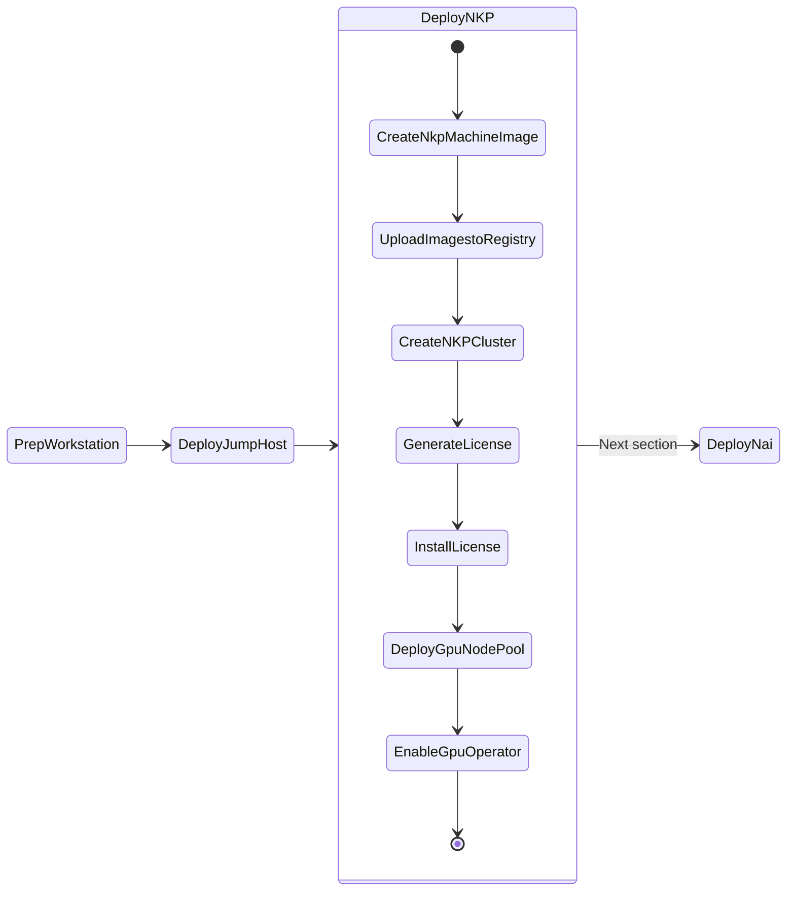
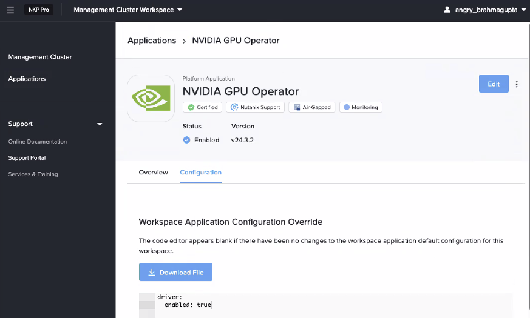

# Deploy NKP Clusters

This lab will take you through install Air-gapped NKP(Kubernetes) on Nutanix cluster as we will be deploying AI applications on these kubernetes clusters. 

!!! warning "Airgapped NKP Cluster"

    This lab assumes the following:

     - The subnet (VPC or otherwise) is air-gapped and there is no internet connectivity.
     - The jumphost VM has connectivity to download the NKP air-gapped bundle
     - The jumphost is in the same subnet as the Kubernetes cluster
     - The jumphost VM is hosting Harbor container registry



!!! warning "Deploying NKP Cluster"

    This lab will focus on deploying NKP to host NAI workloads. However, the steps can also be used deploy a custom NKP deployment if that's the aim.

    Consider using [NKP The Hard Way](../appendix/infra_nkp_hard_way.md) section to create a customized version of your NKP cluster.

    Once you have determined the resource requirements for a custom NKP deployment, modify the environment variables and values in the ``.env`` file to suit your resource needs for your NKP cluster.

## NKP High Level Cluster Design

The ``nkpdarksite`` cluster will be hosting the LLM model serving endpoints and AI application stack. This cluster and will require a dedicated GPU node pool.

### Sizing Requirements

Below are the sizing requirements needed to successfully deploy NAI on a NKP Cluster (labeled as ``nkpdarksite``) and subsequently deploying single LLM inferencing endpoint on NAI using the `meta-llama/Meta-Llama-3-8B-Instruct` LLM model.

??? Tip "Calculating GPU Resources Tips"

    The calculations below assume that you're already aware of how much memory is required to load target LLM model.

    For a general example:

    - To host a 8b(illion) parameter model, multiply the parameter number by 2 to get minimum GPU memory requirments. 
      e.g. 16GB of GPU memory is required for 8b parameter model.
  
    > So in the case of the `meta-llama/Meta-Llama-3-8B-Instruct` model, you'll need a min. 16 GiB GPU vRAM available

    Below are additional sizing consideration "Rule of Thumb" for further calculating min. GPU node resources:

    - For each GPU node will have 8 CPU cores, 24 GB of memory, and 300 GB of disk space.
    - For each GPU attached to the node, add 16 GiB of memory.
    - For each endpoint attached to the node, add 8 CPU cores.
    - If a model needs multiple GPUs, ensure all GPUs are attached to the same worker node
    - For resiliency, while running multiple instances of the same endpoint, ensure that the GPUs are on different worker nodes.

Since we will be testing with the ``meta-llama/Meta-Llama-3-8B-Instruct`` HuggingFace model, we will require a GPU with a min. of 24 GiB GPU vRAM available to support this demo.

!!! note
    GPU min. vRAM should be 24 GB, such as NVIDIA L4 Model.

Below are minimum requirements for deploying NAI on the NKP Demo Cluster.

| Role          | No. of Nodes (VM) | vCPU per Node | Memory per Node | Storage per Node | Total vCPU | Total Memory |
|---------------|-------------------|---------------|-----------------|------------------|------------|--------------|
| Control plane | 3                 | 4             | 16 GB           | 150 GB           | 12         | 48 GB        |
| Worker        | 4                 | 8             | 32 GB           | 150 GB           | 32         | 128 GB       |
| GPU           | 1                 | 16            | 40 GB           | 300 GB           | 16         | 40 GB        |
| **Totals**    |                   |               |                 |                  | **60**     | **216 GB**   |


## Pre-requisites for NKP Deployment


1. Nutanix PC is at least ``2024.3``
2. Nutanix AOS is at least ``6.8+``, ``6.10``
3. Existing Ubuntu Linux jumphost VM. See here for jumphost installation [steps](../infra/infra_jumphost_tofu.md).

    !!! warning "Before you proceed!"

        Make sure the Jumphost VM has enough resources to host the following:

        - Harbor container registry
        - Bootstrap ``kind`` cluster
        
        with at least the following resources:

        | #    | CPU | Memory | Disk |
        |-----| --- | ------ | ---- |
        |Jumphost VM |   8   | 16 GB   | 80 GB |

4. [Docker](#setup-docker-on-jumphost) or Podman installed on the jumphost VM
5. Existing **Harbor** container registry on the jumphost VM. See here for installation [steps](../infra/harbor.md).
6. Download and install ``nkp`` binary from Nutanix Portal
7.  Find and reserve 3 IPs for control plane and MetalLB access from AHV network
8.  Find GPU details from Nutanix cluster
9.  Create a base image to use with NKP nodes using ``nkp`` command

### Download Offline NKP Air-gapped Bundle

1. Login to [Nutanix Portal](https://portal.nutanix.com/page/downloads?product=nkp) using your credentials
2. Go to **Downloads** > **NKP Airgapped Bundle**
3. Select NKP for Linux and copy the download link to the ``.tar.gz`` file
4. If you haven't already done so, Open new `VSCode` window on your jumphost VM

5. In `VSCode` Explorer pane, click on existing ``$HOME`` folder

6. Click on **New Folder** :material-folder-plus-outline: name it: ``airgap-nkp``

7. On `VSCode` Explorer plane, click the ``$HOME/airgap-nkp`` folder

8. On `VSCode` menu, select ``Terminal`` > ``New Terminal``

9. Browse to ``airgap-nkp`` directory

    ```bash
    cd $HOME/airgap-nkp
    ```

10. Download and extract the NKP air-gap bundle from the link you copied earlier
    
    === "Command"

        ```text title="Paste the download URL within double quotes"
        curl -o nkp-air-gapped-bundle_v2.16.0_linux_amd64.tar.gz "_paste_download_URL_here"
        ```

    === "Sample command"
        
        ```bash
        curl -o nkp-air-gapped-bundle_v2.16.0_linux_amd64.tar.gz "https://download.nutanix.com/downloads/nkp/v2.16.0/nkp-air-gapped-bundle_v2.16.0_linux_amd64.tar.gz?........"
        ```
        
    ```bash
    tar xvfz nkp-air-gapped-bundle_v2.16.0_linux_amd64.tar.gz
    ```

11. Move the ``nkp`` binary to a directory that is included in your ``PATH`` environment variable

    ```bash
    sudo cp nkp-v2.16.0/cli/nkp /usr/local/bin/
    ```


12. Verify the ``nkp`` binary is installed correctly. Ensure the version is latest
    
    !!! note

        At the time of writing this lab nkp version is ``v2.16.0``

    === "Command"

        ```bash
        nkp version
        ```

    === "Command Output"

        ```{ .bash .no-copy }
        $ nkp version
        catalog: v0.7.0
        diagnose: v0.12.0
        imagebuilder: v2.16.0
        kommander: v2.16.0
        konvoy: v2.16.0
        mindthegap: v1.22.1
        nkp: v2.16.0
        ```

### Setup Docker on Jumphost

If not already done, follow the steps in [Setup Docker on Jumphost](../infra/infra_jumphost_tofu.md#setup-docker-on-jumphost) section. 

### Load Docker with NKP Images

1. From VSC, open Terminal and run the following command to load the ``nkp`` images
    
    === "Command"
    
        ```bash
        cd $HOME/airgap-nkp/nkp-v2.16.0/
        docker load -i nkp-image-builder-image-v2.16.0.tar
        docker load -i konvoy-bootstrap-image-v2.16.0.tar
        ```
    
    === "Command output"

        ```bash
        $ docker load -i nkp-image-builder-image-v2.16.0.tar 
        9fe9a137fd00: Loading layer [==================================================>]   7.63MB/7.63MB
        76fcadd9b36b: Loading layer [==================================================>]  33.57MB/33.57MB
        9a230b56c773: Loading layer [==================================================>]  85.18MB/85.18MB
        64339032f692: Loading layer [==================================================>]  76.31MB/76.31MB
        28d0bd0e7b64: Loading layer [==================================================>]  33.71MB/33.71MB
        a3c8281963fd: Loading layer [==================================================>]  23.93MB/23.93MB
        ae15986b43a6: Loading layer [==================================================>]  335.5MB/335.5MB
        483d6ecaa75d: Loading layer [==================================================>]  173.2MB/173.2MB
        5210ca26c0aa: Loading layer [==================================================>]  528.4MB/528.4MB
        2ffff926e4e0: Loading layer [==================================================>]  12.69MB/12.69MB
        ea1091ae88c8: Loading layer [==================================================>]  5.632kB/5.632kB
        Loaded image: mesosphere/nkp-image-builder:v2.16.0
        ```
        ```bash
        $ docker load -i konvoy-bootstrap-image-v2.16.0.tar 
        Loaded image: mesosphere/konvoy-bootstrap:v2.16.0
        ```
`

2. Confirm presence of container images on jumhost VM
   
    === "Command"
    
        ```bash
        docker image ls
        ```
    
    === "Command output"
    
        ```text hl_lines="4 5"
        $ docker image ls

        REPOSITORY                                            TAG          IMAGE ID       CREATED        SIZE
        mesosphere/nkp-image-builder                          v2.16.0      4bae9be67aa2   45 years ago   1.3GB
        mesosphere/konvoy-bootstrap                           v2.16.0      a2aa0268435b   2 weeks ago    2.64GB
        ```

## Reserve Control Plane and MetalLB IP

Nutanix AHV IPAM network allows you to black list IPs that needs to be reserved for specific application endpoints. We will use this feature to find and reserve three IPs. 

We will reserve a total of three IPs for the following:

| Cluster Role | Cluster Name |       NKP        | NAI |
|--------------|--------------|------------------|-----|
| Dev          | `nkpdarksite`     |       2          | 1   |

1. Get the CIDR range for the AHV network(subnet) where the application will be deployed

    ```buttonless title="CIDR example for your Nutanix cluster"
    10.x.x.0/24
    ```

2. From VSC, logon to your jumpbox VM and open Terminal

3. Install ``nmap`` tool (if not already done)

    ```bash
    cd $HOME/sol-cnai-infra
    devbox add nmap
    ```

4. Find three unused static IP addresses in the subnet

    === "Command"

        ```bash
        nmap -v -sn  <your CIDR>
        ```

    === "Sample command"

        ```bash 
        nmap -v -sn 10.x.x.0/24
        ```

    ```text title="Sample output - choose the first three consecutive IPs"
    Nmap scan report for 10.x.x.214 [host down]
    Nmap scan report for 10.x.x.215 [host down]
    Nmap scan report for 10.x.x.216 [host down]
    Nmap scan report for 10.x.x.217
    Host is up (-0.098s latency).
    ```

5. Logon to any CVM in your Nutanix cluster and execute the following to add chosen static IPs to the AHV IPAM network

    - **Username:** nutanix
    - **Password:** your Prism Element password 

    === "Command"

        ```text
        acli net.add_to_ip_blacklist <your-ipam-ahv-network> \
        ip_list=10.x.x.214,10.x.x.215,10.x.x.216
        ```

    === "Sample command"

         ```text
         acli net.add_to_ip_blacklist User1 \
         ip_list=10.x.x.214,10.x.x.215,10.x.x.216
         ```

### Reservation of IPs

Reserve the firs IPs for NKP control plane 
Reserve the second two IPs for MetalLB distributed load balancer
- We will use one of these IP for NAI

Reserve the third IP for NAI. We will use the NAI IP in the next [NAI](../iep/iep_deploy.md#install-ssl-certificate) section to assign the FDQN and install SSL certificate.

|   Component            |  IP                          | FQDN |
|  ------------          | --------                     |------|
| NKP Control Plane VIP  |  ``10.x.x.214``              | -    |
| NKP MetalLB IP Range   |  ``10.x.x.215-10.x.x.216``   | -    |
| NAI                    |  ``10.x.x.216``              | ``nai.10.x.x.216.nip.io``|

## Create Base Image for NKP

In this section we will go through creating a base image for all the control plane and worker node VMs on Nutanix.

1. In VSC Explorer pane, Click on **New Folder** :material-folder-plus-outline:

2. Call the folder ``airgap-nkp`` under ``$HOME`` directory

3. In the ``airgap-nkp`` folder, click on **New File** :material-file-plus-outline: and create new file with the following name:
  
    ```bash
    .env
    ```

4. Run the following command to generate an new RSA key pair on the jumphost VM. This SSH key pair will be used for authentication between the jumphost and NKP K8S cluster nodes.
   
    ??? tip "Do you have existing SSH key pair?"

        Copy the key pair from your workstation (PC/Mac) to `~/.ssh/` directory on your Jumphost VM.
        
        ``` { .bash .no-copy }
        mac/pc $ scp ~/.ssh/id_rsa.pub ubuntu@10.x.x.171:~/.ssh/id_rsa.pub
        mac/pc $ scp ~/.ssh/id_rsa ubuntu@10.x.x.171:~/.ssh/id_rsa
        ```

    ```bash
    ssh-keygen -t rsa
    ```
    
    Accept the default file location as ``~/.ssh/id_rsa``
    
    SSH key pair will stored in the following location:
        
    ``` { .bash .no-copy }
    ~/.ssh/id_rsa.pub 
    ~/.ssh/id_rsa
    ```

    
5. Fill the following values inside the ``.env`` file
   
    === "Template .env"

        ```text
        export NUTANIX_USER=_your_nutanix_username
        export NUTANIX_PASSWORD=_your_nutanix_password
        export NUTANIX_ENDPOINT=_your_prism_central_fqdn
        export NUTANIX_CLUSTER=_your_prism_element_cluster_name
        export NUTANIX_SUBNET_NAME=_your_ahv_ipam_network_name
        export STORAGE_CONTAINER=_your_storage_container_nmae
        export SSH_PUBLIC_KEY=_path_to_ssh_pub_key_on_jumphost_vm
        export NKP_CLUSTER_NAME=_your_nkp_cluster_name
        export CONTROLPLANE_VIP=_your_nkp_cluster_controlplane_ip
        export LB_IP_RANGE=_your_range_of_two_ips
        export OS_BUNDLE_DIR=_your_artifacts_directory
        export OS=_your_preferred_os
        export BASE_IMAGE=_your_baseimage_name
        ```

    === "Sample .env"

        ```text
        export NUTANIX_USER=admin
        export NUTANIX_PASSWORD=xxxxxxxx
        export NUTANIX_ENDPOINT=pc.example.com
        export NUTANIX_CLUSTER=pe
        export NUTANIX_SUBNET_NAME=User1
        export STORAGE_CONTAINER=default
        export SSH_PUBLIC_KEY=$HOME/.ssh/id_rsa.pub
        export NKP_CLUSTER_NAME=nkpdarksite
        export CONTROLPLANE_VIP=10.x.x.214
        export LB_IP_RANGE=10.x.x.215-10.x.x.216
        export OS_BUNDLE_DIR=kib/artifacts
        export OS=ubuntu-22.04
        export BASE_IMAGE=ubuntu-22.04-server-cloudimg-amd64.img
        ```

6. Using VSC Terminal, load the environment variables and its values

    ```bash
    cd $HOME/airgap-nkp
    source .env
    cd nkp-v2.16.0/
    ```

7. Create the base image
   
    === "Command"

        ```bash
        nkp create package-bundle --artifacts-directory ${OS_BUNDLE_DIR} ${OS}
        ```

    === "Command output"

        ```{ .text .no-copy }
        $ nkp create package-bundle --artifacts-directory ${OS_BUNDLE_DIR} ${OS}

        OS bundle configuration files extracted to /home/ubuntu/airgap-nkp/nkp-v2.16.0/kib/artifacts/.dkp-image-builder-2593079857
        Get:1 http://archive.ubuntu.com/ubuntu jammy InRelease [270 kB]
        Get:2 http://security.ubuntu.com/ubuntu jammy-security InRelease [129 kB]

        <snip>

        Get:241 http://archive.ubuntu.com/ubuntu jammy-updates/universe amd64 gpgv2 all 2.2.27-3ubuntu2.1 [4392 B]                              
        Get:242 http://archive.ubuntu.com/ubuntu jammy-updates/universe amd64 python3-pip all 22.0.2+dfsg-1ubuntu0.5 [1306 kB]                  
        Get:243 http://archive.ubuntu.com/ubuntu jammy-updates/universe amd64 python3-wheel all 0.37.1-2ubuntu0.22.04.1 [32.0 kB]               
        Fetched 176 MB in 9s (19.9 MB/s) 
        dpkg-scanpackages: info: Wrote 243 entries to output Packages file.
        /home/ubuntu/airgap-nkp/nkp-v2.16.0/kib/artifacts/.dkp-image-builder-2593079857/ubuntu-22.04/Packages       
        ```


8. Create the os image and upload to Prism Central using the following command. 
   
    !!!note 
           Image creation will take up to 5 minutes.

    === "Command"

        ```bash
        nkp create image nutanix ${OS} --endpoint ${NUTANIX_ENDPOINT} --cluster ${NUTANIX_CLUSTER} --subnet ${NUTANIX_SUBNET_NAME} --source-image ${BASE_IMAGE} --artifacts-directory ${OS_BUNDLE_DIR}
        ```

    === "Command output"

        ```{ .text .no-copy }
        nkp create image nutanix ${OS} --endpoint ${NUTANIX_ENDPOINT} --cluster ${NUTANIX_CLUSTER} --subnet ${NUTANIX_SUBNET_NAME} --source-image ${BASE_IMAGE} --artifacts-directory ${OS_BUNDLE_DIR}
        
        > Provisioning and configuring image
        Manifest files extracted to $HOME/nkp/.nkp-image-builder-3243021807
        nutanix.kib_image: output will be in this color.

        ==> nutanix.kib_image: Creating Packer Builder virtual machine...
            nutanix.kib_image: Virtual machine nkp-ubuntu-22.04-1.33.2-20250925013631 created
            nutanix.kib_image: Found IP for virtual machine: 10.x.x.234
        ==> nutanix.kib_image: Running post-processor: packer-manifest (type manifest)
        
        ---> 100%
        Build 'nutanix.kib_image' finished after 4 minutes 55 seconds.
        ==> Wait completed after 4 minutes 55 seconds

        ==> Builds finished. The artifacts of successful builds are:
        --> nutanix.kib_image: nkp-ubuntu-22.04-1.33.2-20250925013631
        --> nutanix.kib_image: nkp-ubuntu-22.04-1.33.2-20250925013631
        ```

    !!! info "Image name - This will be different in your environment"
        
        Note image name from the previous ``nkp`` create image command output

        ```text hl_lines="2"
        ==> Builds finished. The artifacts of successful builds are:
        --> nutanix.kib_image: nkp-ubuntu-22.04-1.33.2-20250925013631
        ```

    !!! warning

        Make sure to use image name that is generated in your environment for the next steps.

9.  Populate the ``.env`` file with the NKP image name by adding (appending) the following environment variables and save it

    === "Template .env"

        ```text
        export NKP_IMAGE=nkp-image-name
        ```

    === "Sample .env"

        ```text
        export NKP_IMAGE=nkp-ubuntu-22.04-1.33.2-20250925013631
        ```

## Push Container Images to Local/Private Registry to be used by NKP

In this section we will use internal Harbor container registry to upload NKP container images for deployment. 

!!! warning
    
    This section requires a air-gapped container registry to be functional.

    If you haven't already deployed the air gapped container registry, please follow the steps in [Harbor Container Registry](../infra/harbor.md) section to deploy a Harbor container registry on the jumphost VM.

!!! tip "NKP v2.16 has optional inbuilt CNCF OCI registry for deployment ease"

     
    NKP ``v2.16`` has an optional inbuilt CNCF OCI Registry for deployment ease.

    While deploying NKP use the following switch to specify where the container image bundles are. 

    ```bash
    nkp create cluster nutanix -c ${NKP_CLUSTER_NAME} \
    --bundle=/path_to_extracted_airgap_bundle/nkp-v2.16.0/container-images/*.tar \ # Specify path
    # other options
    ```
    
    Note that the registry deployment will take ``30 minutes``, with the cluster deployed in about ``60 minutes``. This registry is only to be used for NKP cluster deployment. Any on-going use of registry should be considered only after assesing requirements, design and scalability. 
    

1. Open ``$HOME/airgap-nkp/.env`` file in VSC and add (append) the following environment variables to your ``.env`` file and save it
   
    === "Template .env"

        ```bash
        export REGISTRY_URL=_your_registry_url
        export REGISTRY_USERNAME=_your_registry_username
        export REGISTRY_PASSWORD=_your_registry_password
        export REGISTRY_CACERT=_path_to_ca_cert_of_registry  # (1)!
        ```

        1. File must contain CA server and Harbor server's public certificate in one file

    === "Sample .env"

        ```bash
        export REGISTRY_URL=https://harbor.10.x.x.111.nip.io/nkp
        export REGISTRY_USERNAME=admin
        export REGISTRY_PASSWORD=xxxxxxxx
        export REGISTRY_CACERT=$HOME/harbor/certs/full_chain.pem  # (1)!
        ```

        2. File must contain CA server and Harbor server's public certificate in one file

2. Source the new variables and values to the environment
   
     ```bash
     cd $HOME/airgap-nkp/
     source .env
     ```

3. Push the images to air-gapped registry
   
    ```bash
    cd nkp-v2.16.0/
    ```
   
    === "Command"

        ```bash
        nkp push bundle --bundle ./container-images/konvoy-image-bundle-v2.16.0.tar \
        --to-registry=${REGISTRY_URL} --to-registry-username=${REGISTRY_USERNAME} \
        --to-registry-password=${REGISTRY_PASSWORD} \
        --to-registry-ca-cert-file=${REGISTRY_CACERT}
        ```
        ```bash
        nkp push bundle --bundle ./container-images/kommander-image-bundle-v2.16.0.tar \
        --to-registry=${REGISTRY_URL} --to-registry-username=${REGISTRY_USERNAME} \
        --to-registry-password=${REGISTRY_PASSWORD} \
        --to-registry-ca-cert-file=${REGISTRY_CACERT}
        ```
        ```bash
        nkp push bundle --bundle ./application-repositories/kommander-applications-v2.16.0.tar.gz \
        --to-registry=${REGISTRY_URL} --to-registry-username=${REGISTRY_USERNAME} \
        --to-registry-password=${REGISTRY_PASSWORD} \
        --to-registry-ca-cert-file=${REGISTRY_CACERT}
        ```

    === "Command output"

        ```{ .text .no-copy }
        $ nkp push bundle --bundle ./container-images/konvoy-image-bundle-v2.16.0.tar \
        --to-registry=${REGISTRY_URL} --to-registry-username=${REGISTRY_USERNAME} \
        --to-registry-password=${REGISTRY_PASSWORD} \
        --to-registry-ca-cert-file=${REGISTRY_CACERT}
        ✓ Creating temporary directory
        ✓ Unarchiving image bundle "./container-images/konvoy-image-bundle-v2.16.0.tar" 
        ✓ Parsing image bundle config
        ✓ Starting temporary Docker registry
        ✓ Pushing bundled images [================================>129/129] (time elapsed 153s) 
        ```
        ```{ .text .no-copy }
        $ nkp push bundle --bundle ./container-images/kommander-image-bundle-v2.16.0.tar \
        --to-registry=${REGISTRY_URL} --to-registry-username=${REGISTRY_USERNAME} \
        --to-registry-password=${REGISTRY_PASSWORD} \
        --to-registry-ca-cert-file=${REGISTRY_CACERT}
        ✓ Creating temporary directory
        ✓ Unarchiving image bundle "./container-images/kommander-image-bundle-v2.16.0.tar" 
        ✓ Parsing image bundle config
        ✓ Starting temporary Docker registry
        ✓ Pushing bundled images [================================>131/131] (time elapsed 183s) 
        (devbox) 
        ```
        ```{ .text .no-copy }
        nkp push bundle --bundle ../application-repositories/kommander-applications-v2.16.0.tar.gz \
        --to-registry=${REGISTRY_URL} --to-registry-username=${REGISTRY_USERNAME} \
        --to-registry-password=${REGISTRY_PASSWORD} \
        --to-registry-ca-cert-file=${REGISTRY_CACERT}
         ✓ Creating temporary directory
         ✓ Unarchiving image bundle "./application-repositories/kommander-applications-v2.16.0.tar.gz"
         ✓ Starting temporary Docker registry
        ```

We are now ready to install the workload ``nkpdarksite`` cluster

## Create Air-gapped NKP Workload Cluster

!!!warning

    Do not use hyphens ``-`` in the nkp cluster name. 
 
    ```text title="Clustername Validation Rules"
    a lowercase RFC 1123 subdomain must consist of lower case alphanumeric       │
    │characters, '-' or '.', and must start and end with an alphanumeric character (e.g. 'example.com',  │
    │regex used for validation is '[a-z0-9]([-a-z0-9]*[a-z0-9])?(\.[a-z0-9]([-a-z0-9]*[a-z0-9])?)*')
    ```

!!!note
   
    In this lab the workload cluster will have the Management cluster role as well to reduce resource consumption in a lab environment. 

    However, for production environments, the ideal design is to have a separate management and workload clusters. 

1. Open .env file in VSC and add (append) the following environment variables to your ``.env`` file and save it

    === "Template .env"

        ```text
        export CONTROL_PLANE_REPLICAS=_no_of_control_plane_replicas
        export CONTROL_PLANE_VCPUS=_no_of_control_plane_vcpus
        export CONTROL_PLANE_CORES_PER_VCPU=_no_of_control_plane_cores_per_vcpu
        export CONTROL_PLANE_MEMORY_GIB=_no_of_control_plane_memory_gib
        export WORKER_REPLICAS=_no_of_worker_replicas
        export WORKER_VCPUS=_no_of_worker_vcpus
        export WORKER_CORES_PER_VCPU=_no_of_worker_cores_per_vcpu
        export WORKER_MEMORY_GIB=_no_of_worker_memory_gib
        export CSI_FILESYSTEM=_preferred_filesystem_ext4/xfs
        export CSI_HYPERVISOR_ATTACHED=_true/false
        export NUTANIX_PROJECT_NAME=_your_pc_project_name
        ```

    === "Sample .env"

        ```text
        export CONTROL_PLANE_REPLICAS=3
        export CONTROL_PLANE_VCPUS=4
        export CONTROL_PLANE_CORES_PER_VCPU=1
        export CONTROL_PLANE_MEMORY_GIB=16
        export WORKER_REPLICAS=4
        export WORKER_VCPUS=8 
        export WORKER_CORES_PER_VCPU=1
        export WORKER_MEMORY_GIB=32
        export CSI_FILESYSTEM=ext4
        export CSI_HYPERVISOR_ATTACHED=true
        export NUTANIX_PROJECT_NAME=dev-lab
        ```

2. Source the new variables and values to the environment

     ```bash
     source .env
     ```

3. In VSC, open Terminal, enter the following command to create the workload cluster

    ??? tip "Check your command for correct argument values"

        Run the following command to verify your ``nkp`` command and associated environment variables and values.

        ```bash
        echo "nkp create cluster nutanix -c ${NKP_CLUSTER_NAME} \
                --control-plane-endpoint-ip ${CONTROLPLANE_VIP} \
                --control-plane-prism-element-cluster ${NUTANIX_CLUSTER} \
                --control-plane-subnets ${NUTANIX_SUBNET_NAME} \
                --control-plane-vm-image ${NKP_IMAGE} \
                --csi-storage-container ${STORAGE_CONTAINER} \
                --endpoint https://${NUTANIX_ENDPOINT}:9440 \
                --worker-prism-element-cluster ${NUTANIX_CLUSTER} \
                --worker-subnets ${NUTANIX_SUBNET_NAME} \
                --worker-vm-image ${NKP_IMAGE} \
                --ssh-public-key-file ${SSH_PUBLIC_KEY} \
                --kubernetes-service-load-balancer-ip-range ${LB_IP_RANGE} \
                --control-plane-disk-size 150 \
                --control-plane-memory ${CONTROL_PLANE_MEMORY_GIB} \
                --control-plane-vcpus ${CONTROL_PLANE_VCPUS} \
                --control-plane-cores-per-vcpu ${CONTROL_PLANE_CORES_PER_VCPU} \
                --worker-disk-size 150 \
                --worker-memory ${WORKER_MEMORY_GIB} \
                --worker-vcpus ${WORKER_VCPUS} \
                --worker-cores-per-vcpu ${WORKER_CORES_PER_VCPU} \
                --csi-file-system ${CSI_FILESYSTEM} \
                --csi-hypervisor-attached-volumes=${CSI_HYPERVISOR_ATTACHED} \
                --registry-mirror-url=${REGISTRY_URL} \
                --registry-mirror-username=${REGISTRY_USERNAME} \
                --registry-mirror-password=${REGISTRY_PASSWORD} \
                --registry-mirror-cacert=${REGISTRY_CACERT} \
                --control-plane-pc-project ${NUTANIX_PROJECT_NAME} \
                --worker-pc-project ${NUTANIX_PROJECT_NAME} \
                --self-managed \
                --airgapped"
        ```

        If the values are incorrect, add the correct values to ``.env`` and source the  again by running the following command

        ```bash
        source .env
        ```

        Then rerun the ``echo nkp`` command to verify the values again before running the ``nkp create cluster nutanix`` command.

    === "Command"

        ```bash 
        nkp create cluster nutanix -c ${NKP_CLUSTER_NAME} \
            --control-plane-endpoint-ip ${CONTROLPLANE_VIP} \
            --control-plane-prism-element-cluster ${NUTANIX_CLUSTER} \
            --control-plane-subnets ${NUTANIX_SUBNET_NAME} \
            --control-plane-vm-image ${NKP_IMAGE} \
            --csi-storage-container ${STORAGE_CONTAINER} \
            --endpoint https://${NUTANIX_ENDPOINT}:9440 \
            --worker-prism-element-cluster ${NUTANIX_CLUSTER} \
            --worker-subnets ${NUTANIX_SUBNET_NAME} \
            --worker-vm-image ${NKP_IMAGE} \
            --ssh-public-key-file ${SSH_PUBLIC_KEY} \
            --kubernetes-service-load-balancer-ip-range ${LB_IP_RANGE} \
            --control-plane-disk-size 150 \
            --control-plane-memory ${CONTROL_PLANE_MEMORY_GIB} \
            --control-plane-vcpus ${CONTROL_PLANE_VCPUS} \
            --control-plane-cores-per-vcpu ${CONTROL_PLANE_CORES_PER_VCPU} \
            --worker-disk-size 150 \
            --worker-memory ${WORKER_MEMORY_GIB} \
            --worker-vcpus ${WORKER_VCPUS} \
            --worker-cores-per-vcpu ${WORKER_CORES_PER_VCPU} \
            --csi-file-system ${CSI_FILESYSTEM} \
            --csi-hypervisor-attached-volumes=${CSI_HYPERVISOR_ATTACHED} \
            --registry-mirror-url=${REGISTRY_URL} \
            --registry-mirror-username=${REGISTRY_USERNAME} \
            --registry-mirror-password=${REGISTRY_PASSWORD} \
            --registry-mirror-cacert=${REGISTRY_CACERT} \
            --control-plane-pc-project ${NUTANIX_PROJECT_NAME} \
            --worker-pc-project ${NUTANIX_PROJECT_NAME} \
            --self-managed \
            --airgapped
        ```

    === "Command output"

        ```{ .text .no-copy }
        > ✓ Creating a bootstrap cluster 
        ✓ Upgrading CAPI components 
        ✓ Waiting for CAPI components to be upgraded 
        ✓ Initializing new CAPI components 
        ✓ Creating ClusterClass resources 
        ✓ Creating ClusterClass resources
        > Generating cluster resources
        cluster.cluster.x-k8s.io/nkpdarksite created
        secret/nkpdarksite-pc-credentials created
        secret/nkpdarksite-pc-credentials-for-csi created
        secret/nkpdarksite-image-registry-credentials created
        ✓ Waiting for cluster infrastructure to be ready 
        ✓ Waiting for cluster control-planes to be ready 
        ✓ Waiting for machines to be ready
        ✓ Initializing new CAPI components 
        ✓ Creating ClusterClass resources 
        ✓ Moving cluster resources

        > You can now view resources in the moved cluster by using the --kubeconfig flag with kubectl.
        For example: kubectl --kubeconfig="$HOME/nkp/nkpdarksite.conf" get nodes

        > ✓ Deleting bootstrap cluster 

        Cluster default/nkpdarksite kubeconfig was written to to the filesystem.
        You can now view resources in the new cluster by using the --kubeconfig flag with kubectl.
        For example: kubectl --kubeconfig="$HOME/nkp/nkpdarksite.conf" get nodes

        > Starting kommander installation
        ✓ Deploying Flux 
        ✓ Deploying Ingress certificate 
        ✓ Creating kommander-overrides ConfigMap
        ✓ Deploying Git Operator 
        ✓ Creating GitClaim for management GitRepository 
        ✓ Creating GitClaimUser for accessing management GitRepository 
        ✓ Creating HTTP Proxy configuration
        ✓ Deploying Flux configuration
        ✓ Deploying Kommander Operator 
        ✓ Creating KommanderCore resource 
        ✓ Cleaning up kommander bootstrap resources
        ✓ Deploying Substitution variables
        ✓ Deploying Flux configuration 
        ✓ Deploying Gatekeeper 
        ✓ Deploying Kommander AppManagement 
        ✓ Creating Core AppDeployments 
        ✓ 4 out of 12 core applications have been installed (waiting for dex, dex-k8s-authenticator and 6 more) 
        ✓ 5 out of 12 core applications have been installed (waiting for dex-k8s-authenticator, kommander and 5 more) 
        ✓ 7 out of 12 core applications have been installed (waiting for dex-k8s-authenticator, kommander and 3 more) 
        ✓ 8 out of 12 core applications have been installed (waiting for dex-k8s-authenticator, kommander-ui and 2 more) 
        ✓ 9 out of 12 core applications have been installed (waiting for dex-k8s-authenticator, kommander-ui and 1 more) 
        ✓ 10 out of 12 core applications have been installed (waiting for dex-k8s-authenticator, traefik-forward-auth-mgmt) 
        ✓ 11 out of 12 core applications have been installed (waiting for traefik-forward-auth-mgmt) 
        ✓ Creating cluster-admin credentials

        > Cluster was created successfully! Get the dashboard details with:
        > nkp get dashboard --kubeconfig="$HOME/airgap-nkp/nkpdarksite.conf"
        ```

    !!! info "Deployment info"

        The above command with the use of ``--self-managed`` argument, will create a bootstrap cluster, deploy CAPI resources on it and create a NKP base cluster (konvoy) using the CAPI components in the bootstrap cluster. It will automatically do the following once the NKP base cluster is provisioned:

        - Deploy CAPI components on the bootstrap cluster
        - Move the CAPI components from the bootstrap cluster to the new cluster
        - Delete the Bootstrap cluster
        - Deploy the Kommander components on top of the new base NKP cluster 

        See [NKP the Hard Way](../appendix/infra_nkp_hard_way.md) section for more information for customizable NKP cluster deployments. 
  
4. Observe the events in the shell and in Prism Central events

5. Run the following command to check K8S status of the ``nkpdarksite`` cluster
 
    === "Command"
    
        ```bash
        export KUBECONFIG=${NKP_CLUSTER_NAME}.conf
        kubectl get nodes
        ```

    === "Command output"
    
        ```bash
        $ kubectl get nodes

        NAME                                  STATUS   ROLES           AGE     VERSION
        nkpdarksite-md-0-x948v-hvxtj-9r698           Ready    <none>          4h49m   v1.29.6
        nkpdarksite-md-0-x948v-hvxtj-fb75c           Ready    <none>          4h50m   v1.29.6
        nkpdarksite-md-0-x948v-hvxtj-mdckn           Ready    <none>          4h49m   v1.29.6
        nkpdarksite-md-0-x948v-hvxtj-shxc8           Ready    <none>          4h49m   v1.29.6
        nkpdarksite-r4fwl-8q4ch                      Ready    control-plane   4h50m   v1.29.6
        nkpdarksite-r4fwl-jf2s8                      Ready    control-plane   4h51m   v1.29.6
        nkpdarksite-r4fwl-q888c                      Ready    control-plane   4h49m   v1.29.6
        ```

## Add NKP GPU Workload Pool

!!! note "Are you just deploying NKP?"
    If you are doing this lab only to deploy NKP, then you can skip this GPU section.

The steps below covers the following:
    - Retrieving and Applying NKP Pro License
    - Identifying the GPU device name
    - Deploying the GPU nodepool
    - Enabling the NVIDIA GPU Operator

!!! note
    To Enable the GPU Operator afterwards using the NKP Marketplace, a minimal NKP Pro license is required.

### Find GPU Device Details

As we will be deploying Nutanix Enterprise AI (NAI) in the next section, we need to find the GPU details beforehand.

Find the details of GPU on the Nutanix cluster while still connected to Prism Central (PC).

1. Logon to Prism Central GUI
2. On the general search, type **GPUs**
3. Click on the **GPUs** result

    

4. ``Lovelace 40s`` is the GPU available for use
5. Use ``Lovelace 40s`` in the evironment variables in the next section.

### Create NKP GPU Workload Pool

In this section we will create a nodepool to host the AI apps with a GPU.

1. Open .env file in VSC and add (append) the following environment variables to your ``.env`` file and save it

    === "Template .env"

        ```text
        export GPU_NAME=_name_of_gpu_device_
        export GPU_REPLICA_COUNT=_no_of_gpu_worker_nodes
        export GPU_POOL=_name_of_gpu_pool
        export GPU_NODE_VCPUS=_no_of_gpu_node_vcpus
        export GPU_NODE_CORES_PER_VCPU=_per_gpu_node_cores_per_vcpu
        export GPU_NODE_MEMORY_GIB=_per_gpu_node_memory_gib
        export GPU_NODE_DISK_SIZE_GIB=_per_gpu_node_memory_gib
        ```

    === "Sample .env"

        ```text
        export GPU_NAME="Lovelace 40S"
        export GPU_REPLICA_COUNT=1
        export GPU_POOL=gpu-nodepool
        export GPU_NODE_VCPUS=16
        export GPU_NODE_CORES_PER_VCPU=1
        export GPU_NODE_MEMORY_GIB=40
        export GPU_NODE_DISK_SIZE_GIB=200
        ```

2. Source the new variables and values to the environment

     ```bash
     source .env
     ```

3. Run the following command to create a GPU nodepool manifest

    ```bash
    nkp create nodepool nutanix \
        --cluster-name ${NKP_CLUSTER_NAME} \
        --prism-element-cluster ${NUTANIX_CLUSTER} \
        --pc-project ${NUTANIX_PROJECT_NAME} \
        --subnets ${NUTANIX_SUBNET_NAME} \
        --vm-image ${NKP_IMAGE} \
        --disk-size ${GPU_NODE_DISK_SIZE_GIB} \
        --memory ${GPU_NODE_MEMORY_GIB} \
        --vcpus ${GPU_NODE_VCPUS} \
        --cores-per-vcpu ${GPU_NODE_CORES_PER_VCPU} \
        --replicas ${GPU_REPLICA_COUNT} \
        --wait \
        ${GPU_POOL} --dry-run -o yaml > gpu-nodepool.yaml
    ```

    !!! note

        Right now there is no switch for GPU in ``nkp`` command. We need to do dry-run the output into a file and then add the necessary GPU specifications

4. Add the necessary gpu section to our new ``gpu-nodepool.yaml`` using ``yq`` command

    ```bash
    yq e '(.spec.topology.workers.machineDeployments[] | select(.name == "gpu-nodepool").variables.overrides[] | select(.name == "workerConfig").value.nutanix.machineDetails) += {"gpus": [{"type": "name", "name": strenv(GPU_NAME)}]}' -i gpu-nodepool.yaml
    ```

    ??? success "Successful addtion of GPU specs?"

        You would be able to see the added gpu section at the end of the ``gpu-nodepool.yaml`` file

        ```yaml hl_lines="29"
        apiVersion: cluster.x-k8s.io/v1beta1
        kind: Cluster

        <snip>

          name: gpu-nodepool
          variables:
            overrides:
              - name: workerConfig
                value:
                  nutanix:
                    machineDetails:
                      bootType: legacy
                      cluster:
                        name: romanticism
                        type: name
                      image:
                        name: nkp-ubuntu-22.04-1.29.6-20240718055804
                        type: name
                      memorySize: 40Gi
                      subnets:
                        - name: User1
                          type: name
                      systemDiskSize: 200Gi
                      vcpuSockets: 16
                      vcpusPerSocket: 1
                      gpus:
                        - type: name
                          name: Lovelace 40S
        ```

4. Monitor Cluster-Api resources to ensure gpu machine will be successfully

    ```bash
    watch kubectl get cluster-api
    ```

5. Apply the ``gpu-nodepool.yaml`` file to the workload cluster

    ```bash
    kubectl apply -f gpu-nodepool.yaml
    ```

6. Monitor the progress of the command and check Prism Central events for creation of the GPU worker node

7. Check nodes status in workload ``nkpdarksite`` cluster and note the gpu worker node

    === "Command"

        ```bash
        kubectl get nodes -w
        ```

    === "Command output"

        ```bash hl_lines="4"
        $ kubectl get nodes

        NAME                                   STATUS   ROLES           AGE     VERSION
        nkpdarksite-gpu-nodepool-7g4jt-2p7l7-49wvd   Ready    <none>          5m57s   v1.29.6
        nkpdarksite-md-0-q679c-khl2n-9k7jk           Ready    <none>          74m     v1.29.6
        nkpdarksite-md-0-q679c-khl2n-9nk6h           Ready    <none>          74m     v1.29.6
        nkpdarksite-md-0-q679c-khl2n-nf9p6           Ready    <none>          73m     v1.29.6
        nkpdarksite-md-0-q679c-khl2n-qgxp9           Ready    <none>          74m     v1.29.6
        nkpdarksite-ncnww-2dg7h                      Ready    control-plane   73m     v1.29.6
        nkpdarksite-ncnww-bbm4s                      Ready    control-plane   72m     v1.29.6
        nkpdarksite-ncnww-hldm9                      Ready    control-plane   75m     v1.29.6
        ```

## Licensing

We need to generate a license for the NKP cluster which is the total for all the vCPUs used by worker nodes.

For example, in the [Sizing Requirements](#sizing-requirements) section, the NKP Demo Cluster `Total vCPU count` is equal to ``60``, whereas the actual worker nodes total vCPU count is only `48`.

#### Generate NKP Pro License

To generate a NKP Pro License for the NKP cluster:

!!! note

    Nutanix Internal users should logon using Nutanix SSO

    Nutanix Partners/Customers should logon to Portal using their Nutanix Portal account credentials

1. Login to [Nutanix Portal](https://portal.nutanix.com/page/licensing) using your credentials
2. Go to **Licensing** > **License Summary**
3. Click on the small drop down arrow :material-chevron-down: on Manage Licenses and choose Nutanix Kubernetes Platform (NKP)
4. Input the NKP cluster name
5. Click on the plus icon :material-plus:
6. Click on **Next** in the bottom right corner
7. Select NKP Pro License
8. Select Apply to cluster
9. Choose Non-production license and Save
10. Select the cluster name and click on **Next**
11. Input the number of vCPU (``60``) from our calculations in the previous [section](#calculate-the-required-vcpus)
12. Click on **Save**
13. Download the csv file and store it in a safe place

#### Applying NKP Pro License to NKP Cluster

1. Login to the Kommander URL for ``nkpdarksite`` cluster with the generated credentials that was generated in the previous [section](../infra/infra_nkp.md#create-nkp-workload-cluster). The following commands will give you the credentials and URL.

    === "Command"

        ```bash
        nkp get dashboard
        ```

    === "Command output"

        ```{ .bash .no-copy }
        nkp get dashboard

        Username: recursing_xxxxxxxxx
        Password: YHbPsslIDB7p7rqwnfxxxxxxxxxxxxxxxxxxxxxxxxxxxxxxxxx
        URL: https://10.x.x.215/dkp/kommander/dashboard
        ```

2. Go to **Licensing** and click on **Remove License** to remove the Starter license
3. Type **nutanix-license** in the confirmation box and click on **Remove License**
4. Click on **Add License**, choose Nutanix platform and paste the license key from the previous [section](#generate-license-for-nkp-cluster)
5. Click on **Save**
6. Confirm the license is applied to the cluster by cheking the **License Status** in the **License** menu
7. The license will be applied to the cluster and the license status will reflect NKP Pro in the top right corner of the dashboard

### Enable GPU Operator

We will need to enable GPU operator for deploying NKP application. 

1. In the NKP GUI, Go to **Clusters**
2. Click on **Kommander Host**
3. Go to **Applications** 
4. Search for **NVIDIA GPU Operator**
5. Click on **Enable**
6. Click on **Configuration** tab
7. Click on **Workspace Application Configuration Override** and paste the following yaml content

    ```yaml
    driver:
      enabled: true
    ```

    As shown here:

    

8. Click on **Enable** on the top right-hand corner to enable GPU driver on the Ubuntu GPU nodes
9. Check GPU operator resources and make sure they are running

    === "Command"

        ```bash
        kubectl get po -A | grep -i nvidia
        ```

    === "Command output"

        ```{ .text, no-copy}
        kubectl get po -A | grep -i nvidia

        nvidia-container-toolkit-daemonset-fjzbt                          1/1     Running     0          28m
        nvidia-cuda-validator-f5dpt                                       0/1     Completed   0          26m
        nvidia-dcgm-exporter-9f77d                                        1/1     Running     0          28m
        nvidia-dcgm-szqnx                                                 1/1     Running     0          28m
        nvidia-device-plugin-daemonset-gzpdq                              1/1     Running     0          28m
        nvidia-driver-daemonset-dzf55                                     1/1     Running     0          28m
        nvidia-operator-validator-w48ms                                   1/1     Running     0          28m
        ```

10. Run a sample GPU workload to confirm GPU operations

    === "Command"

        ```bash
        kubectl apply -f - <<EOF
        apiVersion: v1
        kind: Pod
        metadata:
          name: cuda-vector-add
        spec:
          restartPolicy: OnFailure
          containers:
          - name: cuda-vector-add
            image: k8s.gcr.io/cuda-vector-add:v0.1
            resources:
              limits:
                nvidia.com/gpu: 1
        EOF
        ```

    === "Command output"

        ```{ .text, no-copy}
        pod/cuda-vector-add created
        ```

11. Follow the logs to check if the GPU operations are successful

    === "Command"

        ```bash
        kubectl logs _gpu_worload_pod_name
        ```
    === "Sample Command"

        ```bash
        kubectl logs cuda-vector-add-xxx
        ```

    === "Command output"

        ```{ .text, no-copy}
        kubectl logs cuda-vector-add
        [Vector addition of 50000 elements]
        Copy input data from the host memory to the CUDA device
        CUDA kernel launch with 196 blocks of 256 threads
        Copy output data from the CUDA device to the host memory
        Test PASSED
        Done
        ```

Now we are ready to deploy our AI workloads.