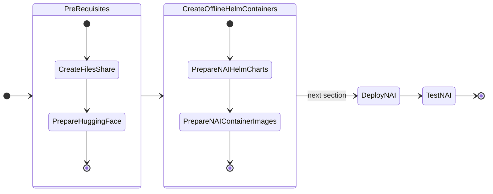
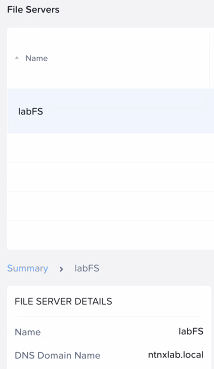
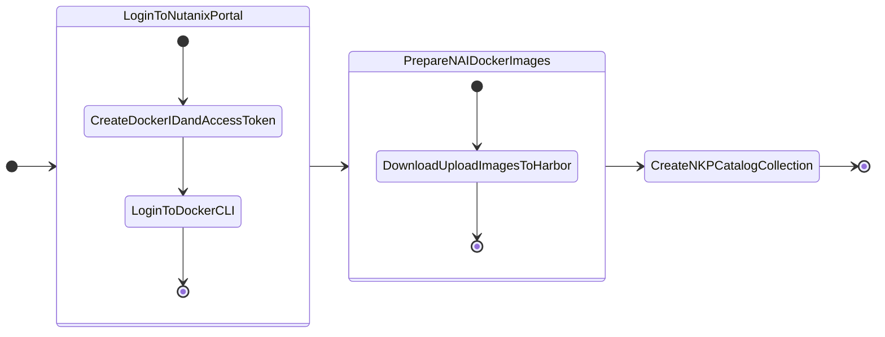

# Pre-requisites for Deploying NAI

In this part of the lab we will prepare pre-requisites for LLM application on GPU nodes.

The following is the flow of the applications lab:



Prepare the following pre-requisites needed to deploy NAI on target kubernetes cluster.

## Create Nutanix Files Share

We will create Nutanix Files storage class which will be used to create a pvc that will store the ``LLama-3-8B`` model files.

1. In **Prism Central**, choose **Files** from the menu
3. Choose the file server (e.g. labFS)
4. Click on **Shares & Exports**
5. Click on **+New Share or Export**
6. Fill the details of the Share
   
    - **Name** - ``model_share``
    - **Description** - for NAI model store
    - **Share path** - leave blank
    - **Max Size** - 10 GiB (adjust to the model file size)
    - **Primary Protocol Access** - NFS

7. Click **Next** and make sure **Enable compression** in checked
8. Click **Next** 
9. In NFS Protocol Access, choose the following: 
   
    - **Authentication** - System
    - **Default Access (for all clients)** - Read-Write 
    - **Squash** - Root Squash

    !!! note
        Consider changing access options for Production environment
  
10. Click **Next**
11. Confirm the share details and click on **Create**
12. This is where all the pvc will be created for the models eventually
13. Create another share using the same steps for initial model download that will be mounted on the jumphost
     - **Name** - ``model_download``
     - **Description** - for NAI model store
     - **Share path** - leave blank
     - **Max Size** - 10 GiB (adjust to the model file size)
     - **Primary Protocol Access** - NFS
     - **Authentication** - System
     - **Default Access (for all clients)** - Read-Write 
     - **Squash** - Root Squash

### Create the Files Storage Class

1. Run the following command to check K8S status of the ``nkpdarksite`` cluster
 
    === "Command"
    
        ```bash
        export KUBECONFIG=nkpdarksite.conf
        kubectl get nodes
        ```

    === "Command output"
    
        ```bash
        $ kubectl get nodes

        NAME                                  STATUS   ROLES           AGE     VERSION
        nkpdarksite-md-0-x948v-hvxtj-9r698           Ready    <none>          4h49m   v1.29.6
        nkpdarksite-md-0-x948v-hvxtj-fb75c           Ready    <none>          4h50m   v1.29.6
        nkpdarksite-md-0-x948v-hvxtj-mdckn           Ready    <none>          4h49m   v1.29.6
        nkpdarksite-md-0-x948v-hvxtj-shxc8           Ready    <none>          4h49m   v1.29.6
        nkpdarksite-r4fwl-8q4ch                      Ready    control-plane   4h50m   v1.29.6
        nkpdarksite-r4fwl-jf2s8                      Ready    control-plane   4h51m   v1.29.6
        nkpdarksite-r4fwl-q888c                      Ready    control-plane   4h49m   v1.29.6
        ```


12. In VSC Explorer, click on **New File** :material-file-plus-outline: and create a config file with the following name:

    ```bash
    nai-nfs-storage.yaml
    ```

    Add the following content and replace the `nfsServerName` with the name of the Nutanix Files server name .


    

    === "Template YAML"

        ```yaml hl_lines="6 7"
        apiVersion: storage.k8s.io/v1
        kind: StorageClass
        metadata:
          name: nai-nfs-storage
        parameters:
          nfsPath: <nfs-path>
          nfsServer: <nfs-server>
          storageType: NutanixFiles
        provisioner: csi.nutanix.com
        reclaimPolicy: Delete
        volumeBindingMode: Immediate
        ```

    === "Sample YAML"

        ```yaml hl_lines="6 7"
        apiVersion: storage.k8s.io/v1
        kind: StorageClass
        metadata:
          name: nai-nfs-storage
        parameters:
          nfsPath: /model_share
          nfsServer: labFS.ntnxlab.local
          storageType: NutanixFiles
        provisioner: csi.nutanix.com
        reclaimPolicy: Delete
        volumeBindingMode: Immediate
        ```

13. Create the storage class

    ```bash
    kubectl apply -f nai-nfs-storage.yaml
    ```

14. Check storage classes in the cluster for the Nutanix Files storage class

    === "Command"

        ```bash
        kubectl get storageclass
        ```
  
    === "Command output"

        ```bash hl_lines="5"
        kubectl get storageclass

        NAME                       PROVISIONER                     RECLAIMPOLICY   VOLUMEBINDINGMODE      ALLOWVOLUMEEXPANSION   AGE
        dkp-object-store           kommander.ceph.rook.io/bucket   Delete          Immediate              false                  28h
        nai-nfs-storage            csi.nutanix.com                 Delete          Immediate              true                   24h
        nutanix-volume (default)   csi.nutanix.com                 Delete          WaitForFirstConsumer   false                  28h
        ```

## Request Access to Model on Hugging Face

Gated models will require a Hugging Face token to be able to download. 

In this section we will create a token as Meta-Llama is a gated model.

!!! info
    
    Non-gated models can be directly downloaded using Hugging Face CLI. 

Follow these steps to request access to the `meta-llama/Meta-Llama-3.1-8B-Instruct` model:

!!! info "LLM Recommendation"

    From testing ``google/gemma-2-2b-it`` model is quicker to download and obtain download rights, than ``meta-llama/Meta-Llama-3.1-8B-Instruct`` model.

    Feel free to use the [google/gemma-2-2b-it](https://hf.co/google/gemma-2-2b-it) model if necessary. The procedure to request access to the model is the same.


1. **Sign in to your Hugging Face account**:  

      - Visit [Hugging Face](https://huggingface.co) and log in to your account.

2. **Navigate to the model page**:  

      - Go to the [Meta-Llama-3.1-8B-Instruct model page](https://huggingface.co/meta-llama/Meta-Llama-3.1-8B-Instruct).

3. **Request access**:

      - On the model page, you will see a section or button labeled **Request Access** (this is usually near the top of the page or near the "Files and versions" section).
      - Click **Request Access**.

4. **Complete the form**:

      - You may be prompted to fill out a form or provide additional details about your intended use of the model.
      - Complete the required fields and submit the request.

5. **Wait for approval**:

      - After submitting your request, you will receive a notification or email once your access is granted.
      - This process can take some time depending on the approval workflow.

Once access is granted, there will be an email notification.

!!! note

    Email from Hugging Face can take a few minutes or hours before it arrives.

## Create a Hugging Face Token with Read Permissions

Follow these steps to create a Hugging Face token with read permissions:

1. **Sign in to your Hugging Face account**:  

    - Visit [Hugging Face](https://huggingface.co) and log in to your account.

2. **Access your account settings**:
    - Click on your profile picture in the top-right corner.
    - From the dropdown, select **Settings**.

3. **Navigate to the "Access Tokens" section**:

    - In the sidebar, click on **Access Tokens**.
    - You will see a page where you can create and manage tokens.

4. **Create a new token**:

    - Click the **New token** button.
    - Enter a name for your token (i.e., `read-only-token`).

5. **Set token permissions**:

    - Under the permissions dropdown, select **Read**. For Example:
        

6. **Create and copy the token**:

    - After selecting the permissions, click **Create**.
    - Your token will be generated and displayed only once, so make sure to copy it and store it securely.
  
Use this token for accessing Hugging Face resources with read-only permissions.

## Download the model

We have two options in downloading a model to be accessed later by NAI.

Nutanix Files and Nutanix Objects (bucket) can be mounted as a file share on the jumphost with secure mount options.

1. **File share**  - create a **file share** on Nutanix Files and mount it on the jumphost
2. **Object storage** - create a **bucket** on Nutanix Objects and mount it as a file share on the jumphost

### File Share

!!! warning "File Share Design"

    For production environments, consider creating **two** file shares:
    
     - For model initial download location - ``/model_download`` for example
     - For NAI to store models - ``/model_share``
    
    This will ensure that concurrency and latency requirements are taken care of.

1. In Nutanix Files, create the ``/model_download`` share by following instructions [here](#create-nutanix-files-share)

2. Mount the ``/model_download`` file share created [here](#file-share) on the jumphost using the following script
   
    === ":material-script-text-play-outline: Script"
    
        ```bash
        #!/bin/bash
        set -e

        # ==============================================================================
        # CONFIGURATION
        # ==============================================================================
        # 1. Hugging Face Access Token (Must have accepted license terms on the web repo)
        HF_TOKEN="hf_your_actual_token_here"

        # 2. File share mounting details
        SHARE_SOURCE="labFS.ntnxlab.local:/model_download"
        SHARE_TYPE="nfs"
        SHARE_OPTIONS="rw,sync,hard,intr"

        # Target Directories
        MOUNT_POINT="/model_share"
        TARGET_DIR="${MOUNT_POINT}/Llama-3.1-8B-Instruct"
        MODEL_REPO="meta-llama/Llama-3.1-8B-Instruct"

        # Binary Location from pipx
        HF_BIN="/root/.local/bin/hf"

        # ==============================================================================
        # 1. MOUNT FILE SHARE
        # ==============================================================================
        echo "Creating mount point folder at ${MOUNT_POINT}..."
        mkdir -p "${MOUNT_POINT}"

        echo "Mounting ${SHARE_SOURCE} to ${MOUNT_POINT}..."
        if mountpoint -q "${MOUNT_POINT}"; then
            echo "Directory is already mounted."
        else
            sudo mount -t "${SHARE_TYPE}" -o "${SHARE_OPTIONS}" "${SHARE_SOURCE}" "${MOUNT_POINT}"
            echo "Mount successful."
        fi

        # Create the final model directory inside the share 
        # (This side-steps root-squashing permissions on the parent directory)
        echo "Preparing local target folder..."
        mkdir -p "${TARGET_DIR}"

        # ==============================================================================
        # 2. DOWNLOAD VIA MODERN HF CLIENT
        # ==============================================================================
        echo "Starting download for ${MODEL_REPO} using modern hf CLI..."

        # Run the download command referencing the direct absolute path
        # Using the updated 'hf download' structure and mapping parameters
        ${HF_BIN} download \
            "${MODEL_REPO}" \
            --local-dir "${TARGET_DIR}" \
            --token "${HF_TOKEN}"

        echo "Download completed successfully!"
        echo "Model files are located at: ${TARGET_DIR}"
        ```

    === ":octicons-command-palette-16: Script output"
    
        ```{ .text .no-copy }
        Creating mount point at /model_share...
        Mounting labFS.ntnxlab.local:/model_share/ to /model_download...
        Directory is already mounted.
        'huggingface-hub' already seems to be installed. Not modifying existing installation in
        '/root/.local/share/pipx/venvs/huggingface-hub'. Pass '--force' to force installation.
        injected package hf-transfer into venv huggingface-hub
        done! ✨ 🌟 ✨
        Starting download for meta-llama/Llama-3.1-8B-Instruct...
        /root/.local/share/pipx/venvs/huggingface-hub/lib/python3.12/site-packages/huggingface_hub/constants.py:298: FutureWarning: The `HF_HUB_ENABLE_HF_TRANSFER` environment variable is deprecated as 'hf_transfer' is not used anymore. Please use `HF_XET_HIGH_PERFORMANCE` instead to enable high performance transfer with Xet. Visit https://huggingface.co/docs/huggingface_hub/package_reference/environment_variables#hfxethighperformance for more details.
        warnings.warn(
        Downloading bytes:                                                                      |  0.00B            Still waiting to acquire lock on /model_share/Llama-3.1-8B-Instruct/.cache/huggingface/.gitignore.lock (elapsed: 0.1 seconds)es:   0%|                                                             | 0/17 [00:00<?, ?it/s]
        Fetching 17 files: 100%|████████████████████████████████████████████████████| 17/17 [01:07<00:00,  3.98s/it]
        Download complete: : ███████████████████████████████████████████████████████████████████| 27.6GB, 37.5MB/s  ✓ Downloadedion complete: 100%|█████████████████████████████████████████████████| 32.1GB / 32.1GB,  303MB/s  
        path: /model_share/Llama-3.1-8B-Instruct
        Download complete: : ███████████████████████████████████████████████████████████████████| 27.6GB, 37.5MB/s  
        Reconstruction complete: 100%|█████████████████████████████████████████████████| 32.1GB / 32.1GB,  303MB/s  
        Download completed successfully! 
        Model located at: /model_share/Llama-3.1-8B-Instruct
        ```

3. Confirm model files in the directory on the File share
   
    === ":octicons-command-palette-16: Command"
    
        ```bash
        ls -l /model_share/Llama-3.1-8B-Instruct/
        ```

    === ":octicons-command-palette-16: Command output"
    
        ```{ .text .no-copy }
        $ ls -l /model_share/Llama-3.1-8B-Instruct/
        #
        total 15714428
        drwxr-xr-x  4 4294967294 4294967294         18 Jul 20 01:34 ./
        drwxrwxrwt 12 root       root               12 Jul 20 01:38 ../
        drwxr-xr-x  3 4294967294 4294967294          3 Jul 20 01:33 .cache/
        -rw-r--r--  1 4294967294 4294967294       1519 Jul 20 01:33 .gitattributes
        -rw-r--r--  1 4294967294 4294967294       7627 Jul 20 01:33 LICENSE
        -rw-r--r--  1 4294967294 4294967294      44044 Jul 20 01:33 README.md
        -rw-r--r--  1 4294967294 4294967294       4691 Jul 20 01:33 USE_POLICY.md
        -rw-r--r--  1 4294967294 4294967294        855 Jul 20 01:33 config.json
        -rw-r--r--  1 4294967294 4294967294        184 Jul 20 01:33 generation_config.json
        -rw-r--r--  1 4294967294 4294967294 4976698672 Jul 20 01:34 model-00001-of-00004.safetensors
        -rw-r--r--  1 4294967294 4294967294 4999802720 Jul 20 01:34 model-00002-of-00004.safetensors
        -rw-r--r--  1 4294967294 4294967294 4915916176 Jul 20 01:34 model-00003-of-00004.safetensors
        -rw-r--r--  1 4294967294 4294967294 1168138808 Jul 20 01:33 model-00004-of-00004.safetensors
        -rw-r--r--  1 4294967294 4294967294      23950 Jul 20 01:33 model.safetensors.index.json
        drwxr-xr-x  2 4294967294 4294967294          5 Jul 20 01:34 original/
        -rw-r--r--  1 4294967294 4294967294        296 Jul 20 01:33 special_tokens_map.json
        -rw-r--r--  1 4294967294 4294967294    9085657 Jul 20 01:33 tokenizer.json
        -rw-r--r--  1 4294967294 4294967294      55351 Jul 20 01:33 tokenizer_config.json
        ```

### Buckets Store

Follow the same procedure to mount the bucket on the jump host and download the model. 

1. Create a bucket
2. Create access and secret keys
3. Enable NFS mount options on the buckets 
4. Mount the share on jumphost VM
5. Download the model to mounted file share using the script in the previous section

## Prepare Container Images and Helm Charts

The Jumphost VM will be used as a medium to download the NAI container images and upload them to the internal Harbor container registry.



### Prepare Environment 

In this section we will use NKP product catalog extensions to prepare NAI container images. 

!!! info "High Level Steps"

    - Login to docker.io using ``ntnxsvcgpt`` account (obtained from [Portal](https://portal.nutanix.com/page/downloads?product=nai))
    - Create NAI Airgap bundle
    - Push the bundle to local (internal) Harbor registry
    - Create NAI Catalog collection and use this to install all pre-requisites and NAI

We will prepare the helm charts necessary for NAI and pre-requisite applications install:

 - NAI
 - Envoy Gateway
 - Kserve
 - OpenTelemetry Operator

The procedure will be done on the jumphost VM.

1. Login to [Nutanix Portal](https://portal.nutanix.com/page/downloads?product=nai) using your credentials

2. Go to **Downloads** > **Nutanix Eneterprise AI** > **Manage Access Token**

3. Copy the download ``ntnxsvcgpt`` accounts credentials
   
4. Open new `VSCode` window on your jumphost VM

5.  In `VSCode` Explorer pane, click on existing ``$HOME`` folder

6.  Click on **New Folder** :material-folder-plus-outline: name it: ``airgap-nai``

7.  On `VSCode` Explorer plane, click the ``$HOME/airgap-nai`` folder

8.  On `VSCode` menu, select ``Terminal`` > ``New Terminal``

9.  Browse to ``airgap-nai`` directory

    ```bash
    cd $HOME/airgap-nai
    ```

10. In ``VSC``, under the newly created ``airgap-nai`` folder, click on **New File** :material-file-plus-outline: and create file with the following name:
   
    ```bash
    .env
    ```

11. Add (append) the following environment variables and save it

    === ":octicons-file-code-16: Template ``$HOME/airgap-nai/.env``"

        ```bash
        export DOCKER_NAI_USERNAME=ntnxsvcgpt
        export DOCKER_NAI_PAT=_XXXXXXXXXXXXXXXXXXXXXXXXXXXXXXXXXXXXXXX
        export HARBOR_REGISTRY=_your_harbor_registry_url
        export HARBOR_REGISTRY_USERNAME=admin
        export HARBOR_REGISTRY_PASSWORD=_xxxxxxx
        export HARBOR_PROJECT=_your_harbor_project_name      # (1)!
        export HARBOR_REGISTRY_CACERT=_path_to_ca_cert_of_registry  # (2)!
        ```

        1. The Harbor project must exist for uploads to work
        2. File must contain private CA server and Harbor server's public certificate in one file

    === ":octicons-file-code-16: Sample ``$HOME/airgap-nai/.env``"
        
        ```{ .bash .no-copy }
        export DOCKER_NAI_USERNAME=ntnxsvcgpt
        export DOCKER_NAI_PAT=_XXXXXXXXXXXXXXXXXXXXXXXXXXXXXXXXXXXXXXX
        export HARBOR_REGISTRY=harbor.10.x.x.134.nip.io
        export HARBOR_REGISTRY_USERNAME=admin
        export HARBOR_REGISTRY_PASSWORD=_xxxxxxx
        export HARBOR_PROJECT=nutanix                             # (1)!
        export HARBOR_REGISTRY_CACERT=$HOME/harbor/certs/full_chain.pem  # (2)!
        ```
        
        1. The Harbor project must exist for uploads to work - we will create the project in the next step
        2. File must contain privatre CA server and Harbor server's public certificate in one file

12. Source the ``$HOME/airgap-nai/.env`` file to import environment variables
    
    === ":octicons-command-palette-16: Command"
    
        ```bash
        source $HOME/airgap-nai/.env
        ```

13. Create a project called ``nutanix`` in the Harbor registry using the following ``curl`` command or simply use the Harbor GUI
    
    === ":octicons-command-palette-16: API Call"
    
        ```bash
        curl -X POST \
          -u "${HARBOR_REGISTRY_USERNAME}:${HARBOR_REGISTRY_PASSWORD}" \
          -H "Content-Type: application/json" \
          "https://${HARBOR_REGISTRY}" \
          -d '{
          "project_name": "${HARBOR_PROJECT}",
          "metadata": {
              "public": "false"
          }
          }'
        ```
    
    === ":octicons-command-palette-16: API Sample Call"
    
        ```bash
        curl -X POST \
          -u "admin:_XXXXXXXXX" \
          -H "Content-Type: application/json" \
          "https://harbor.10.x.x.134.nip.io" \
          -d '{
          "project_name": "nutanix",
          "metadata": {
              "public": "false"
          }
          }'
        ```

14. If your Harbour registry is certified by a private CA, make sure to copy the CA's public key ``${HARBOR_REGISTRY_CACERT}`` to your jumphost's Docker certificate store

    === ":octicons-command-palette-16: Command"
    
        ```bash
        sudo mkdir -p /etc/docker/certs.d/${HARBOR_REGISTRY}/
        sudo cp ${HARBOR_REGISTRY_CACERT} /etc/docker/certs.d/${HARBOR_REGISTRY}/
        ```
    
    === ":octicons-command-palette-16: Sample command"
    
        ```bash
        sudo mkdir -p /etc/docker/certs.d/harbor.10.x.x.134.nip.io/
        sudo cp /home/ubuntu/harbor/certs/full_chain.pem /etc/docker/certs.d/harbor.10.x.x.134.nip.io/
        ```

15. Clone NKP product catalog git repository 

    === ":octicons-file-code-16: Command"
    
        ```bash
        git clone https://github.com/nutanix-cloud-native/nkp-nutanix-product-catalog
        cd nkp-nutanix-product-catalog
        ```
 
16. Login to ``docker.io`` with ``ntnxsvcgpt`` [credentials](https://portal.nutanix.com/page/downloads?product=nai) to be able to download NAI container images and artifacts

    === ":octicons-file-code-16: Command"
        
        ```bash
        docker login -u ${DOCKER_NAI_USERNAME} -p ${DOCKER_NAI_PAT}
        ```

    === ":octicons-command-palette-16: Command output"
    
        ```{ .text .no-copy }
        $ docker login -u ntnxsvcgpt -p _XXXXXXXXXXXXXXXXXXXXXXXXXXXXXXXXXXXXXXX
        #
        i Info → A Personal Access Token (PAT) can be used instead.
                To create a PAT, visit https://app.docker.com/settings
                
                
        Password: 

        WARNING! Your credentials are stored unencrypted in '/home/ubuntu/.docker/config.json'.
        Configure a credential helper to remove this warning. See
        https://docs.docker.com/go/credential-store/
        ```

### Create NAI Airgap Bundle and NKP Catalog Applications

In this section we will create the NKP catalog applications components that can be used to deploy pre-requistes applications.

1. Run the following command to check K8S status of the ``nkpdarksite`` cluster and set context for NKP cluster
 
    === "Command"
    
        ```bash
        export KUBECONFIG=nkpdarksite.conf
        kubectl get nodes
        ```

    === "Command output"
    
        ```bash
        $ kubectl get nodes

        NAME                                  STATUS   ROLES           AGE     VERSION
        nkpdarksite-md-0-x948v-hvxtj-9r698           Ready    <none>          4h49m   v1.29.6
        nkpdarksite-md-0-x948v-hvxtj-fb75c           Ready    <none>          4h50m   v1.29.6
        nkpdarksite-md-0-x948v-hvxtj-mdckn           Ready    <none>          4h49m   v1.29.6
        nkpdarksite-md-0-x948v-hvxtj-shxc8           Ready    <none>          4h49m   v1.29.6
        nkpdarksite-r4fwl-8q4ch                      Ready    control-plane   4h50m   v1.29.6
        nkpdarksite-r4fwl-jf2s8                      Ready    control-plane   4h51m   v1.29.6
        nkpdarksite-r4fwl-q888c                      Ready    control-plane   4h49m   v1.29.6
        ```

2. Create the Airgap bundle for NAI 
    
    === ":octicons-command-palette-16: Command"
    
        ```bash
        nkp create catalog-bundle --airgapped \
          --collection-tag 2.17 \
          --apps=nutanix-ai=2.7.0,envoy-gateway-nai=1.7.0,kserve=0.15.0,opentelemetry-operator=0.102.0
        ```
    
    === ":octicons-command-palette-16: Command output"
    
        ```{ .text .no-copy }
        nkp create catalog-bundle --airgapped --collection-tag 2.17  --apps=nutanix-ai=2.7.0,envoy-gateway-nai=1.7.0,kserve=0.15.0,opentelemetry-operator=0.102.0
        Bundling 4 application(s) (airgapped : true)
        ✓ Building OCI artifact nkp-nutanix-product-catalog/collection:2.17
        ✓ Building OCI artifact nkp-nutanix-product-catalog/nutanix-ai:2.7.0
        ✓ Building OCI artifact nkp-nutanix-product-catalog/envoy-gateway-nai:1.7.0
        ✓ Building OCI artifact nkp-nutanix-product-catalog/kserve:0.15.0
        ✓ Building OCI artifact nkp-nutanix-product-catalog/opentelemetry-operator:0.102.0
        Processing application nutanix-ai/2.7.0
        ✓ K8s [1.34.0 1.35.0 1.36.0]: Parsing resources 
        ✓ K8s v1.34.0: Validating 
        ✓ K8s v1.35.0: Validating 
        ✓ K8s v1.36.0: Validating 
        Processing application envoy-gateway-nai/1.7.0
        ✓ K8s [1.34.0 1.35.0 1.36.0]: Parsing resources 
        ✓ K8s v1.34.0: Validating 
        ✓ K8s v1.35.0: Validating 
        ✓ K8s v1.36.0: Validating 
        Processing application kserve/0.15.0
        ✓ K8s [1.33.0 1.34.0 1.35.0 1.36.0]: Parsing resources 
        ✓ K8s v1.33.0: Validating 
        ✓ K8s v1.34.0: Validating 
        ✓ K8s v1.35.0: Validating 
        ✓ K8s v1.36.0: Validating 
        Processing application opentelemetry-operator/0.102.0
        ✓ K8s [1.33.0 1.34.0 1.35.0 1.36.0]: Parsing resources 
        ✓ K8s v1.33.0: Validating 
        ✓ K8s v1.34.0: Validating 
        ✓ K8s v1.35.0: Validating 
        ✓ K8s v1.36.0: Validating 
        ✓ Pulling requested images [==================================>57/57] (time elapsed 9m59s) 
        ✓ Saving application bundle to /home/ubuntu/temp/nkp-nutanix-product-catalog/nkp-nutanix-product-catalog-airgapped.tar 
        Run the following to push the artifact to your registry:

        nkp push bundle --bundle /home/ubuntu/temp/nkp-nutanix-product-catalog/nkp-nutanix-product-catalog-airgapped.tar --to-registry <your-registry-url>


        Run the following command to create catalog artifact(s) after pushing them:

        nkp create catalog-collection --url oci://<registry-url>/nkp-nutanix-product-catalog/collection --tag 2.17 --workspace kommander-workspace
        ```
    
16. Login to your local Harbor registry with credentials to be able to **upload** NAI container images and artifacts

    === ":octicons-file-code-16: Command"
        
        ```bash
        docker login ${HARBOR_REGISTRY} -u admin # (1)!
        ```

        1. Make sure that the private CA's public certificate is in Docker certificate store - documented above

    === ":octicons-command-palette-16: Command output"
    
        ```{ .text .no-copy }
        $ docker login harbor.10.x.x.134.nip.io -u admin
        #
        Password: 

        WARNING! Your credentials are stored unencrypted in '/home/ubuntu/.docker/config.json'.
        Configure a credential helper to remove this warning. See
        https://docs.docker.com/go/credential-store/

        Login Succeeded
        ```

17. Push the created bundle to the registry
    
    === ":octicons-command-palette-16: Command"
    
        ```bash
        nkp push bundle \
          --bundle nkp-nutanix-product-catalog-airgapped.tar \ 
          --to-registry ${HARBOR_REGISTRY}/${HARBOR_PROJECT}
        ```
    
    === ":octicons-command-palette-16: Sample command"
    
        ```bash
        nkp push bundle \
          --bundle nkp-nutanix-product-catalog-airgapped.tar \
          --to-registry harbor.10.x.x.134.nip.io/nutanix
        ```
    
    === ":octicons-command-palette-16: Command output"
    
        ```{ .text .no-copy }
        nkp push bundle --bundle /home/ubuntu/temp/nkp-nutanix-product-catalog/nkp-nutanix-product-catalog-airgapped.tar --to-registry harbor.10.x.x.134.nip.io/nutanix
        ✓ Creating temporary directory
        ✓ Extracting bundle configs from "/home/ubuntu/temp/nkp-nutanix-product-catalog/nkp-nutanix-product-catalog-airgapped.tar"
        ✓ Parsing image bundle config
        ✓ Starting temporary Docker registry
        ✓ Pushing bundled images [==================================>57/57] (time elapsed 1m29s) 
        ```
    

18. Deploy catalog collection
    
    === ":octicons-command-palette-16: Command"
    
        ```bash
        nkp create catalog-collection \
          --url oci://${HARBOR_REGISTRY}/${HARBOR_PROJECT}/nkp-nutanix-product-catalog/collection \
          --tag 2.17 \
          --workspace kommander-workspace
        ```
    
    === ":octicons-command-palette-16: Sample command"
    
        ```bash
        nkp create catalog-collection \
          --url oci://harbor.10.x.x.134.nip.io/nutanix/nkp-nutanix-product-catalog/collection \
          --tag 2.17 \
          --workspace kommander-workspace
        ```
    
    === ":octicons-command-palette-16: Command output"
    
        ```{ .text .no-copy }
        Catalog collection nkp-nutanix-product-catalog-collection created. 
        Use 'nkp edit ocirepository -n kommander nkp-nutanix-product-catalog-collection'to change its configuration if needed.
        ```

We can now proceed to deploy NAI.