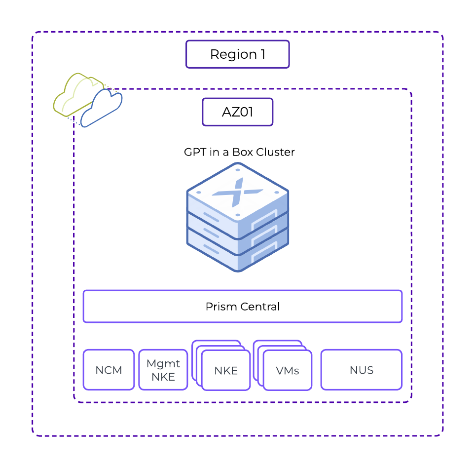
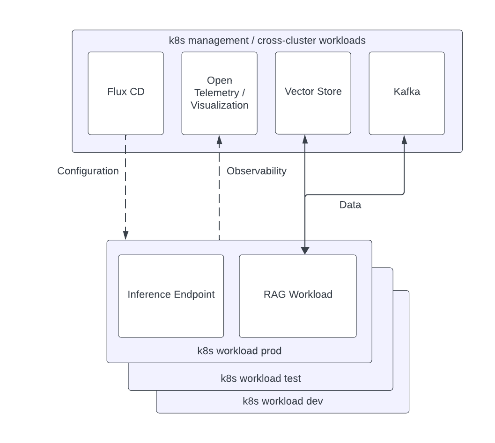

# Conceptual Design

In this section we will discuss conceptual designs of Nutanix infrastructure along with Nutanix Kubernetes Engine (NKE) at a very high level.

!!!note
       All information for this page comes from Nutanix Validated Designs (NVD) from [Nutanix Portal](https://portal.nutanix.com) for [GPT-in-a-Box](https://portal.nutanix.com/page/documents/solutions/details?targetId=NVD-2115-GPT-in-a-Box-6-7-Design:application-cluster-designs.html) and is publicly available. 

## Core Infrastructure Design

All Nutanix infrastructure designs are considered non-functional components and designed with the following in mind:

- Availability (along with the uptime requirement in terms of 9s (Eg. 99.99)
- Resiliency
- Scalability
- Observability and
- Performance

The Nutanix cluster used in this website to test AI applications is a 4-node Nutanix cluster with GPU. This has provisioning for all non-functional components except regional availability, as it is just a testing environment. It is recommended to have zonal and/or regional availability for production applications.

Compute, Storage and Networking are **redundant** in a 4-node Nutanix cluster used. The NVD referenced in this page also provides details of multi-zone and multi-regional Nutanix clusters. 

Refer to the [GPT-in-a-Box](https://portal.nutanix.com/page/documents/solutions/details?targetId=NVD-2115-GPT-in-a-Box-6-7-Design:application-cluster-designs.html)  for details about multi-zone/region NVD.

## Core NKE Design

*The conceptual design outlines a robust, highly available Kubernetes environment on the Nutanix platform, using Nutanix Kubernetes Engine (NKE) features and integrating with essential Kubernetes tools and practices for efficient and secure operations.*

NKE designs are considered non-functional components and designed with the following in mind:

- Availability (along with the uptime requirement in terms of 9s (Eg. 99.99)
- Resiliency
- Scalability
- Observability and
- Performance

We will use two NKE clusters to eventually deploy AI apps.

All NKE cluster will use the following components:

- **Kube-VIP:** Manages network connectivity and load balancing.
- **Ingress Controllers:** Handle external access to services using HTTP and HTTPS routes.
- **Cert-Manager:** Automates TLS certificate management and issuance, enhancing secure communications.

### Management Kubernetes Cluster

The Management Kubernetes Clusters is deployed with multiple master and worker nodes distributed across multiple physical nodes.

The following management applications are used in the Management kubernetes clusters to automate the lifecycle management of all components.

- **Flux CD:** Manages applications on Kubernetes prod, test, and dev clusters with automated deployment from Git repositories
- **OpenTelemetry:** Manages Metrics, Logs, and Traces that are collected across all kubernetes clusters 
- **Uptrace:** Provides a user-friendly interface for visualizing and querying collected data for monitoring and debugging
- **Kafka:** Provides messaging infrastructure to send and receive data from the Retrieval-Augmented Generation (RAG) workload and vector database store
  
### Dev/Test/Prod Kubernetes Cluster 

We will only use Dev cluster in this design. However, the principles apply to Prod and Test clusters as well.

These clusters will have access to GPU card using passthrough method. For example: Dev cluster will have only have access to a single GPU while PROD clusters may have access to many. Refer to GPT-in-a-Box NVD for design details based on the resource requirement for the AI application. 

The workload clusters will host the following:

- **Inference Endpoint:** This is the managed service running on NKE cluster that provides the interface between the AI application and users
- **RAG Workload:** All private user/company data additional to basic LLM knowledge is stored in this vector database store

