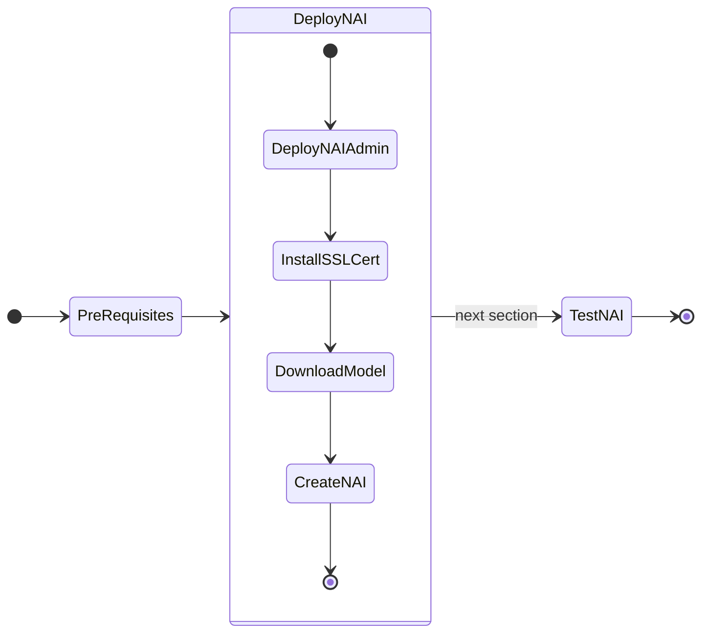

# Deploying Nutanix Enterprise AI (NAI) NVD Reference Application

!!! info "Version 2.3.0"

    This version of the NAI deployment is based on the Nutanix Enterprise AI (NAI) ``v2.3.0`` release.



## Prepare for NAI Deployment

Changes in NAI ``v2.4.0``

  - Istio Ingress gateway is replaced with Envoy Gateway
  - Knative is removed from NAI 
  - Kserve has been upgraded to 0.15.0

### Enable NKP Applications through NKP GUI

Enable these NKP Operators from NKP GUI.

!!! note

    In this lab, we will be using the **Management Cluster Workspace** to deploy our Nutanix Enterprise AI (NAI)

    However, in a customer environment, it is recommended to use a separate workload NKP cluster.

1. In the NKP GUI, Go to **Clusters**
2. Click on **Management Cluster Workspace**
3. Go to **Applications** 
4. Search and enable the following applications: follow this order to install dependencies for NAI application
   
    - Kube-prometheus-stack: version ``70.4.2`` or later (pre-installed on NKP cluster)

### Enable Pre-requisite Applications  

We will enable the following pre-requisite applications through command line:

   - Envoy Gateway ``v1.3.2``
   - Kserve: ``v0.15.0`` in raw deployment mode
   
!!! note
    The following application are pre-installed on NKP cluster with Pro license

    - Cert Manager
    
    Check if Cert Manager is installed (pre-installed on NKP cluster)
   
    === "Command"
    
        ```bash
        kubectl get deploy -n cert-manager
        ```

    === "Output"

        ```{ .text .no-copy }
        $ kubectl get deploy -n cert-manager

        NAME                      READY   UP-TO-DATE   AVAILABLE   AGE
        cert-manager              1/1     1            1           145m
        cert-manager-cainjector   1/1     1            1           145m
        cert-manager-webhook      1/1     1            1           145m
        ```

    If not installed, use the following command to install it

    ```bash
    kubectl apply -f https://github.com/cert-manager/cert-manager/releases/download/v1.16.4/cert-manager.yaml
    ```
   
1. Open Terminal  in ``VSCode``

2. Run the command to load the environment variables
   
    ```bash
    source $HOME/.env
    ```

3. Install Envoy Gateway ``v1.3.2``
   
    === "Command"
    
        ```bash
        helm install eg oci://docker.io/envoyproxy/gateway-helm --version v1.3.2 -n envoy-gateway-system --create-namespace
        ```

    === "Output"
        
        ```{ .text .no-copy }
        helm install eg oci://docker.io/envoyproxy/gateway-helm --version v1.3.2 -n envoy-gateway-system --create-namespace
        Pulled: docker.io/envoyproxy/gateway-helm:v1.3.2
        Digest: sha256:0070bdddc186e6bd48007a84c6d264b796d14017436f38ccfe5ca621aefc1ca5
        NAME: eg
        LAST DEPLOYED: Mon Aug 25 04:31:06 2025
        NAMESPACE: envoy-gateway-system
        STATUS: deployed
        REVISION: 1
        TEST SUITE: None
        ``` 

4. Check if Envoy Gateway resources are ready
   
    === "Command"
    
        ```bash
        kubectl wait --timeout=5m -n envoy-gateway-system deployment/envoy-gateway --for=condition=Available
        ```

    === "Output"

        ```{ .text .no-copy }
        deployment.apps/envoy-gateway condition met
        ```

5. Open ``$HOME/.env`` file in ``VSCode``

6. Add (append) the following line and save it


    ```text
    export KSERVE_VERSION=v0.15.0
    ```

8. Install ``kserve`` using the following commands

    === "Command"
    
        ```bash
        helm upgrade --install kserve-crd oci://ghcr.io/kserve/charts/kserve-crd --version ${KSERVE_VERSION} -n kserve --create-namespace 
        ```
        ```bash
        helm upgrade --install kserve oci://ghcr.io/kserve/charts/kserve --version ${KSERVE_VERSION} --namespace kserve --create-namespace \
        --set kserve.controller.deploymentMode=RawDeployment \
      	--set kserve.controller.gateway.disableIngressCreation=true
        ```

    === "Output"
    
        ```{ .text .no-copy }
        Pulled: ghcr.io/kserve/charts/kserve-crd:v0.15.0
        Digest: sha256:57ad1a5475fd625cb558214ba711752aa77b7d91686a391a5f5320cfa72f3fa8
        Release "kserve-crd" has been upgraded. Happy Helming!
        NAME: kserve-crd
        LAST DEPLOYED: Mon May 19 06:11:30 2025
        NAMESPACE: kserve
        STATUS: deployed
        REVISION: 2
        TEST SUITE: None
        (devbox) 
        ```
        ```{ .text .no-copy }
        Pulled: ghcr.io/kserve/charts/kserve:v0.15.0
        Digest: sha256:905abce80e975c53b40fba7a12b0b9a1e24bdf65cceebb88fba4ef62bba01406
        Release "kserve" has been upgraded. Happy Helming!
        NAME: kserve
        LAST DEPLOYED: Mon May 19 05:48:45 2025
        NAMESPACE: kserve
        STATUS: deployed
        REVISION: 2
        TEST SUITE: None
        ```

9. Check if ``kserve`` pods are running
   
    === "Command"
    
        ```bash
        kubens kserve
        kubectl get pods    # (1)!
        ```

        1. Make sure both the containers are running for ``kserve-controller-manager`` pod

    === "Output"
    
        ```{ .text .no-copy }
        NAME                                         READY   STATUS    RESTARTS   AGE
        kserve-controller-manager-58946fd54d-vsxvn   2/2     Running   0          18m
        ```

!!! note
    It may take a few minutes for each application to be up and running. Monitor the deployment to make sure that these applications are running before moving on to the next section.

## Deploy NAI

We will use the Docker login credentials we created in the previous section to download the NAI Docker images.

!!! warning "Change the Docker login credentials"

    The following Docker based environment variable values need to be changed from your own Docker environment variables to the credentials downloaded from Nutanix Portal.

    - ``$DOCKER_USERNAME``
    - ``$DOCKER_PASSWORD``

1. Open ``$HOME/.env`` file in ``VSCode``

2. Add (append) the following environment variables and save it

    === "Template .env"

        ```text
        export DOCKER_USERNAME=_GA_release_docker_username
        export DOCKER_PASSWORD=_GA_release_docker_password
        export NAI_CORE_VERSION=_GA_release_nai_core_version
        export NAI_DEFAULT_RWO_STORAGECLASS=_RWO_storage_class_name
        export NAI_API_RWX_STORAGECLASS=_RWX_storage_class_name
        ```

    === "Sample .env"

        ```text
        export DOCKER_USERNAME=ntnxsvcgpt
        export DOCKER_PASSWORD=dckr_pat_xxxxxxxxxxxxxxxxxxxxxxxx
        export NAI_CORE_VERSION=v2.4.0
        export NAI_DEFAULT_RWO_STORAGECLASS=nutanix-volume
        export NAI_API_RWX_STORAGECLASS=nai-nfs-storage
        ```

3. Source the environment variables (if not done so already)

    ```bash
    source $HOME/.env
    ```

4. In `VSCode` Explorer pane, browse to ``$HOME/nai`` folder
   
5. Click on **New File** :material-file-plus-outline: and create file with the following name:

    ```bash
    nkp-values.yaml
    ```

    with the following content:

    ```yaml
    # nai-monitoring stack values for nai-monitoring stack deployment in NKE environment
    naiMonitoring:
          
      ## Component scraping node exporter
      ##
      nodeExporter:
        serviceMonitor:
          enabled: true
          endpoint:
            port: http-metrics
            scheme: http
            targetPort: 9100
          namespaceSelector:
            matchNames:
            - kommander
          serviceSelector:
            matchLabels:
              app.kubernetes.io/name: prometheus-node-exporter
              app.kubernetes.io/component: metrics
    
      ## Component scraping dcgm exporter
      ##
      dcgmExporter:
        podLevelMetrics: true
        serviceMonitor:
          enabled: true
          endpoint:
            targetPort: 9400
          namespaceSelector:
            matchNames:
            - kommander
          serviceSelector:
            matchLabels:
              app: nvidia-dcgm-exporter
    ```

    ???tip "How to get nkp-values.yaml file?"

           It is possible to get the values file using the following command
      
           ```bash
           helm repo add ntnx-charts https://nutanix.github.io/helm-releases
           helm repo update ntnx-charts
           helm pull ntnx-charts/nai-core --version=nai-core-version --untar=true
           ```

           All the files will be untar'ed to a folder nai-core in the present working directory

           Use the ``nkp-values.yaml`` file in the installation command

6. In ``VSCode``, Under ``$HOME/nai`` folder, click on **New File** :material-file-plus-outline: and create a file with the following name:

    ```bash
    nai-deploy.sh
    ```

    with the following content:

    ```bash hl_lines="16"
    #!/usr/bin/env bash

    set -ex
    set -o pipefail

    helm repo add ntnx-charts https://nutanix.github.io/helm-releases
    helm repo update ntnx-charts

    #NAI-core
    helm upgrade --install nai-core ntnx-charts/nai-core --version=$NAI_CORE_VERSION -n nai-system --create-namespace --wait \
    --set imagePullSecret.credentials.username=$DOCKER_USERNAME \
    --set imagePullSecret.credentials.password=$DOCKER_PASSWORD \
    --insecure-skip-tls-verify \
    --set naiApi.storageClassName=$NAI_API_RWX_STORAGECLASS \
    --set defaultStorageClassName=$NAI_DEFAULT_RWO_STORAGECLASS \
    -f nkp-values.yaml
    ```
   
7.  Run the following command to deploy NAI
   
    === "Command"

        ```bash
        $HOME/nai/nai-deploy.sh
        ```

    === "Command output"
      
        ```{ .text .no-copy }
        $HOME/nai/nai-deploy.sh 

        + set -o pipefail
        + helm repo update ntnx-charts
        Hang tight while we grab the latest from your chart repositories...
        ...Successfully got an update from the "ntnx-charts" chart repository
        Update Complete. ⎈Happy Helming!⎈
        helm upgrade --install nai-core ntnx-charts/nai-core --version=$NAI_CORE_VERSION -n nai-system --create-namespace --wait \
        --set imagePullSecret.credentials.username=$DOCKER_USERNAME \
        --set imagePullSecret.credentials.password=$DOCKER_PASSWORD \
        --insecure-skip-tls-verify \
        -f nkp-values.yaml
        Release "nai-core" does not exist. Installing it now.
        NAME: nai-core
        LAST DEPLOYED: Mon Aug 25 04:59:28 2025
        NAMESPACE: nai-system
        STATUS: deployed
        REVISION: 1
        ```

8.  Verify that the NAI Core Pods are running and healthy
    
    === "Command"

        ```bash
        kubens nai-system
        kubectl get po,deploy
        ```
    === "Command output"

        ```{ .text .no-copy }
        $ kubectl get po,deploy
        Context "nkplb-admin@nkplb" modified.
        Active namespace is "nai-system".
        NAME                                            READY   STATUS      RESTARTS   AGE
        pod/nai-api-58cbd47f86-dqt5z                    1/1     Running     0          4m1s
        pod/nai-api-db-migrate-q2urg-nb8zc              0/1     Completed   0          4m1s
        pod/nai-db-0                                    1/1     Running     0          4m1s
        pod/nai-iep-model-controller-64d88cd94f-q85hf   1/1     Running     0          4m1s
        pod/nai-ui-dd8fb65c-zthbf                       1/1     Running     0          4m1s
        pod/prometheus-nai-0                            2/2     Running     0          4m1s

        NAME                                       READY   UP-TO-DATE   AVAILABLE   AGE
        deployment.apps/nai-api                    1/1     1            1           4m1s
        deployment.apps/nai-iep-model-controller   1/1     1            1           4m1s
        deployment.apps/nai-ui                     1/1     1            1           4m1s
        ```

??? "Uninstall NAI ``v2.3.0`` Dependencies"

    If you are upgrading NAI from ``v2.3.0`` to ``v2.4.0``, uninstall the following:

    If Helm was used:

    ```bash title="Uninstall Istio"
    helm uninstall istio-ingressgateway -n istio-system --wait --ignore-not-found
    helm uninstall istiod -n istio-system --wait --ignore-not-found
    helm uninstall istio-base -n istio-system --wait --ignore-not-found
    ```
    ```bash title="Uninstall Knative"
    kubectl delete --ignore-not-found=true KnativeServing knative-serving -n knative-serving
    helm uninstall knative-operator -n knative-serving --wait --ignore-not-found
    kubectl wait --for=delete pod --all -n knative-serving --timeout=300s
    ```

    If NKP Application were used for installation:

    Go to NKP Cluster Dashboard > Application > Search and Uninstall the following:

    1. Istio
    2. Knative 

## Install SSL Certificate and Gateway Elements

In this section we will install SSL Certificate to access the NAI UI. This is required as the endpoint will only work with a ssl endpoint with a valid certificate.

NAI UI is accessible using the Ingress Gateway.

The following steps show how cert-manager can be used to generate a self signed certificate using the default selfsigned-issuer present in the cluster. 

!!! info "If you are using Public Certificate Authority (CA) for NAI SSL Certificate"
    
    If an organization generates certificates using a different mechanism then obtain the certificate **+ key** and create a kubernetes secret manually using the following command:

    ```bash
    kubectl -n istio-system create secret tls nai-cert --cert=path/to/nai.crt --key=path/to/nai.key
    ```

    Skip the steps in this section to create a self-signed certificate resource.

1. Get the NAI UI ingress gateway host using the following command:
   
    ```bash
    NAI_UI_ENDPOINT=$(kubectl get svc -n envoy-gateway-system -l "gateway.envoyproxy.io/owning-gateway-name=nai-ingress-gateway,gateway.envoyproxy.io/owning-gateway-namespace=nai-system" -o jsonpath='{.items[0].status.loadBalancer.ingress[0].ip}' | grep -v '^$' || kubectl get svc -n envoy-gateway-system -l "gateway.envoyproxy.io/owning-gateway-name=nai-ingress-gateway,gateway.envoyproxy.io/owning-gateway-namespace=nai-system" -o jsonpath='{.items[0].status.loadBalancer.ingress[0].hostname}')
    ```

2. Get the value of ``NAI_UI_ENDPOINT`` environment variable
   
    === "Command"

        ```bash
        echo $NAI_UI_ENDPOINT
        ```

    === "Command output"

        ``` { .text .no-copy }
        10.x.x.216
        ```

3. We will use the command output e.g: ``10.x.x.216`` as the IP address for NAI as reserved in this [section](../infra/infra_nkp.md#reserve-control-plane-and-metallb-endpoint-ips)

4. Construct the FQDN of NAI UI using [nip.io](https://nip.io/) and we will use this FQDN as the certificate's Common Name (CN).
   
    === "Template URL"

        ```bash
        nai.${NAI_UI_ENDPOINT}.nip.io
        ```

    === "Sample URL"

        ``` { .text .no-copy }
        nai.10.x.x.216.nip.io
        ```

5. Create the ingress resource certificate using the following command:
   
    ```bash hl_lines="12 14 16"
    cat << EOF | k apply -f -
    apiVersion: cert-manager.io/v1
    kind: Certificate
    metadata:
      name: nai-cert
      namespace: nai-system
    spec:
      issuerRef:
        name: selfsigned-issuer
        kind: ClusterIssuer
      secretName: nai-cert
      commonName: nai.${NAI_UI_ENDPOINT}.nip.io
      dnsNames:
      - nai.${NAI_UI_ENDPOINT}.nip.io
      ipAddresses:
      - ${NAI_UI_ENDPOINT}
    EOF
    ```

6. Patch the Envoy gateway with the ``nai-cert`` certificate details
   
    ```bash
    kubectl patch gateway nai-ingress-gateway -n nai-system --type='json' -p='[{"op": "replace", "path": "/spec/listeners/1/tls/certificateRefs/0/name", "value": "nai-cert"}]'
    ```

7. Create EnvoyProxy
   
    ```bash
    k apply -f -<<EOF
    apiVersion: gateway.envoyproxy.io/v1alpha1
    kind: EnvoyProxy
    metadata:
      name: envoy-service-config
      namespace: nai-system
    spec:
      provider:
        type: Kubernetes
        kubernetes:
          envoyService:
            type: LoadBalancer
    EOF
    ```

8. Patch the ``nai-ingress-gateway`` resource with the new ``EnvoyProxy`` details

    ```bash
    kubectl patch gateway nai-ingress-gateway -n nai-system --type=merge \
    -p '{
        "spec": {
            "infrastructure": {
                "parametersRef": {
                    "group": "gateway.envoyproxy.io",
                    "kind": "EnvoyProxy",
                    "name": "envoy-service-config"
                }
            }
        }
    }'
    ```

## Accessing the UI

1. In a browser, open the following URL to connect to the NAI UI
   
    ```url
    https://nai.10.x.x.216.nip.io
    ```

2. Change the password for the `admin` user
3. Login using `admin` user and password.
   
    

## Download Model

We will download and user llama3 8B model which we sized for in the previous section.

1. In the NAI GUI, go to **Models**
2. Click on Import Model from Hugging Face
3. Choose the ``meta-llama/Meta-Llama-3.1-8B-Instruct`` model
4. Input your Hugging Face token that was created in the previous [section](../iep/iep_pre_reqs.md#create-a-hugging-face-token-with-read-permissions) and click **Import**

5. Provide the Model Instance Name as ``Meta-Llama-3.1-8B-Instruct`` and click **Import**
5. Go to VSC Terminal to monitor the download
    
    === "Command"

        ```bash title="Get jobs in nai-admin namespace"
        kubens nai-admin
        
        kubectl get jobs
        ```
        ```bash title="Validate creation of pods and PVC"
        kubectl get po,pvc
        ```
        ```bash title="Verify download of model using pod logs"
        kubectl logs -f _pod_associated_with_job
        ```

    === "Command output"

        ```text title="Get jobs in nai-admin namespace"
        kubens nai-admin

        ✔ Active namespace is "nai-admin"
     
        kubectl get jobs

        NAME                                       COMPLETIONS   DURATION   AGE
        nai-c0d6ca61-1629-43d2-b57a-9f-model-job   0/1           4m56s      4m56
        ```
        ```text title="Validate creation of pods and PVC"
        kubectl get po,pvc

        NAME                                             READY   STATUS    RESTARTS   AGE
        nai-c0d6ca61-1629-43d2-b57a-9f-model-job-9nmff   1/1     Running   0          4m49s

        NAME                                       STATUS   VOLUME                                     CAPACITY   ACCESS MODES   STORAGECLASS      VOLUMEATTRIBUTESCLASS   AGE
        nai-c0d6ca61-1629-43d2-b57a-9f-pvc-claim   Bound    pvc-a63d27a4-2541-4293-b680-514b8b890fe0   28Gi       RWX            nai-nfs-storage   <unset>                 2d
        ```
        ```text title="Verify download of model using pod logs"
        kubectl logs -f nai-c0d6ca61-1629-43d2-b57a-9f-model-job-9nmff 

        /venv/lib/python3.9/site-packages/huggingface_hub/file_download.py:983: UserWarning: Not enough free disk space to download the file. The expected file size is: 0.05 MB. The target location /data/model-files only has 0.00 MB free disk space.
        warnings.warn(
        tokenizer_config.json: 100%|██████████| 51.0k/51.0k [00:00<00:00, 3.26MB/s]
        tokenizer.json: 100%|██████████| 9.09M/9.09M [00:00<00:00, 35.0MB/s]<00:30, 150MB/s]
        model-00004-of-00004.safetensors: 100%|██████████| 1.17G/1.17G [00:12<00:00, 94.1MB/s]
        model-00001-of-00004.safetensors: 100%|██████████| 4.98G/4.98G [04:23<00:00, 18.9MB/s]
        model-00003-of-00004.safetensors: 100%|██████████| 4.92G/4.92G [04:33<00:00, 18.0MB/s]
        model-00002-of-00004.safetensors: 100%|██████████| 5.00G/5.00G [04:47<00:00, 17.4MB/s]
        Fetching 16 files: 100%|██████████| 16/16 [05:42<00:00, 21.43s/it]:33<00:52, 9.33MB/s]
        ## Successfully downloaded model_files|██████████| 5.00G/5.00G [04:47<00:00, 110MB/s] 

        Deleting directory : /data/hf_cache
        ```

6. Optional - verify the events in the namespace for the pvc creation 
    
    === "Command"

        ```bash
        k get events | awk '{print $1, $3}'
        ```

    === "Command output"

        ```{ .text, .no-copy}
        $ k get events | awk '{print $1, $3}'
    
        3m43s Scheduled
        3m43s SuccessfulAttachVolume
        3m36s Pulling
        3m29s Pulled
        3m29s Created
        3m29s Started
        3m43s SuccessfulCreate
        90s   Completed
        3m53s Provisioning
        3m53s ExternalProvisioning
        3m45s ProvisioningSucceeded
        3m53s PvcCreateSuccessful
        3m48s PvcNotBound
        3m43s ModelProcessorJobActive
        90s   ModelProcessorJobComplete
        ```

The model is downloaded to the Nutanix Files ``pvc`` volume.

After a successful model import, you will see it in **Active** status in the NAI UI under **Models** menu


## Create and Test Inference Endpoint

In this section we will create an inference endpoint using the downloaded model.

1. Navigate to **Inference Endpoints** menu and click on **Create Endpoint** button
2. Fill the following details based on GPU or CPU availability:
    
    !!! tip
       
        NAI ``v2.3`` can host a model up to 7 billion parameters on CPU only nodes
   
    === "GPU Access"

        - **Endpoint Name**: ``llama-8b``
        - **Model Instance Name**: ``Meta-LLaMA-8B-Instruct``
        - **Use GPUs for running the models** : ``Checked``
        - **No of GPUs (per instance)**:
        - **GPU Card**: ``NVIDIA-L40S`` (or other available GPU)
        - **No of Instances**: ``1``
        - **API Keys**: Create a new API key or use an existing one
    
    === "CPU Access"

        - **Endpoint Name**: ``llama-8b``
        - **Model Instance Name**: ``Meta-LLaMA-8B-Instruct``
        - **Use GPUs for running the models** : ``leave unchecked``
        - **No of Instances**: ``1``
        - **API Keys**: Create a new API key or use an existing one


3. Click on **Create**
4. Monitor the ``nai-admin`` namespace to check if the services are coming up
   
    === "Command"

        ```bash
        kubens nai-admin
        kubectl get po,deploy
        ```

    === "Command output"
        
        ```{ .text .no-copy }
        kubens nai-admin
        get po,deploy
        NAME                                                     READY   STATUS        RESTARTS   AGE
        pod/llama8b-predictor-00001-deployment-9ffd786db-6wkzt   2/2     Running       0          71m

        NAME                                                 READY   UP-TO-DATE   AVAILABLE   AGE
        deployment.apps/llama8b-predictor-00001-deployment   1/1     1            0           3d17h
        ```

5. Check the events in the ``nai-admin`` namespace for resource usage to make sure there are no errors
   
    === "Command"
       
        ```bash
        kubectl get events -n nai-admin --sort-by='.lastTimestamp' | awk '{print $1, $3, $5}'
        ```

    === "Command output"
       
        ```bash
        $ kubectl get events -n nai-admin --sort-by='.lastTimestamp' | awk '{print $1, $3, $5}'

        110s FinalizerUpdate Updated
        110s FinalizerUpdate Updated
        110s RevisionReady Revision
        110s ConfigurationReady Configuration
        110s LatestReadyUpdate LatestReadyRevisionName
        110s Created Created
        110s Created Created
        110s Created Created
        110s InferenceServiceReady InferenceService
        110s Created Created
        ```

6. Once the services are running, check the status of the inference service
   
    === "Command"

        ```bash
        kubectl get isvc
        ```

    === "Command output"
        
        ```{ .text .no-copy }
        kubectl get isvc

        NAME      URL                                          READY   PREV   LATEST   PREVROLLEDOUTREVISION   LATESTREADYREVISION       AGE
        llama8b   http://llama8b.nai-admin.svc.cluster.local   True           100                              llama8b-predictor-00001   3d17h
        ```

