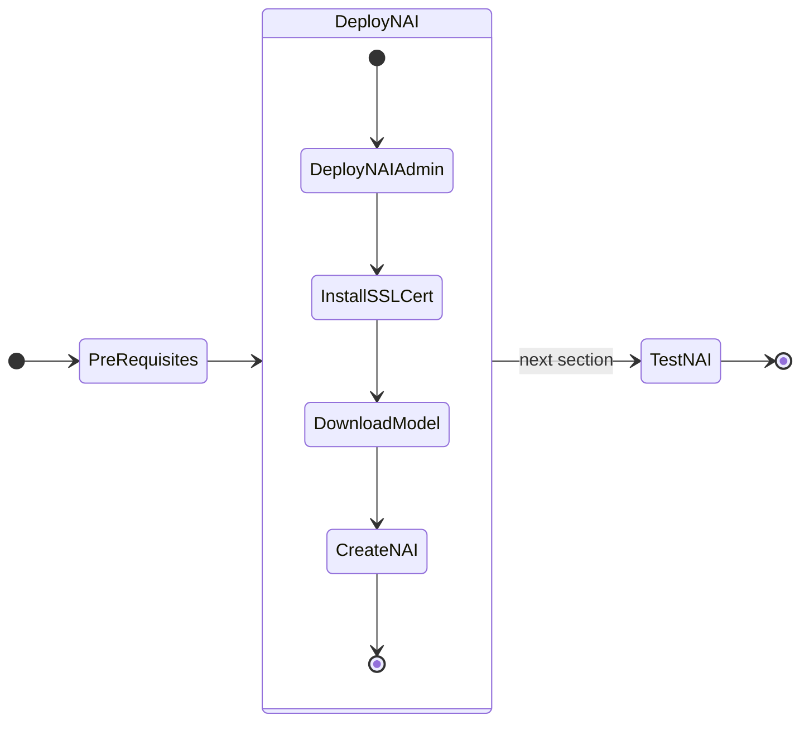

# Deploying Nutanix Enterprise AI (NAI) NVD Reference Application

!!! info "Version 2.8.0"

    This version of the NAI deployment is based on the Nutanix Enterprise AI (NAI) ``v2.8.0`` release.


```mermaid
stateDiagram-v2
    direction LR
    
    state DeployNAI {
        [*] --> DeployNAIAdmin
        DeployNAIAdmin -->  InstallSSLCert
        InstallSSLCert --> DownloadModel
        DownloadModel --> CreateNAI
        CreateNAI --> [*]
    }

    [*] --> PreRequisites
    PreRequisites --> DeployNAI 
    DeployNAI --> TestNAI : next section
    TestNAI --> [*]
```

## Prepare for NAI Deployment


!!! example "GA Software with NAI v2.8.0"
    
    In this lab, we will deploy GA version of the following software to test the following:

    -  Nutanix Enterprise AI 
  
        * **Unified Endpoints** - multiple endpoints for HA and token-based rate limiting
        * **Providers** - Add remote endpoints from providers to utilize their models in Nutanix Enterprise AI workloads.

!!! info

    Changes in NAI ``v2.8.0``

    - Kserve is of at least of ``v0.19.0``
    - Cert-manager is at least of ``v1.17.2``
    - OpenTelemetry operator is at least of ``v0.114.1``
    - Envoy Gateway is at least of ``v1.8.1``
    - Prometheus Monitoring is at least of ``82.13.6``
    - CloudNativePG Operator is ar least of ``0.28.0`` [Usually pre-installed with NKP]
    - LeaderWorkerSet is at least of ``0.8.0``
  
## Enable Pre-requisite Applications  

!!! warning
    
    Make sure to license NKP cluster with at least NKP Pro License to make use of the NKP Applications catalog to provision NAI (and other applications)
    
### Prometheus

The following pre-requisite applications will be enabled on NKP GUI:

!!! note

    In this lab, we will be using the **Management Cluster Workspace** to deploy our Nutanix Enterprise AI (NAI)

    However, in a customer environment, it is recommended to use a separate workload NKP cluster.

**Search** and **Enable** the following applications: follow this order to install dependencies for NAI application


1. In the NKP GUI, Go to **Clusters**
2. Click on **Management Cluster Workspace**
3. Go to **Applications** to search and enable the following:
   
     * **Prometheus Monitoring** : version ``82.13.6`` or higher with the following ``Values`` configuration 

4. Wait for ``Deployed`` state in the GUI

??? "Cert Manager" 

    Cert Manager is pre-installed on all NKP Clusters. If not installed, use the following method to install:
    
    1. In the NKP GUI, Go to **Clusters**
    2. Click on **Management Cluster Workspace**
    3. Go to **Applications** to search and enable the following:
    
         * **Cert-manager**- ``v1.17.2``
            
    4. Wait for ``Deployed`` state in the GUI
    

### Envoy Gateway
   
1. Open Terminal  in ``VSCode``

2. Run the command to load the environment variables
   
    === ":octicons-command-palette-16: Command"

        ```bash
        source $HOME/nai-airgap/.env
        ```

3. Install Envoy Gateway CRDs ``v1.8.1`` in **AI gateway mode**
   
    === ":octicons-command-palette-16: Command"
    
        ```bash
        helm template eg oci://docker.io/envoyproxy/gateway-crds-helm \
        --version v1.8.1 \
        --set crds.gatewayAPI.enabled=true \
        --set crds.envoyGateway.enabled=true \
        | kubectl apply --server-side --force-conflicts -f -
        ```
    
    === ":octicons-command-palette-16: Command output"
    
        ```bash
        Pulled: docker.io/envoyproxy/gateway-crds-helm:v1.8.1
        Digest: sha256:e94d3fdf5d4cb08e2c8efa8c1da133b9804c2e88a3acb4d0e20adb8755a60174
        customresourcedefinition.apiextensions.k8s.io/backendtlspolicies.gateway.networking.k8s.io serverside-applied
        customresourcedefinition.apiextensions.k8s.io/gatewayclasses.gateway.networking.k8s.io serverside-applied
        customresourcedefinition.apiextensions.k8s.io/gateways.gateway.networking.k8s.io serverside-applied
        customresourcedefinition.apiextensions.k8s.io/grpcroutes.gateway.networking.k8s.io serverside-applied
        customresourcedefinition.apiextensions.k8s.io/httproutes.gateway.networking.k8s.io serverside-applied
        customresourcedefinition.apiextensions.k8s.io/referencegrants.gateway.networking.k8s.io serverside-applied
        customresourcedefinition.apiextensions.k8s.io/tcproutes.gateway.networking.k8s.io serverside-applied
        customresourcedefinition.apiextensions.k8s.io/tlsroutes.gateway.networking.k8s.io serverside-applied
        customresourcedefinition.apiextensions.k8s.io/udproutes.gateway.networking.k8s.io serverside-applied
        customresourcedefinition.apiextensions.k8s.io/xbackendtrafficpolicies.gateway.networking.x-k8s.io serverside-applied
        customresourcedefinition.apiextensions.k8s.io/xlistenersets.gateway.networking.x-k8s.io serverside-applied
        customresourcedefinition.apiextensions.k8s.io/xmeshes.gateway.networking.x-k8s.io serverside-applied
        customresourcedefinition.apiextensions.k8s.io/backends.gateway.envoyproxy.io serverside-applied
        customresourcedefinition.apiextensions.k8s.io/backendtrafficpolicies.gateway.envoyproxy.io serverside-applied
        customresourcedefinition.apiextensions.k8s.io/clienttrafficpolicies.gateway.envoyproxy.io serverside-applied
        customresourcedefinition.apiextensions.k8s.io/envoyextensionpolicies.gateway.envoyproxy.io serverside-applied
        customresourcedefinition.apiextensions.k8s.io/envoypatchpolicies.gateway.envoyproxy.io serverside-applied
        customresourcedefinition.apiextensions.k8s.io/envoyproxies.gateway.envoyproxy.io serverside-applied
        customresourcedefinition.apiextensions.k8s.io/httproutefilters.gateway.envoyproxy.io serverside-applied
        customresourcedefinition.apiextensions.k8s.io/securitypolicies.gateway.envoyproxy.io serverside-applied
        ```

4. Create the AI Gateway mode configuration template file ``eg-config-for-gateway-mode.yaml`` to enable advanced features

    === ":octicons-file-code-16: ``eg-config-for-gateway-mode.yaml``"
    
        ```yaml
        config:
          envoyGateway:
            gateway:
              controllerName: "gateway.envoyproxy.io/gatewayclass-controller"
            logging:
              level:
                default: "info"
            provider:
              kubernetes:
                rateLimitDeployment:
                  container:
                    image: "docker.io/envoyproxy/ratelimit:1e50889b"
                  patch:
                    type: "StrategicMerge"
                    value:
                      spec:
                        template:
                          spec:
                            containers:
                              - imagePullPolicy: "IfNotPresent"
                                name: "envoy-ratelimit"
                                image: "docker.io/envoyproxy/ratelimit:1e50889b"
                                env:
                                  - name: REDIS_TYPE
                                    value: "sentinel"
                                  - name: REDIS_PIPELINE_WINDOW
                                    value: "150us"
              type: "Kubernetes"
            extensionApis:
              enableEnvoyPatchPolicy: true
              enableBackend: true
            extensionManager:
              maxMessageSize: 11Mi
              backendResources:
                - group: inference.networking.k8s.io
                  kind: InferencePool
                  version: v1
              hooks:
                xdsTranslator:
                  translation:
                    listener:
                      includeAll: true
                    route:
                      includeAll: true
                    cluster:
                      includeAll: true
                    secret:
                      includeAll: true
                  post:
                    - "Translation"
                    - "Cluster"
                    - "Route"
              service:
                fqdn:
                  hostname: "ai-gateway-controller.nai-system.svc.cluster.local"
                  port: 1063
            rateLimit:
              backend:
                type: "Redis"
                redis:
                  url: "mymaster,nai-valkey-sentinel.nai-system.svc.cluster.local:26379"
        ```
    
5. Install Envoy Gateway ``v1.8.1``
   
    === ":octicons-command-palette-16: Command"
    
        ```bash
        helm upgrade --install eg oci://docker.io/envoyproxy/gateway-helm --version v1.8.1 \
        -n envoy-gateway-system --create-namespace --skip-crds \
        -f ./eg-config-for-gateway-mode.yaml
        ```

    === ":octicons-command-palette-16: Output"
        
        ```{ .text .no-copy }
        Pulled: docker.io/envoyproxy/gateway-helm:v1.8.1
        Digest: sha256:6dca101fdc0d41c702c1070eb42db119a2768a33388ba28041ae615cbe262aaf
        Release "eg" has been upgraded. Happy Helming!
        NAME: eg
        LAST DEPLOYED: Sat Apr  4 08:34:21 2026
        NAMESPACE: envoy-gateway-system
        STATUS: deployed
        REVISION: 2
        TEST SUITE: None
        NOTES:
        **************************************************************************
        *** PLEASE BE PATIENT: Envoy Gateway may take a few minutes to install ***
        **************************************************************************
        
        Envoy Gateway is an open source project for managing Envoy Proxy as a standalone or Kubernetes-based application gateway.
        
        Thank you for installing Envoy Gateway! 🎉
        
        Your release is named: eg. 🎉
        
        Your release is in namespace: envoy-gateway-system. 🎉
        
        To learn more about the release, try:
        
          $ helm status eg -n envoy-gateway-system
          $ helm get all eg -n envoy-gateway-system
        
        To have a quickstart of Envoy Gateway, please refer to https://gateway.envoyproxy.io/latest/tasks/quickstart.
        
        To get more details, please visit https://gateway.envoyproxy.io and https://github.com/envoyproxy/gateway.
        ``` 

6. Check if Envoy Gateway resources are ready
    
    !!! warning 
        
        The ``envoy-ratelimit-`` pod will temporarily be in ``CrashLoopBackOff`` state and eventually will transition to ``Running`` after redis-standalone pod is fully deployed in the upcoming [Deploy NAI](iep_deploy.md#deploy-nai) section.

        Ignore the ``CrashLoopBackOff`` state for now and move on to the next section. 
   
    === ":octicons-command-palette-16: Command"
    
        ```bash
        kubectl wait --timeout=5m -n envoy-gateway-system deployment/envoy-gateway \
        --for=condition=Available
        ```
        ```bash
        kubectl get po -n envoy-gateway-system
        ```


    === ":octicons-command-palette-16: Output"

        ```{ .text .no-copy }
        $ kubectl wait --timeout=5m -n envoy-gateway-system deployment/envoy-gateway --for=condition=Available
        #
        deployment.apps/envoy-gateway condition met
        ```
        ```{ .text .no-copy }
        $ kubectl get pods -n envoy-gateway-system
        #
        NAME                                                             READY   STATUS    RESTARTS        AGE
        envoy-gateway-5c8b5fd5fb-8msl9                                   1/1     Running   4 (2d15h ago)   2m
        envoy-nai-system-nai-ingress-gateway-ff52ba1f-69d6bd9cf5-zfc6h   2/2     Running   0               2m
        envoy-ratelimit-6b4657bddd-x5p8p                                 1/1     Running   0               2m
        ```

### Kserve

7. Open ``$HOME/.env`` file in ``VSCode``

8. Add (append) the following line and save it


    ```text
    export KSERVE_VERSION=v0.19.0
    ```

8. Load the ``.env`` variables
   
    === ":octicons-command-palette-16: Command"

        ```bash
        source $HOME/.env
        ```

9.  Install ``kserve`` using the following commands

    === ":octicons-command-palette-16: Command"
    
        ```bash
        helm upgrade --install kserve-crd oci://ghcr.io/kserve/charts/kserve-crd \
        --version ${KSERVE_VERSION} -n kserve --create-namespace --wait

        ```
        ```bash
        helm upgrade --install kserve oci://ghcr.io/kserve/charts/kserve \
        --version ${KSERVE_VERSION} --namespace kserve --create-namespace --wait \
        --set kserve.controller.deploymentMode=RawDeployment \
      	--set kserve.controller.gateway.disableIngressCreation=true
        ```

    === ":octicons-command-palette-16: Output"
    
        ```{ .text .no-copy }
        Pulled: ghcr.io/kserve/charts/kserve-crd:v0.19.0
        Digest: sha256:57ad1a5475fd625cb558214ba711752aa77b7d91686a391a5f5320cfa72f3fa8
        Release "kserve-crd" has been upgraded. Happy Helming!
        NAME: kserve-crd
        LAST DEPLOYED: Sun May 30 08:40:05 2026
        NAMESPACE: kserve
        STATUS: deployed
        REVISION: 2
        TEST SUITE: None    
        ```
        ```{ .text .no-copy }
        Pulled: ghcr.io/kserve/charts/kserve:v0.19.0
        Digest: sha256:905abce80e975c53b40fba7a12b0b9a1e24bdf65cceebb88fba4ef62bba01406
        Release "kserve" has been upgraded. Happy Helming!
        NAME: kserve
        LAST DEPLOYED: Sun May 30 08:41:05 2026
        NAMESPACE: kserve
        STATUS: deployed
        REVISION: 2
        TEST SUITE: None
        ```

10. Check if ``kserve`` pods are running
   
    === ":octicons-command-palette-16: Command"
    
        ```bash
        kubens kserve
        kubectl get pods    # (1)!
        ```

        1. Make sure both the containers are running for ``kserve-controller-manager`` pod

    === ":octicons-command-palette-16: Output"
    
        ```{ .text .no-copy }
        NAME                                         READY   STATUS    RESTARTS   AGE
        kserve-controller-manager-69b6dbf9cf-ft55b   2/2     Running   0          2m
        ```

11. Install or upgrade the KServe LLMInferenceService CRD
    
    === ":octicons-command-palette-16: Command"
    
        ```bash
        helm upgrade --install kserve-llmisvc-crd oci://ghcr.io/kserve/charts/kserve-llmisvc-crd \
          --version $KSERVE_VERSION -n kserve --create-namespace --wait
        ```

    === ":octicons-command-palette-16: Command output"
    
        ```{ .text .no-copy }
        Release "kserve-llmisvc-crd" does not exist. Installing it now.
        Pulled: ghcr.io/kserve/charts/kserve-llmisvc-crd:v0.19.0
        Digest: sha256:b6e8d32748ecaa0962f878a0678aa18ab4e8c1984ae0ead6c6aadad257757d8e
        NAME: kserve-llmisvc-crd
        LAST DEPLOYED: Thu Sep  3 01:30:52 2026
        NAMESPACE: kserve
        STATUS: deployed
        REVISION: 1
        DESCRIPTION: Install complete
        TEST SUITE: None
        ```
    
12. Install or upgrade the KServe LLMInferenceService resources
 
    === ":octicons-command-palette-16: Command"
    
        ```bash
        helm upgrade --install kserve-llmisvc-resources oci://ghcr.io/kserve/charts/kserve-llmisvc-resources \
          --version $KSERVE_VERSION -n kserve --create-namespace --wait \
          --set kserve.createSharedResources=false \
          --set kserve.llmisvc.createGIECRDs=false
        ```    
    
    === ":octicons-command-palette-16: Command output"
    
        ```{ .text .no-copy }
        Pulled: ghcr.io/kserve/charts/kserve-llmisvc-resources:v0.19.0
        Digest: sha256:f596635c00d66565113cda46cd09f72c4967094378dfcd7c03e2ac7f74e0565b
        Release "kserve-llmisvc-resources" has been upgraded. Happy Helming!
        NAME: kserve-llmisvc-resources
        LAST DEPLOYED: Thu Sep  3 05:02:34 2026
        NAMESPACE: kserve
        STATUS: deployed
        REVISION: 2
        DESCRIPTION: Upgrade complete
        TEST SUITE: None
        ```

### CloudNativePG

!!! note
    
    NKP will have CloudNativePG pre-installed as a part of regular install. Check in the Applications Catalog of the NKP cluster for its presence. 

    Check for CloudNativePG ``v0.28.0``, if present, skip this section. 

1. Install CloudNativePG Operator
   
    === ":octicons-command-palette-16: Command"
    
        ```bash
        helm install cnpg cloudnative-pg \
          --repo https://cloudnative-pg.github.io/charts \
          --version 0.28.0 -n cnpg-system --create-namespace --wait
        ```

### LeaderWorkerSet

LeaderWorkerSet (LWS) is an open-source, custom Kubernetes API designed to deploy and manage multi-node AI/ML workloads—such as large language model (LLM) distributed inference and training—as a single, cohesive unit. It automatically groups a collection of pods into a specific topology consisting of one leader pod and multiple worker pods, managing their entire lifecycle simultaneously so that if a single pod fails, the entire group restarts together to prevent data inconsistency. Furthermore, LWS simplifies network communication across these nodes by automatically injecting group environment variables and optimizing pod placement within the same network topology to guarantee high-throughput, low-latency data transfers between GPUs.

1. Install LeaderWorkerSet
   
    === ":octicons-command-palette-16: Command"
    
        ```bash
        helm install lws oci://registry.k8s.io/lws/charts/lws \
          --version 0.8.0 -n lws-system --create-namespace --wait
        ```
    
    === ":octicons-command-palette-16: Command output"
    
        ```{ .text .no-copy }
        Pulled: registry.k8s.io/lws/charts/lws:0.8.0
        Digest: sha256:e7996d0b9ca8a1ab2d86458b0435a8d842389b81325dc650792389a2c1ad7f57
        NAME: lws
        LAST DEPLOYED: Thu Sep  3 01:33:55 2026
        NAMESPACE: lws-system
        STATUS: deployed
        REVISION: 1
        DESCRIPTION: Install complete
        TEST SUITE: None
        ```

### OpenTelemetry

1. Install OpenTelemetry Operator:

    === ":octicons-command-palette-16: Command"

        ```bash
        helm upgrade --install opentelemetry-operator opentelemetry-operator \
        --repo https://open-telemetry.github.io/opentelemetry-helm-charts \
        --version=0.102.0 -n opentelemetry \
        --create-namespace --wait
        ```

    === ":octicons-command-palette-16: Output"
    
        ```{ .text .no-copy }
        Release "opentelemetry-operator" has been upgraded. Happy Helming!
        NAME: opentelemetry-operator
        LAST DEPLOYED: Sun May 30 08:42:05 2026
        NAMESPACE: opentelemetry
        STATUS: deployed
        REVISION: 2
        NOTES:
        [WARNING] No resource limits or requests were set. Consider setter resource requests and limits via the `resources` field.
        
        
        opentelemetry-operator has been installed. Check its status by running:
          kubectl --namespace opentelemetry get pods -l "app.kubernetes.io/instance=opentelemetry-operator"
        
        Visit https://github.com/open-telemetry/opentelemetry-operator for instructions on how to create & configure OpenTelemetryCollector and Instrumentation custom resources by using the Operator.
        ```
     
!!! note
    It may take a few minutes for each application to be up and running. Monitor the deployment to make sure that these applications are running before moving on to the next section.

## Deploy NAI

We will use the Docker login credentials we created in the previous section to download the NAI Docker images.

!!! warning "Change the Docker login credentials"

    The following Docker based environment variable values need to be changed from your own Docker environment variables to the credentials downloaded from Nutanix Portal.

    - ``$DOCKER_NAI_USERNAME``
    - ``$DOCKER_NAI_ASSWORD``
    - ``$DOCKER_NAI_EMAIL``

1. Open ``$HOME/.env`` file in ``VSCode``

2. Add (append) the following environment variables and save it

    === ":octicons-file-code-16: Template ``.env``"

        ```bash
        export REGISTRY_SECRET_NAME=_k8s_secret_for_nai
        export DOCKER_SERVER=https://index.docker.io/v1/
        export DOCKER_NAI_USERNAME=_GA_release_docker_username
        export DOCKER_NAI_PASSWORD=_GA_release_docker_password
        export DOCKER_NAI_EMAIL=_GA_release_docker_email
        export NAI_CORE_VERSION=_GA_release_nai_core_version
        export NAI_API_RWX_STORAGECLASS=_nkp_rwx_storage_class
        export NAI_DEFAULT_RWO_STORAGECLASS=_nkp_rwo_storage_class
        export NKP_WORKSPACE_NAMESPACE=_nkp_workspace name # (1)!
        ```

        1. To get the workspace namespace, run the following commmand. Note the **WORKSPACE NAMESPACE** column in the output
           
            === ":octicons-command-palette-16: Command"
            
                ```bash
                kubectl get workspaces
                ```
            
            
            === ":octicons-command-palette-16: Command output"
            
                ```text hl_lines="5"
                $ kubectl get workspaces
                #
                NAME                  DISPLAY NAME                   WORKSPACE NAMESPACE           AGE
                default-workspace     Default Workspace              kommander-default-workspace   3d
                kommander-workspace   Management Cluster Workspace   kommander                     3d
                ```

    === ":octicons-file-code-16: Sample ``.env``"

        ```text
        export REGISTRY_SECRET_NAME=nai-regcred
        export DOCKER_SERVER=https://index.docker.io/v1/
        export DOCKER_NAI_USERNAME=ntnxsvcgpt
        export DOCKER_NAI_PASSWORD=dckr_pat_XXXXXXXXXXXXXXXXXXXXXXXXX
        export DOCKER_NAI_EMAIL=ntnxsvcgpt
        export NAI_CORE_VERSION=2.8.0
        export NAI_API_RWX_STORAGECLASS=nai-nfs-storage
        export NAI_DEFAULT_RWO_STORAGECLASS=nutanix-volume
        export NKP_WORKSPACE_NAMESPACE=kommander
        ```
            

3. Source the environment variables

    === ":octicons-command-palette-16: Command"

        ```bash
        source $HOME/.env
        ```

4. Create the nai-system namespace to install Nutanix Enterprise AI
   
    === ":octicons-command-palette-16: Command"
    
        ```bash
        kubectl create namespace nai-system --dry-run=client -o yaml | kubectl apply -f -
        ```
    
    === ":octicons-command-palette-16: Command output"
    
        ```bash
        kubectl create namespace nai-system --dry-run=client -o yaml | kubectl apply -f -
        #
        namespace/nai-system created     
        ```
   
5. Create docker registry Secrets in both ``nai-system ``and ``envoy-gateway-system`` namespaces.
   
    === ":octicons-command-palette-16: Command"
    
        ```text
        kubectl -n nai-system create secret docker-registry ${REGISTRY_SECRET_NAME} \
        --docker-server=${DOCKER_SERVER} \
        --docker-username=${DOCKER_NAI_USERNAME} \
        --docker-password=${DOCKER_NAI_PASSWORD} \
        --docker-email=${DOCKER_NAI_EMAIL} \
        --dry-run=client -o yaml | kubectl apply -f -
        ```
        ```text
        kubectl -n envoy-gateway-system create secret docker-registry ${REGISTRY_SECRET_NAME} \
         --docker-server=${DOCKER_SERVER} \
         --docker-username=${DOCKER_NAI_USERNAME} \
         --docker-password=${DOCKER_NAI_PASSWORD} \
         --docker-email=${DOCKER_NAI_EMAIL} \
         --dry-run=client -o yaml | kubectl apply -f -
        ```

    === ":octicons-command-palette-16: Command output"
    
        ```{ .text, .no-copy}
        secret/nai-regcred configured
        ```
        ```{ .text, .no-copy}
        secret/nai-regcred configured
        ```
   

8. Add NAI helm charts
    
    === ":octicons-command-palette-16: Command"

        ```bash
        helm repo add ntnx-charts https://nutanix.github.io/helm-releases
        helm repo update ntnx-charts
        ```

9. Search and confirm if NAI ``v2.8.0`` charts are available
    
    === ":octicons-command-palette-16: Command"
    
        ```bash
        helm search repo ntnx-charts/nai-operators --versions
        helm search repo ntnx-charts/nai-core --versions
        ```

    === ":octicons-command-palette-16: Command output"
    
        ```text hl_lines="4 9"
        $ helm search repo ntnx-charts/nai-core --versions
        #
        NAME                            CHART VERSION   APP VERSION     DESCRIPTION                                       
        ntnx-charts/nai-operators       2.8.0           0.1.0           A Helm chart for CRDs and Operators required by...
        ntnx-charts/nai-operators       2.8.0           0.1.0           A Helm chart for CRDs and Operators required by...
        ntnx-charts/nai-operators       2.6.0           0.1.0           A Helm chart for CRDs and Operators required by...
        ntnx-charts/nai-operators       2.5.0           0.1.0           A Helm chart for CRDs and Operators required by...

        NAME                    CHART VERSION   APP VERSION     DESCRIPTION                         
        ntnx-charts/nai-core    2.8.0           0.1.0           A Helm chart for NAI core components
        ntnx-charts/nai-core    2.8.0           0.1.0           A Helm chart for NAI core components
        ntnx-charts/nai-core    2.6.0           0.1.0           A Helm chart for NAI core components
        ntnx-charts/nai-core    2.5.0           0.1.0           A Helm chart for NAI core components
        ntnx-charts/nai-core    2.4.0           0.1.0           A Helm chart for NAI core components
        ntnx-charts/nai-core    2.3.0           0.1.0           A Helm chart for NAI core components
        ```
    
10. Install NAI operator
    
    ??? "Deploy NAI Profiles"

        NAI ``v2.8.0`` onwards has support for profiles for different capacity of NAI use cases

        | Name     	| Capacity                                                    	|
        |----------	|------------------------------------------------------------	|
        | Default 	| 300 concurrent requests and 100 API Keys       	            |
        | c1k_k200  | 1000 concurrent requests and 200 API Keys                     |
        | c5k_k1k   | 	5000 concurrent requests and 1000 API Keys 	                |
       
        **Extract the profiles from Helm charts:**
 
        === ":octicons-command-palette-16: Command"
        
            ```bash
            helm pull ntnx-charts/nai-operators --version 2.8.0 --untar=true
            helm pull ntnx-charts/nai-core --version 2.8.0 --untar=true
            ```
        
        **The extracted profile will be located in the following path:**
        
        === ":material-link: File Path"
        
            ```bash
            ./nai-operators/profiles/c1k_k200.yaml
            ./nai-operators/profiles/c5k_k1k.yaml
    
            ./nai-core/profiles/c1k_k200.yaml
            ./nai-core/profiles/c5k_k1k.yaml
            ```
        
        **Deploy NAI Operators for c1k_k200 profile**
 
        === ":octicons-command-palette-16: Command"
        
            ```bash hl_lines="5"
            helm upgrade --install nai-operators ntnx-charts/nai-operators --version 2.8.0 \
              -n nai-system --create-namespace --wait --timeout 15m \
              --set "global.storage.storageClassName=${NAI_DEFAULT_RWO_STORAGECLASS}" \
              --set "global.imagePullSecrets[0].name=${REGISTRY_SECRET_NAME}" \
              -f ./nai-operators/profiles/c1k_k200.yaml
            ```
   
    === ":octicons-command-palette-16: Command"

        ```text
        helm upgrade --install nai-operators ntnx-charts/nai-operators \
          --version 2.8.0  -n nai-system --create-namespace --take-ownership --wait \
          --set "global.imagePullSecrets[0].name=${REGISTRY_SECRET_NAME}" 
        ```

    === ":octicons-command-palette-16: Command output"

        ```{ .text, .no-copy}
        Release "nai-operators" has been upgraded. Happy Helming!
        NAME: nai-operators
        LAST DEPLOYED: Thu Sep  3 05:16:59 2026
        NAMESPACE: nai-system
        STATUS: deployed
        REVISION: 2
        DESCRIPTION: Upgrade complete
        TEST SUITE: None
        ```

11. Check if all NAI operator pods are running
   
    === ":octicons-command-palette-16: Command"

        ```bash
        kubens nai-system
        kubectl get pods
        ```
    
    === ":octicons-command-palette-16: Command output"

        ```{ .text, .no-copy}
        ai-gateway-controller-6b786974b5-sqvft                  1/1     Running       0          3m5s
        nai-operators-nai-clickhouse-operator-f8f666db9-xzjj8   2/2     Running       0          3m5s
        redis-standalone-684f6dd8f7-hlwpl                       2/2     Running       0          3m5s
        ```

12. Install NAI core in AI gateway mode
    
    !!! info

        This installation takes about 5-10 minutes depending on the available resources

    ??? "Deploy NAI Profiles"

        NAI ``v2.8.0`` onwards has support for profiles for different capacity of NAI use cases

        | Name     	| Capacity                                                    	|
        |----------	|------------------------------------------------------------	|
        | Default 	| 300 concurrent requests and 100 API Keys       	            |
        | c1k_k200  | 1000 concurrent requests and 200 API Keys                     |
        | c5k_k1k   | 	5000 concurrent requests and 1000 API Keys 	                |
       
        **Extract the profiles from Helm charts:**
 
        === ":octicons-command-palette-16: Command"
        
            ```bash
            helm pull ntnx-charts/nai-operators --version 2.8.0 --untar=true
            helm pull ntnx-charts/nai-core --version 2.8.0 --untar=true
            ```
        
        **The extracted profile will be located in the following path:**
        
        === ":material-link: File Path"
        
            ```bash
            ./nai-operators/profiles/c1k_k200.yaml
            ./nai-operators/profiles/c5k_k1k.yaml
    
            ./nai-core/profiles/c1k_k200.yaml
            ./nai-core/profiles/c5k_k1k.yaml
            ```
        
        **Deploy NAI Core for c1k_k200 profile**
        
        === ":octicons-command-palette-16: Command"
        
            ```bash hl_lines="6"
            helm upgrade --install nai-core ntnx-charts/nai-core --version=2.8.0 \
              -n nai-system --create-namespace --wait --timeout 15m \
              --set "global.imagePullSecrets[0].name=${REGISTRY_SECRET_NAME}" \
              --set "global.storage.storageClassNameRWX=${NAI_API_RWX_STORAGECLASS}" \
              --set "global.storage.storageClassName=${NAI_DEFAULT_RWO_STORAGECLASS}" \
              -f ./nai-core/profiles/c1k_k200.yaml
            ```
    
    === ":octicons-command-palette-16: Command"
    
        ```text
        helm upgrade --install nai-core ntnx-charts/nai-core \
          --version 2.8.0 -n nai-system --create-namespace \
          --force-conflicts --wait \
          --set "global.imagePullSecrets[0].name=${REGISTRY_SECRET_NAME}" \
          --set "global.storage.storageClassNameRWX=${NAI_API_RWX_STORAGECLASS}" \
          --set "global.storage.storageClassName=${NAI_DEFAULT_RWO_STORAGECLASS}" \
          --set "naiMonitoring.nodeExporter.serviceMonitor.namespaceSelector.matchNames[0]=${NKP_WORKSPACE_NAMESPACE}" \
          --set "naiMonitoring.dcgmExporter.serviceMonitor.namespaceSelector.matchNames[0]=${NKP_WORKSPACE_NAMESPACE}" 
        ```

    === ":octicons-command-palette-16: Sample command"
    
        ```text
        helm upgrade --install nai-core ntnx-charts/nai-core \
          --version 2.8.0 -n nai-system --create-namespace \
          --force-conflicts --wait \
          --set "global.imagePullSecrets[0].name=nai-regcred" \
          --set "global.storage.storageClassNameRWX=nai-nfs-storage" \
          --set "global.storage.storageClassName=nutanix-volume" \
          --set "naiMonitoring.nodeExporter.serviceMonitor.namespaceSelector.matchNames[0]=kommander" \
          --set "naiMonitoring.dcgmExporter.serviceMonitor.namespaceSelector.matchNames[0]=kommander" 
        ```

    === ":octicons-command-palette-16: Command output"

        ```{ .text, .no-copy}
        NAME: nai-core
        LAST DEPLOYED: Thu Sep  3 05:16:59 2026
        NAMESPACE: nai-system
        STATUS: deployed
        REVISION: 1
        TEST SUITE: None
        ```

13. Verify that the NAI Core Pods are running and healthy - there should be more jobs completing and pods coming up to establish NAI functionality
    
    === ":octicons-command-palette-16: Command"

        ```bash
        kubens nai-system
        kubectl get po,deploy
        ```
    === ":octicons-command-palette-16: Command output"

        ```{ .text .no-copy }
        Active namespace is "nai-system".

        NAME                                                    READY   STATUS      RESTARTS   AGE
        ai-gateway-controller-6fff98cbd6-lv8dd                   1/1     Running     0          67m
        chi-nai-clickhouse-server-chcluster1-0-0-0               1/1     Running     0          64m
        chk-nai-clickhouse-keeper-chkeeper-0-0-0                 1/1     Running     0          63m
        iam-database-bootstrap-pdzxh-7j9m7                       0/1     Completed   0          64m
        iam-proxy-5bd954bb85-qmdwx                               1/1     Running     0          64m
        iam-proxy-control-plane-5ff697cdfb-5pnlz                 1/1     Running     0          64m
        iam-themis-849478f448-7c6bx                              2/2     Running     0          60m
        iam-themis-bootstrap-e5pyk-pl96p                         0/1     Completed   0          64m
        iam-ui-7476458cb-q8rns                                   1/1     Running     0          64m
        iam-user-authn-57d8b4dd67-nsdt5                          2/2     Running     0          60m
        nai-agent-5d7b86946d-8b8jn                               1/1     Running     0          64m
        nai-api-86d58c7b6f-5fg4h                                 1/1     Running     0          64m
        nai-api-db-migrate-vk5y2-2dfr8                           0/1     Completed   5          64m
        nai-clickhouse-schema-job-1788408841-hvwl8               0/1     Completed   0          64m
        nai-db-iep-1                                             1/1     Running     0          66m
        nai-oauth2-proxy-595d65db9c-lt6bs                        1/1     Running     0          64m
        nai-operators-nai-clickhouse-operator-687479c97b-m9hn7   2/2     Running     0          67m
        nai-otel-collector-collector-2b5xm                       1/1     Running     0          64m
        nai-otel-collector-collector-5xj4k                       1/1     Running     0          64m
        nai-otel-collector-collector-7jdln                       1/1     Running     0          64m
        nai-otel-collector-collector-7tlz8                       1/1     Running     0          64m
        nai-otel-collector-collector-b6vpl                       1/1     Running     0          64m
        nai-otel-collector-collector-k52pv                       1/1     Running     0          64m
        nai-otel-collector-collector-qnk9d                       1/1     Running     0          64m
        nai-otel-collector-collector-w4zlf                       1/1     Running     0          64m
        nai-otel-collector-targetallocator-7fcccfc477-ndgkr      1/1     Running     0          64m
        nai-securityscan-manager-77679b5554-94p4z                1/1     Running     0          64m
        nai-ui-7b5b9b88b4-c9wzz                                  1/1     Running     0          64m
        nai-valkey-0                                             1/1     Running     0          67m
        nai-valkey-sentinel-0                                    1/1     Running     0          67m
        ```

## Install SSL Certificate and Gateway Elements

In this section we will install SSL Certificate to access the NAI UI. This is required as the endpoint will only work with a ssl endpoint with a valid certificate.

NAI UI is accessible using the Envoy Ingress Gateway.

??? tip "Optional and manual - using Public Certificate Authority (CA)"
    
    If an organization generates certificates using a different mechanism then obtain the certificate **+ key** and create a kubernetes secret manually using the following command:
    
    1. Create the certificate from the files (generated using certbot or provided to you)
  
        ```bash
        kubectl -n nai-system create secret tls nai-cert \
        --cert=path/to/nai.crt \
        --key=path/to/nai.key
        ```
    
    2. Combine the certificates to get the certificate bundle
       
        ```bash
        cat server.crt intermediate.crt > tls-bundle.crt
        ```
    
    3. Create a kubernetes secret in the nai-system namespace to use during NAI install
  
        ```bash
          kubectl secret tls nai-cert \
          --cert=tls-bundle.crt \
          --key=server.key \
          -n nai-system
        ```
    
    6. Patch the Envoy gateway with the ``nai-cert`` certificate details
       
        ```bash
        kubectl patch gateway nai-ingress-gateway -n nai-system --type='json' -p='[{"op": "replace", "path": "/spec/listeners/1/tls/certificateRefs/0/name", "value": "nai-cert"}]'
        ```

??? tip "Optional to automate - using Public Certificate Authority (CA) and Cert Manager"  

    Using **Cert Manager** to manage the Public Certificate Authority (CA) for NAI SSL Certificate is also a possiblity.

    At a high level (Cloudflare Example):

    1. Get a API key from DNS provider woth Edit Zone rights
    2. Create a Kubernetes ``Secret`` from the API key
       
        === "Cloudflare Example" 
        
            ```yaml hl_lines="8"
            apiVersion: v1
            kind: Secret
            metadata:
              name: cloudflare-api-token-secret
              namespace: harbor
            type: Opaque
            stringData:
              api-token: _YOUR_CLOUDFLARE_API_TOKEN_HERE
            ```
        
        === "AWS Route 53 Example"
        
            ```yaml hl_lines="8 9"
            apiVersion: v1
            kind: Secret
            metadata:
              creationTimestamp: null
              name: route53-api-token-secret
              namespace: cert-manager
            data:
              access-key-id: "_YOUR_AWS_ACCESS_KEY_ID"
              secret-access-key: "_YOUR_AWS_SECRET_KEY_ID"
            ```

    3. Create a ``ClusterIssuer`` with Cert Mangager/Let's Encrypt - Configure cert-manager to use DNS-01 challenge with Cloudflare for automatic certificate issuance.
        
        === "Cloudflare Example"

            ```yaml hl_lines="8"
            apiVersion: cert-manager.io/v1
            kind: ClusterIssuer
            metadata:
              name: letsencrypt-cloudflare
              namespace: cert-manager
            spec:
              acme:
                email: _YOUR_DOMAIN_OWNER_EMAIL_ADDRESS
                server: https://acme-v02.api.letsencrypt.org/directory
                privateKeySecretRef:
                  name: letsencrypt-cloudflare-account-key
                solvers:
                - dns01:
                    cloudflare:
                      apiTokenSecretRef:
                        name: cloudflare-api-token-secret
                        key: api-token
            ```

        === "AWS Route 53 Example"
            
            ```yaml hl_lines="7"
            apiVersion: cert-manager.io/v1
            kind: ClusterIssuer
            metadata:
              name: letsencrypt-cloudflare
            spec:
              acme:
                email: _YOUR_DOMAIN_OWNER_EMAIL_ADDRESS
                server: https://acme-v02.api.letsencrypt.org/directory
                privateKeySecretRef:
                  name: nai-letsencrypt-cluster
                solvers:
                  - dns01:
                      route53:
                        region: us-east-1
                        accessKeyIDSecretRef:
                          name: route53-api-token-secret
                          key: access-key-id
                        secretAccessKeySecretRef:
                          name: route53-api-token-secret
                          key: secret-access-key
                        hostedZoneID: _HOSTED_ZONE_ID
            ```

    4. Create the ingress resource certificate using the following command:
    
        ```bash hl_lines="12 14 16"
        cat << EOF | k apply -f -
        apiVersion: cert-manager.io/v1
        kind: Certificate
        metadata:
          name: nai-cert
          namespace: nai-system
        spec:
          issuerRef:
            name: letsencrypt-cloudflare
            kind: ClusterIssuer
          secretName: nai-cert
          commonName: nai.domain.com
          dnsNames:
          - nai.domain.com
        EOF
        ```
    
    5. Patch the Envoy gateway with the ``nai-cert`` certificate details
       
        ```bash
        kubectl patch gateway nai-ingress-gateway -n nai-system --type='json' -p='[{"op": "replace", "path": "/spec/listeners/1/tls/certificateRefs/0/name", "value": "nai-cert"}]'
        ```

The following steps show how cert-manager can be used to generate a **self signed certificate** using the default **selfsigned-issuer** present in the cluster for the purposes of the lab.

1. Get the NAI UI ingress gateway host using the following command:

    ```bash
    NAI_UI_ENDPOINT=$(kubectl get svc -n envoy-gateway-system -l "gateway.envoyproxy.io/owning-gateway-name=nai-ingress-gateway,gateway.envoyproxy.io/owning-gateway-namespace=nai-system" -o jsonpath='{.items[0].status.loadBalancer.ingress[0].ip}')
    ```

2. Get the value of ``NAI_UI_ENDPOINT`` environment variable

    === "Command"
  
        ```bash
        echo $NAI_UI_ENDPOINT
        ```
               
    === "Command output"
      
        ```{ .text .no-copy }
        10.x.x.216
        ```

3. We will use the command output e.g: ``10.x.x.216`` as the IP address for NAI as reserved in this [section](../infra/infra_nkp.md#reserve-control-plane-and-metallb-endpoint-ips)

4. Construct the FQDN of NAI UI using [nip.io](https://nip.io/) and we will use this FQDN as the certificate's Common Name (CN).

    === "Template URL"
    
       ```bash
       nai.${NAI_UI_ENDPOINT}.nip.io
       ```
    
    === "Sample URL"
    
       ``` { .text .no-copy }
       nai.10.x.x.216.nip.io
       ```

5. Create the ingress resource certificate using the following command:

    ```bash hl_lines="12 14 16"
    cat << EOF | k apply -f -
    apiVersion: cert-manager.io/v1
    kind: Certificate
    metadata:
      name: nai-cert
      namespace: nai-system
    spec:
      issuerRef:
        name: selfsigned-issuer
        kind: ClusterIssuer
      secretName: nai-cert
      commonName: nai.${NAI_UI_ENDPOINT}.nip.io
      dnsNames:
      - nai.${NAI_UI_ENDPOINT}.nip.io
      ipAddresses:
      - ${NAI_UI_ENDPOINT}
    EOF
    ```

6. Patch the Envoy gateway with the ``nai-cert`` certificate details
   
    ```bash
    kubectl patch gateway nai-ingress-gateway -n nai-system --type='json' -p='[{"op": "replace", "path": "/spec/listeners/1/tls/certificateRefs/0/name", "value": "nai-cert"}]'
    ```

7. Create EnvoyProxy
   
    ```bash
    k apply -f -<<EOF
    apiVersion: gateway.envoyproxy.io/v1alpha1
    kind: EnvoyProxy
    metadata:
      name: envoy-service-config
      namespace: nai-system
    spec:
      provider:
        type: Kubernetes
        kubernetes:
          envoyService:
            type: LoadBalancer
    EOF
    ```

8. Patch the ``nai-ingress-gateway`` resource with the new ``EnvoyProxy`` details

    ```bash
    kubectl patch gateway nai-ingress-gateway -n nai-system --type=merge \
    -p '{
        "spec": {
            "infrastructure": {
                "parametersRef": {
                    "group": "gateway.envoyproxy.io",
                    "kind": "EnvoyProxy",
                    "name": "envoy-service-config"
                }
            }
        }
    }'
    ```

## Accessing the UI

1. In a browser, open the following URL to connect to the NAI UI
   
    ```url
    https://nai.10.x.x.216.nip.io
    ```

2. Change the password for the `admin` user
3. Login using `admin` user and password.
   
    

## Download Model

We will download and user llama3 8B model which we sized for in the previous section.

1. In the NAI GUI, go to **Models**
2. Click on Import Model from Hugging Face
3. Choose the ``meta-llama/Meta-Llama-3.1-8B-Instruct`` model
4. Input your Hugging Face token that was created in the previous [section](../iep/iep_pre_reqs.md#create-a-hugging-face-token-with-read-permissions) and click **Import**

5. Provide the Model Instance Name as ``Meta-Llama-3.1-8B-Instruct`` and click **Import**
5. Go to VSC Terminal to monitor the download
    
    === ":octicons-command-palette-16: Command"

        ```bash title="Get jobs in nai-admin namespace"
        kubens nai-admin
        
        kubectl get jobs
        ```
        ```bash title="Validate creation of pods and PVC"
        kubectl get po,pvc
        ```
        ```bash title="Verify download of model using pod logs"
        kubectl logs -f _pod_associated_with_job
        ```

    === ":octicons-command-palette-16: Command output"

        ```text title="Get jobs in nai-admin namespace"
        kubens nai-admin

        ✔ Active namespace is "nai-admin"
     
        kubectl get jobs

        NAME                                       COMPLETIONS   DURATION   AGE
        nai-c0d6ca61-1629-43d2-b57a-9f-model-job   0/1           4m56s      4m56
        ```
        ```text title="Validate creation of pods and PVC"
        kubectl get po,pvc

        NAME                                             READY   STATUS    RESTARTS   AGE
        nai-c0d6ca61-1629-43d2-b57a-9f-model-job-9nmff   1/1     Running   0          4m49s

        NAME                                       STATUS   VOLUME                                     CAPACITY   ACCESS MODES   STORAGECLASS      VOLUMEATTRIBUTESCLASS   AGE
        nai-c0d6ca61-1629-43d2-b57a-9f-pvc-claim   Bound    pvc-a63d27a4-2541-4293-b680-514b8b890fe0   28Gi       RWX            nai-nfs-storage   <unset>                 2d
        ```
        ```text title="Verify download of model using pod logs"
        kubectl logs -f nai-c0d6ca61-1629-43d2-b57a-9f-model-job-9nmff 

        /venv/lib/python3.9/site-packages/huggingface_hub/file_download.py:983: UserWarning: Not enough free disk space to download the file. The expected file size is: 0.05 MB. The target location /data/model-files only has 0.00 MB free disk space.
        warnings.warn(
        tokenizer_config.json: 100%|██████████| 51.0k/51.0k [00:00<00:00, 3.26MB/s]
        tokenizer.json: 100%|██████████| 9.09M/9.09M [00:00<00:00, 35.0MB/s]<00:30, 150MB/s]
        model-00004-of-00004.safetensors: 100%|██████████| 1.17G/1.17G [00:12<00:00, 94.1MB/s]
        model-00001-of-00004.safetensors: 100%|██████████| 4.98G/4.98G [04:23<00:00, 18.9MB/s]
        model-00003-of-00004.safetensors: 100%|██████████| 4.92G/4.92G [04:33<00:00, 18.0MB/s]
        model-00002-of-00004.safetensors: 100%|██████████| 5.00G/5.00G [04:47<00:00, 17.4MB/s]
        Fetching 16 files: 100%|██████████| 16/16 [05:42<00:00, 21.43s/it]:33<00:52, 9.33MB/s]
        ## Successfully downloaded model_files|██████████| 5.00G/5.00G [04:47<00:00, 110MB/s] 

        Deleting directory : /data/hf_cache
        ```

6. Optional - verify the events in the namespace for the pvc creation 
    
    === ":octicons-command-palette-16: Command"

        ```bash
        k get events | awk '{print $1, $3}'
        ```

    === ":octicons-command-palette-16: Command output"

        ```{ .text, .no-copy}
        $ k get events | awk '{print $1, $3}'
    
        3m43s Scheduled
        3m43s SuccessfulAttachVolume
        3m36s Pulling
        3m29s Pulled
        3m29s Created
        3m29s Started
        3m43s SuccessfulCreate
        90s   Completed
        3m53s Provisioning
        3m53s ExternalProvisioning
        3m45s ProvisioningSucceeded
        3m53s PvcCreateSuccessful
        3m48s PvcNotBound
        3m43s ModelProcessorJobActive
        90s   ModelProcessorJobComplete
        ```

The model is downloaded to the Nutanix Files ``pvc`` volume.

After a successful model import, you will see it in **Active** status in the NAI UI under **Models** menu


## Create and Test Inference Endpoint

In this section we will create an inference endpoint using the downloaded model.

1. Navigate to **Inference Endpoints** menu and click on **Create Endpoint** button
2. Fill the following details based on GPU or CPU availability:
    
    !!! info
       
        NAI from ``v2.3`` can host a model up to 7 billion parameters on CPU only Nutanix nodes
   
    === "GPU Access"

        - **Endpoint Name**: ``llama-8b``
        - **Model Instance Name**: ``Meta-LLaMA-8B-Instruct``
        - **Use GPUs for running the models** : ``Checked``
        - **No of GPUs (per instance)**:
        - **GPU Card**: ``NVIDIA-L40S`` (or other available GPU)
        - **No of Instances**: ``1``
        - **API Keys**: Create a new API key or use an existing one
    
    === "CPU Access"

        - **Endpoint Name**: ``llama-8b``
        - **Model Instance Name**: ``Meta-LLaMA-8B-Instruct``
        - **Use GPUs for running the models** : ``leave unchecked``
        - **No of Instances**: ``1``
        - **API Keys**: Create a new API key or use an existing one


3. Click on **Create**
4. Monitor the ``nai-admin`` namespace to check if the services are coming up
   
    === ":octicons-command-palette-16: Command"

        ```bash
        kubens nai-admin
        kubectl get po,deploy
        ```

    === ":octicons-command-palette-16: Command output"
        
        ```{ .text .no-copy }
        kubens nai-admin
        get po,deploy
        NAME                                                     READY   STATUS        RESTARTS   AGE
        pod/llama8b-predictor-00001-deployment-9ffd786db-6wkzt   2/2     Running       0          71m

        NAME                                                 READY   UP-TO-DATE   AVAILABLE   AGE
        deployment.apps/llama8b-predictor-00001-deployment   1/1     1            0           3d17h
        ```

5. Check the events in the ``nai-admin`` namespace for resource usage to make sure there are no errors
   
    === ":octicons-command-palette-16: Command"
       
        ```bash
        kubectl get events -n nai-admin --sort-by='.lastTimestamp' | awk '{print $1, $3, $5}'
        ```

    === ":octicons-command-palette-16: Command output"
       
        ```bash
        $ kubectl get events -n nai-admin --sort-by='.lastTimestamp' | awk '{print $1, $3, $5}'

        110s FinalizerUpdate Updated
        110s FinalizerUpdate Updated
        110s RevisionReady Revision
        110s ConfigurationReady Configuration
        110s LatestReadyUpdate LatestReadyRevisionName
        110s Created Created
        110s Created Created
        110s Created Created
        110s InferenceServiceReady InferenceService
        110s Created Created
        ```

6. Once the services are running, check the status of the inference service
   
    === ":octicons-command-palette-16: Command"

        ```bash
        kubectl get isvc
        ```

    === ":octicons-command-palette-16: Command output"
        
        ```{ .text .no-copy }
        kubectl get isvc

        NAME      URL                                          READY   PREV   LATEST   PREVROLLEDOUTREVISION   LATESTREADYREVISION       AGE
        llama8b   http://llama8b.nai-admin.svc.cluster.local   True           100                              llama8b-predictor-00001   3d17h
        ```

