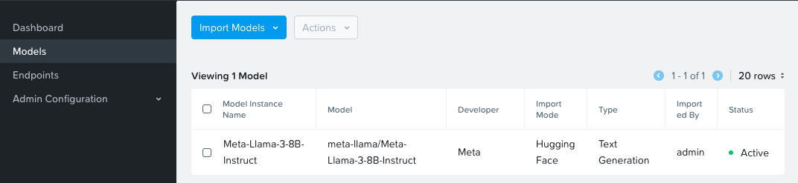

# Deploying GPT-in-a-Box v2 NVD Reference Application


## Deploy NAI

1. Login to VSC on the jumphost VM, go to **Terminal** :octicons-terminal-24: and run the following commands
   
    ```bash
    cd $HOME/nai-llm-fleet-infra/; devbox shell
    cd $HOME
    git clone https://github.com/jesse-gonzalez/sol-cnai-infra
    ```

2. Source the environment variables 

    ```bash
    source $HOME/nkp/.env
    ```

3. Run the following command to deploy NAI
   
    === "Command"

        ```bash
        cd $HOME/nai-llm-fleet-infra/; devbox shell
        source $HOME/nkp/.env
        $HOME/sol-cnai-infra/scripts/nai/nai-deploy.sh 
        ```

    === "Command output"
      
        ```{ .text .no-copy }
        $HOME/sol-cnai-infra/scripts/nai/nai-deploy.sh 

        + set -o pipefail
        + helm repo add ntnx-charts https://nutanix.github.io/helm-releases
        "ntnx-charts" already exists with the same configuration, skipping
        + helm repo update ntnx-charts
        Hang tight while we grab the latest from your chart repositories...
        ...Successfully got an update from the "ntnx-charts" chart repository
        Update Complete. ⎈Happy Helming!⎈
        helm upgrade --install nai-core ntnx-charts/nai-core --version=$NAI_CORE_VERSION -n nai-system --create-namespace --wait \
        --set imagePullSecret.credentials.username=$DOCKER_USERNAME \
        --set imagePullSecret.credentials.email=$DOCKER_EMAIL \
        --set imagePullSecret.credentials.password=$DOCKER_PASSWORD \
        --insecure-skip-tls-verify \
        -f /home/ubuntu/sol-cnai-infra/scripts/nai/iep-values-nkp.yaml
        Release "nai-core" has been upgraded. Happy Helming!
        NAME: nai-core
        LAST DEPLOYED: Mon Sep 16 22:07:24 2024
        NAMESPACE: nai-system
        STATUS: deployed
        REVISION: 7
        TEST SUITE: None
        ```

4. Verify that the NAI Core Pods are running and healthy
    
    === "Command"

        ```bash
        kubectl get pods -n nai-system
        ```
    === "Command output"

        ```bash
        k get po,deploy

        NAME                                            READY   STATUS      RESTARTS   AGE
        pod/nai-api-55c665dd67-746b9                    1/1     Running     0          5d1h
        pod/nai-api-db-migrate-fdz96-xtmxk              0/1     Completed   0          40h
        pod/nai-db-789945b4df-lb4sd                     1/1     Running     0          43h
        pod/nai-iep-model-controller-84ff5b5b87-6jst9   1/1     Running     0          5d8h
        pod/nai-ui-7fc65fc6ff-clcjl                     1/1     Running     0          5d8h
        pod/prometheus-nai-0                            2/2     Running     0          43h

        NAME                                       READY   UP-TO-DATE   AVAILABLE   AGE
        deployment.apps/nai-api                    1/1     1            1           5d8h
        deployment.apps/nai-db                     1/1     1            1           5d8h
        deployment.apps/nai-iep-model-controller   1/1     1            1           5d8h
        deployment.apps/nai-ui                     1/1     1            1           5d8h
        ```

## Install SSL Certificate

In this section we will install SSL Certificate to access the NAI UI. 

1. Create a certificate file using the Istio ingress gateway's IP address that was reserved in this [section](../infra/infra_nkp.md#reserve-control-plane-and-metallb-endpoint-ips). 
   
    Of three IPs ``10.x.x.214``,``10.x.x.215``,`10.x.x.216`, we will use ``10.x.x.216`` as the IP address of the ingress gateway.

2. Construct the FQDN of NAI UI using [nip.io](https://nip.io/)
   
    ```url
    nai.10.x.x.216.nip.io
    ```

3. In VSC Explorer, go to ``/home/ubuntu/`` folder, click on **New File** :material-file-plus-outline:  and create a file with the following name
   
    ```bash
    iep-cert.yaml
    ``` 
   
    Add the following content to the file and replace the IP address with the IP address of ingress gateway.
   
    ```yaml hl_lines="11 13 15"
    apiVersion: cert-manager.io/v1
    kind: Certificate
    metadata:
    name: iep-cert
    namespace: istio-system
    spec:
    issuerRef:
        name: selfsigned-issuer
        kind: ClusterIssuer
    secretName: iep-cert
    commonName: nai.10.x.x.216.nip.io
    dnsNames:
        - nai.10.x.x.216.nip.io
    ipAddresses:
        - 10.x.x.216
    ```

4. Create the certificate using the following command
    
    ```bash
    kubectl apply -f /home/ubuntu/iep-cert.yaml
    ```

5. Patch the ingress gateway's IP address to the certificate file.
    
    === "Command"
   
        ```bash
        kubectl patch gateway -n knative-serving knative-ingress-gateway --type merge --patch-file=/dev/stdin <<EOF
        spec:
          servers:
          - hosts:
            - '*'
            port:
              name: https
              number: 443
              protocol: HTTPS
            tls:
              mode: SIMPLE
              credentialName: iep-cert
        EOF
        ```

    === "Command output"
     
        ```bash
        gateway.networking.istio.io/knative-ingress-gateway patched 
        ```

## Accessing the UI

6. In a browser, open the following URL to connect to the NAI UI
   
    ```url
    https://nai.10.x.x.216.nip.io
    ```

7. Change the password for the `admin` user
8. Login using `admin` user and password.
   
    

## Download Model

We will download and user llama3 8B model which we sized for in the previous section.

1. In the NAI GUI, go to **Models**
2. Click on Import Model from Hugging Face
3. Input your Hugging Face token that was created in the previous [section](../iep/iep_pre_reqs.md#create-a-hugging-face-token-with-read-permissions) and click **Save**

5. Go to VSC Terminal to monitor the download
    
    === "Command"

        ```bash
        kubens nai-system
        ```
        ```bash
        k get jobs
        ```
        ```bash
        k get po
        ```
        ```bash
        k logs -f _pod_associated_with_job
        ```

    === "Command output"

        ```bash
        kubens nai-system

        ✔ Active namespace is "nai-admin"
        ```
        ```bash
        k get jobs

        NAME                                       COMPLETIONS   DURATION   AGE
        nai-c0d6ca61-1629-43d2-b57a-9f-model-job   0/1           4m56s      4m56
        ```
        ```bash
        k get po

        NAME                                             READY   STATUS    RESTARTS   AGE
        nai-c0d6ca61-1629-43d2-b57a-9f-model-job-9nmff   1/1     Running   0          4m49s
        ```
        ```bash
        k logs -f nai-c0d6ca61-1629-43d2-b57a-9f-model-job-9nmff 

        /venv/lib/python3.9/site-packages/huggingface_hub/file_download.py:983: UserWarning: Not enough free disk space to download the file. The expected file size is: 0.05 MB. The target location /data/model-files only has 0.00 MB free disk space.
        warnings.warn(
        tokenizer_config.json: 100%|██████████| 51.0k/51.0k [00:00<00:00, 3.26MB/s]
        tokenizer.json: 100%|██████████| 9.09M/9.09M [00:00<00:00, 35.0MB/s]<00:30, 150MB/s]
        model-00004-of-00004.safetensors: 100%|██████████| 1.17G/1.17G [00:12<00:00, 94.1MB/s]
        model-00001-of-00004.safetensors: 100%|██████████| 4.98G/4.98G [04:23<00:00, 18.9MB/s]
        model-00003-of-00004.safetensors: 100%|██████████| 4.92G/4.92G [04:33<00:00, 18.0MB/s]
        model-00002-of-00004.safetensors: 100%|██████████| 5.00G/5.00G [04:47<00:00, 17.4MB/s]
        Fetching 16 files: 100%|██████████| 16/16 [05:42<00:00, 21.43s/it]:33<00:52, 9.33MB/s]
        ## Successfully downloaded model_files|██████████| 5.00G/5.00G [04:47<00:00, 110MB/s] 

        Deleting directory : /data/hf_cache
        ```
The model is downloaded to the Nutanix Files ``pvc`` volume.

After a successful model import, you will see it in **Active** status in the NAI UI under **Models** menu



## Create and Test Inference Endpoint

In this section we will create an inference endpoint using the downloaded model.

1. Navigate to **Inference Endpoints** menu and click on **Create Endpoint** button
2. Fill the following details:
   
    - **Endpoint Name**: ``llama-8b``
    - **Model Instance Name**: ``Meta-LLaMA-8B-Instruct``
    - **Use GPUs for running the models** : ``Checked``
    - **No of GPUs (per instance)**:
    - **GPU Card**: ``NVIDIA-L40S`` (or other available GPU)
    - **No of Instances**: ``1``
    - **API Keys**: Create a new API key or use an existing one

3. Click on **Create**
4. Monitor the ``nai-admin`` namespace to check if the services are coming up
   
    === "Command"

        ```bash
        kubens
        kubectl get po,deploy
        ```

    === "Command output"
        
        ```bash
        kubens
        get po,deploy
        NAME                                                     READY   STATUS        RESTARTS   AGE
        pod/llama8b-predictor-00001-deployment-9ffd786db-6wkzt   2/2     Running       0          71m

        NAME                                                 READY   UP-TO-DATE   AVAILABLE   AGE
        deployment.apps/llama8b-predictor-00001-deployment   1/1     1            0           3d17h
        ```

5. Once the services are running, check the status of the inference service
   
    === "Command"

        ```bash
        kubectl get isvc
        ```

    === "Command output"
        
        ```bash
        kubectl get isvc

        NAME      URL                                          READY   PREV   LATEST   PREVROLLEDOUTREVISION   LATESTREADYREVISION       AGE
        llama8b   http://llama8b.nai-admin.svc.cluster.local   True           100                              llama8b-predictor-00001   3d17h
        ```

6. In the NAI GUI, under **Endpoints**, click on the **llama8b** and choose test endpoint

7. Provide a sample prompt and check the output
   
    

We have a successful NAI deployment.

## Sample Chat Application

Nutanix also provides a sample chat application that uses NAI to provide chatbot capabilities. We will install and use the chat application in this section. 

1. Run the following command to deploy the chat application.
   
    ```bash
    code /home/ubuntu/sol-cnai-infra/scripts/nai/chat.yaml
    ```

2. Change this line to point to the IP address of your NAI cluster for the ``VirtualService`` resource
   
3. Insert ``chat`` as the subdomain in the ``nai.10.x.x.216.nip.io`` main domain.
   
    Example: complete URL

    ```url
    chat.nai.10.x.x.216.nip.io
    ```
   
    ```yaml hl_lines="9"
    apiVersion: networking.istio.io/v1beta1
    kind: VirtualService
    metadata:
      name: nai-chat
    spec:
      gateways:
      - knative-serving/knative-ingress-gateway
      hosts:
      - chat.nai.10.122.7.216.nip.io
      http:
      - match:
        - uri:
            prefix: /
        route:
        - destination:
            host: nai-chatapp
            port:
            number: 8502
    ```

4. We should be able to see the chat application running on the NAI cluster.
   
    

5. Input the endpoint URL and API key to start chatting with the LLM.

We have successfully deployed the following:
 
 - Inferencing endpoint
 - A sample chat application that uses NAI to provide chatbot capabilities