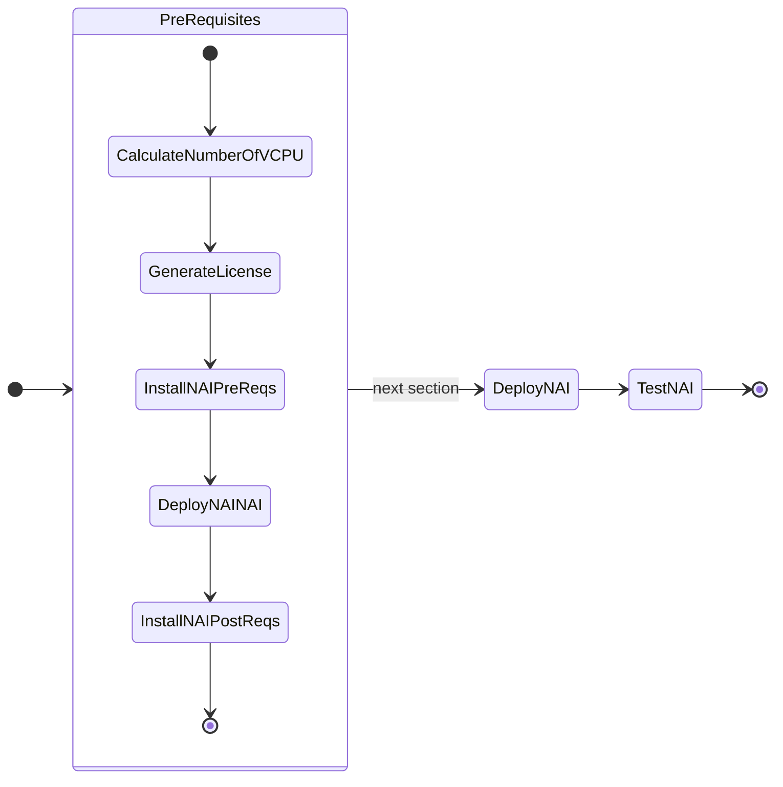

# Pre-requisites for MGMT and DEV Cluster

In this part of the lab we will prepare pre-requisites for LLM application on GPU nodes.

The following is the flow of the applications lab:



Prepare the following pre-requisites for mgmt-cluster and dev-cluster kubernetes clusters.

## Calculate the number of vCPUs

Calculate the number of vCPU for the NKP cluster.

??? Tip "GPU Node Sizing Tips"
    
    Base configurations for GPU nodes are as follows:

    - For each GPU node will have 8 CPU cores, 24 GB of memory, and 300 GB of disk space.
    - For each GPU attached to the node, add 16 GB of memory.
    - For each endpoint attached to the node, add 8 CPU cores.
    - If a model needs multiple GPUs, ensure all GPUs are attached to the same worker node
    - For resiliency, while running multiple instances of the same endpoint, ensure that the GPUs are on different worker nodes.

    | Role   | vCPU | Memory |
    | ------ | ---- | ------ |
    | 1 x Base Kubernetes Worker    |  8   | 24 GB |
    | 1 x GPU    |  -  |  16 GB |
    | 1 x Inference Endpoint    |  8   |- |
    | Total    | 16   | 40 GB |


We will be testing ``LLama-3-8B`` model with the following configurations:

- ``LLama-3-8B`` model is about 27 GB in size (along with the model archive files)
- ``LLama-3-8B`` will be deployed on a single worker GPU worker node
- ``LLama-3-8B`` inference endpoint will be deployed on the same GPU worker node

+---------------+-------------------+---------------+-----------------+-----------+--------------+
| Role          | No. of Nodes (VM) | vCPU per Node | Memory per Node |Total vCPU | Total Memory |
+===============+===================+===============+=================+===========+==============+
| Control plane | 3                 | 4             | 16              | 12        | 48 GB        |
+---------------+-------------------+---------------+-----------------+-----------+--------------+
| Worker        | 4                 | 8             | 32              | 24        | 128 GB       |
+---------------+-------------------+---------------+-----------------+-----------+--------------+
| Base GPU   +  | 1                 | 8             | 24              | 8         | 32 GB        |
|               |                   |               |                 |           |              |
| NAI           |                   | 8             | 16              | 8         | 6 GB         |
+---------------+-------------------+---------------+-----------------+-----------+--------------+
| Totals        |                   |               |                 | 60        | 224 GB       |
+---------------+-------------------+---------------+-----------------+-----------+--------------+

<!-- +---------------+---------------+-----------------+
| First Header  | Second Header | Third Header    |
+===============+===============+=================+
| A cell that   | A cell that spans multiple      |
| spans         | columns.                        |
| multiple rows +---------------+-----------------+
|               | One, two cell | Red & blue cell |
+---------------+---------------+-----------------+ -->

We need to generate a license for the NKP cluster which totals to 60 vCPU.

## Licensing

### Generate License for NKP Cluster

To generate a license for the NKP cluster. 

!!! note
    Follow instructions [here](https://portal.nutanix.com/page/documents/details?targetId=Licensing-v5_0:top-licensing-overview-t.html) to generate a license for the NKP cluster.

    > Nutanix Internal users should logon using Nutanix SSO

    > Nutanix Partners/Customers should logon to Portal using their Nutanix Portal account credentials

1. Login to [Nutanix Portal](https://portal.nutanix.com/page/licensing) using your credentials
2. Go to **Licensing** > **License Summary**
3. Click on the small drop down arrow :material-chevron-down: on Manage Licenses and choose Nutanix Kubernetes Platform (NKP)
4. Input the NKP cluster name
5. Click on the plus icon :material-plus:
6. Click on **Next** in the bottom right corner
7. Select NKP Pro License
8. Select Apply to cluster
9. Choose Non-production license and Save
10. Select the cluster name and click on **Next**
11. Input the number of vCPU (60) from our calculations in the previous [section](#calculate-the-number-of-vcpus)
12. Click on **Save** 
13. Download the csv file and store it in a safe place

### Apply License for NKP Cluster

??? tip "Install License in Commandline"

    === "Command"

        Create license secret

        ```bash
        kubectl create secret generic my-license-secret --from-literal=jwt=MY_LICENSE -n kommander
        kubectl label secret my-license-secret kommanderType=License -n kommander
        ```

        Apply the license secret to the cluster
        
        ```bash
        cat <<EOF | kubectl apply -f -
        apiVersion: kommander.mesosphere.io/v1beta1
        kind: License
        metadata:
        name: my-license
        namespace: kommander
        spec:
        licenseRef:
            name: my-license-secret
        EOF
        ```

    === "Command output"

        ```{ .bash .no-copy }
        License created
        ```

1. Login to the Kommander URL for ``nkpdev`` cluster with the generated credentials that you generated in the previous [section](../infra/infra_nkp.md#install-kommander-management). The following commands will give you the credentials and URL.
   
    === "Command"

        ```bash
        nkp get dashboard
        ```

    === "Command output"

        ```{ .bash .no-copy }
        nkp get dashboard

        Username: recursing_xxxxxxxxx
        Password: YHbPsslIDB7p7rqwnfxxxxxxxxxxxxxxxxxxxxxxxxxxxxxxxxx
        URL: https://10.x.x.215/dkp/kommander/dashboard
        ```

2. Go to **Licensing** and click on **Remove License** to remove the Starter license
3. Type **nutanix-license** in the confirmation box and click on **Remove License**
4. Click on **Add License**, choose Nutanix platform and paste the license key from the previous [section](#generate-license-for-nkp-cluster)
5. Click on **Save**
6. Confirm the license is applied to the cluster by cheking the **License Status** in the **License** menu
7. The license will be applied to the cluster and the license status will reflect NKP Pro in the top right corner of the dashboard   

## Enable GPU Operator

We will need to enable GPU operator for deploying NKP application. 

1. In the NKP GUI, Go to **Clusters**
2. Click on **Kommander Host**
3. Go to **Applications** 
4. Search for **NVIDIA GPU Operator**
5. Click on **Enable**
6. Click on **Configuration** and click on **Workspace Configuration**
7. Inside the yaml editor, paste the following yaml content 
   
    ```yaml
    driver:
      enabled: true
    ```

8. Click on **Enable** on the top right-hand corner to enable GPU driver on the Ubuntu GPU nodes
9. Check GPU operator resources and make sure they are running
    
    === "Command"
    
        ```bash
        kubectl get po -A | grep -i nvidia
        ```

    === "Command output"
   
        ```{ .text, no-copy}
        kubectl get po -A | grep -i nvidia

        nvidia-container-toolkit-daemonset-fjzbt                          1/1     Running     0          28m
        nvidia-cuda-validator-f5dpt                                       0/1     Completed   0          26m
        nvidia-dcgm-exporter-9f77d                                        1/1     Running     0          28m
        nvidia-dcgm-szqnx                                                 1/1     Running     0          28m
        nvidia-device-plugin-daemonset-gzpdq                              1/1     Running     0          28m
        nvidia-driver-daemonset-dzf55                                     1/1     Running     0          28m
        nvidia-operator-validator-w48ms                                   1/1     Running     0          28m
        ```

10. Run a sample GPU workload to confirm GPU operations
    
    === "Command"

        ```bash
        kubectl apply -f - <<EOF
        apiVersion: v1
        kind: Pod
        metadata:
        name: cuda-vector-add
        spec:
        restartPolicy: OnFailure
        containers:
        - name: cuda-vector-add
            image: k8s.gcr.io/cuda-vector-add:v0.1
            resources:
            limits:
                nvidia.com/gpu: 1
        EOF
        ```

    === "Command output"
    
        ```{ .text, no-copy}
        pod/cuda-vector-add created
        ```

11. Follow the logs to check if the GPU operations are successful
    
    === "Command"

        ```bash
        k logs cuda-vector-add
        ```

    === "Command output"
    
        ```{ .text, no-copy}
        k logs cuda-vector-add
        [Vector addition of 50000 elements]
        Copy input data from the host memory to the CUDA device
        CUDA kernel launch with 196 blocks of 256 threads
        Copy output data from the CUDA device to the host memory
        Test PASSED
        Done
        ```

## Install NAI Pre-requisites

In this section we will install the following pre-requisites for the NAI application

1. Login to VSC on the jumphost VM, go to **Terminal** :octicons-terminal-24: and run the following commands
   
2. Intiate devbox shell (if not already done)
   
    ```bash
    cd /home/ubuntu/nai-llm-fleet-infra/; devbox shell
    ```

3. Clone the following github repository
   
    ```bash
    cd /home/ubuntu/
    git clone https://github.com/jesse-gonzalez/sol-cnai-infra.git
    ```

4. Change to ``sol-cnai-infra`` directory and run the following commands to install pre-requisites
   
    === "Command"

        ```bash
        cd /home/ubuntu/sol-cnai-infra
        /home/ubuntu/sol-cnai-infra/scripts/nai/nai-prepare.sh
        ```

    === "Command output"
        
        ```{ .text .no-copy }
        /home/ubuntu/sol-cnai-infra/scripts/nai/nai-prepare.sh

        # output snipped
        
        NAME: istio-base
        LAST DEPLOYED: Fri Sep 13 04:13:19 2024

        NAME: istiod
        LAST DEPLOYED: Fri Sep 13 04:13:20 2024

        NAME: istio-ingressgateway
        LAST DEPLOYED: Fri Sep 13 04:13:22 2024

        NAME: knative-serving-crds
        LAST DEPLOYED: Fri Sep 13 04:13:23 2024

        NAME: knative-istio-controller
        LAST DEPLOYED: Fri Sep 13 04:13:31 2024

        NAME: kserve-crd
        LAST DEPLOYED: Fri Sep 13 04:13:33 2024

        NAME: kserve
        LAST DEPLOYED: Fri Sep 13 04:13:36 2024
        ```
!!! warning "Check services before proceeding"

    Repeat services checks for all resources in ``istio-system`` and ``knative-serving``, namespaces like so

    ```bash
    kubectx istio-system; kubectl get all
    ```
    ```bash
    kubectx knative-serving; kubectl get all
    ```


## Deploy NAI

1. Login to VSC on the jumphost VM, go to **Terminal** :octicons-terminal-24: and run the following commands
   
    === "Command"

        ```bash
        cd /home/ubuntu/nai-llm-fleet-infra/; devbox shell
        /home/ubuntu/sol-cnai-infra/scripts/nai/nai-deploy.sh 
        ```
    === "Command output"
      
        ```{ .text .no-copy }
        /home/ubuntu/sol-cnai-infra/scripts/nai/nai-deploy.sh 

        + set -o pipefail
        + helm repo add ntnx-charts https://nutanix.github.io/helm-releases
        "ntnx-charts" already exists with the same configuration, skipping
        + helm repo update ntnx-charts
        Hang tight while we grab the latest from your chart repositories...
        ...Successfully got an update from the "ntnx-charts" chart repository
        Update Complete. ⎈Happy Helming!⎈
        helm upgrade --install nai-core ntnx-charts/nai-core --version=$NAI_CORE_VERSION -n nai-system --create-namespace --wait \
        --set imagePullSecret.credentials.username=$DOCKER_USERNAME \
        --set imagePullSecret.credentials.email=$DOCKER_EMAIL \
        --set imagePullSecret.credentials.password=$DOCKER_PASSWORD \
        --insecure-skip-tls-verify \
        -f /home/ubuntu/sol-cnai-infra/scripts/nai/iep-values-nkp.yaml
        Release "nai-core" has been upgraded. Happy Helming!
        NAME: nai-core
        LAST DEPLOYED: Mon Sep 16 22:07:24 2024
        NAMESPACE: nai-system
        STATUS: deployed
        REVISION: 7
        TEST SUITE: None
        ```

2. Verify that the NAI Core Pods are running and healthy
    
    === "Command"

        ```bash
        kubectl get pods -n nai-system
        ```
    === "Command output"

        ```bash
        k get po,deploy

        NAME                                            READY   STATUS      RESTARTS   AGE
        pod/nai-api-55c665dd67-746b9                    1/1     Running     0          5d1h
        pod/nai-api-db-migrate-fdz96-xtmxk              0/1     Completed   0          40h
        pod/nai-db-789945b4df-lb4sd                     1/1     Running     0          43h
        pod/nai-iep-model-controller-84ff5b5b87-6jst9   1/1     Running     0          5d8h
        pod/nai-ui-7fc65fc6ff-clcjl                     1/1     Running     0          5d8h
        pod/prometheus-nai-0                            2/2     Running     0          43h

        NAME                                       READY   UP-TO-DATE   AVAILABLE   AGE
        deployment.apps/nai-api                    1/1     1            1           5d8h
        deployment.apps/nai-db                     1/1     1            1           5d8h
        deployment.apps/nai-iep-model-controller   1/1     1            1           5d8h
        deployment.apps/nai-ui                     1/1     1            1           5d8h
        ```