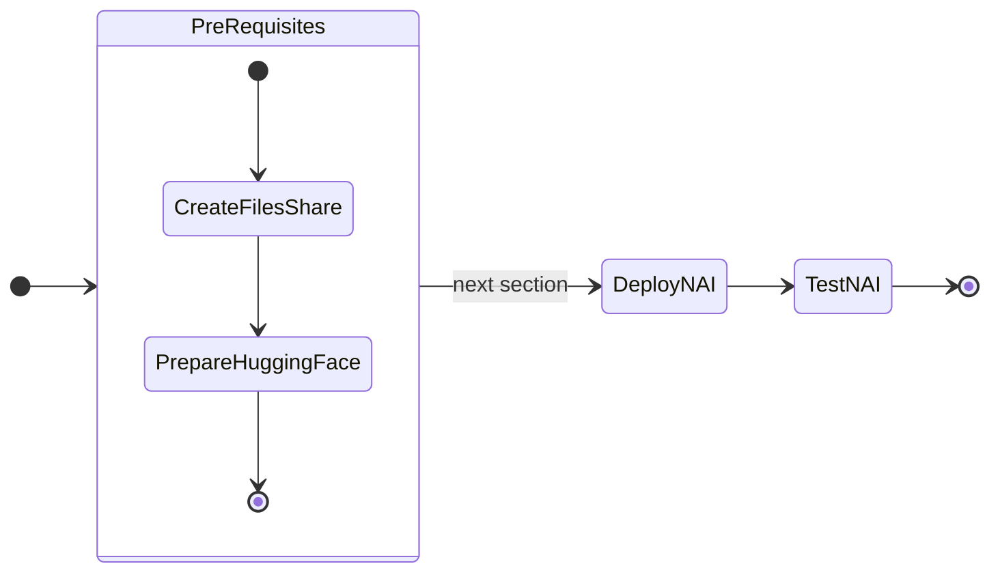

# Pre-requisites for Deploying NAI

In this part of the lab we will prepare pre-requisites for LLM application on GPU nodes.

The following is the flow of the applications lab:



Prepare the following pre-requisites needed to deploy NAI on target kubernetes cluster.

## Create Nutanix Files Storage Class

We will create Nutanix Files storage class which will be used to create a pvc that will store the ``LLama-3-8B`` model files.

1. Run the following command to check K8S status of the ``nkpdev`` cluster
    
    ```bash
    kubectx ${NKP_CLUSTER_NAME}-admin@${NKP_CLUSTER_NAME} 
    kubectl get nodes
    ```

2. Add (append) the following environment variable to  ``$HOME/nkp/.env`` file
   
    === "Template .env"
    
        ```text
        export FILES_CREDENTIAILS_STRING='_prism_element_ip_addres:9440:admin:_your_password'
        ```

    === "Sample .env"

        ```text
        export FILES_CREDENTIAILS_STRING='10.x.x.37:9440:admin:password'
        ```

3. Source the .env file to load the latest $FILES_CREDENTIAILS_STRING environment variable

    ```bash
    source $HOME/.env
    ```

4. Create a secret for Nutanix Files CSI Driver

    ```bash
    kubectl create secret generic nutanix-csi-credentials-files \
    -n ntnx-system --from-literal=key=${FILES_CREDENTIAILS_STRING} \
    --dry-run -o yaml | kubectl apply -f -
    ```

5. In VSC Explorer, click on **New File** :material-file-plus-outline: and create a config file with the following name:

    ```bash
    nai-nfs-storage.yaml
    ```

    Add the following content and replace the `nfsServerName` with the name of the Nutanix Files server name .


    

    === "Template YAML"

        ```yaml hl_lines="9"
        kind: StorageClass
        apiVersion: storage.k8s.io/v1
        metadata:
            name: nai-nfs-storage
        provisioner: csi.nutanix.com
        parameters:
          dynamicProv: ENABLED
          nfsServerName: _your_nutanix_files_server_name
          nfsServer: _your_nutanix_files_server_fqdn
          csi.storage.k8s.io/provisioner-secret-name: nutanix-csi-credentials-files
          csi.storage.k8s.io/provisioner-secret-namespace: ntnx-system
          csi.storage.k8s.io/node-publish-secret-name: nutanix-csi-credentials-files
          csi.storage.k8s.io/node-publish-secret-namespace: ntnx-system
          csi.storage.k8s.io/controller-expand-secret-name: nutanix-csi-credentials-files
          csi.storage.k8s.io/controller-expand-secret-namespace: ntnx-system
          storageType: NutanixFiles
        allowVolumeExpansion: true
        ```

    === "Sample YAML"

        ```yaml hl_lines="9"
        kind: StorageClass
        apiVersion: storage.k8s.io/v1
        metadata:
            name: nai-nfs-storage
        provisioner: csi.nutanix.com
        parameters:
          dynamicProv: ENABLED
          nfsServerName: files
          nfsServer: files.example.com
          csi.storage.k8s.io/provisioner-secret-name: nutanix-csi-credentials-files
          csi.storage.k8s.io/provisioner-secret-namespace: ntnx-system
          csi.storage.k8s.io/node-publish-secret-name: nutanix-csi-credentials-files
          csi.storage.k8s.io/node-publish-secret-namespace: ntnx-system
          csi.storage.k8s.io/controller-expand-secret-name: nutanix-csi-credentials-files
          csi.storage.k8s.io/controller-expand-secret-namespace: ntnx-system
          storageType: NutanixFiles
        allowVolumeExpansion: true
        ```

6. Create the storage class

    ```bash
    kubectl apply -f nai-nfs-storage.yaml
    ```

7. Check storage classes in the cluster for the Nutanix Files storage class

    === "Command"

        ```bash
        kubectl get storageclass
        ```
  
    === "Command output"

        ```bash hl_lines="5"
        kubectl get storageclass

        NAME                       PROVISIONER                     RECLAIMPOLICY   VOLUMEBINDINGMODE      ALLOWVOLUMEEXPANSION   AGE
        dkp-object-store           kommander.ceph.rook.io/bucket   Delete          Immediate              false                  28h
        nai-nfs-storage            csi.nutanix.com                 Delete          Immediate              true                   24h
        nutanix-volume (default)   csi.nutanix.com                 Delete          WaitForFirstConsumer   false                  28h
        ```

## Request Access to Model on Hugging Face

Follow these steps to request access to the `meta-llama/Meta-Llama-3.1-8B-Instruct` model:

1. **Sign in to your Hugging Face account**:  

      - Visit [Hugging Face](https://huggingface.co) and log in to your account.

2. **Navigate to the model page**:  

      - Go to the [Meta-Llama-3.1-8B-Instruct model page](https://huggingface.co/meta-llama/Meta-Llama-3.1-8B-Instruct).

3. **Request access**:

      - On the model page, you will see a section or button labeled **Request Access** (this is usually near the top of the page or near the "Files and versions" section).
      - Click **Request Access**.

4. **Complete the form**:

      - You may be prompted to fill out a form or provide additional details about your intended use of the model.
      - Complete the required fields and submit the request.

5. **Wait for approval**:

      - After submitting your request, you will receive a notification or email once your access is granted.
      - This process can take some time depending on the approval workflow.

Once access is granted, there will be an email notification.

!!! note

    Email from Hugging Face can take a few minutes or hours before it arrives.

## Create a Hugging Face Token with Read Permissions

Follow these steps to create a Hugging Face token with read permissions:

1. **Sign in to your Hugging Face account**:  

    - Visit [Hugging Face](https://huggingface.co) and log in to your account.

2. **Access your account settings**:
    - Click on your profile picture in the top-right corner.
    - From the dropdown, select **Settings**.

3. **Navigate to the "Access Tokens" section**:

    - In the sidebar, click on **Access Tokens**.
    - You will see a page where you can create and manage tokens.

4. **Create a new token**:

    - Click the **New token** button.
    - Enter a name for your token (i.e., `read-only-token`).

5. **Set token permissions**:

    - Under the permissions dropdown, select **Read**. For Example:
        

6. **Create and copy the token**:

    - After selecting the permissions, click **Create**.
    - Your token will be generated and displayed only once, so make sure to copy it and store it securely.

Use this token for accessing Hugging Face resources with read-only permissions.

## Prepare Download Credentials for Release Candidate

Contact your Nutanix team to obtain the credentials required to download the release candidate. The following information will be required:

- ``$DOCKER_USERNAME``
- ``$DOCKER_PASSWORD``
- ``$DOCKER_EMAIL``

Once NAI is Generally available. This procedure will change to possibly use general customer Docker credentials. This is not yet confirmed.

Now we can proceed to deploy NAI.
