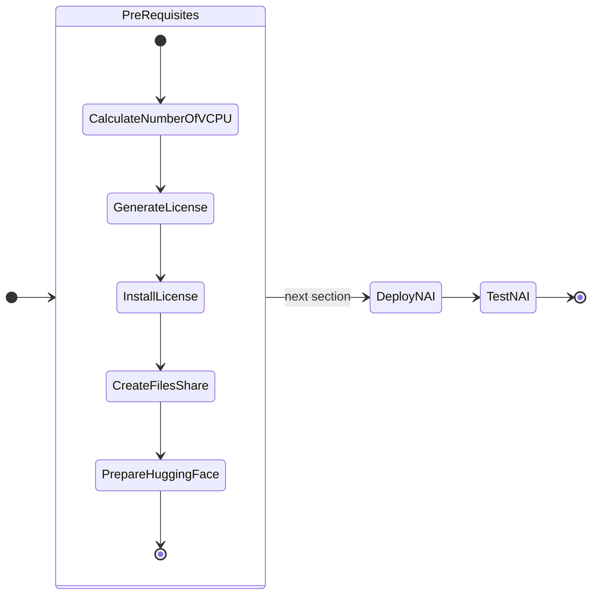

# Pre-requisites for MGMT and DEV Cluster

In this part of the lab we will prepare pre-requisites for LLM application on GPU nodes.

The following is the flow of the applications lab:



Prepare the following pre-requisites for mgmt-cluster and dev-cluster kubernetes clusters.

## Calculate the Required vCPUs

Calculate the number of vCPU for the NKP cluster.

??? Tip "GPU Node Sizing Tips"
    
    Base configurations for GPU nodes are as follows:

    - For each GPU node will have 8 CPU cores, 24 GB of memory, and 300 GB of disk space.
    - For each GPU attached to the node, add 16 GB of memory.
    - For each endpoint attached to the node, add 8 CPU cores.
    - If a model needs multiple GPUs, ensure all GPUs are attached to the same worker node
    - For resiliency, while running multiple instances of the same endpoint, ensure that the GPUs are on different worker nodes.

    | Role   | vCPU | Memory |
    | ------ | ---- | ------ |
    | 1 x Base Kubernetes Worker    |  8   | 24 GB |
    | 1 x GPU    |  -  |  16 GB |
    | 1 x Inference Endpoint    |  8   |- |
    | Total    | 16   | 40 GB |


We will be testing ``LLama-3-8B`` model with the following configurations:

- ``LLama-3-8B`` model is about 10 GB in size (along with the model archive files)
- ``LLama-3-8B`` will be deployed on a single worker GPU worker node
- ``LLama-3-8B`` inference endpoint will be deployed on the same GPU worker node

+---------------+-------------------+---------------+-----------------+-----------+--------------+
| Role          | No. of Nodes (VM) | vCPU per Node | Memory per Node |Total vCPU | Total Memory |
+===============+===================+===============+=================+===========+==============+
| Control plane | 3                 | 4             | 16              | 12        | 48 GB        |
+---------------+-------------------+---------------+-----------------+-----------+--------------+
| Worker        | 4                 | 8             | 32              | 24        | 128 GB       |
+---------------+-------------------+---------------+-----------------+-----------+--------------+
| Base GPU > +  | 1                 | 8             | 24              | 8         | 32 GB        |
|               |                   |               |                 |           |              |
| NAI      >    |                   | 8             | 16              | 8         | 6 GB         |
+---------------+-------------------+---------------+-----------------+-----------+--------------+
| Totals        |                   |               |                 | 60        | 224 GB       |
+---------------+-------------------+---------------+-----------------+-----------+--------------+

<!-- +---------------+---------------+-----------------+
| First Header  | Second Header | Third Header    |
+===============+===============+=================+
| A cell that   | A cell that spans multiple      |
| spans         | columns.                        |
| multiple rows +---------------+-----------------+
|               | One, two cell | Red & blue cell |
+---------------+---------------+-----------------+ -->

We need to generate a license for the NKP cluster which totals to ``60`` vCPU.

## Licensing

### Generate License for NKP Cluster

To generate a license for the NKP cluster. 

!!! note

    Nutanix Internal users should logon using Nutanix SSO

    Nutanix Partners/Customers should logon to Portal using their Nutanix Portal account credentials

1. Login to [Nutanix Portal](https://portal.nutanix.com/page/licensing) using your credentials
2. Go to **Licensing** > **License Summary**
3. Click on the small drop down arrow :material-chevron-down: on Manage Licenses and choose Nutanix Kubernetes Platform (NKP)
4. Input the NKP cluster name
5. Click on the plus icon :material-plus:
6. Click on **Next** in the bottom right corner
7. Select NKP Pro License
8. Select Apply to cluster
9. Choose Non-production license and Save
10. Select the cluster name and click on **Next**
11. Input the number of vCPU (``60``) from our calculations in the previous [section](#calculate-the-required-vcpus)
12. Click on **Save** 
13. Download the csv file and store it in a safe place

### Apply License for NKP Cluster

<!-- ??? tip "Install License in Commandline"

    === "Command"

        Create license secret

        ```bash
        kubectl create secret generic my-license-secret --from-literal=jwt=MY_LICENSE -n kommander
        kubectl label secret my-license-secret kommanderType=License -n kommander
        ```

        Apply the license secret to the cluster
        
        ```bash
        cat <<EOF | kubectl apply -f -
        apiVersion: kommander.mesosphere.io/v1beta1
        kind: License
        metadata:
        name: my-license
        namespace: kommander
        spec:
        licenseRef:
            name: my-license-secret
        EOF
        ```

    === "Command output"

        ```{ .bash .no-copy }
        License created
        ``` -->

1. Login to the Kommander URL for ``nkpdev`` cluster with the generated credentials that was generated in the previous [section](../infra/infra_nkp.md#create-nkp-workload-cluster). The following commands will give you the credentials and URL.
   
    === "Command"

        ```bash
        nkp get dashboard
        ```

    === "Command output"

        ```{ .bash .no-copy }
        nkp get dashboard

        Username: recursing_xxxxxxxxx
        Password: YHbPsslIDB7p7rqwnfxxxxxxxxxxxxxxxxxxxxxxxxxxxxxxxxx
        URL: https://10.x.x.215/dkp/kommander/dashboard
        ```

2. Go to **Licensing** and click on **Remove License** to remove the Starter license
3. Type **nutanix-license** in the confirmation box and click on **Remove License**
4. Click on **Add License**, choose Nutanix platform and paste the license key from the previous [section](#generate-license-for-nkp-cluster)
5. Click on **Save**
6. Confirm the license is applied to the cluster by cheking the **License Status** in the **License** menu
7. The license will be applied to the cluster and the license status will reflect NKP Pro in the top right corner of the dashboard   

## Enable GPU Operator

We will need to enable GPU operator for deploying NKP application. 

1. In the NKP GUI, Go to **Clusters**
2. Click on **Kommander Host**
3. Go to **Applications** 
4. Search for **NVIDIA GPU Operator**
5. Click on **Enable**
6. Click on **Configuration** and click on **Workspace Configuration**
7. Inside the yaml editor, paste the following yaml content 
   
    ```yaml
    driver:
      enabled: true
    ```

8. Click on **Enable** on the top right-hand corner to enable GPU driver on the Ubuntu GPU nodes
9. Check GPU operator resources and make sure they are running
    
    === "Command"
    
        ```bash
        kubectl get po -A | grep -i nvidia
        ```

    === "Command output"
   
        ```{ .text, no-copy}
        kubectl get po -A | grep -i nvidia

        nvidia-container-toolkit-daemonset-fjzbt                          1/1     Running     0          28m
        nvidia-cuda-validator-f5dpt                                       0/1     Completed   0          26m
        nvidia-dcgm-exporter-9f77d                                        1/1     Running     0          28m
        nvidia-dcgm-szqnx                                                 1/1     Running     0          28m
        nvidia-device-plugin-daemonset-gzpdq                              1/1     Running     0          28m
        nvidia-driver-daemonset-dzf55                                     1/1     Running     0          28m
        nvidia-operator-validator-w48ms                                   1/1     Running     0          28m
        ```

10. Run a sample GPU workload to confirm GPU operations
    
    === "Command"

        ```bash
        kubectl apply -f - <<EOF
        apiVersion: v1
        kind: Pod
        metadata:
        name: cuda-vector-add
        spec:
        restartPolicy: OnFailure
        containers:
        - name: cuda-vector-add
            image: k8s.gcr.io/cuda-vector-add:v0.1
            resources:
            limits:
                nvidia.com/gpu: 1
        EOF
        ```

    === "Command output"
    
        ```{ .text, no-copy}
        pod/cuda-vector-add created
        ```

11. Follow the logs to check if the GPU operations are successful
    
    === "Command"

        ```bash
        k logs cuda-vector-add
        ```

    === "Command output"
    
        ```{ .text, no-copy}
        k logs cuda-vector-add
        [Vector addition of 50000 elements]
        Copy input data from the host memory to the CUDA device
        CUDA kernel launch with 196 blocks of 256 threads
        Copy output data from the CUDA device to the host memory
        Test PASSED
        Done
        ```

## Create Nutanix Files Storage Class

We will create Nutanix Files storage class which will be used to create a pvc that will store the ``LLama-3-8B`` model files.

1. Run the following command to check K8S status of the ``nkpdev`` cluster
    
    ```bash
    kubectx ${NKP_CLUSTER_NAME}-admin@${NKP_CLUSTER_NAME} 
    kubectl get nodes
    ```

2. Add (append) the following environment variable to  ``/home/ubuntu/nkp/.env`` file
   
    === "Template .env"
    
        ```text
        export FILES_CREDENTIAILS_STRING='_prism_element_ip_addres:9440:admin:_your_password'
        ```

    === "Sample .env"
    
        ```text
        export FILES_CREDENTIAILS_STRING='10.x.x.37:9440:admin:password'
        ```

3. Source the .env file to load the latest $FILES_CREDENTIAILS_STRING environment variable
   
    ```bash
    source $HOME/nkp/.env
    ```

4. Create a secret for Nutanix Files CSI Driver

    ```bash
    kubectl create secret generic nutanix-csi-credentials-files \
    -n ntnx-system --from-literal=key=${FILES_CREDENTIAILS_STRING} \
    --dry-run -o yaml | kubectl apply -f -
    ```

5. In VSC Explorer, go to ``/home/ubuntu/`` folder click on **New File** :material-file-plus-outline: and create a config file with the following name:

    ```bash
    nai-nfs-storage.yaml
    ```

     Add the following content and replace the IP address with the IP address of ingress gateway.
    
    === "Template YAML"
    
        ```yaml hl_lines="9"
        kind: StorageClass
        apiVersion: storage.k8s.io/v1
        metadata:
            name: nai-nfs-storage
        provisioner: csi.nutanix.com
        parameters:
          dynamicProv: ENABLED
          nfsServerName: files
          nfsServer: _your_nutanix_files_server_fqdn
          csi.storage.k8s.io/provisioner-secret-name: nutanix-csi-credentials-files
          csi.storage.k8s.io/provisioner-secret-namespace: ntnx-system
          csi.storage.k8s.io/node-publish-secret-name: nutanix-csi-credentials-files
          csi.storage.k8s.io/node-publish-secret-namespace: ntnx-system
          csi.storage.k8s.io/controller-expand-secret-name: nutanix-csi-credentials-files
          csi.storage.k8s.io/controller-expand-secret-namespace: ntnx-system
          storageType: NutanixFiles
        allowVolumeExpansion: true
        ```

    === "Sample YAML"
    
        ```yaml hl_lines="9"
        kind: StorageClass
        apiVersion: storage.k8s.io/v1
        metadata:
            name: nai-nfs-storage
        provisioner: csi.nutanix.com
        parameters:
          dynamicProv: ENABLED
          nfsServerName: files
          nfsServer: files.example.com
          csi.storage.k8s.io/provisioner-secret-name: nutanix-csi-credentials-files
          csi.storage.k8s.io/provisioner-secret-namespace: ntnx-system
          csi.storage.k8s.io/node-publish-secret-name: nutanix-csi-credentials-files
          csi.storage.k8s.io/node-publish-secret-namespace: ntnx-system
          csi.storage.k8s.io/controller-expand-secret-name: nutanix-csi-credentials-files
          csi.storage.k8s.io/controller-expand-secret-namespace: ntnx-system
          storageType: NutanixFiles
        allowVolumeExpansion: true
        ```

6. Create the storage class
    
    ```bash
    kubectl apply -f storageclass.yaml
    ```

7. Check storage classes in the cluster for the Nutanix Files storage class
   
    === "Command"
       
        ```bash
        k get sc
        ```
  
    === "Command output"
      
        ```bash hl_lines="5"
        k get sc

        NAME                       PROVISIONER                     RECLAIMPOLICY   VOLUMEBINDINGMODE      ALLOWVOLUMEEXPANSION   AGE
        dkp-object-store           kommander.ceph.rook.io/bucket   Delete          Immediate              false                  28h
        nai-nfs-storage            csi.nutanix.com                 Delete          Immediate              true                   24h
        nutanix-volume (default)   csi.nutanix.com                 Delete          WaitForFirstConsumer   false                  28h
        ```
    
   
## Request Access to Model on Hugging Face

Follow these steps to request access to the `meta-llama/Meta-Llama-3.1-8B-Instruct` model:

1. **Sign in to your Hugging Face account**:  
   
      - Visit [Hugging Face](https://huggingface.co) and log in to your account.

2. **Navigate to the model page**:  
   
      - Go to the [Meta-Llama-3.1-8B-Instruct model page](https://huggingface.co/meta-llama/Meta-Llama-3.1-8B-Instruct).

3. **Request access**:
   
      - On the model page, you will see a section or button labeled **Request Access** (this is usually near the top of the page or near the "Files and versions" section).
      - Click **Request Access**.

4. **Complete the form**:
   
      - You may be prompted to fill out a form or provide additional details about your intended use of the model.
      - Complete the required fields and submit the request.

5. **Wait for approval**:
   
      - After submitting your request, you will receive a notification or email once your access is granted.
      - This process can take some time depending on the approval workflow.

Once access is granted, there will be an email notification.

!!! note
    
    Email from Hugging Face can take a few minutes or hours before it arrives.

## Create a Hugging Face Token with Read Permissions

Follow these steps to create a Hugging Face token with read permissions:

1. **Sign in to your Hugging Face account**:  
   
      - Visit [Hugging Face](https://huggingface.co) and log in to your account.

2. **Access your account settings**:
      - Click on your profile picture in the top-right corner.
      - From the dropdown, select **Settings**.

3. **Navigate to the "Access Tokens" section**:
    
      - In the sidebar, click on **Access Tokens**.
      - You will see a page where you can create and manage tokens.

4. **Create a new token**:

      - Click the **New token** button.
      - Enter a name for your token (e.g., `read-only-token`).

5. **Set token permissions**:
   
      - Under the permissions dropdown, select **Read**.

6. **Create and copy the token**:
   
      - After selecting the permissions, click **Create**.
      - Your token will be generated and displayed only once, so make sure to copy it and store it securely.

Use this token for accessing Hugging Face resources with read-only permissions.

## Prepare Download Credentials for Release Candidate

Contact your Nutanix team to obtain the credentials required to download the release candidate. The following information will be required:

- ``$DOCKER_USERNAME``
- ``$DOCKER_PASSWORD``
- ``$DOCKER_EMAIL``

Once NAI is Generally available. This procedure will change to possibly use general customer Docker credentials. This is not yet confirmed.

Now we can proceed to deploy NAI.