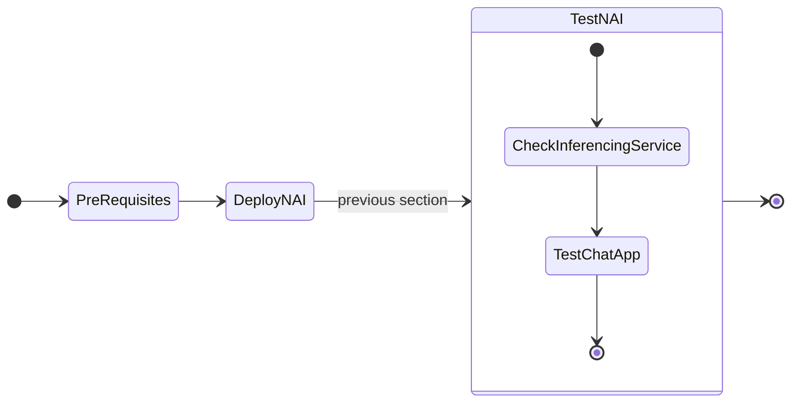

# Deploying GPT-in-a-Box NVD Reference Application using GitOps (FluxCD)



## Test Querying Inference Service

1. Prepare the API key that was created in the previous [section](../iep/iep_deploy.md#create-and-test-inference-endpoint)

    ```bash
    export API_KEY=_your_endpoint_api_key
    ```

2. Construct your ``curl`` command using the API key obtained above, and run it on the terminal

    === "Command"

        ```bash hl_lines="10"
        curl -k -X 'POST' 'https://nai.10.x.x.216.nip.io/api/v1/chat/completions' \
        -H "Authorization: Bearer $API_KEY" \
        -H 'accept: application/json' \
        -H 'Content-Type: application/json' \
        -d '{
            "model": "llama-8b",
            "messages": [
                {
                "role": "user",
                "content": "What is the capital of France?"
                }
            ],
            "max_tokens": 256,
            "stream": false
        }'
        ```

    === "Command output"

        ```json hl_lines="11"
        {
            "id": "9e55abd1-2c91-4dfc-bd04-5db78f65c8b2",
            "object": "chat.completion",
            "created": 1728966493,
            "model": "llama-8b",
            "choices": [
                {
                    "index": 0,
                    "message": {
                        "role": "assistant",
                        "content": "The capital of France is Paris. It is a historic city on the Seine River in the north-central part of the country. Paris is also the political, cultural, and economic center of France."
                    },
                    "finish_reason": "stop"
                }
            ],
            "usage": {
                "prompt_tokens": 17,
                "completion_tokens": 41,
                "total_tokens": 58
            },
            "system_fingerprint": ""
        }
        ```

We have a successful NAI deployment.

<!-- ## Accessing LLM Frontend UI

1. In the NAI GUI, under **Endpoints**, click on the **llama8b**
   
2. Choose test endpoint

3. Provide a sample prompt and check the output
   
     -->

## Sample Chat Application

Nutanix also provides a sample chat application that uses NAI to provide chatbot capabilities. We will install and use the chat application in this section. 

1. Run the following command to deploy the chat application.
   
    ```bash
    code /home/ubuntu/sol-cnai-infra/scripts/nai/chat.yaml
    ```

2. Change this line to point to the IP address of your NAI cluster for the ``VirtualService`` resource
   
3. Insert ``chat`` as the subdomain in the ``nai.10.x.x.216.nip.io`` main domain.
   
    Example: complete URL

    ```url
    chat.nai.10.x.x.216.nip.io
    ```
   
    ```yaml hl_lines="9"
    apiVersion: networking.istio.io/v1beta1
    kind: VirtualService
    metadata:
      name: nai-chat
    spec:
      gateways:
      - knative-serving/knative-ingress-gateway
      hosts:
      - chat.nai.10.x.x.216.nip.io
      http:
      - match:
        - uri:
            prefix: /
        route:
        - destination:
            host: nai-chatapp
            port:
            number: 8502
    ```

4. We should be able to see the chat application running on the NAI cluster.
   
    

5. Input the endpoint URL and API key to start chatting with the LLM.

We have successfully deployed the following:
 
 - Inferencing endpoint
 - A sample chat application that uses NAI to provide chatbot capabilities