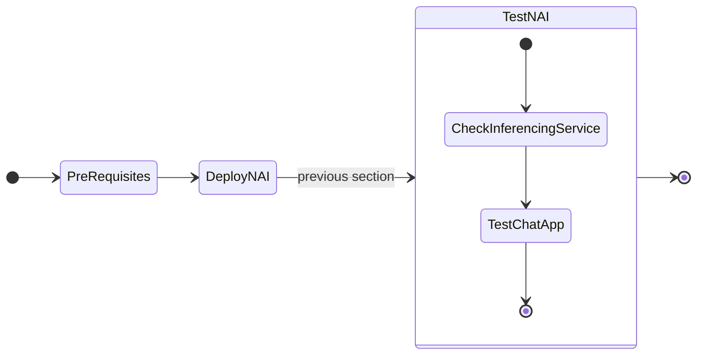

# Deploying GPT-in-a-Box NVD Reference Application using GitOps (FluxCD)



## Test Querying Inference Service API

1. Prepare the API key that was created in the previous [section](../iep/iep_deploy.md#create-and-test-inference-endpoint)

    === "Template command"

        ```bash
        export API_KEY=_your_endpoint_api_key
        ```

    === "Sample command"

        ```bash
        export API_KEY=5840a693-254d-41ef-a2d3-1xxxxxxxxxx
        ```

2. Construct your ``curl`` command using the API key obtained above, and run it on the terminal

    === "Command"

        ```bash hl_lines="10"
        curl -k -X 'POST' 'https://nai.10.x.x.216.nip.io/api/v1/chat/completions' \
        -H "Authorization: Bearer $API_KEY" \
        -H 'accept: application/json' \
        -H 'Content-Type: application/json' \
        -d '{
            "model": "llama-8b",
            "messages": [
                {
                "role": "user",
                "content": "What is the capital of France?"
                }
            ],
            "max_tokens": 256,
            "stream": false
        }'
        ```

    === "Command output"

        ```json hl_lines="11"
        {
            "id": "9e55abd1-2c91-4dfc-bd04-5db78f65c8b2",
            "object": "chat.completion",
            "created": 1728966493,
            "model": "llama-8b",
            "choices": [
                {
                    "index": 0,
                    "message": {
                        "role": "assistant",
                        "content": "The capital of France is Paris. It is a historic city on the Seine River in the north-central part of the country. Paris is also the political, cultural, and economic center of France."
                    },
                    "finish_reason": "stop"
                }
            ],
            "usage": {
                "prompt_tokens": 17,
                "completion_tokens": 41,
                "total_tokens": 58
            },
            "system_fingerprint": ""
        }
        ```

We have a successful NAI deployment.

## Accessing LLM Frontend UI

1. In the NAI GUI, under **Endpoints**, click on the **llama8b**
   
2. Click on **Test**

3. Provide a sample prompt and check the output
   
    

## Sample Chat Application

Nutanix also provides a sample chat application that uses NAI to provide chatbot capabilities. We will install and use the chat application in this section. 

1. Run the following command to deploy the chat application.
   
    ```bash
    kubectl create ns chat
    kubens chat
    ```
    ```bash
    kubectl apply -f -<<EOF
    apiVersion: apps/v1
    kind: Deployment
    metadata:
      name: nai-chatapp
      namespace: chat
      labels:
        app: nai-chatapp
    spec:
      replicas: 1
      selector:
        matchLabels:
          app: nai-chatapp
      template:
        metadata:
          labels:
            app: nai-chatapp
        spec:
          containers:
          - name: nai-chatapp
            image: johnugeorge/nai-chatapp:0.12
            ports:
            - containerPort: 8502
    ---
    apiVersion: v1
    kind: Service
    metadata:
      name: nai-chatapp
      namespace: chat
    spec:
      selector:
        app: nai-chatapp
      ports:
        - protocol: TCP
          port: 8502
    EOF
    ```

2. Change this line to point to the IP address of your NAI cluster for the ``VirtualService`` resource
   
3. Insert ``chat`` as the subdomain in the ``nai.10.x.x.216.nip.io`` main domain.
   
    Example: complete URL

    ```url
    chat.nai.10.x.x.216.nip.io
    ```
   
    ```yaml hl_lines="6 10 12"
    kubectl apply -f -<<EOF
    apiVersion: gateway.networking.k8s.io/v1
    kind: HTTPRoute
    metadata:
      name: nai-chatapp-route
      namespace: nai-admin              # Same namespace as your Service
    spec:
      parentRefs:
      - name: nai-ingress-gateway
    namespace: chat                     # Namespace of the Gateway
      hostnames:
      - "chat.nai.10.x.x.216.nip.io"    # Input Gateway IP address
      rules:
      - matches:
        - path:
            type: PathPrefix
            value: /
        backendRefs:
        - name: nai-chatapp
          kind: Service
          port: 8502
    EOF
    ```

4. We should be able to see the chat application running on the NAI cluster.

5. Input the following:
   
    - Endpoint URL - e.g. ``https://nai.10.x.x.216.nip.io/api/v1/chat/completions`` (can be found in the Enpoints on NAI GUI)
    - Endpoint Name - e.g. ``llama-8b``
    - API key - created during Endpoint creation
  
    
   


We have successfully deployed the following:
 
 - Inferencing endpoint
 - A sample chat application that uses NAI to provide chatbot capabilities