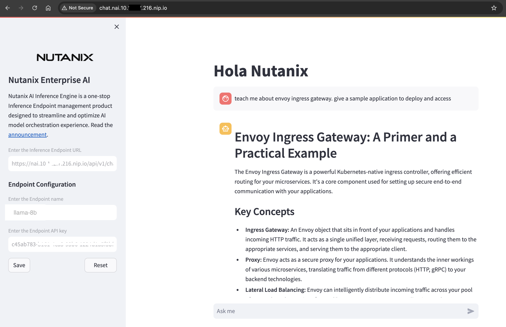

# Deploying GPT-in-a-Box NVD Reference Application using GitOps (FluxCD)


## Accessing LLM Frontend

1. In the NAI GUI, under **Endpoints**, click on the **llama8b**
   
2. Choose test endpoint

3. Provide a sample prompt and check the output
   
    

We have a successful NAI deployment.

## Sample Chat Application

Nutanix also provides a sample chat application that uses NAI to provide chatbot capabilities. We will install and use the chat application in this section. 

1. Run the following command to deploy the chat application.
   
    ```bash
    code /home/ubuntu/sol-cnai-infra/scripts/nai/chat.yaml
    ```

2. Change this line to point to the IP address of your NAI cluster for the ``VirtualService`` resource
   
3. Insert ``chat`` as the subdomain in the ``nai.10.x.x.216.nip.io`` main domain.
   
    Example: complete URL

    ```url
    chat.nai.10.x.x.216.nip.io
    ```
   
    ```yaml hl_lines="9"
    apiVersion: networking.istio.io/v1beta1
    kind: VirtualService
    metadata:
      name: nai-chat
    spec:
      gateways:
      - knative-serving/knative-ingress-gateway
      hosts:
      - chat.nai.10.122.7.216.nip.io
      http:
      - match:
        - uri:
            prefix: /
        route:
        - destination:
            host: nai-chatapp
            port:
            number: 8502
    ```

4. We should be able to see the chat application running on the NAI cluster.
   
    

5. Input the endpoint URL and API key to start chatting with the LLM.

We have successfully deployed the following:
 
 - Inferencing endpoint
 - A sample chat application that uses NAI to provide chatbot capabilities