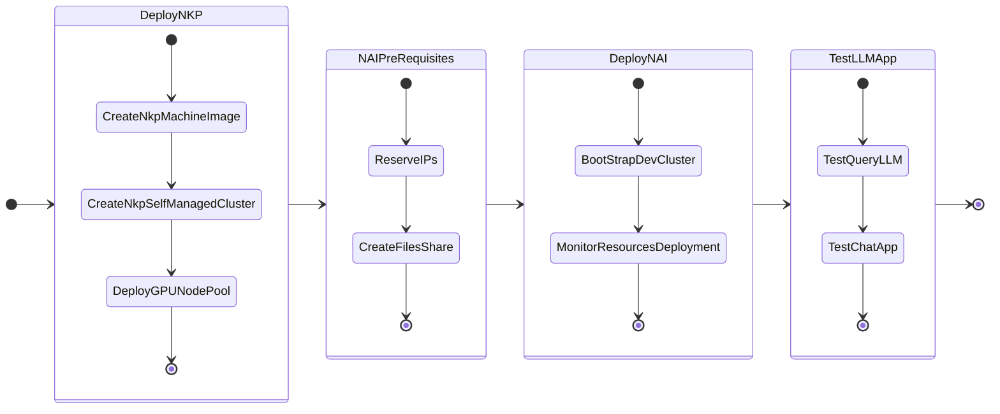

# Getting Started

In this part of the lab we will deploy LLM on GPU nodes.

We will also deploy a Kubernetes cluster so far as per the NVD [design requirements](../conceptual/conceptual.md#management-kubernetes-cluster).

**Dev NKP cluster**: to host the dev LLM and ChatBot application - this will use GPU passed through to the kubernetes worker node.

-   :material-kubernetes:{ .lg .middle } __Set up Nutanix Kubernetes Platform [ NKP ] in 30 minutes__

    ---

    [:octicons-arrow-right-24: Setup NKP](../infra/infra_nkp.md) - Quick install with all working NKP components

-   :material-kubernetes:{ .lg .middle } __Set up Nutanix Kubernetes Platform [ NKP ] Advanced__

    ---

    [:octicons-arrow-right-24: Setup Customized NKP](../appendix/infra_nkp_hard_way.md) - Customize what NKP components to deploy

    [:octicons-arrow-right-24: Air-gapped Install](../appendix/infra_nkp_hard_way.md) - Under construction :construction: .. 

Deploy the kubernetes cluster with the following components:

- 3 x Control plane nodes
- 4 x Worker nodes 
- 1 x GPU node (with a minimum of 40GB of RAM and 16 vCPUs based on ``llama3-8B`` LLM model)

We will deploy the GPT-in-a-Box v2 NVD Reference App - backed by ``llama3-8B`` model.

The following is the flow of the NAI lab:

