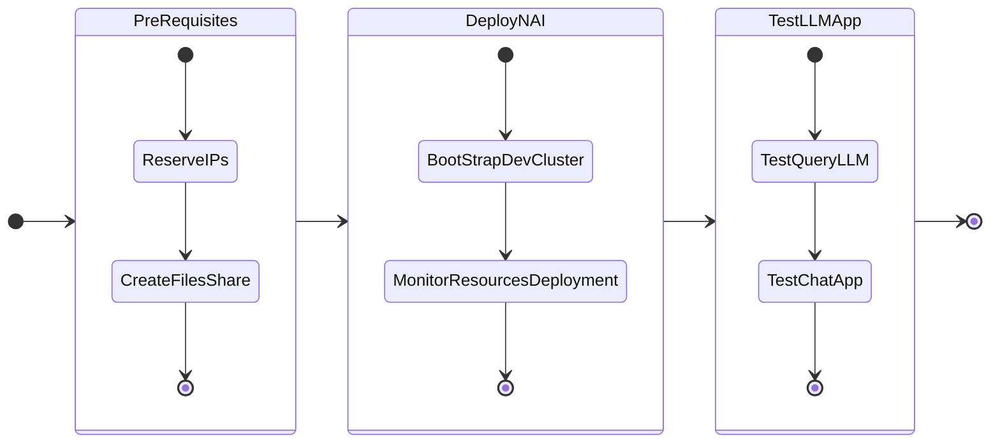

# Getting Started

In this part of the lab we will deploy LLM on GPU nodes.

We have deployed a Kubernetes cluster so far as per the NVD [design requirements](../conceptual/conceptual.md#management-kubernetes-cluster)

**Dev cluster**: to host the dev LLM and ChatBot application - this will use GPU passed through to the kubernetes worker node.

A kubernetes cluster (NKP or other supported ones) should already be deployed to be able to run this lab. If it is not, follow the guide below to deploy.

-   :material-kubernetes:{ .lg .middle } __Set up Nutanix Kubernetes Platform [ NKP ] in 30 minutes__

    ---

    Setup a Nutanix cluster in under an hour using Foundation to prepare your infrastructure.

    [:octicons-arrow-right-24: Setup Nutanix Kubernetes Platform](../infra/infra_nkp.md)

Confirm that the kubernetes cluster has the following components installed:

- 3 x Control plane nodes
- 4 x Worker nodes 
- 1 x GPU node (with a minimum of 40GB of RAM and 16 vCPUs)

We will deploy the GPT-in-a-Box v2 NVD Reference App - backed by llama3-8B model.

The following is the flow of the NAI lab:

