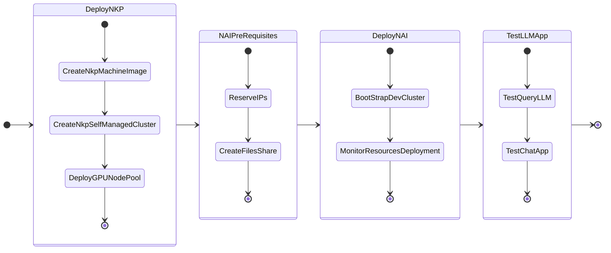

---

title: "Nutanix AI on NKP"
description: "This is a document that walks through Nutanix AI (NAI) implementation on a NKP cluster using Helm charts. The procedure also provides extra customisable options to suit an environment from testing to production. Various options are detailed and discussed along the way helping you make decisions on installation choices. A few testing components are also documented for once NAI is deployed "

---

# Getting Started

In this part of the lab we will deploy LLM on GPU nodes.

We will also deploy a Kubernetes cluster so far as per the NVD [design requirements](../conceptual/conceptual.md#management-kubernetes-cluster).

**Dev NKP cluster**: to host the dev LLM and ChatBot application - this will use GPU passed through to the kubernetes worker node.

Deploy the kubernetes cluster with the following components:

- 3 x Control plane nodes
- 4 x Worker nodes 
- 1 x GPU node (with a minimum of 40GB of RAM and 16 vCPUs based on ``llama3-8B`` LLM model)

We will deploy the NAI ``v2.7.0`` NVD Reference App - backed by ``llama3-8B`` model.

The following is the flow of the NAI lab:

```mermaid
stateDiagram-v2
    direction LR

    state DeployNKP {
        [*] --> CreateNkpMachineImage
        CreateNkpMachineImage --> CreateNkpSelfManagedCluster
        CreateNkpSelfManagedCluster --> DeployGPUNodePool
        DeployGPUNodePool --> [*]
    }
    
    state NAIPreRequisites {
        [*] --> ReserveIPs
        ReserveIPs --> CreateFilesShare
        CreateFilesShare --> [*]
    }
    
    state DeployNAI {
        [*] --> BootStrapDevCluster
        BootStrapDevCluster --> MonitorResourcesDeployment
        MonitorResourcesDeployment --> [*]
    }

    state TestLLMApp {
        [*] --> TestQueryLLM
        TestQueryLLM --> TestChatApp
        TestChatApp --> [*]
    }

    [*] --> DeployNKP
    DeployNKP --> NAIPreRequisites
    NAIPreRequisites --> DeployNAI
    DeployNAI --> TestLLMApp
    TestLLMApp --> [*]
```

