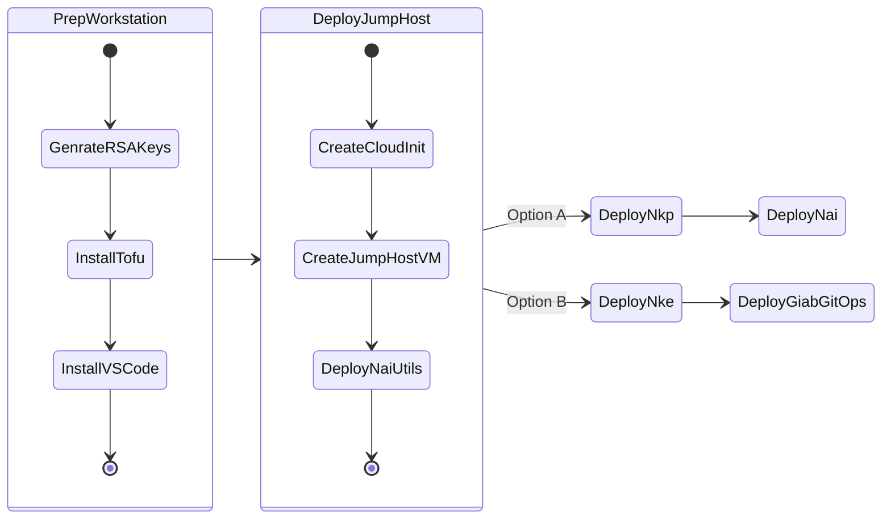
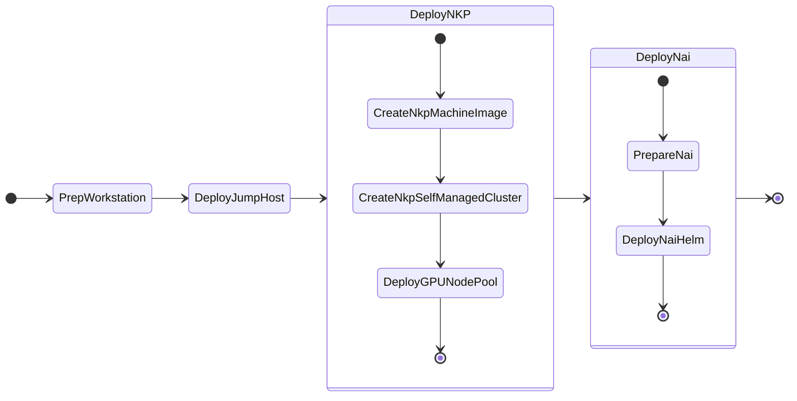
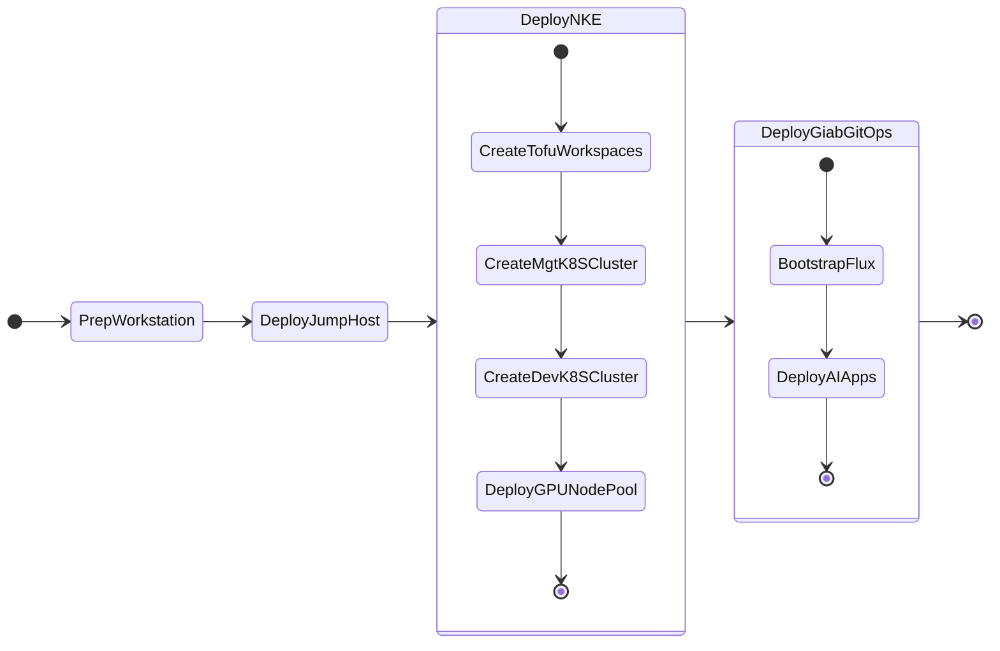

# Getting Started

This guide covers two different scenarios for deploying Nutanix Enterprise AI [NAI] (previously known as GPT-In-A-Box).  

The first scenario is a walkthrough on How-To [Deploy Nutanix Enterprise AI with Nutanix Kubernetes Platform (NKP)](#deploy-nutanix-enterprise-ai-with-nutanix-kubernetes-platform-nkp), and the second scenario covers the (soon to be deprecated) option on How-To [Deploy GPT-In-A-Box v1 Nutanix Validated Design (NVD) with NKE](#deploy-gpt-in-a-box-v1-nutanix-validated-design-nvd-with-nke) .

Each scenario goes through four phases to prepare the infrastructure on which you can deploy Nutanix Enterprise AI applications.

## Deploy Nutanix Enterprise AI with Nutanix Kubernetes Platform (NKP)

1. Prepare Local Development Workstation (Mac/Windows)
2. Deploy Jumphost VM
3. Deploy Nutanix Kubernetes Platform (NKP) Management Cluster
4. Deploy Nutanix Enterprise AI (NAI)

## Deploy GPT-In-A-Box (v1) Nutanix Validated Design (NVD) with NKE

1. Prepare your Local Development Workstation (Mac/Windows)
2. Deploy Jumphost VM
3. Deploy Nutanix Kubernetes Engine (NKE) - Management Cluster
4. Deploy Nutanix Kubernetes Engine (NKE) - Development Workload Cluster
5. Deploy Nutanix GPT-In-A-Box (v1) Validated Design Reference RAG Applications using Flux GitOps

