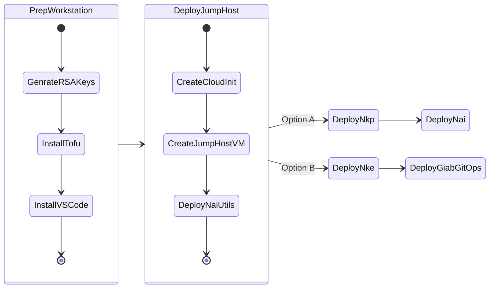
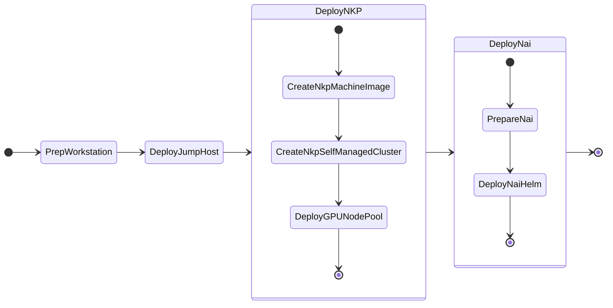
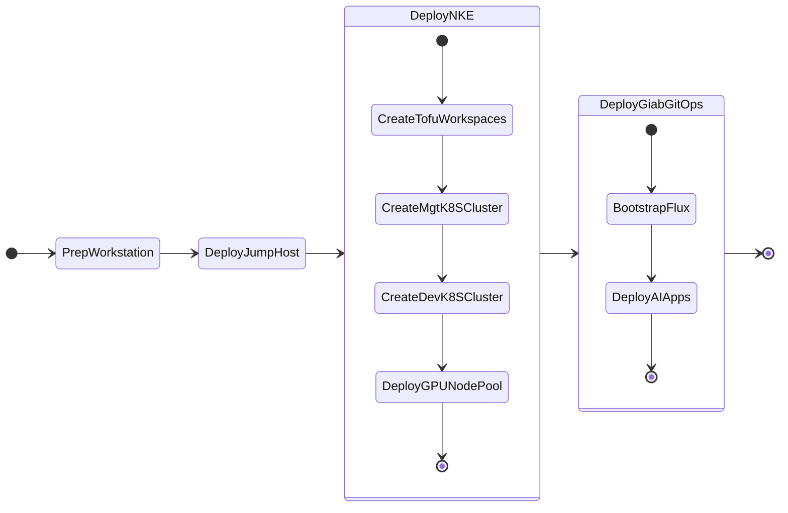

# Getting Started

In this section we will deploy infrastructure to be able to deploy NAI.

We will deploy a jumphost to work with. We will deploy all the necessary tools on this jumphost. Once this is done, we will use this jumphost to deploy the NAI platform.

This guide covers two different scenarios for deploying Nutanix Enterprise AI [NAI] (previously known as GPT-In-A-Box).  

1. The first scenario is a walkthrough on How-To [Deploy Nutanix Enterprise AI (NAI) with Nutanix Kubernetes Platform (NKP)](#deploy-nutanix-enterprise-ai-with-nutanix-kubernetes-platform-nkp), and 
2. The second scenario covers the (soon to be deprecated) option on How-To [Deploy GPT-In-A-Box v1 Nutanix Validated Design (NVD) with NKE](#deploy-gpt-in-a-box-v1-nutanix-validated-design-nvd-with-nke) .

!!! warning "Deprecation Notice!"
          
    GPT-In-A-Box v1 and NKE will be deprecated soon. We will be removing these options from the this site as soon as it is deprecated.
         

Each scenario goes through four phases to prepare the infrastructure on which you can deploy Nutanix Enterprise AI applications.

1. [Prepare](../infra/workstation.md) the workstation.
2. [Deploy](../infra/infra_jumphost_tofu.md) the jumphost
    1. Option A - [Deploy NKP](../infra/infra_nkp.md) to deploy [NAI](../iep/index.md)
    2. Option B - [Deploy NKE](../infra/infra_nke.md) to deploy [GPT-In-A-Box v1](../llmmgmt/index.md)

Here is a diagram that shows the four phases.

## Deploy NAI with NKP

1. Prepare Local Development Workstation (Mac/Windows)
2. Deploy Jumphost VM
3. Deploy Nutanix Kubernetes Platform (NKP) Management Cluster
4. Deploy Nutanix Enterprise AI (NAI)
   
Here is a diagram that shows the workflow:

## Deploy GPT-In-A-Box (v1) with NKE

1. Prepare your Local Development Workstation (Mac/Windows)
2. Deploy Jumphost VM
3. Deploy Nutanix Kubernetes Engine (NKE) - Management Cluster
4. Deploy Nutanix Kubernetes Engine (NKE) - Development Workload Cluster
5. Deploy Nutanix GPT-In-A-Box (v1) Validated Design Reference RAG Applications using Flux GitOps

Here is a diagram that shows the workflow:

