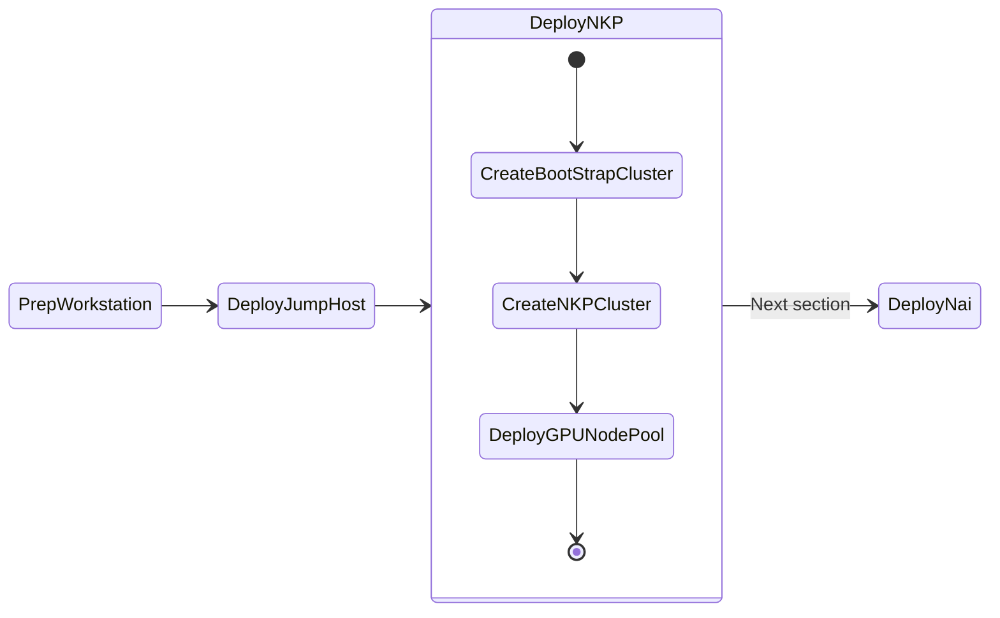

# Deploy NKP Clusters

This section will take you through install NKP(Kubernetes) on Nutanix cluster as we will be deploying AI applications on these kubernetes clusters. 

This section will expand to other available Kubernetes implementations on Nutanix.



## NKP High Level Cluster Design

The `Bootstrap` NKP cluster will be a temporary [kind](https://kind.sigs.k8s.io/) cluster that will be used to deploy the DEV cluster.

The `DEV` NKP cluster will be hosting the LLM model serving endpoints and AI application stack. This cluster and will require a dedicated GPU node pool.

Once DEV deployment has been tested successfully, we can deploy applications to optional PROD Workload cluster.

!!!note
       The ``Bootstrap`` cluster's [Cluster API (CAPI)](https://cluster-api.sigs.k8s.io/)  components will be migrated to the DEV cluster and the bootstrap cluster will be deleted.

### Bootstrap Cluster

Since the Bootstrap Cluster will be essential to deploying a workload DEV cluster. We will use ``kind`` cluster packaged by Nutanix. ``kind`` is already installed on the jumphost VM and be accessed using ``devbox shell``.

### Dev Workload Cluster

For Dev, we will deploy an NKE Cluster of type "Development".

| Role   | No. of Nodes (VM) | vCPU | RAM   | Storage |
| ------ | ----------------- | ---- | ----- | ------- |
| Master | 3                 | 4    | 16 GB | 80 GB  |
| Worker | 4                | 8   | 32 GB | 80 GB  |
| GPU    | 1                 | 16   | 64 GB | 200 GB  |


## Pre-requisites for NKP Deployment

1. Download and install dkp and dkp-image-builder binaries (will be documented soon)
2. Find and reserve 3 IPs for control plane and MetalLB access from AHV network
3. Create a base image to use with NKP nodes using ``dkp-image-builder``

### Install NKP Binaries

To be documented.

### Reserve Control Plane and MetalLB Endpoint IPs 

Nutanix AHV IPAM network allows you to black list IPs that needs to be reserved for specific application endpoints. We will use this feature to find and reserve three IPs. 

We will need a total of three IPs for the following:

| Cluster Role  | Cluster Name            |    Control Plane IP   |    MetalLB  IP  |          
| -------------  | --------            |  ------------ |  --------   | 
| Dev  |``nkp-dev``       |  1             |  2        |  

1. Get the CIDR range for the AHV network(subnet) where the application will be deployed

    ```buttonless title="CIDR example for your Nutanix cluster"
    10.x.x.0/24
    ```

2. From VSC, logon to your jumpbox VM and open Terminal

3. Install ``nmap`` tool (if not already done)
   
    ```bash
    cd $HOME/sol-cnai-infra
    devbox add nmap
    ```

4. Find three unused static IP addresses in the subnet

    === "Template command"
    
        ```bash
        nmap -v -sn  <your CIDR>
        ```

    === "Sample command"

        ```bash 
        nmap -v -sn 10.x.x.0/24
        ```

    ```text title="Sample output - choose the first three consecutive IPs"
    Nmap scan report for 10.x.x.214 [host down]
    Nmap scan report for 10.x.x.215 [host down]
    Nmap scan report for 10.x.x.216 [host down]
    Nmap scan report for 10.x.x.217
    Host is up (-0.098s latency).
    ```

5. Logon to any CVM in your Nutanix cluster and execute the following to add chosen static IPs to the AHV IPAM network

    - **Username:** nutanix
    - **Password:** your Prism Element password 

    === "Template command"
    
        ```text
        acli net.add_to_ip_blacklist <your-ipam-ahv-network> \
        ip_list=10.x.x.214,10.x.x.215,10.x.x.216
        ```

    === "Sample command"

         ```text
         acli net.add_to_ip_blacklist User1 \
         ip_list=10.x.x.214,10.x.x.215,10.x.x.216
         ```

### Setup Docker on Jumphost

1. From VSC, logon to your jumpbox VM
2. Open VSC Terminal
3. Run the following commands to install ``docker`` binaries

    ```bash
    cd $HOME/sol-cnai-infra/; devbox init; devbox shell
    task workstation:install-docker
    ```

    !!! tip
        
        Restart the jumpbox host if ``ubuntu`` user has permission issues using ``docker`` commands.

4. Login to docker with your docker credentials to pull images to avoid any image pull rate limits

    ```bash
    docker login -u _your_docker_username -p _your_docker_password
    ```

## Create Base Image for NKP

In this section we will go through creating a base image for all the control plane and worker node VMs on Nutanix.

1. In VSC Explorer pane, Click on **New Folder** :material-folder-plus-outline:

2. Call the folder ``dkp`` under ``$HOME`` directory

3. In the ``dkp`` folder, click on **New File** :material-file-plus-outline: with the following name
  
    ```bash
    .env
    ```

4. Fill the following values inside the ``.env`` file

    === "Template file"

        ```text
        export NUTANIX_USER=_your_nutanix_username
        export NUTANIX_PASSWORD=_your_nutanix_password
        export NUTANIX_ENDPOINT=_your_prism_central_cluster_name
        export NUTANIX_CLUSTER=_your_prism_element_cluster_name
        export NUTANIX_SUBNET_NAME=_your_ahv_ipam_network_name
        export STORAGE_CONTAINER=_your_storage_container_nmae
        export SSH_PUBLIC_KEY=_your_path_to_ssh_pub_key
        export NKP_CLUSTER_NAME=_your_nkp_cluster_name
        export GPU_NAME=_your_gpu_name
        export CONTROLPLANE_VIP=_your_nkp_cluster_controlplane_ip
        export METALLB_IP_RANGE=_your_range_of_three_ips
        ```

    === "Sample file"

        ```text
        export NUTANIX_USER=admin
        export NUTANIX_PASSWORD=xxxxxxxx
        export NUTANIX_ENDPOINT=pc.example.com
        export NUTANIX_CLUSTER=pe
        export NUTANIX_SUBNET_NAME=User1
        export STORAGE_CONTAINER=default
        export SSH_PUBLIC_KEY=$HOME/.ssh/id_rsa.pub
        export NKP_CLUSTER_NAME=nkp1
        export GPU_NAME="Lovelace 40S"
        export CONTROLPLANE_VIP=10.x.x.214
        export METALLB_IP_RANGE=10.x.x.215-10.x.x.216
        ```

8. Using VSC Terminal, load the environment variables and its values
   
    ```bash
    cd $HOME/dkp
    source .env
    ```

9. Create the base image and upload to Prism Central using the following command. 
   
    ```bash
    dkp-image-builder create image nutanix ubuntu-22.04 --endpoint ${NUTANIX_ENDPOINT} --cluster ${NUTANIX_CLUSTER} --subnet ${NUTANIX_SUBNET_NAME}
    ```
    
    !!!note 
           Image creation will take up to 5 minutes.


    <!-- termynal -->

    ```bash
    $ dkp-image-builder create image nutanix ubuntu-22.04 \ 
    $ --endpoint ${NUTANIX_ENDPOINT} --cluster ${NUTANIX_CLUSTER} \
    $ --subnet ${NUTANIX_SUBNET_NAME} 
    
    Provisioning and configuring image
    Manifest files extracted to $HOME/dkp/.dkp-image-builder-3243021807
    nutanix.kib_image: output will be in this color.

    ==> nutanix.kib_image: Creating Packer Builder virtual machine...
        nutanix.kib_image: Virtual machine nkp-ubuntu-22.04-1.29.6-20240717082720 created
        nutanix.kib_image: Found IP for virtual machine: 10.122.7.234
    ==> nutanix.kib_image: Running post-processor: packer-manifest (type manifest)
    
    ---> 100%
    Build 'nutanix.kib_image' finished after 4 minutes 55 seconds.
    ==> Wait completed after 4 minutes 55 seconds

    ==> Builds finished. The artifacts of successful builds are:
    --> nutanix.kib_image: nkp-ubuntu-22.04-1.29.6-20240717082720
    --> nutanix.kib_image: nkp-ubuntu-22.04-1.29.6-20240717082720
    ```

    !!! info inline end "Image name"
        
        Note image name from the previous ``dkp-image-builder`` command output (the last line)

        ```text hl_lines="2"
        ==> Builds finished. The artifacts of successful builds are:
        --> nutanix.kib_image: nkp-ubuntu-22.04-1.29.6-20240717082720
        --> nutanix.kib_image: nkp-ubuntu-22.04-1.29.6-20240717082720
        ```

10. Populate the ``.env`` file with the NKP image name 

    === "Template command"
    
        ```text
        echo -e "export NKP_IMAGE=nkp-image-name" >> .env
        source .env
        ```

    === "Sample command"

         ```text
         echo -e "export NKP_IMAGE=nkp-ubuntu-22.04-1.29.6-20240717082720" >> .env
         source .env
         ```
    Make sure to use image name that is generated in your environment.

## Create a Bootstrap K8S Cluster

In this section we will create a bootstrap cluster which will be used to deploy the workload ``DEV`` cluster.

1. In VSC, open Terminal, enter the following command
   
    ```bash
    dkp create bootstrap
    ```
    
    <!-- termynal -->

    ```bash
    $ dkp create bootstrap
    > ✓ Creating a bootstrap cluster 
    > ✓ Upgrading CAPI components 
    > ✓ Waiting for CAPI components to be upgraded 
    > ✓ Initializing new CAPI components 
    > ✓ Creating ClusterClass resources
    ```
2. Store kubeconfig file for bootstrap cluster
   
    ```bash
    cp $HOME/.kube/config bs.cfg
    export KUBECONFIG=bs.cfg
    ```

3. Check the status of bootstrap K8S cluster

    ```bash
    kubectl get nodes --kubeconfig=bs.cfg
    ```
    
    <!-- termynal -->

    ```bash
    $ kubectl get nodes --kubeconfig=bs.cfg
    NAME                                     STATUS   ROLES           AGE     VERSION
    konvoy-capi-bootstrapper-control-plane   Ready    control-plane   7m15s   v1.29.6
    ```

We are now ready to install the workload ``DEV`` cluster

## Create NKP Workload Cluster

1. In VSC, open Terminal, enter the following command to create the workload cluster
   
    ```bash
    dkp create cluster nutanix -c ${NKP_CLUSTER_NAME} --control-plane-endpoint-ip ${CONTROLPLANE_VIP} \
    --control-plane-prism-element-cluster ${NUTANIX_CLUSTER}  --control-plane-subnets ${NUTANIX_SUBNET_NAME} \
    --control-plane-vm-image ${NKP_IMAGE} --csi-storage-container ${STORAGE_CONTAINER} \
    --endpoint https://${NUTANIX_ENDPOINT}:9440 --worker-prism-element-cluster ${NUTANIX_CLUSTER} \
    --worker-subnets ${NUTANIX_SUBNET_NAME} --worker-vm-image ${NKP_IMAGE} \
    --ssh-public-key-file ${SSH_PUBLIC_KEY} --kubernetes-service-load-balancer-ip-range ${METALLB_IP_RANGE}
    ```

    <!-- termynal -->

    ```bash
    $ dkp create cluster nutanix -c ${NKP_CLUSTER_NAME} --control-plane-endpoint-ip ${CONTROLPLANE_VIP} \
    --control-plane-prism-element-cluster ${NUTANIX_CLUSTER}  --control-plane-subnets ${NUTANIX_SUBNET_NAME} \
    --control-plane-vm-image ${NKP_IMAGE} --csi-storage-container ${STORAGE_CONTAINER} \
    --endpoint https://${NUTANIX_ENDPOINT}:9440 --worker-prism-element-cluster ${NUTANIX_CLUSTER} \
    --worker-subnets ${NUTANIX_SUBNET_NAME} --worker-vm-image ${NKP_IMAGE} \
    --ssh-public-key-file ${SSH_PUBLIC_KEY} --kubernetes-service-load-balancer-ip-range ${METALLB_IP_RANGE}

    > Generating cluster resources
    cluster.cluster.x-k8s.io/nkplb created
    secret/nkplb-pc-credentials created
    secret/nkplb-pc-credentials-for-csi created
    configmap/kommander-bootstrap-configuration created
    secret/nutanix-license created
    > ✓ Waiting for cluster infrastructure to be ready 
    > ✓ Waiting for cluster control-planes to be ready 
    > ✓ Waiting for machines to be ready
    ```

2. Observe the events in the shell and in Prism Central events

3. Store kubeconfig files for the workload cluster
   
    ```bash
    dkp get kubeconfig -c ${NKP_CLUSTER_NAME} > ${NKP_CLUSTER_NAME}.cfg
    export KUBECONFIG=${PWD}/${NKP_CLUSTER_NAME}.cfg
    ```

4. Run the following command to check K8S status
    
    ```bash
    kubectl get nodes
    ```
    <!-- termynal -->

    ```bash
    $ kubectl get nodes

    NAME                                  STATUS   ROLES           AGE     VERSION
    nkp3-md-0-x948v-hvxtj-9r698           Ready    <none>          4h49m   v1.29.6
    nkp3-md-0-x948v-hvxtj-fb75c           Ready    <none>          4h50m   v1.29.6
    nkp3-md-0-x948v-hvxtj-mdckn           Ready    <none>          4h49m   v1.29.6
    nkp3-md-0-x948v-hvxtj-shxc8           Ready    <none>          4h49m   v1.29.6
    nkp3-r4fwl-8q4ch                      Ready    control-plane   4h50m   v1.29.6
    nkp3-r4fwl-jf2s8                      Ready    control-plane   4h51m   v1.29.6
    nkp3-r4fwl-q888c                      Ready    control-plane   4h49m   v1.29.6
    ```

## Create NKP GPU Workload Pool

1. Combine the bootstrap and workload clusters ``KUBECONFIG`` file so that we can use it with ``kubectx``
   
    ```bash
    export KUBECONFIG=bs.cfg:${NKP_CLUSTER_NAME}.cfg
    kubectl config view --flatten > all-in-one-kubeconfig.yaml
    export KUBECONFIG=all-in-one-kubeconfig.yaml
    ```

2. Change KUBECONFIG context to use bootstrap cluster
   
    ```bash
    kubectx kind-konvoy-capi-bootstrapper
    ```

3. Run the following command to create a GPU nodepool manifest
   
    ```bash
    dkp create nodepool nutanix \
    --cluster-name ${NKP_CLUSTER_NAME} \
    --prism-element-cluster ${NUTANIX_CLUSTER} \
    --subnets ${NUTANIX_SUBNET_NAME} \
    --vm-image ${NKP_IMAGE} \
    --disk-size 200 \
    --memory 64 \
    --vcpu-sockets 2 \
    --vcpus-per-socket 8 \
    gpu-nodepool  --dry-run -o yaml > gpu-nodepool.yaml
    ```

    !!! note
       
        Right now there is no switch for GPU in ``dkp`` command so we need to do dry-run into file and then add the necessary GPU specifications

4. Add the necessary gpu section to our new ``gpu-nodepool.yaml`` using ``yq`` command

   
    ```bash
    yq e '(.spec.topology.workers.machineDeployments[] | select(.name == "gpu-nodepool").variables.overrides[] | select(.name == "workerConfig").value.nutanix.machineDetails) += {"gpus": [{"type": "name", "name": strenv(GPU_NAME)}]}' -i gpu-nodepool.yaml
    ```

    ??? success "Successful addtion of GPU specs?"
        
        You would be able to see the added gpu section at the end of the ``gpu-nodepool.yaml`` file

        ```yaml hl_lines="29"
        apiVersion: cluster.x-k8s.io/v1beta1
        kind: Cluster

        <snip>

          name: gpu-nodepool
          variables:
            overrides:
              - name: workerConfig
                value:
                  nutanix:
                    machineDetails:
                      bootType: legacy
                      cluster:
                        name: romanticism
                        type: name
                      image:
                        name: nkp-ubuntu-22.04-1.29.6-20240718055804
                        type: name
                      memorySize: 64Gi
                      subnets:
                        - name: User1
                          type: name
                      systemDiskSize: 200Gi
                      vcpuSockets: 2
                      vcpusPerSocket: 8
                      gpus:
                        - type: name
                          name: Lovelace 40S
        ```

5. Apply the ``gpu-nodepool.yaml`` file to the workload cluster 
   
    ```bash
    kubectl apply -f gpu-nodepool.yaml
    ```

6. Monitor the progress of the command and check Prism Central events for creation of the GPU worker node

7. Change to workload ``DEV`` cluster context
   
    ```bash
    kubectx ${NKP_CLUSTER_NAME}-admin@${NKP_CLUSTER_NAME}
    ```

8. Check nodes status in workload ``DEV`` cluster and note the gpu worker node
 
    ```bash
    kubectl get nodes
    ```

    <!-- termynal -->
    
    ```bash
    $ kubectl get nodes

    NAME                                   STATUS   ROLES           AGE     VERSION
    nkplb-gpu-nodepool-7g4jt-2p7l7-49wvd   Ready    <none>          5m57s   v1.29.6
    nkplb-md-0-q679c-khl2n-9k7jk           Ready    <none>          74m     v1.29.6
    nkplb-md-0-q679c-khl2n-9nk6h           Ready    <none>          74m     v1.29.6
    nkplb-md-0-q679c-khl2n-nf9p6           Ready    <none>          73m     v1.29.6
    nkplb-md-0-q679c-khl2n-qgxp9           Ready    <none>          74m     v1.29.6
    nkplb-ncnww-2dg7h                      Ready    control-plane   73m     v1.29.6
    nkplb-ncnww-bbm4s                      Ready    control-plane   72m     v1.29.6
    nkplb-ncnww-hldm9                      Ready    control-plane   75m     v1.29.6
    ```


## Installing Kommander