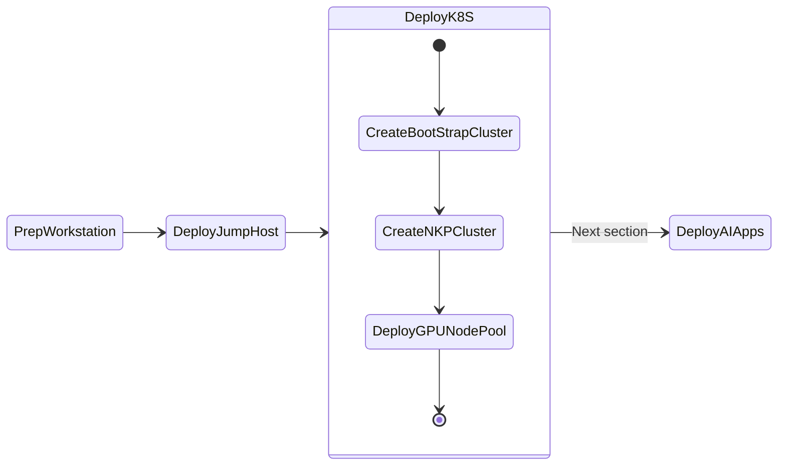

# Deploy NKP Clusters

This section will take you through install NKP(Kubernetes) on Nutanix cluster as we will be deploying AI applications on these kubernetes clusters. 

This section will expand to other available Kubernetes implementations on Nutanix.


## DKP High Level Cluster Design

The `Bootstrap` NKP cluster will be a temporary [kind](https://kind.sigs.k8s.io/) cluster that will be used to deploy the DEV cluster.

The `DEV` NKP cluster will be hosting the LLM model serving endpoints and AI application stack. This cluster and will require a dedicated GPU node pool.

Once DEV deployment has been tested successfully, we can deploy applications to optional PROD Workload cluster.

!!!note
       The ``Bootstrap`` cluster's [Cluster API (CAPI)](https://cluster-api.sigs.k8s.io/)  components will be migrated to the DEV cluster and the bootstrap cluster will be deleted.

### Bootstrap Cluster

Since the Bootstrap Cluster will be essential to deploying a workload DEV cluster. We will use ``kind`` cluster packaged by Nutanix. ``kind`` is already installed on the jumphost VM and be accessed using ``devbox shell``.

### Dev Workload Cluster

For Dev, we will deploy an NKE Cluster of type "Development".

| Role   | No. of Nodes (VM) | vCPU | RAM   | Storage |
| ------ | ----------------- | ---- | ----- | ------- |
| Master | 3                 | 4    | 16 GB | 80 GB  |
| Worker | 3                 | 8   | 32 GB | 80 GB  |
| GPU    | 2                 | 16   | 64 GB | 200 GB  |


## Pre-requisites for DKP Deployment

1. Download and install dkp and dkp-image-builder binaries (will be documented soon)
2. Find and reserve 3 IPs for control plane and MetalLB access from AHV network
3. Create a base image to use with DKP nodes using ``dkp-image-builder``
4. Create a bootstrap cluster on jumphost VM
5. Create a DKP cluster with control and worker nodes
6. Deploy GPU nodes
7. Move CAPI components from bootstrap cluster to DKP cluster (optional)

## Install NKP Binaries

To be documented.

## Reserve Control Plane and MetalLB Endpoint IPs 

Nutanix AHV IPAM network allows you to black list IPs that needs to be reserved for specific application endpoints. We will use this feature to find and reserve three IPs. 

We will need a total of three IPs for the following:

  
| Cluster Role  | Cluster Name            |    Control Plane IP   |    MetalLB  IP  |          
| -------------  | --------            |  ------------ |  --------   | 
| Dev  |``nkp-dev``       |  1             |  2        |  

1. Get the CIDR range for the AHV network(subnet) where the application will be deployed

    ```buttonless title="CIDR example for your Nutanix cluster"
    10.x.x.0/24
    ```

2. From VSC, logon to your jumpbox VM and open Terminal

3. Install ``nmap`` tool (if not already done)
   
    ```bash
    cd /home/ubuntu/nai-llm-fleet-infra
    devbox add nmap
    ```

4. Find three unused static IP addresses in the subnet

    === "Template command"
    
        ```bash
        nmap -v -sn  <your CIDR>
        ```

    === "Sample command"

        ```bash 
        nmap -v -sn 10.x.x.0/24
        ```

    ```text title="Sample output - choose the first three consecutive IPs"
    Nmap scan report for 10.x.x.214 [host down]
    Nmap scan report for 10.x.x.215 [host down]
    Nmap scan report for 10.x.x.216 [host down]
    Nmap scan report for 10.x.x.217
    Host is up (-0.098s latency).
    ```

5. Logon to any CVM in your Nutanix cluster and execute the following to add chosen static IPs to the AHV IPAM network

    - **Username:** nutanix
    - **Password:** your Prism Element password 

    === "Template command"
    
        ```text
        acli net.add_to_ip_blacklist <your-ipam-ahv-network> \
        ip_list=10.x.x.214,10.x.x.215,10.x.x.216
        ```

    === "Sample command"

         ```text
         acli net.add_to_ip_blacklist User1 \
         ip_list=10.x.x.214,10.x.x.215,10.x.x.216
         ```

## Create Base Image for NKP

In this section we will go through creating a base image for all the control plane and worker node VMs on Nutanix.


1. From VSC, logon to your jumpbox VM
   
2. In VSC Explorer pane, Click on **New Folder** :material-folder-plus-outline:

3. Call the folder ``dkp`` under ``/home/ubuntu`` directory
4. In the ``dkp`` folder, click on **New File** :material-file-plus-outline: with the following name
  
    ```bash
    .env
    ```

5. Fill the following values inside the ``.env`` file

    === "Template file"
    
        ```text
        export NUTANIX_USER=_your_nutanix_username
        export NUTANIX_PASSWORD=_your_nutanix_password
        export NUTANIX_ENDPOINT=_your_prism_central_cluster_name
        export NUTANIX_CLUSTER=_your_prism_element_cluster_name
        export NUTANIX_SUBNET_NAME=_your_ahv_ipam_network_name
        export STORAGE_CONTAINER=_your_storage_container_nmae
        export SSH_PUBLIC_KEY=_your_path_to_ssh_pub_key
        export NKP_CLUSTER_NAME=_your_nkp_cluster_name
        export GPU_NAME=_your_gpu_name
        export CONTROLPLANE_VIP=_your_nkp_cluster_controlplane_ip
        export METALLB_IP_RANGE=_your_range_of_three_ips
        ```

    === "Sample file"
    
        ```text
        export NUTANIX_USER=admin
        export NUTANIX_PASSWORD=xxxxxxxx
        export NUTANIX_ENDPOINT=pc.example.com
        export NUTANIX_CLUSTER=pe
        export NUTANIX_SUBNET_NAME=User1
        export STORAGE_CONTAINER=default
        export SSH_PUBLIC_KEY=/home/ubuntu/.ssh/id_rsa.pub
        export NKP_CLUSTER_NAME=nkp1
        export GPU_NAME="Lovelace 40S"
        export CONTROLPLANE_VIP=10.x.x.214
        export METALLB_IP_RANGE=10.x.x.215-10.x.x.216
        ```

6. Load the environment variables and its values
   
    ```bash
    source .env
    ```

7. Create the base image and upload to Prism Central using the following command. 
   
    ```bash
    dkp-image-builder create image nutanix ubuntu-22.04 --endpoint ${NUTANIX_ENDPOINT} --cluster ${NUTANIX_CLUSTER} --subnet ${NUTANIX_SUBNET_NAME}
    ```
    
    !!!note 
           Image creation will take up to 5 minutes.


    <!-- termynal -->

    ```bash
    $ dkp-image-builder create image nutanix ubuntu-22.04 \ 
    $ --endpoint ${NUTANIX_ENDPOINT} --cluster ${NUTANIX_CLUSTER} \
    $ --subnet ${NUTANIX_SUBNET_NAME} 
    
    Provisioning and configuring image
    Manifest files extracted to /home/ubuntu/dkp/.dkp-image-builder-3243021807
    nutanix.kib_image: output will be in this color.

    ==> nutanix.kib_image: Creating Packer Builder virtual machine...
        nutanix.kib_image: Virtual machine nkp-ubuntu-22.04-1.29.6-20240717082720 created
        nutanix.kib_image: Found IP for virtual machine: 10.122.7.234
    ==> nutanix.kib_image: Using SSH communicator to connect: 10.122.7.234
    ==> nutanix.kib_image: Waiting for SSH to become available...

    <-----
    Output snipped
    ----->

        nutanix.kib_image: PLAY RECAP *********************************************************************
        nutanix.kib_image: default                    : ok=154  changed=86   unreachable=0    failed=0    skipped=344  rescued=0    ignored=0
        nutanix.kib_image:
    ==> nutanix.kib_image: Gracefully halting virtual machine...
    ==> nutanix.kib_image: Creating image(s) from virtual machine nkp-ubuntu-22.04-1.29.6-20240717082720...
        nutanix.kib_image: Found disk to copy: SCSI:0
        nutanix.kib_image: Image successfully created: nkp-ubuntu-22.04-1.29.6-20240717082720 (0e97abeb-be7d-4c6c-95b6-47449caae678)
    ==> nutanix.kib_image: Deleting virtual machine...
        nutanix.kib_image: Virtual machine successfully deleted
    ==> nutanix.kib_image: Running post-processor: custom-post-processor (type shell-local)
    ==> nutanix.kib_image (shell-local): Running local shell script: /tmp/packer-shell4259654918
    ==> nutanix.kib_image: Running post-processor: packer-manifest (type manifest)
    
    ---> 100%
    Build 'nutanix.kib_image' finished after 4 minutes 55 seconds.
    ==> Wait completed after 4 minutes 55 seconds

    ==> Builds finished. The artifacts of successful builds are:
    --> nutanix.kib_image: nkp-ubuntu-22.04-1.29.6-20240717082720
    --> nutanix.kib_image: nkp-ubuntu-22.04-1.29.6-20240717082720
    ```

9.  An image would be created in Prism Central if the previous command ran successfully. This will be used as base image for NKP cluster
   
     ```bash
     nkp-ubuntu-22.04-1.29.6-20240717082720 # (1)!
     ```

     1. :material-fountain-pen-tip: This image name will be different for every execution

10. Populate the ``.env`` file with the NKP image details 

    === "Template command"
    
        ```text
        echo "export NKP_IMAGE=nkp-image-name" >> .env
        source .env
        ```

    === "Sample command"

         ```text
         echo "export NKP_IMAGE=nkp-ubuntu-22.04-1.29.6-20240717082720" >> .env
         source .env
         ```

## Create a Bootstrap K8S Cluster

In this section we will create a bootstrap cluster which will be used to deploy the workload ``DEV`` cluster.

1. In VSC, open Terminal, enter the following command
   
    ```bash
    dkp create bootstrap
    ```
    
    <!-- termynal -->

    ```bash
    $ dkp create bootstrap
    > ✓ Creating a bootstrap cluster 
    > ✓ Upgrading CAPI components 
    > ✓ Waiting for CAPI components to be upgraded 
    > ✓ Initializing new CAPI components 
    > ✓ Creating ClusterClass resources
    ```

2. Check the status of bootstrap K8S cluster

    ```bash
    kubectl --kubeconfig=/home/ubuntu/.kube/config get nodes
    ```
    
    <!-- termynal -->

    ```bash
    $ kubectl --kubeconfig=/home/ubuntu/.kube/config get nodes
    NAME                                     STATUS   ROLES           AGE     VERSION
    konvoy-capi-bootstrapper-control-plane   Ready    control-plane   7m15s   v1.29.6
    ```

We are now ready to install the workload ``DEV`` cluster

## Create DKP Workload Cluster

1. In VSC, open Terminal, enter the following command to create the workload cluster
   
    ```bash
    nkp create cluster nutanix -c ${NKP_CLUSTER_NAME} --control-plane-endpoint-ip ${CONTROLPLANE_VIP} \
    --control-plane-prism-element-cluster ${NUTANIX_CLUSTER}  --control-plane-subnets ${NUTANIX_SUBNET_NAME} \ 
    --control-plane-vm-image ${NKP_IMAGE} --csi-storage-container ${STORAGE_CONTAINER} \
    --endpoint https://${NUTANIX_ENDPOINT}:9440 --worker-prism-element-cluster ${NUTANIX_CLUSTER} \
    --worker-subnets ${NUTANIX_SUBNET_NAME} --worker-vm-image ${NKP_IMAGE} \
    --ssh-public-key-file ${SSH_PUBLIC_KEY} --kubernetes-service-load-balancer-ip-range ${METALLB_IP_RANGE}
    ```

2. Observe the events in the shell and in Prism Central events
3. Run the following command to check K8S status
    
    ```bash
    kubectl get nodes
    ```
    <!-- termynal -->

    ```bash
    $ kubectl get nodes
    
    NAME                                  STATUS   ROLES           AGE     VERSION
    nkp3-md-0-x948v-hvxtj-9r698           Ready    <none>          4h49m   v1.29.6
    nkp3-md-0-x948v-hvxtj-fb75c           Ready    <none>          4h50m   v1.29.6
    nkp3-md-0-x948v-hvxtj-mdckn           Ready    <none>          4h49m   v1.29.6
    nkp3-md-0-x948v-hvxtj-shxc8           Ready    <none>          4h49m   v1.29.6
    nkp3-r4fwl-8q4ch                      Ready    control-plane   4h50m   v1.29.6
    nkp3-r4fwl-jf2s8                      Ready    control-plane   4h51m   v1.29.6
    nkp3-r4fwl-q888c                      Ready    control-plane   4h49m   v1.29.6
    ```