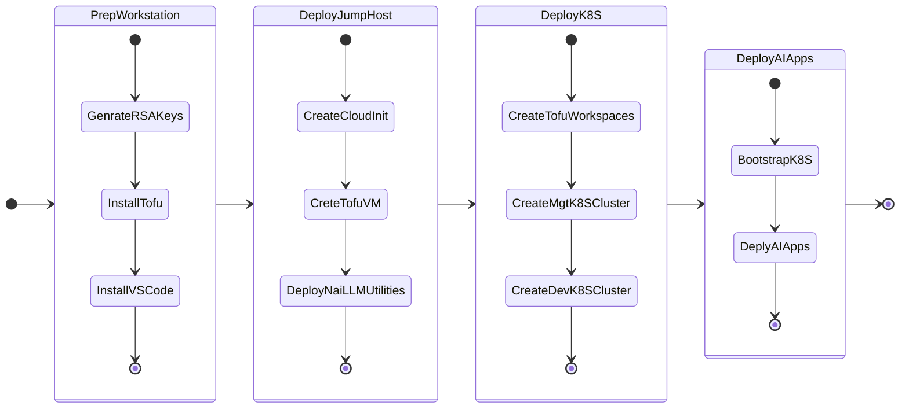

# Prepare your Infrastructure

We will go through four phases in this section to prepare infrastructure on which you can deploy AI applications. 

1. Preparing your Workstation (Mac/Windows)
2. Deploying Jumphost VM
3. Deploying Kuberenetes
   1. Managment Cluster
   2. Dev cluster

