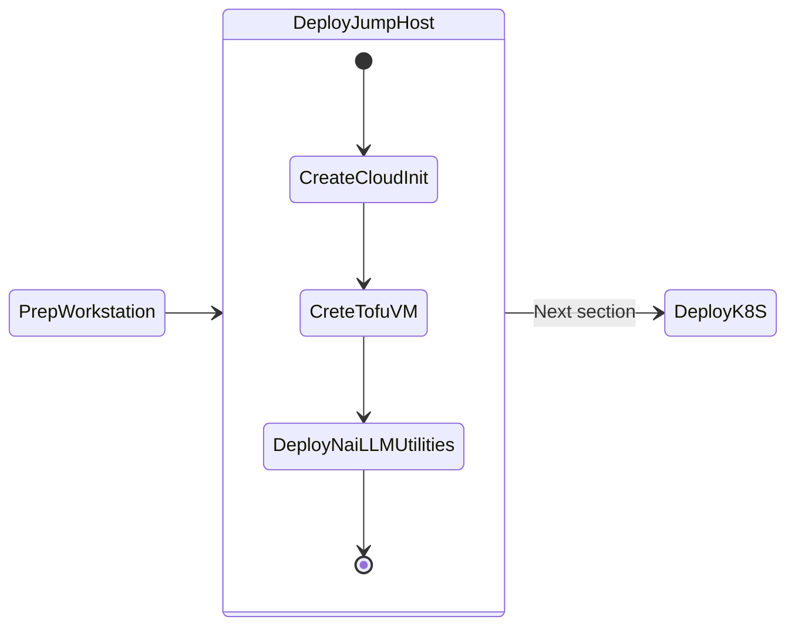

# Deploy Jumphost

We will go through three phases in this section to deploy jumphost VM which you will use to deploy AI applications.

1. **Create CloudInit:** to install tools and bootstrap the jumphost VM using OpenTofu
2. **Create Jumphost VM:** to deploy and manage AI applications using OpenTofu
3. **Deploy Nutanis AI Utilitities:** to bootstrap, deploy and troubleshoot AI applications



## Prerequisites

- Existing Nutanix AHV Subnet configured with IPAM
  
- SSH Private Key for inital `cloud-init` bootstrapping
  - On MacOS/Linux machine, see [Generate a SSH Key on Linux](workstation.md#generate-a-rsa-key-pair) example.
  - On Windows machine, see [Generate a SSH Key on Windows](workstation.md#generate-a-rsa-key-pair) example.
  
- OpenTofu installations, see [instructions](workstation.md#install-opentofu) here.

## Jump Host VM Requirements

The following jump host resources are recommended for the jump host VM:

- Supported OS: `Ubuntu 22.04 LTS`

Minimum System Requirements:

| CPU    | Cores Per CPU | Memory | Storage |
| ------ | ------------- | ------ | ------- |
| 2 vCPU | 4 Cores       | 16 GiB | 300 GiB |

## Create Jump Host VM

We will create a jump host VM using OpenTofu.

1. If you haven't already done so, Open new VSC window, Click on **Open Folder** :material-folder-open: and create new workspace (i.e., ``tofu-workspace``) folder.

2. In VSC Explorer pane, Click on **New Folder** :material-folder-plus-outline:

3. Create a new folder called ``jumphost-tofu``

4. In the ``jumphost-tofu`` folder, click on **New File** :material-file-plus-outline: with the following name
  
    ```bash
    jumphostvm_cloudinit.yaml
    ```

5. Paste the following contents inside the file:

    ```yaml hl_lines="2" title="jumphostvm_cloudinit.yaml"
    #cloud-config
    hostname: nai-llm-jumphost
    package_update: true
    package_upgrade: true
    package_reboot_if_required: true
    packages:
      - open-iscsi
      - nfs-common
    runcmd:
      - systemctl stop ufw && systemctl disable ufw
    users:
      - default
      - name: ubuntu
        groups: sudo
        shell: /bin/bash
        sudo:
          - 'ALL=(ALL) NOPASSWD:ALL'
        ssh-authorized-keys: 
        - ssh-rsa XXXXXX.... # (1)    
    ```

    1. :material-fountain-pen-tip: Copy and paste the contents of your ``~/.ssh/id_rsa.pub`` file or any public key file that you wish to use.

          ---

          If you are using a Mac, the command ``pbcopy``can be used to copy the contents of a file to clipboard.

          ```bash
          cat ~/.ssh/id_rsa.pub | tr -d '\n' | pbcopy
          ```

          ++cmd+"v"++ will paste the contents of clipboard to the console.

    !!!warning
          If needed, make sure to update the target `hostname` and copy / paste the value of the RSA public key in the ``jumphostvm_cloudinit.yaml`` file.

6. Open a terminal within VSC, **Terminal > New Terminal** :octicons-terminal-16:

7. In the terminal, create a base64 decode for your ``jumphostvm_cloudinit.yaml``  yaml file from the VSC terminal

    ```bash
    cat jumphostvm_cloudinit.yaml | base64 | tr -d '\n' # (1)!
    ```

    1. If you are using a Mac, the command ``pbcopy``can be used to copy the contents of a file to clipboard.

        ```bash
        cat jumphostvm_cloudinit.yaml | base64 | tr -d '\n' | pbcopy
        ```

        ++cmd+"v"++ will paste the contents of clipboard to the console/VSC.

8. In VSC Explorer, create a config ``jumphostvm_config.yaml`` file with the following name:

    ```bash
    jumphostvm_config.yaml
    ```

    to define attributes for all your jump host VM with the following content:

    **Also fill in your Nutanix environment access details.** See example file for details

    === "Template file"

          ```yaml title="jumphostvm_config.yaml"
          user: "PC user"                  
          password: "PC password"          
          subnet_name: "PE subnet"         
          cluster_name: "PE Cluster Name"
          endpoint: "PC FQDN"
          name: "nai-llm-jumphost"
          num_vcpus_per_socket: "1"
          num_sockets: "2"
          memory_size_mib: 4096
          disk_list:
            - data_source_reference:
                kind: "image"
                uuid: "nutanix_image.jumpvmimage.id"
          disk_size_mib: 40960
          nic_list:
            - subnet_uuid: "data.nutanix_subnet.subnet.id"
          source_uri: "https://cloud-images.ubuntu.com/releases/22.04/release/ubuntu-22.04-server-cloudimg-amd64.img"
          guest_customization_cloud_init_user_data: "I2Nsb3VkLWNvbmZpZw....." # (1)!
          ```

          1. :material-fountain-pen-tip: copy and paste the output of the command ``cat jumphostvm_cloudinit.yaml | base64 | tr -d '\n'``

    === "Example file"

          ```yaml title="jumphostvm_config.yaml"
          user: "user01"                # < Change this to your >
          password: "XXXXXXXX"
          subnet_name: "VLAN.20"
          cluster_name: "mypecluster"
          endpoint: "pc.example.com"
          name: "nai-llm-jumphost"
          num_vcpus_per_socket: "1"
          num_sockets: "2"
          memory_size_mib: 4096
          disk_list:
            - data_source_reference:
                kind: "image"
                uuid: "nutanix_image.jumpvmimage.id"
          disk_size_mib: 40960
          nic_list:
            - subnet_uuid: "data.nutanix_subnet.subnet.id"
          source_uri: "https://cloud-images.ubuntu.com/releases/22.04/release/ubuntu-22.04-server-cloudimg-amd64.img"
          guest_customization_cloud_init_user_data: "I2Nsb3VkLWNvbmZpZw....." # (1)!
          ```

          2. :material-fountain-pen-tip: copy and paste the output of the command ``cat jumphostvm_cloudinit.yaml | base64 | tr -d '\n'``

    !!!tip
          If you are using a Mac and ``pbcopy`` utility as suggested in the previous command's tip window, ++cmd+"v"++ will paste the contents of clipboard to the console.

    !!!warning
          Make sure to paste the output of the command ``cat jumphostvm_cloudinit.yaml | base64 | tr -d '\n'`` to the ``guest_customization_cloud_init_user_data`` value field

9.  In VSC Explorer, create an image and a VM resource file with the following name
  
    ```bash
    jumphostvm.tf
    ```

    with the following content:

    ```json title="jumphostvm.tf"
    terraform {
      required_providers {
        nutanix = {
          source  = "nutanix/nutanix"
          version = "1.9.5"
        }
      }
    }

    locals {
      config = yamldecode(file("${path.module}/vm_config.yaml"))
    }

    data "nutanix_cluster" "cluster" {
      name = local.config.cluster_name
    }
    data "nutanix_subnet" "subnet" {
      subnet_name = local.config.subnet_name
    }

    provider "nutanix" {
      username     = local.config.user
      password     = local.config.password
      endpoint     = local.config.endpoint
      insecure     = false
      wait_timeout = 60
    }

    resource "nutanix_image" "jumphost-image" {
      name        = "jumpvmimage"
      description = "Jumphost VM image"
      source_uri  = local.config.source_uri
    }

    resource "nutanix_virtual_machine" "nai-llm-jumphost" {
      name                 = local.config.name
      cluster_uuid         = data.nutanix_cluster.cluster.id
      num_vcpus_per_socket = local.config.num_vcpus_per_socket
      num_sockets          = local.config.num_sockets
      memory_size_mib      = local.config.memory_size_mib
      guest_customization_cloud_init_user_data = local.config.guest_customization_cloud_init_user_data
      disk_list {
        data_source_reference = {
          kind = "image"
          uuid = nutanix_image.jumpvmimage.id
        }
        disk_size_mib = local.config.disk_size_mib
      }
      nic_list {
        subnet_uuid = data.nutanix_subnet.subnet.id
      }

      depends_on = [nutanix_image.jumpvmimage]
    }

    output "nai-llm-jumphost-ip-address" {
      value = nutanix_virtual_machine.nai-llm-jumphost.*.nic_list
      description = "Mac address of the jump host vm"
    }
    ```

10. Apply your tofu code to create jump host VM 
  
    ```bash
    tofu validate
    tofu apply 
    ```
    ``` { .bash .no-copy } 
    # Terraform will show you all resources that it will to create
    # Type yes to confirm 
    # Check the output to get the IP address of the VM
    ```

11. Obtain the IP address of the jump host VM from the Tofu output
  
    ``` { .bash .no-copy }
    # Command output

    Apply complete! Resources: 1 added, 0 changed, 0 destroyed.

    Outputs:

    jumpvm_ip_address = [
      tolist([
        {
          "ip_endpoint_list" = tolist([
            {
              "ip" = "10.x.x.x"             ## << This is your jump host VM's IP
              "type" = "ASSIGNED"
            },
    ]
    ```

12. Run the Terraform state list command to verify what resources have been created

    ``` bash
    tofu state list
    ```

    ``` { .bash .no-copy }
    # Sample output for the above command

    data.nutanix_cluster.cluster              # < This is your existing Prism Element cluster
    data.nutanix_subnet.subnet                # < This is your existing primary subnet
    nutanix_image.jumphost-image              # < This is the image file for jump host VM
    nutanix_virtual_machine.nai-llm-jumphost  # < This is the jump host VM
    ```


6. Validate that VM is accessible using **VSC > Terminal** 
  
    ```bash
    ssh -i ~/.ssh/id_rsa ubuntu@<ip-address-from-tofu-output>
    ```

### Create a connection to Jumpbox using VSC

1. From your workstation, open **Visual Studio Code**.

2. Click **View > Command Palette**.

    

3. Click on **+ Add New SSH Host** and t
   
    

4. Type ``ssh ubuntu@jumphost_VM-IP-ADDRESS>``and hit **Enter**.

    

4. Select the location to update the config file.
    
    === "Mac/Linux"

        ```bash
        /Users/<your-username>/.ssh/config
        ```

    === "Windows"
       
        ```PowerShell
        C:\\Users\\<your-username>\\.ssh\\config
        ```
    
5. Open the ssh config file on your workstation to verify the contents. It should be similar to the following content
   
    ```yaml
    Host jumphost
        HostName 10.x.x.x # (1)!
        IdentityFile ~/.ssh/id_rsa # (2)!
        User ubuntu
    ```

    1. :material-fountain-pen-tip: This is Jumphost VM IP address

    2.  :material-fountain-pen-tip: This would be the path to RSA private key generated in the previous [JumpHost](infra_jumphost_tofu.md/#generate-a-ssh-key-on-linuxmac) section

    Now that we have saved the ssh credentials, we are able to connect to the jumphost VM

### Connect to you Jumpbox using VSC

6.  On VS Code, Click **View > Command Palette** and **Connect to Host**

7.  Select the IP address of your jumphost VM

8.  A new Visual Studio Code window will open
    
9.  Click the **Explorer** button from the left-hand toolbar and select **Open Folder**.

    

10. Provide the ``/home/ubuntu/`` as the folder you want to open and click on **OK**.
    
    !!!note
           Ensure that **bin** is NOT highlighted otherwise the editor will attempt to autofill ``/bin/``. You can avoid this by clicking in the path field *before* clicking **OK**.
    
    !!!warning
           The connection may take up to 1 minute to display the root folder structure of the jumphost VM.

11. Accept any warning message about trusting the author of the folder

    

### Install nai-llm utilities

We have compiled a list of utilities that needs to be installed on the jump host VM to use for the rest of the lab. We have affectionately called it as ``nai-llm`` utilities. Use the following method to install these utilities:

1. From VSC terminal, clone Git repo and change working directory

    ```bash
    git clone https://github.com/jesse-gonzalez/nai-llm-fleet-infra
    cd $HOME/nai-llm-fleet-infra/
    ```

2. Run Post VM Create - Workstation Bootstrapping Tasks
  
    ```bash
    sudo snap install task --classic
    task ws:install-packages ws:load-dotfiles --yes -d $HOME/nai-llm-fleet-infra/
    source ~/.bashrc
    ```

3. Change working directory and see ``Task`` help
  
    ```bash
    cd $HOME/nai-llm-fleet-infra/ && task
    ```
    ``` { .bash .no-copy }
    # command output
    task: bootstrap:silent

    Silently initializes cluster configs, git local/remote & fluxcd

    See README.md for additional details on Getting Started

    To see list of tasks, run `task --list` or `task --list-all`

    dependencies:
    - bootstrap:default

    commands:
    - Task: bootstrap:generate_local_configs
    - Task: bootstrap:verify-configs
    - Task: bootstrap:generate_cluster_configs
    - Task: nke:download-creds 
    - Task: flux:init
    ```

We have a jumphost VM now that we will be using to perform the rest of the labs. 