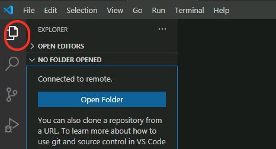

# Deploy Jumphost

We will go through three phases in this section to deploy jumphost VM which you will use to deploy AI applications.

1. **Create Cloud-Init:** needed to bootstrap JumpHost VM on Nutanix AHV using OpenTofu
2. **Create Jumphost VM:** needed to remotely connect and run deployment workflows accessible to Nutanix Infrastructure.
3. **Deploy Nutanix AI Utils:** needed to bootstrap, monitor and troubleshoot Nutanix Cloud-Native AI applications using Gitops across fleet of Nutanix Kubernetes Clusters.


## Prerequisites

- [OpenTofu](https://opentofu.org/) cli, see [installation instructions](workstation.md#install-opentofu) here.
- Existing Nutanix AHV Subnet configured with IPAM
- SSH Public Key needed for initial `cloud-init` bootstrapping
    - On MacOS/Linux machine, see [Generate a SSH Key on Linux](workstation.md#generate-a-rsa-key-pair) example.
    - On Windows machine, see [Generate a SSH Key on Windows](workstation.md#generate-a-rsa-key-pair) example.

## Jump Host VM Requirements

Based on the [Nutanix GPT-in-a-Box](https://opendocs.nutanix.com/gpt-in-a-box/kubernetes/v0.2/getting_started/#spec) specifications, the following system resources are required for the `Jump Host` VM:

- Target OS: `Ubuntu 22.04 LTS`

Minimum System Requirements:

| CPU    | Cores Per CPU | Memory | Storage |
| ------ | ------------- | ------ | ------- |
| 2 vCPU | 4 Cores       | 16 GiB | 300 GiB |

## Create Jump Host VM

In the following section, we will create a `Jump Host` VM on Nutanix AHV using both `Visual Studio Code (VSCode)` and `OpenTofu`.

1. Open `VSCode`, Go to File -> **New Window** :material-dock-window:, Click on **Open Folder** :material-folder-open: and create new workspace folder (i.e., ``tofu-workspace``).

2. In `VSCode` Explorer pane, Click on **New Folder** :material-folder-plus-outline: and name it: ``jumphost-vm``

3. In the ``jumphost-vm`` folder, click on **New File** :material-file-plus-outline: with the following name
  
    ```bash
    cloud-init.yaml
    ```

4. Paste the following contents inside the file:

    ```yaml hl_lines="2 19" title="cloud-init.yaml"
    #cloud-config
    hostname: nai-llm-jumphost
    package_update: true
    package_upgrade: true
    package_reboot_if_required: true
    packages:
      - open-iscsi
      - nfs-common
    runcmd:
      - systemctl stop ufw && systemctl disable ufw
    users:
      - default
      - name: ubuntu
        groups: sudo
        shell: /bin/bash
        sudo:
          - 'ALL=(ALL) NOPASSWD:ALL'
        ssh-authorized-keys: 
        - ssh-rsa XXXXXX.... # (1)    
    ```

    1. :material-fountain-pen-tip: Copy and paste the contents of your ``~/.ssh/id_rsa.pub`` file or any public key file that you wish to use.

          ---

          If you are using a Mac, the command ``pbcopy``can be used to copy the contents of a file to clipboard.

          ```bash
          cat ~/.ssh/id_rsa.pub | tr -d '\n' | pbcopy
          ```

          ++cmd+"v"++ will paste the contents of clipboard to the console.

    !!!warning
          If needed, make sure to update the target `hostname` and copy / paste the value of the RSA public key in the ``cloudinit.yaml`` file.

5. In `VSCode` Explorer, within the ``jumphost-vm`` folder, click on **New File** :material-file-plus-outline: and create a config file with the following name:

    ```bash
    jumphostvm_config.yaml
    ```

    **Update Nutanix environment access details along with any Jump Host VM configurations.** See example file for details

    === "Template file"

          ```yaml hl_lines="1-6" title="jumphostvm_config.yaml"       
          endpoint: "PC FQDN"
          user: "PC user"                  
          password: "PC password"          
          cluster_name: "PE Cluster Name"  
          subnet_name: "PE subnet"  
          name: "nai-llm-jumphost"
          num_vcpus_per_socket: "4"
          num_sockets: "2"
          memory_size_mib: 16384
          disk_size_mib: 307200
          source_uri: "https://cloud-images.ubuntu.com/releases/22.04/release/ubuntu-22.04-server-cloudimg-amd64.img"
          ```

    === "Example file"

          ```yaml hl_lines="1-6" title="jumphostvm_config.yaml"
          endpoint: "pc.example.com"    # < Change to PC endpoint >
          user: "user01"                # < Change to PC admin user> 
          password: "XXXXXXXX"          # < Change to PC admin pass>
          cluster_name: "mypecluster"   # < Change to PE element cluster name >
          subnet_name: "VLAN.20"        # < Change to PE element subnet name >
          name: "nai-llm-jumphost" # (1)!
          num_vcpus_per_socket: "4"
          num_sockets: "2"
          memory_size_mib: 16384
          disk_size_mib: 307200
          source_uri: "https://cloud-images.ubuntu.com/releases/22.04/release/ubuntu-22.04-server-cloudimg-amd64.img"
          ```

          1. :material-vector-difference: make sure to update `hostname` with same name defined within `cloudinit.yaml`.

    !!!tip
          If you are using a Mac and ``pbcopy`` utility as suggested in the previous command's tip window, ++cmd+"v"++ will paste the contents of clipboard to the console.

6. In `VSCode` Explorer pane, navigate to the ``jumphost-vm`` folder, click on **New File** :material-file-plus-outline: and create a opentofu manifest file with the following name:

    ```bash
    jumphostvm.tf
    ```

    with the following content:

    ```json title="jumphostvm.tf"
    terraform {
      required_providers {
        nutanix = {
          source  = "nutanix/nutanix"
          version = "1.9.5"
        }
      }
    }

    locals {
      config = yamldecode(file("${path.module}/jumphostvm_config.yaml"))
    }

    data "nutanix_cluster" "cluster" {
      name = local.config.cluster_name
    }
    data "nutanix_subnet" "subnet" {
      subnet_name = local.config.subnet_name
    }

    provider "nutanix" {
      username     = local.config.user
      password     = local.config.password
      endpoint     = local.config.endpoint
      insecure     = true
      wait_timeout = 60
    }

    resource "nutanix_image" "machine-image" {
      name        = element(split("/", local.config.source_uri), length(split("/", local.config.source_uri)) - 1)
      description = "opentofu managed image"
      source_uri  = local.config.source_uri
    }

    resource "nutanix_virtual_machine" "nai-llm-jumphost" {
      name                 = local.config.name
      cluster_uuid         = data.nutanix_cluster.cluster.id
      num_vcpus_per_socket = local.config.num_vcpus_per_socket
      num_sockets          = local.config.num_sockets
      memory_size_mib      = local.config.memory_size_mib
      guest_customization_cloud_init_user_data = base64encode(file("${path.module}/cloud-init.yaml"))
      disk_list {
        data_source_reference = {
          kind = "image"
          uuid = nutanix_image.machine-image.id
        }
        disk_size_mib = local.config.disk_size_mib
      }
      nic_list {
        subnet_uuid = data.nutanix_subnet.subnet.id
      }

      depends_on = [nutanix_image.machine-image]
    }

    output "nai-llm-jumphost-ip-address" {
      value = nutanix_virtual_machine.nai-llm-jumphost.nic_list_status[0].ip_endpoint_list[0].ip
      description = "IP address of the Jump Host vm"
    }
    ```

7. Open a terminal within `VSCode`, **Terminal > New Terminal** :octicons-terminal-16:

8. Initialize and Validate your tofu code

    ```bash
    tofu -chdir=tofu-workspace/jumphost-vm init -upgrade
    ```

    ```bash
    tofu -chdir=tofu-workspace/jumphost-vm validate
    ```

9. Apply your tofu code to create Jump Host VM
  
    ```bash
    tofu -chdir=tofu-workspace/jumphost-vm apply 
    ```

    Type ``yes`` to confirm

10. Obtain the IP address of the `Jump Host` VM from the Tofu output
  
    ``` { .bash .no-copy }
    Outputs:

    nai-llm-jumphost-ip-address = "10.x.x.x"
    ```

11. Run the Terraform state list command to verify what resources have been created

    ``` bash
    tofu state list
    ```

    ``` { .bash .no-copy }
    # Sample output for the above command

    data.nutanix_cluster.cluster              # < This is your existing Prism Element cluster
    data.nutanix_subnet.subnet                # < This is your existing primary subnet
    nutanix_image.machine-image               # < This is the image file for `Jump Host` VM
    nutanix_virtual_machine.nai-llm-jumphost  # < This is the `Jump Host` VM
    ```

12. Validate that the `Jump Host` VM is accessible using **VSCode > Terminal** :octicons-terminal-24:
  
    === "Command"

        ```bash
        ssh -i ~/.ssh/id_rsa ubuntu@<ip-address-from-tofu-output>
        ``` 
    === "Command Sample"

        ```bash
        ssh -i ~/.ssh/id_rsa ubuntu@10.x.x.171
        ```     

### Initiate Remote-SSH Connection to Jumpbox using VSCode

1. In VSCode, click on Settings menu icon (gear icon) :gear: > **Settings** > **Extensions**
2. In the search window search for **Remote SSH**
3. Install the [Remote-SSH Extension](https://marketplace.visualstudio.com/items?itemName=ms-vscode-remote.remote-ssh) from VSCode Marketplace
4. click on the **Install** button for the extenstion.

5. From your workstation, open **Visual Studio Code**.

6. Click **View > Command Palette**.

    

7. Click on **+ Add New SSH Host** and t

    

8. Type ``ssh ubuntu@jumphost_VM-IP-ADDRESS>``and hit **Enter**.

    

9. Select the location to update the config file.

    === "Mac/Linux"

        ```bash
        /Users/<your-username>/.ssh/config
        ```

    === "Windows"

        ```PowerShell
        C:\\Users\\<your-username>\\.ssh\\config
        ```

10. Open the ssh config file on your workstation to verify the contents. It should be similar to the following content

    ```yaml
    Host jumphost
        HostName 10.x.x.x # (1)!
        IdentityFile ~/.ssh/id_rsa # (2)!
        User ubuntu
    ```

    1. :material-fountain-pen-tip: This is Jumphost VM IP address

    2. :material-fountain-pen-tip: This would be the path to RSA private key generated in the previous [JumpHost](../infra/workstation.md#generate-a-rsa-key-pair) section

    Now that we have saved the ssh credentials, we are able to connect to the jumphost VM

### Connect to you Jumpbox using VSCode

1. On `VSCode`, Click **View > Command Palette** and **Connect to Host**

2. Select the IP address of your `Jump Host` VM

3. A **New Window** :material-dock-window: will open in `VSCode`

4. Click the **Explorer** button from the left-hand toolbar and select **Open Folder**.

    

5. Provide the ``$HOME/`` as the folder you want to open and click on **OK**.

    !!!note
           Ensure that **bin** is NOT highlighted otherwise the editor will attempt to autofill ``/bin/``. You can avoid this by clicking in the path field *before* clicking **OK**.

    !!!warning
           The connection may take up to 1 minute to display the root folder structure of the jumphost VM.

6. Accept any warning message about trusting the author of the folder

    

## Install Utilities on Jumphost VM

We have compiled a list of utilities that needs to be installed on the jumphost VM to use for the rest of the lab. We have affectionately called it as ``nai-llm`` utilities. Use the following method to install these utilities:

1. Using `VSCode`, open `Terminal` :octicons-terminal-24: on the `Jump Host` VM

2. Install `devbox` using the following command and accept all defaults

    ```sh
    curl -fsSL https://get.jetpack.io/devbox | bash
    ```

3. From the ``$HOME`` directory, clone the ``nai-llm-fleet-infra`` git repo and change working directory

    ```bash
    git clone https://github.com/_your_github_org/nai-llm-fleet-infra.git
    cd $HOME/nai-llm-fleet-infra/
    ```

4. Start the `devbox shell`. If `nix` isn't available, you will be prompted to install:

    ```sh
    cd $HOME/nai-llm-fleet-infra/
    devbox init
    devbox shell
    ```

5. Run Post VM Create - Workstation Bootstrapping tasks
  
    ```bash
    sudo snap install task --classic
    task ws:install-packages ws:load-dotfiles --yes -d $HOME/nai-llm-fleet-infra/
    source ~/.bashrc
    ```

6. Change working directory and see ``Task`` help
  
    ```bash
    cd $HOME/nai-llm-fleet-infra/ && task
    ```

    ``` { .bash .no-copy }
    # command output
    task: bootstrap:silent

    Silently initializes cluster configs, git local/remote & fluxcd

    See README.md for additional details on Getting Started

    To see list of tasks, run `task --list` or `task --list-all`

    dependencies:
    - bootstrap:default

    commands:
    - Task: bootstrap:generate_local_configs
    - Task: bootstrap:verify-configs
    - Task: bootstrap:generate_cluster_configs
    - Task: nke:download-creds 
    - Task: flux:init
    ```

## [OPTIONAL] Fork and Clone GiaB NVD Gitops Repository

!!! warning
    The following steps are only required if Deploying [GPT-In-A-Box v1](../llmmgmt/index.md) using NVD GitOps workflow

1. Open the following URL and fork the repo to your Github org

    ```url
    https://github.com/jesse-gonzalez/nai-llm-fleet-infra
    ```

2. From the ``$HOME`` directory, clone the fork of your ``nai-llm-fleet-infra`` git repo and change working directory

    === "Command"

        ```bash
        git clone https://github.com/<_your_github_org>/nai-llm-fleet-infra.git
        cd $HOME/nai-llm-fleet-infra/
        ```

    === "Sample command"

        ```bash
        git clone https://github.com/rahuman/nai-llm-fleet-infra.git
        cd $HOME/nai-llm-fleet-infra/
        ```

3. Finally set your github config

    ```bash
    git config --user.email "your_github_email"
    git config --user.name "your_github_username"
    ```

4. In ``VSCode`` > ``Terminal`` Login to your Github account using the following command:

    ```bash
    gh auth login # (1)
    ```

    1.  :material-fountain-pen-tip:  If you do not have ``gh`` client installed, see [Github CLI Installation Docs](https://github.com/cli/cli/blob/trunk/docs/install_linux.md).

    ```{ .text, .no-copy }
    # Execution example

    ❯ gh auth login                                                                                                               ─╯
    ? What account do you want to log into? GitHub.com
    ? What is your preferred protocol for Git operations on this host? HTTPS 
    ? Authenticate Git with your GitHub credentials? Yes
    ? How would you like to authenticate GitHub CLI?  [Use arrows to move, type to filter]
        Login with a web browser
    >   Paste an authentication token

    Successfully logged in to Github.
    ```

Now the jumphost VM is ready for deploying our app. We will do this in the next section.
