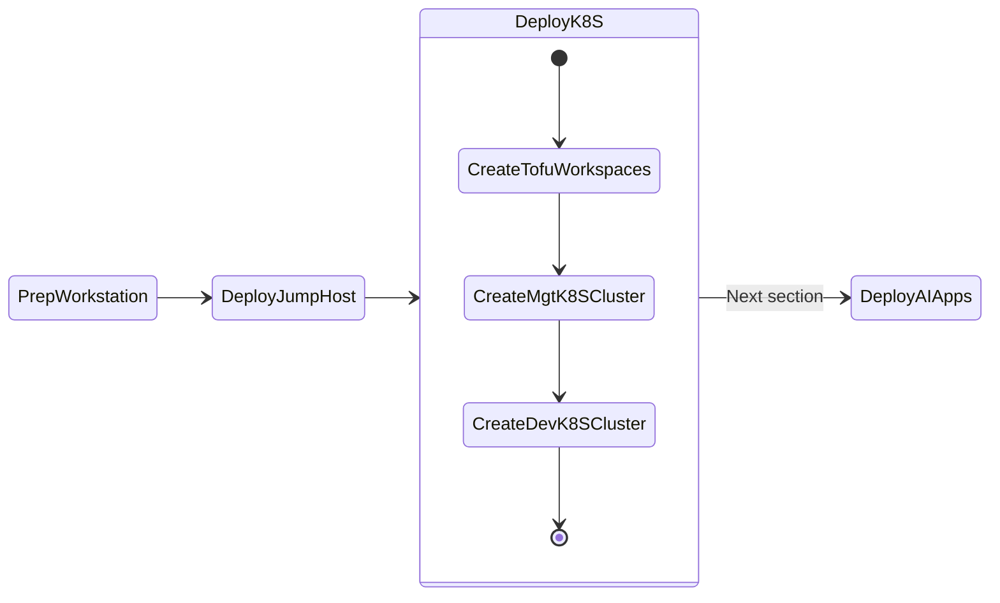
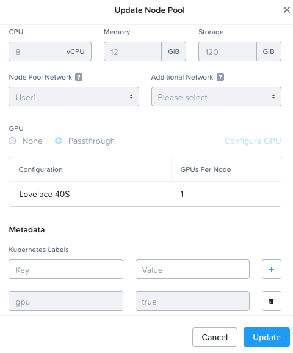

# Deploy NKE Clusters

This section will take you through install NKE(Kubernetes) on Nutanix cluster as we will be deploying AI applications on these kubernetes clusters. 

This section will expand to other available Kubernetes implementations on Nutanix.




## NKE Setup

We will use Infrastructure as Code framework to deploy NKE kubernetes clusters. 

## Pre-requisites

- Prism Central is at least version ``2023.4``
- NKE is enabled on Nutanix Prism Central
- NKE is at at least version ``2.9`` (updated through LCM)
- NKE Node OS is at least version `ntnx-1.6.1`
- NKE Kubernetes is at least version `1.25.6-1`
- Monitoring on each NKE Cluster is **ENABLED**

## NKE High Level Cluster Design

The `Management` NKE cluster will be a centralized cluster that the AI applications on each Workload NKE cluster will be leveraged for automation and observability.

The `Workload` NKE cluster will be hosting the LLM model serving endpoints and AI application stack. This cluster and will require a dedicated GPU node pool.  

We will create a 1 x NKE cluster for Management and at min. 1 x NKE cluster for the DEV Workloads.

Once DEV deployment has been tested successfully, we can deploy applications to optional PROD Workload cluster.

### Management Cluster

Since the Management Cluster will be essential to all AI application workloads, we will deploy an NKE cluster of type "Production".

| Role   | No. of Nodes (VM) | vCPU | RAM   | Storage |
| ------ | ----------------- | ---- | ----- | ------- |
| Master | 2                 | 8    | 16 GB | 120 GB  |
| ETCD   | 3                 | 4    | 8 GB  | 120 GB  |
| Worker | 3                 | 12   | 16 GB | 300 GB  |

### Dev Workload Cluster

For Dev, we will deploy an NKE Cluster of type "Development".

| Role   | No. of Nodes (VM) | vCPU | RAM   | Storage |
| ------ | ----------------- | ---- | ----- | ------- |
| Master | 1                 | 8    | 16 GB | 120 GB  |
| ETCD   | 1                 | 4    | 8 GB  | 120 GB  |
| Worker | 3                 | 12   | 16 GB | 300 GB  |
| GPU    | 2                 | 12   | 40 GB | 300 GB  |

### Prod Workload Cluster

For Prod, we will deploy an NKE Cluster of type "Production".

| Role   | No. of Nodes (VM) | vCPU | RAM   | Storage |
| ------ | ----------------- | ---- | ----- | ------- |
| Master | 2                 | 8    | 16 GB | 120 GB  |
| ETCD   | 3                 | 4    | 8 GB  | 120 GB  |
| Worker | 3                 | 12   | 16 GB | 300 GB  |
| GPU    | 2                 | 12   | 40 GB | 300 GB  |

## Create TOFU Manifest file

1. In VSC, change to the ``tofu`` folder
  
2. In the ``tofu`` folder, create a tofu manifest file ``main.tf`` in VSC explorer pane

    ```bash
    main.tf
    ```

    with the following content:

    ```json title="main.tf"
    terraform {
      required_providers {
        nutanix = {
          source  = "nutanix/nutanix"
          version = "1.9.1"
        }
      }
    }

    locals {
      config = yamldecode(file("${path.module}/.env.${terraform.workspace}.yaml"))
    }

    data "nutanix_cluster" "cluster" {
      name = local.config.prism_element.cluster_name
    }

    data "nutanix_subnet" "subnet" {
      subnet_name = local.config.prism_element.subnet_name
    }

    provider "nutanix" {
      username     = local.config.prism_central.user
      password     = local.config.prism_central.password
      endpoint     = local.config.prism_central.endpoint
      insecure     = false
      wait_timeout = 60
    }

    resource "nutanix_karbon_cluster" "nke_cluster" {
      name       = terraform.workspace
      version    = local.config.nke.k8s_version
      storage_class_config {
        reclaim_policy = "Delete"
        volumes_config {
          file_system                = "ext4"
          flash_mode                 = false
          prism_element_cluster_uuid = data.nutanix_cluster.cluster.id
          storage_container          = local.config.prism_element.storage_container
          username                   = local.config.prism_element.user
          password                   = local.config.prism_element.password
        }
      }

      cni_config {
        node_cidr_mask_size = 24
        pod_ipv4_cidr       = "172.20.0.0/16"
        service_ipv4_cidr   = "172.19.0.0/16"
      }

      worker_node_pool {
        node_os_version = local.config.nke.node_os_version 
        num_instances   = local.config.nke.worker.num_instances
        ahv_config {
          cpu = local.config.nke.worker.cpu_count
          memory_mib = local.config.nke.worker.memory_gb * 1024
          disk_mib = local.config.nke.worker.disk_gb * 1024
          network_uuid               = data.nutanix_subnet.subnet.id
          prism_element_cluster_uuid = data.nutanix_cluster.cluster.id
        }
      }

      etcd_node_pool {
        node_os_version = local.config.nke.node_os_version 
        num_instances   = local.config.nke.etcd.num_instances
        ahv_config {
          cpu = local.config.nke.etcd.cpu_count
          memory_mib = local.config.nke.etcd.memory_gb * 1024
          disk_mib = local.config.nke.etcd.disk_gb * 1024
          network_uuid               = data.nutanix_subnet.subnet.id
          prism_element_cluster_uuid = data.nutanix_cluster.cluster.id
        }
      }

      master_node_pool {
        node_os_version = local.config.nke.node_os_version 
        num_instances   = local.config.nke.master.num_instances
        ahv_config {
          cpu = local.config.nke.master.cpu_count
          memory_mib = local.config.nke.master.memory_gb * 1024
          disk_mib = local.config.nke.master.disk_gb * 1024
          network_uuid               = data.nutanix_subnet.subnet.id
          prism_element_cluster_uuid = data.nutanix_cluster.cluster.id
        }
      }
      
      timeouts {
        create = "1h"
        update = "30m"
        delete = "10m"
      }

    }
    ```

## Deploying Management Cluster

1. Create TOFU workspace for Management NKE Cluster
  
    ```bash
    tofu workspace new mgmt-cluster
    ```

2. In VSC, Create the Management NKE cluster config file

    ```bash
    .env.mgmt-cluster.yaml
    ```

    with the following content:

    ```yaml hl_lines="27" title=".env.mgmt-cluster.yaml"
    prism_central:
      endpoint: <PC FQDN>
      user: <PC user>
      password: <PC password>

    prism_element:
      cluster_name: <PE Cluster Name>
      storage_container: default
      subnet_name: <PE Subnet>
      user: <PE user>
      password: <PE password>

    nke:
      k8s_version: 1.25.6-1
      node_os_version: ntnx-1.6.1
      master:
        num_instances: 1
        cpu_count: 8
        memory_gb: 16
        disk_gb: 300
      etcd:
        num_instances: 1
        cpu_count: 4
        memory_gb: 8
        disk_gb: 300
      worker:
        num_instances: 3
        cpu_count: 12
        memory_gb: 16
        disk_gb: 300
    ```

3. Initialize and Validate your tofu code

    ```bash
    tofu init -upgrade

    # OpenTofu will initialize the Nutanix provider
    ```

    ```bash
    tofu validate

    # OpenTofu will validate configurations
    ```

4. Apply your tofu code to create NKE cluster, associated virtual machines and other resources
  
    ```bash
    tofu apply 

    # OpenTofu will show you all resources that it will to create
    # Type yes to confirm 
    ```

5. Run the OpenTofu state list command to verify what resources have been created

    ``` bash
    tofu state list
    ```

    ``` { .bash .no-copy }
    # Sample output for the above command

    data.nutanix_cluster.cluster              # < This is your existing Prism Element cluster
    data.nutanix_subnet.subnet                # < This is your existing primary subnet
    nutanix_image.jumphost-image              # < This is the image file for jump host VM
    nutanix_virtual_machine.nai-llm-jumphost  # < This is the jump host VM
    nutanix_karbon_cluster.mgt_cluster        # < This is your Management NKE cluster
    ```

## Deploying DEV cluster

The DEV cluster will contain GPU node pool to deploy your AI apps.

1. Create TOFU workspace for DEV NKE Cluster
  
    ```bash
    tofu workspace new dev-cluster
    ```

2. Create the Management NKE cluster config.yaml 
   
    ???tip
          The previous ``.env.mgmt-cluster.yaml`` could be copied 

          ```bash
          cp .env.mgmt-cluster.yaml .env.dev-cluster.yaml
          ```

    ```bash
    .env.dev-cluster.yaml
    ```

    with the following content:

    ```yaml hl_lines="27" title=".env.dev-cluster.yaml"
    prism_central:
      endpoint: <PC FQDN>
      user: <PC user>
      password: <PC password>

    prism_element:
      cluster_name: <PE Cluster Name>
      storage_container: default
      subnet_name: <PE Subnet>
      user: <PE user>
      password: <PE password>

    nke:
      k8s_version: 1.25.6-1
      node_os_version: ntnx-1.6.1
      master:
        num_instances: 1
        cpu_count: 8
        memory_gb: 16
        disk_gb: 300
      etcd:
        num_instances: 1
        cpu_count: 4
        memory_gb: 8
        disk_gb: 300
      worker:
        num_instances: 3
        cpu_count: 12
        memory_gb: 16
        disk_gb: 300
    ```

3. Validate your tofu code

    ```bash
    tofu validate

    # OpenTofu will validate configurations
    ```

4. Apply your tofu code to create NKE cluster, associated virtual machines and other resources
  
    ```bash
    tofu apply

    # OpenTofu will show you all resources that it will to create
    # Type yes to confirm 
    ```

5. Run the Terraform state list command to verify what resources have been created

    ``` bash
    tofu state list
    ```

    ``` { .bash .no-copy }
    # Sample output for the above command

    data.nutanix_cluster.cluster              # < This is your existing Prism Element cluster
    data.nutanix_subnet.subnet                # < This is your existing primary subnet
    nutanix_image.jumphost-image              # < This is the image file for jump host VM
    nutanix_virtual_machine.nai-llm-jumphost  # < This is the jump host VM
    nutanix_karbon_cluster.mgt-cluster        # < This is your Management NKE cluster
    nutanix_karbon_cluster.dev-cluster        # < This is your Dev NKE cluster
    ```

### Adding NodePool with GPU

In this section we will create a nodepool to host the AI apps with a GPU. 

!!!note
       At this time there is no `tofu` support for creating a ``nodepool`` with GPU parameters. We will use NKE's `karbonctl` tool. Once tofu nodepool resource is updated with gpu parameters, we will update this section.

It is necessary to connect to Prism Central (PC) to be able to access the `karbonctl` tool.

1. Login to the ssh session of PC

    ```bash
    ssh -l admin pc.example.com
    ```

2. Login to NKE control plane using karbonctl tool

    ```bash
    alias karbonctl=/home/nutanix/karbon/karbonctl
    karbonctl login --pc-username admin
    ```

3. Check the number of available GPUs for Dev NKE cluster

    ```bash
    karbonctl cluster gpu-inventory list --cluster-name dev-cluster
    ```

    ```bash title="Command execution"
    PCVM:~$ karbonctl cluster gpu-inventory list --cluster-name dev-cluster
    Name            Total Count    Assignable Count
    Lovelace 40S    8              2
    ```

4. Create a new gpu nodepool and assing it 1 GPU

    ```bash
    karbonctl cluster node-pool add --cluster-name dev-cluster --count 2 --cpu 12 --memory 40 --gpu-count 1 --gpu-name "Lovelace 40S" --node-pool-name gpu
    ```

    ```bash title="Command execution"
    PCVM:~$ karbonctl cluster node-pool add --cluster-name dev-cluster --count 2 --cpu 12 --memory 40 --gpu-count 1 --gpu-name "Lovelace 40S" --node-pool-name gpu
    
    I acknowledge that GPU enablement requires installation of NVIDIA datacenter driver software governed by NVIDIA licensing terms. Y/[N]:Y
    
    Successfully submitted request to add a node pool: [POST /karbon/v1-alpha.1/k8s/clusters/{name}/add-node-pool][202] addK8sClusterNodePoolAccepted  &{TaskUUID:0xc001168e50}
    ```

5. Monitor PC tasks to confirm creation on VM and allocation of GPU to the VM

6. Once nodepool is created, go to **PC > Kubernetes Management > dev-cluster > Node Pools** and select **gpu** nodepool

7. Click on update in the drop-down menu

8. You should see that one GPU is assigned to node pool

    

We now have a node that can be used to deploy AI applications and use the GPU.
