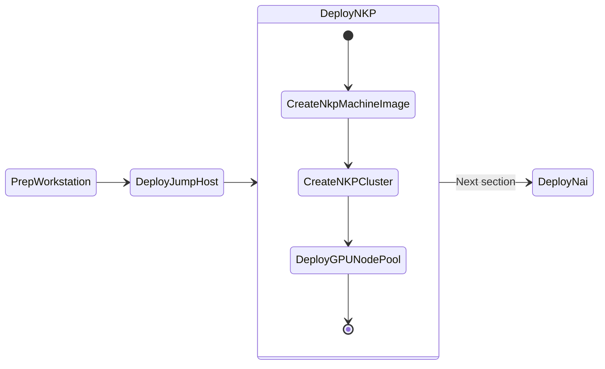

# Deploy NKP Clusters

This section will take you through install NKP(Kubernetes) on Nutanix cluster as we will be deploying AI applications on these kubernetes clusters. 

This section will expand to other available Kubernetes implementations on Nutanix.



## NKP High Level Cluster Design

The `Bootstrap` NKP cluster will be a [kind](https://kind.sigs.k8s.io/) cluster that will be used to deploy the ``nkpdev`` cluster. This will be deployed during the install automatically when the ``nkp create cluster nutanix`` command is run with the ``--self-managed`` option

The ``nkpdev`` cluster will be hosting the LLM model serving endpoints and AI application stack. This cluster and will require a dedicated GPU node pool.

Once ``nkpdev`` deployment has been tested successfully, we can deploy applications to optional PROD Workload cluster.

### Bootstrap Cluster

Since the Bootstrap Cluster will be essential to deploying a workload nkpdev cluster. We will use ``kind`` cluster packaged by Nutanix. ``kind`` is already installed on the jumphost VM and be accessed using ``devbox shell``.

### Dev Workload Cluster

For ``nkpdev``, we will deploy an NKP Cluster of type "Development".

| Role   | No. of Nodes (VM) | vCPU | RAM   | Storage |
| ------ | ----------------- | ---- | ----- | ------- |
| Control plane | 3                 | 4    | 16 GB | 150 GB  |
| Worker | 4                | 8   | 32 GB | 150 GB  |
| GPU    | 1                 | 16   | 64 GB | 200 GB  |

## Pre-requisites for NKP Deployment

1. Existing Ubuntu/Rocky Linux jumphost VM. See here for jumphost installation [steps](../infra/infra_jumphost_tofu.md).
2. [Docker](#setup-docker-on-jumphost) or Podman installed on the jumphost VM
3. Nutanix PC is at least ``2024.1``
4. Nutanix AOS is at least ``6.5``,``6.8+``
5. Download and install ``nkp`` binary from Nutanix Portal
6. Find and reserve 3 IPs for control plane and MetalLB access from AHV network
7. Find GPU details from Nutanix cluster
8. Create a base image to use with NKP nodes using ``nkp`` command

### Install NKP Binaries

1. Login to [Nutanix Portal](https://portal.nutanix.com/page/downloads?product=nkp) using your credentials
2. Go to **Downloads** > **Nutanix Kubernetes Platform (NKP)**
3. Select NKP for Linux and copy the download link to the ``.tar.gz`` file
4. If you haven't already done so, Open new `VSCode` window on your jumphost VM

5. In `VSCode` Explorer pane, click on existing ``/home/ubuntu`` folder

6. Click on **New Folder** :material-folder-plus-outline: name it: ``nkp``

7. On `VSCode` Explorer plane, click the ``/home/ubuntu/nkp`` folder

8. On `VSCode` menu, select ``Terminal`` > ``New Terminal``

9. Browse to ``nkp`` directory

    ```bash
    cd $HOME/nkp
    ```

10. Download and extract the NKP binary from the link you copied earlier
    
    === "Command"

        ```text title="Paste the download URL within double quotes"
        curl -o nkp_v2.12.0_linux_amd64.tar.gz "_paste_download_URL_here"
        ```

    === "Sample command"
        
        ```bash
        curl -o nkp_v2.12.0_linux_amd64.tar.gz "https://download.nutanix.com/downloads/nkp/v2.12.0/nkp_v2.12.0_linux_amd64.tar.gz?Expires=1729016864&........"
        ```

    ```bash
    gunzip nkp_v2.12.0_linux_amd64.tar.gz
    tar -xvf nkp_v2.12.0_linux_amd64.tar
    ```

11. Move the ``nkp`` binary to a directory that is included in your ``PATH`` environment variable

    ```bash
    sudo mv nkp /usr/local/bin/
    ```

12. Verify the ``nkp`` binary is installed correctly. Ensure the version is latest
    
    !!! note
        
        At the time of writing this lab nkp version is v2.12.0

    === "Command"

        ```bash
        nkp version
        ```

    === "Command output"
      
        ```{ .bash .no-copy }
        $ nkp version
        diagnose: v0.10.1
        imagebuilder: v0.13.1
        kommander: v2.12.0
        konvoy: v2.12.0
        mindthegap: v1.13.1
        nkp: v2.12.0
        ```

### Setup Docker on Jumphost

1. From VSC, logon to your jumpbox VM
2. Open VSC Terminal
3. Run the following commands to install ``docker`` binaries

    ```bash
    cd /home/ubuntu/nai-llm-fleet-infra/; devbox init; devbox shell
    task workstation:install-docker
    ```

    !!! tip
        
        Restart the jumpbox host if ``ubuntu`` user has permission issues using ``docker`` commands.

### Reserve Control Plane and MetalLB Endpoint IPs 

Nutanix AHV IPAM network allows you to black list IPs that needs to be reserved for specific application endpoints. We will use this feature to find and reserve three IPs. 

We will need a total of three IPs for the following:

  
| Cluster Role  | Cluster Name            |    Control Plane IP   |    MetalLB  IP  |          
| -------------  | --------            |  ------------ |  --------   | 
| Dev  |``nkpdev``       |  1             |  2        |  

1. Get the CIDR range for the AHV network(subnet) where the application will be deployed

    ```buttonless title="CIDR example for your Nutanix cluster"
    10.x.x.0/24
    ```

2. From VSC, logon to your jumpbox VM and open Terminal

3. Install ``nmap`` tool (if not already done)

    ```bash
    cd /home/ubuntu/nai-llm-fleet-infra
    devbox add nmap
    ```

4. Find three unused static IP addresses in the subnet

    === "Command"

        ```bash
        nmap -v -sn  <your CIDR>
        ```

    === "Sample command"

        ```bash 
        nmap -v -sn 10.x.x.0/24
        ```

    ```text title="Sample output - choose the first three consecutive IPs"
    Nmap scan report for 10.x.x.214 [host down]
    Nmap scan report for 10.x.x.215 [host down]
    Nmap scan report for 10.x.x.216 [host down]
    Nmap scan report for 10.x.x.217
    Host is up (-0.098s latency).
    ```

5. Logon to any CVM in your Nutanix cluster and execute the following to add chosen static IPs to the AHV IPAM network

    - **Username:** nutanix
    - **Password:** your Prism Element password 

    === "Command"
    
        ```text
        acli net.add_to_ip_blacklist <your-ipam-ahv-network> \
        ip_list=10.x.x.214,10.x.x.215,10.x.x.216
        ```

    === "Sample command"

         ```text
         acli net.add_to_ip_blacklist User1 \
         ip_list=10.x.x.214,10.x.x.215,10.x.x.216
         ```

## Create Base Image for NKP

In this section we will go through creating a base image for all the control plane and worker node VMs on Nutanix.

1. In VSC Explorer pane, Click on **New Folder** :material-folder-plus-outline:

2. Call the folder ``nkp`` under ``/home/ubuntu`` directory

3. In the ``nkp`` folder, click on **New File** :material-file-plus-outline: and create new file with the following name:
  
    ```bash
    .env
    ```

4. Fill the following values inside the ``.env`` file

    === "Template .env"

        ```text
        export NUTANIX_USER=_your_nutanix_username
        export NUTANIX_PASSWORD=_your_nutanix_password
        export NUTANIX_ENDPOINT=_your_prism_central_fqdn
        export NUTANIX_CLUSTER=_your_prism_element_cluster_name
        export NUTANIX_SUBNET_NAME=_your_ahv_ipam_network_name
        export STORAGE_CONTAINER=_your_storage_container_nmae
        export SSH_PUBLIC_KEY=_your_path_to_ssh_pub_key
        export NKP_CLUSTER_NAME=_your_nkp_cluster_name
        export CONTROLPLANE_VIP=_your_nkp_cluster_controlplane_ip
        export LB_IP_RANGE=_your_range_of_two_ips
        export GPU_NAME=_gpu_name_from_previous_section
        ```

    === "Sample .env"

        ```text
        export NUTANIX_USER=admin
        export NUTANIX_PASSWORD=xxxxxxxx
        export NUTANIX_ENDPOINT=pc.example.com
        export NUTANIX_CLUSTER=pe
        export NUTANIX_SUBNET_NAME=User1
        export STORAGE_CONTAINER=default
        export SSH_PUBLIC_KEY=/home/ubuntu/.ssh/id_rsa.pub
        export NKP_CLUSTER_NAME=nkpdev
        export CONTROLPLANE_VIP=10.x.x.214
        export LB_IP_RANGE=10.x.x.215-10.x.x.216
        export GPU_NAME="Lovelace 40S"
        ```

5. Using VSC Terminal, load the environment variables and its values

    ```bash
    cd /home/ubuntu/nkp
    source .env
    ```

6. Create the base image and upload to Prism Central using the following command. 

    !!!note 
           Image creation will take up to 5 minutes.

    === "Command"

        ```bash
        nkp create image nutanix ubuntu-22.04 \
          --endpoint ${NUTANIX_ENDPOINT} --cluster ${NUTANIX_CLUSTER} \
          --subnet ${NUTANIX_SUBNET_NAME} --insecure
        ```

    === "Command output"

        ```{ .text .no-copy }
        nkp create image nutanix ubuntu-22.04 \ 
        --endpoint ${NUTANIX_ENDPOINT} --cluster ${NUTANIX_CLUSTER} \
        --subnet ${NUTANIX_SUBNET_NAME} --insecure
        
        > Provisioning and configuring image
        Manifest files extracted to /home/ubuntu/nkp/.nkp-image-builder-3243021807
        nutanix.kib_image: output will be in this color.

        ==> nutanix.kib_image: Creating Packer Builder virtual machine...
            nutanix.kib_image: Virtual machine nkp-ubuntu-22.04-1.29.6-20240717082720 created
            nutanix.kib_image: Found IP for virtual machine: 10.x.x.234
        ==> nutanix.kib_image: Running post-processor: packer-manifest (type manifest)
        
        ---> 100%
        Build 'nutanix.kib_image' finished after 4 minutes 55 seconds.
        ==> Wait completed after 4 minutes 55 seconds

        ==> Builds finished. The artifacts of successful builds are:
        --> nutanix.kib_image: nkp-ubuntu-22.04-1.29.6-20240717082720
        --> nutanix.kib_image: nkp-ubuntu-22.04-1.29.6-20240717082720
        ```

    !!! info "Image name"
        
        Note image name from the previous ``nkp`` create image command output

        ```text hl_lines="2"
        ==> Builds finished. The artifacts of successful builds are:
        --> nutanix.kib_image: nkp-ubuntu-22.04-1.29.6-20240717082720
        --> nutanix.kib_image: nkp-ubuntu-22.04-1.29.6-20240717082720
        ```

7.  Populate the ``.env`` file with the NKP image name

    === "Command"
    
        ```text
        echo -e "export NKP_IMAGE=nkp-image-name" >> .env
        source .env
        ```

    === "Sample command"

         ```text
         echo -e "export NKP_IMAGE=nkp-ubuntu-22.04-1.29.6-20240717082720" >> .env
         source .env
         ```
    Make sure to use image name that is generated in your environment for the next steps.

We are now ready to install the workload ``nkpdev`` cluster

## Create NKP Workload Cluster

1. Open .env file in VSC and add (append) the following environment variables to your ``.env`` file and save it

    === "Template .env"

        ```text
        export CONTROL_PLANE_REPLICAS=_no_of_control_plane_replicas
        export CONTROL_PLANE_VCPUS=_no_of_control_plane_vcpus
        #export CONTROL_PLANE_CORES_PER_VCPU=_no_of_control_plane_cores_per_vcpu
        export CONTROL_PLANE_MEMORY_GIB=_no_of_control_plane_memory_gib
        export WORKER_REPLICAS=_no_of_worker_replicas
        export WORKER_VCPUS=_no_of_worker_vcpus
        export WORKER_CORES_PER_VCPU=_no_of_worker_cores_per_vcpu
        export WORKER_MEMORY_GIB=_no_of_worker_memory_gib
        export CSI_FILESYSTEM=_preferred_filesystem_ext4/xfs
        export CSI_HYPERVISOR_ATTACHED=_true/false
        export DOCKER_USERNAME=_your_docker_username
        export DOCKER_PASSWORD=_your_docker_password
        export NUTANIX_PROJECT_NAME=_your_pc_project_name
        ```

    === "Sample .env"

        ```text
        export CONTROL_PLANE_REPLICAS=3
        export CONTROL_PLANE_VCPUS=4
        #export CONTROL_PLANE_CORES_PER_VCPU=1
        export CONTROL_PLANE_MEMORY_GIB=16
        export WORKER_REPLICAS=4
        export WORKER_VCPUS=8 
        export WORKER_CORES_PER_VCPU=1
        export WORKER_MEMORY_GIB=32
        export CSI_FILESYSTEM=ext4
        export CSI_HYPERVISOR_ATTACHED=true
        export DOCKER_USERNAME=_your_docker_username
        export DOCKER_PASSWORD=_your_docker_password
        export NUTANIX_PROJECT_NAME=dev-lab
        ```

3. Source the new variables and values to the environment
     
     ```bash
     source .env
     ```

4. In VSC, open Terminal, enter the following command to create the workload cluster
   
    ??? tip "Check your command for correct argument values"
        
        Run the following command to verify your ``nkp`` command and associated environment variables and values.

        ```bash
        echo "nkp create cluster nutanix -c ${NKP_CLUSTER_NAME} \
                --control-plane-endpoint-ip ${CONTROLPLANE_VIP} \
                --control-plane-prism-element-cluster ${NUTANIX_CLUSTER} \
                --control-plane-subnets ${NUTANIX_SUBNET_NAME} \
                --control-plane-vm-image ${NKP_IMAGE} \
                --csi-storage-container ${STORAGE_CONTAINER} \
                --endpoint https://${NUTANIX_ENDPOINT}:9440 \
                --worker-prism-element-cluster ${NUTANIX_CLUSTER} \
                --worker-subnets ${NUTANIX_SUBNET_NAME} \
                --worker-vm-image ${NKP_IMAGE} \
                --ssh-public-key-file ${SSH_PUBLIC_KEY} \
                --kubernetes-service-load-balancer-ip-range ${LB_IP_RANGE} \
                --control-plane-disk-size 150 --control-plane-memory ${CONTROL_PLANE_MEMORY_GIB} --control-plane-vcpus ${CONTROL_PLANE_VCPUS} --control-plane-cores-per-vcpu ${CONTROL_PLANE_CORES_PER_VCPU} \
                --worker-disk-size 150 --worker-memory ${WORKER_MEMORY_GIB} --worker-vcpus ${WORKER_VCPUS} --worker-cores-per-vcpu ${WORKER_CORES_PER_VCPU} \
                --csi-file-system ${CSI_FILESYSTEM} \
                --csi-hypervisor-attached-volumes=${CSI_HYPERVISOR_ATTACHED} \
                --registry-mirror-url "https://registry-1.docker.io" \
                --registry-mirror-username ${DOCKER_USERNAME} \
                --registry-mirror-password ${DOCKER_PASSWORD} \
                --control-plane-pc-project ${NUTANIX_PROJECT_NAME} \
                --worker-pc-project ${NUTANIX_PROJECT_NAME} \
                --self-managed \
                --insecure"
        ```

        If the values are incorrect, add the correct values to ``.env`` and source the  again by running the following command

        ```bash
        source .env
        ```

        Then rerun the ``echo nkp`` command to verify the values again before running the ``nkp create cluster nutanix`` command.

    === "Command"

        ```bash hl_lines="22"
        nkp create cluster nutanix -c ${NKP_CLUSTER_NAME} \
            --control-plane-endpoint-ip ${CONTROLPLANE_VIP} \
            --control-plane-prism-element-cluster ${NUTANIX_CLUSTER} \
            --control-plane-subnets ${NUTANIX_SUBNET_NAME} \
            --control-plane-vm-image ${NKP_IMAGE} \
            --csi-storage-container ${STORAGE_CONTAINER} \
            --endpoint https://${NUTANIX_ENDPOINT}:9440 \
            --worker-prism-element-cluster ${NUTANIX_CLUSTER} \
            --worker-subnets ${NUTANIX_SUBNET_NAME} \
            --worker-vm-image ${NKP_IMAGE} \
            --ssh-public-key-file ${SSH_PUBLIC_KEY} \
            --kubernetes-service-load-balancer-ip-range ${LB_IP_RANGE} \
            --control-plane-disk-size 150 --control-plane-memory ${CONTROL_PLANE_MEMORY_GIB} --control-plane-vcpus ${CONTROL_PLANE_VCPUS} --control-plane-cores-per-vcpu ${CONTROL_PLANE_CORES_PER_VCPU} \
            --worker-disk-size 150 --worker-memory ${WORKER_MEMORY_GIB} --worker-vcpus ${WORKER_VCPUS} --worker-cores-per-vcpu ${WORKER_CORES_PER_VCPU} \
            --csi-file-system ${CSI_FILESYSTEM} \
            --csi-hypervisor-attached-volumes=${CSI_HYPERVISOR_ATTACHED} \
            --registry-mirror-url "https://registry-1.docker.io" \
            --registry-mirror-username ${DOCKER_USERNAME} \
            --registry-mirror-password ${DOCKER_PASSWORD} \
            --control-plane-pc-project ${NUTANIX_PROJECT_NAME} \
            --worker-pc-project ${NUTANIX_PROJECT_NAME} \
            --self-managed \
            --insecure
        ```

    === "Command output"

        ```{ .text .no-copy }
        > ✓ Creating a bootstrap cluster 
        ✓ Upgrading CAPI components 
        ✓ Waiting for CAPI components to be upgraded 
        ✓ Initializing new CAPI components 
        ✓ Creating ClusterClass resources 
        ✓ Creating ClusterClass resources
        > Generating cluster resources
        cluster.cluster.x-k8s.io/nkpdev created
        secret/nkpdev-pc-credentials created
        secret/nkpdev-pc-credentials-for-csi created
        secret/nkpdev-image-registry-credentials created
        ✓ Waiting for cluster infrastructure to be ready 
        ✓ Waiting for cluster control-planes to be ready 
        ✓ Waiting for machines to be ready
        ✓ Initializing new CAPI components 
        ✓ Creating ClusterClass resources 
        ✓ Moving cluster resources 

        > You can now view resources in the moved cluster by using the --kubeconfig flag with kubectl.
        For example: kubectl --kubeconfig="/home/ubuntu/nkp/nkpdev.conf" get nodes

        > ✓ Deleting bootstrap cluster 

        Cluster default/nkpdev kubeconfig was written to to the filesystem.
        You can now view resources in the new cluster by using the --kubeconfig flag with kubectl.
        For example: kubectl --kubeconfig="/home/ubuntu/nkp/nkpdev.conf" get nodes

        > Starting kommander installation
        ✓ Deploying Flux 
        ✓ Deploying Ingress certificate 
        ✓ Creating kommander-overrides ConfigMap
        ✓ Deploying Git Operator 
        ✓ Creating GitClaim for management GitRepository 
        ✓ Creating GitClaimUser for accessing management GitRepository 
        ✓ Creating HTTP Proxy configuration
        ✓ Deploying Flux configuration
        ✓ Deploying Kommander Operator 
        ✓ Creating KommanderCore resource 
        ✓ Cleaning up kommander bootstrap resources
        ✓ Deploying Substitution variables
        ✓ Deploying Flux configuration 
        ✓ Deploying Gatekeeper 
        ✓ Deploying Kommander AppManagement 
        ✓ Creating Core AppDeployments 
        ✓ 4 out of 12 core applications have been installed (waiting for dex, dex-k8s-authenticator and 6 more) 
        ✓ 5 out of 12 core applications have been installed (waiting for dex-k8s-authenticator, kommander and 5 more) 
        ✓ 7 out of 12 core applications have been installed (waiting for dex-k8s-authenticator, kommander and 3 more) 
        ✓ 8 out of 12 core applications have been installed (waiting for dex-k8s-authenticator, kommander-ui and 2 more) 
        ✓ 9 out of 12 core applications have been installed (waiting for dex-k8s-authenticator, kommander-ui and 1 more) 
        ✓ 10 out of 12 core applications have been installed (waiting for dex-k8s-authenticator, traefik-forward-auth-mgmt) 
        ✓ 11 out of 12 core applications have been installed (waiting for traefik-forward-auth-mgmt) 
        ✓ Creating cluster-admin credentials

        > Cluster was created successfully! Get the dashboard details with:
        > nkp get dashboard --kubeconfig="/home/ubuntu/nkp/nkpdev.conf"
        ```

    !!! info "What is a Self-Manged Cluster?"

        The ``--self-managed`` argument of the ``nkp create cluster nutanix`` command will deploy bootstrap, and Kommander management automatically. 
        
        The appendix section has information on how to deploy a cluster without using the ``--self-managed`` option. 

        Usually preferred by customer DevOps teams to have more control over the deployment process. This way the customer can do the following:
        
        - Deploy bootstrap (``kind``) cluster
        - Deploy NKP Management cluster
        - Choose to migrate the CAPI components over to NKP Management cluster
        - Choose to customize Kommander Managment component instllation
        - Choose to deploy workload clusters from NKP Kommander GUI or
        - Choose to deploy workload clusters using scripts if they wish to automate the process
        
        See [NKP the Hard Way](../appendix/infra_nkp_hard_way.md) section for more information for customizable NKP cluster deployments. 
  
5. Observe the events in the shell and in Prism Central events

6. Store kubeconfig files for the workload cluster

    ```bash
    nkp get kubeconfig -c ${NKP_CLUSTER_NAME} > ${NKP_CLUSTER_NAME}.cfg
    export KUBECONFIG=${PWD}/${NKP_CLUSTER_NAME}.cfg
    ```

7. Run the following command to check K8S status of the ``nkpdev`` cluster
 
    === "Command"

         ```bash
         kubectl get nodes
         ```
         
    === "Command output"

         ```bash
         kubectl get nodes

         NAME                                  STATUS   ROLES           AGE     VERSION
         nkp3-md-0-x948v-hvxtj-9r698           Ready    <none>          4h49m   v1.29.6
         nkp3-md-0-x948v-hvxtj-fb75c           Ready    <none>          4h50m   v1.29.6
         nkp3-md-0-x948v-hvxtj-mdckn           Ready    <none>          4h49m   v1.29.6
         nkp3-md-0-x948v-hvxtj-shxc8           Ready    <none>          4h49m   v1.29.6
         nkp3-r4fwl-8q4ch                      Ready    control-plane   4h50m   v1.29.6
         nkp3-r4fwl-jf2s8                      Ready    control-plane   4h51m   v1.29.6
         nkp3-r4fwl-q888c                      Ready    control-plane   4h49m   v1.29.6
         ```

## Add NKP GPU Workload Pool

!!! note "Are you just deploying NKP?"
    If you are doing this lab only to deploy NKP, then you can skip this GPU section.

The steps below covers first retrieving the GPU device name, then subsequently using NKP to deploy the GPU nodepool.

### Find GPU Device Details

As we will be deploying Nutanix Enterprise AI (NAI) in the next section, we need to find the GPU details beforehand.

Find the details of GPU on the Nutanix cluster while still connected to Prism Central (PC).

1. Logon to Prism Central GUI
2. On the general search, type **GPUs**
3. Click on the **GPUs** result

    

4. ``Lovelace 40s`` is the GPU available for use
5. Use ``Lovelace 40s`` in the evironment variables in the next section.

### Create NKP GPU Workload Pool

In this section we will create a nodepool to host the AI apps with a GPU.

1. Open .env file in VSC and add (append) the following environment variables to your ``.env`` file and save it
   
    === "Template .env"
    
        ```text
        export GPU_NAME=_name_of_gpu_device_
        export GPU_REPLICA_COUNT=_no_of_gpu_worker_nodes
        export GPU_POOL=_name_of_gpu_pool
        ```

    === "Sample .env"
    
        ```text
        export GPU_NAME="Lovelace 40S"
        export GPU_REPLICA_COUNT=1
        export GPU_POOL=gpu-nodepool
        ```

2.  Source the new variables and values to the environment
     
     ```bash
     source .env
     ```

3. Run the following command to create a GPU nodepool manifest
   
    ```bash
    nkp create nodepool nutanix \
        --cluster-name ${NKP_CLUSTER_NAME} \
        --prism-element-cluster ${NUTANIX_CLUSTER} \
        --subnets ${NUTANIX_SUBNET_NAME} \
        --vm-image ${NKP_IMAGE} \
        --disk-size 200 \
        --memory 40 \
        --vcpus 16 \
        --replicas ${GPU_REPLICA_COUNT} \
        --wait \
        ${GPU_POOL} --dry-run -o yaml > gpu-nodepool.yaml
    ```

    !!! note
       
        Right now there is no switch for GPU in ``nkp`` command. We need to do dry-run the output into a file and then add the necessary GPU specifications

4. Add the necessary gpu section to our new ``gpu-nodepool.yaml`` using ``yq`` command

    ```bash
    yq e '(.spec.topology.workers.machineDeployments[] | select(.name == "gpu-nodepool").variables.overrides[] | select(.name == "workerConfig").value.nutanix.machineDetails) += {"gpus": [{"type": "name", "name": strenv(GPU_NAME)}]}' -i gpu-nodepool.yaml
    ```

    ??? success "Successful addtion of GPU specs?"

        You would be able to see the added gpu section at the end of the ``gpu-nodepool.yaml`` file

        ```yaml hl_lines="29"
        apiVersion: cluster.x-k8s.io/v1beta1
        kind: Cluster

        <snip>

          name: gpu-nodepool
          variables:
            overrides:
              - name: workerConfig
                value:
                  nutanix:
                    machineDetails:
                      bootType: legacy
                      cluster:
                        name: romanticism
                        type: name
                      image:
                        name: nkp-ubuntu-22.04-1.29.6-20240718055804
                        type: name
                      memorySize: 64Gi
                      subnets:
                        - name: User1
                          type: name
                      systemDiskSize: 200Gi
                      vcpuSockets: 2
                      vcpusPerSocket: 8
                      gpus:
                        - type: name
                          name: Lovelace 40S
        ```

5. Apply the ``gpu-nodepool.yaml`` file to the workload cluster

    ```bash
    kubectl apply -f gpu-nodepool.yaml
    ```

6. Monitor the progress of the command and check Prism Central events for creation of the GPU worker node

    Change to workload ``nkpdev`` cluster context

    ```bash
    kubectx ${NKP_CLUSTER_NAME}-admin@${NKP_CLUSTER_NAME}
    ```

7.  Check nodes status in workload ``nkpdev`` cluster and note the gpu worker node
    
    === "Command"

        ```bash
        kubectl get nodes -w
        ```

    === "Command output"

        ```bash hl_lines="4"
        $ kubectl get nodes

        NAME                                   STATUS   ROLES           AGE     VERSION
        nkpdev-gpu-nodepool-7g4jt-2p7l7-49wvd   Ready    <none>          5m57s   v1.29.6
        nkpdev-md-0-q679c-khl2n-9k7jk           Ready    <none>          74m     v1.29.6
        nkpdev-md-0-q679c-khl2n-9nk6h           Ready    <none>          74m     v1.29.6
        nkpdev-md-0-q679c-khl2n-nf9p6           Ready    <none>          73m     v1.29.6
        nkpdev-md-0-q679c-khl2n-qgxp9           Ready    <none>          74m     v1.29.6
        nkpdev-ncnww-2dg7h                      Ready    control-plane   73m     v1.29.6
        nkpdev-ncnww-bbm4s                      Ready    control-plane   72m     v1.29.6
        nkpdev-ncnww-hldm9                      Ready    control-plane   75m     v1.29.6
        ```

Now we are ready to deploy our AI workloads.

## Optional - Cleanup

Optionally, cleanup the workloads on nkp cluster by deleting it **after deploying and testing your AI/ML application**. 

<!-- 1. Change cluster context to use the workload ``bootstrap`` cluster
   
    ```bash
    kubectx kind-konvoy-capi-bootstrapper
    ``` -->

Delete the workload cluster

=== "Command"

    ```bash
    nkp delete cluster -c ${NKP_CLUSTER_NAME}
    ```

=== "Command output"

    ```{ .bash .no-copy }
    nkp delete cluster -c nkpdev --self-managed

    ✓ Upgrading CAPI components 
    ✓ Waiting for CAPI components to be upgraded 
    ✓ Initializing new CAPI components 
    ✓ Creating ClusterClass resources 
    ✓ Creating ClusterClass resources
    ✓ Moving cluster resources 
    ✓ Waiting for cluster infrastructure to be ready 
    ✓ Waiting for cluster control-planes to be ready
    ✓ Waiting for machines to be ready
    ✓ Deleting cluster resources
    ✓ Waiting for cluster to be fully deleted 
    Deleted default/nkpdev cluster
    ```

<!-- 1. Delete the Bootstrap cluster
   
    === "Command"

        ```bash
        nkp delete bootstrap
        ```

    === "Command output"

        ```{ .bash .no-copy }
        nkp delete bootstrap

        ✓ Deleting bootstrap cluster
        ``` -->

!!! info

    If the workload cluster was created as self-managed, then the following command will delete the cluster by creating a small bootstrap cluster. This bootstrap cluster will also be deleted automatically after the workload cluster is deleted.