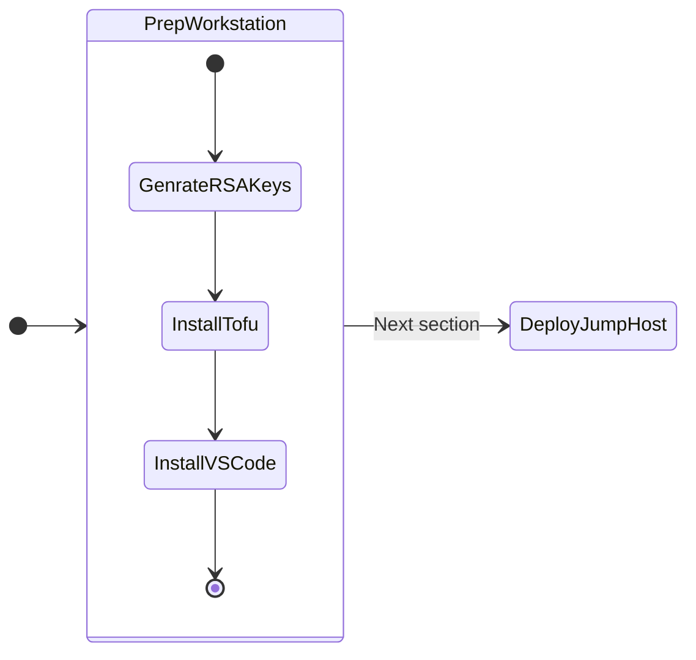

# Workstation Setup

We will be going through creating resources and installing tools on your PC/Mac. 




!!!note
       These are the only binaries that you will need to install on your workstation or any other OS to get the jump host VM running.

1. Create RSA key pair We will need a RSA key pair to connect to the jumphost
2. Install Visual Studio Code (VSC)
3. Install OpenTofu on Linux

## Generate a RSA Key Pair

Select your workstation OS and follow these instuctions to 

=== "Mac/Linux"

    

    1. Run the following command to generate an RSA key pair.
    
        ```bash
        ssh-keygen -t rsa
        ```
    
    2. Accept the default file location as ``~/.ssh/id_rsa``
    
    3. The keys will be available in the following locations:
        
        ``` { .bash .no-copy }
        ~/.ssh/id_rsa.pub 
        ~/.ssh/id_rsa
        ```

=== "Windows"

    On Windows machine, See [Generate a RSA key pair on Windows](https://portal.nutanix.com/page/documents/details?targetId=Self-Service-Admin-Operations-Guide-v3_8_0:nuc-app-mgmt-generate-ssh-key-windows-t.html) example.

## Install OpenTofu 

Install OpenTofu for Infrastructure as Code (IaC) requirement.

=== "Mac/Linux"

    ```bash title="Download the installer script:"
    curl --proto '=https' --tlsv1.2 -fsSL https://get.opentofu.org/install-opentofu.sh -o install-opentofu.sh
    ```
    ```bash title="Give it execution permissions:"
    chmod +x install-opentofu.sh
    ```
    ```bash title="Run the installer:"
    ./install-opentofu.sh --install-method rpm
    ```

=== "Windows"

    ```PowerShell title="Download the installer script:"
    Invoke-WebRequest -outfile "install-opentofu.ps1" -uri "https://get.opentofu.org/install-opentofu.ps1"
    ```
    ```PowerShell title="Run the installer"
    & .\install-opentofu.ps1 -installMethod standalone
    ```
    ```PowerShell title="Remove the installer"
    Remove-Item install-opentofu.ps1
    ```

## Install Visual Studio Code (VSC)

We will be doing all the labs by connecting to your jump host using VSCode remote shell environment. This allows for easy browsing and editing of configuration files. 

Having a rich text editor capable of integrating with the rest of our tools, and providing markup to the different source code file types will provide significant value in upcoming exercises and is a much simpler experience for most users compared to command line text editors.

Follow these steps to get VSCode installed

=== "Mac/Linux"

    ```bash
    brew install --cask visual-studio-code # (1)
    ```

    1.  :material-fountain-pen-tip:  If you do not have ``brew`` package manager installed, use the following command to install it in ``Terminal``. 
   
        ```bash
        /bin/bash -c "$(curl -fsSL https://raw.githubusercontent.com/Homebrew/install/HEAD/install.sh)"
        ```

=== "Windows"

    ```PowerShell
    choco install vscode # (1)
    ```

    1.  :material-fountain-pen-tip:  If you do not have ``choco`` package manager installed, use the following command to install it in ``PowerShell``
   
        ```PowerShell
        Set-ExecutionPolicy Bypass -Scope Process -Force; [System.Net.ServicePointManager]::SecurityProtocol = [System.Net.ServicePointManager]::SecurityProtocol -bor 3072; iex ((New-Object System.Net.WebClient).DownloadString('https://community.chocolatey.org/install.ps1'))
        ```

We will proceed to deploying jumphost VM.


   