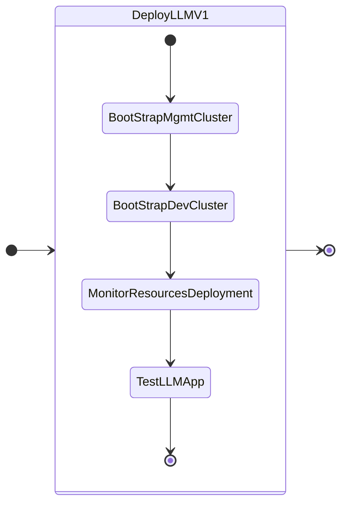

# Getting Started

In this part of the lab we will deploy LLM on GPU nodes.

We have deployed two Kubernetes clusters so far as per the NVD [design requirements](../conceptual/conceptual.md#management-kubernetes-cluster)

1. Management cluster: to host the management workloads like flux, kafka, etc
2. Dev cluster: to host the dev LLM and ChatBot application - this will use GPU passed through to the kubernetes worker nodes 

We will deploy the following applications one after the other

1. LLM NVD v1 - backed by llama2 model with RAG in Milvus database
2. Support GPT 

The following is the flow of the applications lab:




## Pre-requisites for MGMT and DEV Cluster

Prepare the following pre-requisites for mgmt-cluster and dev-cluster kubernetes clusters. 

### Using Devbox NIX Shell

This project uses [devbox](https://github.com/jetpack-io/devbox) to manage its development environment.

6.  On VS Code, Click **View > Command Palette** and **Connect to Host**

7.  Select the IP address of your jumphost VM

8.  A new Visual Studio Code window will open
    
9.  Click the **Explorer** button from the left-hand toolbar and select **Open Folder**.

10. Provide the ``/home/ubuntu/nainai-llm-fleet-infra`` as the folder you want to open and click on **OK**.
 
11. Install `devbox` using the following command and accept all defaults

    ```sh
    curl -fsSL https://get.jetpack.io/devbox | bash
    ```

12. Start the `devbox shell` and if `nix` isn't available, you will be prompted to install:

    ```sh
    devbox shell
    ```

### Reserve Ingress and Istio Endpoint IPs 

Nutanix AHV IPAM network allows you to black list IPs that needs to be reserved for specific application endpoints. We will use this feature to find and reserve two IPs. 

We will need a total of four IPs for the following:

  
| Cluster Role  | Cluster Name            |    Ingress IP   |    Istio  IP  |          
| -------------  | --------            |  ------------ |  --------   | 
| Management |``mgmt-cluster``|  1            |  1          |
| Dev  |``dev-cluster``       |  1             |  1          |  

1. Get the CIDR range for the AHV network(subnet) where the application will be deployed

    ```buttonless title="CIDR example for your Nutanix cluster"
    10.x.x.0/24
    ```

2. From VSC, logon to your jumpbox VM (if not already done)

3. Install ``nmap`` tool 
   
    ```bash
    devbox add nmap
    ```

4. Find four unused static IP addresses in the subnet

    === "Template command"
    
        ```bash
        nmap -v -sn  <your CIDR>
        ```

    === "Sample command"

        ```bash 
        nmap -v -sn 10.x.x.0/24
        ```

    ```text title="Sample output - choose the first four consecutive IPs"
    Nmap scan report for 10.x.x.214 [host down]
    Nmap scan report for 10.x.x.215 [host down]
    Nmap scan report for 10.x.x.216 [host down]
    Nmap scan report for 10.x.x.217 [host down]
    Nmap scan report for 10.x.x.218
    Host is up (-0.098s latency).
    ```

5. Logon to any CVM in your Nutanix cluster and execute the following to add chosen static IPs to the **Primary** IPAM network

    - **Username:** nutanix
    - **Password:** your Prism Element password 

    === "Template command"
    
        ```text
        acli net.add_to_ip_blacklist <your-ipam-ahv-network> \
        ip_list=10.x.x.214,10.x.x.215,10.x.x.216,10.x.x.217
        ```

    === "Sample command"

         ```text
         acli net.add_to_ip_blacklist User1 \
         ip_list=10.x.x.214,10.x.x.215,10.x.x.216,10.x.x.217
         ```

### Create Buckets in Nutanix Objects

Create buckets for gpt app ``documents_bucket_name`` and milvus ``mgmt-cluster-milvus``

### Create Nutanix Files Share

Create NFS share for hosting the LLM model file ``llama-2-13b-chat`` and model archive file