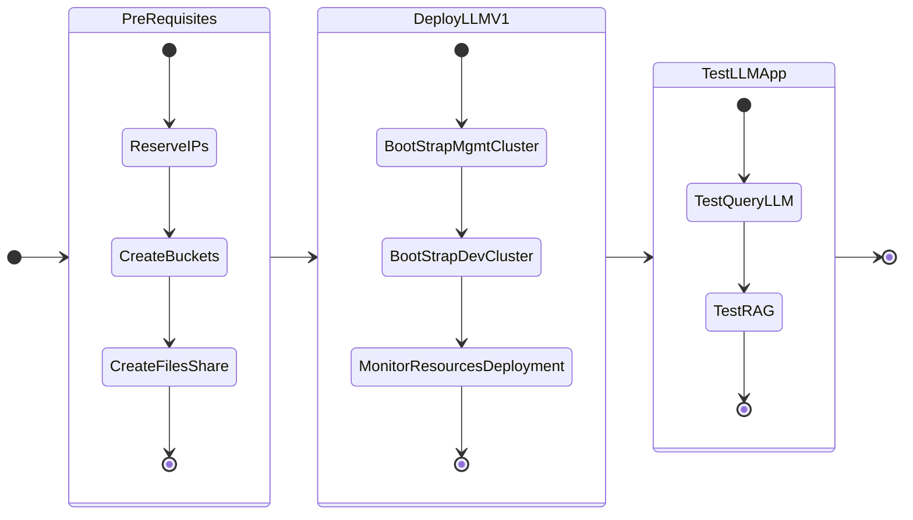

# Getting Started

In this part of the lab we will deploy LLM on GPU nodes.

We have deployed two Kubernetes clusters so far as per the NVD [design requirements](../conceptual/conceptual.md#management-kubernetes-cluster)

1. Management cluster: to host the management workloads like flux, kafka, etc
2. Dev cluster: to host the dev LLM and ChatBot application - this will use GPU passed through to the kubernetes worker nodes 

We will deploy the following applications one after the other

1. GPT-in-a-Box v1 NVD Reference App - backed by llama2 model with RAG in Milvus database
2. Support GPT

The following is the flow of the applications lab:

