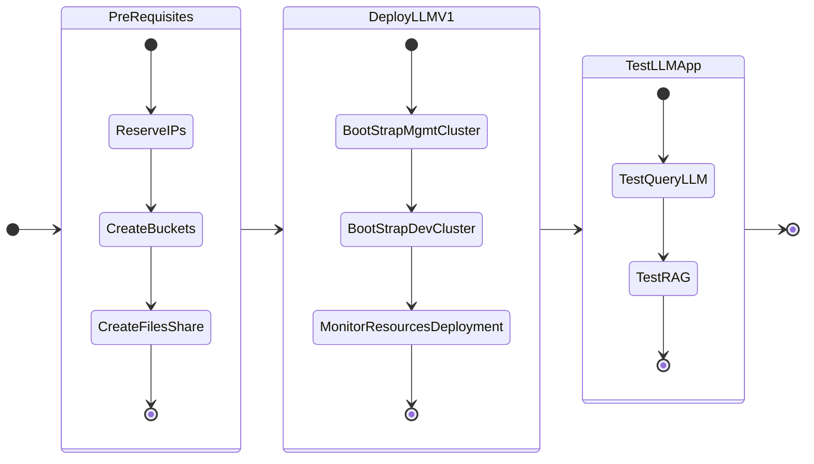

# Getting Started

In this part of the lab we will deploy LLM on GPU nodes.

We have deployed two Kubernetes clusters so far as per the NVD [design requirements](../conceptual/conceptual.md#management-kubernetes-cluster)

1. **Management cluster**: to host the management workloads like flux, kafka, etc
2. **Dev cluster**: to host the dev LLM and ChatBot application - this will use GPU passed through to the kubernetes worker nodes 

Deploy the two clusters using the instructions below:

-   :material-kubernetes:{ .lg .middle } __Set up Nutanix Karbon Engine [ NKE ] Clusters in 10 minutes__

    ---

    [:octicons-arrow-right-24: Setup Nutanix Karbon Engine](../infra/infra_nke.md)

Fork and clone GitOps repository on jumphost (if not already done):

-   :material-github:{ .lg .middle } __Fork and Clone GiaB NVD Gitops Repository__

    ---

    [:octicons-arrow-right-24: Fork and Clone GiaB NVD Gitops Repository](../infra/infra_jumphost_tofu.md#optional-fork-and-clone-giab-nvd-gitops-repository)

We will deploy the following applications one after the other

1. GPT-in-a-Box v1 NVD Reference App - backed by llama2 model with RAG in Milvus database
2. Support GPT

The following is the flow of the applications lab:

