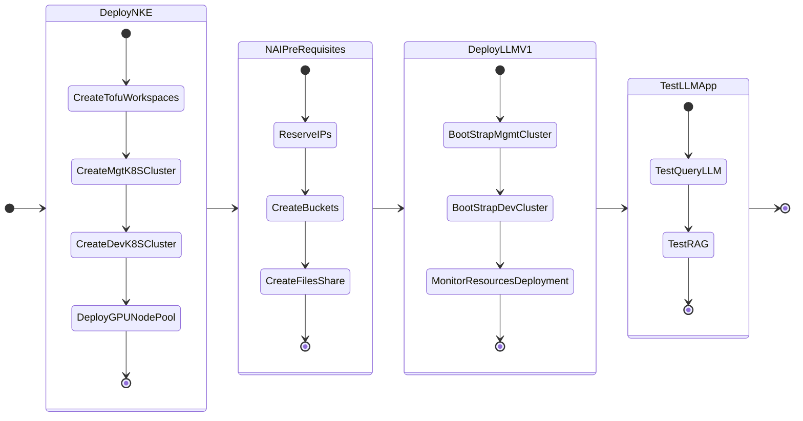

# Getting Started

!!! warning "Deprecation Notice"

    GPT-in-a-Box V1 NVD will be deprecated and be removed in a future releases. This is replaced by Nutanix Enterprise AI (AI).

This part of the lab we will focus on deploying LLM on GPU nodes using the GPT-in-a-Box V1 NVD.

We will deploy two Kubernetes clusters so far as per the NVD [design requirements](../conceptual/conceptual.md#management-kubernetes-cluster)

1. **Management cluster**: to host the management workloads like flux, kafka, etc
2. **Dev cluster**: to host the dev LLM and ChatBot application - this will use GPU passed through to the kubernetes worker nodes 

We will deploy the following applications one after the other

1. GPT-in-a-Box v1 NVD Reference App - backed by llama2 model with RAG in Milvus database
2. Support GPT

The following is the flow of the applications lab:

