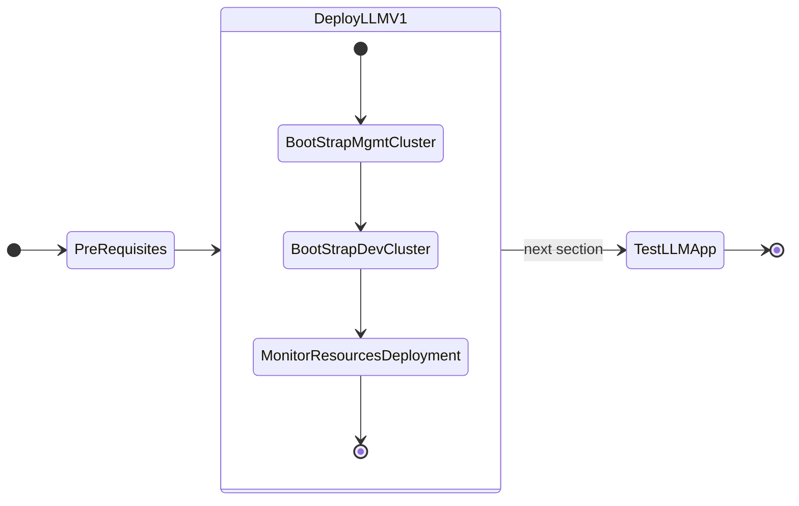
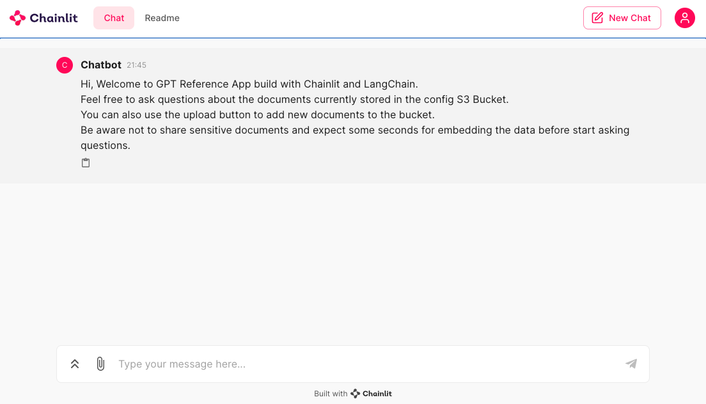

# Deploying GPT-in-a-Box NVD Reference Application using GitOps (FluxCD)




## Bootstrap Dev Cluster

A ``.env ``file is provided at   ``/home/ubuntu/nai-llm-fleet-infra`` folder for ease of configuration. We need to make copies of this for m dev-cluster kubernetes cluster.

1. Set ``K8S_CLUSTER_NAME`` environment variable and make a copy of `./.env.sample.yaml` for ``dev-cluster`` kubernetes cluster

    ```bash
    export K8S_CLUSTER_NAME=dev-cluster
    cp ./.env.sample.yaml ./.env.${K8S_CLUSTER_NAME}.yaml
    ```
   
2. Open ``.env.dev-cluster.yaml`` file in VSC
   
3. Change the highlighted fields to match your information

    !!!note
           There are a few yaml key value pair blocks of configuration to be updated in ``.env.env-cluster.yaml`` file

           Remember to use your own information for the following:

           - Github repo and api token
           - Docker registry information - for container downloads without rate limiting
           - Prism Central/Element details
           - Two IPs for KubeVIP to assign to Ingress and Istio 
           - Reference to FQDN reserved for ``management_cluster_ingress_subdomain`` (from [Create Nginx Ingress and Istio VIP/FDQN](llm_pre_reqs.md#create-nginx-ingress-and-istio-vipfdqn) section)
           - Nutanix NFS share to store the ``llama-2-13b-chat`` model
       
    === "Template file"
  
        ```yaml title=".env.sample.yaml" linenums="1" hl_lines="4 6 8 10 15 16 20 32-34 41-44 48-54 61-64 67-69 73 80 84 86-88 92 100 104 130 134 138 160 165 170 175 180 202-204 208-218"
        --8<-- ".env.sample.yaml"
        ```
    
    === "Example file"

      ```yaml title=".env.dev-cluster.yaml" linenums="1" hl_lines="4 6 8 10 15 16 20 32-34 41-44 48-54 61-64 67-69 73 80 84 86-88 92 100 104 130 134 138 160 165 170 175 180 202-204 208-218"
      --8<-- ".env.dev-cluster.yaml"
      ```

4. Generate and Validate Configurations
  
    ```bash
    task bootstrap:generate_cluster_configs
    ```

    Verify the generated cluster configs

    ```bash
    cat .local/${K8S_CLUSTER_NAME}/.env
    cat clusters/${K8S_CLUSTER_NAME}/platform/cluster-configs.yaml
    ```

5. Validate Encrypted Secrets and make sure the values you entered in ``.env.mgmt-cluster.yaml`` file

    ```bash
    task sops:decrypt
    ```

6. Select New (or Switching to Existing) Cluster and Download NKE creds for ``dev-cluster``

    ```bash
    eval $(task nke:switch-shell-env) && \
    task nke:download-creds && \
    kubectl get nodes
    ```

    ``` { .text, .no-copy}
    # command execution example

    $ eval $(task nke:switch-shell-env) && \
    task nke:download-creds && \
    kubectl get nodes
    Select existing cluster instance to load from .local/ directory.

    > dev-cluster                  <<< choose dev-cluster                          
      mgmt-cluster
    ```
7. Taint the GPU nodes. 
    
    ```bash
    task kubectl:taint_gpu_nodes
    ```
    If gpu are over utilised, drain the gpu_nodes of workloads

    ```bash
    task kubectl:drain_gpu_nodes
    ```
    
8.  Run Flux Bootstrapping - `task bootstrap:silent`

    ```bash
    task bootstrap:silent
    ```
    !!!note
           If there are any issues, troubleshot using `task ts:flux-collect`. You can re-run task `bootstrap:silent` as many times needed

9.  Monitor on New Terminal to make sure ``READY`` status is ``TRUE`` for all resources using the following command

    ```bash
    eval $(task nke:switch-shell-env) && \
    task flux:watch
    ```

    !!!note
           This may take up to 10 minutes.

           If there are any issues, update local git repo, push up changes and run `task flux:reconcile`

10. [Optional] Post Install - Taint GPU Nodepool with dedicated=gpu:NoSchedule

    !!!note
           If undesired workloads already running on gpu nodepools, drain nodes using `task kubectl:drain_gpu_nodes`

    ```bash
    ## taint gpu nodes with label nvidia.com/gpu.present=true
    task kubectl:taint_gpu_nodes

    ## view taint configurations on all nodes
    kubectl get nodes -o='custom-columns=NodeName:.metadata.name,TaintKey:.spec.taints[*].key,TaintValue:.spec.taints[*].value,TaintEffect:.spec.taints[*].effect'
    ```

## Accessing and Testing LLM

Once the bootstrapping is done in the previous section. We can access and test our LLM application.

1. In VSC Terminal, check the status of inferencing service
   
    ```bash
    k get isvc -A
    ```
    ``` { .text .no-copy }
    NAMESPACE   NAME      URL                                                READY   PREV   LATEST   PREVROLLEDOUTREVISION   LATESTREADYREVISION       AGE
    llm         llm-llm   http://llm-llm.llm.dev-cluster.10.x.x.217.nip.io   True           100                              llm-llm-predictor-00001   4h9m
    ```

2. Access the URL to check status and make sure it is alive and well 
   
    ```bash
    $ curl http://llm-llm.llm.dev-cluster.10.x.x.217.nip.io
    ```
    ``` { .text .no-copy }
    $ curl http://llm-llm.llm.dev-cluster.10.x.x.217.nip.io
    {"status":"alive"} 
    ```
   
3. On VSC terminal, get the LLM Frontend ingress endpoints
   
    ```bash
    k get ingress -A | grep frontend
    ```

    ``` { .text .no-copy }
    k get ingress -A | grep frontend
    NAMESPACE              NAME                                                      CLASS   HOSTS                                      ADDRESS        PORTS     AGE
    gptnvd-reference-app   gptnvd-reference-app-gptnvd-ref-app-gptnvd-referenceapp   nginx   frontend.dev-cluster.10.x.x.216.nip.io   10.x.x.216   80, 443   4h9m      
    ```

4. Copy the HOSTS address ``frontend.dev-cluster.10.x.x.216.nip.io `` from the above output and paste it in your browser. You should be able to see the LLM chat interface. Start asking away. 
   
    