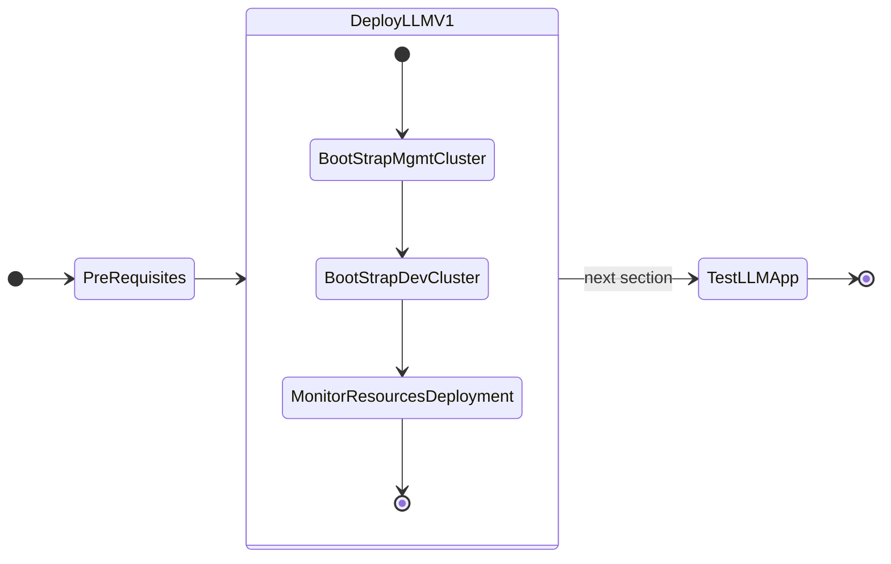
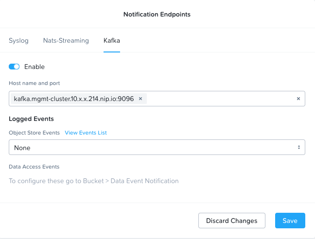
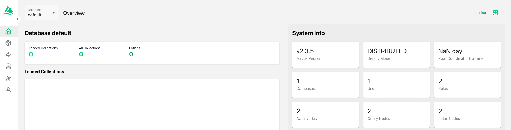

# Deploying GPT-in-a-Box NVD Reference Application using GitOps (FluxCD)




## Bootstrap Management Cluster

A ``.env ``file is provided at   ``/home/ubuntu/nainai-llm-fleet-infra`` folder for ease of configuration. We need to make copies of this for mgmt-cluster and dev-cluster kubernetes clusters that you deployed in the previous sections. 

1. Set ``K8S_CLUSTER_NAME`` environment variable and make a copy of `./.env.sample.yaml` for ``mgmt-cluster`` kubernetes cluster

    ```bash
    export K8S_CLUSTER_NAME=mgmt-cluster
    cp ./.env.sample.yaml ./.env.${K8S_CLUSTER_NAME}.yaml
    ```
   
2. Open ``.env.mgmt-cluster.yaml`` file in VSC
   
3. Change the highlighted fields to match your information (see Example file)

    !!!note
           There are a few yaml key value pair blocks of configuration to be updated in ``.env.mgmt-cluster.yaml`` file

           Remember to use your own information for the following:

           - Github repo and api token
           - Docker registry information - for container downloads without rate limiting
           - Prism Central/Element details
           - Nutanix Objects store and bucket details (for Milvus)
           - Two IPs for KubeVIP to assign to Ingress and Istio 
           - Nutanix NFS share to store the ``llama-2-13b-chat`` model
       
    === "Template file"

        ```yaml title=".env.sample.yaml" linenums="1" hl_lines="4 6 8 10 15 16 20 32-34 41-44 48-54 61-64 67-69 73 86-88 104 147 149 160 165 170 175"
        --8<-- ".env.sample.yaml"
        ```
    
    === "Example file"

        ```yaml title=".env.mgmt-cluster.yaml" linenums="1" hl_lines="4 6 8 10 15 16 20 32-34 41-44 48-54 61-64 67-68 73 80 84 86-88 104 147 149 160 165 170 175"
        --8<-- ".env.mgmt-cluster.yaml"
        ```

4. Generate and Validate Configurations
  
    ```bash
    task bootstrap:generate_cluster_configs
    ```

    Verify the generated cluster configs

    ```bash
    cat .local/${K8S_CLUSTER_NAME}/.env
    cat clusters/${K8S_CLUSTER_NAME}/platform/cluster-configs.yaml
    ```

5. Validate Encrypted Secrets and make sure the values match what you entered in ``.env.mgmt-cluster.yaml`` file

    ```bash
    task sops:decrypt
    ```

6. Select New (or Switching to Existing) Cluster and Download NKE creds for ``mgmt-cluster``

    ```bash
    eval $(task nke:switch-shell-env) && \
    task nke:download-creds && \
    kubectl get nodes
    ```
    ``` { .text, .no-copy}
    # command execution example

    $ eval $(task nke:switch-shell-env) && \
    task nke:download-creds && \
    kubectl get nodes
    Select existing cluster instance to load from .local/ directory.
                                 
    > mgmt-cluster                          <<< choose mgmt-cluster.   
    ```

7.  Taint the GPU nodes
    
    ```bash
    task kubectl:taint_gpu_nodes
    ```
    If gpu are over utilised, drain the gpu_nodes of workloads

    ```bash
    task kubectl:drain_gpu_nodes
    ```

8.  Run Flux Bootstrapping - `task bootstrap:silent`

    ```bash
    task bootstrap:silent
    ```
    !!!note
           This may take up to 10 minutes.

           If there are any issues, update local git repo, push up changes and run `task flux:reconcile`

9.  Monitor on New Terminal to make sure ``READY`` status is ``TRUE`` for all resources using the following command

    ```bash
    eval $(task nke:switch-shell-env) && \
    task flux:watch
    ```

    !!!note
           If there are any issues, update local git repo, push up changes and run `task flux:reconcile`

10. [Optional] Post Install - Taint GPU Nodepool with dedicated=gpu:NoSchedule

    !!!note
           If undesired workloads already running on gpu nodepools, drain nodes using `task kubectl:drain_gpu_nodes`

    ```bash
    ## taint gpu nodes with label nvidia.com/gpu.present=true
    task kubectl:taint_gpu_nodes

    ## view taint configurations on all nodes
    kubectl get nodes -o='custom-columns=NodeName:.metadata.name,TaintKey:.spec.taints[*].key,TaintValue:.spec.taints[*].value,TaintEffect:.spec.taints[*].effect'
    ```

## Set Kafka Endpoint in Nutanix Objects

After successful bootstrap of the ``mgmt-cluster``, get the Kafka ingress endpoint to set the value in Nutanix Objects store. 

Nutanix Objects store will send a message to kafka endpoint if an object gets stored in the bucket.

1. On VSC terminal on the jumpbox VM, get the ingress endpoints
   
    ```bash
    k get ingress -A | grep kafka
    ```

    ``` { .text .no-copy } 
    NAMESPACE      NAME                          CLASS   HOSTS                                         ADDRESS      PORTS     AGE
    kafka          kafka-ingress                 nginx   kafka.mgmt-cluster.10.x.x.214.nip.io          10.x.x.214   80        3h2m         
    ```

2. Copy the URL value in HOSTS column (note this will be different for you) and add the port number ``9096`` as follows
   
    ``` { .text .no-copy }
    kafka.mgmt-cluster.10.x.x.214.nip.io:9096
    ```

3. Check if the Kafka endpoint is alive and well
   
    ```bash
    nc -zv kafka.mgmt-cluster.10.x.x.214.nip.io 9096
    ```
    ```{ .text, .no-copy}
    # command output
    Connection to kafka.mgmt-cluster.10.x.x.214.nip.io port 9096 [tcp/*] succeeded!`
    ```

4. Login to **Prism Central**, go to **Objects** and choose the **ntnx-objects** store (Objects store name could be different for you)
5. Go to **Settings > Notification Endpoints**
6. Choose the **Kafka** tab
7. Toggle the **Enable** button :material-toggle-switch-outline: to enabled
 
8. Paste the ingress endpoint of your Kafka instance

    

9.  Click on **Save**

## Check Milvus Database Status

To make sure Milvus database and associated components are running. 

1. On VSC terminal, check if the Kafka endpoint is alive and well
   
    ```bash
    nc -zv milvus.mgmt-cluster.10.x.x.214.nip.io 19530
    ```
    ```{ .text, .no-copy}
    # command output
    Connection to milvus.mgmt-cluster.10.x.x.214.nip.io port 19530 [tcp/*] succeeded!`
    ```

2. Get the Milvus ingress endpoint
   
    ```bash
    k get ingress -A | grep attu
    ```

    ``` { .text .no-copy } 
    NAMESPACE      NAME                          CLASS   HOSTS                                       ADDRESS      PORTS     AGE
    milvus         milvus-milvus-vectordb-attu   nginx   attu.mgmt-cluster.10.x.x.214.nip.io         10.x.x.214   80, 443   3h2m
    ```

2. Copy the URL value in HOSTS column (note this will be different for you)
   
    ``` { .text .no-copy }
    attu.mgmt-cluster.10.x.x.214.nip.io
    ```
    
2. Paste the URL in the browser and you should be able to see Milvus database management page. 

3. There is no user name and password for Milvus database as this is a test environment. Feel free to update password for ``root`` user in the user settings.
   
    