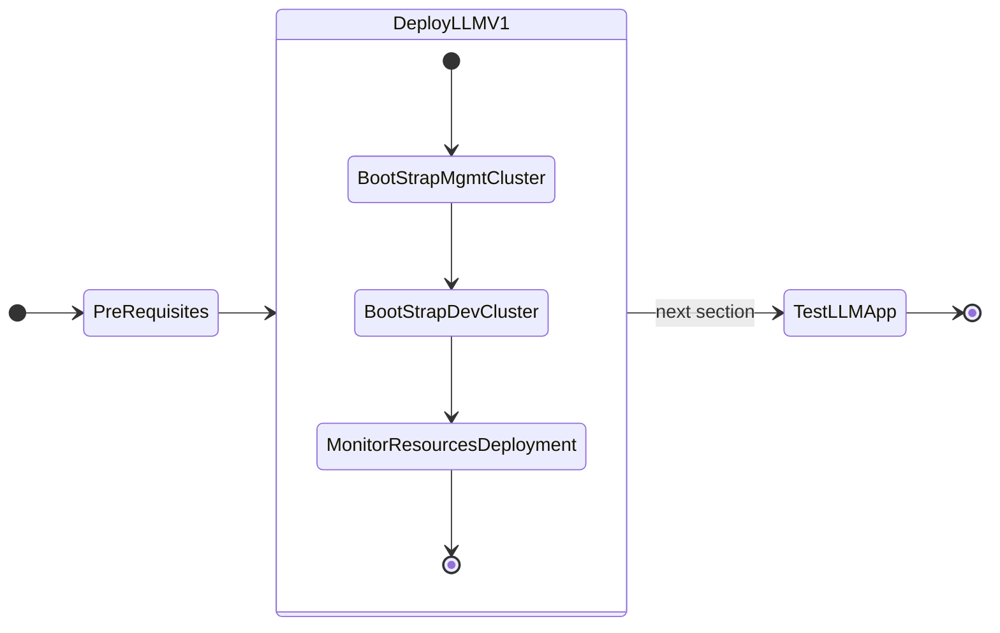

# Deploying GPT-in-a-Box NVD Reference Application using GitOps (FluxCD)




## Bootstrap Management Cluster

A ``.env ``file is provided at   ``/home/ubuntu/nainai-llm-fleet-infra`` folder for ease of configuration. We need to make copies of this for mgmt-cluster and dev-cluster kubernetes clusters that you deployed in the previous sections. 

1. Set ``K8S_CLUSTER_NAME`` environment variable and make a copy of `./.env.sample.yaml` for ``mgmt-cluster`` kubernetes cluster

    ```bash
    export K8S_CLUSTER_NAME=mgmt-cluster
    cp ./.env.sample.yaml ./.env.${K8S_CLUSTER_NAME}.yaml
    ```
   
2. Open ``.env.mgmt-cluster.yaml`` file in VSC
   
3. Compare the Template and Example file and change the highlighted fields to match values in example file.

    !!!note
           There are a few yaml key value pair blocks of configuration to be updated in ``.env.mgmt-cluster.yaml`` file

           Remember to use your own information for the following:

           - Github api token
           - Docker registry information - for container downloads without rate limiting
           - Prism Central/Element details
           - Nutanix Objects store and bucket details (for Milvus)
           - Two IPs for KubeVIP to assign to Ingress and Istio 
           - Nutanix NFS share to store the ``llama-2-13b-chat`` model
       
    === "Template file"

        ```yaml title=".env.mgmt-cluster.yaml" linenums="1" hl_lines="4 6 8 10 15 16 20 32-34 41-44 48-54 61-64 67-69 73 86-88 104 147 149 160 165 170 175"
        k8s_cluster:

          ## kubernetes distribution - supported "nke" "kind"
          distribution: nke
          ## kubernetes cluster name
          name: _required
          ## cluster_profile_type - anything under clusters/_profiles (e.g., llm-management, llm-workloads, etc.)
          profile: _required
          ## environment name - based on profile selected under clusters/_profiles/<profile>/<environment> (e.g., prod, non-prod, etc.)
          environment: _required

          ## docker hub registry configs
          registry:
            docker_hub:
              user: _required
              password: _required

          ## nvidia gpu specific configs
          gpu_operator:
            enabled: false
            version: v23.9.0
            cuda_toolkit_version: v1.14.3-centos7
            ## time slicing typically only configured on dev scenarios. 
            ## ideal for jupyter notebooks
            time_slicing:
              enabled: false
              replica_count: 2

        flux:
          ## flux specific configs for github repo
          github:
            repo_url: _required
            repo_user: _required
            repo_api_token: _required

        infra:
          ## Global nutanix configs
          nutanix:
            ## Nutanix Prism Creds, required to download NKE creds
            prism_central:
              enabled: false
              # endpoint: _required_if_enabled
              # user: _required_if_enabled
              # password: _required_if_enabled

            ## Nutanix Objects Store Configs
            objects:
              enabled: false
              # host: _required_if_enabled
              # port: _required_if_enabled
              # region: _required_if_enabled
              # use_ssl: _required_if_enabled
              # access_key: _required_if_enabled
              # secret_key: _required_if_enabled

        services:
          #####################################################
          ## Required variables for kube-vip and depedent services
          ## kube-vip specific configs required for any services needing to be configured with LoadBalancer Virtual IP Addresses
          kube_vip:
            enabled: false
            ## Used to configure default global IPAM pool. A minimum of 2 ips should be provide in a range
            ## For Example: ipam_range: 172.20.0.22-172.20.0.23
            #ipam_range: _required_if_enabled

          ## required for all platform services that are leveraging nginx-ingress
          nginx_ingress:
            enabled: false
            version: 4.8.3
            ## Virtual IP Address (VIP) dedicated for nginx-ingress controller. 
            ## This will be used to configure kube-vip IPAM pool to provide Services of Type: LoadBalancer
            ## Example: vip: 172.20.0.20
            #vip: _required_if_enabled
            
            ## NGINX Wildcard Ingress Subdomain used for all default ingress objects created within cluster 
            ## For DEMO purposes, it is common to prefix subdomain with cluster-name as each cluster would require dedicated wildcard domain.
            ## EXISTING A Host DNS Records are pre-requisites. Example: If DNS is equal to *.example.com, then value is example.com
            ## For DEMO purposes, you can leverage the NIP.IO with the nginx_ingress vip and self-signed certificates. 
            ## For Example: wildcard_ingress_subdomain:flux-kind-local.172.20.0.20.nip.io
            #wildcard_ingress_subdomain: _required_if_enabled

            ## Wildcard Ingress Subdomain for management cluster.
            ## For DEMO purposes, you can leverage the NIP.IO with the nginx_ingress vip and self-signed certificates
            #management_cluster_ingress_subdomain: _required_if_enabled

          istio:
            enabled: false
            version: 1.17.2
            ## Virtual IP Address (VIP) dedicated for istio ingress gateway. 
            ## This will be used to configure kube-vip IPAM pool to provide Services of Type: LoadBalancer
            ## This address should be mapped to wildcard_ingress_subdomain defined below. For Example: vip: 172.20.0.21
            #vip: _required_if_enabled

            ## Istio Ingress Gateway - Wildcard Subdomain used for all knative/kserve llm inference endpoints. 
            ## EXISTING A Host DNS Records are pre-requisites. Example: If DNS is equal to *.llm.example.com, then value is llm.example.com
            ## If leveraging AWS Route 53 DNS with Let's Encrypt (below), make sure to enable/configure AWS credentials needed to 
            ## support CertificateSigningRequests using ACME DNS Challenges.
            ## For DEMO purposes, you can leverage the NIP.IO with the nginx_ingress vip and self-signed certificates. 
            ## For Example: llm.flux-kind-local.172.20.0.21.nip.io
            #wildcard_ingress_subdomain: _required_if_enabled

          cert_manager:
            ## if enabled - cluster issuer will be self-signed-issuer
            enabled: false
            version: v1.13.5
            ## if aws_route53_acme_dns.enabled - the cluster issuer across all services will be set to "letsencrypt-issuer"
            ## Following AWS Route53 Access Creds required for Lets Encrypt ACME DNS Challenge
            ## For additional details, https://cert-manager.io/docs/configuration/acme/dns01/route53/
            ## minimum supported cert-manager version is v1.9.1 https://cert-manager.io/docs/releases/release-notes/release-notes-1.9/#v191
            aws_route53_acme_dns:
              enabled: false
              # email: _required_if_enabled
              # zone: _required_if_enabled
              # hosted_zone_id: _required_if_enabled
              # region: _required_if_enabled
              # key_id: _required_if_enabled
              # key_secret: _required_if_enabled
              
          ## do not disable kyverno unless you know what you're doing
          ## this is needed to keep docker hub creds synchronized between namespaces.
          kyverno:
            enabled: true
            version: 3.1.4

          ## the following versions and dependencies kserve are aligned with GPT In A Box Opendocs
          ## the only exception is with cert-manager due to usage of aws route 53
          ## https://opendocs.nutanix.com/gpt-in-a-box/kubernetes/v0.2/getting_started/

          kserve:
            enabled: false
            version: v0.11.2

          knative_serving:
            enabled: false
            version: knative-v1.10.1

          knative_istio:
            enabled: false
            version: knative-v1.10.0

          ## The following components are leveraged to support Nutanix Validated Designs
          ## The NVD for GPT in a Box leverages a RAG Pipeline with Serverless Functions 
          ## to demonstrate end to end workflow with Nutanix Integration
          
          ## Milvus is vector database 
          milvus:
            enabled: false
            version: 4.1.13
            milvus_bucket_name: milvus

          ## Knative Eventing used to receive Event notifications from Nutanix Objects Document Bucket
          knative_eventing:
            enabled: false
            version: knative-v1.10.1

          ## Kafka is messaging broker used by both knative eventing Document Ingestion serverless function
          ## and integrates with Nutanix Objects Events Notification Kafka Endpoints
          ## Kafka is also leveraged by Milvus as a Messaging Broker for Milvus related events, as opposed to the default Apache Pulsar
          kafka:
            enabled: false
            version: 26.8.5

          ## OpenTelemetry Collector version is used for both the Deployment and Daemon is used to collect data for monitoring
          opentelemetry_collector:
            enabled: false
            version: 0.80.1

          ## OpenTelemetry Operator is used to deploy opentelemetry components
          opentelemetry_operator:
            enabled: false
            version: 0.47.0

          ## Uptrace is Observability / Monitoring UI
          uptrace:
            enabled: false
            version: 1.5.7
          
          ## Jupyterhub is deployed on non-prod workload clusters in NVD Reference
          jupyterhub:
            enabled: false
            version: 3.1.0

          redis:
            enabled: false
            version: 18.1.6

          elasticsearch:
            enabled: false
            version: 19.13.10
          
          kubernetes_dashboard:
            enabled: false
            version: 7.3.2

          weave_gitops:
            enabled: true
            version: 4.0.36

        apps:
          ## Required GPT NVD Reference Application Helm Chart Configs
          gptnvd_reference_app:
            enabled: false
            version: 0.2.7
            #documents_bucket_name: documents01
          ## Required NAI LLM Helm Chart Configs
          ### huggingFaceToken required when useExistingNFS. This will download model when llm is initialized
          nai_helm:
            enabled: false
            version: 0.1.1
            #model: llama2_7b_chat
            #revision: 94b07a6e30c3292b8265ed32ffdeccfdadf434a8
            #maxTokens: 4000
            #repPenalty: 1.2
            #temperature: 0.2
            #topP: 0.9
            #useExistingNFS: false
            #nfs_export: /llm-model-store
            #nfs_server: _required
            #huggingFaceToken: _required
        ```
    
    === "Example file"

        ```yaml title=".env.mgmt-cluster.yaml" linenums="1" hl_lines="4 6 8 10 15 16 20 32-34 41-44 48-54 61-64 67-69 73 86-88 104 147 149 160 165 170 175"
        k8s_cluster:

          ## kubernetes distribution - supported "nke" "kind"
          distribution: nke
          ## kubernetes cluster name
          name: mgmt-cluster
          ## cluster_profile_type - anything under clusters/_profiles (e.g., llm-management, llm-workloads, etc.)
          profile: llm-management
          ## environment name - based on profile selected under clusters/_profiles/<profile>/<environment> (e.g., prod, non-prod, etc.)
          environment: prod

          ## docker hub registry configs
          registry:
            docker_hub:
              user: your_docker_username
              password: your_docker_password

          ## nvidia gpu specific configs
          gpu_operator:
            enabled: false
            version: v23.9.0
            cuda_toolkit_version: v1.14.3-centos7
            ## time slicing typically only configured on dev scenarios. 
            ## ideal for jupyter notebooks
            time_slicing:
              enabled: false
              replica_count: 2

        flux:
          ## flux specific configs for github repo
          github:
            repo_url: https://github.com/<your_github_org>/nai-llm-fleet-infra.git
            repo_user: your_github_username
            repo_api_token: your_github_token

        infra:
          ## Global nutanix configs
          nutanix:
            ## Nutanix Prism Creds, required to download NKE creds
            prism_central:
              enabled: true
              endpoint: <PC FQDN>
              user: <PC user>
              password: <PC password>

            ## Nutanix Objects Store Configs
            objects:
              enabled: true
              host: objects.example.com
              port: 80
              region: us-east-1
              use_ssl: false
              access_key: your_bucket_access_key
              secret_key: your_bucket_secret_key

        services:
          #####################################################
          ## Required variables for kube-vip and depedent services
          ## kube-vip specific configs required for any services needing to be configured with LoadBalancer Virtual IP Addresses
          kube_vip:
            enabled: true
            ## Used to configure default global IPAM pool. A minimum of 2 ips should be provide in a range
            ## For Example: ipam_range: 172.20.0.22-172.20.0.23
            ipam_range: 10.x.x.214-10.x.x.215

          ## required for all platform services that are leveraging nginx-ingress
          nginx_ingress:
            enabled: true
            version: 4.8.3
            ## Virtual IP Address (VIP) dedicated for nginx-ingress controller. 
            ## This will be used to configure kube-vip IPAM pool to provide Services of Type: LoadBalancer
            ## Example: vip: 172.20.0.20
            vip: 10.x.x.214
            
            ## NGINX Wildcard Ingress Subdomain used for all default ingress objects created within cluster 
            ## For DEMO purposes, it is common to prefix subdomain with cluster-name as each cluster would require dedicated wildcard domain.
            ## EXISTING A Host DNS Records are pre-requisites. Example: If DNS is equal to *.example.com, then value is example.com
            ## For DEMO purposes, you can leverage the NIP.IO with the nginx_ingress vip and self-signed certificates. 
            ## For Example: wildcard_ingress_subdomain:flux-kind-local.172.20.0.20.nip.io
            wildcard_ingress_subdomain: mgmt-cluster.10.x.x.214.nip.io

            ## Wildcard Ingress Subdomain for management cluster.
            ## For DEMO purposes, you can leverage the NIP.IO with the nginx_ingress vip and self-signed certificates
            management_cluster_ingress_subdomain: mgmt-cluster.10.x.x.214.nip.io

          istio:
            enabled: false
            version: 1.17.2
            ## Virtual IP Address (VIP) dedicated for istio ingress gateway. 
            ## This will be used to configure kube-vip IPAM pool to provide Services of Type: LoadBalancer
            ## This address should be mapped to wildcard_ingress_subdomain defined below. For Example: vip: 172.20.0.21
            #vip: _required_if_enabled

            ## Istio Ingress Gateway - Wildcard Subdomain used for all knative/kserve llm inference endpoints. 
            ## EXISTING A Host DNS Records are pre-requisites. Example: If DNS is equal to *.llm.example.com, then value is llm.example.com
            ## If leveraging AWS Route 53 DNS with Let's Encrypt (below), make sure to enable/configure AWS credentials needed to 
            ## support CertificateSigningRequests using ACME DNS Challenges.
            ## For DEMO purposes, you can leverage the NIP.IO with the nginx_ingress vip and self-signed certificates. 
            ## For Example: llm.flux-kind-local.172.20.0.21.nip.io
            #wildcard_ingress_subdomain: _required_if_enabled

          cert_manager:
            ## if enabled - cluster issuer will be self-signed-issuer
            enabled: true
            version: v1.13.5
            ## if aws_route53_acme_dns.enabled - the cluster issuer across all services will be set to "letsencrypt-issuer"
            ## Following AWS Route53 Access Creds required for Lets Encrypt ACME DNS Challenge
            ## For additional details, https://cert-manager.io/docs/configuration/acme/dns01/route53/
            ## minimum supported cert-manager version is v1.9.1 https://cert-manager.io/docs/releases/release-notes/release-notes-1.9/#v191
            aws_route53_acme_dns:
              enabled: false
              # email: _required_if_enabled
              # zone: _required_if_enabled
              # hosted_zone_id: _required_if_enabled
              # region: _required_if_enabled
              # key_id: _required_if_enabled
              # key_secret: _required_if_enabled
              
          ## do not disable kyverno unless you know what you're doing
          ## this is needed to keep docker hub creds synchronized between namespaces.
          kyverno:
            enabled: true
            version: 3.1.4

          ## the following versions and dependencies kserve are aligned with GPT In A Box Opendocs
          ## the only exception is with cert-manager due to usage of aws route 53
          ## https://opendocs.nutanix.com/gpt-in-a-box/kubernetes/v0.2/getting_started/

          kserve:
            enabled: false
            version: v0.11.2

          knative_serving:
            enabled: false
            version: knative-v1.10.1

          knative_istio:
            enabled: false
            version: knative-v1.10.0

          ## The following components are leveraged to support Nutanix Validated Designs
          ## The NVD for GPT in a Box leverages a RAG Pipeline with Serverless Functions 
          ## to demonstrate end to end workflow with Nutanix Integration
          
          ## Milvus is vector database 
          milvus:
            enabled: true
            version: 4.1.13
            milvus_bucket_name: mgmt-cluster-milvus

          ## Knative Eventing used to receive Event notifications from Nutanix Objects Document Bucket
          knative_eventing:
            enabled: false
            version: knative-v1.10.1

          ## Kafka is messaging broker used by both knative eventing Document Ingestion serverless function
          ## and integrates with Nutanix Objects Events Notification Kafka Endpoints
          ## Kafka is also leveraged by Milvus as a Messaging Broker for Milvus related events, as opposed to the default Apache Pulsar
          kafka:
            enabled: true
            version: 26.8.5

          ## OpenTelemetry Collector version is used for both the Deployment and Daemon is used to collect data for monitoring
          opentelemetry_collector:
            enabled: true
            version: 0.80.1

          ## OpenTelemetry Operator is used to deploy opentelemetry components
          opentelemetry_operator:
            enabled: true
            version: 0.47.0

          ## Uptrace is Observability / Monitoring UI
          uptrace:
            enabled: true
            version: 1.5.7
          
          ## Jupyterhub is deployed on non-prod workload clusters in NVD Reference
          jupyterhub:
            enabled: false
            version: 3.1.0

          redis:
            enabled: false
            version: 18.1.6

          elasticsearch:
            enabled: false
            version: 19.13.10
          
          kubernetes_dashboard:
            enabled: false
            version: 7.3.2

          weave_gitops:
            enabled: true
            version: 4.0.36

        apps:
          ## Required GPT NVD Reference Application Helm Chart Configs
          gptnvd_reference_app:
            enabled: false
            version: 0.2.7
            #documents_bucket_name: documents01
          ## Required NAI LLM Helm Chart Configs
          ### huggingFaceToken required when useExistingNFS. This will download model when llm is initialized
          nai_helm:
            enabled: false
            version: 0.1.1
            #model: llama2_7b_chat
            #revision: 94b07a6e30c3292b8265ed32ffdeccfdadf434a8
            #maxTokens: 4000
            #repPenalty: 1.2
            #temperature: 0.2
            #topP: 0.9
            #useExistingNFS: false
            #nfs_export: /llm-model-store
            #nfs_server: _required
            #huggingFaceToken: _required
        ```

4. Generate and Validate Configurations
  
    ```bash
    task bootstrap:generate_cluster_configs
    ```

    Verify the generated cluster configs

    ```bash
    cat .local/${K8S_CLUSTER_NAME}/.env
    cat clusters/${K8S_CLUSTER_NAME}/platform/cluster-configs.yaml
    ```

5. Validate Encrypted Secrets and make sure the values you entered in ``.env.mgmt-cluster.yaml`` file

    ```bash
    task sops:decrypt
    ```

6. Select New (or Switching to Existing) Cluster and Download NKE Creds

    ```bash
    eval $(task nke:switch-shell-env) && \
    task nke:download-creds && \
    kubectl get nodes
    ```
7.  Taint the GPU nodes
    
    ```bash
    task kubectl:taint_gpu_nodes
    # if gpu are over utilised
    # task kubectl:drain_gpu_nodes
    ```

8.  Run Flux Bootstrapping - `task bootstrap:silent`

    ```bash
    task bootstrap:silent
    ```
    !!!note
           If there are any issues, troubleshot using `task ts:flux-collect`. You can re-run task `bootstrap:silent` as many times needed

9.  Monitor on New Terminal

    ```bash
    eval $(task nke:switch-shell-env) && \
    task flux:watch
    ```

    !!!note
           If there are any issues, update local git repo, push up changes and run `task flux:reconcile`

10. [Optional] Post Install - Taint GPU Nodepool with dedicated=gpu:NoSchedule

    !!!note
           If undesired workloads already running on gpu nodepools, drain nodes using `task kubectl:drain_gpu_nodes`

    ```bash
    ## taint gpu nodes with label nvidia.com/gpu.present=true
    task kubectl:taint_gpu_nodes

    ## view taint configurations on all nodes
    kubectl get nodes -o='custom-columns=NodeName:.metadata.name,TaintKey:.spec.taints[*].key,TaintValue:.spec.taints[*].value,TaintEffect:.spec.taints[*].effect'
    ```