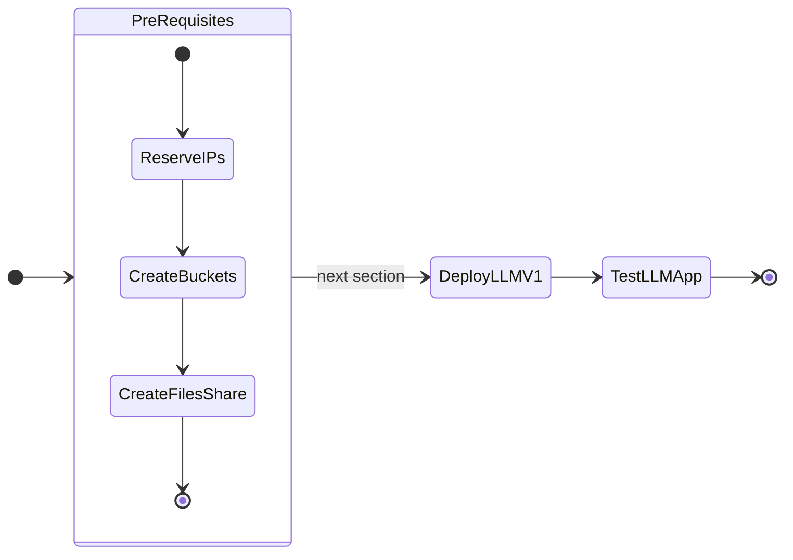

# Pre-requisites for MGMT and DEV Cluster

In this part of the lab we will prepare pre-requisites for LLM application on GPU nodes.

The following is the flow of the applications lab:



Prepare the following pre-requisites for mgmt-cluster and dev-cluster kubernetes clusters. 

## Reserve Ingress and Istio Endpoint IPs 

Nutanix AHV IPAM network allows you to black list IPs that needs to be reserved for specific application endpoints. We will use this feature to find and reserve four IPs. 

We will need a total of four IPs for the following:

  
| Cluster Role  | Cluster Name            |    Ingress IP   |    Istio  IP  |          
| -------------  | --------            |  ------------ |  --------   | 
| Management |``mgmt-cluster``|  1            |  1          |
| Dev  |``dev-cluster``       |  1             |  1          |  

1. Get the CIDR range for the AHV network(subnet) where the application will be deployed

    ```buttonless title="CIDR example for your Nutanix cluster"
    10.x.x.0/24
    ```

2. From VSC, logon to your jumpbox VM (if not already done)
3. Open Terminal

4. Install ``nmap`` tool (if not already done)
   
    ```bash
    cd /home/ubuntu/nai-llm-fleet-infra
    devbox add nmap
    ```

5. Find four unused static IP addresses in the subnet

    === "Template command"
    
        ```bash
        nmap -v -sn  <your CIDR>
        ```

    === "Sample command"

        ```bash 
        nmap -v -sn 10.x.x.0/24
        ```

    ```text title="Sample output - choose the first four consecutive IPs"
    Nmap scan report for 10.x.x.214 [host down]
    Nmap scan report for 10.x.x.215 [host down]
    Nmap scan report for 10.x.x.216 [host down]
    Nmap scan report for 10.x.x.217 [host down]
    Nmap scan report for 10.x.x.218
    Host is up (-0.098s latency).
    ```

6. Logon to any CVM in your Nutanix cluster and execute the following to add chosen static IPs to the AHV IPAM network

    - **Username:** nutanix
    - **Password:** your Prism Element password 

    === "Template command"
    
        ```text
        acli net.add_to_ip_blacklist <your-ipam-ahv-network> \
        ip_list=10.x.x.214,10.x.x.215,10.x.x.216,10.x.x.217
        ```

    === "Sample command"

         ```text
         acli net.add_to_ip_blacklist User1 \
         ip_list=10.x.x.214,10.x.x.215,10.x.x.216,10.x.x.217
         ```

## Create Nginx Ingress and Istio VIP/FDQN

We will use nip.io address to assign FQDNs for our Nginx Ingress and Istio by using the 4 IPs that we just reserved in the previous section for use in the next section. We will leverage the ``NIP.IO`` with the vip and self-signed certificates.

We will need a total of four IPs for the following:

### Management Cluster
  
Assign the first two reserved IPs to Management cluster.

|   Component  | Sub-component| IP/FQDN   |    
|  ------------ | --| --------   | 
| Nginx Ingress | `vip`| ``10.x.x.214``  |
|  Nginx Ingress   | ``wildcard_ingress_subdomain``| ``mgmt-cluster.10.x.x.214.nip.io``    | 
|  Nginx Ingress   |  ``management_cluster_ingress_subdomain``| ``mgmt-cluster.10.x.x.214.nip.io``     | 
| Reserved for future | `troubleshooting or debugging`| ``10.x.x.215``  |

!!!note
       We only need 1 IP for Management cluster. However, KubeVIP needs a range of at least two IPs. We will reserve the second IP for future use and/or troubleshooting purposes. 
       

### Dev Cluster

Assign the next two reserved IPs to Dev cluster.

!!!note
       The ``management_cluster_ingress_subdomain`` appears in this table once again and it is just a reference for ``dev-cluster`` to ``mgmt-cluster``. This entry will be used in the ``.env.dev-cluster.yaml`` file during the [Deploy Dev Cluster](llm_mgt_deploy.md#bootstrap-management-cluster) section.

|   Component  | Sub-component| IP/FQDN   |    
|  ------------ | --| --------   | 
| Nginx Ingress | `vip`|`` 10.x.x.216   ``  |
|  Nginx Ingress   | `wildcard_ingress_subdomain`| ``dev-cluster.10.x.x.216.nip.io``    | 
|  Nginx Ingress   |  `management_cluster_ingress_subdomain`| ``mgmt-cluster.10.x.x.214.nip.io``     | 
|  Istio   |  ``vip``| ``10.x.x.217``     | 
|  Istio  | ``wildcard_ingress_subdomain``| ``dev-cluster.10.x.x.217.nip.io``    | 

## Create Buckets in Nutanix Objects

We will create access keys to buckets that we will be using in the project.

### Generating Access Keys for Buckets

!!!note
       Follow instructions [here](https://portal.nutanix.com/page/documents/details?targetId=Objects-v4_4:top-object-store-deployment-t.html) to create a Nutanix Objects Store (if you do not have it)

       We are assuming that the name of the Objects Store is ``ntnx-objects``.

1.  Go to **Prism Central** > **Objects** > **ntnx-objects**

2.  On the right-hand pane, click on **Access Keys**

3.  Click on **+ Add people**

4.  Select **Add people not in a directory service**

5.  Enter an email ``llm-admin@example.com`` and name `llm-admin`

6.  Click on **Next**

7.  Click on **Generate Keys**

8.  Once generated, click on **Download Keys**

9.  Once downloaded, click on **Close**

10. Open the downloaded file to verify contents

    ``` { .text .no-copy}
    Username: llm-admin@example.com
    Access Key: 1xxxxxxxxxxxxxxxxxxxxxxxxxxxxxxx
    Secret Key: gxxxxxxxxxxxxxxxxxxxxxxxxxxxxxxx
    Display Name: llm-admin
    ```

11. Store the access key and secret key in a safe place for access 

#### Create Buckets

We will create buckets for Milvus database store and document store for uploaded files for querying will be stored.

1.  On the top menu, click on **Object Stores**

2.  Click on **ntnx-objects**
   
3.  Click on **Create Bucket**

4.  Enter **mgmt-cluster-milvus** as the bucket name

5.  Click on **Create**
   
6.  Follow the same steps to create another bucket called **documents01**

#### Provide Access to Buckets

7.  In the list of buckets, click on the **mgmt-cluster-milvus** bucket

8.  Click on **User Access** menu and **Edit User Access**

9.  In the **mgmt-cluster-milvus** window, type in the ``llm-admin@example.com`` email that you configured in the [Generating Access Keys for Buckets](#generating-access-keys-for-buckets) section

10. Give **Full Access** permissions

11. Click on **Save**
    
12. Follow the same steps to give **Full Access** to the ``llm-admin@example.com`` email for **documents01** bucket

## Create Nutanix Files Share

Create NFS share for hosting the LLM model file ``llama-2-13b-chat`` and model archive file

!!!note
       Follow instructions [here](https://portal.nutanix.com/page/documents/details?targetId=Files-v5_0:fil-file-server-create-wc-t.html) to create a Nutanix Files cluster (if you do not have it)

       We are assuming that the name of the Files cluster is `ntnx-files`.

1. Go to **Prism Central** > **Files** > **ntnx-files**

2. Click on **Shares & Exports**
3. Click on **+ New Share or Export**
4. Enter the following details:

    - **Name** - llm-model-store
    - **Enable compression** - checked
    - **Authentication** - system
    - **Default Access** - Read-Write
    - **Squash** - Root Squash

5. Click on **Create**
   
6. Copy the Share/Export Path from the list of shares and note it down for later use (e.g: ``/llm-model-store``)

## Extract the Model Archive file to Files Share

The LLM application will use the model archive file (MAR) stored in the file share. A few commands need to be executed to download and extract the model file from Hugging Face to the Files share. 

!!!note
       The following steps are directly from [opendocs.nutanix.com](https://opendocs.nutanix.com/gpt-in-a-box/kubernetes/v0.2/generating_mar/) GPT-in-a-Box documentation.

1. Logon to the jumphost VM you created in the previous section
   
    ```bash
    ssh -l ubuntu <jumphost vm IP>
    ```

2. Download nutanix [package](https://github.com/nutanix/nai-llm-k8s/releases/tag/v0.2.2) and extract it. 
   
    ```bash
    curl -LO https://github.com/nutanix/nai-llm-k8s/archive/refs/tags/v0.2.2.tar.gz
    tar xvf v0.2.2.tar.gz --strip-components=1
    ```

3. Install pip
   
    ```bash
    sudo apt-get install python3-pip
    ```

4. Install the python library requirements
   
    ```bash
    cd llm
    pip install -r requirements.txt
    ```

5. Mount the file share created in the previous section
   
    === "Template command"

          ```bash
          sudo mount -t nfs <files server fqdn>:<share path> <NFS_LOCAL_MOUNT_LOCATION>
          ```
    
    === "Example command"
 
          ```bash
          sudo mount -t nfs ntnx-files.pe.example.com:/llm-model-store /mnt/llm-model-store
          ```
6. Download and extract the model file to the local mount of file share
    
    === "Template command"

          ```bash
          python3 generate.py [--hf_token <HUGGINGFACE_HUB_TOKEN> \
          --repo_version <REPO_COMMIT_ID>] --model_name <MODEL_NAME> \
          --output <NFS_LOCAL_MOUNT_LOCATION>
          ```
    
    === "Example command"
 
          ```bash
          python3 generate.py --model_name llama2_7b_chat \
          --output /mnt/llm-model-store \
          --hf_token hf_xxxxxxxxxxxxxxxxxxxxxxxxxxx 
          ```
    
    ```{ .text, .no-copy}
    # Sample output

    ## Starting model files download

    Deleted all contents from '/mnt/llm-model-store/llama2_7b_chat/94b07a6e30c3292b8265ed32ffdeccfdadf434a8/download' 

    The new directory is created! - /mnt/llm-model-store/llama2_7b_chat/94b07a6e30c3292b8265ed32ffdeccfdadf434a8/download 

    The new directory is created! - /mnt/llm-model-store/llama2_7b_chat/94b07a6e30c3292b8265ed32ffdeccfdadf434a8/download/tmp_hf_cache 

    generation_config.json: 100%|██████████████████████████████████████████████████████████████████████| 188/188 [00:00<00:00, 1.15MB/s]
    config.json: 100%|█████████████████████████████████████████████████████████████████████████████████| 614/614 [00:00<00:00, 7.51MB/s]
    LICENSE.txt: 100%|█████████████████████████████████████████████████████████████████████████████| 7.02k/7.02k [00:00<00:00, 81.3MB/s]
    USE_POLICY.md: 100%|███████████████████████████████████████████████████████████████████████████| 4.77k/4.77k [00:00<00:00, 11.2MB/s]
    .gitattributes: 100%|██████████████████████████████████████████████████████████████████████████| 1.52k/1.52k [00:00<00:00, 10.1MB/s]
    README.md: 100%|████████████████████████████████████████████████████████████████████████████████| 10.4k/10.4k [00:00<00:00, 113MB/s]
    tokenizer_config.json: 100%|███████████████████████████████████████████████████████████████████| 1.62k/1.62k [00:00<00:00, 13.5MB/s]
    special_tokens_map.json: 100%|█████████████████████████████████████████████████████████████████████| 414/414 [00:00<00:00, 1.22MB/s]
    model.safetensors.index.json: 100%|████████████████████████████████████████████████████████████| 26.8k/26.8k [00:00<00:00, 13.5MB/s]
    pytorch_model.bin.index.json: 100%|████████████████████████████████████████████████████████████| 26.8k/26.8k [00:00<00:00, 12.4MB/s]
    tokenizer.model: 100%|███████████████████████████████████████████████████████████████████████████| 500k/500k [00:00<00:00, 6.12MB/s]
    tokenizer.json: 100%|██████████████████████████████████████████████████████████████████████████| 1.84M/1.84M [00:00<00:00, 7.42MB/s]
    model-00002-of-00002.safetensors: 100%|█████████████████████████████████████████████████████████| 3.50G/3.50G [00:23<00:00, 149MB/s]
    model-00001-of-00002.safetensors: 100%|█████████████████████████████████████████████████████████| 9.98G/9.98G [01:01<00:00, 163MB/s]
    Fetching 14 files: 100%|████████████████████████████████████████████████████████████████████████████| 14/14 [01:02<00:00,  4.47s/it]
    Deleted all contents from '/mnt/llm-model-store/llama2_7b_chat/94b07a6e30c3292b8265ed32ffdeccfdadf434a8/download/tmp_hf_cache' MB/s]

    ## Successfully downloaded model_files


    ## Generating MAR file for custom model files: llama2_7b_chat 

    The new directory is created! - /mnt/llm-model-store/llama2_7b_chat/94b07a6e30c3292b8265ed32ffdeccfdadf434a8/model-store 

    ## Generating MAR file, will take few mins.
    ## Successfully generated MAR files

    ## Generating MAR file, will take few mins.

    Model Archive File is Generating...

    Creating Model Archive:  42%|███████████████████████████▉                                      | 4.97G/11.7G [10:40<12:56, 8.69MB/s]Creating Model Archive: 100%|██████████████████████████████████████████████████████████████████| 11.7G/11.7G [21:01<00:00, 9.29MB/s]

    Model Archive file size: 9.66 GB

    ## llama2_7b_chat.mar is generated.

    The new directory is created! - /mnt/llm-model-store/llama2_7b_chat/94b07a6e30c3292b8265ed32ffdeccfdadf434a8/config 
    ```
    
## Prepare Github Repository and API Token

We need to fork this projects Github repository to you github organization(hadle). This repository will be used to hold the flux files for GitOps sections. 

A ``repo_api_token`` needs to be created to allow for git changes.

1. **Log in to GitHub**:
   go to [GitHub](https://github.com/) and log in to your account.

2. Fork the following source repository
   ```text
   https://github.com/jesse-gonzalez/nai-llm-fleet-infra
   ```
3. **Access Settings**:
   click on your profile picture in the top-right corner and select **Settings** from the dropdown menu.

4. **Developer Settings**:
   scroll down in the left sidebar and click on **Developer settings**.

5. **Personal Access Tokens**:
   in the left sidebar, click on **Personal access tokens** and then **Tokens (classic)**.

6. **Generate New Token**:
   click on the **Generate new token** button. You might need to re-enter your GitHub password.

7. **Configure Token**:
    - **Give your token a descriptive name**: `for nai-llm-fleet-infra actions`
    - **Expiration**: choose an expiration period of ``7 days``
    - **Scopes**: 
      - Select `repo` (and every option under it) 
      - Select ``write:packages`` and ``read:packages``
      - Select ``admin:org`` and ``read:org`` under it
      - Select ``gist``

8. **Generate Token**:
   after selecting the scopes, click on the **Generate token** button at the bottom of the page.

9. **Copy Token**:
   GitHub will generate the token and display it. **Copy this token** and store it securely. It can't be seen again.

???tip "Single repository access?"
       **Restricting Token to a Single Repository**

       GitHub's PATs are account-wide and cannot be restricted to a single repository directly. However, you can control access using repository permissions and organizational policies. Here are some options:

       - **Create a Dedicated GitHub User**:
       
        Create a new GitHub user specifically for accessing the repository. Invite this user to your repository with the necessary permissions, then generate a PAT for this user.

We will use this token in the next section. 

## Prepare Docker Hub Credentials

Docker hub credentials are required to prevent rate limits on image downloads. 

If you do not have docker account, please create it [here](https://www.docker.com/). 

Store the docker username and password securely for use in the next section.

## Install Utilities on Jumphost VM

We have compiled a list of utilities that needs to be installed on the jumphost VM to use for the rest of the lab. We have affectionately called it as ``nai-llm`` utilities. Use the following method to install these utilities:

1. Using VSC, open Terminal on the jumphost VM
   
2. Install `devbox` using the following command and accept all defaults

    ```sh
    curl -fsSL https://get.jetpack.io/devbox | bash
    ```

4. From the ``$HOME`` directory, clone Git repo and change working directory

    ```bash
    git clone https://github.com/<your_github_org>/nai-llm-fleet-infra.git
    cd $HOME/nai-llm-fleet-infra/
    ```
3. Start the `devbox shell` and if `nix` isn't available, you will be prompted to install:

    ```sh
    devbox init
    devbox shell
    ```

5. Run Post VM Create - Workstation Bootstrapping tasks
  
    ```bash
    sudo snap install task --classic
    task ws:install-packages ws:load-dotfiles --yes -d $HOME/nai-llm-fleet-infra/
    source ~/.bashrc
    ```

6. Change working directory and see ``Task`` help
  
    ```bash
    cd $HOME/nai-llm-fleet-infra/ && task
    ```
    ``` { .bash .no-copy }
    # command output
    task: bootstrap:silent

    Silently initializes cluster configs, git local/remote & fluxcd

    See README.md for additional details on Getting Started

    To see list of tasks, run `task --list` or `task --list-all`

    dependencies:
    - bootstrap:default

    commands:
    - Task: bootstrap:generate_local_configs
    - Task: bootstrap:verify-configs
    - Task: bootstrap:generate_cluster_configs
    - Task: nke:download-creds 
    - Task: flux:init
    ```

6. Finally set your github config
   
    ```bash
    git config --user.email "your_github_email"
    git config --user.name "your_github_username"
    ```

7. Login to your Github account using the following command and use the same token from the [Prepare Github Repository and API Token](#prepare-github-repository-and-api-token) section
   
    ```bash
    gh auth login
    ```

    ```{ .text, .no-copy }
    # Execution example

    ❯ gh auth login                                                                                                               ─╯
    ? What account do you want to log into? GitHub.com
    ? What is your preferred protocol for Git operations on this host? HTTPS 
    ? Authenticate Git with your GitHub credentials? Yes
    ? How would you like to authenticate GitHub CLI?  [Use arrows to move, type to filter]
        Login with a web browser
    >   Paste an authentication token

    Successfully logged in to Github.
    ```
    
The jumphost VM is now ready to deploy the LLM app.