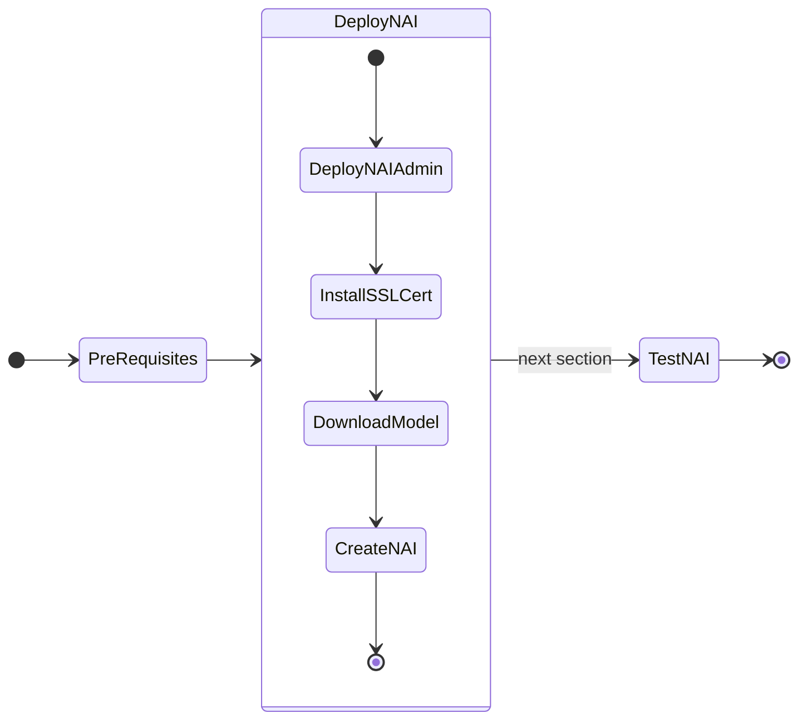
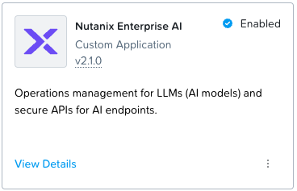
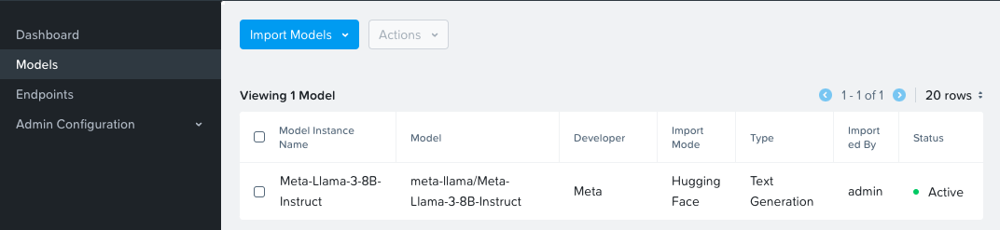

# Deploying Nutanix Enterprise AI (NAI) NVD Reference Application

!!! info "Version 2.0.0"

    This version of the NAI deployment is based on the Nutanix Enterprise AI (NAI) ``v2.0.0`` release.



## Prepare for NAI Deployment

1. Validate if the resources are running in the following namespaces.

    - `istio-system`, 
    - `knative-serving`, and 
    - `kserve`
   
    === "Command"

        ```bash
        kubectl get po -n istio-system
        kubectl get po -n kserve
        kubectl get po -n knative-serving
        ```
        
    === "Command output"

        ```{ .text .no-copy }
        $ k get po -n istio-system
        NAME                                    READY   STATUS    RESTARTS   AGE
        istio-ingressgateway-6675867d85-qzrpq   1/1     Running   0          26d
        istiod-6d96569c9b-2dww4                 1/1     Running   0          26d
        ```
        ```{ .text .no-copy }
        $ k get po -n kserve
        NAME                                        READY   STATUS    RESTARTS   AGE
        kserve-controller-manager-ffb5bdbcb-c7mk5   2/2     Running   0          107m   
        ```
        ```{ .text .no-copy }
        $ k get po -n knative-serving
        NAME                                    READY   STATUS    RESTARTS   AGE
        activator-8b96b9c97-9thnv               1/1     Running   0          23h
        autoscaler-5467785bc-s4v8h              1/1     Running   0          23h
        autoscaler-hpa-96dd77d4b-l4q2g          1/1     Running   0          23h
        controller-5d9c7f4b77-gxpgz             1/1     Running   0          23h
        net-istio-controller-6457c66fc5-6ltfk   1/1     Running   0          23h
        net-istio-webhook-5ff7f55d85-hxn7m      1/1     Running   0          23h
        webhook-57d994c7b8-z58nl                1/1     Running   0          23h
        ```

## Prepare NAI Docker Download Credentials

All NAI Docker images will be downloaded from the public Docker Hub registry. In order to download the images, you will need to logon to [Nutanix Portal - NAI](https://portal.nutanix.com/page/downloads?product=nai) and create a Docker ID and access token.


1. Login to [Nutanix Portal - NAI](https://portal.nutanix.com/page/downloads?product=nai) using your credentials
2. Click on **Generate Access Token** option
3. Copy the generated Docker ID and access token
   
!!! warning
    
    Currently there are issues with the Nutanix Portal to create a Docker ID and access token. This will be fixed soon.

    Click on the **Manage Access Token** option and use the credentials listed there until the Nutanix Portal is fixed.


## Deploy NAI

In this section we will use the NKP Applications Catalog to deploy NAI. 

!!! warning
    NAI catalog has to be added manually for now to NKP Application Catalog. However future releases of NKP v2.14 and beyond may be released with NAI application ready to setup.

1. Add the ``nutanix-apps-catalog`` to NKP 
   
    === "Command"

        ```bash
        nkp create catalog nutanix-apps-catalog -w kommander-workspace --branch main \
        --url https://github.com/nutanix-cloud-native/nkp-nutanix-product-catalog
        ```
    === "Command output"

        ```{ .text .no-copy }
        Catalog GitRepository nutanix-apps-catalog created. Use 'nkp edit gitrepository -n kommander nutanix-apps-catalog' to change its configuration.
        ```

1. In the NKP GUI, Go to **Clusters**
2. Click on **Kommander Host**
3. Go to **Applications** 
4. Search for **Nutanix Enterprise AI**
5. Click on **Enable**
6. Click on Configuration tab
7. Click on Workspace Application Configuration Override and paste the following yaml content

    === "Template yaml"

        ```yaml
        imagePullSecret:
          # Name of the image pull secret
          name: nai-iep-secret
          # Image registry credentials
          credentials:
            registry: https://index.docker.io/v1/
            username: _GA_release_docker_username
            password: _GA_release_docker_password
            email: _Email_associated_with_service_account
        storageClassName: nai-nfs-storage
        ```

    === "Sample yaml"

        ```yaml
        imagePullSecret:
          # Name of the image pull secret
          name: nai-iep-secret
          # Image registry credentials
          credentials:
            registry: https://index.docker.io/v1/
            username: ntnxsvcgpt
            password: dckr_pat_Yxxxxxxxxxxxxxxxxxxxx
            email: first.last@company.com
        storageClassName: nai-nfs-storage
        ```

8. Click on **Enable** on the top right-hand corner to enable **Nutanix Enterprise AI**

9. Wait until **Nutanix Enterprise AI** operator is Enabled. 
    
    

10. Verify that the NAI Core Pods are running and healthy
    
    === "Command"

        ```bash
        kubens nai-system
        kubectl get po,deploy
        ```
    === "Command output"

        ```{ .text .no-copy }
        kubens nai-system
        kubectl get po,deploy
        ✔ Active namespace is "nai-system"
        NAME                                            READY   STATUS      RESTARTS   AGE
        pod/nai-api-5bc49f5445-2bsrj                    1/1     Running     0          119m
        pod/nai-api-db-migrate-9z4s5-fsks5              0/1     Completed   0          119m
        pod/nai-db-0                                    1/1     Running     0          119m
        pod/nai-iep-model-controller-7fd4cfc5cc-cxh2g   1/1     Running     0          119m
        pod/nai-ui-77b7b789d5-wf67d                     1/1     Running     0          119m
        pod/prometheus-nai-0                            2/2     Running     0          119m

        NAME                                       READY   UP-TO-DATE   AVAILABLE   AGE
        deployment.apps/nai-api                    1/1     1            1           119m
        deployment.apps/nai-iep-model-controller   1/1     1            1           119m
        deployment.apps/nai-ui                     1/1     1            1           119m
        ```

## Install SSL Certificate

In this section we will install SSL Certificate to access the NAI UI. This is required as the endpoint will only work with a ssl endpoint with a valid certificate. 

NAI UI is accessible using the Ingress Gateway.

The following steps show how cert-manager can be used to generate a self signed certificate using the default selfsigned-issuer present in the cluster. 

!!! info "If you are using Public Certificate Authority (CA) for NAI SSL Certificate"
    
    If an organization generates certificates using a different mechanism then obtain the certificate **+ key** and create a kubernetes secret manually using the following command:

    ```bash
    kubectl -n istio-system create secret tls nai-cert --cert=path/to/nai.crt --key=path/to/nai.key
    ```

    Skip the steps in this section to create a self-signed certificate resource.

1. Get the Ingress host using the following command:
   
    ```bash
    INGRESS_HOST=$(kubectl get svc -n istio-system istio-ingressgateway -o jsonpath='{.status.loadBalancer.ingress[0].ip}')
    ```

2. Get the value of ``INGRESS_HOST`` environment variable
   
    === "Command"

        ```bash
        echo $INGRESS_HOST
        ```

    === "Command output"

        ``` { .text .no-copy }
        10.x.x.216
        ```

3. We will use the command output e.g: ``10.x.x.216`` as the IP address for NAI as reserved in this [section](../infra/infra_nkp.md#reserve-control-plane-and-metallb-endpoint-ips)

4. Construct the FQDN of NAI UI using [nip.io](https://nip.io/) and we will use this FQDN as the certificate's Common Name (CN).
   
    === "Template URL"

        ```bash
        nai.${INGRESS_HOST}.nip.io
        ```

    === "Sample URL"

        ``` { .text .no-copy }
        nai.10.x.x.216.nip.io
        ```

5. Create the ingress resource certificate using the following command:
   
    ```bash hl_lines="12 14 16"
    cat << EOF | k apply -f -
    apiVersion: cert-manager.io/v1
    kind: Certificate
    metadata:
      name: nai-cert
      namespace: istio-system
    spec:
      issuerRef:
        name: selfsigned-issuer
        kind: ClusterIssuer
      secretName: nai-cert
      commonName: nai.${INGRESS_HOST}.nip.io
      dnsNames:
      - nai.${INGRESS_HOST}.nip.io
      ipAddresses:
      - ${INGRESS_HOST}
    EOF
    ```

6. Create the certificate using the following command
    
    ```bash
    kubectl apply -f $HOME/airgap-nai/nai-cert.yaml
    ```

7. Patch the ingress gateway's IP address to the certificate file.
    
    === "Command"
   
        ```bash
        kubectl patch  gateways.networking.istio.io -n knative-serving knative-ingress-gateway --type merge --patch-file=/dev/stdin <<EOF
        spec:
          servers:
          - hosts:
            - '*'
            port:
              name: https
              number: 443
              protocol: HTTPS
            tls:
              mode: SIMPLE
              credentialName: nai-cert
        EOF
        ```

    === "Command output"
     
        ```{ .text .no-copy }
        gateway.networking.istio.io/knative-ingress-gateway patched 
        ```

## Accessing the UI

6. In a browser, open the following URL to connect to the NAI UI
   
    ```url
    https://nai.10.x.x.216.nip.io
    ```

7. Change the password for the `admin` user
8. Login using `admin` user and password.
   
    

## Download Model

We will download and user llama3 8B model which we sized for in the previous section.

1. In the NAI GUI, go to **Models**
2. Click on Import Model from Hugging Face
3. Choose the ``meta-llama/Meta-Llama-3.1-8B-Instruct`` model
4. Input your Hugging Face token that was created in the previous [section](../iep/iep_pre_reqs.md#create-a-hugging-face-token-with-read-permissions) and click **Import**

5. Provide the Model Instance Name as ``Meta-Llama-3.1-8B-Instruct`` and click **Import**
5. Go to VSC Terminal to monitor the download
    
    === "Command"

        ```bash title="Get jobs in nai-admin namespace"
        kubens nai-admin
        
        kubectl get jobs
        ```
        ```bash title="Validate creation of pods and PVC"
        kubectl get po,pvc
        ```
        ```bash title="Verify download of model using pod logs"
        kubectl logs -f _pod_associated_with_job
        ```

    === "Command output"

        ```text title="Get jobs in nai-admin namespace"
        kubens nai-admin

        ✔ Active namespace is "nai-admin"
     
        kubectl get jobs

        NAME                                       COMPLETIONS   DURATION   AGE
        nai-c0d6ca61-1629-43d2-b57a-9f-model-job   0/1           4m56s      4m56
        ```
        ```text title="Validate creation of pods and PVC"
        kubectl get po,pvc

        NAME                                             READY   STATUS    RESTARTS   AGE
        nai-c0d6ca61-1629-43d2-b57a-9f-model-job-9nmff   1/1     Running   0          4m49s

        NAME                                       STATUS   VOLUME                                     CAPACITY   ACCESS MODES   STORAGECLASS      VOLUMEATTRIBUTESCLASS   AGE
        nai-c0d6ca61-1629-43d2-b57a-9f-pvc-claim   Bound    pvc-a63d27a4-2541-4293-b680-514b8b890fe0   28Gi       RWX            nai-nfs-storage   <unset>                 2d
        ```
        ```text title="Verify download of model using pod logs"
        kubectl logs -f nai-c0d6ca61-1629-43d2-b57a-9f-model-job-9nmff 

        /venv/lib/python3.9/site-packages/huggingface_hub/file_download.py:983: UserWarning: Not enough free disk space to download the file. The expected file size is: 0.05 MB. The target location /data/model-files only has 0.00 MB free disk space.
        warnings.warn(
        tokenizer_config.json: 100%|██████████| 51.0k/51.0k [00:00<00:00, 3.26MB/s]
        tokenizer.json: 100%|██████████| 9.09M/9.09M [00:00<00:00, 35.0MB/s]<00:30, 150MB/s]
        model-00004-of-00004.safetensors: 100%|██████████| 1.17G/1.17G [00:12<00:00, 94.1MB/s]
        model-00001-of-00004.safetensors: 100%|██████████| 4.98G/4.98G [04:23<00:00, 18.9MB/s]
        model-00003-of-00004.safetensors: 100%|██████████| 4.92G/4.92G [04:33<00:00, 18.0MB/s]
        model-00002-of-00004.safetensors: 100%|██████████| 5.00G/5.00G [04:47<00:00, 17.4MB/s]
        Fetching 16 files: 100%|██████████| 16/16 [05:42<00:00, 21.43s/it]:33<00:52, 9.33MB/s]
        ## Successfully downloaded model_files|██████████| 5.00G/5.00G [04:47<00:00, 110MB/s] 

        Deleting directory : /data/hf_cache
        ```

6. Optional - verify the events in the namespace for the pvc creation 
    
    === "Command"

        ```bash
        k get events | awk '{print $1, $3}'
        ```

    === "Command output"

        ```{ .text, .no-copy}
        $ k get events | awk '{print $1, $3}'
    
        3m43s Scheduled
        3m43s SuccessfulAttachVolume
        3m36s Pulling
        3m29s Pulled
        3m29s Created
        3m29s Started
        3m43s SuccessfulCreate
        90s   Completed
        3m53s Provisioning
        3m53s ExternalProvisioning
        3m45s ProvisioningSucceeded
        3m53s PvcCreateSuccessful
        3m48s PvcNotBound
        3m43s ModelProcessorJobActive
        90s   ModelProcessorJobComplete
        ```

The model is downloaded to the Nutanix Files ``pvc`` volume.

After a successful model import, you will see it in **Active** status in the NAI UI under **Models** menu



## Create and Test Inference Endpoint

In this section we will create an inference endpoint using the downloaded model.

1. Navigate to **Inference Endpoints** menu and click on **Create Endpoint** button
2. Fill the following details:
   
    - **Endpoint Name**: ``llama-8b``
    - **Model Instance Name**: ``Meta-LLaMA-8B-Instruct``
    - **Use GPUs for running the models** : ``Checked``
    - **No of GPUs (per instance)**:
    - **GPU Card**: ``NVIDIA-L40S`` (or other available GPU)
    - **No of Instances**: ``1``
    - **API Keys**: Create a new API key or use an existing one

3. Click on **Create**
4. Monitor the ``nai-admin`` namespace to check if the services are coming up
   
    === "Command"

        ```bash
        kubens nai-admin
        kubectl get po,deploy
        ```

    === "Command output"
        
        ```{ .text .no-copy }
        kubens nai-admin
        get po,deploy
        NAME                                                     READY   STATUS        RESTARTS   AGE
        pod/llama8b-predictor-00001-deployment-9ffd786db-6wkzt   2/2     Running       0          71m

        NAME                                                 READY   UP-TO-DATE   AVAILABLE   AGE
        deployment.apps/llama8b-predictor-00001-deployment   1/1     1            0           3d17h
        ```

5. Check the events in the ``nai-admin`` namespace for resource usage to make sure all 
   
    === "Command"
       
        ```bash
        kubectl get events -n nai-admin --sort-by='.lastTimestamp' | awk '{print $1, $3, $5}'
        ```

    === "Command output"
       
        ```bash
        $ kubectl get events -n nai-admin --sort-by='.lastTimestamp' | awk '{print $1, $3, $5}'

        110s FinalizerUpdate Updated
        110s FinalizerUpdate Updated
        110s RevisionReady Revision
        110s ConfigurationReady Configuration
        110s LatestReadyUpdate LatestReadyRevisionName
        110s Created Created
        110s Created Created
        110s Created Created
        110s InferenceServiceReady InferenceService
        110s Created Created
        ```

6. Once the services are running, check the status of the inference service
   
    === "Command"

        ```bash
        kubectl get isvc
        ```

    === "Command output"
        
        ```{ .text .no-copy }
        kubectl get isvc

        NAME      URL                                          READY   PREV   LATEST   PREVROLLEDOUTREVISION   LATESTREADYREVISION       AGE
        llama8b   http://llama8b.nai-admin.svc.cluster.local   True           100                              llama8b-predictor-00001   3d17h
        ```

