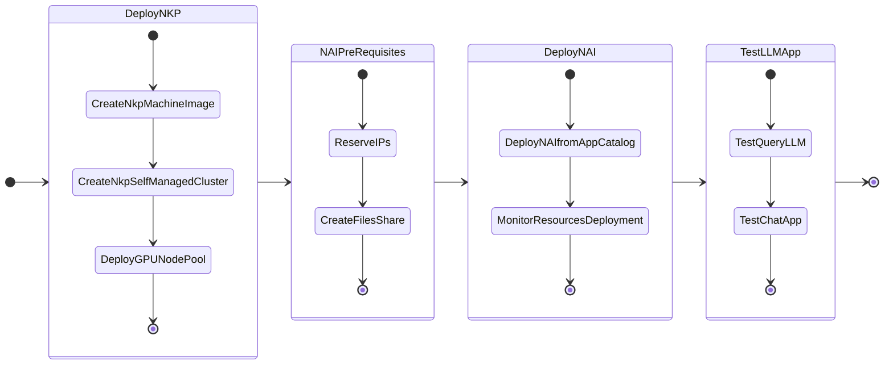

# Getting Started

In this part of the lab we will deploy LLM on GPU nodes.

We will also deploy a Kubernetes (NKP) cluster so far as per the NVD [design requirements](../conceptual/conceptual.md#management-kubernetes-cluster).

**NKP cluster**: to host the dev LLM and ChatBot application - this will use GPU passed through to the kubernetes worker node.

Deploy the kubernetes cluster with the following components:

- 3 x Control plane nodes
- 4 x Worker nodes 
- 1 x GPU node (with a minimum of 40GB of RAM and 16 vCPUs based on ``llama3-8B`` LLM model)

We will deploy the NAI NVD Reference App - backed by ``llama3-8B`` model.

The following is the flow of the NAI lab:

