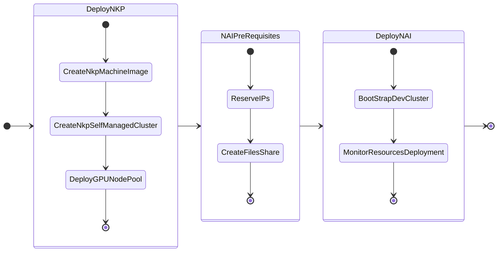

---

title: "Nutanix AI from NKP Catalog"
description: "This is a document that walks through Nutanix AI (NAI) implementation on a NKP cluster using the inbuilt Catalog Applications features. Once a user has access to NKP Dashboard, any application can be installed from the available catalog applications. We will also shortly walk through adding custom catalog with all NAI and pre-requisite applications"

---
# Getting Started

In this part of the lab we will deploy LLM on GPU nodes using NAI that is completely deployed from NKP Catalog Applications.

This is easy way to get NAI up and running if there are not many complex NAI configurations necessary. We will provide options along the way that can be customised. 

We will also deploy a Kubernetes cluster so far as per the NVD [design requirements](../conceptual/conceptual.md#management-kubernetes-cluster).

**NKP cluster**: to host NAI - this will use GPU passed through to the kubernetes worker node.

Deploy the kubernetes cluster with the following components:

- 3 x Control plane nodes
- 4 x Worker nodes 
- 1 x GPU node (with a minimum of 40GB of RAM and 16 vCPUs based on ``llama3-8B`` LLM model)

We will install NAI ``v2.7.0`` using the NKP Catalog applications. All pre-requisite applications for NAI are published in the NKP ``v2.17.1`` Applications Catalog.

The following is the flow of the NAI lab:

