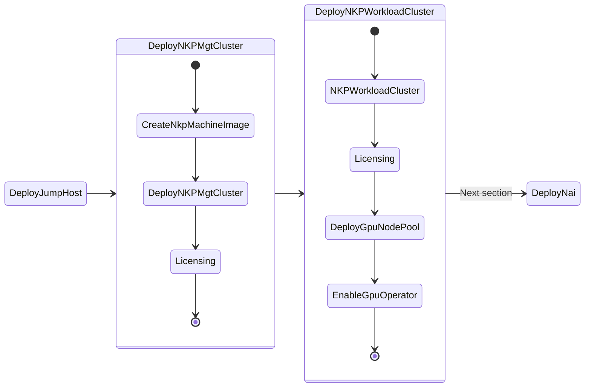

# Deploy NKP Clusters

This section will take you through install NKP(Kubernetes) on Nutanix cluster as we will be deploying AI applications on these kubernetes clusters.

We will use the [CAPI](https://cluster-api.sigs.k8s.io/) based deployment of NKP. This will automatically deploy the required infrastructure VMs for the cluster by connecting to Nutanix Cluster APIs. There is no requirement to use Terraform or or other IaC tools to deploy NKP.

!!! example "Pre-requisites"

    1. Existing Ubuntu Linux jumphost VM. See here for jumphost installation [steps](../infra/infra_jumphost_tofu.md).
    2. [Docker](#setup-docker-on-jumphost) or Podman installed on the jumphost VM
    3. Nutanix PC is at least ``pc.7.5.0.1``
    4. Nutanix AOS is at least ``7.3.0.5``
    5. Download and install NKP ``v2.17.1`` binary from Nutanix Portal
    6. Find and reserve 3 IPs for control plane and MetalLB access from AHV network
    7. Find GPU details from Nutanix cluster
    8. Create a base image to use with NKP nodes using ``nkp`` command
   
## NKP High Level Cluster Design

In this design, we will deploy two clusters: NKP Management to manage the fleet of workload clusters and a workload cluster to deploy NAI on (with GPU).

The ``nkpmanage`` nkp management cluster will be deployed to manage the fleet of workload clusters.

The ``nkpnai`` cluster will be hosting the LLM model serving endpoints and AI application stack. This cluster and will require a dedicated GPU node pool.

| Cluster Role   | Cluster Name   | Control Plane Nodes   |   Worker Nodes   | Purpose |
| -------------  | --------       |  ------------      |  --------       |------------- |
| Management     |``nkpmanage``   |  1                 |  2              |  Management of NKP Clusters Fleet  |
| NAI            |``nkpnai``      |  3                 |  4              |  NAI workload cluster              |

### Management Cluster

Since the Management Cluster called ``nkpmanage`` will be essential to deploying a workload ``nkpnai`` cluster, we recommend at least the following node counts, compute and storage.

| Role   | No. of Nodes (VM) | vCPU | RAM   | Storage |
| ------ | ----------------- | ---- | ----- | ------- |
| Master | 1                 | 8    | 12 GB | 200 GB  |
| Worker | 2                 | 8    | 12 GB | 200 GB  |
| **Totals** | 3        |   16 | 36 GB | 600 GB  |  

!!! Warning "Sizing Warning"

    Consult the [NKP NVD](https://portal.nutanix.com/page/documents/solutions/details?targetId=NVD-2118-NKP:portal-full-page-view-html) for in-depth requirements collection, analysis and sizing. 

### Workload Cluster

We will use the workload cluster to deploy NAI on GPU nodes. 

!!! tip ""CPU Only Nodes?""

    CPU only node deployment of NAI is also possible in the following cicumstances:

    - Large Language Model is less than 8B parameters (for now)
    - NAI implementation is used as a gateway to other implementations of NAI 
    - NAI implementation is used as a gateway to external (public) inferencing endpoint providers

#### Sizing Requirements

Below are the sizing requirements needed to successfully deploy NAI on a NKP Cluster (labeled as ``nkpnai``) and subsequently deploying single LLM inferencing endpoint on NAI using the `meta-llama/Meta-Llama-3-8B-Instruct` LLM model.

??? Tip "Calculating GPU Resources Tips"

    The calculations below assume that you're already aware of how much memory is required to load target LLM model.

    For a general example:

    - To host a 8b(illion) parameter model, multiply the parameter number by 2 to get minimum GPU memory requirments. 
      e.g. 16GB of GPU memory is required for 8b parameter model.
  
    > So in the case of the `meta-llama/Meta-Llama-3-8B-Instruct` model, you'll need a min. 16 GiB GPU vRAM available

    Below are additional sizing consideration "Rule of Thumb" for further calculating min. GPU node resources:

    - For each GPU node will have 8 CPU cores, 24 GB of memory, and 300 GB of disk space.
    - For each GPU attached to the node, add 16 GiB of memory.
    - For each endpoint attached to the node, add 8 CPU cores.
    - If a model needs multiple GPUs, ensure all GPUs are attached to the same worker node
    - For resiliency, while running multiple instances of the same endpoint, ensure that the GPUs are on different worker nodes.

Since we will be testing with the ``meta-llama/Meta-Llama-3-8B-Instruct`` HuggingFace model, we will require a GPU with a min. of 24 GiB GPU vRAM available to support this demo.

!!! note
    GPU min. vRAM should be 24 GB, such as NVIDIA L4 Model.

Below are minimum requirements for deploying NAI on the NKP Demo Cluster.

| Role          | No. of Nodes (VM) | vCPU per Node | Memory per Node | Storage per Node | Total vCPU | Total Memory |
|---------------|-------------------|---------------|-----------------|------------------|------------|--------------|
| Control plane | 3                 | 4             | 16 GB           | 150 GB           | 12         | 48 GB        |
| Worker        | 4                 | 12            | 32 GB           | 150 GB           | 36         | 128 GB       |
| GPU           | 1                 | 20            | 40 GB           | 300 GB           | 20         | 40 GB        |
| **Totals**    |                   |               |                 |                  | **68**     | **216 GB**   |

### Deploy NKP Clusters

Follow instructions here to create NKP Management and Workload Clusters:

> Install the following [NKP Dependencies](../appendix/infra_nkp_airgap.md#deploy-nkp-clusters):

   - NKP Binaries
   - NKP Base Ubuntu Image
   - Control Plane and Metal LB IP Reservations
 
## Create a NKP Management K8S Cluster

In this section we will create a NKP Management (bootstrap)  ``nkpmanage`` cluster.

!!! warning

    We are creating the management cluster with minimal resources in this lab environment. 

    Consider adding additional control plane nodes and increasing CPU and memory of NKP management cluster for production environments as discussed in the [Pre-requisites](#nkp-high-level-cluster-design) section. 

> Install [NKP Management](../appendix/infra_nkp_hard_way.md#create-a-nkp-management-k8s-cluster) cluster 

### License Management Cluster

It is necessary to install license to the Management Cluster ``nkpmanage`` to be able to deploy workload clusters. Especially if the OS of the workload clusters' nodes is going to be ``Ubuntu``

Follow the steps in this [document](../infra/infra_nkp.md#licensing) to create and apply licenses on the management cluster.

!!! note

    This Pro/Ultimate licensing requirement to deploy workload clusters with Ubuntu OS may change in the future. We will be sure to update here.

## Create NKP Workload Cluster

In this section we will create a NKP workload ``nkpnai`` cluster to deploy NAI. 

> 1. Install [NKP Workload Cluster](../appendix/infra_nkp_hard_way.md#create-nkp-workload-cluster) for deploying NAI
> 2. Install [NVIDIA GPU Operator](../appendix/infra_nkp_hard_way.md#enable-gpu-operator)
> 3. Add [NKP GPU Workload Pool](../appendix/infra_nkp_airgap.md#add-nkp-gpu-workload-pool)

The ``nkpnai`` workload cluster is now ready to deploy AI workloads that require GPU.
