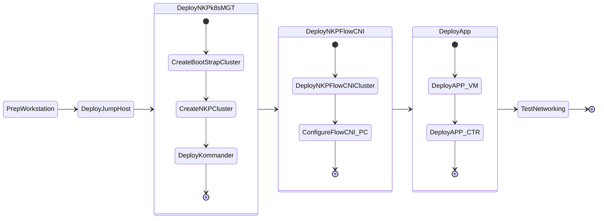

---

title: "Nutanix NKP - Flow CNI"
description: "Flow Container Network Interface (Flow CNI) that provides unified networking for VMs and containers within Nutanix environments.Flow CNI leverages overlay-based networking and Network Kubernetes integration. It extends Virtual Private Cloud (VPC) capabilities to Kubernetes environments such that VMs and containers coexist within a shared overlay networking domain. This integration simplifies network management for advanced uses such as supporting multiple VPCs within a single Kubernetes cluster or spanning a VPC across multiple clusters."

---

# Flow CNI Lab Guide: Federated Environment on Nutanix NKP

## Introduction
Flow Container Network Interface (Flow CNI) provides unified networking for VMs and containers within Nutanix environments. By leveraging overlay-based networking and Kubernetes network integration, Flow CNI extends Nutanix Virtual Private Cloud (VPC) capabilities directly into Kubernetes. This allows both VMs and containers to coexist and communicate within a shared overlay networking domain.

This integration simplifies network management for advanced use cases, such as supporting multiple VPCs within a single Kubernetes cluster or spanning a single VPC across multiple clusters. 

In a **Federated Environment**—which involves interconnecting VMs and Kubernetes clusters—Flow CNI orchestrates the networks connecting your traditional VMs and your modern Kubernetes pods. To achieve this, you configure the Kubernetes workload clusters in the same VPCs that contain your VMs.

!!! note
    
    Flow CNI exclusively supports Kubernetes clusters that are created and managed by the Nutanix Kubernetes Platform (NKP).

---

## Capabilities of Flow CNI
Flow CNI delivers a rich set of networking features for hybrid deployments:

* **Overlay Networking:** Supports overlay networking for Kubernetes pods using Geneve encapsulation.
* **Comprehensive Traffic Routing:** Supports both east-west and north-south traffic routing within and across cluster nodes.
* **Service Communication:** Facilitates reliable pod-to-service communication utilizing cluster IP addresses and native load balancing.
* **External Access:** Enables secure external access through SNAT, egress IP addresses, and egress services.
* **Control Plane Federation:** Supports the federation of VM and Kubernetes control planes via a global control plane that spans across clusters.
* **Hybrid Environment Integration:** Seamlessly supports environments where VMs and Kubernetes containers share the same VPCs, enabling mutual service discovery and network access between VMs and Kubernetes services.

---

The following is the lab flow:

