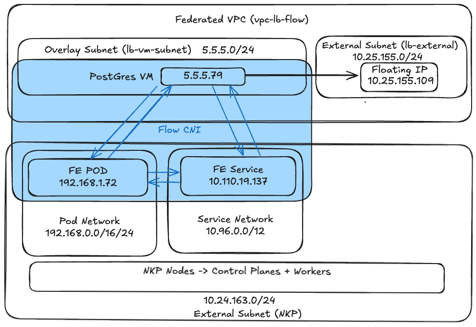
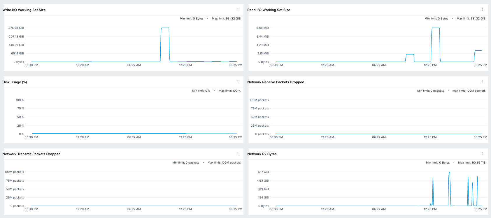
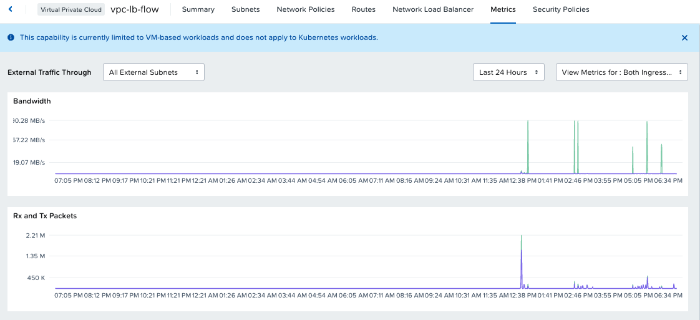

In this section of the lab we will do the following:

1. Deploy a Postgres DB on a VM and configure
2. Deploy a front end network tester app on ``nkpflow`` cluster which we deployed in the previous section
3. Run a few performance and network tests from the front end app's UI
4. Implement a network policy and check how the communication between VM and front end app can be restricted

!!! warning
    
    These are tests just to show case Flow CNI's capability in a **test** environment. 

    For production environments, use Nutanix database, Flow CNI, and HCI [Nutanix Validated Design (NVD)](https://www.nutanix.com/blog/nutanix-validated-designs-blueprints-for-success) directions.


## App Design



## Deploy Postgres DB VM

1. In Prism Central go to Compute > VM
2. Create a Postgres VM with the following attributes
   
    -  **Name**: ``pg-test-vm`` 
    -  **VM Properties**: 
        -  **CPUs** - `6` vCPU
        -  **Cores per CPU** - `1`
        -  **Memory** - `8` GB
    -  **Attach Disk**:
        -  **Operation** - clone from image
        -  **Image** - ``Ubuntu-24.04-server-cloudimg-amd64.img``
        -  **Click** on **Save**
    -  **Attach to Subnet**
        -  **Subnet**: ``lb-vm-subnet`` (VPC Internal only subnet created in the previous section)
        -  **Assignment Type**: Assign with DHCP
        -  Click on **Save**
    - **Guest Customization**:
       - Script Type: Cloud-init (Linux)
       - Use the following sample cloud-init
 
         ```yaml hl_lines="2 24"
         #cloud-config
         hostname: pg-test-vm                   # << Change to your pg vm >>
         package_update: true
         package_upgrade: true
         package_reboot_if_required: true
         packages:
           - open-iscsi
           - nfs-common
           - git
           - jq
           - bind-utils
           - nmap
           - docker.io
         users:
           - default
           - name: ubuntu
             groups: sudo
             shell: /bin/bash
             sudo:
               - 'ALL=(ALL) NOPASSWD:ALL'
             lock_passwd: false
             shell: /bin/bash
             ssh-authorized-keys: 
             - ssh-rsa AAAAB3xxxxxxxxxxx     # << Change to your ssh public key >>
         runcmd:
           - systemctl stop ufw && systemctl disable ufw
           - eject
           - reboot
         ```

3. Obtain an Floating IP for the VM in **Prism Central** > **Network & Security** and **Floating IPs**

4. Click on Request Floating IP
   
    - **External subnet:** - ``lb-external``
    - **Number of Floating IPs:** - ``1``
    - Select **Assign Floating IPs** 
    - Choose the ``pg-test-vm`` VM
    - Click on **Save**
  
5. Login to the VM using SSH (get IP address from Prism Central)
   
    === ":octicons-command-palette-16: Command"
    
        ```bash
        ssh -l ubuntu _IP_ADDRESS_OF_PG_VM
        ```
    
    === ":octicons-command-palette-16: Command"
    
        ```bash
        ssh -l ubuntu 10.24.155.106
        ```
   
6. Configure Postgres
   
    === ":octicons-command-palette-16: Command"
    
        ```bash
        sudo apt update
        sudo apt install -y postgresql postgresql-contrib iperf3
        ```

7. Edit the main config file to listen on all interfaces.
   
    === ":octicons-command-palette-16: Command"
    
        ```bash
        sudo vi /etc/postgresql/16/main/postgresql.conf
        ```
    

6. Find `#listen_addresses = 'localhost'` and change it to:
   
    === ":octicons-file-code-16: File ``postgresql.conf``"
 
        ```text
        listen_addresses = '*'
        ```


7. **Whitelist the NKP Pod Network:**
    Edit the client authentication file.

    === ":octicons-command-palette-16: Command"
 
        ```bash
        sudo nano /etc/postgresql/16/main/pg_hba.conf
        ```
    
    
    Add your cluster's Pod CIDR (e.g., `10.24.0.0/16`) to the bottom of the file:

    === ":octicons-file-code-16: File ``pg_hba.conf``"
 
        ```text
        host    all             all             10.24.0.0/16            md5
        # Optional pod and service networks
        # host    all             all             192.168.0.0/16          md5
        # host    all             all             192.168.0.0/24          md5
        # host    all             all             10.96.0.0/12            md5
        ```


8. **Restart PostgreSQL:**
   
    === ":octicons-command-palette-16: Command"
  
        ```bash
        sudo systemctl restart postgresql
        ```


9. Run these commands sequentially to set up the `pgbench` environment: **Create the Database, User, and Permissions:**

    === ":octicons-command-palette-16: Command"

        ```bash
        sudo -u postgres psql -c "CREATE DATABASE pgbench_test;"
        sudo -u postgres psql -c "CREATE USER tester WITH PASSWORD 'testpassword';"
        sudo -u postgres psql -c "GRANT ALL PRIVILEGES ON DATABASE pgbench_test TO tester;"
        
        # Crucial: Grant schema permissions inside the test database for PG 15+
        sudo -u postgres psql -d pgbench_test -c "GRANT ALL ON SCHEMA public TO tester;"
        ```

---

## Deploy the Frontend App to NKP

Now we will deploy the testing UI to your Kubernetes cluster.

1. From the jumphost VM set kubernetes context to ``nkpflow`` NKP cluster (created in the previous sections)
   
    === ":octicons-command-palette-16: Command"
    
        ```bash
        export KUBECONFIG=nkpflow.conf
        ```

     
2.  Apply the ``ConfigMap``:
    
    === ":octicons-command-palette-16: Command"

        ```bash
        kubectl apply -f https://raw.githubusercontent.com/nutanix-japan/nai-llm/refs/heads/main/docs/nkp_flow_cni/cm.yaml
        ```


3. Apply the ``Deployment`` and ``Service``:
   
    === ":octicons-command-palette-16: Command"
    
        ```bash
        kubectl apply -f https://raw.githubusercontent.com/nutanix-japan/nai-llm/refs/heads/main/docs/nkp_flow_cni/app.yaml
        ```

---

## Access and Run Tests

### Pods to VM Tests

1. Get the name of front end pod
   
    === ":octicons-command-palette-16: Command"
    
        ```bash
        kubectl get pods
        ```
    
    === ":octicons-command-palette-16: Command output"
    
        ```bash hl_lines="5"
        $ kubectl get pods
        #
        NAME                             READY   STATUS    RESTARTS   AGE
        flow-ovn-ic-86bc48984c-lxx8s     1/1     Running   0          46h
        network-tester-9c4dd5754-5b5xb   1/1     Running   0          20m
        nginx-pod                        1/1     Running   0          6d2h
        ```
    
2. Set environment variables for VM IP and pod name
   
    === ":octicons-file-code-16: Template ``.env``"
    
        ```bash
        export PG_VM_IP=x.x.x.x
        export POD_NAME=_POD_NAME
        ```
    
    === ":octicons-file-code-16: Sample ``.env``"
    
        ```bash
        export PG_VM_IP=10.24.155.106
        export POD_NAME=network-tester-9c4dd5754-5b5xb
        ```

2. Run network test using
   
    === ":octicons-command-palette-16: Command"
    
        ```bash
        kubectl exec -it ${POD_NAME} -- curl -N "http://localhost:8080/test/network?ip=${PG_VM_IP}"
        ```
    
    === ":octicons-command-palette-16: Sample command"
    
        ```bash
        kubectl exec -it network-tester-9c4dd5754-5b5xb -- curl -N "http://localhost:8080/test/network?ip=10.24.155.106"
        ```
    
    === ":octicons-command-palette-16: Command output"
    
        ```{ .text .no-copy }
        $ kubectl exec -it ${POD_NAME} -- curl -N "http://localhost:8080/test/network?ip=${PG_VM_IP}"
        data: Starting process...
        data: Command: iperf3 -c 10.24.155.109
        data: Connecting to host 10.24.155.109, port 5201
        data: [  5] local 192.168.1.72 port 34684 connected to 10.24.155.109 port 5201
        data: [ ID] Interval           Transfer     Bitrate         Retr  Cwnd
        data: [  5]   0.00-1.00   sec   538 MBytes  4.51 Gbits/sec  474    673 KBytes
        data: [  5]   1.00-2.00   sec   541 MBytes  4.54 Gbits/sec  279    627 KBytes
        data: [  5]   2.00-3.00   sec   539 MBytes  4.52 Gbits/sec   72    866 KBytes
        data: [  5]   3.00-4.00   sec   545 MBytes  4.57 Gbits/sec  104    957 KBytes
        data: [  5]   4.00-5.00   sec   542 MBytes  4.55 Gbits/sec  150    562 KBytes
        data: [  5]   5.00-6.00   sec   540 MBytes  4.53 Gbits/sec  368    678 KBytes
        data: [  5]   6.00-7.00   sec   544 MBytes  4.56 Gbits/sec  270    652 KBytes
        data: [  5]   7.00-8.00   sec   542 MBytes  4.55 Gbits/sec    3   1.05 MBytes
        data: [  5]   8.00-9.00   sec   545 MBytes  4.57 Gbits/sec  164    748 KBytes
        data: [  5]   9.00-10.00  sec   545 MBytes  4.57 Gbits/sec  178    758 KBytes
        data: - - - - - - - - - - - - - - - - - - - - - - - - -
        data: [ ID] Interval           Transfer     Bitrate         Retr
        data: [  5]   0.00-10.00  sec  5.29 GBytes  4.55 Gbits/sec  2062             sender
        data: [  5]   0.00-10.00  sec  5.29 GBytes  4.54 Gbits/sec                  receiver
        data: 
        data: iperf Done.
        data: Exit code: 0
        data: [DONE]
        ```

3. Run a DB initialise test
   
    === ":octicons-command-palette-16: Command"
    
        ```bash
        kubectl exec -it ${POD_NAME} -- curl -N "http://localhost:8080/test/db-init?ip=${PG_VM_IP}"
        ```
    
    === ":octicons-command-palette-16: Sample command"
    
        ```bash
        kubectl exec -it network-tester-9c4dd5754-5b5xb -- curl -N "http://localhost:8080/test/db-init?ip=10.24.155.106"
        ```
    
    === ":octicons-command-palette-16: Command output"
    
        ```{ .text .no-copy }
        data: Starting process...
        data: Command: pgbench -i -s 50 -h 10.24.155.109 -U tester -d pgbench_test
        data: dropping old tables...
        data: creating tables...
        data: generating data (client-side)...

        < Snipped for brevity>

        data: 100000 of 5000000 tuples (2%) done (elapsed 0.01 s, remaining 0.65 s)
        data: 4500000 of 5000000 tuples (90%) done (elapsed 4.66 s, remaining 0.52 s)
        data: 4600000 of 5000000 tuples (92%) done (elapsed 4.75 s, remaining 0.41 s)       
        data: 4700000 of 5000000 tuples (94%) done (elapsed 4.82 s, remaining 0.31 s)     
        data: 4800000 of 5000000 tuples (96%) done (elapsed 4.89 s, remaining 0.20 s)      
        data: 4900000 of 5000000 tuples (98%) done (elapsed 4.97 s, remaining 0.10 s)       
        data: 5000000 of 5000000 tuples (100%) done (elapsed 5.06 s, remaining 0.00 s)       
        data: vacuuming...      
        data: creating primary keys...      
        data: done in 6.95 s (drop tables 0.11 s, create tables 0.01 s, client-side generate 5.18 s, vacuum 0.15 s, primary keys 1.49 s).      
        data: Exit code: 0  
        data: [DONE]
        ```
   
    
4. Run a DB load test from the pod. The test will run for approximately ``2 minutes``
   
    === ":octicons-command-palette-16: Command"
      
          ```bash
          kubectl exec -it ${POD_NAME} -- curl -N "http://localhost:8080/test/db-run?ip=${PG_VM_IP}&clients=5&threads=2&time=30"
          ```
    
    === ":octicons-command-palette-16: Sample command"
      
          ```bash
          kubectl exec -it network-tester-9c4dd5754-5b5xb -- curl -N "http://localhost:8080/test/db-run?ip=10.24.155.106&clients=5&threads=2&time=30"
          ```
    
    === ":octicons-command-palette-16: Command output"
      
          ```{ .text .no-copy }
          data: Starting process...
          data: Command: pgbench -c 5 -j 2 -T 30 -P 1 -h 10.24.155.109 -U tester -d pgbench_test
          data: pgbench (15.18 (Debian 15.18-0+deb12u1), server 16.14 (Ubuntu 16.14-0ubuntu0.24.04.1))
          data: pgbench: pghost: 10.24.155.109 pgport: 5432 nclients: 5 duration: 30 dbName: pgbench_test
          data: starting vacuum...end.
  
          < Snipped for brevity>

          data: pgbench: client 0 executing script "<builtin: TPC-B (sort of)>"
          data: scaling factor: 50
          data: query mode: simple          
          data: number of clients: 5         
          data: number of threads: 2        
          data: maximum number of tries: 1         
          data: duration: 30 s        
          data: number of transactions actually processed: 27635         
          data: number of failed transactions: 0 (0.000%)       
          data: latency average = 5.763 ms      
          data: latency stddev = 108.880 ms         
          data: initial connection time = 48.826 ms         
          data: tps = 851.217054 (without initial connection time)         
          data: Exit code: 0         
          data: [DONE]
          ```

### VM to Pod Tests

1. Get pod's IP address from the Jumphost using ``nkpflow`` workload cluster's kubeconfig file
   
    === ":octicons-command-palette-16: Command"
    
        ```bash
        kubectl get svc --kubeconfig=nkpflow.conf
        kubectl get po -o wide --kubeconfig=nkpflow.conf
        ```
    
    === ":octicons-command-palette-16: Command output"
    
        ```bash hl_lines="5"
        $ kubectl get svc --kubeconfig=nkpflow.conf
        #
        NAME                 TYPE        CLUSTER-IP      EXTERNAL-IP   PORT(S)   AGE
        kubernetes           ClusterIP   10.96.0.1       <none>        443/TCP   6d23h
        network-tester-svc   ClusterIP   10.110.19.137   <none>        80/TCP    4d1h
        nginx-service        ClusterIP   10.111.215.28   <none>        80/TCP    6d18h
        #
        $ kubectl get po -o wide --kubeconfig=nkpflow.conf
        #
        NAME                              READY   STATUS    RESTARTS   AGE     IP             NODE                          NOMINATED NODE   READINESS GATES
        flow-ovn-ic-7d6c5bdc87-pcxk7      1/1     Running   0          7h      10.24.163.48   flow-zfck9-57vxk              <none>           <none>
        network-tester-8688b44dd7-9bqvt   1/1     Running   0          16h     192.168.1.72   flow-md-0-4v9w6-b26pn-vbqwv   <none>           <none>
        ```

2. Login to the VM using SSH (using exernal floating IP)
   
    === ":octicons-command-palette-16: Command"
    
        ```bash
        ssh -l ubuntu ${PG_VM_IP}
        ```
    
    === ":octicons-command-palette-16: Command"
    
        ```bash
        ssh -l ubuntu 10.24.155.106
        ```

3. Set environment variables for fron end service ip within the PG VM
   
    === ":octicons-file-code-16: Template ``.env``"
    
        ```bash
        export FE_SVC_IP=x.x.x.x
        export FE_POD_IP=x.x.x.x
        ```
    
    === ":octicons-file-code-16: Sample ``.env``"
    
        ```bash
        export FE_SVC_IP=10.110.19.137
        export FE_POD_IP=192.168.1.72
        ```

4. Run curl command to test in the application is running on the front end pods and to check connectivity

    === ":octicons-command-palette-16: Command"
    
        ```text
        curl ${FE_SVC_IP}
        ```
    
    === ":octicons-command-palette-16: Sample command"
    
        ```text
        curl 10.110.19.137
        ```
    
    === ":octicons-command-palette-16: Command output"
    
        ```{ .text .no-copy }
        $ curl 10.110.19.137
        #
        <!DOCTYPE html>
        <html>
        <head>
            <title>NKP Network & DB Tester</title>
            <style>
                body { font-family: sans-serif; margin: 20px; background: #f4f4f9; }
                .container { max-width: 900px; margin: auto; background: white; padding: 20px;
                            border-radius: 8px; box-shadow: 0 4px 6px rgba(0,0,0,0.1); }
                .controls { display:flex; gap:10px; margin-bottom:15px; flex-wrap:wrap; align-items:center; }
                button { padding:10px 15px; cursor:pointer; background:#0056b3; color:white;
                        border:none; border-radius:4px; font-weight:bold; }
                button:hover { background:#003d82; }
                .btn-danger { background:#dc3545; }
                .btn-danger:hover { background:#a71d2a; }
                input { padding:8px; border:1px solid #ccc; border-radius:4px; }
                #console { background:#1e1e1e; color:#00ff00; padding:15px; height:500px;
                        overflow-y:auto; font-family:monospace; border-radius:4px;
                        white-space:pre-wrap; }
            </style>
        </head>
        <body>
        <div class="container">
        <h2>NKP to Nutanix VM Tester</h2>

        <Snipped for brevity>
        ```

5. Run curl command to test in the application is running on the front end pods (instead of service) and to check connectivity

    === ":octicons-command-palette-16: Command"
    
        ```text
        curl ${FE_POD_IP}:8080
        ```
    
    === ":octicons-command-palette-16: Sample command"
    
        ```text
        curl 192.168.1.72:8080
        ```

Flow CNI allows connectivity between VM, Pods and Services. 

### Observe Metrics in Prism Central

1.  Login to the Prism Central UI 
7.  Go to **Compute** > **VMs** > Click the ``pg-test-vm`` VM
8.  Go to **Metrics** and observe storage and network related graphs
    
     

9.  Go to **Network** > **Virtual Private Clouds**
10. Choose ``vpc-lb-flow`` and go to **Metrics**
11. Check the **Ingress and Egress** metrics
    

You now have a fully functional, repeatable testing harness to measure Nutanix Flow performance between your Kubernetes pods and your external infrastructure.


## Flow CNI - Network Policy Tests

### Pod to Pod Traffic Blocking

We will define kubernetes network policy to restrict tranffic between pods

1. Deploy a nginx container
   
    === ":octicons-command-palette-16: Command"
    
        ```bash
        kubectl apply -f -<<EOF
        apiVersion: v1
        kind: Pod
        metadata:
          name: nginx-pod
          labels:
            app: nginx
        spec:
          containers:
          - name: nginx
            image: nginx:latest
            ports:
            - containerPort: 80
        EOF
        ```

    === ":octicons-command-palette-16: Command output"
    
        ```{ .text .no-copy }
        pod/nginx-pod created
        ```

2. Create a network policy to prevent all traffic outgoing traffic in network tester pod
   
    === ":octicons-command-palette-16: Command"
    
        ```bash
        kubectl apply -f -<<EOF
        apiVersion: networking.k8s.io/v1
        kind: NetworkPolicy
        metadata:
          name: restrict-tester-egress
          namespace: default 
        spec:
          podSelector:
            matchLabels:
              app: network-tester
          policyTypes:
          - Egress
          egress:
          - to:
            - podSelector:
                matchExpressions:
                - key: app
                  operator: NotIn
                  values:
                  - nginx
        EOF
        ```
    
    === ":octicons-command-palette-16: Command output"
    
        ```{ .text .no-copy }
        networkpolicy.networking.k8s.io/restrict-tester-egress created
        ```

3. Set environment variables for nginx pod IP 
   
    === ":octicons-file-code-16: Template ``.env``"
    
        ```bash
        export NGINX_IP=$(kubectl get po -l app=nginx -o jsonpath='{.items[0].status.podIP}')
        ```

4. Login to network tester pod and test connection to nginx pod
   
    === ":octicons-command-palette-16: Command"
    
        ```bash
        kubectl exec -it ${POD_NAME} -- curl ${NGINX_IP}
        ```
    
    === ":octicons-command-palette-16: Sample command"
    
        ```text
        kubectl exec -it network-tester-8688b44dd7-9bqvt -- curl 192.168.1.30
        ```

5. Login to nginx pod and test connection to network test pod
    
    === ":octicons-command-palette-16: Command"
    
        ```bash
        kubectl exec -it nginx-pod -- curl "${NGINX_IP}:8080"
        ```
    
    === ":octicons-command-palette-16: Sample command"
    
        ```text
        kubectl exec -it nginx-pod -- curl 192.168.1.72:8080
        ```

    === ":octicons-command-palette-16: Command output"
    
        ```{ .text .no-copy }
        $ kubectl exec -it nginx-pod -- curl 192.168.1.72:8080
        #
        <!DOCTYPE html>
        <html>
        <head>
            <title>NKP Network & DB Tester</title>
            <style>
                body { font-family: sans-serif; margin: 20px; background: #f4f4f9; }
                .container { max-width: 900px; margin: auto; background: white; padding: 20px;
                            border-radius: 8px; box-shadow: 0 4px 6px rgba(0,0,0,0.1); }
                .controls { display:flex; gap:10px; margin-bottom:15px; flex-wrap:wrap; align-items:center; }
                button { padding:10px 15px; cursor:pointer; background:#0056b3; color:white;
                        border:none; border-radius:4px; font-weight:bold; }
                button:hover { background:#003d82; }
                .btn-danger { background:#dc3545; }
                .btn-danger:hover { background:#a71d2a; }
                input { padding:8px; border:1px solid #ccc; border-radius:4px; }
                #console { background:#1e1e1e; color:#00ff00; padding:15px; height:500px;
                        overflow-y:auto; font-family:monospace; border-radius:4px;
                        white-space:pre-wrap; }
            </style>
        </head>
        <body>
        <div class="container">
        <h2>NKP to Nutanix VM Tester</h2>

        <Snipped for brevity>
        ```

We have successfully tested Flow CNI functionality with NKP (kubernetes) level network policies.