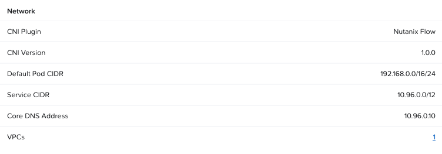

---

title: "Flow CNI - Preparing VPC and Subnets"
description: ""

---

# Preparing VPC and Subnets

In this section we will prepare all the networking components necessary for Flow CNI. 

!!! note
    
    The names of network components are for illustrative purposes. Choose your own entity names

## Networking Requirements

| Component         	| Name     	        | Details                                                    	|
|-------------------	|----------	        |------------------------------------------------------------	|
| VPC               	| ``vpc-lb-flow`` 	| Federated VPC for VM and Containers communications         	|
| Overlay Subnet    	| ``lb-vm-subnet``  | Overlay internal only subnet for VM                        	|
| External Subnet 1 	| ``lb-external``   | External subnet for Floating IPs - external access for VMs 	|
| External Subnet 2 	| ``NKP``           | External subnet for NKP control plane and worker nodes     	|

## Create Externel Subnet

!!! note
    
    The IP address schemes are for illustrative purposes. Choose your own subnet details

1. Go to **Prism Central** > **Networking** > **Subnets**
2. Click on **Create Subnet** and fill the following details
   
    -  **Name**: ``lb-external``
    -  **Type**: VLAN
    -  **Virtual Switch**: ``vs0``
    -  **VLAN ID**: 0
    -  **Exretnal connectivity for VPC** - Toggle to ``Yes`` and select ``NAT``
    -  **IP Address Management**: Nutanix IPAM
    -  **Network IP Address / Profile**: ``10.24.152.0/22``
    -  **Gateway IP Address**: ``10.24.152.1``
    -  **IP Pool**
        - **Start Address**: ``10.24.155.106``
        - **End Address**: ``10.24.155.109``
3. Click on **Create**

## Activate Nutanix Flow Features on NKP Workload Cluster

1. Go to **Prism Central** > **Kubernetes Cluster** 
2. Choose ``nkpflow`` NKP cluster created in the previous [section](../nkp_flow_cni/nkp_flow_nkp_wrkld.md#deploy-nkp-workload-cluster)
3. Click on **Activate Nutanix Flow Features**
4. Paste the contents of ``nkpflow.conf`` kubeconfig file
5. Click on **Activate**

!!! info

    This Nutanix Flow features' activation will take about 5 minutes

    The status can be seen in the nkplb cluster details page

    

## Create VPC

1. Go to **Prism Central** > **Networking** > **VPC**
2. Click on **Create VPC** and fill the following details
   
    -  **Name**: ``vpc-lb-flow`` 
    -  **Scope**: choose both **Virtual Machines** and **Containers**
    -  **External Connectivity**: choose ``lb-external`` subnet created in the previous section
    -  **DNS** - add ``8.8.8.8``, ``8.8.4.4`` and other preferred DNS servers
    -  **Container Networking**:
        * **Kubernetes Cluster**: ``nkpflow``
        * **POD CIDR** - will be automatically populated with settings from nkpflow cluster creation
3. Click on **Create**

## Create Overlay Subnet

1. Click the ``vpc-lb-flow` VPC and go to **Subnets**
2. Click on **Create Subnet** with the following details:
   
    -  **Name**: ``vpc-lb-flow`` 
    -  **Type**: Overlay
    -  **IP Assignment Service**: Nutanix IPAM
    -  **Network IP Address / Profile**: ``5.5.5.0/24``
    -  **Gateway IP Address**: ``5.5.5.1``
    -  **IP Pool**
        - **Start Address**: ``5.5.5.10``
        - **End Address**: ``5.5.5.20``
    - Domain Settings:
       - Domain Name Servers: add ``8.8.8.8``, ``8.8.4.4`` and other preferred DNS servers
3. Click on **Create**

We now have all components to deploy apps on VM and containers and test connectivity.