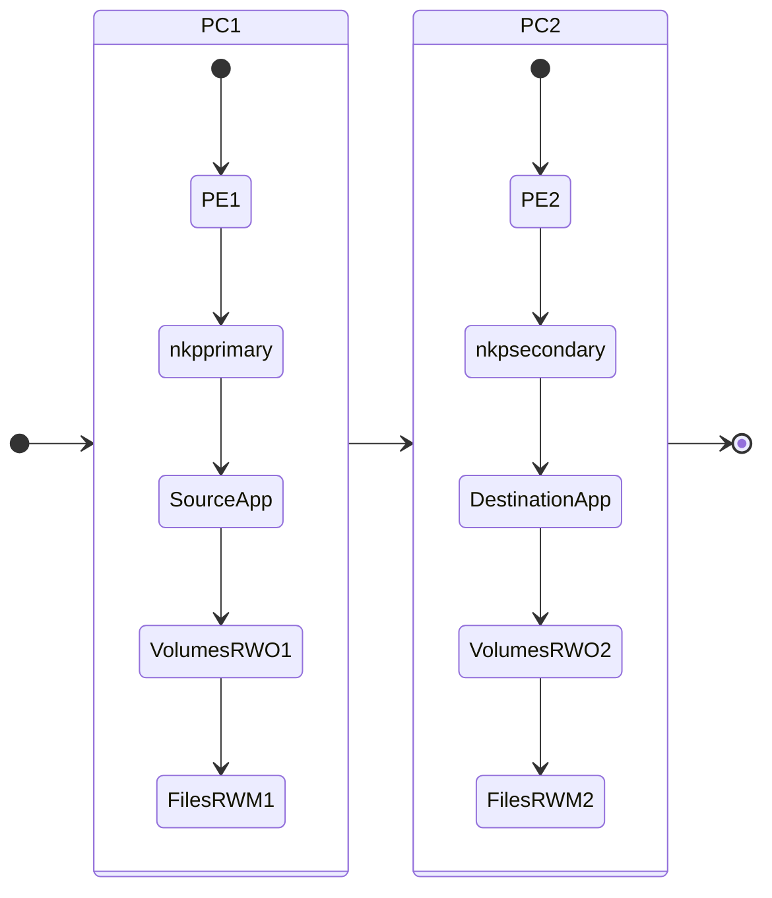

# Replicating and Recovering Application to a Different K8S Cluster

In this section we wil snapshot the Application components, replicate it to a second K8S cluster and recover.


## Design

In this section there is one PC and two individual PE connected. 

Each PE has a NKP cluster. 
Each PE has a Files Server. 

We will be replicating an application (workload) from one NKP cluster in one PC to another NKP cluster in a different PC. The workload stores data in both ``Volumes`` and Dynamic ``Files`` CSI. 

| #           | PC   | PE   | NKP Cluster     | Files Server      |
|-------------|------|------|-----------------|-------------------|
| Source      | PC-1 | PE-1 | ``nkpprimary``  | ``filesprimary``  |
| Destination |      | PE-2 | ``nkpsecondary``| ``filessecondary``|

The following is the flow of the application recovery. 



## Setup Destination NKP in Primary PC/PE/K8s

Make sure to name your NKP cluster appropriately so it is easy to identify

For the purposes of this lab, we will call the source NKP cluster as ``nkpsecondary``

> Follow instructions in [NKP Deployment](../infra/infra_nkp.md) to setup destination/secondary NKP K8s cluster.

### Replication Custom Resources

The lab includes configuring the following NDK custom resources:


| Custom Resource                     | Purpose                                           |
|------------------------------------ |---------------------------------------------------|
| ``StorageCluster``                  | Defines the Nutanix storage fabric and UUIDs for secondary NKP cluster |
| ``Remote``                          | Defines a target Kubernetes cluster for replication on the target NKP cluster |
| ``ReplicationTarget``               | Specifies where to replicate an application snapshot. |
|``FileServerReplicationRelationships``|Specfies where to replicate a Files share|
| ``ApplicationSnapshot``             | Snapshot of the application and chosen resources |
| ``ApplicationSnapshotContent``      | Stores content of the application snapshot (location in Nutanix HCI) |
| ``ApplicationSnapshotReplication``  | Triggers snapshot replication to another cluster. |
| ``ApplicationSnapshotRestore``      | Restores an application snapshot. |

## Configure Availability Zones on PCs

To enable replication between two PC and underlying PE, we will need to configure Availability Zone bi-directionally.

1. Logon to Primary PC and go to **Administration** > **Availability Zones**
2. Click on **Connect to Availability Zone**
3. Choose Physical Location and enter the Secondary PC details
   
    - **IP Address for Remote PC** - 10.x.x.x
    - **Username** - admin
    - **Password** - xxxxxxxxxxx
  
4. Click on **Connect**
5. Confirm addition of remote PC
6. Repeat steps 1 - 5 on the remote PC to configure access to Primary PC

## Install NDK on Secondary NKP Cluster
    

1. Login to VSCode Terminal
2. Set you NKP cluster KUBECONFIG

    === ":octicons-command-palette-16: Command"
    
         ```bash
         export KUBECONFIG=$HOME/nkp/_nkp_secondary_cluster_name.conf
         ```
 
    === ":octicons-command-palette-16: Sample Command"
 
         ```bash
         export KUBECONFIG=$HOME/nkp/nkpsecondary.conf
         ```

3. Test connection to ``nkpsecondary`` cluster 
   
    === ":octicons-command-palette-16: Command"
    
         ```bash
         kubectl get nodes -owide
         ```
 
    === ":octicons-command-palette-16: Command output"
 
         ```bash
         ~ ❯ kubectl get nodes

         NAME                            STATUS   ROLES           AGE   VERSION
         nkpsec-md-0-fdrzg-clvf9-2gnqc   Ready    <none>          24h   v1.32.3
         nkpsec-md-0-fdrzg-clvf9-9msmd   Ready    <none>          24h   v1.32.3
         nkpsec-md-0-fdrzg-clvf9-hnjlm   Ready    <none>          24h   v1.32.3
         nkpsec-md-0-fdrzg-clvf9-t8t4l   Ready    <none>          24h   v1.32.3
         nkpsec-rhdh8-2xs7z              Ready    control-plane   24h   v1.32.3
         nkpsec-rhdh8-srm6h              Ready    control-plane   24h   v1.32.3
         nkpsec-rhdh8-wxbd9              Ready    control-plane   24h   v1.32.3
         ```

4. Install NDK

    === ":octicons-command-palette-16: Command"

         ```bash
         helm repo add ntnx-charts https://nutanix.github.io/helm-releases/ && helm repo update ntnx-charts
         ```
         ```bash
         helm install ndk -n ntnx-system ntnx-charts/ndk \
         --version 2.0.0 \
         --set imageCredentials.credentials.username=$DOCKER_USERNAME \
         --set imageCredentials.credentials.password=$DOCKER_PASSWORD \
         --set config.secret.name=nutanix-csi-credentials \
         --set tls.server.enable=false
         ```

    === ":octicons-command-palette-16:  Sample Command"
        
         ```{ .text .no-copy }
         helm repo add ntnx-charts https://nutanix.github.io/helm-releases/ && helm repo update ntnx-charts
         ```
         ```{ .text .no-copy }
         helm install ndk -n ntnx-system ntnx-charts/ndk \
         --version 2.0.0 \
         --set imageCredentials.credentials.username=nutanixndk \
         --set imageCredentials.credentials.password=dckr_pat_xxxxxxxxxxxxxxxxxxxxxxxxx \
         --set config.secret.name=nutanix-csi-credentials \
         --set tls.server.enable=false
         ```

    === ":octicons-command-palette-16: Command output"
    
         ```{ .text .no-copy }
         Release "ndk" does not exist. Installing it now.
         NAME: ndk
         LAST DEPLOYED: Mon Jul  7 06:33:28 2025
         NAMESPACE: ntnx-system
         STATUS: deployed
         REVISION: 1
         TEST SUITE: None
         ```

5. Check if all NDK custom resources are running (4 of 4 containers should be running inside the ``ndk-controller-manger`` pod)
   
    === ":octicons-command-palette-16: Command"

         ```bash
         kubens ntnx-system
         kubectl get all -l app.kubernetes.io/name=ndk
         ```

    === ":octicons-command-palette-16:  Command Output"
        
         ```text hl_lines="6 15 18"
         Active namespace is "ntnx-system".
 
         ~ ❯ kubectl get all -l app.kubernetes.io/name=ndk
 
         NAME                                          READY   STATUS    RESTARTS   AGE
         pod/ndk-controller-manager-57fd7fc56b-gg5nl   4/4     Running   0          19m
 
         NAME                                             TYPE           CLUSTER-IP       EXTERNAL-IP    PORT(S)          AGE
         service/ndk-controller-manager-metrics-service   ClusterIP      10.109.134.126   <none>         8443/TCP         19m
         service/ndk-intercom-service                     LoadBalancer   10.99.216.62     10.122.7.212   2021:30258/TCP   19m
         service/ndk-scheduler-webhook-service            ClusterIP      10.96.174.148    <none>         9444/TCP         19m
         service/ndk-webhook-service                      ClusterIP      10.107.189.171   <none>         443/TCP          19m
 
         NAME                                     READY   UP-TO-DATE   AVAILABLE   AGE
         deployment.apps/ndk-controller-manager   1/1     1            1           19m
 
         NAME                                                DESIRED   CURRENT   READY   AGE
         replicaset.apps/ndk-controller-manager-57fd7fc56b   1         1         1       19m
         ```

6. Get ``uuid`` of secondary PC and PE using the following command

    === ":octicons-command-palette-16:  Template Command"

        ```bash
        kubectl get node _any_nkp_node_name -o jsonpath='{.metadata.labels}' | grep -o 'csi\.nutanix\.com/[^,]*' 
        ```
    
    === ":octicons-command-palette-16:  Sample .command"
        
        ```text
        kubectl get node nkpsecondary-md-0-fdrzg-clvf9-t8t4l -o jsonpath='{.metadata.labels}' | grep -o 'csi\.nutanix\.com/[^,]*' 
        ```
    === ":octicons-command-palette-16:  Command output"
        
        ```text hl_lines="3 4"
        ~ ❯ kubectl get node nkpsecondary-md-0-fdrzg-clvf9-t8t4l -o jsonpath='{.metadata.labels}' | grep -o 'csi\.nutanix\.com/[^,]*' 

        csi.nutanix.com/prism-central-uuid":"cb5ca4e1-29d4-4a6f-91c7-xxxxxxxxxxxx"
        csi.nutanix.com/prism-element-uuid":"000639fd-8cfa-9bf4-3d70-xxxxxxxxxxxx"
        ```

7. Add (append) the following environment variables and save it
   
    === ":octicons-file-code-16: Template .env"

        ```text
        export SECONDARY_PRISM_ELEMENT_UUID=_pe_uuid_from_previous_commands
        export SECONDARY_SC_NAME=_storage_cluster_name
        export NDK_REPLICATION_CLUSTER_NAME=_secondary_cluster_name
        export KUBECONFIG=$HOME/nkp/_nkp_secondary_cluster_name.conf
        ```
    
    === ":octicons-file-code-16: Sample .env"
        
        ```text
        export SECONDARY_PRISM_ELEMENT_UUID=00062f20-b2e0-fa8e-4b04-xxxxxxxxxx
        export SECONDARY_SC_NAME=secondary-storage-cluster
        export NDK_REPLICATION_CLUSTER_NAME=nkpsecondary
        export KUBECONFIG=$HOME/nkp/nkpsecondary.conf
        ```

8. Note and export the external  IP assigned to the NDK intercom service on the Primary Cluster

    ```bash
    export SECONDARY_NDK_IP=$(kubectl get svc -n ntnx-system ndk-intercom-service -o jsonpath='{.status.loadBalancer.ingress[0].ip}')
    echo $SECONDARY_NDK_IP
    ```

9. Add (append) the following environment variables file ``$HOME/ndk/.env`` and save it
   
    === ":octicons-file-code-16: Template .env"

        ```text
        export SECONDARY_NDK_PORT=2021
        export SECONDARY_NDK_IP=$(kubectl get svc -n ntnx-system ndk-intercom-service -o jsonpath='{.status.loadBalancer.ingress[0].ip}')
        ```
 
10. Source the ``.env`` file
    
    === ":octicons-command-palette-16: Command"
    
         ```bash
         source $HOME/ndk/.env
         ```

11. Create the StorageCluster custom resource
   
    === ":octicons-command-palette-16: Command"

         ```bash
         kubectl apply -f -<<EOF
         apiVersion: dataservices.nutanix.com/v1alpha1
         kind: StorageCluster
         metadata:
          name: $SECONDARY_SC_NAME
         spec:
          storageServerUuid: $SECONDARY_PRISM_ELEMENT_UUID
          managementServerUuid: $PRIMARY_PRISM_CENTRAL_UUID
         EOF
         ```

    === ":octicons-command-palette-16: Command Output"

         ```bash
         storagecluster.dataservices.nutanix.com/secondary-storage-cluster created
         ```

12. Find and configure secondary NDK IP and port number 
    
Now we are ready to create local cluster snapshots and snapshot restores using the following NDK custom resources:


- [x] 1 ``ApplicationSnapshot``  (created in the previous section)
- [ ] 2 ``ApplicationSnapshotReplication``and
- [ ] 3 ``ApplicationSnapshotRestore``

## NDK Recover to the Secondary NKP Cluster

Since we have a sample workload configured on the primary NKP cluster, we will:

1. Configure remote NKP cluster on the primary NKP cluster (using ``Remote`` ``ReplicationTarget`` custom resources)
2. Replicate the snapshot of the sample workload from the primary NKP to secondary NKP  (using ``ApplicationSnapshotReplication`` custom resource)
3. Restore the replicated snapshot on the secondary NKP to get the workloads (using ``ApplicationSnapshotRestore`` custom resource)

### Create Remote Cluster on Primary NKP Cluster


1. Switch context to primary NKP cluster ``nkpprimary``
   
    === ":octicons-command-palette-16: Command"

        ```bash
        export KUBECONFIG=$HOME/nkp/_nkp_primary_cluster_name.conf
        ```
 
    === ":octicons-command-palette-16: Sample Command"
 
         ```bash
         export KUBECONFIG=$HOME/nkp/nkpprimary.conf
         ```

2. Create the Remote resource on the primary NKP cluster
   
    === ":octicons-command-palette-16: Command"
 
          ```text
          kubectl apply -f - <<EOF
          apiVersion: dataservices.nutanix.com/v1alpha1
          kind: Remote
          metadata:
            name: ${NDK_REPLICATION_CLUSTER_NAME}
          spec:
            ndkServiceIp: ${SECONDARY_NDK_IP}
            ndkServicePort: ${SECONDARY_NDK_PORT}
          EOF
          ```
 
    === ":octicons-command-palette-16:  Sample Command"
        
        ```{ .text .no-copy }
        kubectl apply -f - <<EOF
        apiVersion: dataservices.nutanix.com/v1alpha1
        kind: Remote
        metadata:
          name: nkpsecondary
        spec:
          ndkServiceIp: 10.x.x.32
          ndkServicePort: 2021
        EOF
        ```

    === ":octicons-command-palette-16: Command output"
    
        ```{ .text .no-copy }
        remote.dataservices.nutanix.com/nkpsecondary created
        ```

3. Make sure the ``Remote`` cluster is healthy
   
    === ":octicons-command-palette-16:  Sample Command"
          
          ```{ .text .no-copy }
          kubectl describe remote.dataservices.nutanix.com/nkpsecondary
          ```
  
    === ":octicons-command-palette-16: Command output"
    
        ```text hl_lines="8 9"
        kubectl describe remote.dataservices.nutanix.com/nkpsecondary

        Status:
        Conditions:
            Last Transition Time:  2025-07-16T21:29:38Z
            Message:               
            Observed Generation:   1
            Reason:                Healthy
            Status:                True
            Type:                  Available
        Events:                    <none>
        ```

4. Create the replication target on the primary NKP cluster
   
    === ":octicons-command-palette-16: Command"
 
          ```text
          kubectl apply -f -<<EOF
          apiVersion: dataservices.nutanix.com/v1alpha1
          kind: ReplicationTarget
          metadata:
            name: ${NDK_REPLICATION_CLUSTER_NAME}
            namespace: default
          spec:
            remoteName: ${NDK_REPLICATION_CLUSTER_NAME}
          EOF
          ```
 
    === ":octicons-command-palette-16:  Sample Command"
        
        ```{ .text .no-copy }
        kubectl apply -f -<<EOF
        apiVersion: dataservices.nutanix.com/v1alpha1
        kind: ReplicationTarget
        metadata:
          name: nkpsecondary
          namespace: default
        spec:
          remoteName: nkpsecondary
        EOF
        ```

    === ":octicons-command-palette-16: Command output"
    
        ```{ .text .no-copy }
        replicationtarget.dataservices.nutanix.com/nkpsecondary created
        ```

3. Make sure the ``ReplicationTarget`` is healthy
   
    === ":octicons-command-palette-16:  Sample Command"
          
          ```{ .text .no-copy }
          kubectl describe replicationtarget.dataservices.nutanix.com/nkpsecondary
          ```
  
    === ":octicons-command-palette-16: Command output"
    
        ```text hl_lines="8 9"
        kubectl describe replicationtarget.dataservices.nutanix.com/nkpsecondary

        status:
          conditions:
          - lastTransitionTime: "2025-07-16T21:31:06Z"
            message: ""
            observedGeneration: 1
            reason: Healthy
            status: "True"
            type: Available
        ```

4. Replicate the Snapshot to the Replication Cluster
   
    === ":octicons-command-palette-16: Command"

        ```yaml
        k apply -f -<<EOF
        apiVersion: dataservices.nutanix.com/v1alpha1
        kind: ApplicationSnapshotReplication
        metadata:
          name: wordpress-snap-replication
          namespace: default
        spec:
          applicationSnapshotName: wordpress-app-snapshot # (1)!
          replicationTargetName: ${NDK_REPLICATION_CLUSTER_NAME}
        EOF
        ```

        1.  Use the snapshot object's name from the previous section ``wordpress-app-snapshot``
    
    === ":octicons-command-palette-16: Command output"

         ```bash
         applicationsnapshotreplication.dataservices.nutanix.com/wordpress-snap-replication created
         ```

5. Monitor the progress of the replication and make sure to complete it
   
    === ":octicons-command-palette-16: Command"

         ```bash
         kubectl describe ApplicationSnapshotReplication wordpress-snap-replication
         ```

    === ":octicons-command-palette-16: Command output"

         ```bash hl_lines="23 24"  linenums="1"
         apiVersion: v1
         items:
         - apiVersion: dataservices.nutanix.com/v1alpha1
           kind: ApplicationSnapshotReplication
           metadata:
             creationTimestamp: "2025-12-03T07:58:11Z"
             finalizers:
             - dataservices.nutanix.com/app-snap-replicate
             generation: 1
             name: wordpress-app-snapshot-replication
             namespace: word
             resourceVersion: "24998974"
             uid: 3f755d1a-a777-401e-acfd-9822620d305d
           spec:
             applicationSnapshotName: wordpress-app-snapshot
             replicationTargetName: rt-wordpress-app
           status:
             conditions:
             - lastTransitionTime: "2025-12-03T07:58:43Z"
               message: ""
               observedGeneration: 1
               reason: ReplicationComplete
               status: "True"
               type: Available
             - lastTransitionTime: "2025-12-03T07:58:43Z"
               message: ""
               observedGeneration: 1
               reason: ReplicationComplete
               status: "False"
               type: Progressing
         ```

### Recover Application in Remote NKP Cluster

The following NDK objects will be used in this section

- [x] 1 ``ApplicationSnapshot``  (created in the previous [lab](../nkp_ndk/nkp_ndk_singlek8s_files.md#ndk-snapshot-and-recover-to-the-same-namespace))
- [x] 2 ``ApplicationSnapshotReplication`` (created in the previous section)
- [ ] 3 ``ApplicationSnapshotRestore``

#### Recover from Replicated Snapshot

1. Switch context to secondary NKP cluster ``nkpsecondary``
   
    === ":octicons-command-palette-16: Command"

        ```bash
        export KUBECONFIG=$HOME/nkp/_nkp_secondary_cluster_name.conf
        ```
 
    === ":octicons-command-palette-16: Sample Command"
 
        ```bash
        export KUBECONFIG=$HOME/nkp/nkpsecondary.conf
        ```

2. Confirm if the ``ApplicationSnapshot`` has been replicated in the ``default`` namespace
   
    === ":octicons-command-palette-16: Command"
 
         ```bash
         kubectl get ApplicationSnapshot -n default # (1)!
         ```
         
         1. We are specifically using ``default`` namespace as this is where NDK will replicate the snapshot to 
   
    === ":octicons-command-palette-16: Command output"
 
         ```bash hl_lines="4"
         ~ ❯ kubectl get applicationsnapshot -n default
         #
         NAMESPACE   NAME        AGE   READY-TO-USE   BOUND-SNAPSHOTCONTENT                                  SNAPSHOT-AGE
         default     wordpress-app-snapshot   8m   true           asc-aee3f794-190c-403b-a245-bcac8859bb88-19815381630   8m
         ```

3. Restore the replicated ``ApplicationSnapshot``
   
    === ":octicons-command-palette-16: Command"
 
         ```bash
         # Restore
         kubectl apply -f - <<EOF
         apiVersion: dataservices.nutanix.com/v1alpha1
         kind: ApplicationSnapshotRestore
         metadata:
           name: wordpress-app-restore
         spec:
           applicationSnapshotName: wordpress-app-snapshot
         EOF
         ```
  
    === ":octicons-command-palette-16: Command output"
 
         ```bash
         applicationsnapshotrestore.dataservices.nutanix.com/wordpress-app-restore created
         ```

4. Monitor the restore 

    === ":octicons-command-palette-16: Command"
 
         ```bash
         kubectl get applicationsnapshotrestore.dataservices.nutanix.com/wordpress-app-restore -w
         ```
  
    === ":octicons-command-palette-16: Command output"
 
         ```bash hl_lines="4"
         NAME                    SNAPSHOT-NAME                COMPLETED
         wordpress-app-restore   wordpress-app-snapshot       false
         wordpress-app-restore   wordpress-app-snapshot       false
         wordpress-app-restore   wordpress-app-snapshot       true
         ```

5. Monitor the restore steps to understand the flow
   
    === ":octicons-command-palette-16: Command"
 
         ```bash
         k describe applicationsnapshotrestore.dataservices.nutanix.com/wordpress-app-restore
         ```
  
    === ":octicons-command-palette-16: Command output"
 
         ```bash hl_lines="9 10 15 16 21 22 27 28"
         NAME           SNAPSHOT-NAME   COMPLETED
         status:
         completed: true
         conditions:
         - lastTransitionTime: "2025-07-16T21:57:53Z"
           message: All prechecks passed and finalizers on dependent resources set
           observedGeneration: 1
           reason: PrechecksPassed
           status: "True"
           type: PrechecksPassed
         - lastTransitionTime: "2025-07-16T21:59:00Z"
           message: All eligible application configs restored
           observedGeneration: 1
           reason: ApplicationConfigRestored
           status: "True"
           type: ApplicationConfigRestored
         - lastTransitionTime: "2025-07-16T21:59:15Z"
           message: All eligible volumes restored
           observedGeneration: 1
           reason: VolumesRestored
           status: "True"
           type: VolumesRestored
         - lastTransitionTime: "2025-07-16T21:59:15Z"
           message: Application restore successfully finalised
           observedGeneration: 1
           reason: ApplicationRestoreFinalised
           status: "True"
           type: ApplicationRestoreFinalised
         finishTime: "2025-07-16 21:59:15"
         startTime: "2025-07-16 21:57:52"
         ```

6. Verify if Wordpress app resources (pod,pvc, etc) are restored to the ``default`` namespace
    
    === ":octicons-command-palette-16: Command"
    
         ```bash
         kubectl get all
         ```
         
    === ":octicons-command-palette-16: Command Output"
    
         ```text hl_lines="4 7"
         ~ ❯ kubectl get all

         NAME                                   READY   STATUS    RESTARTS   AGE
         pod/wordpress-6bc48cbf79-862wm         1/1     Running   0          6m
         pod/wordpress-mysql-7bd9d456c5-hxjr7   1/1     Running   0          6m
         
         NAME                      TYPE        CLUSTER-IP      EXTERNAL-IP   PORT(S)    AGE
         service/wordpress         ClusterIP   10.109.161.32   <none>        80/TCP     6m
         service/wordpress-mysql   ClusterIP   None            <none>        3306/TCP   6m
         
         NAME                              READY   UP-TO-DATE   AVAILABLE   AGE
         deployment.apps/wordpress         1/1     1            1           6m
         deployment.apps/wordpress-mysql   1/1     1            1           6m
         
         NAME                                         DESIRED   CURRENT   READY   AGE
         replicaset.apps/wordpress-6bc48cbf79         1         1         1       6m
         replicaset.apps/wordpress-mysql-7bd9d456c5   1         1         1       6m
         ```

7.  Login to Wordpress GUI to check if the deleted user is now present

    

We have successfully replicated application data to a secondary NKP cluster and recovered it using NDK. 

We have used the following NDK objects to achieve our cross-namespace application recovery.

- [x] 1 ``ApplicationSnapshot``  (created in the previous [lab](../nkp_ndk/nkp_ndk_singlek8s_files.md#ndk-snapshot-and-recover-to-the-same-namespace))
- [x] 2 ``ApplicationSnapshotReplication`` (created in the previous section)
- [x] 4 ``ApplicationSnapshotRestore``

## Cross Namespace Recovery

Since the ``applicationSnapshot`` got replicated to ``default`` namespace, we might ideally want to restore it to the same ``wordpress`` namespace.

The following NDK objects will be used in this section

- [x] 1 ``ApplicationSnapshot``  (created in the previous [lab](../nkp_ndk/nkp_ndk_singlek8s_files.md#ndk-snapshot-and-recover-to-the-same-namespace))
- [x] 2 ``ApplicationSnapshotReplication`` (created in the previous section)
- [ ] 3 ``ReferenceGrant``
- [ ] 4 ``ApplicationSnapshotRestore``

!!! info
    
    NDK offers cross-namespace recovery capabilites. With this NKP or any supported kubernetes platform administrator can recover ``applicationSnapshot`` custom resource to a different namespace.

We will go through the process of cross-namespace restore in this section.

1. Create a referenceGrant resouce to grant permission to restore specific application snapshots from one namespace to another.
   
    === ":octicons-command-palette-16: Template Command"
    
         ```bash
         kubectl apply -f - <<EOF
         apiVersion: gateway.networking.k8s.io/v1beta1
         kind: ReferenceGrant
         metadata:
           name: _reference_grant_name
           namespace: _source_namespace
         spec:
           from:
           - group: dataservices.nutanix.com
             kind: ApplicationSnapshotRestore
             namespace: _target_namespace
           to:
           - group: dataservices.nutanix.com
             kind: ApplicationSnapshot
             name: _appplication_snapshot_name
         EOF
         ```
    === ":octicons-command-palette-16: Sample Command"
    
         ```bash
         kubectl apply -f - <<EOF
         apiVersion: gateway.networking.k8s.io/v1beta1
         kind: ReferenceGrant
         metadata:
           name: wordpress-cross-ns-rg
           namespace: default
         spec:
           from:
           - group: dataservices.nutanix.com
             kind: ApplicationSnapshotRestore
             namespace: wordpress
           to:
           - group: dataservices.nutanix.com
             kind: ApplicationSnapshot
             name: wordpress-app-snapshot
         EOF
         ```
    === ":octicons-command-palette-16: Command output"
    
         ```bash
         referencegrant.gateway.networking.k8s.io/wordpress-cross-ns-rg created
         ```

2. Create a target namespace
   
    === ":octicons-command-palette-16: Template Command"
    
         ```bash
         kubectl create namespace wordpress
         kubens wordpress
         ```
    === ":octicons-command-palette-16: Sample Command"
    
         ```{ .text .no-copy }
         namespace/wordpress created

         Context "nkplb-admin@nkplb" modified.
         Active namespace is "wordpress".
         ```

3. Create and ``applicationSnapshotRestore`` custom resource to restore to target ``wordpress`` namespace

    === ":octicons-command-palette-16: Template Command"
    
         ```bash
         kubectl apply -f - <<EOF
         apiVersion: dataservices.nutanix.com/v1alpha1
         kind: ApplicationSnapshotRestore
         metadata:
          name: _restore-snapshot-name
          namespace: _target_namespace
         spec:
          applicationSnapshotName: _snapshot_name
          applicationSnapshotNamespace: _snapshot_source_namespace
         EOF
         ```

    === ":octicons-command-palette-16: Sample Command"
    
         ```bash
         kubectl apply -f - <<EOF
         apiVersion: dataservices.nutanix.com/v1alpha1
         kind: ApplicationSnapshotRestore
         metadata:
          name: wordpress-wordpress-cross-ns-asr
          namespace: restore
         spec:
          applicationSnapshotName: wordpress-app-snapshot
          applicationSnapshotNamespace: default
         EOF
         ```


5. Monitor the progress of ``ApplicationSnapshotRestore`` custom resource
   
    === ":octicons-command-palette-16: Command"
    
         ```bash
         kubectl describe applicationsnapshotrestore.dataservices.nutanix.com/wordpress-cross-ns-asr
         ```
         ```bash
         kubectl get applicationsnapshotrestore.dataservices.nutanix.com/wordpress-wordpress-cross-ns-asr -w
         ```

    === ":octicons-command-palette-16: Command Output"
    
         ```text title="Wait until the status of ApplicationSnapshotRestore custom resource is true"
         Name:         wordpress-cross-ns-asr
         Namespace:    restore

         API Version:  dataservices.nutanix.com/v1alpha1
         Kind:         ApplicationSnapshotRestore
         Metadata:
         Creation Timestamp:  2025-07-08T05:40:31Z
         Finalizers:
             dataservices.nutanix.com/application-restore
         Generation:        1
         Resource Version:  7484636

         Spec:
         Application Snapshot Name:       app1-snap
         Application Snapshot Namespace:  default
         Status:
         Completed:  true

         Conditions:
             Last Transition Time:  2025-07-08T05:40:31Z
             Message:               
             Observed Generation:   1
             Reason:                RequestCompleted
             Status:                False
             Type:                  Progressing
             Last Transition Time:  2025-07-08T05:40:31Z
             Message:               All prechecks passed and finalizers on dependent resources set
             Observed Generation:   1
             Reason:                PrechecksPassed
             Status:                True
             Type:                  PrechecksPassed
             Last Transition Time:  2025-07-08T05:40:31Z
             Message:               Restore requests for all eligible volumes submitted
             Observed Generation:   1
             Reason:                VolumeRestoreRequestsSubmitted
             Status:                True
             Type:                  VolumeRestoreRequestsSubmitted
             Last Transition Time:  2025-07-08T05:41:32Z
             Message:               All eligible application configs restored
             Observed Generation:   1
             Reason:                ApplicationConfigRestored
             Status:                True
             Type:                  ApplicationConfigRestored
             Last Transition Time:  2025-07-08T05:41:47Z
             Message:               All eligible volumes restored
             Observed Generation:   1
             Reason:                VolumesRestored
             Status:                True
             Type:                  VolumesRestored
             Last Transition Time:  2025-07-08T05:41:47Z
             Message:               Application restore successfully finalised
             Observed Generation:   1
             Reason:                ApplicationRestoreFinalised
             Status:                True
             Type:                  ApplicationRestoreFinalised
         Finish Time:             2025-07-08 05:41:47
         Start Time:              2025-07-08 05:40:31
         ```
         ```text
         kubectl get applicationsnapshotrestore/wordpress-cross-ns-asr -w
         NAME           SNAPSHOT-NAME   COMPLETED
         wordpress-cross-ns-asr   app1-snap       true
         ```

6. Verify if Wordpress app resources (pod,pvc, etc) are restored to the ``default`` namespace
    
    === ":octicons-command-palette-16: Command"
    
         ```bash
         kubectl get all
         ```
         
    === ":octicons-command-palette-16: Command Output"
    
         ```text hl_lines="4 7"
         ~ ❯ kubectl get all

         NAME                                   READY   STATUS    RESTARTS   AGE
         pod/wordpress-6bc48cbf79-862wm         1/1     Running   0          6m
         pod/wordpress-mysql-7bd9d456c5-hxjr7   1/1     Running   0          6m
         
         NAME                      TYPE        CLUSTER-IP      EXTERNAL-IP   PORT(S)    AGE
         service/wordpress         ClusterIP   10.109.161.32   <none>        80/TCP     6m
         service/wordpress-mysql   ClusterIP   None            <none>        3306/TCP   6m
         
         NAME                              READY   UP-TO-DATE   AVAILABLE   AGE
         deployment.apps/wordpress         1/1     1            1           6m
         deployment.apps/wordpress-mysql   1/1     1            1           6m
         
         NAME                                         DESIRED   CURRENT   READY   AGE
         replicaset.apps/wordpress-6bc48cbf79         1         1         1       6m
         replicaset.apps/wordpress-mysql-7bd9d456c5   1         1         1       6m
         ```

7.  Login to Wordpress GUI to check if the deleted user is now present

    

We have used the following NDK objects to achieve our cross-namespace application recovery.

- [x] 1 ``ApplicationSnapshot``  (created in the previous [lab](../nkp_ndk/nkp_ndk_singlek8s_files.md#ndk-snapshot-and-recover-to-the-same-namespace))
- [x] 2 ``ApplicationSnapshotReplication`` (created in the previous section)
- [x] 3 ``ReferenceGrant``
- [x] 4 ``ApplicationSnapshotRestore``
