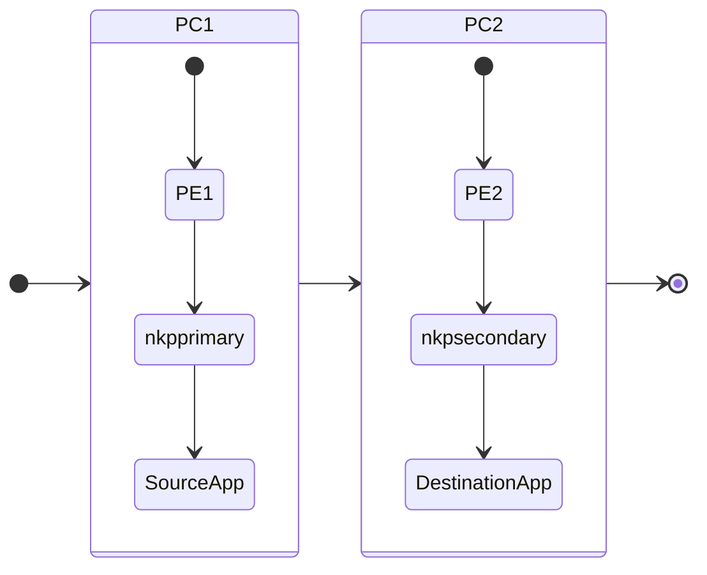

# Replicating and Recovering Application to a Different K8S Cluster

In this section we wil snapshot the Application components, replicate it to a second K8S cluster and recover.


## Design

In this section there are two PC and individual PE connected. Each PE has a NKP cluster. 

We will be replicating application from one NKP cluster in one PC to another NKP cluster in a different PC.

| #           | PC   | PE   | NKP Cluster  |
|-------------|------|------|--------------|
| Source      | PC-1 | PE-1 | ``nkpprimary``   |
| Destination | PC-2 | PE-2 | ``nkpsecondary`` |

The following is the flow of the application recovery. 



## Setup Destination NKP in Primary PC/PE/K8s

Make sure to name your NKP cluster appropriately so it is easy to identify

For the purposes of this lab, we will call the source NKP cluster as ``nkpsecondary``

> Follow instructions in [NKP Deployment](../infra/infra_nkp.md) to setup destination/secondary NKP K8s cluster.

### Replication Custom Resources

The steps include configuring the following NDK custom resources:


| Custom Resource                    | Purpose                                           |
|------------------------------------|---------------------------------------------------|
| ``StorageCluster``                 | Defines the Nutanix storage fabric and UUIDs for secondary NKP cluster |
| ``Remote``                         | Defines a target Kubernetes cluster for replication on the target NKP cluster |
| ``ReplicationTarget``              | Specifies where to replicate an application snapshot. |
| ``ApplicationSnapshotReplication`` | Triggers snapshot replication to another cluster. |
| ``ApplicationSnapshotRestore``     | Restores an application snapshot. |

## Configure Availability Zones on PCs

To enable replication between two PC and underlying PE, we will need to configure Availability Zone bi-directionally.

1. Logon to Primary PC and go to **Administration** > **Availability Zones**
2. Click on **Connect to Availability Zone**
3. Choose Physical Location and enter the Secondary PC details
   
    - **IP Address for Remote PC** - 10.x.x.x
    - **Username** - admin
    - **Password** - xxxxxxxxxxx
  
4. Click on **Connect**
5. Confirm addition of remote PC
6. Repeat steps 1 - 5 on the remote PC to configure access to Primary PC

## Install NDK on Secondary NKP Cluster
    

1. Login to VSCode Terminal
2. Set you NKP cluster KUBECONFIG

    === ":octicons-command-palette-16: Command"
    
         ```bash
         export KUBECONFIG=$HOME/nkp/_nkp_secondary_cluster_name.conf
         ```
 
    === ":octicons-command-palette-16: Sample Command"
 
         ```bash
         export KUBECONFIG=$HOME/nkp/nkpsecondary.conf
         ```

3. Test connection to ``nkpsecondary`` cluster 
   
    === ":octicons-command-palette-16: Command"
    
         ```bash
         kubectl get nodes -owide
         ```
 
    === ":octicons-command-palette-16: Sample Command"
 
         ```bash
         $ kubectl get nodes

         NAME                            STATUS   ROLES           AGE   VERSION
         nkpsec-md-0-fdrzg-clvf9-2gnqc   Ready    <none>          24h   v1.32.3
         nkpsec-md-0-fdrzg-clvf9-9msmd   Ready    <none>          24h   v1.32.3
         nkpsec-md-0-fdrzg-clvf9-hnjlm   Ready    <none>          24h   v1.32.3
         nkpsec-md-0-fdrzg-clvf9-t8t4l   Ready    <none>          24h   v1.32.3
         nkpsec-rhdh8-2xs7z              Ready    control-plane   24h   v1.32.3
         nkpsec-rhdh8-srm6h              Ready    control-plane   24h   v1.32.3
         nkpsec-rhdh8-wxbd9              Ready    control-plane   24h   v1.32.3
         ```

4. Install NDK

    === ":octicons-command-palette-16: Command"

         ```text
         helm upgrade -n ntnx-system --install ndk chart/ \
         --set manager.repository="$IMAGE_REGISTRY/ndk/manager" \
         --set manager.tag=${NDK_VERSION} \
         --set infraManager.repository="$IMAGE_REGISTRY/ndk/infra-manager" \
         --set infraManager.tag=${NDK_VERSION} \
         --set kubeRbacProxy.repository="$IMAGE_REGISTRY/ndk/kube-rbac-proxy" \
         --set kubeRbacProxy.tag=${KUBE_RBAC_PROXY_VERSION} \
         --set bitnamiKubectl.repository="$IMAGE_REGISTRY/ndk/bitnami-kubectl" \
         --set bitnamiKubectl.tag=${KUBECTL_VERSION} \
         --set jobScheduler.repository="$IMAGE_REGISTRY/ndk/job-scheduler" \
         --set jobScheduler.tag=${NDK_VERSION} \
         --set config.secret.name=nutanix-csi-credentials \
         --set tls.server.enable=false
         ```

    === ":octicons-command-palette-16:  Sample Command"
        
         ```{ .text .no-copy }
         helm upgrade -n ntnx-system --install ndk chart/ \
         --set manager.repository="harbor.example.com/nkp/ndk/manager" \
         --set manager.tag=1.2.0 \
         --set infraManager.repository="harbor.example.com/nkp/ndk/infra-manager" \
         --set infraManager.tag=1.2.0 \
         --set kubeRbacProxy.repository="harbor.example.com/nkp/ndk/kube-rbac-proxy" \
         --set kubeRbacProxy.tag=v0.17.0 \
         --set bitnamiKubectl.repository="harbor.example.com/nkp/ndk/bitnami-kubectl" \
         --set bitnamiKubectl.tag=1.30.3 \
         --set jobScheduler.repository="harbor.example.com/nkp/ndk/job-scheduler" \
         --set jobScheduler.tag=1.2.0 \
         --set config.secret.name=nutanix-csi-credentials \
         --set tls.server.enable=false
         ```

    === ":octicons-command-palette-16: Command output"
    
         ```{ .text .no-copy }
         Release "ndk" does not exist. Installing it now.
         NAME: ndk
         LAST DEPLOYED: Mon Jul  7 06:33:28 2025
         NAMESPACE: ntnx-system
         STATUS: deployed
         REVISION: 1
         TEST SUITE: None
         ```

5. Check if all NDK custom resources are running (4 of 4 containers should be running inside the ``ndk-controller-manger`` pod)
   
    === ":octicons-command-palette-16: Command"

         ```bash
         kubens ntnx-system
         k get all -l app.kubernetes.io/name=ndk
         ```

    === ":octicons-command-palette-16:  Sample Command"
        
         ```text hl_lines="6 15 18"
         Active namespace is "ntnx-system".
 
         $ k get all -l app.kubernetes.io/name=ndk
 
         NAME                                          READY   STATUS    RESTARTS   AGE
         pod/ndk-controller-manager-57fd7fc56b-gg5nl   4/4     Running   0          19m
 
         NAME                                             TYPE           CLUSTER-IP       EXTERNAL-IP    PORT(S)          AGE
         service/ndk-controller-manager-metrics-service   ClusterIP      10.109.134.126   <none>         8443/TCP         19m
         service/ndk-intercom-service                     LoadBalancer   10.99.216.62     10.122.7.212   2021:30258/TCP   19m
         service/ndk-scheduler-webhook-service            ClusterIP      10.96.174.148    <none>         9444/TCP         19m
         service/ndk-webhook-service                      ClusterIP      10.107.189.171   <none>         443/TCP          19m
 
         NAME                                     READY   UP-TO-DATE   AVAILABLE   AGE
         deployment.apps/ndk-controller-manager   1/1     1            1           19m
 
         NAME                                                DESIRED   CURRENT   READY   AGE
         replicaset.apps/ndk-controller-manager-57fd7fc56b   1         1         1       19m
         ```

## Configure NDK

The first component we would configure in NDK is ``StorageCluster``. This is used to represent the Nutanix Cluster components including the following:

- Prism Central (PC)
- Prism Element (PE)

By configuring ``StorageCluster`` custom resource with NDK, we are providing Nutanix infrastructure information to NDK.


1. Logon to Jumphost VM Terminal in ``VSCode``

    === ":octicons-command-palette-16: Command"
    
         ```bash
         cd $HOME/ndk
         ```

2. Get ``uuid`` of secondary PC and PE using the following command

    === ":octicons-command-palette-16:  Template Command"

        ```bash
        kubectl get node _any_nkp_node_name -o jsonpath='{.metadata.labels}' | grep -o 'csi\.nutanix\.com/[^,]*' 
        ```
    
    === ":octicons-command-palette-16:  Sample .command"
        
        ```text
        kubectl get node nkpsecondary-md-0-fdrzg-clvf9-t8t4l -o jsonpath='{.metadata.labels}' | grep -o 'csi\.nutanix\.com/[^,]*' 
        ```
    === ":octicons-command-palette-16:  Command output"
        
        ```text hl_lines="3 4"
        $ kubectl get node nkpsecondary-md-0-fdrzg-clvf9-t8t4l -o jsonpath='{.metadata.labels}' | grep -o 'csi\.nutanix\.com/[^,]*' 

        csi.nutanix.com/prism-central-uuid":"cb5ca4e1-29d4-4a6f-91c7-xxxxxxxxxxxx"
        csi.nutanix.com/prism-element-uuid":"000639fd-8cfa-9bf4-3d70-xxxxxxxxxxxx"
        ```

3. Add (append) the following environment variables and save it
   
    === ":octicons-file-code-16: Template .env"

        ```text
        export SECONDARY_PRISM_CENTRAL_UUID=_pc_uuid_from_previous_commands
        export SECONDARY_PRISM_ELEMENT_UUID=_pe_uuid_from_previous_commands
        export SECONDARY_SC_NAME=_storage_cluster_name
        export NDK_REPLICATION_CLUSTER_NAME=_secondary_cluster_name
        export KUBECONFIG=$HOME/nkp/_nkp_secondary_cluster_name.conf
        ```
    
    === ":octicons-file-code-16: Sample .env"
        
        ```text
        export SECONDARY_PRISM_CENTRAL_UUID=ad0f1eb56-9ee6-4469-b21f-xxxxxxxxxx
        export SECONDARY_PRISM_ELEMENT_UUID=00062f20-b2e0-fa8e-4b04-xxxxxxxxxx
        export SECONDARY_SC_NAME=secondary-storage-cluster
        export NDK_REPLICATION_CLUSTER_NAME=nkpsecondary
        export KUBECONFIG=$HOME/nkp/nkpsecondary.conf
        ```

4. Note and export the external  IP assigned to the NDK intercom service on the Primary Cluster

    ```bash
    export SECONDARY_NDK_IP=$(k get svc -n ntnx-system ndk-intercom-service -o jsonpath='{.status.loadBalancer.ingress[0].ip}')
    echo $SECONDARY_NDK_IP
    ```

5. Add (append) the following environment variables file ``$HOME/ndk/.env`` and save it
   
    === ":octicons-file-code-16: Template .env"

        ```text
        export SECONDARY_NDK_PORT=2021
        export SECONDARY_NDK_IP=$(k get svc -n ntnx-system ndk-intercom-service -o jsonpath='{.status.loadBalancer.ingress[0].ip}')
        ```
 
6. Source the ``.env`` file
    
    === ":octicons-command-palette-16: Command"
    
         ```bash
         source $HOME/ndk/.env
         ```

7. Create the StorageCluster custom resource
   
    === ":octicons-command-palette-16: Command"

         ```bash
         kubectl apply -f -<<EOF
         apiVersion: dataservices.nutanix.com/v1alpha1
         kind: StorageCluster
         metadata:
          name: $SECONDARY_SC_NAME
         spec:
          storageServerUuid: $SECONDARY_PRISM_ELEMENT_UUID
          managementServerUuid: $SECONDARY_PRISM_CENTRAL_UUID
         EOF
         ```

    === ":octicons-command-palette-16: Command Output"

         ```bash
         storagecluster.dataservices.nutanix.com/secondary-storage-cluster created
         ```

6. Find and configure secondary NDK IP and port number 

## NDK Recover to the Secondary NKP Cluster

Since we have a sample workload configured on the primary NKP cluster, we will:

1. Configure remote NKP cluster on the primary NKP cluster (using ``Remote`` ``ReplicationTarget`` custom resources)
2. Replicate the snapshot of the sample workload from the primary NKP to secondary NKP  (using ``ApplicationSnapshotReplication`` custom resource)
3. Restore the replicated snapshot on the secondary NKP to get the workloads (using ``ApplicationSnapshotRestore`` custom resource)

### Create Remote Cluster on Primary NKP Cluster


1. Switch context to primary NKP cluster ``nkpprimary``
   
    === ":octicons-command-palette-16: Command"

        ```bash
        export KUBECONFIG=$HOME/nkp/_nkp_primary_cluster_name.conf
        ```
 
    === ":octicons-command-palette-16: Sample Command"
 
         ```bash
         export KUBECONFIG=$HOME/nkp/nkpprimary.conf
         ```

2. Create the Remote resource on the primary NKP cluster
   
    === ":octicons-command-palette-16: Command"
 
          ```text
          kubectl apply -f - <<EOF
          apiVersion: dataservices.nutanix.com/v1alpha1
          kind: Remote
          metadata:
            name: ${NDK_REPLICATION_CLUSTER_NAME}
          spec:
            ndkServiceIp: ${SECONDARY_NDK_IP}
            ndkServicePort: ${SECONDARY_NDK_PORT}
          EOF
          ```
 
    === ":octicons-command-palette-16:  Sample Command"
        
        ```{ .text .no-copy }
        kubectl apply -f - <<EOF
        apiVersion: dataservices.nutanix.com/v1alpha1
        kind: Remote
        metadata:
          name: nkpsecondary
        spec:
          ndkServiceIp: 10.x.x.32
          ndkServicePort: 2021
        EOF
        ```

    === ":octicons-command-palette-16: Command output"
    
        ```{ .text .no-copy }
        remote.dataservices.nutanix.com/nkpsecondary created
        ```

3. Make sure the ``Remote`` cluster is healthy
   
    === ":octicons-command-palette-16:  Sample Command"
          
          ```{ .text .no-copy }
          kubectl describe remote.dataservices.nutanix.com/nkpsecondary
          ```
  
    === ":octicons-command-palette-16: Command output"
    
        ```text hl_lines="8 9"
        kubectl describe remote.dataservices.nutanix.com/nkpsecondary

        Status:
        Conditions:
            Last Transition Time:  2025-07-16T21:29:38Z
            Message:               
            Observed Generation:   1
            Reason:                Healthy
            Status:                True
            Type:                  Available
        Events:                    <none>
        ```

4. Create the replication target on the primary NKP cluster
   
    === ":octicons-command-palette-16: Command"
 
          ```text
          kubectl apply -f -<<EOF
          apiVersion: dataservices.nutanix.com/v1alpha1
          kind: ReplicationTarget
          metadata:
            name: ${NDK_REPLICATION_CLUSTER_NAME}
            namespace: default
          spec:
            remoteName: ${NDK_REPLICATION_CLUSTER_NAME}
          EOF
          ```
 
    === ":octicons-command-palette-16:  Sample Command"
        
        ```{ .text .no-copy }
        kubectl apply -f -<<EOF
        apiVersion: dataservices.nutanix.com/v1alpha1
        kind: ReplicationTarget
        metadata:
          name: nkpsecondary
          namespace: default
        spec:
          remoteName: nkpsecondary
        EOF
        ```

    === ":octicons-command-palette-16: Command output"
    
        ```{ .text .no-copy }
        replicationtarget.dataservices.nutanix.com/nkpsecondary created
        ```

3. Make sure the ``ReplicationTarget`` is healthy
   
    === ":octicons-command-palette-16:  Sample Command"
          
          ```{ .text .no-copy }
          kubectl describe replicationtarget.dataservices.nutanix.com/nkpsecondary
          ```
  
    === ":octicons-command-palette-16: Command output"
    
        ```text hl_lines="8 9"
        kubectl describe replicationtarget.dataservices.nutanix.com/nkpsecondary

        status:
          conditions:
          - lastTransitionTime: "2025-07-16T21:31:06Z"
            message: ""
            observedGeneration: 1
            reason: Healthy
            status: "True"
            type: Available
        ```

4. Replicate the Snapshot to the Replication Cluster
   
    === ":octicons-command-palette-16: Command"

         ```bash
         k apply -f -<<EOF
         apiVersion: dataservices.nutanix.com/v1alpha1
         kind: ApplicationSnapshotReplication
         metadata:
           name: replication-1
           namespace: default
         spec:
           applicationSnapshotName: app1-snap
           replicationTargetName: ${NDK_REPLICATION_CLUSTER_NAME}
         EOF
         ```
    
    === ":octicons-command-palette-16: Command output"

         ```bash
         k apply -f -<<EOF
         apiVersion: dataservices.nutanix.com/v1alpha1
         kind: ApplicationSnapshotReplication
         metadata:
           name: replication-1
           namespace: default
         spec:
           applicationSnapshotName: app1-snap
           replicationTargetName: ${NDK_REPLICATION_CLUSTER_NAME}
         EOF
         ```

5. Monitor the progress of the replication and make sure to complete it
   
    === ":octicons-command-palette-16: Command"

         ```bash
         kubectl describe ApplicationSnapshotReplication replication-1
         ```

    === ":octicons-command-palette-16: Command output"

         ```bash hl_lines="6 7 8"
         Status:
           Conditions:
             Last Transition Time:          2025-07-16T21:51:32Z
             Message:                       
             Observed Generation:           1
             Reason:                        ReplicationComplete
             Status:                        True
             Type:                          Available
             Last Transition Time:          2025-07-16T21:51:32Z
             Message:                       
             Observed Generation:           1
             Reason:                        ReplicationComplete
             Status:                        False
             Type:                          Progressing
           Replication Completion Percent:  100
         ```

### Recover Application in Remote NKP Cluster

1. Switch context to secondary NKP cluster ``nkpsecondary``
   
    === ":octicons-command-palette-16: Command"

        ```bash
        export KUBECONFIG=$HOME/nkp/_nkp_secondary_cluster_name.conf
        ```
 
    === ":octicons-command-palette-16: Sample Command"
 
         ```bash
         export KUBECONFIG=$HOME/nkp/nkpsecondary.conf
         ```

2. Confirm if the ``ApplicationSnapshot`` has been replicated
   
    === ":octicons-command-palette-16: Command"
 
         ```bash
         kubectl get ApplicationSnapshot -n default
         ```
  
    === ":octicons-command-palette-16: Command output"
 
         ```bash hl_lines="4"
         k get applicationsnapshot -n default

         NAMESPACE   NAME        AGE   READY-TO-USE   BOUND-SNAPSHOTCONTENT                                  SNAPSHOT-AGE
         default     app1-snap   8m   true           asc-aee3f794-190c-403b-a245-bcac8859bb88-19815381630   8m
         ```

3. Restore the replicated ``ApplicationSnapshot``
   
    === ":octicons-command-palette-16: Command"
 
         ```bash
         # Restore
         kubectl apply -f - <<EOF
         apiVersion: dataservices.nutanix.com/v1alpha1
         kind: ApplicationSnapshotRestore
         metadata:
           name: app1-restore
         spec:
           applicationSnapshotName: app1-snap
         EOF
         ```
  
    === ":octicons-command-palette-16: Command output"
 
         ```bash
         applicationsnapshotrestore.dataservices.nutanix.com/app1-restore created
         ```

4. Monitor the restore 

    === ":octicons-command-palette-16: Command"
 
         ```bash
         k get applicationsnapshotrestore.dataservices.nutanix.com/app1-restore -w
         ```
  
    === ":octicons-command-palette-16: Command output"
 
         ```bash hl_lines="4"
         NAME           SNAPSHOT-NAME   COMPLETED
         app1-restore   app1-snap       false
         app1-restore   app1-snap       false
         app1-restore   app1-snap       true
         ```

5. Monitor the restore steps to understand the flow
   
    === ":octicons-command-palette-16: Command"
 
         ```bash
         k describe applicationsnapshotrestore.dataservices.nutanix.com/app1-restore
         ```
  
    === ":octicons-command-palette-16: Command output"
 
         ```bash hl_lines="9 10 15 16 21 22 27 28"
         NAME           SNAPSHOT-NAME   COMPLETED
         status:
         completed: true
         conditions:
         - lastTransitionTime: "2025-07-16T21:57:53Z"
           message: All prechecks passed and finalizers on dependent resources set
           observedGeneration: 1
           reason: PrechecksPassed
           status: "True"
           type: PrechecksPassed
         - lastTransitionTime: "2025-07-16T21:59:00Z"
           message: All eligible application configs restored
           observedGeneration: 1
           reason: ApplicationConfigRestored
           status: "True"
           type: ApplicationConfigRestored
         - lastTransitionTime: "2025-07-16T21:59:15Z"
           message: All eligible volumes restored
           observedGeneration: 1
           reason: VolumesRestored
           status: "True"
           type: VolumesRestored
         - lastTransitionTime: "2025-07-16T21:59:15Z"
           message: Application restore successfully finalised
           observedGeneration: 1
           reason: ApplicationRestoreFinalised
           status: "True"
           type: ApplicationRestoreFinalised
         finishTime: "2025-07-16 21:59:15"
         startTime: "2025-07-16 21:57:52"
         ```

6. Verify if app1 pvc and pod are restored
    
    === ":octicons-command-palette-16: Command"
    
         ```bash
         kubectl get po,pvc -l app=app1
         ```
         
    === ":octicons-command-palette-16: Command Output"
    
         ```text hl_lines="4 7"
         $  kubectl get po,pvc -l app=app1

         NAME        READY   STATUS    RESTARTS   AGE
         pod/app-1   1/1     Running   0          4m53s
         
         NAME                               STATUS   VOLUME                                     CAPACITY   ACCESS MODES   STORAGECLASS     VOLUMEATTRIBUTESCLASS   AGE
         persistentvolumeclaim/az-claim-1   Bound    pvc-55a6b812-35de-4db2-b0e1-8a55e1b4e41f   4Gi        RWO            nutanix-volume   <unset>                 5m54s
         ```

7. Check if data is present within the data mount ``/data`` inside the pod

    === ":octicons-command-palette-16: Command"
    
         ```bash
         kubectl exec -it app-1 -- /bin/sh -c "wc -l /data/abc.txt"
         ```
         
    === ":octicons-command-palette-16: Command Output"
    
         ```text hl_lines="2"
         kubectl exec -it app-1 -- /bin/sh -c "wc -l /data/abc.txt"
         10000 /data/abc.txt
         ```

We have successfully replicated application data to a secondary NKP cluster and recovered it using NDK. 